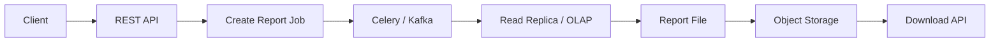
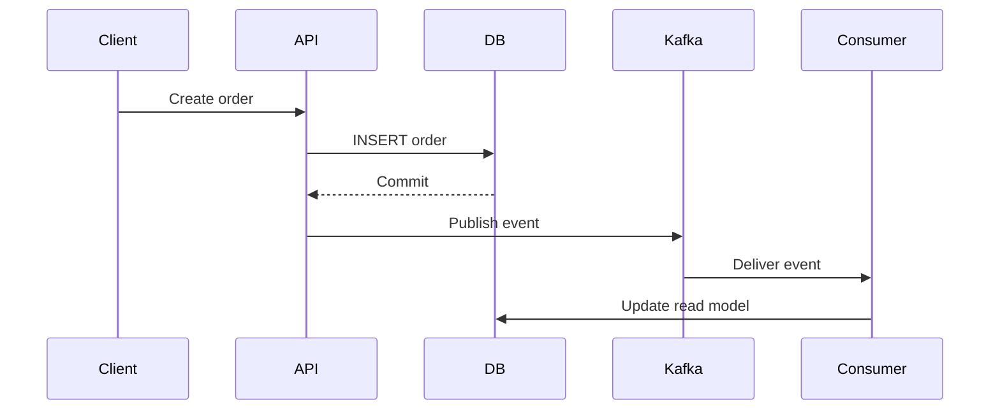
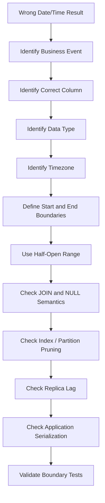
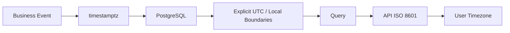

# 11- Date and Time Query Problems

## Overview

Date and time bugs are among the most common SQL production problems because temporal data combines several independent concerns:

- Data type semantics.
- Time zones.
- Precision.
- Inclusive and exclusive boundaries.
- Daylight-saving transitions.
- Application and database time zones.
- Index usage.
- Business-calendar semantics.
- Timestamp serialization across APIs and services.

A query can be syntactically correct and still return the wrong records.

For example:

```sql
SELECT *
FROM app.orders
WHERE created_at BETWEEN '2026-09-01' AND '2026-09-30';
```

This looks reasonable but can be incorrect when `created_at` is a timestamp. The upper bound represents midnight at the beginning of September 30, not the end of that day.

A safer pattern is a half-open interval:

```sql
SELECT *
FROM app.orders
WHERE created_at >= TIMESTAMPTZ '2026-09-01 00:00:00+00'
  AND created_at <  TIMESTAMPTZ '2026-10-01 00:00:00+00';
```

The central principle is:

> **Define the temporal semantics first, then write the SQL.**

---

## PostgreSQL Date and Time Types

PostgreSQL provides several important temporal types.

| Type | Meaning | Typical backend use |
|---|---|---|
| `date` | Calendar date without time | Birth date, business date |
| `time` | Time of day without date | Local business hours |
| `timestamp` | Date and time without time zone | Values whose meaning is intentionally timezone-free |
| `timestamptz` | Instant represented with timezone-aware semantics | Events, transactions, audit timestamps |
| `interval` | Duration | Time windows, retention periods |

A common production choice is:

```sql
created_at timestamptz NOT NULL DEFAULT now()
```

for events representing a real point in time.

---

## timestamp vs timestamptz

PostgreSQL's `timestamp with time zone` (`timestamptz`) represents an **instant in time**.

It does not store an original timezone label such as:

```text
Asia/Kolkata
America/New_York
```

Instead, PostgreSQL normalizes the instant and displays it according to the session timezone.

For example:

```sql
SELECT
    TIMESTAMPTZ '2026-09-04 14:00:00+05:30';
```

and:

```sql
SET TIME ZONE 'UTC';

SELECT TIMESTAMPTZ '2026-09-04 14:00:00+05:30';
```

refer to the same instant, even though the displayed representation can differ.

By contrast:

```sql
timestamp
```

does not represent a timezone-aware instant.

Use it only when the absence of timezone semantics is intentional.

---

## Choosing the Correct Temporal Type

A useful decision table:

| Requirement | Preferred type |
|---|---|
| Event happened at a specific instant | `timestamptz` |
| Created/updated timestamp | `timestamptz` |
| API request timestamp | `timestamptz` |
| Audit event | `timestamptz` |
| User's birthday | `date` |
| Store's recurring opening time | `time` or domain-specific model |
| Duration | `interval` |
| Wall-clock value intentionally independent of timezone | `timestamp` |

Do not choose `timestamp` simply because the application displays dates without offsets.

---

## The Half-Open Interval Pattern

For timestamp filtering, prefer:

```sql
WHERE created_at >= :start
  AND created_at < :end
```

rather than:

```sql
WHERE created_at BETWEEN :start AND :end
```

For a month:

```sql
WHERE created_at >= TIMESTAMPTZ '2026-09-01 00:00:00+00'
  AND created_at <  TIMESTAMPTZ '2026-10-01 00:00:00+00'
```

This avoids precision problems.

The interval is:

```text
[start, end)
```

meaning:

```text
start included
end excluded
```

This pattern composes cleanly:

```text
January: [Jan 1, Feb 1)
February: [Feb 1, Mar 1)
March: [Mar 1, Apr 1)
```

There are no overlapping boundaries and no need to guess the last representable timestamp of a period.

---

## Why BETWEEN Causes Problems

Consider:

```sql
WHERE created_at BETWEEN
    '2026-09-01 00:00:00'
    AND
    '2026-09-30 23:59:59'
```

This assumes the maximum relevant timestamp is:

```text
23:59:59
```

But timestamps can have fractional precision.

A record at:

```text
23:59:59.500
```

can be excluded.

Even if the application currently stores second precision, encoding the end-of-day boundary this way makes the query fragile.

Prefer:

```sql
WHERE created_at >= '2026-09-01'
  AND created_at <  '2026-10-01'
```

with explicit timezone semantics when required.

---

## Day Queries

To retrieve records for a specific UTC date:

```sql
SELECT *
FROM app.orders
WHERE created_at >= TIMESTAMPTZ '2026-09-04 00:00:00+00'
  AND created_at <  TIMESTAMPTZ '2026-09-05 00:00:00+00';
```

The important question is:

> Which timezone defines the day?

A user in India and a user in New York can have different local dates at the same instant.

A production API should define whether the date means:

```text
UTC calendar date
user-local date
tenant-local date
business-location date
```

---

## User-Local Date Filtering

Suppose a customer asks:

> Show orders placed on September 4 in India Standard Time.

The correct approach is to convert the local date boundary into instants.

In PostgreSQL:

```sql
SELECT *
FROM app.orders
WHERE created_at >= TIMESTAMPTZ '2026-09-04 00:00:00+05:30'
  AND created_at <  TIMESTAMPTZ '2026-09-05 00:00:00+05:30';
```

The column remains untouched.

This is important for index usage.

Avoid:

```sql
WHERE created_at::date = DATE '2026-09-04'
```

when the table is large and the query needs to use an index on `created_at`.

---

## Sargability and Date Filtering

This query:

```sql
WHERE created_at::date = DATE '2026-09-04'
```

applies a function to the indexed column.

A range predicate is usually preferable:

```sql
WHERE created_at >= TIMESTAMPTZ '2026-09-04 00:00:00+00'
  AND created_at <  TIMESTAMPTZ '2026-09-05 00:00:00+00'
```

An index such as:

```sql
CREATE INDEX orders_created_at_idx
ON app.orders (created_at);
```

can support the range efficiently.

The general rule is:

```text
Prefer:
column >= boundary
AND column < boundary

over:
function(column) = value
```

when index usage matters.

---

## Functional Indexes

Sometimes a function-based predicate is genuinely part of the application's query contract.

PostgreSQL supports expression indexes:

```sql
CREATE INDEX orders_created_date_idx
ON app.orders ((created_at::date));
```

Then:

```sql
SELECT *
FROM app.orders
WHERE created_at::date = DATE '2026-09-04';
```

may be supported by the expression index.

However, this does not automatically make the expression semantically correct for timezone-aware business dates.

For a user-local date, the desired timezone must be explicitly defined.

A range on the original `timestamptz` column is often simpler and more flexible.

---

## Time Zone Conversion

PostgreSQL supports:

```sql
created_at AT TIME ZONE 'Asia/Kolkata'
```

The exact result type depends on the input type.

For a `timestamptz`:

```sql
SELECT
    created_at AT TIME ZONE 'Asia/Kolkata'
FROM app.orders;
```

returns a local `timestamp` representation.

This is useful for presentation and calendar calculations.

Be careful when using timezone conversion in `WHERE` clauses because converting every row can make indexing less effective.

Prefer calculating boundaries once and comparing the original column against them.

---

## Application Time Zone vs Database Time Zone

A production system can have several timezone contexts:

```text
Browser
    ↓
API
    ↓
Python
    ↓
Database driver
    ↓
PostgreSQL session
    ↓
Stored data
```

The safest architecture for event timestamps is usually:

```text
Store instant consistently
        ↓
Convert for presentation/business calendar
```

Do not allow the server's local timezone to silently define database semantics.

In containers and Kubernetes, explicitly configuring UTC at the infrastructure level can reduce accidental differences.

---

## Python and Django

For timezone-aware applications, Django should use timezone-aware datetimes.

Application code should avoid constructing naive timestamps for database comparisons.

For example:

```python
from datetime import datetime, timezone

start = datetime(2026, 9, 4, tzinfo=timezone.utc)
end = datetime(2026, 9, 5, tzinfo=timezone.utc)

orders = Order.objects.filter(
    created_at__gte=start,
    created_at__lt=end,
)
```

The important property is:

```text
start and end represent explicit instants
```

rather than relying on the host machine's local timezone.

---

## Django Date Filtering

This:

```python
Order.objects.filter(created_at__date=date_value)
```

is convenient but can translate into database-side date extraction.

For large production tables, consider explicit boundaries:

```python
Order.objects.filter(
    created_at__gte=start,
    created_at__lt=end,
)
```

This gives the database a range predicate on the original timestamp column.

Always inspect generated SQL when query performance matters.

---

## FastAPI and SQLAlchemy

A FastAPI service should similarly use timezone-aware Python values.

Example:

```python
from datetime import datetime, timezone
from sqlalchemy import select

start = datetime(2026, 9, 4, tzinfo=timezone.utc)
end = datetime(2026, 9, 5, tzinfo=timezone.utc)

stmt = (
    select(Order)
    .where(
        Order.created_at >= start,
        Order.created_at < end,
    )
)
```

The API contract should define whether incoming timestamps must contain:

```text
Z
```

or an explicit offset.

Rejecting ambiguous client timestamps is generally safer than silently guessing.

---

## ISO 8601 API Timestamps

A backend API should use unambiguous timestamp representations.

Examples:

```text
2026-09-04T14:30:00Z
```

or:

```text
2026-09-04T20:00:00+05:30
```

Avoid ambiguous strings such as:

```text
09/04/2026 14:30
```

because the interpretation can differ between systems.

For APIs:

```text
instant + explicit offset
```

is generally preferable.

---

## Date vs Timestamp API Parameters

Do not confuse:

```http
GET /orders?date=2026-09-04
```

with:

```http
GET /orders?from=2026-09-04T00:00:00Z&to=2026-09-05T00:00:00Z
```

The first represents a calendar-date concept.

The second represents explicit instants.

The API should define:

```text
date semantics
timezone
inclusive/exclusive boundaries
default timezone
```

rather than leaving these decisions implicit.

---

## Daylight Saving Time

Timezone-aware applications must account for daylight-saving transitions.

A local day does not always contain:

```text
24 hours
```

It can contain:

```text
23 hours
```

or:

```text
25 hours
```

depending on the timezone and transition.

Therefore, do not implement:

```text
local day = exactly 24 hours
```

for business-calendar calculations.

For example:

```text
local midnight on one date
→ local midnight on the next date
```

should define the day boundary.

Do not calculate:

```text
end = start + 24 hours
```

when the requirement is a calendar day in a DST-observing timezone.

---

## DST and UTC Storage

Storing event instants as `timestamptz` and converting them for local display simplifies many systems.

The architecture becomes:

```text
Event
 ↓
UTC/instant semantics
 ↓
Database
 ↓
User timezone
 ↓
Presentation
```

The timezone used for presentation or business reporting still matters.

UTC storage does not eliminate timezone reasoning.

---

## Business Date vs Calendar Date

A business may define its day differently from midnight-to-midnight.

For example:

```text
Restaurant business day:
04:00 → next day 04:00
```

The query must use business boundaries:

```sql
WHERE created_at >= :business_day_start
  AND created_at < :business_day_end
```

Do not assume:

```text
business day = calendar day
```

This distinction appears in:

- Retail.
- Hospitality.
- Finance.
- Logistics.
- Batch processing.
- Billing.

---

## Date Truncation

PostgreSQL provides:

```sql
date_trunc()
```

Example:

```sql
SELECT
    date_trunc('month', created_at) AS month,
    COUNT(*) AS order_count
FROM app.orders
GROUP BY date_trunc('month', created_at)
ORDER BY month;
```

This is useful for aggregation.

For timezone-aware reporting, specify the timezone semantics appropriately.

For example, converting an instant into a business timezone before extracting a calendar bucket may be required.

---

## Date Truncation and Indexes

This query:

```sql
WHERE date_trunc('day', created_at) = TIMESTAMP '2026-09-04 00:00:00'
```

can be problematic for a normal index on:

```sql
created_at
```

Prefer:

```sql
WHERE created_at >= TIMESTAMPTZ '2026-09-04 00:00:00+00'
  AND created_at <  TIMESTAMPTZ '2026-09-05 00:00:00+00'
```

For aggregation:

```sql
GROUP BY date_trunc(...)
```

is normal because the expression defines the grouping bucket.

Filtering and grouping have different optimization requirements.

---

## Current Time Functions

PostgreSQL provides several concepts of current time.

Common examples include:

```sql
SELECT CURRENT_TIMESTAMP;
SELECT CURRENT_DATE;
SELECT LOCALTIME;
SELECT LOCALTIMESTAMP;
SELECT clock_timestamp();
```

An important distinction is transaction time versus wall-clock time.

`CURRENT_TIMESTAMP` is tied to the start of the current transaction.

`clock_timestamp()` returns the actual current time when evaluated.

For most transactional application logic:

```sql
CURRENT_TIMESTAMP
```

is preferable because it provides consistent transaction-time semantics.

Use wall-clock functions intentionally when real elapsed time is required.

---

## Time Comparison Problems

Suppose:

```sql
WHERE expires_at < NOW()
```

This is generally straightforward.

But application code can introduce problems when:

```text
database clock
≠
application clock
```

For expiration, leases, and database-side state transitions, database time can be preferable because the comparison happens in one authoritative system.

For example:

```sql
UPDATE app.sessions
SET status = 'expired'
WHERE expires_at < CURRENT_TIMESTAMP
  AND status = 'active';
```

This also provides an atomic database-side transition.

---

## Clock Skew

Distributed systems can have small clock differences:

```text
API server
Worker
Database
Kafka consumer
```

If expiration decisions are made independently by each component, inconsistent behavior can occur.

For critical temporal state:

```text
database timestamp
or
centralized time contract
```

should define the authoritative semantics.

This matters for:

- Expiring sessions.
- Token validation.
- Distributed locks.
- Leases.
- Scheduled jobs.
- Payment windows.
- Idempotency keys.

---

## Date Arithmetic

PostgreSQL supports interval arithmetic:

```sql
SELECT CURRENT_TIMESTAMP + INTERVAL '7 days';
```

and:

```sql
SELECT CURRENT_TIMESTAMP - INTERVAL '30 minutes';
```

This is useful for retention and expiration:

```sql
DELETE FROM app.sessions
WHERE expires_at < CURRENT_TIMESTAMP - INTERVAL '30 days';
```

Be careful with the distinction between:

```text
calendar-relative operations
```

and:

```text
fixed durations
```

They are not always interchangeable around timezone transitions.

---

## INTERVAL Semantics

These can have different business meanings:

```sql
INTERVAL '1 day'
```

versus:

```sql
INTERVAL '24 hours'
```

A day can be interpreted as a calendar-relative unit, while 24 hours is a fixed duration.

For business-calendar calculations, use calendar semantics.

For elapsed-time measurements, use explicit duration semantics.

---

## Date Difference Problems

Subtracting dates:

```sql
SELECT DATE '2026-09-10' - DATE '2026-09-04';
```

produces a number of days.

Subtracting timestamps can produce an interval:

```sql
SELECT
    TIMESTAMPTZ '2026-09-10 12:00:00+00'
    - TIMESTAMPTZ '2026-09-04 08:00:00+00';
```

The result represents elapsed temporal distance.

Choose the operation according to whether the requirement is:

```text
calendar difference
```

or:

```text
elapsed duration
```

---

## Age Calculations

Avoid approximating age with:

```sql
EXTRACT(YEAR FROM age(current_date, birth_date))
```

is generally appropriate when calculating calendar age.

Do not use:

```text
days / 365
```

for age.

Leap years make that approximation incorrect.

Example:

```sql
SELECT
    EXTRACT(YEAR FROM age(CURRENT_DATE, birth_date)) AS age
FROM app.customers;
```

The same distinction applies to employment tenure and other calendar-relative business calculations.

---

## Month-End Problems

Avoid:

```sql
WHERE created_at <= '2026-09-30 23:59:59'
```

Prefer:

```sql
WHERE created_at < '2026-10-01 00:00:00'
```

Month boundaries should be generated from the next period boundary rather than manually constructing the final timestamp.

For aggregation:

```sql
SELECT
    date_trunc('month', created_at) AS month,
    COUNT(*)
FROM app.orders
GROUP BY 1
ORDER BY 1;
```

This naturally groups records by month.

---

## Weekly Reporting Problems

A week is not universally defined.

Possible definitions include:

```text
Sunday → Saturday
Monday → Sunday
ISO week
Business-specific week
```

PostgreSQL's date functions should be used according to the intended business calendar.

For ISO-week reporting, understand:

```text
ISO week number
ISO week year
```

A date near New Year can belong to an ISO week associated with a different calendar year.

Do not group solely by:

```sql
EXTRACT(WEEK FROM created_at)
```

if the report also needs an unambiguous year.

---

## Grouping by Week Safely

A common pattern is:

```sql
SELECT
    date_trunc('week', created_at) AS week_start,
    COUNT(*) AS order_count
FROM app.orders
GROUP BY week_start
ORDER BY week_start;
```

This produces a concrete timestamp representing the week bucket.

For business-local reporting, derive the bucket in the intended timezone rather than allowing the database session timezone to silently determine it.

---

## Timestamp Precision

Temporal comparisons can fail because of precision differences.

For example:

```text
Application:
2026-09-04T14:30:00.123456Z

External system:
2026-09-04T14:30:00Z
```

These are different instants.

Avoid truncating timestamps unless the business requirement explicitly calls for it.

For equality comparisons:

```sql
WHERE created_at = :timestamp
```

can be fragile if timestamps come from different systems.

Range comparisons are often more appropriate.

---

## Equality vs Range Queries

This:

```sql
WHERE created_at = :timestamp
```

requires exact temporal equality.

If the requirement is:

```text
events occurring during a minute
```

use:

```sql
WHERE created_at >= :minute_start
  AND created_at < :minute_end
```

For event matching across distributed systems, define an explicit tolerance only if approximate matching is actually part of the domain.

Do not introduce arbitrary tolerances to hide timestamp-quality problems.

---

## Date Queries and NULL

A NULL timestamp means:

```text
unknown / absent
```

not:

```text
the beginning of time
```

This query:

```sql
WHERE expires_at < CURRENT_TIMESTAMP
```

does not match rows where `expires_at` is NULL.

If NULL means "never expires":

```sql
WHERE expires_at IS NULL
   OR expires_at >= CURRENT_TIMESTAMP
```

The business meaning must be explicit.

---

## NULL and Active Records

Consider:

```sql
SELECT *
FROM app.subscriptions
WHERE expires_at > CURRENT_TIMESTAMP;
```

This excludes:

```text
expires_at IS NULL
```

If NULL means an active subscription with no expiration:

```sql
SELECT *
FROM app.subscriptions
WHERE expires_at IS NULL
   OR expires_at > CURRENT_TIMESTAMP;
```

Do not add `COALESCE` without understanding the domain semantics.

---

## Date Filtering and JOINs

Temporal filters can interact with join semantics.

For example:

```sql
SELECT
    c.id,
    o.id
FROM app.customers AS c
LEFT JOIN app.orders AS o
    ON o.customer_id = c.id
WHERE o.created_at >= :start
  AND o.created_at < :end;
```

The `WHERE` condition eliminates NULL-side rows and effectively turns the outer join into an inner join.

If the requirement is:

```text
all customers
+
orders within date range when present
```

move the filter into the join:

```sql
SELECT
    c.id,
    o.id
FROM app.customers AS c
LEFT JOIN app.orders AS o
    ON o.customer_id = c.id
   AND o.created_at >= :start
   AND o.created_at < :end;
```

This is a common source of "missing records" bugs.

---

## Date Filtering and Soft Deletes

A production query may combine:

```text
created_at
updated_at
deleted_at
status
tenant_id
```

For example:

```sql
SELECT *
FROM app.orders
WHERE tenant_id = :tenant_id
  AND deleted_at IS NULL
  AND created_at >= :start
  AND created_at < :end;
```

Ensure the timestamp being filtered represents the intended business event.

For example:

```text
created_at
```

and:

```text
updated_at
```

answer different questions.

---

## Created At vs Updated At

A common troubleshooting mistake is using:

```sql
WHERE updated_at >= :start
```

when the requirement is:

```text
orders created during the period
```

An order created years ago but modified today will match `updated_at`.

Define the temporal event:

```text
created
paid
shipped
cancelled
completed
updated
```

before choosing the column.

For state transitions, a dedicated event/history table may be more reliable than inferring history from `updated_at`.

---

## Temporal Queries and Indexes

For common filtering:

```sql
WHERE tenant_id = :tenant_id
  AND created_at >= :start
  AND created_at < :end
```

a composite index may be appropriate:

```sql
CREATE INDEX orders_tenant_created_at_idx
ON app.orders (tenant_id, created_at);
```

Column order should reflect actual query patterns.

For multi-tenant systems,:

```text
tenant_id + timestamp
```

is often more useful than a timestamp-only index when every query is tenant-scoped.

Validate with:

```sql
EXPLAIN (ANALYZE, BUFFERS)
```

---

## Temporal Queries and Partitioning

Large event tables are often partitioned by time:

```text
orders_2026_08
orders_2026_09
orders_2026_10
```

A range predicate:

```sql
WHERE created_at >= :start
  AND created_at < :end
```

can enable partition pruning when the partition key and query predicates align.

Functions applied to partition keys or unclear boundary expressions can make pruning less effective.

Use `EXPLAIN` to verify actual partition pruning.

---

## Retention Queries

For data retention:

```sql
DELETE FROM app.audit_events
WHERE occurred_at < CURRENT_TIMESTAMP - INTERVAL '90 days';
```

This can become expensive on a large table.

For high-volume temporal data, consider:

- Time partitioning.
- Partition detach/drop.
- Archival.
- Batch deletion.
- Object storage.
- Lifecycle policies.

Dropping an expired partition can be dramatically cheaper than deleting millions of rows individually.

---

## Large Time-Range Queries

A request such as:

```http
GET /events?from=2020-01-01&to=2026-09-04
```

may be technically valid but operationally dangerous.

Large temporal ranges can produce:

```text
large scans
large result sets
long-running queries
high memory usage
high network traffic
API timeouts
```

Production APIs should define:

- Maximum range.
- Pagination.
- Maximum page size.
- Async export for large reports.
- Appropriate indexes.
- Read-replica or OLAP routing where appropriate.

---

## Async Reporting

For expensive historical reports:



This prevents a large date-range query from occupying an API worker for an extended period.

The job should be:

- Idempotent.
- Observable.
- Retry-safe.
- Bounded.
- Authorization-aware.

---

## Date Queries and Caching

Temporal query results can be cached, but the cache key must include all semantic inputs.

For example:

```text
tenant
timezone
start
end
filters
permissions
```

A cache key that omits timezone can return the wrong local-day result.

For example:

```text
orders:2026-09-04
```

may be insufficient if different users interpret the date in different timezones.

Prefer keys representing the actual query semantics.

---

## Date Queries and Kafka

Event-driven systems introduce additional temporal fields:

```text
event_time
ingestion_time
processing_time
```

These are not interchangeable.

For example:

```text
Event occurred → 10:00
Kafka received → 10:02
Consumer processed → 10:03
```

A report based on business event time should use:

```text
event_time
```

rather than processing time.

Late-arriving events can therefore change historical results.

---

## Event Time vs Processing Time

| Timestamp | Meaning |
|---|---|
| Event time | When the business event occurred |
| Ingestion time | When the system accepted the event |
| Processing time | When a consumer processed it |
| Database time | When the database transaction occurred |

For analytics, explicitly decide which timestamp defines the metric.

This prevents incorrect reports such as:

```text
"Orders placed yesterday"
```

being implemented as:

```text
records processed yesterday
```

---

## Temporal Consistency in Distributed Systems

Consider:



Different timestamps can be generated at different stages.

If the business metric is:

```text
order creation time
```

use the authoritative order event timestamp.

Do not derive business chronology from:

```text
consumer processing timestamp
```

unless that is explicitly the intended metric.

---

## Temporal Queries and Replicas

Read replicas introduce another form of time-related correctness.

An order can be committed on the primary at:

```text
10:00:00
```

while the replica does not replay it until:

```text
10:00:02
```

A user immediately querying:

```text
orders created after 10:00
```

may see different results depending on the database endpoint.

For read-after-write requirements:

- Route to the primary.
- Use an LSN-aware strategy.
- Use a consistency-aware read model.
- Or explicitly accept eventual consistency.

A timestamp predicate does not eliminate replica lag.

---

## Temporal Queries and Transactions

A transaction snapshot can affect what time-based queries observe.

For example:

```sql
BEGIN;

SELECT CURRENT_TIMESTAMP;

-- Additional statements...

COMMIT;
```

`CURRENT_TIMESTAMP` remains tied to the transaction start.

This can be desirable for consistency.

If the application needs actual elapsed wall-clock time, use an appropriate wall-clock function.

Do not confuse:

```text
transaction timestamp
```

with:

```text
physical wall-clock timestamp
```

---

## Testing Date and Time Queries

Temporal queries require boundary-focused tests.

Test:

```text
exact start boundary
exact end boundary
just before start
just before end
fractional seconds
midnight
month boundary
year boundary
leap day
DST transition
different user timezones
NULL timestamps
replica lag
late-arriving events
```

For example:

```text
start = 2026-09-04T00:00:00Z
end   = 2026-09-05T00:00:00Z

included:
2026-09-04T00:00:00Z
2026-09-04T23:59:59.999999Z

excluded:
2026-09-05T00:00:00Z
```

Boundary tests catch many production defects.

---

## Deterministic Time in Tests

Application tests should avoid uncontrolled dependence on the machine clock.

Instead of allowing every component to call the current time independently, use a controlled clock abstraction where appropriate.

For database tests, explicit timestamps make test fixtures easier to reason about:

```sql
INSERT INTO app.orders (
    customer_id,
    created_at
)
VALUES (
    100,
    TIMESTAMPTZ '2026-09-04 12:00:00+00'
);
```

This makes failures reproducible.

---

## Temporal Query Troubleshooting Workflow

Use this sequence:



When debugging a temporal query:

1. Identify exactly what event the timestamp represents.
2. Inspect the column's data type.
3. Inspect stored values with timezone context.
4. Determine the intended business timezone.
5. Convert the requested date into explicit boundaries.
6. Use `[start, end)` semantics.
7. Check whether filtering occurs before or after joins.
8. Check NULL semantics.
9. Check generated SQL from Django/SQLAlchemy.
10. Inspect the execution plan.
11. Verify the database endpoint and replica lag.
12. Test boundary timestamps explicitly.

---

## Diagnostic Queries

Inspect column types:

```sql
SELECT
    column_name,
    data_type
FROM information_schema.columns
WHERE table_schema = 'app'
  AND table_name = 'orders'
  AND column_name IN ('created_at', 'updated_at');
```

Inspect session timezone:

```sql
SHOW TIME ZONE;
```

Inspect current database time:

```sql
SELECT
    CURRENT_TIMESTAMP,
    CURRENT_DATE,
    CURRENT_SETTING('TIMEZONE');
```

Inspect the server endpoint:

```sql
SELECT
    inet_server_addr(),
    inet_server_port(),
    pg_is_in_recovery();
```

These checks are valuable when the application and database appear to disagree about timestamps.

---

## Common Mistakes and Pitfalls

### Using BETWEEN for Full-Day Timestamp Ranges

Problem:

```sql
BETWEEN '2026-09-04 00:00:00'
AND '2026-09-04 23:59:59'
```

This can exclude fractional-second values.

**Fix:** use:

```sql
>= start
AND < next_boundary
```

### Comparing a Timestamp to a Date Without Defining Timezone

A date such as:

```text
2026-09-04
```

does not identify a unique instant.

**Fix:** define the timezone before constructing timestamp boundaries.

### Using `created_at::date` Everywhere

This can prevent efficient use of a normal index.

**Fix:** prefer a range predicate on the original timestamp column when appropriate.

### Treating UTC as the Business Timezone

UTC is useful for storing instants, but business reports may require:

```text
tenant timezone
user timezone
store timezone
```

**Fix:** separate instant storage from calendar interpretation.

### Adding 24 Hours for a Local Day

A local calendar day can be 23 or 25 hours around DST.

**Fix:** calculate local date boundaries rather than assuming a fixed duration.

### Filtering `updated_at` Instead of the Business Event

An old record updated today can appear in today's creation report.

**Fix:** identify the actual event timestamp.

### Ignoring NULL

`NULL` does not satisfy ordinary timestamp comparisons.

**Fix:** explicitly model whether NULL means unknown, not applicable, or "never."

### Filtering an OUTER JOIN in WHERE

A date predicate in `WHERE` can turn a `LEFT JOIN` into an effective inner join.

**Fix:** place relationship-specific filters in the `JOIN ... ON` clause when preserving unmatched rows.

### Assuming Replica Data Is Current

A timestamp predicate does not guarantee the record has reached the replica.

**Fix:** account for replica lag and read-after-write requirements.

### Using Application Time for Critical Database State

Independent application clocks can disagree with database state.

**Fix:** use authoritative database-side timestamps for database-controlled transitions where appropriate.

### Confusing Event Time and Processing Time

Kafka consumers may process old events later.

**Fix:** define which timestamp drives the business metric.

### Comparing Exact Timestamps From Different Systems

Precision and serialization differences can make equality unreliable.

**Fix:** use explicit ranges or a domain-defined tolerance.

### Returning Huge Historical Ranges Synchronously

Large date ranges can create expensive database and network workloads.

**Fix:** paginate or move report generation to asynchronous processing.

### Ignoring Timezone in Cache Keys

A local date can represent different UTC ranges for different timezones.

**Fix:** include timezone and all relevant temporal boundaries in cache semantics.

---

## Performance Checklist

For a production date/time query:

- [ ] Use a sargable range on the timestamp column.
- [ ] Prefer `[start, end)` boundaries.
- [ ] Avoid unnecessary functions on indexed columns.
- [ ] Verify indexes with `EXPLAIN (ANALYZE, BUFFERS)`.
- [ ] Check partition pruning for partitioned tables.
- [ ] Include tenant keys in indexes when queries are tenant-scoped.
- [ ] Avoid unbounded historical API queries.
- [ ] Paginate large result sets.
- [ ] Use read replicas or OLAP infrastructure where appropriate.
- [ ] Move expensive reports to asynchronous jobs.

---

## Security Considerations

Date/time filtering can participate in authorization boundaries.

For example:

```sql
WHERE tenant_id = :tenant_id
  AND created_at >= :start
  AND created_at < :end
```

The tenant restriction must not be omitted merely because the query is "only reporting."

Also consider:

- Row Level Security.
- Tenant-aware cache keys.
- User-specific timezone boundaries.
- Sensitive audit timestamps.
- Export authorization.
- SQL injection in dynamic date filters.
- Rate limiting expensive historical queries.

Always parameterize temporal values:

```python
cursor.execute(
    """
    SELECT *
    FROM app.orders
    WHERE created_at >= %s
      AND created_at < %s
    """,
    [start, end],
)
```

Do not construct SQL with timestamp strings through interpolation.

---

## Reliability and High Availability

Temporal queries often appear in operational workflows:

```text
expiration
retention
billing
scheduled jobs
audit
reconciliation
```

These should remain correct during:

- Database failover.
- Replica lag.
- Application restarts.
- Worker retries.
- Kubernetes rescheduling.
- Clock differences.
- Partial event delivery.

For critical state transitions, combine:

```text
timestamp condition
+
atomic SQL
+
appropriate locking
+
idempotency
```

For example:

```sql
UPDATE app.jobs
SET status = 'expired'
WHERE id = :job_id
  AND status = 'pending'
  AND expires_at < CURRENT_TIMESTAMP;
```

The affected-row count tells the worker whether it successfully performed the transition.

---

## Disaster Recovery Considerations

Temporal correctness also matters during recovery.

After restoring a database:

```text
database state
→ WAL recovery
→ application reconnect
→ background workers resume
```

Jobs based on timestamps can be retriggered or skipped depending on how their state was persisted.

Persist important scheduling state in the database rather than relying only on:

```text
process memory
machine clock
worker startup time
```

After recovery, reconcile:

- Expired records.
- Scheduled jobs.
- Event timestamps.
- Outbox records.
- Kafka offsets.
- Report generation state.

---

## Production Date/Time Architecture

A robust backend architecture separates:

```text
Instant
    ↓
Database storage
    ↓
Business calendar interpretation
    ↓
API representation
    ↓
User presentation
```

For example:



This prevents the common mistake of allowing each layer to independently reinterpret the same timestamp.

---

## Production Design Rules

A practical set of rules:

1. Store real instants using timezone-aware semantics.
2. Treat calendar dates separately from timestamps.
3. Define the timezone for every date-based business requirement.
4. Prefer half-open ranges.
5. Keep timestamp columns unmodified in common range predicates.
6. Use explicit timezone-aware API representations.
7. Distinguish event time from ingestion and processing time.
8. Use database time for database-controlled temporal state where appropriate.
9. Design indexes around actual temporal access patterns.
10. Test boundaries rather than only normal dates.

The goal is not merely to make a timestamp query return rows.

The goal is to make its temporal meaning **unambiguous, deterministic, indexable, and consistent across distributed systems**.

## Key Takeaways

- **Temporal correctness starts with semantics:** identify the business event, temporal data type, timezone, and calendar definition before writing the query.
- **Prefer half-open timestamp ranges:** use `>= start AND < end` instead of manually constructing end-of-day timestamps, avoiding precision and boundary bugs.
- **Keep indexed timestamp columns sargable:** calculate explicit boundaries outside the column expression and verify index or partition behavior with `EXPLAIN`.
- **Separate instants from calendar concepts:** `timestamptz`, local dates, DST, business days, event time, and processing time represent different concepts and must not be silently conflated.
- **Treat date/time queries as distributed-system concerns:** replicas, APIs, Kafka, Celery, caches, application clocks, failover, and reporting workloads can all change temporal correctness.