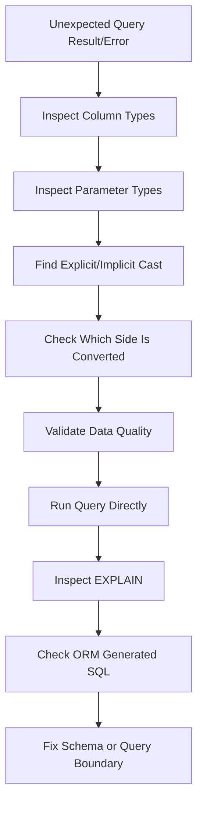

# 12- Type Conversion Problems

## Overview

Type conversion problems occur when SQL values are implicitly or explicitly converted between data types during comparison, computation, joins, inserts, or API-driven queries.

The SQL may be syntactically valid while producing:

- Incorrect results.
- Unexpected NULLs.
- Runtime conversion errors.
- Poor index usage.
- Different behavior across environments.
- Unexpected precision or rounding.
- Failed joins between logically related columns.
- Application/database type mismatches.

Typical backend examples include:

```text
Python int        → PostgreSQL integer
Python Decimal    → numeric
JSON string       → timestamp
HTTP query param  → database numeric
UUID string       → uuid
ORM value         → database column type
```

The important distinction is between:

```text
explicit conversion
```

and:

```text
implicit conversion
```

Explicit conversion is visible in the SQL:

```sql
CAST(order_id AS text)
```

Implicit conversion is introduced by PostgreSQL's type-resolution rules.

Production systems should make important type semantics explicit rather than relying on implicit coercion.

---

## Why Type Conversion Causes Bugs

Consider:

```sql
SELECT *
FROM app.orders
WHERE order_id = '1001';
```

If `order_id` is an integer, PostgreSQL may resolve the comparison by converting the unknown string literal to an integer.

This is different from:

```sql
WHERE order_id::text = '1001'
```

The second expression converts the column itself.

That distinction can affect:

- Query correctness.
- Index usage.
- Planner estimates.
- Join behavior.
- Runtime cost.

A useful debugging question is:

> **Which side of the expression is being converted?**

---

## PostgreSQL Type Categories

Common PostgreSQL types encountered in backend systems include:

| Category | Examples |
|---|---|
| Integer | `smallint`, `integer`, `bigint` |
| Exact numeric | `numeric`, `decimal` |
| Floating point | `real`, `double precision` |
| Text | `text`, `varchar`, `char` |
| Boolean | `boolean` |
| UUID | `uuid` |
| Date/time | `date`, `timestamp`, `timestamptz`, `interval` |
| JSON | `json`, `jsonb` |
| Binary | `bytea` |
| Arrays | `integer[]`, `text[]` |
| Network | `inet`, `cidr` |

The application type and database type should have compatible semantics.

---

## Explicit Casting

PostgreSQL supports:

```sql
CAST(value AS type)
```

and PostgreSQL's shorthand:

```sql
value::type
```

For example:

```sql
SELECT CAST('42' AS integer);
```

or:

```sql
SELECT '42'::integer;
```

Both explicitly convert the value.

Use explicit casts when:

- The intended type is important.
- Multiple candidate types exist.
- Query behavior would otherwise be ambiguous.
- API parameters need normalization.
- You are deliberately changing a type for computation or presentation.

---

## Safe Numeric Conversion

For controlled input:

```sql
SELECT CAST('12345' AS bigint);
```

For invalid input:

```sql
SELECT CAST('abc' AS bigint);
```

PostgreSQL raises an error rather than silently producing a value.

This is desirable for data integrity.

Application code should validate external input before sending it to the database, but database conversion errors should still be handled as part of the application's failure model.

---

## Text to Numeric Problems

Consider:

```sql
SELECT price * 1.2
FROM app.products;
```

If `price` is stored as text, PostgreSQL cannot perform numeric arithmetic directly without conversion.

A deliberate conversion is:

```sql
SELECT price::numeric * 1.2
FROM app.products;
```

However, if `price` logically represents money, storing it as text is a schema-design problem.

Prefer:

```sql
price numeric(12, 2) NOT NULL
```

rather than repeatedly converting:

```sql
price::numeric
```

at query time.

---

## Conversion Errors from Dirty Data

A migration may reveal invalid legacy values:

```text
100.00
250.50
N/A
unknown
```

This can make:

```sql
ALTER TABLE products
ALTER COLUMN price TYPE numeric(12, 2)
USING price::numeric;
```

fail.

Before changing the type, identify invalid rows:

```sql
SELECT id, price
FROM app.products
WHERE price IS NOT NULL
  AND price !~ '^[0-9]+(\.[0-9]+)?$';
```

The exact validation expression should reflect the permitted domain.

For production migrations, clean and validate data before changing the schema.

---

## Integer and Numeric Conversion

Integer arithmetic has different semantics from decimal arithmetic.

For example:

```sql
SELECT 5 / 2;
```

returns integer-style division because both operands are integers.

Use an explicit numeric conversion when fractional results are required:

```sql
SELECT 5::numeric / 2;
```

or:

```sql
SELECT 5 / 2.0;
```

This matters for:

- Percentages.
- Rates.
- Metrics.
- Financial calculations.
- Pagination calculations.
- Aggregations.

---

## Numeric Precision

`numeric` is exact decimal arithmetic, while floating-point types use approximate binary representations.

For financial values:

```sql
amount numeric(12, 2)
```

is generally preferable to:

```sql
amount double precision
```

Do not assume:

```text
numeric
=
floating point
```

They have different precision and performance characteristics.

---

## Integer Overflow

PostgreSQL integer types have different ranges.

| Type | Size | Approximate range |
|---|---:|---|
| `smallint` | 2 bytes | ±32 thousand |
| `integer` | 4 bytes | ±2.1 billion |
| `bigint` | 8 bytes | ±9.2 quintillion |

A production identifier or counter can eventually exceed `integer`.

For high-volume systems, evaluate whether:

```sql
bigint
```

is more appropriate.

Do not change types simply because `bigint` is larger; larger values consume more storage and can affect indexes and memory.

---

## UUID Conversion

If a column is:

```sql
id uuid
```

then this:

```sql
SELECT *
FROM app.users
WHERE id = '550e8400-e29b-41d4-a716-446655440000';
```

can resolve the literal to the UUID type.

Explicitly typed parameters are even clearer at application boundaries.

For example:

```sql
WHERE id = CAST($1 AS uuid)
```

Invalid UUID input should fail validation rather than being transformed into an arbitrary value.

Do not store UUID identifiers as text merely to avoid UUID conversion.

---

## Text vs VARCHAR

In PostgreSQL:

```text
text
varchar
varchar(n)
```

have closely related behavior.

A frequent mistake is converting between them unnecessarily.

For example:

```sql
SELECT name::varchar
FROM app.customers;
```

does not inherently improve performance.

Choose the type based on schema semantics rather than assuming `varchar` is faster than `text`.

If a length limit is a business rule, enforce it intentionally through the schema.

---

## Boolean Conversion Problems

PostgreSQL has a real:

```sql
boolean
```

type.

Prefer:

```sql
WHERE is_active = TRUE
```

or:

```sql
WHERE is_active
```

instead of representing booleans as:

```text
'Y'
'N'
'1'
'0'
```

in text columns.

A database boolean prevents multiple textual representations of the same logical state.

---

## Boolean Input from APIs

HTTP query parameters are strings.

For example:

```http
GET /users?active=true
```

The application receives:

```text
"true"
```

not a native Boolean.

FastAPI/Pydantic can validate the parameter before it reaches SQL.

Django forms/serializers provide similar validation boundaries.

The preferred data flow is:

```text
HTTP string
    ↓
Application validation
    ↓
Python bool
    ↓
Parameterized SQL
    ↓
PostgreSQL boolean
```

Do not rely on database coercion to validate arbitrary API input.

---

## Date and Timestamp Conversion

A string such as:

```text
2026-09-04
```

represents a date, not an unambiguous instant.

Explicitly choose the target type:

```sql
SELECT '2026-09-04'::date;
```

For an instant:

```sql
SELECT '2026-09-04T12:00:00Z'::timestamptz;
```

The distinction matters for timezone-aware backend systems.

Avoid silently converting local dates into UTC timestamps without defining the timezone semantics.

---

## Timestamp and Timezone Problems

Suppose:

```sql
created_at timestamptz
```

and the query uses a local date.

This:

```sql
WHERE created_at::date = DATE '2026-09-04'
```

depends on the session timezone when interpreting the `timestamptz` as a date.

For a specific business timezone, calculate explicit boundaries:

```sql
WHERE created_at >= TIMESTAMPTZ '2026-09-04 00:00:00+05:30'
  AND created_at <  TIMESTAMPTZ '2026-09-05 00:00:00+05:30'
```

This is both clearer and generally more index-friendly.

---

## Numeric to Text Conversion

Explicit conversion:

```sql
SELECT order_id::text
FROM app.orders;
```

is useful when:

- Building a textual response.
- Joining to an intentionally textual external identifier.
- Formatting output.
- Building a display value.

However, avoid converting a database key to text just to make incompatible schemas join.

If two related identifiers have different types, fix the schema or integration boundary where practical.

---

## Type Conversion in JOINs

Consider:

```text
customers.id        bigint
orders.customer_id  text
```

A join may require conversion:

```sql
SELECT *
FROM app.customers AS c
JOIN app.orders AS o
  ON c.id::text = o.customer_id;
```

This can be expensive on large datasets because the indexed `id` column is being transformed.

A better design is:

```text
customers.id        bigint
orders.customer_id  bigint
```

with:

```sql
FOREIGN KEY (customer_id)
REFERENCES app.customers(id)
```

Schema consistency is usually better than query-time conversion.

---

## Join Type Mismatch

Another pattern is:

```sql
ON c.id = o.customer_id::bigint
```

This can be acceptable during controlled migration work but is risky if `customer_id` contains invalid values.

For example:

```text
123
456
unknown
```

causes the cast to fail.

Before changing the schema:

```sql
SELECT customer_id
FROM app.orders
WHERE customer_id IS NOT NULL
  AND customer_id !~ '^[0-9]+$';
```

Then clean the invalid values before enforcing the correct type.

---

## Type Conversion and Indexes

Compare:

```sql
WHERE customer_id = 123
```

with:

```sql
WHERE customer_id::text = '123'
```

If the column is:

```sql
customer_id bigint
```

the second expression transforms the indexed column.

Prefer:

```sql
WHERE customer_id = CAST($1 AS bigint)
```

where appropriate.

The general pattern is:

```text
Convert the parameter
rather than the indexed column
```

when the semantic types are compatible.

---

## Expression Indexes

If a conversion is genuinely required by the application's access pattern, PostgreSQL supports expression indexes.

For example:

```sql
CREATE INDEX customers_external_id_text_idx
ON app.customers ((id::text));
```

Then:

```sql
WHERE id::text = $1
```

can potentially use the expression index.

However, this should not become an excuse for poor schema design.

Expression indexes:

- Consume storage.
- Add write overhead.
- Need maintenance.
- Increase schema complexity.

Prefer matching data types across related columns when possible.

---

## Type Conversion and Query Plans

Use:

```sql
EXPLAIN (ANALYZE, BUFFERS)
```

when investigating conversion-related performance problems.

Look for:

```text
Seq Scan
Index Scan
Bitmap Index Scan
Filter
Rows Removed by Filter
```

A conversion on the indexed column can change the access path.

Example:

```sql
EXPLAIN (ANALYZE, BUFFERS)
SELECT *
FROM app.orders
WHERE customer_id::text = '1001';
```

Compare it with:

```sql
EXPLAIN (ANALYZE, BUFFERS)
SELECT *
FROM app.orders
WHERE customer_id = 1001;
```

Do not assume a cast is expensive; measure the actual plan.

---

## Implicit Type Conversion

PostgreSQL has rules for resolving expressions involving different types.

For example:

```sql
SELECT 1 + 2.5;
```

requires a compatible numeric type.

Similarly:

```sql
SELECT *
FROM app.orders
WHERE order_id = '1001';
```

may resolve the literal according to the column's expected type.

Implicit conversion is convenient but can become problematic when:

- Types are ambiguous.
- Domains differ.
- Functions have overloaded signatures.
- Parameters are untyped.
- Joins use incompatible types.
- Query behavior differs between prepared and literal statements.

For important boundaries, explicit types improve readability and predictability.

---

## Unknown Literals

String literals initially participate in PostgreSQL type resolution as unknown values until context determines an appropriate type.

For example:

```sql
SELECT '2026-09-04';
```

does not by itself communicate the intended domain as clearly as:

```sql
SELECT DATE '2026-09-04';
```

or:

```sql
SELECT TIMESTAMPTZ '2026-09-04T00:00:00Z';
```

Typed literals are useful in complex expressions and production diagnostics.

---

## Parameter Types

Parameterized queries are essential for security, but the database still needs to determine parameter types.

For example:

```python
cursor.execute(
    """
    SELECT *
    FROM app.orders
    WHERE customer_id = %s
    """,
    [customer_id],
)
```

The driver and PostgreSQL protocol participate in determining parameter representation and type behavior.

Application code should provide values using the correct Python/database type rather than sending everything as strings.

---

## Prepared Statements and Type Resolution

Prepared statements make parameter typing particularly important.

For example:

```sql
PREPARE find_order(bigint) AS
SELECT *
FROM app.orders
WHERE order_id = $1;

EXECUTE find_order(1001);
```

The parameter type is explicit:

```text
bigint
```

This can make query semantics clearer and avoid ambiguous type inference.

In production, prepared statements and connection pooling also interact with plan caching, so investigate actual plans rather than relying on assumptions.

---

## JSON and Type Conversion

JSON values often arrive as strings, numbers, booleans, or nulls.

Consider:

```json
{
  "age": 35
}
```

PostgreSQL can extract JSON values as text:

```sql
SELECT payload->>'age'
FROM app.events;
```

The result is text.

For numeric operations:

```sql
SELECT (payload->>'age')::integer
FROM app.events;
```

This conversion can fail if the JSON contains:

```text
"unknown"
```

If a field is frequently queried and has strong schema semantics, consider promoting it to a typed relational column or validating the JSON structure at ingestion.

---

## JSONB Type Problems

Consider:

```sql
WHERE payload->>'customer_id' = 1001
```

The left side is text while the right side is numeric.

Use:

```sql
WHERE payload->>'customer_id' = '1001'
```

or explicitly convert:

```sql
WHERE (payload->>'customer_id')::bigint = 1001
```

The latter may be expensive on large datasets unless the access pattern is supported by an appropriate expression index.

If this field is central to application queries, a relational column may be a better design.

---

## Array Type Conversion

PostgreSQL arrays are strongly typed.

For example:

```sql
SELECT ARRAY[1, 2, 3]::bigint[];
```

This matters when using:

```sql
= ANY(...)
```

For a bigint column:

```sql
WHERE customer_id = ANY($1::bigint[])
```

can make the expected parameter type explicit.

This is preferable to constructing SQL dynamically for an `IN` list.

---

## IN and Parameter Types

Instead of dynamically constructing:

```sql
WHERE id IN (1, 2, 3)
```

from untrusted input, use parameterized values appropriate to the driver.

For PostgreSQL, an array-based pattern can be useful:

```sql
WHERE id = ANY($1::bigint[])
```

The application supplies a typed collection.

This provides:

- Parameterization.
- Explicit typing.
- Cleaner SQL generation.
- Better control over input handling.

---

## NULL and Type Conversion

`NULL` has special semantics.

This:

```sql
CAST(NULL AS integer)
```

produces:

```text
NULL
```

It does not become:

```text
0
```

Similarly:

```sql
CAST(NULL AS text)
```

remains NULL.

Use:

```sql
COALESCE(value, 0)
```

only when the business meaning of NULL should become zero.

Do not use `COALESCE` merely to suppress conversion problems.

---

## COALESCE and Type Resolution

`COALESCE` arguments need compatible types.

For example:

```sql
SELECT COALESCE(price, 0)
FROM app.products;
```

is appropriate when `price` is numeric.

But mixing incompatible types can fail or produce unexpected resolution.

Prefer:

```sql
COALESCE(price, 0::numeric)
```

when explicit typing improves clarity.

---

## CASE Expressions and Types

All branches of a `CASE` expression must resolve to compatible types.

For example:

```sql
SELECT
    CASE
        WHEN status = 'paid' THEN 1
        ELSE 0
    END AS is_paid
FROM app.orders;
```

Both branches are integers.

A problematic expression can arise when branches represent different domains:

```sql
CASE
    WHEN status = 'paid' THEN 1
    ELSE 'unknown'
END
```

The intended result type is ambiguous/incompatible.

Make the output domain explicit instead of mixing unrelated types.

---

## UNION and Type Compatibility

`UNION` requires corresponding columns to have compatible types.

For example:

```sql
SELECT id::bigint
FROM app.customers

UNION

SELECT id::bigint
FROM app.suppliers;
```

If the underlying columns differ:

```text
customers.id → bigint
suppliers.id → text
```

explicit conversion may be necessary.

Do not casually cast identifiers in reporting queries without understanding whether values have identical semantics.

---

## Aggregate Type Conversion

Aggregates can return types different from the input column.

For example:

```sql
SELECT COUNT(*)
FROM app.orders;
```

returns a `bigint`-style count in PostgreSQL.

Do not assume:

```text
COUNT(*) = integer
```

when mapping database results into application models.

Similarly, aggregate expressions involving `numeric`, integers, and averages can have different result types.

Inspect the actual database type when building strict API or serialization contracts.

---

## AVG and Integer Values

Consider:

```sql
SELECT AVG(quantity)
FROM app.order_items;
```

Do not assume the result is an integer merely because `quantity` is an integer.

Averages generally need fractional representation.

When precision matters, explicitly control the numeric type:

```sql
SELECT AVG(quantity::numeric)
FROM app.order_items;
```

This is particularly important for financial and analytical calculations.

---

## Type Conversion in ORDER BY

Dynamic ordering is a common API requirement:

```http
GET /orders?sort=created_at
```

Do not solve it with arbitrary SQL identifier interpolation.

Parameterization works for values, not SQL identifiers.

Use an allowlist in the application:

```python
SORT_COLUMNS = {
    "created_at": Order.created_at,
    "total": Order.total,
}
```

Then select a known expression rather than accepting arbitrary SQL.

Type safety and SQL injection prevention are closely related here.

---

## Type Conversion During Schema Migrations

Changing:

```sql
text
```

to:

```sql
bigint
```

is not simply a type declaration change.

The migration must answer:

```text
Can every existing value be converted?
How long will conversion take?
Will the table be locked?
Will indexes need rebuilding?
Can the application handle both schemas during deployment?
```

For large production tables, use an expand-and-contract strategy when necessary.

---

## Expand-and-Contract Type Migration

A safer migration can be:


For example:

```text
customer_id_text
customer_id_bigint
```

can temporarily coexist.

The application and migration strategy should be designed together.

Do not perform a large blocking conversion blindly during peak traffic.

---

## Data Validation Before Type Migration

Before:

```sql
ALTER TABLE app.orders
ALTER COLUMN customer_id TYPE bigint
USING customer_id::bigint;
```

inspect:

```sql
SELECT customer_id
FROM app.orders
WHERE customer_id IS NOT NULL
  AND customer_id !~ '^[0-9]+$';
```

Then check range constraints if necessary.

For production migrations, validation should happen before the blocking schema change.

---

## ORM Type Mismatches

Django and SQLAlchemy generally map Python values to database types, but the ORM cannot correct a fundamentally inconsistent schema.

Examples of problematic mappings:

```text
Python UUID ↔ text database identifier
Python Decimal ↔ floating-point database value
Python datetime ↔ timestamp without intended timezone
Python bool ↔ arbitrary text flag
```

ORM abstractions can hide SQL type details.

When behavior is unexpected:

1. Inspect the model field.
2. Inspect the database column.
3. Inspect the generated SQL.
4. Inspect bound parameter types where available.
5. Run the SQL directly.
6. Compare the execution plan.

---

## API Type Conversion Boundary

A robust backend separates:

```text
External representation
        ↓
Validation
        ↓
Domain type
        ↓
Database parameter
        ↓
Database column
```

For example:

```text
"1001"
   ↓
validated integer
   ↓
Python int
   ↓
parameterized bigint
   ↓
orders.customer_id bigint
```

Do not allow every layer to independently reinterpret the same value.

---

## Type Conversion and Microservices

Type mismatches become more dangerous across services.

For example:

```text
Service A:
customer_id = UUID

Service B:
customer_id = string

Database:
customer_id = bigint
```

A service may technically convert between these representations while still producing semantically incorrect identifiers.

Shared contracts should define:

- Identifier type.
- Timestamp representation.
- Numeric precision.
- Nullability.
- Enum representation.
- Serialization format.

Schema compatibility should be treated as an API contract.

---

## Type Conversion and gRPC

gRPC provides strongly typed schemas through Protocol Buffers.

That reduces many serialization ambiguities:

```text
int64
string
bool
bytes
Timestamp
```

However, the database may use:

```text
bigint
uuid
timestamptz
numeric
```

The service boundary still needs deliberate mapping.

Do not assume:

```text
protobuf type = database type
```

They are different type systems.

---

## Type Conversion and Redis

Redis primarily exposes strings and byte-oriented representations, even though clients can provide higher-level abstractions.

A value such as:

```text
"1001"
```

must not be assumed to have the same type semantics as:

```text
1001::bigint
```

Cache keys and values should have explicit serialization contracts.

A database value converted to a different representation in Redis can create subtle cache inconsistencies.

---

## Type Conversion and Kafka

Kafka message schemas should explicitly define field types.

For example:

```text
customer_id: int64
created_at: timestamp
amount: decimal
```

The consumer should map these into the database's expected types.

Do not allow a producer to change:

```text
customer_id: int64
```

to:

```text
customer_id: string
```

without a compatibility strategy.

Schema evolution should be coordinated across:

```text
producer
→
Kafka schema
→
consumer
→
database
```

---

## Performance Considerations

Type conversions affect performance primarily when they occur repeatedly across large datasets.

Potentially expensive patterns include:

```sql
WHERE indexed_column::text = :value
```

```sql
JOIN a.id::text = b.id
```

```sql
WHERE (json_payload->>'amount')::numeric > :value
```

These can require per-row expression evaluation.

For large tables:

- Prefer matching schema types.
- Convert parameters instead of indexed columns.
- Use expression indexes only when justified.
- Promote frequently queried JSON values to typed columns.
- Validate with `EXPLAIN (ANALYZE, BUFFERS)`.

---

## Security Considerations

Type conversion is also an input-validation boundary.

Never construct SQL like:

```python
query = f"""
SELECT *
FROM orders
WHERE customer_id = {user_input}
"""
```

Even if the application expects an integer.

Instead:

```python
cursor.execute(
    """
    SELECT *
    FROM app.orders
    WHERE customer_id = %s
    """,
    [customer_id],
)
```

Then validate:

```text
format
range
nullability
domain constraints
```

at the application boundary and enforce important invariants in the database.

---

## Reliability Considerations

A conversion failure should not leave partially applied application state.

For transactional workflows:

```sql
BEGIN;

UPDATE app.orders
SET customer_id = CAST($1 AS bigint)
WHERE id = $2;

COMMIT;
```

If the conversion fails, the transaction can be rolled back.

For batch jobs, isolate invalid records when the business process permits it rather than allowing one malformed record to repeatedly crash the entire workload.

---

## Monitoring Type Conversion Problems

Useful signals include:

- Database errors by SQLSTATE.
- Failed API validation.
- Migration failures.
- Query latency changes.
- Sequential scans replacing index scans.
- Increased CPU utilization.
- Failed Kafka/Celery messages.
- Data-quality violations.
- Serialization errors.
- Dead-letter queue growth.

Application logs should include enough context to identify the failing operation without logging sensitive values unnecessarily.

---

## Troubleshooting Workflow

When a query behaves unexpectedly because of types:



Use this procedure:

1. Inspect the database column definition.
2. Inspect the actual stored values.
3. Identify application parameter types.
4. Identify explicit casts.
5. Look for implicit coercion.
6. Determine which side of comparisons is converted.
7. Test invalid and boundary values.
8. Run `EXPLAIN (ANALYZE, BUFFERS)`.
9. Compare ORM-generated SQL with hand-written SQL.
10. Decide whether the correct fix belongs in the query, application, or schema.

---

## Useful Diagnostic Queries

Inspect column types:

```sql
SELECT
    table_schema,
    table_name,
    column_name,
    data_type,
    udt_name,
    is_nullable
FROM information_schema.columns
WHERE table_schema = 'app'
  AND table_name = 'orders'
ORDER BY ordinal_position;
```

Inspect PostgreSQL's inferred expression type:

```sql
SELECT pg_typeof(1001);
SELECT pg_typeof('1001');
SELECT pg_typeof(1001::bigint);
SELECT pg_typeof('2026-09-04'::date);
```

Inspect a query plan:

```sql
EXPLAIN (ANALYZE, BUFFERS)
SELECT *
FROM app.orders
WHERE customer_id = 1001;
```

Compare the result with a cast on the column:

```sql
EXPLAIN (ANALYZE, BUFFERS)
SELECT *
FROM app.orders
WHERE customer_id::text = '1001';
```

The goal is to determine whether conversion changes the access path.

---

## Common Mistakes

### Casting the Indexed Column by Default

Problem:

```sql
WHERE id::text = :id
```

This may prevent efficient use of a normal index.

**Fix:**

```sql
WHERE id = CAST(:id AS bigint)
```

when that matches the intended schema.

### Using Text for Everything

Storing numbers, booleans, dates, and identifiers as text pushes validation and conversion into every query.

**Fix:** use domain-appropriate database types.

### Assuming ORMs Hide Type Problems

ORMs generate SQL but do not eliminate database type semantics.

**Fix:** inspect generated SQL and actual database schema.

### Mixing Identifier Types

Joining:

```text
bigint
```

to:

```text
text
```

creates unnecessary conversion and integrity problems.

**Fix:** align related schema types.

### Treating Invalid Data as a Query Problem

Repeatedly casting dirty data is not a durable fix.

**Fix:** clean the data and enforce the correct schema type.

### Assuming `numeric` and Floating Point Are Equivalent

They have different precision semantics.

**Fix:** use exact numeric types when the domain requires exact decimal arithmetic.

### Ignoring Integer Division

```sql
5 / 2
```

does not produce the same result as:

```sql
5::numeric / 2
```

**Fix:** explicitly choose the desired numeric domain.

### Casting JSON Values on Every Query

Repeated:

```sql
(payload->>'amount')::numeric
```

can become expensive.

**Fix:** validate JSON and consider typed relational columns or justified expression indexes.

### Using Database Conversion as API Validation

A database error is a poor substitute for a well-defined API contract.

**Fix:** validate at the API boundary and enforce invariants in the database.

### Performing Large Type Changes Without Migration Planning

Changing a large production column can cause locks, long-running work, index rebuilds, and deployment incompatibility.

**Fix:** use staged expand-and-contract migrations when required.

---

## Production Checklist

Before deploying a type-sensitive query or migration:

- [ ] Confirm the database column type.
- [ ] Confirm application/domain type.
- [ ] Confirm API serialization type.
- [ ] Check explicit and implicit conversions.
- [ ] Avoid unnecessary casts on indexed columns.
- [ ] Verify joins use compatible types.
- [ ] Validate existing data before type migrations.
- [ ] Check numeric precision and range.
- [ ] Define timezone semantics for temporal values.
- [ ] Test NULL behavior.
- [ ] Test invalid input.
- [ ] Inspect the query plan.
- [ ] Test ORM-generated SQL.
- [ ] Consider expression indexes only when justified.
- [ ] Plan large schema changes for zero/minimal downtime.
- [ ] Monitor conversion errors after deployment.

---

## Interview Traps

### Does a Cast Always Prevent Index Usage?

No.

It depends on where the cast occurs and what index exists.

A normal index on:

```sql
customer_id
```

may not help as effectively when the query transforms:

```sql
customer_id::text
```

An expression index may support that exact expression.

### Is Implicit Conversion Always Bad?

No.

Implicit conversion is a normal part of PostgreSQL's type system.

The problem is relying on it when:

- Semantics are ambiguous.
- Types are incompatible.
- Query plans are affected.
- Schema boundaries are inconsistent.

### Should All Database Values Be Stored as Text?

No.

Typed storage provides:

- Validation.
- Correct operators.
- Appropriate indexing.
- Better planner behavior.
- Better constraints.
- Clearer domain semantics.

### Is an ORM Type the Same as a Database Type?

Not necessarily.

The ORM maps between two type systems.

The actual database column and generated SQL remain authoritative for database behavior.

### Why Is a Type Mismatch Dangerous in JOINs?

Because the database may have to perform conversions for many rows, potentially preventing efficient index access and hiding a schema-integrity problem.

---

## Senior-Level Design Heuristic

When a type conversion appears repeatedly in production SQL, ask:

```text
Why are these values different types?
```

If the answer is:

```text
Legacy schema
```

plan a migration.

If the answer is:

```text
External API
```

normalize the value at the service boundary.

If the answer is:

```text
Reporting requirement
```

consider whether the conversion belongs in the analytical layer.

If the answer is:

```text
JSON payload
```

decide whether the field should remain schemaless or become a typed relational attribute.

If the answer is:

```text
Performance workaround
```

verify the plan and consider an appropriate index or schema redesign.

Repeated conversion is often a symptom of an architectural boundary problem rather than merely a SQL syntax problem.

## Key Takeaways

- **Use domain-appropriate database types:** storing identifiers, numbers, booleans, dates, and timestamps in their correct types reduces conversion, validation, and integrity problems.
- **Prefer converting parameters over indexed columns:** casts such as `column::text` can change index usage; verify behavior with `EXPLAIN (ANALYZE, BUFFERS)`.
- **Treat type consistency as a schema and API contract:** related columns and service boundaries should use compatible semantic types instead of relying on repeated query-time conversions.
- **Validate before migrations:** dirty or incompatible legacy data can make type changes fail or create long production outages; use staged migrations for large tables when necessary.
- **Make important type semantics explicit:** numeric precision, timezone behavior, NULL handling, JSON extraction, parameter types, and API serialization should not depend on accidental coercion.