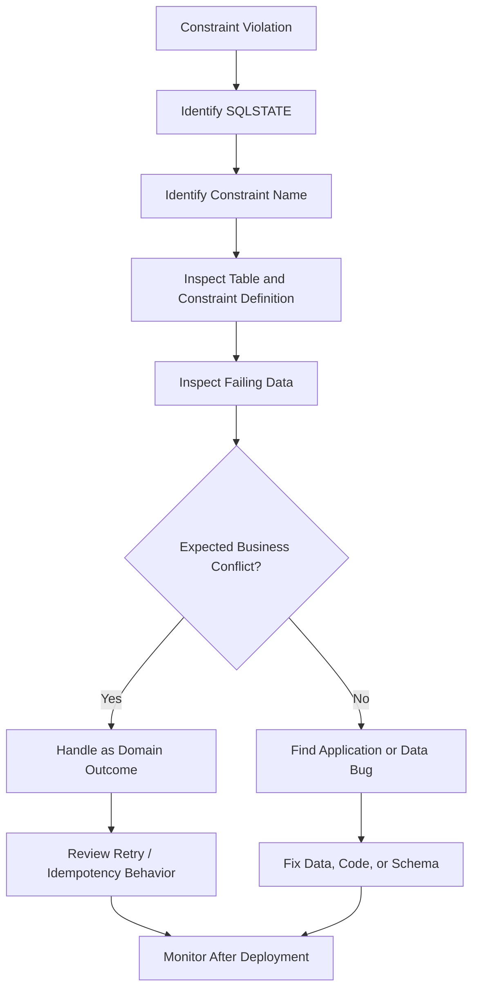
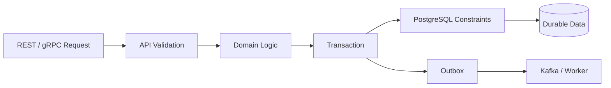

# 13- Constraint Violations

## Overview

Database constraints are executable data-integrity rules. They define what the database must reject rather than relying entirely on application code to maintain correctness.

A constraint violation occurs when an `INSERT`, `UPDATE`, or `DELETE` operation would leave the database in a state that violates one of those rules.

Common examples include:

- Duplicate value violating a `UNIQUE` constraint.
- Missing required value violating `NOT NULL`.
- Invalid relationship violating a foreign key.
- Invalid domain value violating a `CHECK` constraint.
- Duplicate primary key.
- Exclusion constraint conflict.
- Constraint failure caused indirectly by cascading or deferred validation.

In backend systems, constraint violations are often surfaced as application exceptions:

```text
HTTP request
    ↓
Django / FastAPI
    ↓
ORM / driver
    ↓
PostgreSQL
    ↓
Constraint validation
    ↓
Success or constraint violation
```

The important production principle is:

> **Application validation improves user experience; database constraints protect correctness.**

---

## Why Constraint Violations Matter

Without database constraints, concurrent requests can create invalid states even when application validation appears correct.

Consider:

```text
Request A → check username → available
Request B → check username → available
Request A → insert
Request B → insert
```

Application-level validation alone cannot safely enforce uniqueness under concurrency.

A database constraint solves the race:

```sql
CREATE UNIQUE INDEX users_username_key
ON app.users (username);
```

Now PostgreSQL serializes the conflicting writes and rejects the duplicate.

Constraints therefore provide a final integrity boundary independent of:

- API implementation.
- ORM behavior.
- Background workers.
- Administrative scripts.
- Data imports.
- Multiple service instances.
- Concurrent requests.

---

## Types of Constraint Violations

| Constraint | Typical violation | PostgreSQL SQLSTATE |
|---|---|---|
| `NOT NULL` | Required column receives `NULL` | `23502` |
| `UNIQUE` | Duplicate unique value | `23505` |
| `PRIMARY KEY` | Duplicate/null primary key | `23505` |
| `FOREIGN KEY` | Missing referenced row | `23503` |
| `CHECK` | Value violates business rule | `23514` |
| `EXCLUSION` | Conflicting range/resource | `23P01` |

PostgreSQL class `23` represents integrity constraint violations.

When building production error handling, prefer SQLSTATE or driver-specific structured exception attributes over parsing error-message strings.

---

## NOT NULL Violations

A `NOT NULL` constraint requires a column to contain a value.

Example:

```sql
CREATE TABLE app.customers (
    id bigint GENERATED ALWAYS AS IDENTITY PRIMARY KEY,
    email text NOT NULL
);
```

This fails:

```sql
INSERT INTO app.customers (email)
VALUES (NULL);
```

PostgreSQL returns a `NOT NULL` violation.

### Common Causes

- Missing API field.
- Incorrect serializer behavior.
- ORM default not applied.
- Background job using an outdated payload.
- Migration introducing a constraint before existing data is clean.
- Partial update incorrectly writing `NULL`.

### Troubleshooting

Inspect the schema:

```sql
SELECT
    column_name,
    is_nullable,
    column_default
FROM information_schema.columns
WHERE table_schema = 'app'
  AND table_name = 'customers'
ORDER BY ordinal_position;
```

Then inspect the application payload and generated SQL.

Do not simply make the column nullable to suppress the error unless `NULL` is actually valid domain state.

---

## UNIQUE Violations

A unique constraint prevents duplicate values.

```sql
CREATE TABLE app.users (
    id bigint GENERATED ALWAYS AS IDENTITY PRIMARY KEY,
    email text NOT NULL UNIQUE
);
```

This fails when the same email already exists:

```sql
INSERT INTO app.users (email)
VALUES ('user@example.com');
```

A unique violation commonly has SQLSTATE:

```text
23505
```

### Why It Happens

Typical causes include:

- Concurrent registration.
- Retry after a successful request.
- Duplicate event delivery.
- Replayed Kafka message.
- Celery task retry.
- Importing duplicate records.
- Case-normalization mismatch.
- Missing idempotency design.

---

## Application Validation vs UNIQUE Constraint

This pattern is insufficient:

```python
if not User.objects.filter(email=email).exists():
    User.objects.create(email=email)
```

Two requests can pass the check concurrently.

Prefer enforcing uniqueness in the database:

```python
try:
    User.objects.create(email=email)
except IntegrityError:
    # Translate the uniqueness conflict into the appropriate domain response.
    ...
```

The application check can still be useful for early feedback, but it must not be treated as the concurrency-safe enforcement mechanism.

---

## Primary Key Violations

A primary key implies:

- Uniqueness.
- Non-nullability.
- Row identity.

For example:

```sql
CREATE TABLE app.orders (
    id bigint PRIMARY KEY,
    total numeric(12, 2) NOT NULL
);
```

Attempting to insert an existing ID produces a unique violation.

Common causes include:

- Manual ID assignment.
- Broken sequence state.
- Data migration errors.
- Retry logic.
- Import/export mistakes.
- Duplicate event processing.

For generated identifiers, prefer identity columns:

```sql
id bigint GENERATED ALWAYS AS IDENTITY PRIMARY KEY
```

rather than manually managing IDs where possible.

---

## Sequence and Identity Problems

A sequence can become inconsistent with existing data after manual imports or migrations.

For example, an application may expect PostgreSQL to generate a new ID, but the underlying sequence can produce a value already present in the table.

Inspect sequence-related metadata:

```sql
SELECT
    column_name,
    column_default,
    is_identity,
    identity_generation
FROM information_schema.columns
WHERE table_schema = 'app'
  AND table_name = 'orders'
  AND column_name = 'id';
```

If investigating sequence state, identify the actual sequence before changing it.

Do not blindly reset sequences in production because doing so can create additional collisions.

---

## FOREIGN KEY Violations

A foreign key enforces referential integrity.

```sql
CREATE TABLE app.orders (
    id bigint GENERATED ALWAYS AS IDENTITY PRIMARY KEY,
    customer_id bigint NOT NULL,
    CONSTRAINT orders_customer_fk
        FOREIGN KEY (customer_id)
        REFERENCES app.customers(id)
);
```

This fails if the customer does not exist:

```sql
INSERT INTO app.orders (customer_id)
VALUES (999999);
```

Typical SQLSTATE:

```text
23503
```

The database is preventing an orphaned order.

---

## Foreign Key Insert Race

Application checks are not sufficient here either.

This is vulnerable to concurrency:

```text
Check customer exists
        ↓
Customer exists
        ↓
Customer deleted
        ↓
Insert order
```

The foreign key provides the authoritative guarantee.

This is particularly important when multiple services or background workers can modify related entities.

---

## Foreign Key Delete Violations

Consider:

```sql
DELETE FROM app.customers
WHERE id = 42;
```

If existing orders reference customer `42`, the delete may fail.

This is intentional.

The schema must define what should happen.

Possible actions include:

| Action | Meaning |
|---|---|
| `NO ACTION` | Reject conflicting operation at constraint check |
| `RESTRICT` | Prevent deletion/update when dependent rows exist |
| `CASCADE` | Delete/update dependent rows automatically |
| `SET NULL` | Replace foreign key with `NULL` |
| `SET DEFAULT` | Replace with the column default |

Choose based on domain semantics, not convenience.

---

## ON DELETE CASCADE

Example:

```sql
FOREIGN KEY (customer_id)
REFERENCES app.customers(id)
ON DELETE CASCADE
```

Deleting a customer can then delete related rows.

This is useful when child rows have no independent meaning.

It is dangerous when:

- The child contains business history.
- Deletion should be audited.
- The table is large.
- Cascades can traverse many relationships.
- Accidental deletion is difficult to recover.

Do not use `CASCADE` simply because it makes deletes easier.

---

## Foreign Key Indexing

PostgreSQL does not automatically create an index on the referencing side of a foreign key.

For example:

```sql
CREATE INDEX orders_customer_id_idx
ON app.orders (customer_id);
```

This can be important for:

- Parent deletion/update checks.
- Joins.
- Customer-specific queries.
- Referential-integrity operations.

A foreign key without an appropriate child-side index can become an operational problem as the child table grows.

---

## CHECK Constraint Violations

A `CHECK` constraint enforces a row-level predicate.

```sql
CREATE TABLE app.products (
    id bigint GENERATED ALWAYS AS IDENTITY PRIMARY KEY,
    price numeric(12, 2) NOT NULL,
    CONSTRAINT products_price_nonnegative
        CHECK (price >= 0)
);
```

This fails:

```sql
INSERT INTO app.products (price)
VALUES (-10);
```

Typical SQLSTATE:

```text
23514
```

Use `CHECK` constraints for invariants that should always hold at the database boundary.

---

## CHECK Constraints and NULL

A subtle point is that a `CHECK` constraint passes when its expression evaluates to `TRUE` **or `NULL`**.

For example:

```sql
CHECK (price >= 0)
```

does not by itself prevent:

```text
price = NULL
```

because the expression evaluates to `NULL`.

If the column must contain a non-null non-negative value, use both:

```sql
price numeric(12, 2) NOT NULL,
CHECK (price >= 0)
```

This distinction is a common interview and production trap.

---

## CHECK Constraints for Business Invariants

Good candidates include:

```sql
CHECK (quantity > 0)
```

```sql
CHECK (start_at < end_at)
```

```sql
CHECK (status IN ('pending', 'paid', 'cancelled'))
```

However, avoid putting complex cross-row business logic into a simple `CHECK`.

A `CHECK` constraint is intended to validate the row's values and immutable/stable expressions, not to implement arbitrary queries against other rows.

For cross-row invariants, consider:

- Unique constraints.
- Exclusion constraints.
- Foreign keys.
- Transactional locking.
- Application/service logic.
- Other database mechanisms appropriate to the invariant.

---

## Exclusion Constraint Violations

PostgreSQL exclusion constraints can prevent conflicting ranges or combinations.

For example, a room reservation system can prevent overlapping bookings.

```sql
CREATE EXTENSION IF NOT EXISTS btree_gist;

CREATE TABLE app.reservations (
    id bigint GENERATED ALWAYS AS IDENTITY PRIMARY KEY,
    room_id bigint NOT NULL,
    booking_period tstzrange NOT NULL,
    EXCLUDE USING gist (
        room_id WITH =,
        booking_period WITH &&
    )
);
```

The constraint means:

```text
same room
+
overlapping time range
=
rejected
```

This is stronger than trying to implement overlap detection entirely in application code.

---

## Constraint Timing

Most PostgreSQL constraints are checked immediately.

Some constraints can be declared:

```sql
DEFERRABLE
```

and checked later, typically at transaction commit.

Example:

```sql
CREATE TABLE app.accounts (
    id bigint PRIMARY KEY,
    parent_id bigint,
    CONSTRAINT accounts_parent_fk
        FOREIGN KEY (parent_id)
        REFERENCES app.accounts(id)
        DEFERRABLE INITIALLY DEFERRED
);
```

Deferred constraints are useful when a transaction temporarily enters an intermediate state that is invalid but must be valid before commit.

Use them deliberately because they move failure from the statement boundary toward transaction completion.

---

## Immediate vs Deferred Constraints

| Behavior | Immediate | Deferred |
|---|---|---|
| Validation | During statement | At configured constraint-check point |
| Failure location | Earlier | Potentially at `COMMIT` |
| Debugging | Usually simpler | More complex |
| Use case | Normal integrity enforcement | Multi-step transactional changes |

Do not make constraints deferred simply to avoid errors during individual statements.

---

## Constraint Violations in Transactions

A constraint violation aborts the current PostgreSQL transaction.

For example:

```sql
BEGIN;

INSERT INTO app.users (email)
VALUES ('duplicate@example.com');

INSERT INTO app.audit_events (action)
VALUES ('user_created');

COMMIT;
```

If the first statement violates a constraint, the transaction enters a failed state.

Subsequent commands normally produce an error until:

```sql
ROLLBACK;
```

or an appropriate savepoint is rolled back.

This is especially important for application transaction handling.

---

## Savepoints and Constraint Errors

A savepoint can isolate an expected failure.

```sql
BEGIN;

SAVEPOINT create_user;

INSERT INTO app.users (email)
VALUES ('duplicate@example.com');

ROLLBACK TO SAVEPOINT create_user;

INSERT INTO app.audit_events (action)
VALUES ('duplicate_user_attempt');

COMMIT;
```

This is useful when the application intentionally handles a database conflict inside a larger transaction.

However, savepoints should not be used to hide unexpected integrity failures.

---

## Translating Constraint Errors in APIs

A database error should not normally be exposed directly to API clients.

Instead:

```text
PostgreSQL constraint violation
        ↓
Driver exception
        ↓
Domain/application mapping
        ↓
HTTP response
```

For example:

| Database condition | Typical API response |
|---|---|
| Duplicate email | `409 Conflict` |
| Missing parent resource | `400` or `409`, depending on API semantics |
| Invalid field value | `400` or `422` |
| Internal unexpected constraint failure | `500` + alert/log |

The exact HTTP status should follow the API contract.

Do not expose raw SQL, schema names, constraint definitions, or database details to clients.

---

## Django Constraint Handling

Django exposes database errors through exceptions such as:

```python
from django.db import IntegrityError
```

Example:

```python
from django.db import IntegrityError, transaction

try:
    with transaction.atomic():
        user = User.objects.create(email=email)
except IntegrityError:
    # Map the specific integrity condition to a domain-level response.
    ...
```

For user-facing validation, Django model/form/serializer validation can provide better messages.

But the database constraint remains necessary for concurrency-safe enforcement.

---

## FastAPI and SQLAlchemy

With SQLAlchemy, integrity failures are commonly represented through:

```python
from sqlalchemy.exc import IntegrityError
```

Example:

```python
from sqlalchemy.exc import IntegrityError

try:
    session.add(order)
    session.commit()
except IntegrityError:
    session.rollback()
    raise
```

The exact exception handling should inspect the underlying driver error when different constraint violations require different responses.

Do not catch every `IntegrityError` and return the same business response.

---

## Identifying the Violated Constraint

In PostgreSQL drivers, structured exception information can expose:

- SQLSTATE.
- Constraint name.
- Table name.
- Column name.
- Detail.
- Schema.

Prefer structured attributes where the driver provides them.

For example, with psycopg:

```python
from psycopg import errors

try:
    cursor.execute(
        """
        INSERT INTO app.users (email)
        VALUES (%s)
        """,
        [email],
    )
except errors.UniqueViolation:
    # Handle the expected uniqueness conflict.
    ...
```

Using typed driver exceptions is generally safer than parsing database error strings.

---

## Idempotency and Constraint Violations

Constraint violations frequently indicate duplicate work.

For example:

```text
HTTP request
    ↓
Create payment
    ↓
Timeout
    ↓
Client retries
    ↓
Same payment request
```

If the operation has an idempotency key:

```sql
CREATE UNIQUE INDEX payments_idempotency_key_idx
ON app.payments (idempotency_key);
```

the database can enforce one logical operation.

The application can then translate a duplicate key conflict into:

```text
existing operation
```

rather than treating it as an unexpected system failure.

---

## Kafka and Celery

Background processing makes constraint handling especially important.

Consider:

```text
Kafka message
    ↓
Consumer
    ↓
INSERT
    ↓
UNIQUE violation
```

The message may be:

- A duplicate delivery.
- A replay.
- A legitimate conflict.
- A corrupted event.
- A producer bug.

Do not automatically retry every constraint violation.

For deterministic conflicts, retries can create:

```text
constraint failure
→ retry
→ constraint failure
→ retry
→ ...
```

Classify errors before deciding whether to retry, ignore, dead-letter, or alert.

---

## Upserts and Constraint Handling

When duplicates are expected as part of normal application semantics, PostgreSQL provides `ON CONFLICT`.

Example:

```sql
INSERT INTO app.user_preferences (
    user_id,
    preference_key,
    preference_value
)
VALUES ($1, $2, $3)
ON CONFLICT (user_id, preference_key)
DO UPDATE SET
    preference_value = EXCLUDED.preference_value;
```

This is preferable to:

```text
SELECT
IF NOT EXISTS
INSERT
```

because the latter is vulnerable to concurrent races.

Use `ON CONFLICT` when the intended behavior is explicitly insert-or-update or insert-or-ignore.

---

## ON CONFLICT DO NOTHING

For idempotent event ingestion:

```sql
INSERT INTO app.processed_events (
    event_id,
    processed_at
)
VALUES ($1, now())
ON CONFLICT (event_id)
DO NOTHING;
```

The unique constraint and atomic conflict handling provide a concurrency-safe deduplication mechanism.

The application should distinguish:

```text
inserted
```

from:

```text
already processed
```

when the business workflow needs that distinction.

---

## Constraint Violations During Data Imports

Bulk imports frequently reveal existing data-quality problems.

Before importing:

```text
CSV
→ staging table
→ validation
→ production table
```

is safer than inserting unvalidated data directly into production tables.

Example:

```sql
CREATE TEMP TABLE staging_users (
    email text,
    status text
);
```

Load and validate the staging data first.

Then perform controlled insertion:

```sql
INSERT INTO app.users (email, status)
SELECT email, status
FROM staging_users
WHERE status IN ('active', 'inactive');
```

For larger workflows, use a persistent staging table with batch-level validation and audit metadata.

---

## Constraint Violations During Migrations

Adding a constraint to an existing table can fail immediately if existing rows violate it.

For example:

```sql
ALTER TABLE app.orders
ADD CONSTRAINT orders_total_nonnegative
CHECK (total >= 0);
```

If historical rows contain negative values, the operation cannot safely establish the invariant.

The migration process should be:

```text
Inspect
  ↓
Clean
  ↓
Validate
  ↓
Add constraint
  ↓
Deploy application relying on constraint
```

For large production tables, also consider locking behavior and deployment duration.

---

## NOT VALID for Existing Data

PostgreSQL supports adding certain constraints as:

```sql
NOT VALID
```

This can be useful for large tables where validating all existing rows immediately would be operationally expensive.

For example:

```sql
ALTER TABLE app.orders
ADD CONSTRAINT orders_customer_fk
FOREIGN KEY (customer_id)
REFERENCES app.customers(id)
NOT VALID;
```

New changes are constrained, while existing rows are not immediately scanned for validation.

Later:

```sql
ALTER TABLE app.orders
VALIDATE CONSTRAINT orders_customer_fk;
```

This can support safer production migrations.

The constraint must eventually be validated if the goal is complete historical integrity.

---

## Constraint Names Matter

Prefer meaningful constraint names:

```sql
CONSTRAINT orders_customer_fk
    FOREIGN KEY (customer_id)
    REFERENCES app.customers(id)
```

instead of relying entirely on generated names.

Useful names improve:

- Error handling.
- Debugging.
- Migration review.
- Observability.
- Incident response.

For example:

```text
orders_customer_fk
users_email_key
products_price_nonnegative
```

make failures much easier to identify.

---

## Constraint Violations and Concurrency

A key senior-level principle is:

> **Constraints are concurrency control for data invariants.**

Suppose two workers execute:

```text
Worker A → INSERT email X
Worker B → INSERT email X
```

Both can reach the database concurrently.

A unique constraint guarantees that only one can successfully establish the unique value.

This is stronger than application-level locking or a preceding `SELECT`.

For invariants such as:

```text
one active subscription per customer
one unique username
one event ID processed
no overlapping booking
```

consider whether the database can enforce the invariant directly.

---

## Partial Unique Constraints

Some uniqueness rules apply only to a subset of rows.

Example:

```sql
CREATE UNIQUE INDEX subscriptions_one_active_per_customer
ON app.subscriptions (customer_id)
WHERE status = 'active';
```

This allows:

```text
customer 42 → cancelled subscription
customer 42 → expired subscription
customer 42 → active subscription
```

but prevents a second active subscription.

This is often more precise than implementing the rule exclusively in application code.

---

## Constraint Violations and Soft Deletes

Soft deletion can change uniqueness requirements.

Suppose:

```sql
email text UNIQUE
```

and rows are marked:

```text
deleted_at
```

A deleted account still occupies the unique value.

If the domain allows reuse after deletion, a partial unique index can be appropriate:

```sql
CREATE UNIQUE INDEX users_active_email_key
ON app.users (email)
WHERE deleted_at IS NULL;
```

The important point is that the constraint should represent the actual business invariant.

---

## Case-Insensitive Uniqueness

A requirement such as:

```text
User@example.com
user@example.com
```

may be considered duplicate by the application.

A simple:

```sql
UNIQUE (email)
```

does not necessarily enforce that semantic rule.

Possible PostgreSQL approaches include:

- `citext`.
- Expression indexes.
- Canonicalizing values before storage.

For example:

```sql
CREATE UNIQUE INDEX users_email_lower_key
ON app.users (lower(email));
```

If using expression-based uniqueness, ensure the application's normalization rules match the database rule.

---

## Constraint Violations and Security

Constraint errors can leak information if returned carelessly.

For example, an endpoint that exposes:

```text
"email already exists"
```

can enable account enumeration.

Security-sensitive endpoints may need intentionally generic responses even when the database reports a uniqueness conflict.

Also avoid logging:

- Passwords.
- Authentication tokens.
- Sensitive personal data.
- Full database error details containing protected values.

Database constraints protect integrity, but their error messages still need application-level security handling.

---

## Monitoring Constraint Failures

Monitor constraint violations when they represent unexpected system behavior.

Useful metrics include:

```text
constraint_violation_total
unique_violation_total
foreign_key_violation_total
check_violation_total
dead_letter_messages_total
```

Break down by:

- Service.
- Endpoint.
- Operation.
- Constraint.
- Deployment version.
- Background worker.
- Environment.

A sudden increase after deployment often indicates:

- Contract mismatch.
- Bad migration.
- Invalid producer data.
- Retry/idempotency bug.
- Application regression.

Expected business conflicts should generally be distinguished from unexpected integrity failures.

---

## Troubleshooting Workflow

When a constraint violation occurs:



A practical investigation sequence is:

1. Capture SQLSTATE and constraint name.
2. Identify the exact table and operation.
3. Inspect the constraint definition.
4. Determine whether the violation is expected.
5. Inspect the conflicting row/value.
6. Check concurrent requests or workers.
7. Check retries and idempotency.
8. Check recent deployments or migrations.
9. Verify ORM-generated SQL.
10. Decide whether the correct fix belongs in application logic, data, or schema.

---

## Useful PostgreSQL Queries

List constraints:

```sql
SELECT
    conname,
    contype,
    conrelid::regclass AS table_name,
    pg_get_constraintdef(oid) AS definition
FROM pg_constraint
WHERE connamespace = 'app'::regnamespace
ORDER BY conrelid::regclass::text, conname;
```

Inspect a table:

```sql
\d+ app.orders
```

Find foreign keys:

```sql
SELECT
    conname,
    conrelid::regclass AS table_name,
    confrelid::regclass AS referenced_table,
    pg_get_constraintdef(oid) AS definition
FROM pg_constraint
WHERE contype = 'f'
  AND connamespace = 'app'::regnamespace;
```

Inspect indexes:

```sql
SELECT
    schemaname,
    tablename,
    indexname,
    indexdef
FROM pg_indexes
WHERE schemaname = 'app'
ORDER BY tablename, indexname;
```

---

## Production Pitfalls

### Catching Every IntegrityError

Problem:

```python
except IntegrityError:
    return {"error": "invalid request"}
```

This hides whether the cause was:

- Duplicate data.
- Missing foreign key.
- Invalid check.
- Unexpected schema problem.

**Fix:** classify the underlying database error.

### Retrying Constraint Violations

A deterministic constraint violation usually does not become valid after a short retry.

**Fix:** distinguish transient failures from permanent integrity conflicts.

### Removing Constraints to Fix an Incident

Dropping a constraint may stop an error while allowing corrupted data to accumulate.

**Fix:** identify the invariant and correct the source of invalid writes.

### Relying Only on Application Validation

Concurrent requests can bypass application-level checks.

**Fix:** enforce critical invariants in the database.

### Using `SELECT` Before `INSERT`

This pattern:

```text
SELECT
→ no row
→ INSERT
```

is race-prone for uniqueness.

**Fix:** use a unique constraint and `ON CONFLICT`.

### Using Cascades Without Understanding Data Ownership

A delete can trigger a large cascade.

**Fix:** model ownership explicitly and test destructive operations against realistic data volumes.

### Making Constraints Nullable to Suppress Failures

Changing:

```text
NOT NULL
```

to:

```text
NULL
```

may hide a real data-model problem.

**Fix:** determine whether NULL is actually valid business state.

### Ignoring Existing Data During Migrations

A new constraint can expose years of historical data-quality problems.

**Fix:** audit, clean, and validate before enforcement; use staged validation for large tables.

---

## Reliability and High Availability

Constraints execute on the database that accepts the write.

For primary/replica architectures:

```text
Application
    ↓
Primary
    ↓
WAL
    ↓
Read Replicas
```

Do not rely on a read replica to determine whether a unique value is available before writing to the primary.

Replica lag can make the read stale.

The primary's constraint enforcement is authoritative for the write.

After failover, the newly promoted primary must contain the required committed state for constraints to continue protecting the same invariants.

---

## Scaling Considerations

Constraints have operational cost.

Indexes supporting:

```text
PRIMARY KEY
UNIQUE
FOREIGN KEY access patterns
```

consume:

- Storage.
- Memory/cache.
- Write I/O.
- CPU.
- Maintenance time.

However, removing integrity guarantees merely to improve write throughput can move the cost into:

- Data repair.
- Operational incidents.
- Duplicate processing.
- Reconciliation jobs.
- Customer-facing inconsistencies.

Senior design decisions should compare the cost of enforcement with the cost of violating the invariant.

---

## Disaster Recovery Considerations

Constraint integrity must survive:

- Backup and restore.
- Point-in-time recovery.
- Replica promotion.
- Data migration.
- Bulk imports.

After restoring a database, verify:

- Constraints exist.
- Indexes exist.
- Foreign keys are present.
- Expected validation state is restored.
- Application migrations match the restored schema.

Backups without tested restores do not prove recoverability.

---

## Production Architecture

A robust backend typically distributes validation responsibilities across layers:



Each layer has a different responsibility:

| Layer | Responsibility |
|---|---|
| API | Input shape and user-facing validation |
| Domain | Business workflow and authorization |
| Transaction | Atomic state transition |
| Database constraint | Durable integrity invariant |
| Outbox/event system | Reliable downstream propagation |
| Worker | Asynchronous processing |

Do not duplicate every rule everywhere. Put each invariant at the strongest appropriate boundary.

---

## Design Checklist

Before introducing or troubleshooting a constraint:

- [ ] Identify the exact invariant.
- [ ] Decide whether the database should enforce it.
- [ ] Choose the appropriate constraint type.
- [ ] Give the constraint a meaningful name.
- [ ] Validate existing data.
- [ ] Consider concurrent writes.
- [ ] Consider transaction boundaries.
- [ ] Consider foreign-key indexing.
- [ ] Decide whether failures are expected business outcomes.
- [ ] Map expected violations to appropriate API responses.
- [ ] Avoid exposing sensitive database error details.
- [ ] Review retry behavior.
- [ ] Review idempotency.
- [ ] Test migrations against production-scale data.
- [ ] Monitor unexpected violations after deployment.
- [ ] Test backup/restore and failover behavior.

---

## Key Takeaways

- **Database constraints are the authoritative integrity boundary:** application validation improves UX, but constraints protect correctness under concurrency, retries, imports, and multiple writers.
- **Classify violations before handling them:** use SQLSTATE and structured driver exceptions to distinguish expected conflicts from genuine application or data defects.
- **Design constraints around real business invariants:** unique, foreign-key, check, partial unique, and exclusion constraints can eliminate entire classes of race conditions.
- **Treat constraint changes as production migrations:** validate existing data, consider locking and scale, use staged validation when appropriate, and never remove constraints merely to hide failures.
- **Integrate constraints with reliability patterns:** `ON CONFLICT`, idempotency keys, transactional boundaries, Kafka/Celery retry classification, and replica-aware architectures make integrity guarantees operationally useful.