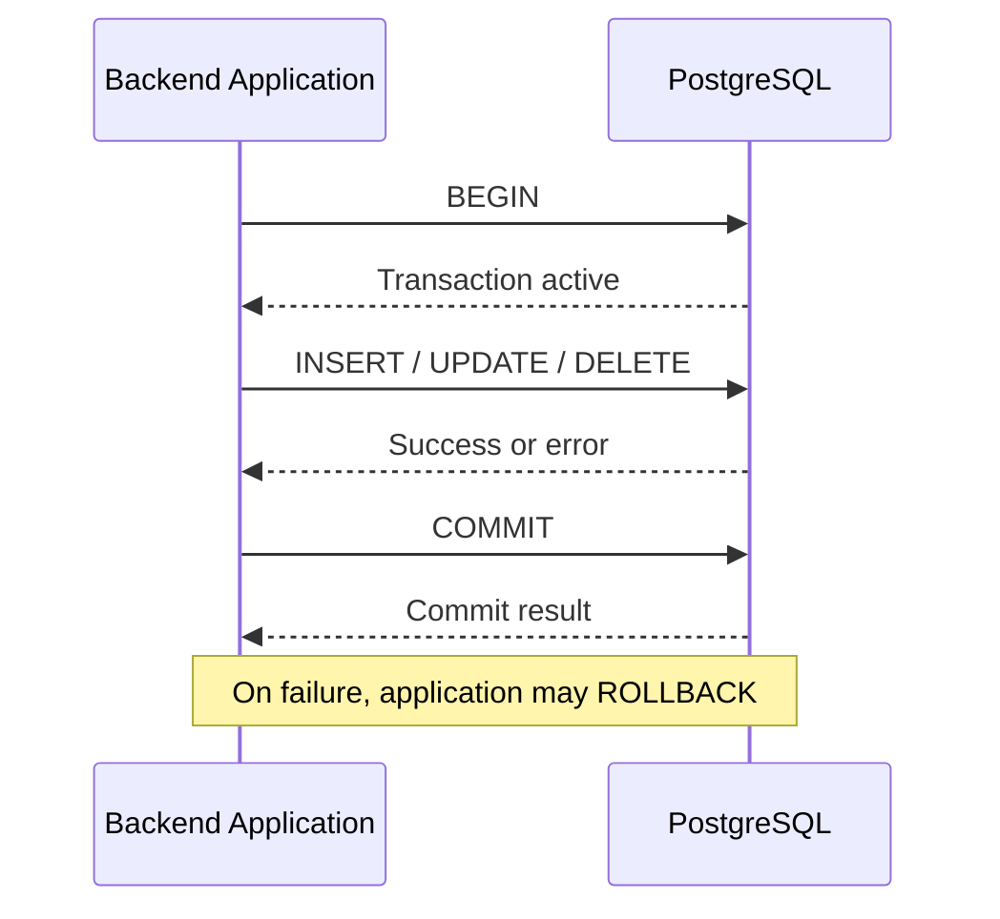
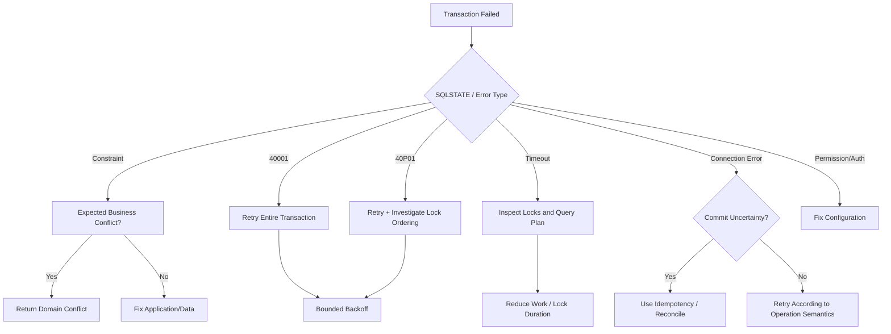

# 14- Transaction Failures

## Overview

Transaction failures occur when a database transaction cannot complete successfully and the database rejects, aborts, or rolls back some or all of the work.

In PostgreSQL-backed applications, failures can originate from:

- Constraint violations.
- Serialization conflicts.
- Deadlocks.
- Lock timeouts.
- Statement timeouts.
- Connection failures.
- Transaction cancellation.
- Syntax or application-generated SQL errors.
- Disk, storage, or database availability failures.
- Network failures occurring before or after commit.
- Application bugs that leave transactions in an aborted state.

The important production distinction is that **a failed transaction is not always equivalent to a failed business operation**.

For example:

```text
Application sends COMMIT
        ↓
Network connection fails
        ↓
Application does not know whether COMMIT succeeded
```

The database may have committed successfully even though the application received an error.

Reliable transaction handling therefore requires understanding:

```text
transaction state
+ isolation
+ locks
+ retries
+ idempotency
+ connection behavior
+ commit uncertainty
```

---

## Transaction Lifecycle

A simplified PostgreSQL transaction lifecycle is:



A transaction can move through states such as:

```text
Idle
  ↓
Active
  ↓
Statement succeeds
  ↓
More statements
  ↓
COMMIT
  ↓
Committed
```

or:

```text
Active
  ↓
Statement error
  ↓
Aborted transaction
  ↓
ROLLBACK
  ↓
Idle
```

Once a PostgreSQL transaction is aborted, subsequent statements normally fail until the transaction is rolled back.

---

## Statement Failure vs Transaction Failure

These are related but not identical concepts.

Consider:

```sql
BEGIN;

INSERT INTO app.orders (customer_id)
VALUES (999999);

SELECT *
FROM app.customers;

COMMIT;
```

If the insert violates a foreign key, PostgreSQL places the transaction into an aborted state.

The subsequent `SELECT` does not simply continue normally.

The application must issue:

```sql
ROLLBACK;
```

before using that transaction again.

This is one reason application frameworks should own transaction boundaries rather than allowing arbitrary database operations to escape without error handling.

---

## Common Transaction Failure Categories

| Failure | Typical cause | Retry candidate? |
|---|---|---|
| Unique violation | Duplicate business operation | Usually no; handle as conflict |
| Foreign key violation | Invalid relationship | Usually no |
| Check violation | Invalid state | Usually no |
| Serialization failure | Concurrent transaction conflict | Often yes |
| Deadlock | Conflicting lock order | Often yes |
| Lock timeout | Lock held too long | Sometimes |
| Statement timeout | Query too expensive/blocked | Depends |
| Connection failure | Network/server issue | Depends |
| Commit uncertainty | Connection lost around commit | Requires idempotency/reconciliation |
| Disk/database failure | Infrastructure problem | Usually after recovery/failover |

Retrying every database error is unsafe.

---

## Constraint Violations

Constraint failures are often deterministic.

For example:

```sql
INSERT INTO app.users (email)
VALUES ('existing@example.com');
```

may produce a unique violation.

If the same data is retried immediately, the same conflict usually occurs.

Instead of blind retrying:

```text
INSERT
  ↓
unique violation
  ↓
retry
  ↓
unique violation
```

the application should classify the error as an expected domain conflict when appropriate.

For expected insert-or-update semantics, prefer:

```sql
INSERT INTO app.user_preferences (
    user_id,
    preference_key,
    preference_value
)
VALUES ($1, $2, $3)
ON CONFLICT (user_id, preference_key)
DO UPDATE SET
    preference_value = EXCLUDED.preference_value;
```

---

## Serialization Failures

Under stronger isolation such as `SERIALIZABLE`, PostgreSQL may abort a transaction when concurrent execution cannot be serialized safely.

A typical error has SQLSTATE:

```text
40001
```

Example:

```text
Transaction A ────────┐
                      ├── conflicting serialization
Transaction B ────────┘
                      ↓
              one transaction aborts
```

This is not necessarily a database malfunction.

It means the application must retry the **entire transaction** under the appropriate conditions.

Do not retry only the failed SQL statement if the transaction's previous reads and writes affect its correctness.

---

## Retrying Serializable Transactions

A correct retry boundary looks like:

```python
for attempt in range(max_attempts):
    try:
        with transaction.atomic():
            perform_business_transaction()
        break
    except SerializationFailure:
        if attempt == max_attempts - 1:
            raise
        backoff(attempt)
```

The exact implementation depends on the database driver and framework.

The important rule is:

> **Retry the complete transaction, not an isolated statement.**

Otherwise the application can accidentally continue with stale assumptions from the failed transaction.

---

## Deadlocks

A deadlock occurs when transactions wait on each other indefinitely.

Example:

```text
Transaction A:
locks order 1
waits for order 2

Transaction B:
locks order 2
waits for order 1
```

PostgreSQL detects the cycle and aborts one transaction.

Typical SQLSTATE:

```text
40P01
```

The application may retry the aborted transaction.

However, the long-term fix is usually to remove the deadlock pattern.

---

## Consistent Lock Ordering

Prefer a deterministic lock order.

Bad:

```text
Request A → lock customer 1 → lock order 2
Request B → lock order 2 → lock customer 1
```

Better:

```text
Every request → lock customer first → lock order second
```

For multiple rows, sort identifiers before locking when the domain permits it:

```python
customer_ids = sorted(customer_ids)

for customer_id in customer_ids:
    lock_customer(customer_id)
```

Consistent ordering reduces deadlock probability.

---

## Lock Timeout Failures

PostgreSQL supports:

```sql
SET lock_timeout = '2s';
```

If a statement waits too long for a lock, PostgreSQL aborts that statement.

This is different from:

```sql
SET statement_timeout = '5s';
```

which limits total statement execution time.

| Timeout | Controls |
|---|---|
| `lock_timeout` | Time waiting to acquire locks |
| `statement_timeout` | Total statement execution time |
| Connection timeout | Establishing the connection |

These should not be treated as interchangeable.

---

## Statement Timeout

A statement can exceed:

```sql
SET statement_timeout = '5s';
```

because of:

- Poor query plans.
- Missing indexes.
- Large scans.
- Lock waits.
- Sort/hash resource pressure.
- High database load.

A timeout is an operational protection mechanism, not necessarily a query optimization strategy.

Investigate the underlying query and execution plan.

---

## Idle Transactions

An application can accidentally leave a transaction open:

```text
BEGIN
  ↓
SELECT
  ↓
Application performs network call
  ↓
Transaction remains open
```

Long-lived transactions can:

- Hold locks.
- Delay cleanup.
- Increase MVCC storage pressure.
- Keep old row versions visible.
- Increase connection utilization.

Avoid performing slow external operations inside database transactions unless the design explicitly requires it.

---

## External Calls Inside Transactions

Avoid:

```python
with transaction.atomic():
    order = create_order()
    response = requests.post(payment_url)
    mark_order_paid()
```

The payment API may take seconds while the database transaction remains open.

A better architecture is often:

```text
Database transaction
    ↓
Persist order/payment intent
    ↓
Commit
    ↓
Outbox event
    ↓
Worker
    ↓
External payment service
    ↓
Persist result
```

This reduces transaction duration and avoids coupling database locks to external network latency.

---

## Transactional Outbox

A transactional outbox allows database state and an event record to be committed atomically.

```sql
BEGIN;

INSERT INTO app.orders (
    customer_id,
    total
)
VALUES ($1, $2);

INSERT INTO app.outbox_events (
    event_type,
    aggregate_id,
    payload
)
VALUES (
    'order.created',
    $3,
    $4
);

COMMIT;
```

A worker can later publish the event to Kafka.

The pattern avoids:

```text
DB commit succeeds
Kafka publish fails
```

leaving the system with committed state but no durable event.

---

## Commit Uncertainty

One of the hardest transaction failures occurs around `COMMIT`.

Consider:

```text
Application
    │
    │ COMMIT
    ▼
PostgreSQL
    │
    │ commit succeeds
    ▼
Network failure
    │
    ▼
Application receives connection error
```

The application cannot necessarily determine whether the transaction committed.

This is fundamentally different from a transaction that definitely failed before commit.

Never assume:

```text
connection error during COMMIT
=
transaction definitely rolled back
```

---

## Handling Commit Uncertainty

The solution is usually not blind retrying.

Blindly repeating:

```text
CREATE PAYMENT
```

could create a duplicate operation if the first transaction actually committed.

Use an idempotency key:

```sql
CREATE UNIQUE INDEX payments_idempotency_key_key
ON app.payments (idempotency_key);
```

Then retries can safely identify the original operation.

Other approaches include:

- Reconciliation queries.
- Durable operation IDs.
- Idempotent state transitions.
- External provider idempotency keys.
- Explicit recovery workflows.

---

## Idempotency

A transaction is easier to retry when its business operation is idempotent.

For example:

```text
POST /payments
Idempotency-Key: payment-123
```

The database can enforce:

```sql
UNIQUE (idempotency_key)
```

The operation then has a stable identity independent of the HTTP request.

This is particularly important for:

- Payments.
- Orders.
- Provisioning.
- Job creation.
- Event processing.
- External API calls.

---

## Retry Strategy

A production retry policy should define:

```text
What errors are retryable?
How many attempts?
How much backoff?
What maximum elapsed time?
Is the transaction idempotent?
What happens after retries are exhausted?
```

Use exponential backoff with jitter.

Conceptually:

```text
attempt 1 → short delay
attempt 2 → longer delay
attempt 3 → longer delay
```

with randomization to avoid synchronized retry storms.

---

## Retry Storms

A database outage can trigger:

```text
100 application instances
×
100 retrying requests
=
10,000 additional database attempts
```

This can make recovery harder.

Protect the database with:

- Bounded retries.
- Exponential backoff.
- Jitter.
- Circuit breakers where appropriate.
- Connection-pool limits.
- Request deadlines.
- Queue backpressure.
- Rate limiting.

Retries should reduce transient failure impact, not amplify it.

---

## Retry Classification

A useful classification is:

| Failure | Typical strategy |
|---|---|
| Unique violation | Handle conflict |
| Foreign key violation | Fix request/state |
| Check violation | Fix invalid data |
| Serialization failure | Retry transaction |
| Deadlock | Retry transaction + investigate lock ordering |
| Lock timeout | Retry selectively |
| Statement timeout | Investigate query; retry cautiously |
| Connection reset | Retry only with idempotency/uncertainty handling |
| Authentication failure | Do not retry blindly |
| Syntax error | Fix application |
| Permission error | Fix deployment/security configuration |

The exact policy depends on the application.

---

## Transaction Isolation Failures

Isolation level changes the types of concurrency behavior the application must handle.

Common PostgreSQL levels include:

```text
READ COMMITTED
REPEATABLE READ
SERIALIZABLE
```

Stronger isolation can increase the probability of transaction retries.

Therefore:

```text
stronger consistency
        ↓
more concurrency conflicts
        ↓
better retry/idempotency design required
```

Isolation should be selected based on business invariants, not because "stronger is always better."

---

## Read-Modify-Write Failures

This pattern is vulnerable:

```sql
SELECT balance
FROM app.accounts
WHERE id = $1;
```

followed by:

```sql
UPDATE app.accounts
SET balance = ...
WHERE id = $1;
```

Concurrent transactions can operate on stale values.

Prefer atomic updates when possible:

```sql
UPDATE app.accounts
SET balance = balance - $1
WHERE id = $2
  AND balance >= $1;
```

Then inspect affected rows.

This reduces the transaction's dependence on stale application state.

---

## Optimistic Concurrency

For frequently edited resources, a version column can detect lost updates.

```sql
UPDATE app.documents
SET
    content = $1,
    version = version + 1
WHERE id = $2
  AND version = $3;
```

If zero rows are updated:

```text
another writer changed the document
```

The application can return a conflict or reload the latest state.

This is often preferable to holding database locks across long user workflows.

---

## Pessimistic Concurrency

When a workflow must serialize access to a resource:

```sql
SELECT *
FROM app.inventory
WHERE product_id = $1
FOR UPDATE;
```

The row is locked until the transaction ends.

Useful for:

- Inventory allocation.
- State transitions.
- Serialized financial operations.
- Queue consumers.

Keep the transaction short.

Avoid holding locks while performing:

- HTTP requests.
- Slow computation.
- User interaction.
- Large unrelated queries.

---

## `SKIP LOCKED` for Work Queues

PostgreSQL can support database-backed worker queues:

```sql
SELECT id
FROM app.jobs
WHERE status = 'pending'
ORDER BY id
FOR UPDATE SKIP LOCKED
LIMIT 100;
```

Workers can claim different rows without waiting on each other's locks.

This is useful for moderate workloads, but Kafka, SQS, or another dedicated queue may be more appropriate at larger scale.

Do not turn PostgreSQL into a queue merely because `SKIP LOCKED` exists.

---

## Django Transaction Failures

Django's:

```python
transaction.atomic()
```

provides a transaction boundary.

Example:

```python
from django.db import transaction

with transaction.atomic():
    order = Order.objects.create(
        customer_id=customer_id,
        total=total,
    )

    OutboxEvent.objects.create(
        event_type="order.created",
        aggregate_id=str(order.id),
    )
```

If an exception escapes the block, the transaction is rolled back.

Avoid swallowing exceptions inside an atomic block and then continuing as if the transaction were healthy.

---

## Django Nested `atomic()` Blocks

Nested `atomic()` blocks generally use savepoints rather than independent database transactions.

For example:

```python
with transaction.atomic():
    create_order()

    try:
        with transaction.atomic():
            create_optional_record()
    except IntegrityError:
        pass

    finalize_order()
```

The inner block can roll back to its savepoint while the outer transaction continues.

This pattern should be used deliberately.

Do not assume nested `atomic()` creates a separate independently committed transaction.

---

## FastAPI and SQLAlchemy Transactions

With SQLAlchemy, explicitly define transaction ownership.

Example:

```python
with Session(engine) as session:
    with session.begin():
        order = Order(
            customer_id=customer_id,
            total=total,
        )
        session.add(order)
```

The context manager commits on success and rolls back on failure.

The service layer should make it clear which component owns the transaction boundary.

Avoid having repositories independently commit every individual operation when a business workflow requires atomicity across multiple operations.

---

## Connection Pool Interaction

A failed transaction does not necessarily mean the database connection itself is unusable.

The important distinction is:

```text
transaction state
```

versus:

```text
connection state
```

After a transaction error, the connection may be usable after:

```sql
ROLLBACK;
```

But a broken network connection, protocol failure, or server-side disconnect may require discarding it.

Connection pools should ensure failed or invalid connections are not returned to application code in an unusable state.

---

## Transaction and Connection Leaks

A production failure can occur when:

```text
request starts transaction
    ↓
exception
    ↓
cleanup fails
    ↓
connection remains checked out
```

Eventually:

```text
pool exhausted
    ↓
requests wait
    ↓
latency increases
    ↓
timeouts increase
```

Use framework-managed transaction and connection lifecycles wherever possible.

Monitor both:

- Database active sessions.
- Application pool utilization.

---

## Transaction Failures in Celery

Background workers need the same transaction discipline as HTTP requests.

A task should not assume that retrying the task means the previous database transaction definitely failed.

For example:

```text
Task starts
  ↓
Database transaction
  ↓
COMMIT
  ↓
Worker crashes
  ↓
Task retries
```

The transaction may already have committed.

Use:

- Idempotency keys.
- Unique constraints.
- State machines.
- Transactional outbox.
- `transaction.on_commit()` where appropriate.
- Explicit retry classification.

---

## Transaction Failures in Kafka Consumers

Kafka consumers can experience:

```text
database commit succeeds
        ↓
consumer crashes before offset commit
        ↓
message delivered again
```

Therefore database transactions should be designed to tolerate duplicate message processing.

A common pattern is:

```sql
CREATE TABLE app.processed_events (
    event_id uuid PRIMARY KEY,
    processed_at timestamptz NOT NULL DEFAULT now()
);
```

Then atomically record processing state with the business operation.

Do not assume Kafka delivery semantics alone make database operations exactly once.

---

## Transaction Failures and Cache Consistency

Avoid:

```text
UPDATE database
    ↓
UPDATE Redis
```

without considering failure between the two operations.

A database transaction cannot automatically roll back a Redis mutation.

Prefer:

```text
Database transaction
    ↓
Outbox
    ↓
Worker
    ↓
Redis invalidation/update
```

or a cache-aside strategy where stale cache entries are acceptable for the defined consistency model.

---

## Transaction Failures and Distributed Services

A single database transaction cannot atomically commit:

```text
PostgreSQL
+
Kafka
+
Redis
+
External HTTP API
```

Trying to simulate this with a large application transaction usually creates fragile coupling.

Prefer patterns such as:

- Transactional outbox.
- Idempotent consumers.
- Saga/workflow orchestration.
- Compensating actions.
- Explicit state machines.

Define what happens when each external step succeeds or fails.

---

## Large Transactions

Large transactions are more likely to create operational problems.

They can:

- Hold locks for long periods.
- Generate substantial WAL.
- Increase replication lag.
- Increase rollback cost.
- Increase vacuum pressure.
- Consume connection capacity.
- Increase failure blast radius.

For large data operations, prefer bounded batches when business semantics permit:

```text
10,000 rows
    ↓
commit
    ↓
10,000 rows
    ↓
commit
```

However, batching changes atomicity.

If all rows must succeed or fail together, separate batches are not equivalent to one transaction.

---

## Transaction Failure During Deployment

Schema and application versions may overlap during rolling deployments.

A new application version may expect:

```text
new column
```

while an old application version is still running.

Use backward-compatible migration strategies:

```text
Expand
  ↓
Deploy compatible application
  ↓
Backfill
  ↓
Switch reads/writes
  ↓
Contract
```

This reduces failures caused by mixed application/database versions.

---

## Transaction Failures During Schema Changes

DDL can participate in transactions in PostgreSQL, but some operations have significant locking or operational implications.

Before production migrations, evaluate:

- Lock acquisition.
- Duration.
- Table size.
- Index creation.
- Concurrent traffic.
- Replica impact.
- Rollback cost.

A migration that is logically transactional can still be operationally dangerous.

---

## Monitoring Transaction Failures

Monitor:

```text
transaction_failure_total
serialization_failure_total
deadlock_total
lock_timeout_total
statement_timeout_total
constraint_violation_total
connection_error_total
rollback_total
```

Correlate failures with:

- Endpoint.
- Service.
- Database.
- Constraint.
- SQLSTATE.
- Deployment version.
- Transaction duration.
- Lock wait duration.
- Connection pool utilization.

Useful PostgreSQL diagnostics include:

```sql
SELECT
    pid,
    usename,
    state,
    wait_event_type,
    wait_event,
    xact_start,
    query_start,
    query
FROM pg_stat_activity
WHERE datname = current_database()
ORDER BY xact_start NULLS LAST;
```

For lock investigation:

```sql
SELECT
    pid,
    pg_blocking_pids(pid) AS blocking_pids,
    wait_event_type,
    wait_event,
    query
FROM pg_stat_activity
WHERE wait_event_type = 'Lock';
```

---

## Transaction Duration

Transaction duration is an important production metric.

Track:

```text
p50
p95
p99
maximum
```

A transaction lasting:

```text
10 ms
```

is operationally very different from one lasting:

```text
30 seconds
```

Long transactions can amplify:

```text
locks
+
MVCC retention
+
connection usage
+
replication lag
+
failure impact
```

Do not optimize only query execution time. Measure the lifetime of the transaction itself.

---

## Security Considerations

Transaction failures should not expose internal database details to clients.

Avoid returning:

```text
ERROR: duplicate key value violates unique constraint "users_email_key"
DETAIL: Key (email)=(...) already exists.
```

directly from an API.

Map database failures to appropriate domain-level responses.

Also ensure transaction logs do not expose:

- Passwords.
- Tokens.
- Payment data.
- Sensitive personal information.
- Secrets embedded in query parameters.

Use structured error classification and controlled logging.

---

## Reliability Best Practices

A production transaction strategy should include:

- Short transaction boundaries.
- Explicit ownership of transactions.
- Atomic SQL for simple invariants.
- Appropriate isolation levels.
- Deterministic lock ordering.
- Bounded retry policies.
- Exponential backoff with jitter.
- Idempotency for retryable operations.
- Transactional outbox for reliable events.
- Connection-pool health checks.
- Timeouts.
- Monitoring of transaction and lock duration.
- Reconciliation for uncertain outcomes.

The database should enforce important invariants, while the application should manage workflow recovery.

---

## Troubleshooting Decision Tree



---

## Practical Incident Workflow

When a production transaction fails:

1. Capture the SQLSTATE and structured database error.
2. Identify whether the transaction committed, rolled back, or is uncertain.
3. Determine whether the failure is deterministic or transient.
4. Inspect transaction and lock duration.
5. Check concurrent activity in `pg_stat_activity` and `pg_locks`.
6. Check recent deployments and schema changes.
7. Determine whether retries are safe.
8. Verify idempotency behavior.
9. Check connection-pool utilization.
10. Inspect database and application logs together.
11. Reconcile external side effects if commit status is uncertain.
12. Fix the underlying contention, schema, query, or application behavior.

---

## Common Mistakes

### Retrying Every Transaction Error

Not every failure is transient.

**Fix:** classify SQLSTATE and business semantics before retrying.

### Retrying Only the Failed Statement

After a serialization failure or transaction abort, the transaction's previous state cannot simply be ignored.

**Fix:** retry the complete transaction when the failure requires transaction-level retry.

### Assuming a Connection Error Means Rollback

A network failure around `COMMIT` can leave the outcome uncertain.

**Fix:** use idempotency and reconciliation.

### Holding Transactions Across HTTP Calls

External latency becomes database lock duration.

**Fix:** commit durable intent first and process external work asynchronously where appropriate.

### Swallowing Exceptions Inside a Transaction

The database may already consider the transaction aborted.

**Fix:** rollback to an appropriate savepoint or exit the transaction.

### Ignoring Deadlock Root Causes

Retrying can reduce user-facing failures but does not eliminate recurring deadlocks.

**Fix:** establish consistent lock ordering and reduce lock scope.

### Using Strong Isolation Everywhere

`SERIALIZABLE` can increase serialization failures and retry requirements.

**Fix:** select isolation based on actual consistency requirements.

### Unbounded Retries

Retries can turn an outage into a retry storm.

**Fix:** use bounded attempts, deadlines, exponential backoff, jitter, and backpressure.

### Assuming Celery or Kafka Retries Are Exactly Once

A worker can commit a database transaction and fail before acknowledging the message.

**Fix:** design consumers to be idempotent.

### Treating Redis as Transactionally Coupled to PostgreSQL

A PostgreSQL rollback cannot undo a Redis mutation.

**Fix:** use cache invalidation/event-driven patterns with explicitly defined consistency.

### Making Transactions Too Large

Large transactions increase lock duration, WAL volume, rollback cost, and replication impact.

**Fix:** use bounded batches when atomicity requirements allow it.

---

## Production Checklist

Before deploying transaction-sensitive backend code:

- [ ] Define the transaction boundary explicitly.
- [ ] Keep transactions as short as practical.
- [ ] Avoid external network calls inside transactions.
- [ ] Use atomic SQL for simple state changes.
- [ ] Define the required isolation level.
- [ ] Review locking behavior.
- [ ] Establish deterministic lock ordering.
- [ ] Identify retryable SQLSTATEs.
- [ ] Bound retry attempts.
- [ ] Use exponential backoff and jitter.
- [ ] Verify idempotency for retryable operations.
- [ ] Handle commit uncertainty.
- [ ] Use an outbox for reliable event publication where needed.
- [ ] Verify connection-pool cleanup.
- [ ] Configure appropriate timeouts.
- [ ] Monitor transaction duration and rollback rates.
- [ ] Test deadlocks and serialization conflicts.
- [ ] Test worker/message redelivery.
- [ ] Test failure during and immediately after commit.
- [ ] Test migrations under concurrent production-like traffic.

---

## Interview Traps

### What Happens After a PostgreSQL Statement Fails Inside a Transaction?

The transaction normally enters an aborted state. The application must roll back the transaction or roll back to an appropriate savepoint before continuing.

### Should You Retry a Unique Violation?

Usually not as a blind retry. It is generally deterministic. Handle it as a business conflict or use an appropriate `ON CONFLICT` operation.

### Should a Serialization Failure Be Retried?

Often yes, provided the complete transaction is safe to retry and the retry policy is bounded.

### What Is the Difference Between a Deadlock and Lock Timeout?

A deadlock is a cycle of transactions waiting for each other, which PostgreSQL detects and resolves by aborting one transaction. A lock timeout occurs when waiting for a lock exceeds the configured timeout.

### Why Is Commit Uncertainty Dangerous?

Because the application may lose the connection before receiving the commit result even though PostgreSQL committed the transaction. Blindly retrying can duplicate a non-idempotent business operation.

### Why Should External Calls Usually Be Outside Database Transactions?

External calls have unpredictable latency and failure modes. Keeping them inside a transaction extends lock duration and couples database availability to external services.

### Why Is Idempotency Important for Database Retries?

Because a retry may occur after the original operation actually committed. An idempotency key or equivalent durable operation identity lets the system safely recognize duplicate attempts.

---

## Key Takeaways

- **Classify failures before retrying:** constraint violations, serialization failures, deadlocks, timeouts, and connection failures have different recovery semantics.
- **Retry the transaction, not just the statement:** serialization and deadlock failures can invalidate the transaction's previous assumptions and require a complete retry.
- **Design for commit uncertainty:** a connection failure around `COMMIT` does not prove rollback, so retryable operations need idempotency or reconciliation.
- **Keep transactions short and explicit:** avoid external calls inside transactions, minimize lock duration, and use atomic SQL or appropriate concurrency controls.
- **Treat retries as part of system design:** bounded attempts, exponential backoff, jitter, connection limits, outbox patterns, and idempotent workers prevent transaction failures from becoming cascading outages.