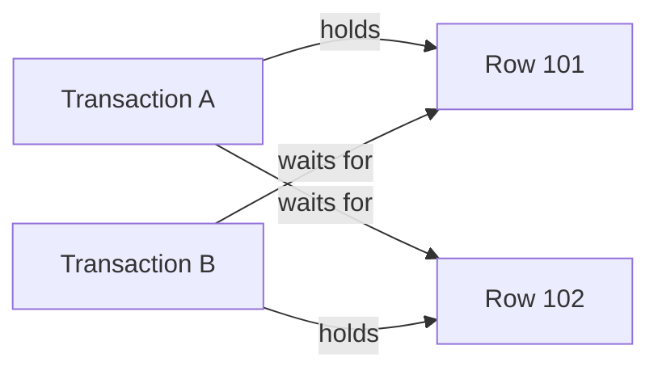
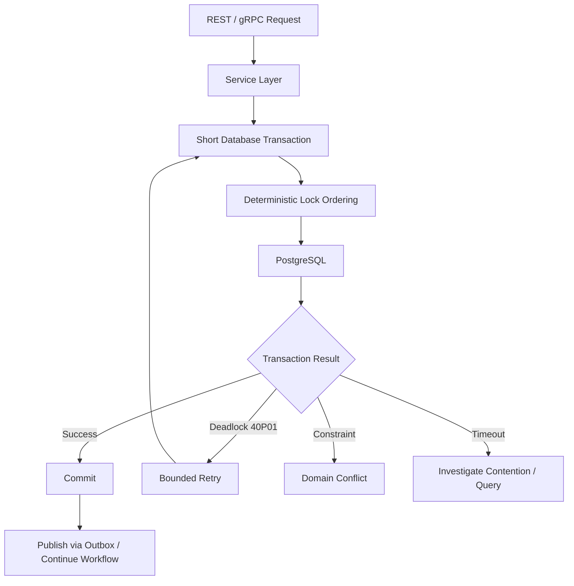

# 15- Deadlocks

## Overview

A **deadlock** occurs when two or more concurrent transactions hold resources that the others need, creating a circular wait.

A typical database deadlock looks like:

```text
Transaction A                    Transaction B

locks Row 1                      locks Row 2
    │                                │
    └──── waits for Row 2 ──────────►│
                                     │
                  waits for Row 1 ◄──┘
```

Neither transaction can make progress. PostgreSQL detects the cycle and aborts one transaction so that the other can continue.

Deadlocks are fundamentally a **concurrency design problem**. PostgreSQL's deadlock detector prevents indefinite waiting, but the application still needs to:

- Handle the aborted transaction correctly.
- Retry when appropriate.
- Avoid unnecessary lock acquisition.
- Establish consistent lock ordering.
- Keep transactions short.
- Monitor recurring deadlock patterns.

Deadlocks are different from ordinary lock contention. Contention means one transaction waits for another; a deadlock means transactions are waiting on each other in a cycle.

---

## Lock Contention vs Deadlock

| Condition | Description | PostgreSQL behavior |
|---|---|---|
| No contention | Transactions do not conflict | Both proceed |
| Lock contention | One transaction waits for another | Waiting transaction may eventually proceed |
| Lock timeout | Lock wait exceeds configured limit | Waiting statement fails |
| Deadlock | Transactions form a circular wait | PostgreSQL aborts one transaction |
| Long transaction | Transaction holds locks for a long time | Other transactions may experience extended waits |

The distinction matters operationally.

A system with high lock contention may have poor latency without producing any deadlocks. A system with recurring deadlocks may have relatively low average lock wait but still experience transaction failures.

---

## Why Deadlocks Occur

A deadlock requires a cycle of dependencies.

Consider two rows:

```text
orders: 101, 102
```

Transaction A:

```sql
BEGIN;

SELECT *
FROM app.orders
WHERE id = 101
FOR UPDATE;

-- Later:
SELECT *
FROM app.orders
WHERE id = 102
FOR UPDATE;
```

Transaction B does the reverse:

```sql
BEGIN;

SELECT *
FROM app.orders
WHERE id = 102
FOR UPDATE;

-- Later:
SELECT *
FROM app.orders
WHERE id = 101
FOR UPDATE;
```

The sequence becomes:

```text
Transaction A
    │
    ├── locks order 101
    │
    └── waits for order 102
                     ▲
                     │
Transaction B        │
    │                │
    ├── locks order 102
    │
    └── waits for order 101
```

PostgreSQL detects the cycle and terminates one transaction.

---

## PostgreSQL Deadlock Detection

PostgreSQL maintains lock and wait information internally.

When a transaction cannot acquire a conflicting lock, it waits. The deadlock detector periodically checks whether the wait graph contains a cycle.

Conceptually:

```text
Transactions
    ↓
Lock requests
    ↓
Wait relationships
    ↓
Wait-for graph
    ↓
Cycle detected?
    ├── No → Continue waiting
    └── Yes → Abort one transaction
```

The aborted transaction receives a deadlock error, commonly associated with SQLSTATE:

```text
40P01
```

The application should treat this as a transaction-level failure.

---

## Why PostgreSQL Aborts One Transaction

PostgreSQL cannot allow a deadlock to continue indefinitely.

Once a cycle exists:

```text
A → B
B → A
```

neither transaction can acquire the required lock.

Aborting one transaction breaks the cycle:

```text
A → B
B → A

        ↓

Abort A

        ↓

B continues
```

The transaction selected for cancellation is not necessarily the one that "caused" the deadlock in a business sense.

The application should therefore be designed to recover from the aborted transaction rather than relying on a particular transaction always winning.

---

## Lock Ordering

The most effective general prevention technique is **consistent lock ordering**.

Suppose a workflow needs two accounts.

Bad:

```text
Request A:
lock account 1
lock account 2

Request B:
lock account 2
lock account 1
```

Better:

```text
Every request:
sort account IDs
lock the smaller ID first
lock the larger ID second
```

Example:

```sql
SELECT id, balance
FROM app.accounts
WHERE id IN ($1, $2)
ORDER BY id
FOR UPDATE;
```

Both transactions acquire locks in the same order.

This removes a major source of cyclic dependencies.

---

## Lock Ordering as an Application Invariant

For larger systems, lock ordering should be documented as an architectural rule.

For example:

```text
tenant
  ↓
customer
  ↓
order
  ↓
order_item
  ↓
inventory
```

If a workflow needs multiple resources, it should acquire locks according to the established order.

The exact hierarchy depends on the domain.

The important principle is:

> Different code paths should not acquire the same set of resources in conflicting orders.

This becomes especially important when multiple services or teams modify the same database.

---

## Hidden Lock Ordering

Deadlocks do not always come from explicit `SELECT ... FOR UPDATE`.

Locks can be acquired indirectly through:

- `UPDATE`.
- `DELETE`.
- `INSERT`.
- Foreign-key checks.
- Unique constraints and indexes.
- Triggers.
- Explicit table locks.
- DDL.
- Application-level advisory locks.
- Multiple statements in a transaction.

For example:

```sql
UPDATE app.orders
SET status = 'completed'
WHERE id = $1;
```

can acquire row-level locks even though `FOR UPDATE` is not explicitly written.

Senior-level deadlock analysis therefore requires understanding the complete transaction, not just searching for `FOR UPDATE`.

---

## Multi-Row Updates

A common source of deadlocks is processing multiple rows in inconsistent orders.

For example:

```text
Transaction A:
UPDATE row 10
UPDATE row 20

Transaction B:
UPDATE row 20
UPDATE row 10
```

Prefer deterministic ordering when implementing multi-row locking workflows.

For explicit locking:

```sql
SELECT id
FROM app.jobs
WHERE id = ANY($1)
ORDER BY id
FOR UPDATE;
```

Then perform the corresponding work using the locked rows.

For bulk updates, also understand the execution plan and locking behavior rather than assuming SQL text alone determines the exact row-lock acquisition order.

---

## `SELECT FOR UPDATE`

`SELECT ... FOR UPDATE` is useful when the application must inspect and then modify a row while preventing concurrent modifications.

Example:

```sql
BEGIN;

SELECT id, status
FROM app.orders
WHERE id = $1
FOR UPDATE;

UPDATE app.orders
SET status = 'processing'
WHERE id = $1;

COMMIT;
```

The lock is held until the transaction ends.

This is appropriate for workflows requiring serialized state transitions.

However, unnecessary pessimistic locking increases contention and can increase deadlock probability.

---

## `NOWAIT`

When waiting is unacceptable:

```sql
SELECT *
FROM app.orders
WHERE id = $1
FOR UPDATE NOWAIT;
```

If the row cannot be locked immediately, the statement fails instead of waiting.

Useful when the application wants to return a conflict quickly.

For example:

```text
resource already being processed
        ↓
return conflict
        ↓
client retries later if appropriate
```

`NOWAIT` does not prevent deadlocks elsewhere in the transaction.

---

## `SKIP LOCKED`

For queue-like workloads:

```sql
SELECT id
FROM app.jobs
WHERE status = 'pending'
ORDER BY id
FOR UPDATE SKIP LOCKED
LIMIT 100;
```

A worker skips rows currently locked by another worker.

This is useful for parallel job consumers because workers do not need to wait for one another on already-claimed rows.

It can reduce contention but changes selection semantics: a worker may skip older work temporarily.

For large distributed workloads, dedicated messaging systems such as Kafka or SQS may provide better operational characteristics than a database-backed queue.

---

## Advisory Locks

PostgreSQL advisory locks allow applications to coordinate around application-defined identifiers.

For example:

```sql
SELECT pg_advisory_xact_lock(12345);
```

Transaction-level advisory locks are automatically released when the transaction ends.

They can be useful for:

- Serializing work for a particular logical resource.
- Coordinating rare administrative operations.
- Preventing concurrent processing of the same application-defined key.

However, advisory locks introduce another lock namespace.

If one code path uses:

```text
row lock → advisory lock
```

and another uses:

```text
advisory lock → row lock
```

a deadlock can still occur.

Treat advisory lock ordering as seriously as database row-lock ordering.

---

## Deadlocks and Long Transactions

Long transactions increase the opportunity for deadlocks.

Consider:

```text
BEGIN
  ↓
lock A
  ↓
slow computation
  ↓
HTTP request
  ↓
lock B
  ↓
COMMIT
```

Another transaction may acquire B and later request A.

The longer the first transaction remains open, the longer locks remain held.

Avoid:

- HTTP requests inside transactions.
- Long CPU operations inside transactions.
- User interaction inside transactions.
- Large unrelated queries.
- Excessive batch sizes.

Prefer:

```text
short database transaction
        ↓
commit
        ↓
external work
```

when business semantics permit it.

---

## Deadlocks and External Services

A dangerous pattern is:

```python
with transaction.atomic():
    lock_resource()
    call_external_service()
    update_resource()
```

If the external service takes 10 seconds, the database lock may remain held for the entire period.

A concurrent request can then:

```text
wait for lock
    ↓
hold another lock
    ↓
request first lock
    ↓
deadlock
```

A safer architecture often persists durable intent first and performs external work asynchronously.

Use patterns such as:

- Transactional outbox.
- State machines.
- Idempotent workers.
- Explicit workflow orchestration.

---

## Deadlocks in Django

Django applications commonly encounter deadlocks when multiple code paths use:

```python
select_for_update()
```

on related objects in different orders.

For example:

```python
from django.db import transaction

with transaction.atomic():
    account_ids = sorted([source_id, destination_id])

    accounts = (
        Account.objects
        .select_for_update()
        .filter(id__in=account_ids)
        .order_by("id")
    )

    accounts_by_id = {account.id: account for account in accounts}

    source = accounts_by_id[source_id]
    destination = accounts_by_id[destination_id]

    source.balance -= amount
    destination.balance += amount

    source.save(update_fields=["balance"])
    destination.save(update_fields=["balance"])
```

The important part is not the specific ordering direction. It is that every transaction follows the same ordering rule.

---

## Deadlocks in FastAPI and SQLAlchemy

The same database rules apply when using SQLAlchemy.

A service layer should own transaction boundaries:

```python
with Session(engine) as session:
    with session.begin():
        accounts = (
            session.query(Account)
            .filter(Account.id.in_(account_ids))
            .order_by(Account.id)
            .with_for_update()
            .all()
        )

        transfer_funds(accounts, amount)
```

Avoid having different repository methods independently acquire locks in different orders without the service layer understanding the combined transaction.

Repository abstractions should not hide concurrency behavior from the transaction owner.

---

## Retrying Deadlocks

A deadlock can be retried because PostgreSQL deliberately aborts one transaction to resolve the cycle.

The retry should encompass the complete transaction:

```text
BEGIN
  ↓
read
  ↓
lock
  ↓
update
  ↓
deadlock
  ↓
ROLLBACK
  ↓
retry complete transaction
```

Do not simply retry the failed statement while continuing inside the aborted transaction.

---

## Bounded Retry Example

A production retry loop should have a finite number of attempts.

Conceptually:

```python
for attempt in range(3):
    try:
        execute_business_transaction()
        break
    except DeadlockDetected:
        if attempt == 2:
            raise
        sleep_with_exponential_backoff_and_jitter(attempt)
```

The implementation should use the database driver's actual exception class and the application's request deadline.

A retry policy should consider:

- SQLSTATE.
- Operation idempotency.
- Maximum attempts.
- Request deadline.
- Backoff.
- Jitter.
- Transaction duration.
- Error rate.

---

## Retry Storms

Suppose 1,000 requests encounter deadlocks simultaneously.

If all immediately retry:

```text
1,000 failed transactions
        ↓
1,000 immediate retries
        ↓
more contention
        ↓
more deadlocks
        ↓
more retries
```

Use:

```text
bounded retries
+
exponential backoff
+
jitter
+
request deadlines
```

Connection pools and upstream rate limits can also provide backpressure.

Retries should be a recovery mechanism, not an unlimited concurrency amplifier.

---

## Idempotency and Deadlock Retries

Retrying a transaction is safest when the business operation has a stable identity.

For example:

```text
request_id = transfer-7c4...
```

The database can enforce uniqueness:

```sql
CREATE UNIQUE INDEX transfers_idempotency_key_key
ON app.transfers (idempotency_key);
```

This matters when the database outcome becomes uncertain around a connection failure or when a worker may process the same logical operation more than once.

Deadlocks themselves normally indicate that PostgreSQL aborted the transaction, but the overall retry architecture should still be idempotent.

---

## Deadlocks in Celery Workers

Background workers can produce high concurrency against the same database rows.

For example:

```text
100 Celery workers
       ↓
same inventory records
       ↓
many concurrent transactions
       ↓
lock contention
       ↓
deadlocks
```

Mitigation strategies include:

- Deterministic lock ordering.
- Smaller worker concurrency.
- Partitioning work by resource key.
- Idempotent tasks.
- Bounded retries.
- Queue-level serialization.
- `SKIP LOCKED` for suitable database-backed queues.
- Kafka partitioning when ordered processing is required.

Scaling worker count without considering database contention can make the system less reliable.

---

## Kafka and Ordering

Kafka can reduce application-level concurrency for operations that need ordered processing.

For example, events for the same account can use the same partition key:

```text
account_id
    ↓
Kafka partition
    ↓
consumer processes events in order
```

This does not eliminate database deadlocks globally.

Other code paths may still access the same rows concurrently.

Kafka ordering should therefore complement, not replace, correct database locking design.

---

## Deadlocks Across Microservices

Microservices can still deadlock when multiple services share a database.

Example:

```text
Service A:
customer → order

Service B:
order → customer
```

Even if each service is internally consistent, the shared database can observe conflicting lock order.

This is one reason database ownership boundaries are valuable.

Prefer:

```text
Service A → Database A
Service B → Database B
```

with asynchronous communication where appropriate.

If multiple services must share a database, document cross-service transaction and lock dependencies explicitly.

---

## Foreign Keys and Deadlocks

Foreign-key operations can participate in locking behavior.

For example:

```text
Parent table
    ↓
Child table
```

Concurrent inserts, updates, or deletes involving foreign keys can create lock interactions that are not obvious from application code.

Therefore, when investigating a deadlock:

- Inspect all SQL statements in the involved transactions.
- Inspect foreign-key relationships.
- Inspect triggers.
- Inspect indexes and constraints.
- Inspect transaction order.

Do not assume the only relevant lock is an explicitly requested row lock.

---

## DDL and Deadlocks

Schema changes can also interact with application traffic.

Examples include:

```sql
ALTER TABLE ...
```

or other operations requiring strong table locks.

A migration can wait on active transactions while application transactions wait on other resources.

Before running production DDL, evaluate:

- Required lock mode.
- Existing long transactions.
- Table size.
- Concurrent traffic.
- Replica impact.
- Deployment sequencing.
- Lock timeout.
- Rollback/recovery procedure.

For high-traffic systems, migration safety is part of concurrency design.

---

## Diagnosing Deadlocks

The first question should be:

> Which transactions were waiting for which locks?

Useful PostgreSQL diagnostics include:

```sql
SELECT
    pid,
    usename,
    state,
    wait_event_type,
    wait_event,
    xact_start,
    query_start,
    query
FROM pg_stat_activity
WHERE wait_event_type = 'Lock'
ORDER BY xact_start NULLS LAST;
```

To identify blockers:

```sql
SELECT
    pid,
    pg_blocking_pids(pid) AS blocking_pids,
    wait_event_type,
    wait_event,
    query
FROM pg_stat_activity
WHERE wait_event_type = 'Lock';
```

Inspect lock details with:

```sql
SELECT
    pid,
    locktype,
    mode,
    granted,
    relation::regclass AS relation,
    transactionid,
    virtualxid
FROM pg_locks
ORDER BY pid, granted;
```

These queries are useful for live contention analysis.

---

## PostgreSQL Deadlock Logs

PostgreSQL can log lock waits and deadlock information.

Relevant configuration includes:

```text
log_lock_waits
deadlock_timeout
```

`deadlock_timeout` controls how long PostgreSQL waits before checking for a possible deadlock.

It is not the same as a statement timeout or lock timeout.

A useful diagnostic configuration in an appropriately controlled environment can make recurring deadlock investigation significantly easier.

Do not blindly lower `deadlock_timeout` in production without understanding the workload and logging volume.

---

## Correlating Deadlocks With Application Logs

Database diagnostics become much more useful when application requests have stable identifiers.

For example:

```text
request_id
service
endpoint
transaction_id
database role
SQLSTATE
operation
```

Application logs:

```text
request_id=req-123
operation=transfer
error=40P01
```

can then be correlated with:

```text
PostgreSQL
deadlock detected
process 4218 waits for ...
process 4321 waits for ...
```

Use structured logging rather than relying on manually searching unstructured text.

---

## Deadlock Investigation Workflow

A practical workflow is:

1. Capture the PostgreSQL SQLSTATE.
2. Identify the transactions involved.
3. Determine which resources each transaction held.
4. Determine which resources each transaction requested.
5. Reconstruct the wait-for cycle.
6. Compare the transaction code paths.
7. Check implicit locks from updates, constraints, triggers, or DDL.
8. Look for inconsistent lock ordering.
9. Measure transaction duration.
10. Check recent application or migration changes.
11. Fix the underlying ordering or transaction-scope problem.
12. Keep a bounded retry as a resilience mechanism where appropriate.

The goal is not merely to make the error disappear. The goal is to remove unnecessary cyclic dependencies.

---

## Wait-For Graph

Deadlocks can be modeled as a graph:



The cycle is:

```text
A → R2 → B → R1 → A
```

Breaking any dependency can resolve the deadlock.

In practice, the preferred solution is usually to prevent the cycle through consistent ordering and shorter transactions.

---

## Performance Implications

Deadlocks are often symptoms of excessive concurrency or inefficient transaction design.

They can increase:

- Failed request rate.
- Retry volume.
- Database CPU.
- Lock wait time.
- Transaction latency.
- WAL generation.
- Connection utilization.
- Tail latency.

A deadlock retry effectively performs the transaction more than once.

Therefore a system with:

```text
low average latency
+
high deadlock rate
```

can still have poor production efficiency.

Track both success latency and retry overhead.

---

## Monitoring

Useful metrics include:

```text
deadlocks_total
lock_wait_duration
lock_timeout_total
transaction_duration
transaction_rollback_total
database_connection_pool_usage
query_latency
retry_total
retry_exhausted_total
```

Break down deadlocks by:

- Service.
- Endpoint.
- SQLSTATE.
- Database.
- Table/resource.
- Application version.
- Deployment.
- Worker type.

A sudden increase after deployment is often evidence of a changed transaction or locking pattern.

---

## Security Considerations

Deadlock diagnostics can expose sensitive SQL or data.

Logs may contain:

- Query text.
- Table names.
- Identifiers.
- User information.
- Request metadata.

Protect database diagnostic logs appropriately.

Do not grant unrestricted production database access merely because an engineer needs to investigate deadlocks.

Prefer:

- Read-only diagnostic roles.
- Controlled production access.
- Centralized logging.
- Auditing.
- Redaction of sensitive values.
- Time-limited privileged access.

---

## High Availability and Disaster Recovery

Deadlocks are normally application/database concurrency events rather than HA failures.

However, high availability can influence their impact.

During failover:

- Existing connections may terminate.
- Transactions may need to be retried.
- Connection pools may reconnect.
- In-flight operations may become uncertain.
- Retry traffic can increase concurrency.

A resilient architecture should therefore combine:

```text
deadlock handling
+
connection failure handling
+
idempotency
+
bounded retries
+
HA failover behavior
```

Do not treat each failure mechanism independently.

---

## Production Architecture Pattern

A robust backend transaction architecture looks like:



The database handles transactional correctness.

The application handles:

- Retry policy.
- Idempotency.
- Error classification.
- Business-level conflict handling.
- External workflow coordination.

---

## Production Best Practices

### Establish Lock Ordering

Document and enforce a deterministic resource acquisition order.

### Keep Transactions Short

Acquire locks as late as practical and release them as early as possible.

### Avoid External Calls Inside Transactions

Do not hold database locks while waiting on network services.

### Lock Only What You Need

Unnecessary locks increase contention and enlarge the deadlock graph.

### Use Atomic SQL

Prefer a single atomic database operation when it correctly expresses the invariant.

### Retry Deadlocks Carefully

Treat SQLSTATE `40P01` as a transaction-level retry candidate when the operation is safe to retry.

### Use Backoff and Jitter

Avoid synchronized immediate retries.

### Make Workers Idempotent

Celery, Kafka, and other asynchronous systems can redeliver work.

### Monitor Lock Behavior

Track deadlocks, lock waits, transaction duration, and retries together.

### Test Concurrency

Deadlocks often do not appear in single-threaded unit tests.

Use concurrent integration/load tests for important transaction workflows.

---

## Testing Deadlocks

A useful test deliberately creates conflicting lock order.

Transaction A:

```sql
BEGIN;

SELECT *
FROM app.resources
WHERE id = 1
FOR UPDATE;

SELECT pg_sleep(1);

SELECT *
FROM app.resources
WHERE id = 2
FOR UPDATE;
```

Transaction B:

```sql
BEGIN;

SELECT *
FROM app.resources
WHERE id = 2
FOR UPDATE;

SELECT pg_sleep(1);

SELECT *
FROM app.resources
WHERE id = 1
FOR UPDATE;
```

Run them concurrently in a controlled test environment.

The purpose is not to make production deadlocks expected. It is to verify that the application:

- Detects SQLSTATE `40P01`.
- Rolls back correctly.
- Retries the complete transaction.
- Does not leak connections.
- Respects retry limits.
- Preserves idempotency.

---

## Common Mistakes

### Assuming PostgreSQL Prevents Deadlocks

PostgreSQL detects deadlocks; it does not prevent application code from creating them.

**Fix:** design consistent lock ordering.

### Retrying Only the Failed Statement

The transaction has been aborted.

**Fix:** rollback and retry the complete transaction.

### Retrying Immediately

Immediate retries can reproduce the same contention.

**Fix:** use bounded exponential backoff with jitter.

### Locking Rows in Input Order

Input order may vary between requests.

**Fix:** establish a deterministic ordering rule.

### Holding Locks During HTTP Calls

External latency extends lock lifetime.

**Fix:** move external work outside the transaction or use an asynchronous workflow.

### Assuming `FOR UPDATE` Is the Only Source of Locks

Writes, constraints, triggers, and DDL can also participate in locking behavior.

**Fix:** analyze the entire transaction.

### Adding More Worker Concurrency

More workers can increase database contention.

**Fix:** benchmark database concurrency rather than maximizing worker count.

### Using Advisory Locks Without an Ordering Policy

Advisory locks can participate in the same cyclic dependency as row locks.

**Fix:** include advisory locks in the system-wide lock-ordering model.

### Using `SKIP LOCKED` Everywhere

Skipping locked rows changes processing semantics and can cause temporarily skipped work.

**Fix:** use it only for workloads where that behavior is acceptable.

### Treating Retry Success as Root-Cause Resolution

Retries may hide a recurring architectural problem.

**Fix:** monitor deadlock rates and investigate repeated patterns.

---

## Production Troubleshooting Checklist

- [ ] Capture SQLSTATE `40P01`.
- [ ] Identify the affected transaction paths.
- [ ] Inspect PostgreSQL deadlock logs.
- [ ] Inspect `pg_stat_activity`.
- [ ] Inspect `pg_locks`.
- [ ] Identify blocking relationships.
- [ ] Reconstruct the wait-for cycle.
- [ ] Check row-lock ordering.
- [ ] Check advisory locks.
- [ ] Check foreign keys and triggers.
- [ ] Check DDL and migrations.
- [ ] Measure transaction duration.
- [ ] Check application retry behavior.
- [ ] Verify retries use the complete transaction.
- [ ] Verify retries are bounded.
- [ ] Verify backoff and jitter.
- [ ] Verify idempotency.
- [ ] Check connection-pool utilization.
- [ ] Compare behavior before and after deployments.
- [ ] Add a concurrency regression test.
- [ ] Fix the underlying lock-ordering or transaction-scope issue.

---

## Interview Traps

### What Is a Deadlock?

A deadlock is a circular wait where transactions hold resources required by other transactions, preventing all involved transactions from progressing.

### Does PostgreSQL Allow Deadlocks?

Yes. PostgreSQL detects deadlocks and aborts one transaction to break the cycle.

### What SQLSTATE Represents a PostgreSQL Deadlock?

The common SQLSTATE is:

```text
40P01
```

### How Do You Prevent Deadlocks?

The most general strategy is deterministic lock ordering combined with short transaction lifetimes and minimal locking.

### Should Deadlocks Be Retried?

Often yes, if the complete transaction is safe to retry. The retry should be bounded and use backoff.

### Should You Retry the Failed SQL Statement?

No. The transaction that PostgreSQL aborted must be rolled back before starting a new transaction attempt.

### What Is the Difference Between Lock Contention and Deadlock?

Lock contention is waiting for a resource held by another transaction. A deadlock is a cycle of such dependencies.

### Can `SELECT FOR UPDATE` Cause Deadlocks?

Yes. If concurrent transactions acquire multiple row locks in inconsistent orders, `SELECT FOR UPDATE` can create a deadlock.

### Can Advisory Locks Cause Deadlocks?

Yes. Advisory locks participate in application-level coordination and can form cycles with other advisory or database locks.

### Does Increasing Connection Pool Size Fix Deadlocks?

Usually not. Increasing concurrency can make contention and deadlocks worse.

### Why Is Consistent Lock Ordering So Effective?

If all transactions acquire shared resources in the same order, a cycle such as:

```text
A holds X → waits for Y
B holds Y → waits for X
```

cannot form for that resource ordering.

### Why Are Deadlocks Important at Senior Level?

Because deadlocks are rarely just isolated SQL errors. They reveal interactions among transaction boundaries, concurrency, locking, application architecture, worker concurrency, retries, and database workload.

## Key Takeaways

- **Prevent deadlocks with deterministic lock ordering:** PostgreSQL detects cycles, but consistent resource acquisition order is the strongest general prevention technique.
- **Keep transactions short and focused:** avoid external calls, unnecessary locks, and long-running work while holding database resources.
- **Retry the complete transaction, not the failed statement:** SQLSTATE `40P01` is commonly retryable, but retries must be bounded and use backoff and jitter.
- **Diagnose the wait-for graph:** combine PostgreSQL lock/activity data with application logs to identify the exact resources and transaction paths forming the cycle.
- **Treat deadlocks as architectural signals:** recurring deadlocks require fixing concurrency and transaction design rather than simply increasing retries or connection capacity.