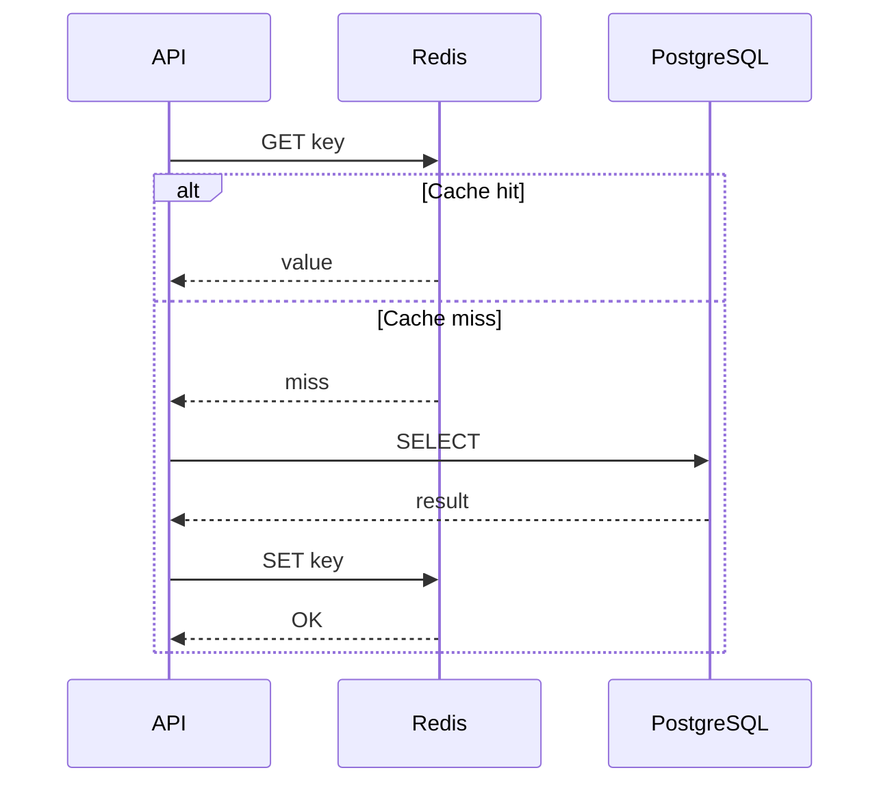
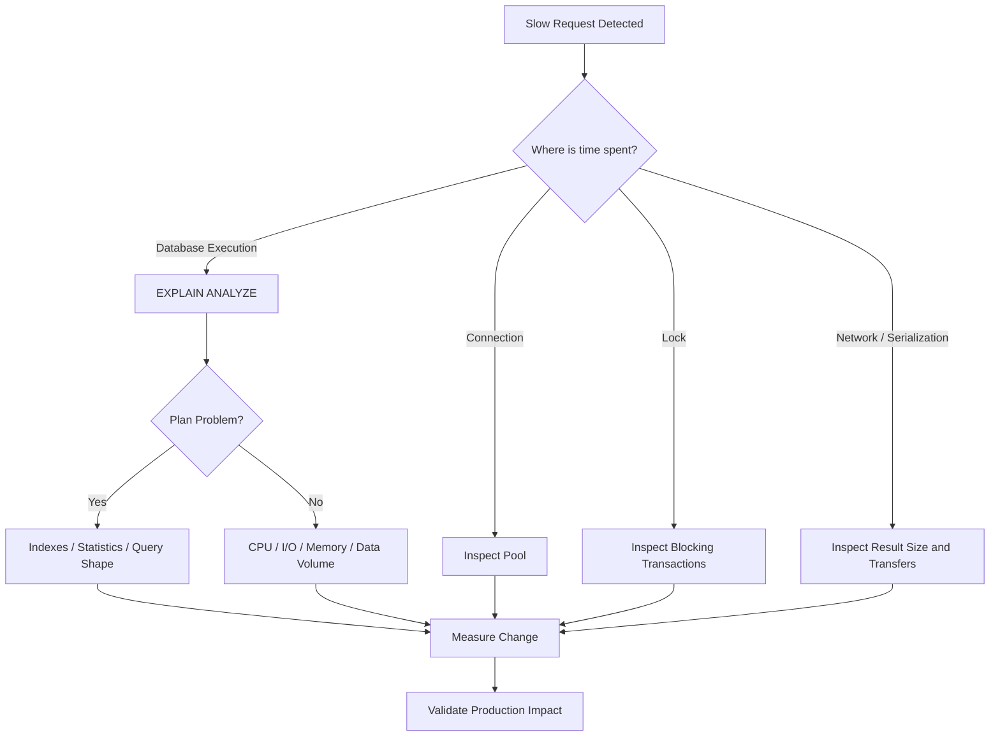

# 17- Slow Query Troubleshooting

## Overview

A **slow query** is a database operation whose latency is high enough to affect an application, workload, or operational objective.

Slow queries are not always caused by inefficient SQL. Query latency can come from:

- Poor execution plans.
- Missing or ineffective indexes.
- Incorrect cardinality estimates.
- Large scans.
- Expensive joins or aggregations.
- Sorting or hashing that spills to disk.
- Lock waits.
- I/O pressure.
- CPU saturation.
- Connection or pool delays.
- Replica lag.
- Excessive result sets.
- Application-side query patterns such as N+1 queries.
- Network transfer of large results.
- Poor transaction boundaries.

The correct troubleshooting approach is therefore:

```text
Observed latency
      ↓
Where is the time spent?
      ↓
Connection / Lock / Planning / Execution / Network / Application
      ↓
Identify bottleneck
      ↓
Measure baseline
      ↓
Apply targeted change
      ↓
Measure again
```

Do not start with assumptions such as "the query needs an index." First determine where the time is actually being spent.

---

## What Makes a Query Slow?

Query latency can be decomposed conceptually as:

```text
Request latency
    │
    ├── connection acquisition
    │
    ├── network round trips
    │
    ├── lock waiting
    │
    ├── query planning
    │
    ├── execution
    │     ├── CPU
    │     ├── memory
    │     ├── storage I/O
    │     ├── joins
    │     ├── sorting
    │     └── aggregation
    │
    └── result transfer
```

A database query that takes 2 seconds at the API level may execute in only 50 ms if the remaining time is spent waiting for a connection or lock.

Conversely, a query may execute for 2 seconds even though there is no contention.

Always separate **waiting time** from **execution time**.

---

## Slow Query Categories

| Category | Typical symptom | Investigation |
|---|---|---|
| Missing index | Large sequential scan | `EXPLAIN` |
| Bad plan | Unexpected join/scan strategy | `EXPLAIN ANALYZE` |
| Cardinality error | Estimated rows differ greatly from actual | Execution plan/statistics |
| Lock wait | Query waits before executing | `pg_stat_activity`, `pg_locks` |
| I/O bound | High reads, low cache hit | `BUFFERS`, OS/cloud metrics |
| CPU bound | High database CPU | Query plan/resource metrics |
| Sort/hash spill | Temporary disk activity | `EXPLAIN (ANALYZE, BUFFERS)` |
| Large result | Database work is acceptable but transfer is slow | Result size/network |
| N+1 | Many small queries | Application tracing/query count |
| Replica lag | Reads return late or stale | Replication metrics |
| Pool exhaustion | API waits before query starts | Pool metrics |

---

## First Principle: Measure Before Optimizing

A common mistake is to modify SQL immediately.

Instead, capture:

```text
query
parameters
database
execution time
planning time
rows returned
query frequency
transaction context
lock wait
execution plan
```

For production systems, also capture:

```text
endpoint
service
request ID
application version
database instance
replica/primary
tenant or workload class
```

This makes optimization evidence-based.

---

## Identify the Exact SQL

ORM code is not the database query.

Django:

```python
queryset = (
    Order.objects
    .filter(customer_id=customer_id, status="pending")
    .select_related("customer")
)
```

may generate SQL with joins, parameters, ordering, and projections that are not obvious from the Python code.

Inspect the actual query:

```python
print(queryset.query)
```

For production troubleshooting, prefer structured database/application logging rather than ad hoc `print()` statements.

With SQLAlchemy, inspect the generated SQL and bound parameters using the application's configured logging or statement compilation facilities.

The database executes SQL, not ORM intent.

---

## Use `EXPLAIN`

Start with:

```sql
EXPLAIN
SELECT
    id,
    customer_id,
    total
FROM app.orders
WHERE customer_id = $1;
```

`EXPLAIN` shows the planner's chosen execution plan without actually executing the query.

Typical information includes:

- Scan type.
- Estimated cost.
- Estimated rows.
- Join strategy.
- Sort operations.
- Aggregation.
- Parallel execution.
- Index usage.

---

## Use `EXPLAIN ANALYZE`

For deeper diagnosis:

```sql
EXPLAIN (ANALYZE)
SELECT
    id,
    customer_id,
    total
FROM app.orders
WHERE customer_id = $1;
```

`ANALYZE` executes the query and reports actual runtime information.

Compare:

```text
estimated rows
vs
actual rows
```

Large differences often indicate poor statistics or a data-distribution problem.

---

## Use `BUFFERS`

For I/O analysis:

```sql
EXPLAIN (ANALYZE, BUFFERS)
SELECT
    id,
    customer_id,
    total
FROM app.orders
WHERE customer_id = $1;
```

This can reveal:

- Shared buffer hits.
- Shared buffer reads.
- Temporary blocks.
- I/O-related behavior.

A useful distinction is:

```text
buffer hit
    ↓
data already available in PostgreSQL shared buffers

buffer read
    ↓
data had to be read into shared buffers
```

High reads can indicate significant storage I/O, although interpretation depends on workload and cache behavior.

---

## Production Safety With `EXPLAIN ANALYZE`

`EXPLAIN ANALYZE` executes the query.

Never assume it is merely diagnostic.

This matters for:

```sql
UPDATE ...
DELETE ...
INSERT ...
```

and for expensive `SELECT` statements.

For a production mutation, consider first using:

```sql
EXPLAIN
```

to inspect the plan without executing the operation.

When `EXPLAIN ANALYZE` is appropriate, use controlled access and understand the query's side effects and expected runtime.

---

## Read the Plan From the Bottom Up

Execution plans are easier to understand by following the data flow from the leaf operations upward.

For example:

```text
Aggregate
    ↑
Hash Join
    ↑
Seq Scan
Index Scan
```

The lower nodes produce rows.

The upper nodes consume and transform them.

Ask:

1. How many rows enter each node?
2. How many rows leave?
3. How much time does the node consume?
4. How many loops occur?
5. How much data is read?
6. Is the node doing work that could have been avoided?

---

## Sequential Scan

A sequential scan reads table pages and examines qualifying rows.

Example:

```text
Seq Scan on orders
```

A sequential scan is not automatically bad.

For a small table:

```text
table = 500 rows
```

reading the entire table can be cheaper than using an index.

For a large table where only a tiny fraction of rows qualify, it may be inefficient.

The correct question is:

> Is the chosen access path appropriate for this data distribution and query?

---

## Index Scan

An index scan uses an index to locate qualifying rows.

Example:

```text
Index Scan using orders_customer_id_idx on orders
```

Indexes are particularly useful when:

- The predicate is selective.
- The access pattern matches the index structure.
- The table is sufficiently large.
- The query can efficiently use the indexed columns.

An index does not guarantee an index scan.

The optimizer chooses the plan with the lowest estimated cost.

---

## Bitmap Scans

PostgreSQL may choose:

```text
Bitmap Index Scan
        ↓
Bitmap Heap Scan
```

This can be useful when many rows match an index predicate.

The planner can collect matching heap locations and then access table pages more efficiently.

Do not treat a bitmap scan as a failed index scan. It is a deliberate access strategy.

---

## Index-Only Scans

If the query can obtain all required data from an index and PostgreSQL can verify tuple visibility appropriately, it may use an index-only scan.

Example:

```sql
CREATE INDEX orders_customer_created_idx
ON app.orders (customer_id, created_at DESC)
INCLUDE (status, total);
```

Then a query such as:

```sql
SELECT
    created_at,
    status,
    total
FROM app.orders
WHERE customer_id = $1
ORDER BY created_at DESC
LIMIT 50;
```

may be able to avoid fetching many heap pages.

Index-only scans depend on visibility information and workload characteristics, so adding `INCLUDE` columns should be justified by measured access patterns.

---

## Sargability

A predicate is generally more index-friendly when the indexed column can be used directly for searching.

Less favorable:

```sql
WHERE LOWER(email) = LOWER($1)
```

unless an appropriate expression index exists.

Potentially better:

```sql
CREATE INDEX users_lower_email_idx
ON app.users (LOWER(email));
```

Then:

```sql
WHERE LOWER(email) = LOWER($1)
```

can use that expression index.

The goal is not to avoid functions categorically.

The goal is to ensure the access path matches the predicate.

---

## Common Index Problems

A query may remain slow despite having an index because:

- The index is not selective enough.
- The predicate does not match the index.
- The wrong leading column is used in a composite index.
- Statistics are stale.
- The table is small.
- The query returns a large percentage of the table.
- An expression prevents use of a normal index.
- Type mismatches affect the expression or comparison.
- The required sort is not supported efficiently.
- The index exists on the wrong table or column.

Index troubleshooting should therefore start with the execution plan.

---

## Composite Indexes

Suppose queries commonly use:

```sql
WHERE tenant_id = $1
  AND status = $2
ORDER BY created_at DESC
```

An index such as:

```sql
CREATE INDEX orders_tenant_status_created_idx
ON app.orders (tenant_id, status, created_at DESC);
```

may support the access pattern effectively.

Column order matters.

Do not create composite indexes based only on the presence of columns. Consider:

- Equality predicates.
- Range predicates.
- Ordering.
- Selectivity.
- Query frequency.
- Write cost.
- Other queries using the same index.

---

## Cardinality Estimates

The optimizer relies heavily on row-count estimates.

Example:

```text
Estimated rows: 10
Actual rows:    500,000
```

This is a major warning sign.

The planner may have selected a nested-loop strategy expecting a few rows, while the actual workload produces hundreds of thousands.

This can turn a seemingly reasonable plan into a very expensive one.

---

## Statistics

PostgreSQL maintains statistics used by the optimizer.

Inspect statistics with:

```sql
SELECT
    schemaname,
    tablename,
    attname,
    n_distinct,
    most_common_vals,
    histogram_bounds
FROM pg_stats
WHERE schemaname = 'app'
  AND tablename = 'orders';
```

If data distribution has changed significantly, statistics may not accurately represent the current workload.

PostgreSQL's autovacuum/analyze machinery normally maintains statistics, but high-churn or unusual workloads may require investigation of analyze behavior.

---

## Extended Statistics

Simple per-column statistics do not always capture correlations.

Suppose:

```text
country = 'IN'
status = 'active'
```

are highly correlated.

Independent estimates may be inaccurate.

PostgreSQL supports extended statistics for cases involving relationships among columns.

Example:

```sql
CREATE STATISTICS orders_tenant_status_stats
ON tenant_id, status
FROM app.orders;
```

Then statistics can help the optimizer make better estimates for combinations of columns.

Use this when execution plans demonstrate a cardinality-estimation problem, not as a default optimization step.

---

## Join Problems

A query can be slow because of an expensive join rather than the base table scan.

Common join strategies include:

- Nested loop.
- Hash join.
- Merge join.

The appropriate strategy depends on:

- Input cardinality.
- Available indexes.
- Sort order.
- Memory.
- Data distribution.

Example:

```sql
SELECT
    o.id,
    c.email
FROM app.orders AS o
JOIN app.customers AS c
    ON c.id = o.customer_id
WHERE o.status = 'pending';
```

Inspect both sides of the join.

Do not optimize only the table appearing first in the SQL text.

---

## Nested Loop

Nested loops can be excellent when the outer side is small and the inner side has an efficient access path.

Conceptually:

```text
10 outer rows
    ↓
10 index lookups
```

can be very fast.

But:

```text
500,000 outer rows
    ↓
500,000 expensive inner operations
```

can become extremely expensive.

Always inspect:

```text
actual rows
loops
```

for nested-loop nodes.

---

## Hash Join

Hash joins can be effective for larger equality joins.

Conceptually:

```text
Build hash table
       ↓
Probe hash table
       ↓
Matching rows
```

They require memory.

If memory is insufficient, PostgreSQL may spill work to temporary storage.

For hash joins, inspect:

```text
Buckets
Batches
Memory Usage
```

in the execution plan.

---

## Merge Join

Merge joins work efficiently when both inputs are available in compatible sorted order.

They can be useful for large joins where sorting or existing ordering makes the strategy attractive.

Do not choose join algorithms manually as a first response.

The optimizer normally selects them based on cost estimates.

Investigate why its chosen strategy is expensive.

---

## Sort Operations

Sorting can be expensive:

```sql
SELECT *
FROM app.orders
WHERE customer_id = $1
ORDER BY created_at DESC;
```

If the plan requires a large sort:

```text
Sort
  Sort Key: created_at DESC
```

inspect:

- Number of rows.
- Sort method.
- Memory usage.
- Temporary disk usage.

An appropriate index may eliminate or reduce the required sorting:

```sql
CREATE INDEX orders_customer_created_idx
ON app.orders (customer_id, created_at DESC);
```

Do not add an index solely to avoid a sort without confirming that the query pattern is frequent and the index cost is justified.

---

## Temporary Disk Usage

Large sorts, hashes, and other operations may use temporary files.

This can create:

```text
CPU
+
memory pressure
+
storage I/O
```

Inspect:

```sql
EXPLAIN (ANALYZE, BUFFERS)
...
```

and database-level temporary file metrics.

Increasing memory can help some workloads, but excessive memory settings can become dangerous when many queries execute concurrently.

Optimize the operation before simply increasing resource limits.

---

## Aggregation

Aggregations can become expensive:

```sql
SELECT
    customer_id,
    SUM(total)
FROM app.orders
GROUP BY customer_id;
```

Investigate:

- Number of input rows.
- Group cardinality.
- Sort/hash behavior.
- Parallel execution.
- Filtering before aggregation.

Push selective filtering as early as practical:

```sql
SELECT
    customer_id,
    SUM(total)
FROM app.orders
WHERE created_at >= $1
GROUP BY customer_id;
```

The reduction in input rows can matter more than the aggregation operation itself.

---

## Filtering Early

Suppose:

```text
10 million rows
      ↓
join
      ↓
filter to 100 rows
```

versus:

```text
10 million rows
      ↓
filter to 100,000
      ↓
join
      ↓
100 rows
```

The second approach may be dramatically cheaper.

The optimizer often performs predicate pushdown and related transformations automatically.

Still, poor estimates, query structure, or semantic constraints can prevent ideal plans.

Inspect the actual plan rather than relying on the SQL text order.

---

## `SELECT *`

Avoid unnecessary projections in application queries.

Instead of:

```sql
SELECT *
FROM app.orders
WHERE id = $1;
```

prefer:

```sql
SELECT
    id,
    status,
    total,
    created_at
FROM app.orders
WHERE id = $1;
```

Benefits include:

- Less data transfer.
- Lower application memory usage.
- Potential index-only scans.
- Smaller serialization cost.
- Lower network utilization.

This becomes important for large API responses and high-throughput services.

---

## Large Result Sets

A query may be technically efficient but still slow because it returns millions of rows.

Example:

```text
database execution: 200 ms
network transfer:   4 seconds
JSON serialization: 2 seconds
```

The database is not necessarily the primary bottleneck.

For APIs:

- Paginate results.
- Use keyset pagination for large ordered datasets.
- Return only required fields.
- Avoid unbounded exports in synchronous requests.

For large exports, use asynchronous workflows.

---

## Offset Pagination

This can become expensive:

```sql
SELECT
    id,
    created_at,
    total
FROM app.orders
ORDER BY created_at DESC
LIMIT 100
OFFSET 1000000;
```

The database may need to process and discard a large number of preceding rows.

For large datasets, keyset pagination can be more efficient.

---

## Keyset Pagination

Example:

```sql
SELECT
    id,
    created_at,
    total
FROM app.orders
WHERE (created_at, id) < ($1, $2)
ORDER BY created_at DESC, id DESC
LIMIT 100;
```

An appropriate index:

```sql
CREATE INDEX orders_created_id_idx
ON app.orders (created_at DESC, id DESC);
```

This allows the query to continue from a known position rather than repeatedly skipping earlier rows.

---

## N+1 Query Problems

An API can appear to have a slow query when the real problem is hundreds of small queries.

Example:

```text
GET /orders
    ↓
1 query for orders
    ↓
100 queries for customers
    ↓
100 queries for items
```

Total:

```text
201 database queries
```

Django can often address this with:

```python
orders = (
    Order.objects
    .select_related("customer")
    .prefetch_related("items")
)
```

The correct optimization is not necessarily making each query faster.

It may be reducing the number of queries.

---

## Query Frequency Matters

A query taking 100 ms once per hour may be less important than:

```text
query latency = 5 ms
frequency = 10,000 requests/second
```

Optimize based on workload impact.

A useful mental model is:

```text
total database cost
≈
latency × execution frequency × concurrency
```

The exact relationship depends on workload, but frequency is critical when prioritizing optimization.

---

## `pg_stat_statements`

For production workload analysis, `pg_stat_statements` is one of the most useful PostgreSQL extensions.

It aggregates statistics for normalized SQL statements.

Typical fields include:

- Calls.
- Total execution time.
- Mean execution time.
- Rows.
- Shared block hits.
- Shared block reads.
- Temporary blocks.
- WAL-related activity depending on version/configuration.

Example:

```sql
SELECT
    calls,
    total_exec_time,
    mean_exec_time,
    rows,
    shared_blks_hit,
    shared_blks_read,
    query
FROM pg_stat_statements
ORDER BY total_exec_time DESC
LIMIT 20;
```

This helps answer:

> Which queries consume the most database time?

---

## Total Time vs Mean Time

These two rankings can tell different stories.

Query A:

```text
mean = 2 seconds
calls = 10
```

Query B:

```text
mean = 10 ms
calls = 1,000,000
```

Query A has worse individual latency.

Query B may consume dramatically more total database resources.

Optimize according to the production objective:

- User-facing latency.
- Database capacity.
- Throughput.
- Cost.
- Tail latency.

---

## Planning Time

Some queries spend meaningful time planning.

This can happen with:

- Complex SQL.
- Many joins.
- Large query structures.
- Frequent ad hoc statements.
- Highly dynamic SQL.

Use:

```sql
EXPLAIN (ANALYZE, BUFFERS)
...
```

and inspect planning versus execution time.

If planning dominates, prepared statements or query simplification may help in appropriate workloads.

Do not optimize planning time without measuring it first.

---

## Prepared Statements and Plan Stability

Prepared statements can interact with PostgreSQL plan selection.

The planner may use custom or generic plans depending on the execution context.

This matters for parameter-sensitive queries.

For example:

```text
tenant A → 90% of rows
tenant B → 0.01% of rows
```

The best plan may differ substantially between parameter values.

A generic plan can therefore be suboptimal for some workloads.

When performance varies dramatically by parameter, investigate plan behavior rather than assuming the SQL itself is inconsistent.

---

## Parameter-Sensitive Queries

A query can be fast for:

```text
customer_id = small_customer
```

and slow for:

```text
customer_id = huge_customer
```

because the number of matching rows differs significantly.

This can affect:

- Join strategy.
- Index vs sequential scan.
- Memory usage.
- Sort cost.
- Result size.

When latency varies by parameter, compare plans and actual row counts for representative values.

---

## Lock Waits Masquerading as Slow Queries

Use:

```sql
SELECT
    pid,
    wait_event_type,
    wait_event,
    query_start,
    xact_start,
    query
FROM pg_stat_activity
WHERE state = 'active';
```

If:

```text
wait_event_type = Lock
```

the query may be slow because it is waiting, not because its execution plan is inefficient.

Then inspect:

```sql
SELECT
    pid,
    pg_blocking_pids(pid)
FROM pg_stat_activity
WHERE wait_event_type = 'Lock';
```

Fixing an index will not resolve a query that spends 5 seconds waiting for another transaction.

---

## Long Transactions

Long-running transactions can cause both lock and visibility-related problems.

Inspect:

```sql
SELECT
    pid,
    usename,
    state,
    xact_start,
    query_start,
    now() - xact_start AS transaction_age,
    query
FROM pg_stat_activity
WHERE xact_start IS NOT NULL
ORDER BY xact_start;
```

Look for:

- Long transactions.
- `idle in transaction`.
- Large batch operations.
- Transactions spanning external calls.

Transaction duration is often more important than individual statement duration when diagnosing concurrency issues.

---

## Replica Slow Queries

A query executed on a read replica can be slow for reasons beyond the query itself.

Potential causes include:

- Replica replay pressure.
- Long-running queries.
- Storage I/O.
- CPU saturation.
- Replication conflicts.
- Replica lag.

Check whether the request actually went to:

```text
primary
```

or:

```text
read replica
```

before comparing plans and performance.

---

## Read Replica Routing

A common architecture is:

```text
API
 ├── writes ───────► Primary
 │
 └── reads ────────► Read Replica
```

But routing introduces consistency and operational concerns.

A freshly written record may not yet exist on the replica.

For latency-sensitive read-after-write operations, route appropriately:

```text
write
  ↓
primary
  ↓
subsequent consistent read
  ↓
primary or sufficiently caught-up replica
```

Slow-query investigation must include routing information.

---

## Application Connection Pooling

A request may wait for a database connection before its query starts.

Example:

```text
HTTP request
    ↓
connection pool
    ↓
WAIT 500 ms
    ↓
database query
    ↓
20 ms
```

The query is not slow.

The request is slow because the connection pool is exhausted.

Monitor:

```text
pool acquisition latency
pool utilization
active connections
idle connections
database connections
```

Do not optimize SQL to solve a pool-sizing problem.

---

## Network Latency

For remote databases:

```text
application
    ↓
network
    ↓
PostgreSQL
    ↓
network
    ↓
application
```

Round trips matter.

A workflow involving many small queries can therefore perform poorly even when each query executes quickly.

This is particularly relevant for:

- Microservices.
- Cross-AZ traffic.
- Cross-region connections.
- Kubernetes-to-database traffic.
- Chatty ORM patterns.

Reduce unnecessary round trips.

---

## CPU-Bound Queries

A query may be CPU-heavy because of:

- Large joins.
- Sorting.
- Aggregation.
- Expression evaluation.
- JSON processing.
- Regex operations.
- Large scans.

If database CPU is saturated, adding indexes may help some queries but not all.

Use execution plans to identify the CPU-consuming operators.

At scale, consider workload isolation:

```text
OLTP workload
      ↓
PostgreSQL primary

Analytics workload
      ↓
Read replica / warehouse / OLAP system
```

Do not force analytical workloads onto the transactional primary indefinitely.

---

## I/O-Bound Queries

I/O-heavy queries often show substantial buffer reads.

Potential causes include:

- Large table scans.
- Poor locality.
- Insufficient caching.
- Large indexes.
- Cold data.
- Storage constraints.

Cloud database performance can also depend on storage characteristics and IOPS/throughput limits.

For AWS-hosted PostgreSQL, correlate query behavior with database-level CPU, storage, I/O, and throughput metrics.

---

## Memory Pressure

Memory affects:

- Sorts.
- Hash joins.
- Aggregations.
- Caching.
- Concurrent query capacity.

Increasing per-query memory can improve one query while harming the system under concurrency.

For example:

```text
work_mem = large
100 concurrent operations
        ↓
potentially large aggregate memory consumption
```

Tune memory with concurrency in mind.

Avoid solving one query's spill problem by creating system-wide memory instability.

---

## Query Plan Regression

A query can become slow even though its SQL has not changed.

Possible causes:

- Data distribution changed.
- Statistics changed.
- Index changed.
- Table grew.
- PostgreSQL version changed.
- Configuration changed.
- Parameter distribution changed.
- Cache state changed.
- Hardware changed.

This is called a **plan regression** when the selected plan becomes materially worse.

Store representative plans for important queries and compare them when performance changes.

---

## Query Plan Changes After Data Growth

A query that worked well with:

```text
100,000 rows
```

may behave differently at:

```text
100,000,000 rows
```

The optimizer may correctly change from:

```text
Index Scan
```

to:

```text
Sequential Scan
```

if a large portion of the table now qualifies.

This is not necessarily a regression.

The workload changed.

Performance engineering must account for expected data growth.

---

## Partition Pruning

Large partitioned tables can avoid scanning irrelevant partitions.

Example:

```sql
SELECT *
FROM app.events
WHERE occurred_at >= $1
  AND occurred_at < $2;
```

With appropriate range partitioning, PostgreSQL may prune partitions outside the requested time range.

Inspect the plan for evidence of partition pruning.

Partitioning is useful when it aligns with data lifecycle and access patterns.

It is not a substitute for query optimization on every partition.

---

## CTEs and Query Structure

Common table expressions can affect query planning depending on PostgreSQL version and whether the CTE is materialized.

Example:

```sql
WITH recent_orders AS (
    SELECT *
    FROM app.orders
    WHERE created_at >= $1
)
SELECT ...
FROM recent_orders;
```

Do not assume:

```text
CTE = temporary table
```

or:

```text
CTE = always faster
```

Inspect the execution plan.

For cases where materialization semantics matter, PostgreSQL supports explicit `MATERIALIZED` and `NOT MATERIALIZED` options.

---

## Materialized Views

For expensive analytical or aggregation queries that do not require real-time results, a materialized view may be appropriate.

Conceptually:

```text
expensive query
      ↓
materialized result
      ↓
fast reads
```

Refresh strategy becomes part of the architecture.

For example:

```text
Celery scheduled task
       ↓
REFRESH MATERIALIZED VIEW
       ↓
analytics API
```

This trades freshness for query performance.

---

## Caching

Redis can reduce repeated database queries.

Typical cache-aside flow:



Caching is useful when:

- Data is frequently read.
- Results are expensive to compute.
- Staleness is acceptable.
- Cache invalidation can be designed safely.

Caching should not hide an obviously broken query plan indefinitely.

---

## Cache Stampede

If a frequently accessed key expires:

```text
cache expires
    ↓
1,000 requests miss
    ↓
1,000 database queries
    ↓
database overload
```

Mitigation can include:

- Request coalescing.
- Jittered expiration.
- Background refresh.
- Locks where appropriate.
- Stale-while-revalidate patterns.

Caching is another concurrency layer and should be analyzed as part of the complete system.

---

## Asynchronous Workloads

Some database operations should not execute synchronously in an API request.

Examples:

- Large CSV exports.
- Analytics reports.
- Historical aggregation.
- Bulk processing.
- Reconciliation.
- Data migrations.

Architecture:

```text
REST API
   ↓
create job
   ↓
Celery / Kafka
   ↓
worker
   ↓
PostgreSQL
   ↓
object storage
```

The API returns quickly while the expensive database workload is processed asynchronously.

---

## Security Considerations

Slow queries can become a denial-of-service vector.

An attacker may intentionally trigger:

- Expensive searches.
- Large result sets.
- Complex filters.
- Expensive regex operations.
- Repeated report generation.
- Unbounded pagination.

Protect production systems with:

- Authentication and authorization.
- Input validation.
- Query limits.
- Pagination.
- Rate limiting.
- Statement timeouts.
- Resource quotas where appropriate.
- Read-only/reporting roles.
- Workload isolation.

Never solve performance problems by removing authorization or validation.

---

## Timeouts as Safety Controls

Useful PostgreSQL settings include:

```sql
SET statement_timeout = '5s';
SET lock_timeout = '2s';
```

These are safety boundaries.

They prevent individual operations from consuming resources indefinitely.

However:

```text
timeout
≠
optimization
```

If an important query repeatedly hits `statement_timeout`, investigate the query, workload, resource limits, and data growth.

---

## Query Cancellation

Operationally, a runaway query may need cancellation.

Inspect active queries:

```sql
SELECT
    pid,
    usename,
    state,
    query_start,
    now() - query_start AS duration,
    query
FROM pg_stat_activity
WHERE state = 'active'
ORDER BY query_start;
```

A privileged operator can cancel a specific backend when appropriate:

```sql
SELECT pg_cancel_backend($1);
```

Termination is stronger:

```sql
SELECT pg_terminate_backend($1);
```

Use these carefully in production.

Cancellation should be part of an incident runbook, not an everyday performance strategy.

---

## A Practical Slow Query Workflow

Use this sequence:



Do not skip the first branching step.

---

## A Complete Diagnostic Query Set

### Active Queries

```sql
SELECT
    pid,
    usename,
    application_name,
    client_addr,
    state,
    wait_event_type,
    wait_event,
    query_start,
    now() - query_start AS duration,
    query
FROM pg_stat_activity
WHERE state <> 'idle'
ORDER BY query_start;
```

### Long Transactions

```sql
SELECT
    pid,
    usename,
    state,
    xact_start,
    now() - xact_start AS transaction_age,
    query
FROM pg_stat_activity
WHERE xact_start IS NOT NULL
ORDER BY xact_start;
```

### Blocking Queries

```sql
SELECT
    pid,
    pg_blocking_pids(pid) AS blocking_pids,
    wait_event_type,
    wait_event,
    query
FROM pg_stat_activity
WHERE wait_event_type = 'Lock';
```

### Query Statistics

```sql
SELECT
    calls,
    total_exec_time,
    mean_exec_time,
    rows,
    shared_blks_hit,
    shared_blks_read,
    query
FROM pg_stat_statements
ORDER BY total_exec_time DESC
LIMIT 20;
```

---

## Query Optimization Decision Framework

| Observation | Likely direction |
|---|---|
| Huge sequential scan, selective predicate | Investigate indexing |
| Index exists but unused | Check selectivity, statistics, predicate, cost |
| Estimated rows far from actual | Investigate statistics/cardinality |
| Nested loop with huge loops | Investigate join estimates/indexes |
| Large sort | Investigate ordering/index/query shape |
| Temporary disk activity | Investigate sort/hash/memory |
| High lock wait | Investigate transaction/locking design |
| High connection-pool wait | Investigate pool sizing/query duration |
| Huge result set | Reduce projection/paginate/async export |
| Many small queries | Investigate N+1/round trips |
| Replica slow | Investigate replay/I/O/CPU/long queries |
| High total execution time | Investigate frequent expensive queries |
| High mean execution time | Investigate individual query efficiency |
| Performance changed after data growth | Recheck plans/statistics/indexes |
| Performance varies by parameter | Investigate cardinality and plan selection |

---

## Production Optimization Process

A disciplined optimization cycle is:

1. Establish the user-facing symptom.
2. Measure request and database latency separately.
3. Identify the exact SQL.
4. Capture representative parameters.
5. Determine whether the query is waiting or executing.
6. Capture `EXPLAIN`.
7. Capture `EXPLAIN ANALYZE` safely where appropriate.
8. Inspect `BUFFERS`.
9. Compare estimated and actual cardinalities.
10. Check indexes and statistics.
11. Check joins, sorts, aggregations, and result size.
12. Check connection pools and network behavior.
13. Make the smallest justified change.
14. Benchmark representative workloads.
15. Deploy safely.
16. Compare production metrics before and after.

---

## Benchmarking

Do not benchmark only one execution.

Consider:

```text
cold cache
warm cache
small parameters
large parameters
normal concurrency
peak concurrency
representative data volume
```

A query that is fast in a developer laptop database may be slow in production because:

```text
production rows
≫
development rows
```

or:

```text
production concurrency
≫
development concurrency
```

Benchmark against realistic conditions.

---

## Regression Prevention

Important queries should have performance visibility before they become incidents.

Useful mechanisms include:

- `pg_stat_statements`.
- Application tracing.
- Query latency dashboards.
- Slow-query logs.
- Representative `EXPLAIN` plans.
- Load tests.
- Production-like datasets.
- Database migration reviews.
- Index reviews.

Performance regressions often enter through ordinary feature changes.

For example:

```text
new API filter
    ↓
new JOIN
    ↓
10× more rows
    ↓
new sort
    ↓
p99 latency regression
```

Review query behavior as part of application code review.

---

## Common Mistakes

### Adding an Index Without Reading the Plan

An index may be unused or may not address the actual bottleneck.

**Fix:** inspect `EXPLAIN` first.

### Assuming Sequential Scan Means Bad Performance

Sequential scans are often optimal for small tables or low-selectivity predicates.

**Fix:** judge the plan against table size and selectivity.

### Using `EXPLAIN ANALYZE` Carelessly

It executes the statement.

**Fix:** understand side effects before running it, especially for mutations.

### Looking Only at Average Latency

A query can have acceptable average latency while p99 is unacceptable.

**Fix:** monitor tail latency.

### Optimizing the Slowest Query by Mean Time

A query with high mean latency may execute rarely.

**Fix:** also inspect total execution time and call frequency.

### Ignoring Lock Waits

A query may be fast when executed but spend seconds waiting.

**Fix:** inspect `pg_stat_activity` and blocking sessions.

### Increasing `work_mem` Globally

This can create memory pressure under concurrency.

**Fix:** understand concurrent workload before changing memory configuration.

### Returning Huge Results

Database execution may be fast while serialization and network transfer dominate.

**Fix:** paginate, project only required columns, or move large exports to asynchronous jobs.

### Fixing N+1 by Optimizing Individual Queries

Making 500 tiny queries 10% faster does not solve the architectural problem.

**Fix:** reduce query count using joins, prefetching, batching, or appropriate read models.

### Adding Redis Immediately

Caching can hide underlying database problems and introduces invalidation complexity.

**Fix:** first determine whether the query itself or repeated access is the real bottleneck.

### Ignoring Data Growth

A query that works with one million rows may fail at one hundred million.

**Fix:** design and test for expected production scale.

### Increasing Database Size Without Diagnosis

More CPU or I/O can help resource saturation but will not fix inefficient query shapes or lock serialization.

**Fix:** identify the limiting resource first.

### Ignoring ORM-Generated SQL

High-level ORM code can generate joins, repeated queries, and large projections.

**Fix:** inspect the actual SQL and query count.

---

## Senior-Level Performance Reasoning

Senior engineers should reason about the entire path:

```text
Client
  ↓
Nginx / Load Balancer
  ↓
API service
  ↓
Connection pool
  ↓
PostgreSQL
  ↓
Query planner
  ↓
Execution
  ↓
Storage / memory / CPU
  ↓
Result transfer
  ↓
Serialization
  ↓
API response
```

A slow SQL incident can originate outside SQL.

For example:

```text
slow API
   ↓
connection pool wait
   ↓
not SQL execution
```

or:

```text
slow API
   ↓
database query
   ↓
large result
   ↓
JSON serialization
```

or:

```text
slow query
   ↓
lock wait
   ↓
long transaction
```

The query text is only one component of the system.

---

## Production Checklist

- [ ] Identify the exact SQL.
- [ ] Capture representative parameters.
- [ ] Measure application latency.
- [ ] Measure database execution latency.
- [ ] Check connection-pool wait time.
- [ ] Check lock waits.
- [ ] Check long transactions.
- [ ] Run `EXPLAIN`.
- [ ] Run `EXPLAIN ANALYZE` safely when appropriate.
- [ ] Inspect `BUFFERS`.
- [ ] Compare estimated and actual rows.
- [ ] Inspect scan types.
- [ ] Inspect joins.
- [ ] Inspect sorts and aggregations.
- [ ] Inspect temporary disk usage.
- [ ] Review indexes.
- [ ] Review statistics.
- [ ] Check result size.
- [ ] Check N+1 query patterns.
- [ ] Check replica routing and lag.
- [ ] Check CPU and I/O.
- [ ] Check query frequency.
- [ ] Compare p50/p95/p99 latency.
- [ ] Benchmark before changing configuration.
- [ ] Validate improvements in production.
- [ ] Add regression monitoring for important queries.

---

## Interview Traps

### Is Every Slow Query a Bad Query?

No. Query latency can be caused by locks, connection pools, I/O, CPU, network transfer, or large results.

### Is a Sequential Scan Always Bad?

No. A sequential scan can be the optimal plan for small tables or queries returning a large percentage of rows.

### Does an Index Guarantee Better Performance?

No. PostgreSQL chooses an access path based on estimated cost and data distribution.

### What Does `EXPLAIN ANALYZE` Do?

It executes the query and reports actual execution information alongside the plan.

### Why Use `BUFFERS`?

It helps identify buffer hits, reads, and temporary I/O behavior, making storage/cache-related problems easier to diagnose.

### What Does a Large Estimated-vs-Actual Row Difference Mean?

It indicates a cardinality estimation problem that may result from stale or insufficient statistics, correlated data, parameter sensitivity, or query complexity.

### Why Can a Nested Loop Be Slow?

A nested loop can become expensive when the outer relation produces many rows and the inner operation executes repeatedly.

### Why Can a Query Be Fast in Development and Slow in Production?

Production may have dramatically different:

- Data volume.
- Data distribution.
- Concurrency.
- Cache state.
- Hardware.
- Query frequency.
- Parameter distribution.

### How Do You Find the Most Expensive Production Queries?

`pg_stat_statements` can rank normalized statements by total execution time, mean execution time, calls, rows, and I/O-related statistics.

### Why Is Total Execution Time Important?

A moderately expensive query executed millions of times can consume more database capacity than a very slow query executed rarely.

### How Do You Know Whether a Slow Query Is Actually Waiting?

Inspect `pg_stat_activity` and its wait information. A `Lock` wait indicates the query is waiting on a lock rather than simply consuming execution resources.

### Should You Increase Database CPU When Queries Are Slow?

Only after determining CPU is the bottleneck. More capacity cannot reliably fix poor query plans, lock serialization, N+1 patterns, or excessive result transfer.

### What Is the Senior-Level Approach to Slow Queries?

Separate the problem into:

```text
waiting
vs
planning
vs
execution
vs
I/O
vs
network
vs
application processing
```

Then optimize the measured bottleneck rather than applying generic SQL tuning rules.

## Key Takeaways

- **Measure the complete latency path:** distinguish connection waits, lock waits, planning, execution, I/O, network transfer, and application processing before changing SQL.
- **Use execution plans as the primary diagnostic tool:** `EXPLAIN`, `EXPLAIN ANALYZE`, and `BUFFERS` reveal access paths, cardinality errors, joins, sorting, loops, and I/O behavior.
- **Optimize workload impact, not just individual query latency:** consider execution frequency, concurrency, total database time, p95/p99 latency, and result size.
- **Treat ORM and infrastructure as part of query performance:** N+1 queries, connection-pool exhaustion, replica routing, network round trips, and transaction scope can dominate database latency.
- **Prevent regressions with continuous observability:** combine `pg_stat_statements`, application tracing, realistic benchmarks, migration/index reviews, and production metrics to keep query performance stable as data and traffic grow.