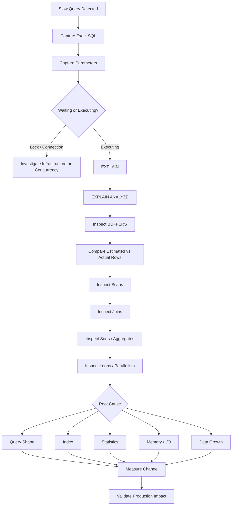

# 18- Execution Plan Troubleshooting

## Overview

An execution plan is PostgreSQL's concrete strategy for executing a SQL statement.

For a slow query, the execution plan answers questions such as:

- Which tables are scanned?
- Which indexes are used?
- How many rows does PostgreSQL expect?
- How many rows actually pass through each operation?
- Which join strategy is selected?
- Where is sorting performed?
- Is work spilling to temporary storage?
- Is parallel execution being used?
- How many times is an operation repeated?
- Where is most execution time spent?

The most important troubleshooting principle is:

> Do not optimize the SQL text first. Understand the execution plan first.

A query can be slow even with an index, and a sequential scan can be the correct plan. Execution-plan troubleshooting is about determining **why PostgreSQL chose a particular plan and whether that plan is appropriate for the actual workload**.

---

## Execution Plan Mental Model

A backend request typically follows:

```text
Client
  ↓
Nginx / Load Balancer
  ↓
Django / FastAPI
  ↓
Connection Pool
  ↓
PostgreSQL
  ↓
Parse / Analyze
  ↓
Rewrite
  ↓
Plan
  ↓
Execute
  ↓
Return Rows
  ↓
Serialization
  ↓
HTTP / gRPC Response
```

The execution plan primarily describes the work performed after planning.

Therefore:

```text
Slow API
  ≠
Always slow execution plan
```

The actual bottleneck may be:

```text
connection acquisition
lock waiting
planning
execution
network transfer
serialization
```

Always establish where the time is being spent before interpreting the plan.

---

## What an Execution Plan Contains

A plan is a tree of operations called **plan nodes**.

Example:

```text
Limit
  └── Index Scan
```

More complex:

```text
Aggregate
  └── Hash Join
      ├── Seq Scan
      └── Hash
          └── Index Scan
```

Each node represents an operation such as:

- Sequential scan.
- Index scan.
- Bitmap scan.
- Nested loop.
- Hash join.
- Merge join.
- Sort.
- Aggregate.
- Materialization.
- Gather.
- Append.
- Limit.

The parent node consumes rows produced by its child nodes.

---

## `EXPLAIN`

The basic command is:

```sql
EXPLAIN
SELECT
    id,
    customer_id,
    total
FROM app.orders
WHERE customer_id = $1;
```

`EXPLAIN` asks PostgreSQL to generate the plan without executing the statement.

Typical output:

```text
Index Scan using orders_customer_id_idx on orders
  (cost=0.42..8.44 rows=10 width=40)
```

The important values are:

| Value | Meaning |
|---|---|
| `cost` | Estimated startup and total planner cost |
| `rows` | Estimated number of rows produced |
| `width` | Estimated average row width |
| Node type | Planned operation |
| Index name | Index selected by the planner |

The `cost` value is **not milliseconds**.

It is an internal relative cost used to compare alternative plans.

---

## `EXPLAIN ANALYZE`

To compare estimates with actual execution:

```sql
EXPLAIN (ANALYZE)
SELECT
    id,
    customer_id,
    total
FROM app.orders
WHERE customer_id = $1;
```

This executes the query.

Example:

```text
Index Scan using orders_customer_id_idx on orders
  (cost=0.42..8.44 rows=10 width=40)
  (actual time=0.031..0.145 rows=12 loops=1)
```

Now you can compare:

```text
estimated rows = 10
actual rows    = 12
```

A large difference can indicate a cardinality estimation problem.

---

## `EXPLAIN ANALYZE` Is Not Read-Only

A critical operational rule:

```sql
EXPLAIN ANALYZE UPDATE ...
```

executes the `UPDATE`.

Likewise:

```sql
EXPLAIN ANALYZE DELETE ...
```

executes the `DELETE`.

For mutations, use plain `EXPLAIN` unless you have deliberately controlled the execution environment.

For expensive production `SELECT` statements, understand that `EXPLAIN ANALYZE` still consumes production resources.

---

## `BUFFERS`

For storage and cache behavior:

```sql
EXPLAIN (ANALYZE, BUFFERS)
SELECT
    id,
    customer_id,
    total
FROM app.orders
WHERE customer_id = $1;
```

Important fields include:

```text
shared hit
shared read
shared dirtied
shared written
temp read
temp written
```

Conceptually:

```text
shared hit
    ↓
page already available in PostgreSQL shared buffers

shared read
    ↓
page had to be read into shared buffers
```

A high number of reads can indicate significant storage activity, but it must be interpreted together with workload size, cache state, and system-level I/O metrics.

---

## Planning Time vs Execution Time

`EXPLAIN ANALYZE` can show:

```text
Planning Time: 0.200 ms
Execution Time: 12.500 ms
```

The distinction matters.

A query may be slow because:

```text
planning is expensive
```

or:

```text
execution is expensive
```

For most normal OLTP queries, execution dominates.

For very complex or highly dynamic SQL, planning overhead can become significant.

Do not optimize planning unless measurements show that it matters.

---

## Reading Plans Correctly

Execution plans are trees.

Consider:

```text
Hash Join
├── Seq Scan on customers
└── Hash
    └── Seq Scan on orders
```

The leaf operations run first:

```text
Seq Scan
    ↓
Hash
    ↓
Hash Join
```

When troubleshooting, inspect:

1. Actual execution time.
2. Actual rows.
3. Estimated rows.
4. Loops.
5. Scan type.
6. Join strategy.
7. Sort/hash behavior.
8. Buffer activity.
9. Parallel execution.
10. Temporary I/O.

---

## Cost Does Not Mean Runtime

Consider:

```text
Seq Scan on orders
(cost=0.00..10000.00 ...)
```

The value `10000` does not mean:

```text
10,000 milliseconds
```

PostgreSQL uses cost units to compare plans.

For example:

```text
Plan A cost = 100
Plan B cost = 300
```

means PostgreSQL estimates Plan A to be cheaper under the current cost model.

It does not mean Plan A takes exactly one-third the wall-clock time.

---

## Sequential Scan

Example:

```text
Seq Scan on orders
```

PostgreSQL reads table pages and evaluates the relevant predicates.

A sequential scan can be optimal when:

- The table is small.
- A large percentage of rows qualifies.
- The predicate is not selective.
- Random index access would be more expensive.
- The table's pages are already efficiently cached.

Do not create an index merely because you see:

```text
Seq Scan
```

First determine whether the scan is actually expensive.

---

## Index Scan

Example:

```text
Index Scan using orders_customer_id_idx on orders
```

This generally means PostgreSQL uses the index to locate qualifying tuples.

It is often beneficial for selective predicates:

```sql
WHERE customer_id = $1
```

when only a small number of rows match.

However, an index scan can also be expensive if:

```text
many rows qualify
```

because PostgreSQL may repeatedly move between index and heap pages.

---

## Bitmap Heap Scan

A common pattern is:

```text
Bitmap Heap Scan
└── Bitmap Index Scan
```

Conceptually:

```text
Index
  ↓
collect matching tuple locations
  ↓
construct bitmap
  ↓
visit heap pages
  ↓
return rows
```

Bitmap scans can be effective when many rows match but a full sequential scan is still more expensive.

Do not interpret:

```text
Bitmap Heap Scan
```

as an indication that PostgreSQL failed to use an index.

It is an intentional access strategy.

---

## Index-Only Scan

Example:

```text
Index Only Scan using orders_customer_created_idx on orders
```

An index-only scan can avoid fetching heap tuples when the required columns are available in the index and PostgreSQL's visibility information permits it.

Example index:

```sql
CREATE INDEX orders_customer_created_idx
ON app.orders (customer_id, created_at DESC)
INCLUDE (status, total);
```

Query:

```sql
SELECT
    created_at,
    status,
    total
FROM app.orders
WHERE customer_id = $1
ORDER BY created_at DESC
LIMIT 50;
```

Inspect:

```text
Heap Fetches
```

A large number of heap fetches means the query is not behaving like a purely heap-avoiding access path.

---

## Scan Selection

PostgreSQL chooses among access paths based on estimated cost.

Conceptually:

```text
Query
  ↓
Possible access paths
  ├── Sequential Scan
  ├── Index Scan
  ├── Bitmap Scan
  └── Index Only Scan
       ↓
Cost estimation
       ↓
Selected plan
```

The optimizer considers factors such as:

- Table size.
- Estimated selectivity.
- Statistics.
- Index structure.
- Ordering.
- CPU cost.
- Random versus sequential I/O.
- Available parallelism.

---

## Why PostgreSQL Ignores an Index

An index may exist and still not be used.

Common reasons:

### Low Selectivity

If:

```text
status = 'active'
```

matches 90% of a large table, an index may not provide enough benefit.

### Small Table

Scanning a small table may be cheaper than traversing an index.

### Stale Statistics

The planner may underestimate or overestimate matching rows.

### Query Expression

A normal index may not support the expression efficiently.

### Type or Operator Behavior

The predicate may not match the indexed expression or operator class as expected.

### Ordering Requirements

The planner may prefer another access path that better satisfies the complete query.

---

## Cardinality Estimation

Cardinality means the number of rows produced by an operation.

Execution plans contain:

```text
estimated rows
actual rows
```

Example:

```text
Index Scan
  rows=100
  actual rows=250000
```

This is a major warning sign.

The planner expected:

```text
100 rows
```

but received:

```text
250,000 rows
```

Such errors can cause poor choices for:

- Join order.
- Join algorithm.
- Memory allocation.
- Sorting.
- Parallelism.
- Index versus sequential scanning.

---

## Estimate Errors Are Often More Important Than Cost

Consider:

```text
Nested Loop
  estimated rows = 10
  actual rows    = 500,000
```

The nested loop may have been reasonable under the estimate.

The problem is that the estimate was wrong.

Therefore:

```text
bad plan
```

does not always mean:

```text
bad optimizer
```

It may mean:

```text
bad information supplied to optimizer
```

Investigate statistics and data distribution before changing query structure.

---

## Statistics Problems

Inspect column statistics:

```sql
SELECT
    schemaname,
    tablename,
    attname,
    n_distinct,
    most_common_vals,
    histogram_bounds
FROM pg_stats
WHERE schemaname = 'app'
  AND tablename = 'orders';
```

Statistics are maintained by PostgreSQL's `ANALYZE` mechanisms, normally integrated with autovacuum.

High-churn tables or unusual workloads may require closer investigation of analyze behavior.

---

## Extended Statistics

Single-column statistics may not capture correlations.

Suppose:

```text
tenant_id
status
```

are strongly correlated.

Create extended statistics when measurements show the planner needs information about the relationship:

```sql
CREATE STATISTICS orders_tenant_status_stats
ON tenant_id, status
FROM app.orders;
```

Then allow PostgreSQL to collect statistics:

```sql
ANALYZE app.orders;
```

Extended statistics are particularly useful when multi-column predicates repeatedly produce poor cardinality estimates.

---

## Nested Loop

Example:

```text
Nested Loop
├── Index Scan on customers
└── Index Scan on orders
```

Nested loops are excellent when the outer relation is small.

For example:

```text
20 customers
    ↓
20 indexed order lookups
```

can be very fast.

But:

```text
500,000 customers
    ↓
500,000 inner operations
```

can become expensive.

When investigating nested loops, always inspect:

```text
actual rows
loops
```

for the inner node.

---

## Hash Join

Example:

```text
Hash Join
├── Seq Scan on orders
└── Hash
    └── Seq Scan on customers
```

A hash join generally builds a hash structure from one input and probes it with the other.

It is often useful for large equality joins.

Inspect:

```text
Buckets
Batches
Memory Usage
```

If a hash operation requires many batches, memory pressure or insufficient working memory may be involved.

Do not blindly increase `work_mem`; consider concurrency and overall memory consumption.

---

## Merge Join

Example:

```text
Merge Join
├── Index Scan
└── Index Scan
```

A merge join can be effective when both inputs can be produced in compatible sorted order.

It is particularly useful for large joins where the required ordering is already available or cheaply produced.

Again, the goal is not to force a particular join algorithm.

The goal is to determine whether the chosen algorithm is appropriate for the actual cardinalities.

---

## Join Order

For:

```sql
SELECT ...
FROM orders o
JOIN customers c
    ON c.id = o.customer_id
JOIN payments p
    ON p.order_id = o.id
WHERE ...
```

PostgreSQL can choose a join order different from the SQL text.

This matters because:

```text
join A → B → C
```

may be dramatically more expensive than:

```text
filter A
  ↓
join C
  ↓
join B
```

when the latter reduces intermediate row counts earlier.

Look at intermediate cardinalities, not just the final result.

---

## Row Multiplication

Suppose:

```text
orders = 10,000
order_items = 100,000
payments = 50,000
```

A join can create large intermediate result sets.

The final application result might contain only:

```text
10,000 orders
```

while the database processes hundreds of thousands or millions of intermediate rows.

This can cause:

- Large joins.
- Expensive sorting.
- Memory pressure.
- Temporary I/O.
- High CPU.

When a plan processes unexpectedly large row counts, verify join cardinality and data relationships.

---

## Sort Nodes

Example:

```text
Sort
  Sort Key: created_at DESC
```

Inspect:

```text
Sort Method
Memory
Disk
```

A sort can be cheap for:

```text
100 rows
```

but expensive for:

```text
10 million rows
```

An appropriate index can sometimes provide the required ordering directly.

---

## Sorting and Index Design

Query:

```sql
SELECT
    id,
    created_at,
    total
FROM app.orders
WHERE customer_id = $1
ORDER BY created_at DESC
LIMIT 50;
```

Potential index:

```sql
CREATE INDEX orders_customer_created_idx
ON app.orders (customer_id, created_at DESC);
```

This aligns:

```text
filter
+
ordering
```

with one access path.

This is often more valuable than creating separate indexes on:

```text
customer_id
created_at
```

when this specific query pattern dominates.

---

## Hash Operations and Memory

Hash joins and hash aggregates use memory.

When memory is insufficient, operations may use multiple batches and temporary storage.

A plan showing:

```text
Batches: 8
```

may warrant investigation.

However, increasing `work_mem` globally can be dangerous:

```text
work_mem
×
concurrent operations
×
query nodes
```

can produce substantial aggregate memory usage.

Tune with concurrency in mind.

---

## Aggregate Nodes

Common aggregate nodes include:

```text
Aggregate
GroupAggregate
HashAggregate
```

Example:

```sql
SELECT
    customer_id,
    SUM(total)
FROM app.orders
GROUP BY customer_id;
```

Inspect:

- Input rows.
- Number of groups.
- Memory usage.
- Sort behavior.
- Temporary I/O.
- Parallelism.

Filtering data before aggregation can significantly reduce work.

---

## Parallel Query

PostgreSQL may use parallel execution:

```text
Gather
└── Parallel Seq Scan
```

Possible parallel nodes include:

- `Gather`.
- `Gather Merge`.
- `Parallel Seq Scan`.
- Parallel index scans in supported scenarios.
- Parallel aggregation.

Parallelism can improve large analytical operations.

It can also introduce overhead.

For small OLTP queries:

```text
parallel setup cost
>
actual query work
```

so parallel execution may not help.

---

## When Parallelism Does Not Fix the Problem

If the query has:

```text
bad cardinality estimates
```

or:

```text
large lock waits
```

parallel workers do not solve the underlying problem.

Likewise, a query bottlenecked by:

```text
connection pool exhaustion
```

cannot be fixed by adding parallel workers.

Parallelism is an execution strategy, not a universal performance solution.

---

## `LIMIT` Does Not Always Make a Query Cheap

Consider:

```sql
SELECT *
FROM app.orders
ORDER BY created_at DESC
LIMIT 50;
```

If PostgreSQL must first sort millions of rows, the `LIMIT` may not eliminate most of the work.

With a suitable index:

```text
Index Scan
  ↓
first 50 rows
```

the query can be much cheaper.

Always inspect whether `LIMIT` is actually reducing execution work.

---

## `LIMIT` and Nested Loops

`LIMIT` can make nested-loop plans highly effective when PostgreSQL can stop early.

Example:

```text
Index Scan
   ↓
Nested Loop
   ↓
Limit 50
```

The optimizer may deliberately select a plan optimized for retrieving the first few rows.

This is another reason not to evaluate a plan without considering the query's requested result size.

---

## `ORDER BY` and Top-N Queries

For:

```sql
SELECT
    id,
    created_at
FROM app.orders
ORDER BY created_at DESC
LIMIT 100;
```

an index such as:

```sql
CREATE INDEX orders_created_idx
ON app.orders (created_at DESC);
```

may allow PostgreSQL to retrieve the first 100 rows efficiently.

Without an appropriate access path, PostgreSQL may need to inspect and sort a much larger set.

---

## CTEs in Execution Plans

CTEs can appear in plans differently depending on whether PostgreSQL can inline them or whether they are explicitly materialized.

Example:

```sql
WITH recent_orders AS (
    SELECT *
    FROM app.orders
    WHERE created_at >= $1
)
SELECT *
FROM recent_orders
WHERE status = 'pending';
```

Do not assume a CTE always creates a physical temporary result.

When materialization matters, inspect the plan and consider explicit:

```sql
WITH recent_orders AS MATERIALIZED (
    ...
)
```

or:

```sql
WITH recent_orders AS NOT MATERIALIZED (
    ...
)
```

only when the behavior is justified by the workload.

---

## Subqueries and Correlated Work

A correlated subquery may execute repeatedly.

Example:

```sql
SELECT
    c.id,
    (
        SELECT COUNT(*)
        FROM app.orders o
        WHERE o.customer_id = c.id
    ) AS order_count
FROM app.customers c;
```

Depending on the plan, the inner operation may execute many times.

Inspect:

```text
loops
```

and actual timing.

Sometimes an equivalent join and aggregation can be more efficient.

Do not rewrite automatically; compare measured plans.

---

## `loops` Is a Critical Field

Consider:

```text
Index Scan
(actual time=0.020..0.030 rows=5 loops=100000)
```

The operation may look cheap per invocation:

```text
~0.03 ms
```

but it runs:

```text
100,000 times
```

The cumulative cost can be substantial.

When reading execution plans:

> Always multiply node work by its loop count mentally.

---

## Planning and Parameter Values

A query can produce very different plans for different parameter distributions.

Example:

```text
tenant A → 70% of table
tenant B → 0.01% of table
```

An index scan may be excellent for B but poor for A.

When performance varies by parameter:

1. Capture representative values.
2. Compare plans.
3. Compare estimated and actual rows.
4. Investigate prepared-statement behavior.
5. Check whether data distribution explains the difference.

Do not benchmark only the most convenient parameter.

---

## Generic vs Custom Plans

Prepared statements can involve generic or custom plan behavior.

A generic plan is reused without optimizing specifically for each parameter value.

This can be beneficial when:

```text
query shape is stable
parameter distribution is similar
planning overhead matters
```

It can be problematic when parameter values have radically different selectivity.

When diagnosing parameter-sensitive performance, inspect plan behavior rather than assuming every execution uses an independently optimized plan.

---

## Partitioned Tables

For partitioned tables, inspect whether PostgreSQL prunes irrelevant partitions.

Example:

```sql
SELECT
    count(*)
FROM app.events
WHERE occurred_at >= $1
  AND occurred_at < $2;
```

A good plan should avoid scanning unrelated partitions when the partition key and query predicate permit pruning.

Partitioning problems can appear as:

```text
many partitions scanned
```

even when the query should logically touch only a small subset.

Investigate:

- Partition key.
- Predicate shape.
- Parameterization.
- Partition bounds.
- Planner behavior.

---

## `Append` and `Merge Append`

Partitioned queries often contain nodes such as:

```text
Append
```

or:

```text
Merge Append
```

These combine results from multiple child relations.

The important question is not:

```text
"Why is there an Append?"
```

but:

```text
"How many partitions are actually being scanned?"
```

and:

```text
"How much work does each partition perform?"
```

---

## Detecting Temporary I/O

Use:

```sql
EXPLAIN (ANALYZE, BUFFERS)
...
```

and inspect temporary blocks.

Temporary activity can indicate:

- Sort spill.
- Hash spill.
- Materialization.
- Other temporary operations.

Large temporary I/O can create significant latency and storage pressure.

Do not immediately increase memory. First identify which operation is spilling and why.

---

## `BUFFERS` and Cache Behavior

Compare:

```text
shared hit
shared read
```

across executions.

A query may be fast when data is cached:

```text
warm cache
```

and slower when pages must be read:

```text
cold cache
```

This is why single-run benchmarks can be misleading.

For important workloads, evaluate representative cache and concurrency conditions.

---

## `EXPLAIN (SETTINGS)`

For deeper diagnostics:

```sql
EXPLAIN (ANALYZE, BUFFERS, SETTINGS)
SELECT
    id
FROM app.orders
WHERE customer_id = $1;
```

This can help identify relevant non-default configuration settings affecting planning or execution.

It is useful when investigating:

- Environment differences.
- Configuration changes.
- Unexpected planner behavior.

---

## Comparing Plans

When a query regresses, compare:

```text
old plan
vs
new plan
```

Look for changes in:

- Scan type.
- Join order.
- Join strategy.
- Estimated rows.
- Actual rows.
- Sort strategy.
- Parallelism.
- Buffer usage.
- Execution time.

A plan diff is often more informative than comparing SQL text.

---

## Production Plan Regression

Performance can change without SQL changes.

Potential triggers include:

```text
data growth
statistics changes
index changes
configuration changes
PostgreSQL upgrades
parameter distribution
hardware/storage changes
cache state
concurrency
```

Therefore:

```text
same SQL
≠
same execution plan
≠
same performance
```

This is one of the most important production lessons.

---

## Query Statistics With `pg_stat_statements`

Use `pg_stat_statements` to identify workload-level problems.

Example:

```sql
SELECT
    calls,
    total_exec_time,
    mean_exec_time,
    rows,
    shared_blks_hit,
    shared_blks_read,
    query
FROM pg_stat_statements
ORDER BY total_exec_time DESC
LIMIT 20;
```

Useful rankings include:

```text
highest total execution time
highest mean execution time
highest call count
highest shared reads
```

Different rankings answer different operational questions.

---

## Total Time vs Individual Latency

Suppose:

```text
Query A
mean = 2 seconds
calls = 100

Query B
mean = 10 milliseconds
calls = 10,000,000
```

Query A is individually slower.

Query B may consume much more aggregate database capacity.

Therefore, query optimization should consider:

```text
latency
×
frequency
×
concurrency
```

rather than one metric alone.

---

## Application-Level Plan Troubleshooting

Django example:

```python
queryset = (
    Order.objects
    .filter(customer_id=customer_id)
    .select_related("customer")
    .order_by("-created_at")
)

print(queryset.explain(analyze=False, buffers=True))
```

For production investigation, avoid enabling actual execution through the ORM unless the consequences are understood.

FastAPI/SQLAlchemy applications should similarly expose the generated SQL and use controlled database-side plan inspection.

The important workflow is:

```text
Python code
    ↓
Generated SQL
    ↓
Parameters
    ↓
Execution plan
    ↓
Database behavior
```

---

## N+1 and Execution Plans

Suppose an API performs:

```text
1 query
+
500 repeated queries
```

Each individual query may have an excellent execution plan.

The system can still be slow.

Execution-plan troubleshooting must therefore be combined with:

- Query count.
- Request tracing.
- ORM instrumentation.
- Database statement statistics.

The right optimization may be:

```text
reduce query count
```

rather than:

```text
optimize one query
```

---

## Lock Waits Are Not Execution Plans

A query can show:

```text
wait_event_type = Lock
```

before its execution plan becomes relevant to the observed latency.

Inspect:

```sql
SELECT
    pid,
    wait_event_type,
    wait_event,
    query_start,
    now() - query_start AS duration,
    query
FROM pg_stat_activity
WHERE state = 'active';
```

Then:

```sql
SELECT
    pid,
    pg_blocking_pids(pid) AS blocking_pids
FROM pg_stat_activity
WHERE wait_event_type = 'Lock';
```

If the query spends 3 seconds waiting for a lock and 20 ms executing, changing the execution plan does not address the primary problem.

---

## Slow Query vs Slow Transaction

A statement can be fast while the transaction is problematic.

Example:

```text
BEGIN
  UPDATE ...      20 ms
  external API    2 seconds
  UPDATE ...      20 ms
COMMIT
```

The SQL statements are individually fast.

The transaction holds locks and resources for much longer.

Execution-plan analysis should therefore be combined with transaction and concurrency analysis.

---

## Replica Execution Plans

A read replica can have a different performance profile from the primary because of:

- Different cache state.
- Different workload.
- Replica replay.
- Storage pressure.
- Long-running queries.
- Hardware differences.

When comparing plans across environments, verify:

```text
PostgreSQL version
statistics
indexes
configuration
data volume
database role
```

Do not assume:

```text
primary plan
=
replica behavior
```

---

## Execution Plans and Index Validation

After adding an index:

```sql
CREATE INDEX orders_customer_created_idx
ON app.orders (customer_id, created_at DESC);
```

validate with:

```sql
EXPLAIN (ANALYZE, BUFFERS)
SELECT
    id,
    created_at,
    total
FROM app.orders
WHERE customer_id = $1
ORDER BY created_at DESC
LIMIT 50;
```

Confirm that:

- The index is considered.
- The selected plan actually benefits.
- Rows examined are appropriate.
- Buffer activity improves where expected.
- Latency improves under realistic conditions.

Creating the index is not the end of the optimization.

---

## Do Not Force Plans Prematurely

PostgreSQL does not generally provide a built-in mechanism equivalent to permanently forcing a particular plan for every query.

Avoid trying to work around planner decisions with arbitrary query hints or structural hacks before understanding:

- Statistics.
- Data distribution.
- Index design.
- Cost configuration.
- Query shape.

The correct long-term fix is usually to improve the information and access paths available to the optimizer.

---

## Production Troubleshooting Workflow

Use this workflow:



---

## A Practical Example

Suppose an endpoint:

```text
GET /customers/{id}/orders
```

becomes slow.

The application query is:

```sql
SELECT
    id,
    created_at,
    status,
    total
FROM app.orders
WHERE customer_id = $1
ORDER BY created_at DESC
LIMIT 50;
```

Initial plan:

```text
Limit
  └── Sort
      └── Seq Scan on orders
```

Potential interpretation:

```text
filter rows
    ↓
scan many rows
    ↓
sort matching rows
    ↓
return 50
```

A possible index is:

```sql
CREATE INDEX orders_customer_created_idx
ON app.orders (customer_id, created_at DESC);
```

Re-run:

```sql
EXPLAIN (ANALYZE, BUFFERS)
SELECT
    id,
    created_at,
    status,
    total
FROM app.orders
WHERE customer_id = $1
ORDER BY created_at DESC
LIMIT 50;
```

If the new plan becomes:

```text
Limit
  └── Index Scan using orders_customer_created_idx
```

and measured latency and I/O improve, the index addressed the actual bottleneck.

---

## When an Index Does Not Solve the Problem

Suppose the new plan is already:

```text
Index Scan
```

but the endpoint remains slow.

Investigate:

```text
connection acquisition
lock waits
large result processing
application serialization
replica lag
CPU
I/O
query frequency
transaction duration
```

The correct next step is not automatically another index.

---

## Security Considerations

Execution-plan tooling can expose sensitive information.

Plans and query logs may reveal:

- Table names.
- Column names.
- Query structure.
- Tenant identifiers.
- Application behavior.
- Potentially sensitive parameter values depending on logging configuration.

Production observability should therefore:

- Restrict access to query statistics.
- Avoid logging sensitive parameters unnecessarily.
- Protect database diagnostic interfaces.
- Use least-privileged operational roles.
- Sanitize application logs.
- Treat query plans as operational data.

Do not grant broad database privileges merely to make performance debugging easier.

---

## Scalability Considerations

An execution plan should be evaluated against expected scale.

A query that processes:

```text
1,000 rows
```

today may process:

```text
100 million rows
```

later.

Ask:

```text
How does this plan behave as:
    table size increases?
    tenant size increases?
    concurrency increases?
    result size increases?
```

Senior-level query tuning considers the future workload, not just today's benchmark.

---

## High Availability Considerations

In replicated PostgreSQL environments:

```text
Primary
  ↓ WAL
Replica
  ↓
Read traffic
```

execution-plan behavior can differ across nodes.

During failover:

```text
Replica
  ↓
New Primary
```

the workload changes.

Performance validation should therefore consider:

- Primary workload.
- Replica workload.
- Failover target capacity.
- Statistics.
- Index consistency.
- Connection routing.
- Read/write behavior.

A failover target must be capable of handling production workload, not merely staying caught up with WAL.

---

## Cost Considerations

Performance optimization is also cost optimization.

A poor plan may increase:

```text
CPU
I/O
storage throughput
database instance size
replica count
network traffic
```

An unnecessary index also has costs:

```text
storage
write amplification
vacuum/index maintenance
backup size
replication traffic
```

The best optimization reduces the relevant resource consumption without introducing disproportionate operational cost.

---

## Common Execution Plan Mistakes

### Treating Cost as Milliseconds

`cost=1000` does not mean one second.

**Fix:** use actual execution time from `EXPLAIN ANALYZE`.

### Assuming Sequential Scan Means Failure

A sequential scan can be the optimal access path.

**Fix:** evaluate selectivity, table size, and actual execution cost.

### Looking Only at the Top Node

The root node often hides expensive child operations.

**Fix:** inspect the complete plan tree.

### Ignoring `loops`

A cheap operation repeated thousands of times can dominate runtime.

**Fix:** always inspect `loops`.

### Ignoring Cardinality Errors

Poor row estimates can cause poor join strategies and access paths.

**Fix:** compare estimated and actual rows.

### Adding Indexes Without Measuring

An index may not be used or may increase write overhead without meaningful benefit.

**Fix:** validate the plan and workload before and after.

### Running `EXPLAIN ANALYZE` on Mutations Carelessly

It executes the statement.

**Fix:** use plain `EXPLAIN` or a controlled environment when appropriate.

### Increasing Memory Globally

A large `work_mem` can multiply memory consumption across concurrent operations.

**Fix:** tune with workload concurrency in mind.

### Ignoring Application Query Count

One fast query repeated hundreds of times can still make an API slow.

**Fix:** combine plan analysis with request-level tracing.

### Ignoring Locks

A query may spend most of its observed latency waiting for another transaction.

**Fix:** inspect wait events and blockers.

### Benchmarking One Parameter

Parameter-sensitive data distributions can produce different plans.

**Fix:** test representative parameter values.

### Ignoring Data Growth

Plans can become inappropriate as tables grow.

**Fix:** validate against production-scale data and expected growth.

---

## Production Best Practices

### Always Capture the Exact SQL

Do not optimize an ORM abstraction without seeing what PostgreSQL executes.

### Use Representative Parameters

Plan quality can depend on data distribution.

### Compare Estimated and Actual Rows

Large discrepancies are among the strongest signals of planner problems.

### Inspect the Entire Plan

Look beyond the root node.

### Use `BUFFERS`

Separate CPU-oriented execution issues from cache and I/O behavior.

### Check `loops`

Repeated work is a common source of unexpected cost.

### Check Waiting Separately

Lock and connection waits require different fixes.

### Measure Query Frequency

Optimize database capacity as well as individual latency.

### Validate After Every Change

A successful optimization should be measurable.

### Monitor After Deployment

Production data and concurrency can invalidate local conclusions.

---

## Execution Plan Review Checklist

When reviewing a suspicious plan:

- [ ] Is this the exact production SQL?
- [ ] Are the parameters representative?
- [ ] Is the query waiting or executing?
- [ ] What is the actual execution time?
- [ ] What is the planning time?
- [ ] What is the root operation?
- [ ] What are the leaf operations?
- [ ] Are sequential scans appropriate?
- [ ] Are indexes being used appropriately?
- [ ] Are estimated and actual rows close?
- [ ] Are there unexpected join multiplications?
- [ ] Are nested loops executing many times?
- [ ] Are sorts expensive?
- [ ] Are hash operations spilling or batching?
- [ ] Is temporary I/O significant?
- [ ] Is parallel execution helping?
- [ ] Is partition pruning working?
- [ ] Is the result set larger than necessary?
- [ ] Are connection waits involved?
- [ ] Are lock waits involved?
- [ ] Is the query running on a replica?
- [ ] Could data growth change the plan?
- [ ] Could parameter distribution change the plan?
- [ ] Are statistics current?
- [ ] Is an index actually justified?
- [ ] Was the optimization benchmarked?
- [ ] Was production impact validated?

---

## Interview Traps

### What Is the Difference Between `EXPLAIN` and `EXPLAIN ANALYZE`?

`EXPLAIN` shows the planner's estimated plan without executing the statement. `EXPLAIN ANALYZE` executes the statement and reports actual execution metrics.

### Why Would PostgreSQL Use a Sequential Scan When an Index Exists?

The planner may estimate that a sequential scan is cheaper because of low selectivity, table size, statistics, cost assumptions, or other access-path considerations.

### What Is the Most Important Thing to Look for in a Plan?

There is no single universal field, but estimated-versus-actual rows, execution time, loops, scan strategy, joins, and I/O are especially valuable.

### Why Are Cardinality Estimates Important?

They influence join order, join strategy, access paths, memory decisions, and other planner choices.

### What Does `loops=100000` Tell You?

The node executed 100,000 times. Even a small per-loop cost can become significant when multiplied by the loop count.

### Why Can a Nested Loop Become Very Slow?

If the outer relation produces many rows and the inner operation runs repeatedly, total work can become very large.

### What Does `BUFFERS` Tell You?

It provides buffer activity such as hits, reads, writes, and temporary block usage, helping diagnose cache and I/O behavior.

### Does `EXPLAIN ANALYZE` Modify Data?

For `SELECT`, it executes the query and reads data. For `INSERT`, `UPDATE`, or `DELETE`, it executes the mutation as well, so it can modify data.

### Why Can the Same Query Have Different Performance on Different Days?

Data distribution, statistics, cache state, concurrency, plan selection, storage conditions, configuration, and parameter values can all change.

### Why Is a Query With a Good Execution Plan Still Slow?

The bottleneck may be outside execution:

```text
connection pool
lock wait
network
result transfer
serialization
replica replay
system resource saturation
```

### What Is the Senior-Level Approach to Execution Plan Troubleshooting?

Treat the plan as evidence rather than an answer. Correlate it with query frequency, parameters, cardinality, locks, connection behavior, resource utilization, data growth, and application-level latency before making an optimization decision.

## Key Takeaways

- **Read the complete plan, not just the scan type:** execution time, cardinality estimates, actual rows, loops, joins, sorts, memory, and I/O together explain where database work is occurring.
- **Cardinality accuracy drives plan quality:** large estimated-versus-actual row differences can lead to poor join strategies and access paths, making statistics and data distribution central to troubleshooting.
- **Separate execution problems from waiting problems:** connection-pool exhaustion, lock waits, network latency, and transaction duration cannot be fixed by changing an execution plan.
- **Validate optimizations empirically:** use representative parameters, `EXPLAIN (ANALYZE, BUFFERS)`, realistic concurrency, and before/after measurements rather than assuming an index or configuration change will help.
- **Treat plans as workload-dependent:** data growth, parameter distribution, statistics, configuration, cache state, replication, and concurrency can change plan quality even when the SQL remains unchanged.