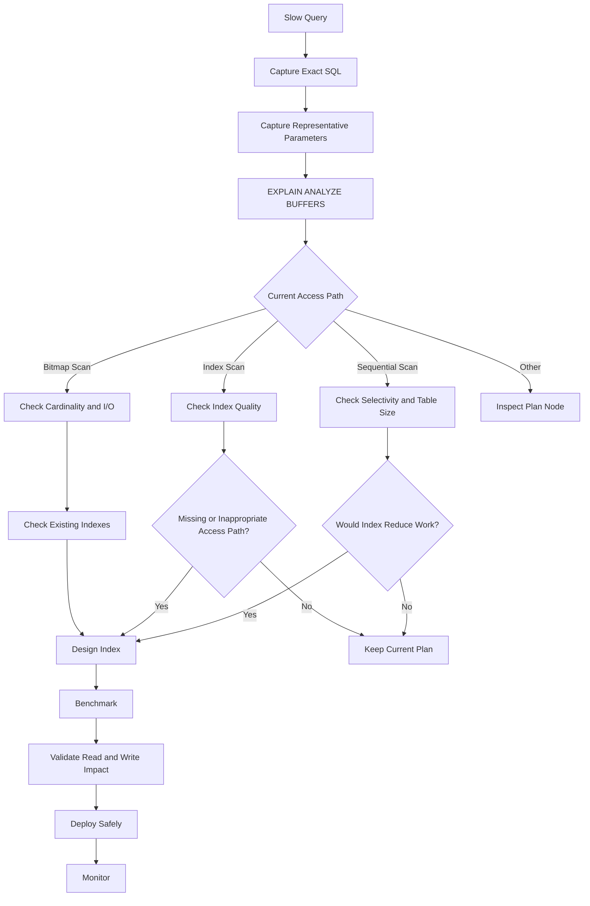

# 19- Missing Index Troubleshooting

## Overview

A missing index is a situation where the database lacks an access path that would materially improve an important query.

The key word is **materially**. An index is not automatically required because a query performs a sequential scan. PostgreSQL may deliberately choose a sequential scan because it is cheaper for the table size, selectivity, cache state, or workload.

Missing-index troubleshooting is therefore not:

```text
Slow query
    ↓
Add index
```

It is:

```text
Slow query
    ↓
Inspect actual SQL
    ↓
Inspect execution plan
    ↓
Understand predicates / joins / ordering
    ↓
Determine whether an access path is missing
    ↓
Design the smallest useful index
    ↓
Measure before/after
    ↓
Validate write and operational cost
```

A production index is a trade-off:

```text
faster reads
    +
potentially faster ordering/joins
    -
more storage
    -
more write amplification
    -
maintenance overhead
    -
replication and backup overhead
```

The goal is to create **useful indexes for real workloads**, not to maximize the number of indexes.

---

## What an Index Solves

An index provides an alternative access path to table data.

Without a suitable index:

```text
Query
  ↓
Sequential Scan
  ↓
Inspect many table pages
  ↓
Filter rows
```

With a suitable index:

```text
Query
  ↓
Index
  ↓
Locate relevant entries
  ↓
Fetch required rows
```

For highly selective queries, the difference can be substantial.

Example:

```sql
SELECT
    id,
    email,
    created_at
FROM app.users
WHERE email = $1;
```

If `email` is unique and frequently queried, an index can allow PostgreSQL to locate the matching row without scanning the entire table.

---

## When a Missing Index Is Actually a Problem

A missing index is worth addressing when:

- The query is important to production latency.
- A large table is repeatedly scanned.
- The predicate is selective.
- The query runs frequently.
- The query performs expensive joins.
- Ordering repeatedly requires large sorts.
- A foreign-key lookup is frequent and lacks an appropriate index.
- A partial or expression-specific access path is needed.
- The query's current plan consumes significant CPU or I/O.

The strongest evidence usually comes from:

```text
query workload
+
execution plan
+
actual latency
+
frequency
+
data volume
```

---

## A Sequential Scan Does Not Prove a Missing Index

Consider:

```text
Seq Scan on users
```

This can be perfectly reasonable when:

```text
users = 200 rows
```

or when:

```text
WHERE status = 'active'
```

matches most of the table.

An index is most valuable when it allows PostgreSQL to avoid substantial work.

The correct question is:

> Would an additional index produce a meaningfully cheaper access path for a meaningful workload?

---

## Missing Index Troubleshooting Workflow



---

## Start With the Actual Query

Do not infer the required index from ORM code alone.

For Django:

```python
queryset = (
    Order.objects
    .filter(
        tenant_id=tenant_id,
        status="pending",
    )
    .order_by("-created_at")
)
```

Inspect the generated SQL:

```python
print(queryset.query)
```

For production troubleshooting, use application/database query logging or tracing rather than ad hoc output.

The database sees:

```text
SQL
+
parameters
```

not the Python queryset abstraction.

---

## Use `EXPLAIN`

Start with:

```sql
EXPLAIN
SELECT
    id,
    customer_id,
    status,
    total,
    created_at
FROM app.orders
WHERE customer_id = $1
  AND status = $2
ORDER BY created_at DESC
LIMIT 50;
```

Look for:

```text
Seq Scan
Index Scan
Bitmap Heap Scan
Sort
Filter
Rows Removed by Filter
```

Then determine whether the current access path is doing unnecessary work.

---

## Use `EXPLAIN ANALYZE`

For controlled diagnostic execution:

```sql
EXPLAIN (ANALYZE, BUFFERS)
SELECT
    id,
    customer_id,
    status,
    total,
    created_at
FROM app.orders
WHERE customer_id = $1
  AND status = $2
ORDER BY created_at DESC
LIMIT 50;
```

Pay particular attention to:

- Actual execution time.
- Estimated rows.
- Actual rows.
- Loops.
- Buffer hits.
- Buffer reads.
- Sort behavior.
- Rows removed by filters.

Remember:

> `EXPLAIN ANALYZE` executes the statement.

Never run it carelessly against production `INSERT`, `UPDATE`, or `DELETE` statements.

---

## Identify the Query's Access Pattern

Before designing an index, extract the query's important operations.

For example:

```sql
SELECT
    id,
    created_at,
    total
FROM app.orders
WHERE tenant_id = $1
  AND status = $2
ORDER BY created_at DESC
LIMIT 50;
```

Access pattern:

```text
Equality:
    tenant_id
    status

Ordering:
    created_at DESC

Result:
    first 50 rows
```

A candidate index might be:

```sql
CREATE INDEX orders_tenant_status_created_idx
ON app.orders (tenant_id, status, created_at DESC);
```

The index follows the actual workload rather than being based on individual columns in isolation.

---

## Equality, Range, and Ordering

A useful index-design heuristic is to consider:

```text
equality predicates
→
range predicates
→
ordering
```

Example:

```sql
WHERE tenant_id = $1
  AND created_at >= $2
ORDER BY created_at DESC
LIMIT 100;
```

A candidate index:

```sql
CREATE INDEX orders_tenant_created_idx
ON app.orders (tenant_id, created_at DESC);
```

This can support both:

```text
tenant filtering
+
time-based access/order
```

The exact index should still be validated with the actual plan.

---

## Composite Index Column Order

Suppose you create:

```sql
CREATE INDEX orders_status_tenant_idx
ON app.orders (status, tenant_id);
```

and the important workload is:

```sql
WHERE tenant_id = $1
  AND status = $2
```

Both columns are constrained, so this particular equality query may still use the index effectively.

But column order becomes more important when different query shapes use prefixes, ranges, or ordering.

For example:

```text
(tenant_id, created_at)
```

is generally useful for:

```sql
WHERE tenant_id = $1
ORDER BY created_at DESC;
```

whereas:

```text
(created_at, tenant_id)
```

represents a different access pattern.

Do not design composite indexes by alphabetic order or table-column order.

Design them around actual query patterns.

---

## The Leftmost Prefix Principle

For a B-tree index:

```text
(tenant_id, status, created_at)
```

the leading column matters.

This index is naturally useful for queries involving:

```text
tenant_id
```

or:

```text
tenant_id + status
```

or:

```text
tenant_id + status + created_at
```

It is not equivalent to having separate indexes on every individual column.

A query filtering only on:

```sql
WHERE created_at = $1
```

should not automatically be expected to benefit from:

```text
(tenant_id, status, created_at)
```

Index design must consider the complete workload.

---

## Equality Predicates

Consider:

```sql
SELECT *
FROM app.orders
WHERE customer_id = $1;
```

A straightforward candidate is:

```sql
CREATE INDEX orders_customer_id_idx
ON app.orders (customer_id);
```

This is particularly useful when:

```text
customer_id
```

is selective and the query is frequent.

For highly selective lookups, PostgreSQL can often use an index scan efficiently.

---

## Range Predicates

Example:

```sql
SELECT
    id,
    created_at,
    total
FROM app.orders
WHERE created_at >= $1
  AND created_at < $2;
```

Candidate:

```sql
CREATE INDEX orders_created_at_idx
ON app.orders (created_at);
```

Range queries benefit from ordered B-tree indexes when the selectivity and workload justify index access.

If the range covers most of the table, PostgreSQL may correctly choose a sequential scan.

---

## Ordering

Consider:

```sql
SELECT
    id,
    created_at,
    total
FROM app.orders
ORDER BY created_at DESC
LIMIT 100;
```

A suitable index:

```sql
CREATE INDEX orders_created_at_idx
ON app.orders (created_at DESC);
```

may allow PostgreSQL to retrieve rows in the required order without sorting a large result set.

This can be especially valuable for:

```text
ORDER BY ... LIMIT N
```

patterns.

---

## Filter Plus Ordering

One of the strongest practical index patterns is:

```text
filter
+
ordering
+
small LIMIT
```

Example:

```sql
SELECT
    id,
    created_at,
    total
FROM app.orders
WHERE customer_id = $1
ORDER BY created_at DESC
LIMIT 50;
```

Candidate:

```sql
CREATE INDEX orders_customer_created_idx
ON app.orders (customer_id, created_at DESC);
```

Potential execution:

```text
Index Scan
    ↓
first matching rows
    ↓
Limit 50
```

instead of:

```text
Seq Scan
    ↓
Filter
    ↓
Sort
    ↓
Limit 50
```

---

## Join Indexes

Indexes can also improve joins.

Example:

```sql
SELECT
    o.id,
    c.email
FROM app.orders AS o
JOIN app.customers AS c
    ON c.id = o.customer_id
WHERE o.status = $1;
```

The primary key on:

```text
customers.id
```

already provides an index-backed access path.

But if the application frequently starts from orders and joins through:

```text
orders.customer_id
```

an index on the foreign-key column may be valuable:

```sql
CREATE INDEX orders_customer_id_idx
ON app.orders (customer_id);
```

Foreign keys do not automatically guarantee that the referencing column has a separate index.

---

## Foreign-Key Indexing

A common production pattern is:

```text
parent.id
    ↑
child.parent_id
```

The parent primary key is indexed automatically through its primary-key constraint.

The child foreign-key column is not automatically indexed simply because the foreign key exists.

An index on the child side can help:

- Joins.
- Parent-related lookups.
- Cascading deletes/updates.
- Referential integrity operations involving large tables.

Evaluate it against actual workload and write cost.

---

## Join Predicate Troubleshooting

For:

```sql
JOIN orders o
  ON o.customer_id = c.id
```

inspect whether:

```text
orders.customer_id
```

has an appropriate access path.

But do not automatically index every join column.

The optimizer may prefer a hash join with sequential scans for large relations.

The plan determines whether the index would actually help.

---

## Partial Indexes

A partial index indexes only rows satisfying a predicate.

Example:

```sql
CREATE INDEX orders_pending_created_idx
ON app.orders (created_at DESC)
WHERE status = 'pending';
```

This is useful when:

```text
pending rows
=
small fraction of table
```

and the application frequently queries them.

Query:

```sql
SELECT
    id,
    created_at,
    total
FROM app.orders
WHERE status = 'pending'
ORDER BY created_at DESC
LIMIT 100;
```

Potential benefits:

- Smaller index.
- Lower write overhead than indexing all rows for the same access pattern.
- Better cache efficiency.
- Efficient access to a hot subset.

The query predicate must align with the partial-index predicate sufficiently for PostgreSQL to use it.

---

## Partial Indexes for Multi-Tenant Workloads

Suppose a SaaS application has:

```text
millions of completed orders
few pending orders
```

and workers frequently process:

```sql
SELECT
    id
FROM app.orders
WHERE status = 'pending'
ORDER BY created_at
LIMIT 100;
```

A partial index can focus on the active workload:

```sql
CREATE INDEX orders_pending_created_idx
ON app.orders (created_at, id)
WHERE status = 'pending';
```

This can be much smaller than indexing every row.

For queue-like workloads, combine this with appropriate locking strategies such as `FOR UPDATE SKIP LOCKED` when required by the application design.

---

## Expression Indexes

Suppose the application searches case-insensitively:

```sql
SELECT id
FROM app.users
WHERE LOWER(email) = LOWER($1);
```

A normal index on:

```text
email
```

may not provide the desired access path.

An expression index can align with the predicate:

```sql
CREATE INDEX users_lower_email_idx
ON app.users (LOWER(email));
```

Expression indexes are useful when the expression is:

- Stable.
- Frequently queried.
- Expensive to compute across many rows.
- Consistent with the application's access pattern.

---

## Covering Indexes With `INCLUDE`

Suppose:

```sql
SELECT
    created_at,
    status,
    total
FROM app.orders
WHERE customer_id = $1
ORDER BY created_at DESC
LIMIT 50;
```

A possible index:

```sql
CREATE INDEX orders_customer_created_covering_idx
ON app.orders (customer_id, created_at DESC)
INCLUDE (status, total);
```

The included columns support covering access without becoming ordering/search keys.

Potential benefit:

```text
less heap access
```

through index-only scans when visibility conditions permit.

The trade-off is a larger index.

Do not include large columns indiscriminately.

---

## Unique Indexes

Sometimes the missing index is actually a missing integrity constraint.

Example:

```sql
CREATE UNIQUE INDEX users_email_idx
ON app.users (email);
```

If the business rule is:

```text
email must be unique
```

prefer expressing that invariant as a database constraint where appropriate rather than treating the index as only a performance mechanism.

Unique constraints also create supporting indexes.

---

## Indexes and Constraints

Indexes can exist for different reasons:

| Purpose | Example |
|---|---|
| Lookup performance | `customer_id` |
| Ordering | `created_at DESC` |
| Join support | `order.customer_id` |
| Uniqueness | `email` |
| Partial workload | `WHERE status = 'pending'` |
| Expression access | `LOWER(email)` |
| Covering | `INCLUDE (...)` |

Understanding why an index exists prevents accidental deletion and redundant-index creation.

---

## Detect Existing Indexes Before Creating One

Inspect PostgreSQL indexes:

```sql
SELECT
    schemaname,
    tablename,
    indexname,
    indexdef
FROM pg_indexes
WHERE schemaname = 'app'
ORDER BY tablename, indexname;
```

For a specific table:

```sql
SELECT
    indexname,
    indexdef
FROM pg_indexes
WHERE schemaname = 'app'
  AND tablename = 'orders';
```

Never create an index without checking what already exists.

---

## Duplicate and Redundant Indexes

Suppose a table already has:

```text
(tenant_id, status, created_at)
```

and someone proposes:

```text
(tenant_id, status)
```

The second index may be redundant depending on the workload and PostgreSQL's ability to use the longer index.

Redundant indexes increase:

- Storage.
- Write amplification.
- Vacuum work.
- Backup size.
- Replication traffic.
- Maintenance cost.

Index reviews should consider the entire index portfolio, not only the new index.

---

## Index Usage Statistics

PostgreSQL exposes index statistics through views such as:

```sql
SELECT
    schemaname,
    relname,
    indexrelname,
    idx_scan,
    idx_tup_read,
    idx_tup_fetch
FROM pg_stat_user_indexes
WHERE schemaname = 'app'
ORDER BY idx_scan ASC;
```

Low `idx_scan` can be a useful signal.

It does **not** prove that an index is unused forever.

Reasons include:

- Low-frequency workloads.
- Recently created indexes.
- Seasonal traffic.
- Constraint enforcement.
- Workloads not yet observed.
- Statistics reset.

Never drop an index solely because its current usage count is low without understanding its purpose and workload history.

---

## Finding Large Indexes

Index size can be inspected with:

```sql
SELECT
    schemaname,
    relname,
    indexrelname,
    pg_size_pretty(pg_relation_size(indexrelid)) AS index_size
FROM pg_stat_user_indexes
WHERE schemaname = 'app'
ORDER BY pg_relation_size(indexrelid) DESC;
```

This helps identify indexes with substantial storage and maintenance costs.

Large indexes deserve particular attention when:

```text
write volume is high
replication is heavy
storage is expensive
cache pressure is significant
```

---

## Index Bloat

Indexes can become bloated due to update/delete workloads and tuple versioning behavior.

Bloat can increase:

```text
storage
I/O
cache pressure
maintenance cost
```

Do not assume every large index is bloated.

A large index may simply contain many legitimate entries.

Use appropriate PostgreSQL index-maintenance diagnostics before deciding to rebuild or reindex.

---

## `REINDEX`

For a justified maintenance operation:

```sql
REINDEX INDEX app.orders_customer_created_idx;
```

For production environments, understand the locking and availability implications.

`REINDEX CONCURRENTLY` can reduce blocking for supported cases:

```sql
REINDEX INDEX CONCURRENTLY app.orders_customer_created_idx;
```

Operational maintenance should be scheduled and monitored.

---

## Creating Indexes in Production

A standard:

```sql
CREATE INDEX orders_customer_idx
ON app.orders (customer_id);
```

can acquire locks that may interfere with concurrent writes depending on the operation.

For large production tables, PostgreSQL supports:

```sql
CREATE INDEX CONCURRENTLY orders_customer_idx
ON app.orders (customer_id);
```

This reduces blocking of ordinary table writes but has trade-offs:

- More work.
- Longer execution.
- More complex failure handling.
- Cannot run inside a transaction block.

Understand the operational behavior before using it in migrations.

---

## Django Migrations

Django can define indexes declaratively:

```python
class Order(models.Model):
    customer_id = models.UUIDField()
    status = models.CharField(max_length=32)
    created_at = models.DateTimeField()

    class Meta:
        indexes = [
            models.Index(
                fields=["customer_id", "-created_at"],
                name="orders_customer_created_idx",
            ),
        ]
```

For large production tables, migration strategy matters.

Depending on the Django/PostgreSQL version and migration design, use appropriate non-transactional migration techniques for operations such as `CREATE INDEX CONCURRENTLY`.

Do not treat:

```text
migration generated successfully
```

as equivalent to:

```text
production-safe
```

---

## Indexes in FastAPI and SQLAlchemy

Indexes belong to the database schema, not to FastAPI itself.

SQLAlchemy models can define them:

```python
from sqlalchemy import Index

Index(
    "orders_customer_created_idx",
    Order.customer_id,
    Order.created_at.desc(),
)
```

The resulting migration must still be reviewed for:

- Locking.
- Table size.
- Deployment duration.
- Rollback behavior.
- Production traffic.

Application framework abstractions do not remove database operational concerns.

---

## Query Shape Determines Index Design

Consider three queries:

```sql
WHERE customer_id = $1
```

```sql
WHERE customer_id = $1
ORDER BY created_at DESC
LIMIT 50
```

```sql
WHERE customer_id = $1
  AND created_at >= $2
```

They may need different access paths.

A single index may support all three:

```text
(customer_id, created_at DESC)
```

but this must be validated.

Index design should start from **query patterns**, not from individual columns.

---

## Multiple Workloads on One Table

Suppose `orders` serves:

```text
GET /customers/{id}/orders
GET /orders/{id}
worker processing pending orders
admin search
reporting queries
```

These workloads may require different access paths.

Potential indexes:

```text
PRIMARY KEY (id)

(customer_id, created_at DESC)

(created_at)
WHERE status = 'pending'

search-specific index
```

Do not assume every workload should be optimized equally.

Prioritize high-value production paths.

---

## Read-Heavy vs Write-Heavy Tables

For read-heavy tables:

```text
more indexes
    ↓
potentially faster reads
```

may be reasonable.

For write-heavy tables:

```text
INSERT / UPDATE / DELETE
    ↓
maintain every relevant index
```

so excessive indexing can significantly increase write cost.

This is especially important for:

- Event ingestion.
- Kafka consumers.
- Celery workers.
- Bulk imports.
- High-volume transactional tables.

---

## Index Write Amplification

When a row changes:

```text
UPDATE row
   ↓
update table storage
   ↓
update affected indexes
```

A table with:

```text
8 indexes
```

can have substantially more write work than a table with:

```text
2 indexes
```

depending on which columns change and index structure.

Indexes are therefore part of the write path.

---

## Indexes and HOT Updates

PostgreSQL can sometimes perform HOT updates when indexed columns do not need new index entries.

Adding indexes on frequently updated columns can reduce opportunities for HOT updates.

This is another reason not to index every column that appears in application code.

The impact should be evaluated against actual update patterns.

---

## Indexes and Vacuum

Indexes participate in PostgreSQL maintenance.

High-churn tables may generate substantial dead tuples and index maintenance work.

Adding unnecessary indexes can increase the workload handled by:

```text
VACUUM
autovacuum
ANALYZE
backup
replication
```

Index design is therefore also an operational design decision.

---

## Missing Index vs Poor Statistics

Suppose:

```text
Seq Scan
estimated rows = 100
actual rows = 5,000,000
```

The problem may not be a missing index.

It may be a cardinality-estimation problem.

If PostgreSQL incorrectly believes only 100 rows qualify, it can make poor decisions elsewhere in the plan.

Before creating an index, check:

```text
estimated rows
actual rows
statistics
data distribution
```

---

## Missing Index vs Low Selectivity

Consider:

```sql
WHERE status = 'active'
```

with:

```text
active = 95% of table
```

An index on:

```text
status
```

may provide limited benefit.

A sequential scan can be cheaper.

If the workload is:

```sql
WHERE status = 'pending'
```

and pending rows are only:

```text
0.1%
```

a partial index may be much more appropriate:

```sql
CREATE INDEX orders_pending_idx
ON app.orders (created_at)
WHERE status = 'pending';
```

Selectivity matters more than simply seeing a predicate.

---

## Missing Index vs Large Result Set

Suppose:

```sql
SELECT *
FROM app.orders
WHERE customer_id = $1;
```

returns:

```text
500,000 rows
```

Adding an index may reduce lookup work but the application still has to:

```text
read rows
serialize rows
transfer rows
```

The real fix may be:

- Pagination.
- Projection.
- Aggregation.
- Async export.
- A different API contract.

Do not use indexes to compensate for an unbounded result set.

---

## Missing Index vs N+1

If an API performs:

```text
1 + 1,000 queries
```

and each query is indexed, the system may still be slow.

The missing optimization is:

```text
query consolidation
```

rather than:

```text
another index
```

Use:

- `select_related`.
- `prefetch_related`.
- SQL joins.
- Batch queries.
- Appropriate repository/data-access patterns.

---

## Missing Index vs Lock Contention

A query can be:

```text
execution time = 5 ms
lock wait = 2 seconds
```

An index does not solve the primary latency problem.

Investigate:

```sql
SELECT
    pid,
    wait_event_type,
    wait_event,
    query_start,
    now() - query_start AS duration,
    query
FROM pg_stat_activity
WHERE state = 'active';
```

If the wait is:

```text
Lock
```

investigate transactions and blocking sessions first.

---

## Missing Index vs Connection Pool Exhaustion

Similarly:

```text
connection pool wait = 1 second
query execution = 10 ms
```

Adding an index is irrelevant.

Inspect:

```text
application pool utilization
connection acquisition latency
database connections
long-running queries
```

Database performance must be analyzed end-to-end.

---

## Query Frequency and Index ROI

Suppose:

```text
Query A:
10 ms × 1,000,000 calls/day

Query B:
500 ms × 10 calls/day
```

Query A may deserve the higher optimization priority.

A useful index decision considers:

```text
latency improvement
×
frequency
×
concurrency
```

against:

```text
index storage
+
write amplification
+
maintenance
+
operational complexity
```

---

## A Practical Index Decision Matrix

| Observation | Index likely useful? |
|---|---|
| Highly selective equality lookup | Usually |
| Highly selective range query | Often |
| Filter + `ORDER BY` + small `LIMIT` | Often |
| Large join with indexed foreign key | Potentially |
| Predicate matches most rows | Often not |
| Very small table | Often not |
| Huge result set | Not necessarily |
| Query blocked on lock | No |
| Connection pool exhausted | No |
| N+1 query pattern | Not primarily |
| Frequent pending-only workload | Partial index may help |
| Case-insensitive expression search | Expression index may help |
| Query needs covering access | `INCLUDE` may help |

---

## Finding Candidate Queries

Use `pg_stat_statements` to identify expensive workload patterns:

```sql
SELECT
    calls,
    total_exec_time,
    mean_exec_time,
    rows,
    shared_blks_hit,
    shared_blks_read,
    query
FROM pg_stat_statements
ORDER BY total_exec_time DESC
LIMIT 20;
```

Also investigate queries with:

```text
high shared block reads
high execution frequency
high mean latency
large total execution time
```

Then inspect their plans.

Do not create indexes from statistics alone.

`pg_stat_statements` tells you **what is expensive**.

The execution plan helps explain **why**.

---

## Query Fingerprinting

Parameterized queries often appear as normalized statements.

For example:

```sql
SELECT *
FROM orders
WHERE customer_id = $1;
```

may represent thousands of executions with different values.

This makes workload-level analysis possible.

When performance varies significantly by parameter, inspect representative plans rather than relying only on aggregate statistics.

---

## Validate With Representative Data

An index should be evaluated against:

```text
production-scale row counts
realistic distributions
representative parameters
realistic concurrency
```

A development database containing:

```text
10,000 rows
```

may produce very different plan decisions from production containing:

```text
500 million rows
```

Index decisions made from tiny datasets are often unreliable.

---

## Validate With `EXPLAIN`

Before:

```sql
EXPLAIN (ANALYZE, BUFFERS)
SELECT
    id,
    created_at,
    total
FROM app.orders
WHERE customer_id = $1
ORDER BY created_at DESC
LIMIT 50;
```

Create candidate index:

```sql
CREATE INDEX orders_customer_created_idx
ON app.orders (customer_id, created_at DESC);
```

Then compare the plan again:

```sql
EXPLAIN (ANALYZE, BUFFERS)
SELECT
    id,
    created_at,
    total
FROM app.orders
WHERE customer_id = $1
ORDER BY created_at DESC
LIMIT 50;
```

Measure:

```text
execution time
rows
buffers
sort work
plan shape
```

---

## Do Not Force Index Usage

PostgreSQL may correctly choose:

```text
Seq Scan
```

even after adding an index.

Do not try to force index usage simply because:

```text
"there is an index now"
```

The optimizer may have correctly determined that the index is more expensive.

Investigate:

```text
selectivity
statistics
table size
data distribution
cost configuration
```

before concluding that PostgreSQL is wrong.

---

## Index Design for Keyset Pagination

For:

```sql
SELECT
    id,
    created_at,
    total
FROM app.orders
WHERE customer_id = $1
  AND (created_at, id) < ($2, $3)
ORDER BY created_at DESC, id DESC
LIMIT 100;
```

a candidate index is:

```sql
CREATE INDEX orders_customer_created_id_idx
ON app.orders (customer_id, created_at DESC, id DESC);
```

This aligns:

```text
tenant/customer filtering
+
cursor position
+
ordering
```

with the access path.

This is generally more scalable than large `OFFSET` values for deep pagination.

---

## Multi-Tenant Indexing

For shared-schema multi-tenant applications, many queries begin with:

```sql
WHERE tenant_id = $1
```

If the majority of important queries are tenant-scoped, indexes often need to reflect that access pattern.

Example:

```sql
CREATE INDEX orders_tenant_created_idx
ON app.orders (tenant_id, created_at DESC);
```

This can support:

```sql
WHERE tenant_id = $1
ORDER BY created_at DESC
LIMIT 50;
```

Tenant-aware indexing can also reduce the amount of unrelated data examined.

However, very large tenants may require partitioning or sharding rather than endlessly adding tenant-specific indexes.

---

## RLS and Indexing

Row Level Security can add implicit filtering conditions.

Example:

```text
application query
    +
RLS policy
    ↓
effective query conditions
```

If RLS policies frequently filter by:

```text
tenant_id
```

the underlying table should still have appropriate indexes for important access patterns.

RLS is a security mechanism, not an indexing mechanism.

Never remove RLS merely to improve query performance.

---

## Partitioning and Indexing

Partitioning can reduce the amount of data considered through partition pruning.

For example:

```text
events_2026_01
events_2026_02
events_2026_03
...
```

A time-bounded query may touch only relevant partitions.

Indexes can then operate within those partitions.

Use:

```text
partitioning
+
appropriate indexes
```

when both data lifecycle and query patterns justify them.

Partitioning does not eliminate the need for good local indexes.

---

## Sharding and Indexing

With sharding:

```text
request
  ↓
shard router
  ↓
shard N
  ↓
local indexes
```

Indexes remain local to each shard.

The shard key should ideally provide query locality.

For example:

```text
tenant_id → shard
```

then:

```text
tenant_id + created_at
```

can be an effective local access path.

Cross-shard queries may require scatter-gather operations and cannot be fixed merely by adding local indexes.

---

## Indexes and Read Replicas

Indexes are part of the database schema and should exist consistently across primary/read-replica architectures.

A query routed to a replica may still be slow if:

- The index is missing.
- Replica storage is slower.
- Cache state differs.
- Replica workload is heavy.
- Replay is under pressure.

When troubleshooting, identify:

```text
which database node executed the query
```

before drawing conclusions.

---

## Indexes and Replication

Every additional index can affect:

```text
write cost
WAL generation
replication volume
replica replay work
backup size
```

The exact effect depends on the operation and index structure.

This matters for write-heavy systems and environments with multiple replicas.

A read optimization can therefore have replication-side costs.

---

## Indexes and Backups

Indexes increase database storage.

This can affect:

- Backup size.
- Snapshot duration.
- Restore time.
- Storage cost.
- Recovery operations.

For large production databases, index storage should be included in capacity planning.

---

## High Availability and Index Creation

Large index creation is an operational event.

Potential risks include:

```text
long-running migration
lock contention
resource consumption
replication lag
deployment delays
```

For critical production tables:

1. Estimate index size.
2. Estimate build duration.
3. Check available storage.
4. Understand lock behavior.
5. Consider `CONCURRENTLY`.
6. Monitor replication.
7. Define failure handling.
8. Validate after creation.

---

## Security Considerations

Indexes can indirectly affect security-sensitive workloads.

Examples include:

- Tenant-scoped queries.
- Authorization lookups.
- RLS policies.
- Audit queries.
- Access-control tables.

Performance problems in authorization paths can encourage dangerous shortcuts such as:

```text
disable tenant filtering
disable RLS
remove authorization checks
```

Never solve an indexing problem by weakening access control.

Indexes should make secure queries faster, not replace authorization.

---

## Cost Considerations

Every index consumes resources.

### Storage

```text
table
+
indexes
=
database storage
```

### Writes

```text
INSERT / UPDATE / DELETE
    ↓
maintain relevant indexes
```

### Maintenance

Indexes require:

```text
vacuum-related maintenance
statistics
backups
replication
potential reindexing
```

### Operational Work

Large index creation and removal require production planning.

Therefore:

> An index should have a measurable business or operational justification.

---

## Production Index Review

Before approving an index, ask:

### Query

```text
Which query requires it?
How often does it execute?
What is its latency?
```

### Selectivity

```text
How many rows qualify?
How does selectivity change with growth?
```

### Plan

```text
What is the current plan?
What access path should the index enable?
```

### Workload

```text
Read-heavy or write-heavy?
OLTP or analytical?
Primary or replica?
```

### Cost

```text
How large will the index be?
What is the write overhead?
What is the replication impact?
```

### Lifecycle

```text
Will this index still be useful after the feature changes?
Who owns it?
How will it be monitored?
```

---

## Production Index Checklist

- [ ] Identify the exact slow query.
- [ ] Capture representative parameters.
- [ ] Run `EXPLAIN`.
- [ ] Run `EXPLAIN (ANALYZE, BUFFERS)` safely.
- [ ] Check whether the current sequential scan is actually expensive.
- [ ] Check selectivity.
- [ ] Check estimated versus actual rows.
- [ ] Check existing indexes.
- [ ] Check join predicates.
- [ ] Check `ORDER BY`.
- [ ] Check `LIMIT`.
- [ ] Check range predicates.
- [ ] Check partial-index opportunities.
- [ ] Check expression-index opportunities.
- [ ] Check covering-index opportunities.
- [ ] Check foreign-key access patterns.
- [ ] Check redundant indexes.
- [ ] Estimate index size.
- [ ] Estimate write amplification.
- [ ] Consider replication impact.
- [ ] Consider backup/storage impact.
- [ ] Test with production-scale data.
- [ ] Benchmark before and after.
- [ ] Use safe production migration procedures.
- [ ] Monitor query latency afterward.
- [ ] Monitor write and storage impact afterward.

---

## Common Mistakes

### Indexing Every `WHERE` Column

A column appearing in `WHERE` does not automatically deserve an index.

**Why it fails:**

```text
low selectivity
+
extra write cost
+
storage
```

**Better approach:** index important access patterns, not individual SQL keywords.

### Assuming Every Sequential Scan Is Bad

Sequential scans can be optimal.

**Better approach:** compare estimated cost, actual runtime, selectivity, and table size.

### Creating Separate Single-Column Indexes Everywhere

This can produce:

```text
many indexes
+
high write overhead
```

when one composite index could support the dominant workload.

**Better approach:** design from actual query shapes.

### Ignoring Column Order

An index on:

```text
(a, b, c)
```

is not equivalent to:

```text
(b, a, c)
```

**Better approach:** consider equality, ranges, ordering, and query prefixes.

### Ignoring `ORDER BY`

A query may already have an efficient filter but spend most of its time sorting.

**Better approach:** consider indexes that support both filtering and ordering.

### Ignoring `LIMIT`

Top-N queries often benefit from indexes aligned with their ordering.

**Better approach:** inspect whether PostgreSQL can stop early.

### Adding an Index Without Checking Existing Indexes

This creates redundant indexes.

**Better approach:** inspect `pg_indexes` first.

### Adding an Index Without Measuring Usage

The index may never provide meaningful benefit.

**Better approach:** validate through plans and production workload statistics.

### Ignoring Write Cost

Indexes speed some reads but add maintenance to writes.

**Better approach:** evaluate read benefit against write amplification.

### Ignoring Replication

Additional index maintenance can affect replicas indirectly through write workload and WAL/replay pressure.

**Better approach:** include replicas in the capacity analysis.

### Using Redis Instead of Fixing a Simple Missing Index

Caching may be unnecessary complexity for a query that could be solved efficiently with a database access path.

**Better approach:** fix the database workload first when the query itself is the bottleneck.

### Using an Index to Hide an Unbounded API

Returning millions of rows remains expensive.

**Better approach:** paginate, aggregate, project required fields, or move the workload to an asynchronous pipeline.

### Dropping a Low-Usage Index Immediately

Low usage does not necessarily mean useless.

**Better approach:** understand index purpose, constraints, workload history, and observation period before removal.

---

## Troubleshooting Example

Suppose an API endpoint:

```text
GET /customers/{customer_id}/orders
```

has become slow.

Query:

```sql
SELECT
    id,
    created_at,
    status,
    total
FROM app.orders
WHERE customer_id = $1
ORDER BY created_at DESC
LIMIT 50;
```

Initial plan:

```text
Limit
  └── Sort
      └── Seq Scan on orders
```

Suppose:

```text
orders = 200 million rows
customer_id matches = 2,000 rows
```

The plan is doing unnecessary work:

```text
200 million rows
      ↓
filter
      ↓
2,000 rows
      ↓
sort
      ↓
50 rows
```

A candidate index:

```sql
CREATE INDEX CONCURRENTLY orders_customer_created_idx
ON app.orders (customer_id, created_at DESC);
```

Potential new plan:

```text
Limit
  └── Index Scan using orders_customer_created_idx
```

Now PostgreSQL can approximately follow:

```text
customer_id
    ↓
ordered entries
    ↓
first 50 rows
```

The correct conclusion comes only after measuring the before/after plans and workload.

---

## When Not to Add an Index

Do not add an index when:

- The table is tiny.
- The query reads most of the table.
- The predicate has poor selectivity.
- The query is dominated by lock waits.
- The query is dominated by connection-pool waits.
- The query returns an unnecessarily large result.
- The workload is primarily N+1.
- The current plan is already efficient.
- The index would create excessive write overhead.
- The workload is better served by partitioning, caching, an OLAP system, or a read model.

Indexing is one optimization technique among many.

---

## Senior-Level Index Reasoning

A senior engineer should be able to explain:

```text
Why is the query slow?
        ↓
What work is unnecessary?
        ↓
What access path would remove that work?
        ↓
Why does the proposed index match the workload?
        ↓
What will the index cost on writes?
        ↓
How will it affect replication and storage?
        ↓
How will it behave as data grows?
        ↓
How will we measure success?
```

The final question is important.

A technically valid index can still be a poor production decision if:

```text
read improvement = 5 ms
```

but:

```text
write overhead = significant
storage = hundreds of GB
```

Optimization is an engineering trade-off, not a checklist exercise.

---

## Interview Traps

### Does a Missing Index Mean PostgreSQL Must Be Doing a Sequential Scan?

No. The database can also use other access paths, and a sequential scan may be optimal.

### How Do You Determine Whether an Index Is Missing?

Start with the exact query and its execution plan. Look for expensive scans, selective predicates, joins, ordering, and repeated work that an appropriate access path could eliminate.

### Why Isn't an Index on Every `WHERE` Column a Good Strategy?

Indexes consume storage and increase write and maintenance costs. Low-selectivity indexes may provide little benefit.

### How Do You Choose Columns for a Composite Index?

Consider the actual workload: equality predicates, range predicates, ordering, selectivity, result limits, and related query patterns.

### Why Does Column Order Matter?

B-tree indexes are ordered structures. Leading columns strongly influence which query predicates and ordering requirements can be supported efficiently.

### When Would You Use a Partial Index?

When a frequently accessed subset of rows is much smaller than the table and the query predicate aligns with the partial-index predicate.

### When Would You Use an Expression Index?

When queries consistently search or order by an expression such as:

```sql
LOWER(email)
```

and a normal index cannot efficiently support that expression.

### What Is the Difference Between an Index and a Covering Index?

A covering index contains all columns required by a query, potentially allowing an index-only scan. PostgreSQL can use `INCLUDE` columns for this purpose.

### Should Foreign Keys Always Be Indexed?

Not automatically, but indexing frequently accessed referencing columns can improve joins and certain referential-integrity operations.

### Why Can an Index Make Writes Slower?

Every relevant index may need maintenance when rows are inserted, updated, or deleted.

### Why Is `CREATE INDEX CONCURRENTLY` Useful?

It is designed to reduce blocking of concurrent table writes during index creation, but it takes longer, has additional operational complexity, and cannot run inside a transaction block.

### How Do You Know Whether a New Index Actually Helped?

Compare before/after:

```text
execution plan
execution time
buffer activity
query frequency
database resource usage
```

and validate the production workload after deployment.

### Can an Index Fix Lock Contention?

No. If the observed latency is dominated by lock waiting, the underlying transaction and concurrency design must be investigated.

### Can an Index Fix N+1 Queries?

Not fundamentally. N+1 is primarily a query-count and application access-pattern problem.

### What Is the Senior-Level Indexing Principle?

Create the smallest set of indexes that efficiently support important production access patterns while accounting for selectivity, data growth, write amplification, storage, replication, maintenance, and operational cost.

## Key Takeaways

- **A sequential scan does not automatically mean a missing index:** determine whether the scan is actually expensive and whether an alternative access path would materially reduce work.
- **Design indexes around query patterns:** consider equality predicates, ranges, joins, ordering, limits, expressions, tenant boundaries, and result shape rather than indexing columns individually.
- **Validate every index with evidence:** use execution plans, representative parameters, production-scale data, query frequency, and before/after measurements.
- **Indexes have system-wide costs:** account for write amplification, storage, vacuum/maintenance, backups, replication, migrations, and high-availability operations.
- **Treat indexing as workload design:** distinguish missing indexes from statistics problems, lock contention, connection-pool exhaustion, N+1 queries, large result sets, and workloads that require caching, partitioning, or OLAP instead.