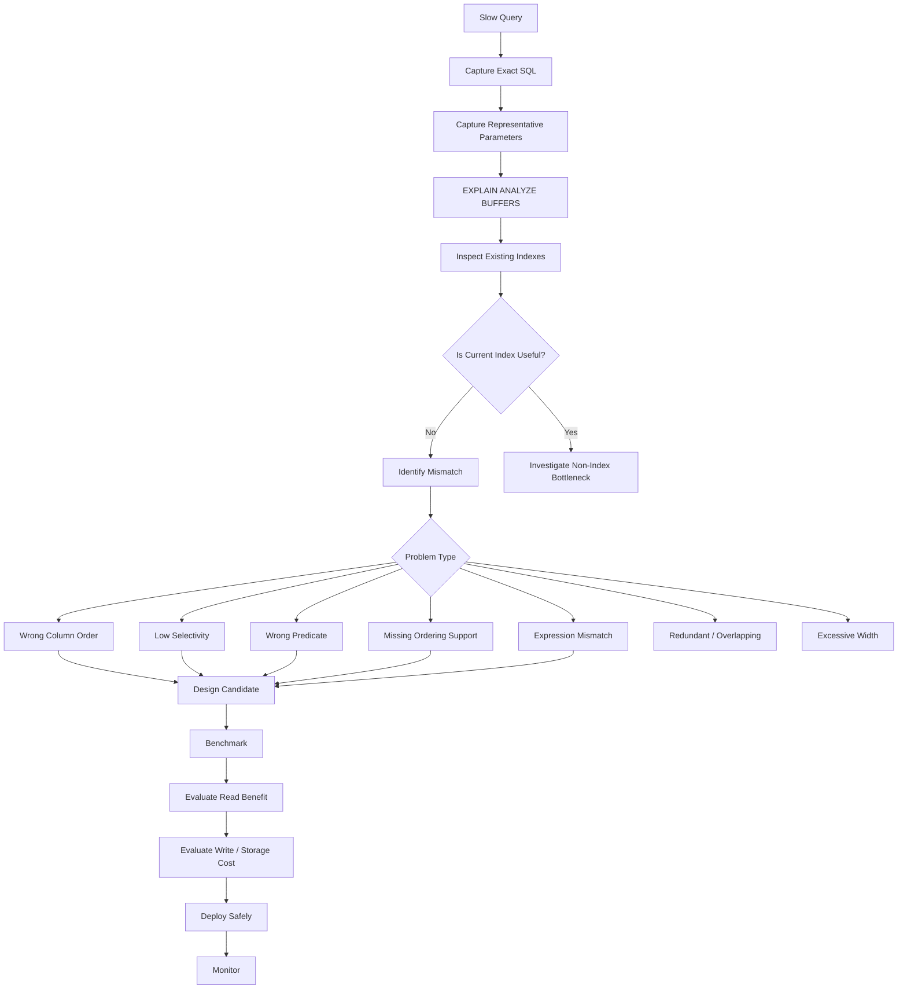

# 20- Incorrect Index Troubleshooting

## Overview

An **incorrect index** is an index that exists but does not effectively support the workload for which it was created.

The index may be incorrect because:

- The indexed columns are in the wrong order.
- The index does not match the query predicate.
- The index has poor selectivity.
- A composite index is missing an important leading column.
- The index does not support the required ordering.
- The query uses an expression that the index does not cover.
- A partial index predicate does not match the workload.
- The index is redundant or overlapping.
- The index is too wide.
- The index is rarely useful but expensive to maintain.
- The planner correctly chooses another access path.
- Statistics cause the planner to underestimate or overestimate its usefulness.

Incorrect-index troubleshooting is different from missing-index troubleshooting:

```text
Missing index
    ↓
Useful access path does not exist

Incorrect index
    ↓
Access path exists
    ↓
But it does not efficiently support the workload
```

The goal is not to make PostgreSQL use every index. The goal is to ensure the index portfolio provides efficient access paths for important workloads without creating unnecessary storage, write, maintenance, replication, and operational costs.

---

## Why an Existing Index May Still Be Wrong

Consider:

```sql
SELECT
    id,
    created_at,
    total
FROM app.orders
WHERE tenant_id = $1
ORDER BY created_at DESC
LIMIT 50;
```

Suppose the table has:

```text
INDEX (created_at)
```

The index is valid.

It is not necessarily the right index.

The database still needs to locate:

```text
tenant_id = $1
```

and then obtain rows in:

```text
created_at DESC
```

A better access path may be:

```text
(tenant_id, created_at DESC)
```

The problem is therefore not:

```text
index missing
```

but:

```text
index exists but does not match the dominant access pattern
```

---

## Incorrect Index Troubleshooting Workflow



---

## Start With the Query Pattern

Before changing an index, document the actual access pattern.

For:

```sql
SELECT
    id,
    status,
    total,
    created_at
FROM app.orders
WHERE tenant_id = $1
  AND status = $2
ORDER BY created_at DESC
LIMIT 50;
```

extract:

| Query characteristic | Requirement |
|---|---|
| Equality | `tenant_id` |
| Equality | `status` |
| Ordering | `created_at DESC` |
| Result limit | `50` |
| Workload | Recent matching orders |

This gives you a much stronger basis for index design than:

```text
"created_at is slow, so add an index on created_at"
```

---

## Inspect the Existing Index

PostgreSQL:

```sql
SELECT
    schemaname,
    tablename,
    indexname,
    indexdef
FROM pg_indexes
WHERE schemaname = 'app'
  AND tablename = 'orders'
ORDER BY indexname;
```

For example:

```text
orders_created_idx
    (created_at)

orders_status_idx
    (status)

orders_tenant_idx
    (tenant_id)
```

The presence of three indexes does not mean the query has an appropriate access path.

The important question is:

> Can PostgreSQL efficiently combine the required filtering and ordering operations using these indexes?

---

## Read the Actual Execution Plan

Use:

```sql
EXPLAIN (ANALYZE, BUFFERS)
SELECT
    id,
    status,
    total,
    created_at
FROM app.orders
WHERE tenant_id = $1
  AND status = $2
ORDER BY created_at DESC
LIMIT 50;
```

Look for:

```text
Seq Scan
Index Scan
Bitmap Index Scan
Bitmap Heap Scan
Sort
Rows Removed by Filter
actual rows
loops
shared reads
shared hits
```

An index problem is usually visible through the relationship between:

```text
predicate
+
index access
+
rows examined
+
rows returned
+
sorting
```

---

## Wrong Composite Index Column Order

Suppose the workload is:

```sql
WHERE tenant_id = $1
  AND created_at >= $2
ORDER BY created_at DESC
```

but the existing index is:

```sql
CREATE INDEX orders_created_tenant_idx
ON app.orders (created_at, tenant_id);
```

This may not provide the same access path as:

```sql
CREATE INDEX orders_tenant_created_idx
ON app.orders (tenant_id, created_at DESC);
```

The difference is:

```text
(created_at, tenant_id)
```

versus:

```text
(tenant_id, created_at)
```

The leading column changes how the B-tree can be traversed.

For a workload dominated by:

```text
tenant_id = ?
```

followed by:

```text
created_at range/order
```

the second ordering may better match the query.

Always validate with the actual plan.

---

## Equality Before Range

A practical composite-index heuristic is:

```text
equality columns
    ↓
range columns
    ↓
ordering columns
```

Example:

```sql
WHERE tenant_id = $1
  AND created_at >= $2
ORDER BY created_at DESC
```

Candidate:

```sql
CREATE INDEX orders_tenant_created_idx
ON app.orders (tenant_id, created_at DESC);
```

Here:

```text
tenant_id
```

narrows the search space first, while:

```text
created_at
```

supports the time-based access pattern.

This is a heuristic, not a universal law. The final decision depends on the complete workload and plan.

---

## Multiple Equality Columns

Consider:

```sql
WHERE tenant_id = $1
  AND status = $2
ORDER BY created_at DESC
```

A candidate:

```sql
CREATE INDEX orders_tenant_status_created_idx
ON app.orders (tenant_id, status, created_at DESC);
```

can align:

```text
tenant filtering
+
status filtering
+
ordering
```

with one index.

But do not assume that every query needs all three columns.

If the dominant workload is:

```sql
WHERE tenant_id = $1
ORDER BY created_at DESC
```

then:

```text
(tenant_id, created_at)
```

may be a better index.

Index design should be based on the workload portfolio.

---

## Index That Supports the Wrong Query

Suppose the index is:

```sql
CREATE INDEX users_name_idx
ON app.users (name);
```

but the production query is:

```sql
WHERE email = $1;
```

The index is valid but irrelevant.

This often happens when engineers index:

```text
columns they expect to be queried
```

instead of:

```text
columns actually used by production access patterns
```

Use query statistics and execution plans to identify real requirements.

---

## Low-Selectivity Index

An index can be technically correct but practically weak.

Example:

```sql
CREATE INDEX orders_status_idx
ON app.orders (status);
```

Suppose:

```text
status = 'completed' → 98%
status = 'pending'   → 2%
```

For:

```sql
WHERE status = 'completed'
```

PostgreSQL may reasonably prefer:

```text
Seq Scan
```

because almost the entire table qualifies.

For the smaller subset:

```sql
WHERE status = 'pending'
```

the same index may be much more useful.

The index is not necessarily incorrect.

The workload determines whether it is valuable.

---

## Partial Index as a Correction

If the important workload is:

```sql
WHERE status = 'pending'
ORDER BY created_at
```

consider:

```sql
CREATE INDEX orders_pending_created_idx
ON app.orders (created_at DESC)
WHERE status = 'pending';
```

Benefits can include:

- Smaller index.
- Better cache efficiency.
- Lower maintenance cost than indexing all rows for this access pattern.
- Efficient access to the hot subset.

The query predicate must align with the partial index condition sufficiently for PostgreSQL to use it.

---

## Incorrect Partial Index Predicate

Suppose the index is:

```sql
CREATE INDEX orders_active_idx
ON app.orders (created_at)
WHERE status = 'active';
```

but the important query is:

```sql
WHERE status IN ('active', 'pending')
```

The partial index does not represent the complete access pattern.

Do not assume:

```text
partial index exists
```

means:

```text
partial index solves the query
```

Inspect the execution plan and predicate relationship.

---

## Wrong Expression

Suppose:

```sql
CREATE INDEX users_email_idx
ON app.users (email);
```

but the query is:

```sql
SELECT id
FROM app.users
WHERE LOWER(email) = LOWER($1);
```

The normal index may not provide the desired access path.

A matching expression index can be:

```sql
CREATE INDEX users_lower_email_idx
ON app.users (LOWER(email));
```

The index expression should correspond to the application's actual query semantics.

---

## Expression Indexes and Query Consistency

Expression indexes require consistent query behavior.

For example:

```text
index:
LOWER(email)

query:
LOWER(email)
```

If the application uses different transformations or comparison semantics, the expected access path may not apply.

For case-insensitive identifiers, consider whether a schema-level representation such as `citext` or normalized data would be more appropriate than repeatedly indexing expressions.

Choose the design based on the domain and workload.

---

## Wrong Data Type or Cast Behavior

Consider:

```sql
WHERE customer_id = $1
```

where:

```text
customer_id = bigint
```

The application should bind the parameter using an appropriate database type.

Unexpected casts or expressions can affect query behavior and index usability.

Inspect the actual SQL and parameter types when an apparently matching index is not being used.

Do not "fix" type problems by arbitrarily changing the index until the data model and query semantics are understood.

---

## Index Does Not Support Ordering

Suppose:

```sql
SELECT
    id,
    created_at
FROM app.orders
WHERE customer_id = $1
ORDER BY created_at DESC
LIMIT 50;
```

Existing index:

```text
(customer_id)
```

This can efficiently locate rows for the customer, but PostgreSQL may still need:

```text
Sort
```

An index such as:

```sql
CREATE INDEX orders_customer_created_idx
ON app.orders (customer_id, created_at DESC);
```

may allow PostgreSQL to retrieve matching rows already ordered.

For high-volume top-N queries, this can be a significant improvement.

---

## `ASC` vs `DESC`

PostgreSQL B-tree indexes can generally be scanned in either direction, so an index declared:

```sql
(created_at ASC)
```

can often support:

```sql
ORDER BY created_at DESC
```

through a backward scan.

Explicit direction becomes more relevant with multi-column ordering where the requested sort directions differ across columns.

For example:

```sql
ORDER BY tenant_id ASC, created_at DESC
```

may benefit from an index whose ordering matches that pattern:

```sql
(tenant_id ASC, created_at DESC)
```

Always validate the plan rather than relying on simplistic `ASC`/`DESC` rules.

---

## Index Cannot Efficiently Support the Full Predicate

Suppose:

```sql
WHERE tenant_id = $1
  AND status = $2
  AND created_at >= $3
```

but the index is:

```text
(created_at)
```

The database may use the index for the time range and filter:

```text
tenant_id
status
```

afterward.

This can still be useful.

But if the query frequently processes a huge time range and only a small subset of rows belongs to the tenant, an index beginning with:

```text
tenant_id
```

may reduce work substantially.

Look at:

```text
Rows Removed by Filter
```

and actual buffer activity.

---

## `Rows Removed by Filter`

Suppose the plan shows:

```text
Index Scan
actual rows = 50
Rows Removed by Filter = 500000
```

This is a strong signal that the access path is finding many rows and filtering most of them afterward.

It does not automatically mean the index is wrong.

But it should trigger investigation:

```text
Can the predicate be represented in the index?
Can column ordering reduce candidate rows?
Would a partial index help?
Is the query selective?
```

---

## Bitmap Scans and Incorrect Index Assumptions

Suppose:

```text
Bitmap Heap Scan
└── Bitmap Index Scan
```

The planner may intentionally use the index because many rows match.

A bitmap scan can be more efficient than repeated random heap access.

Do not try to force:

```text
Index Scan
```

just because it sounds faster.

The correct question is:

> Is the selected access strategy efficient for the actual cardinality and storage behavior?

---

## Multiple Indexes on the Same Table

Suppose:

```text
orders_customer_idx
orders_status_idx
orders_created_idx
orders_customer_created_idx
orders_tenant_status_created_idx
orders_pending_created_idx
```

This may be justified for a large workload.

It may also indicate uncontrolled index growth.

Every index introduces some combination of:

- Storage.
- Write overhead.
- Maintenance.
- Backup cost.
- Replication impact.
- Cache pressure.

Review indexes as a portfolio.

---

## Redundant Indexes

Suppose:

```text
(customer_id)
```

and:

```text
(customer_id, created_at)
```

both exist.

The second index can support many queries using the leading `customer_id` column, so the first may be redundant depending on the workload.

However, do not automatically drop the shorter index.

The shorter index may:

- Be significantly smaller.
- Serve high-frequency lookups more efficiently.
- Have different storage characteristics.
- Support a workload not obvious from recent statistics.

Index removal should be evidence-based.

---

## Overlapping Indexes

Example:

```text
(tenant_id, status, created_at)
(tenant_id, created_at)
(tenant_id)
```

These indexes overlap.

Sometimes this is intentional.

Sometimes it is historical accumulation.

Review:

```text
query patterns
index usage
index size
write workload
```

before simplifying.

---

## Wide Indexes

Consider:

```sql
CREATE INDEX orders_wide_idx
ON app.orders (
    tenant_id,
    status,
    customer_id,
    created_at,
    total,
    currency,
    region,
    source
);
```

A wide index may support several access patterns, but it can become expensive.

Problems include:

- Larger storage.
- More cache pressure.
- More write work.
- More WAL-related activity.
- Slower index maintenance.
- Larger backups.

Prefer focused indexes that support important query patterns.

---

## `INCLUDE` vs Key Columns

Suppose:

```sql
SELECT
    created_at,
    status,
    total
FROM app.orders
WHERE customer_id = $1
ORDER BY created_at DESC
LIMIT 50;
```

A focused index can be:

```sql
CREATE INDEX orders_customer_created_covering_idx
ON app.orders (customer_id, created_at DESC)
INCLUDE (status, total);
```

The searchable/orderable columns remain:

```text
customer_id
created_at
```

while:

```text
status
total
```

are included for covering purposes.

Do not place every returned column in the key portion of the index.

---

## Incorrect Use of `INCLUDE`

`INCLUDE` columns are not equivalent to indexed key columns for search and ordering.

This:

```sql
(customer_id, created_at)
INCLUDE (status)
```

does not provide the same ordering/search semantics as:

```sql
(customer_id, created_at, status)
```

Use key columns for:

```text
search
ordering
range navigation
```

and `INCLUDE` for:

```text
covering data
```

when appropriate.

---

## Index Size as a Diagnostic Signal

Inspect index sizes:

```sql
SELECT
    schemaname,
    relname,
    indexrelname,
    pg_size_pretty(pg_relation_size(indexrelid)) AS index_size
FROM pg_stat_user_indexes
WHERE schemaname = 'app'
ORDER BY pg_relation_size(indexrelid) DESC;
```

A very large index is not automatically incorrect.

But when a large index provides little query benefit, it becomes a strong optimization candidate.

---

## Index Usage Statistics

Inspect usage:

```sql
SELECT
    schemaname,
    relname,
    indexrelname,
    idx_scan,
    idx_tup_read,
    idx_tup_fetch
FROM pg_stat_user_indexes
WHERE schemaname = 'app'
ORDER BY idx_scan ASC;
```

Low usage can indicate:

```text
redundant index
poor workload alignment
unused historical index
```

But statistics are not proof by themselves.

Consider:

- Observation period.
- Seasonal workloads.
- Recent deployments.
- Constraint usage.
- Statistics reset events.
- Rare but critical queries.

---

## Index and Query Frequency

An index supporting:

```text
10,000,000 queries/day
```

deserves a different evaluation from an index supporting:

```text
5 queries/day
```

Consider:

```text
benefit
=
latency reduction
×
frequency
×
importance
```

against:

```text
cost
=
storage
+
write overhead
+
maintenance
+
operational complexity
```

This is the correct production framing.

---

## Incorrect Index vs Statistics Problem

Suppose the index exists:

```text
(customer_id)
```

but PostgreSQL chooses:

```text
Seq Scan
```

Do not immediately conclude:

```text
index is wrong
```

Check:

```text
estimated rows
actual rows
table size
statistics
data distribution
```

If the optimizer estimates:

```text
customer_id = ?
→ 30% of table
```

a sequential scan may be reasonable.

If the actual selectivity is:

```text
0.001%
```

statistics may be inaccurate.

Fix the information problem before redesigning the index.

---

## Incorrect Index vs Query Problem

Sometimes the index is fine and the query is wrong.

Example:

```sql
SELECT *
FROM app.orders
WHERE customer_id = $1;
```

returns:

```text
2 million rows
```

An index can locate those rows efficiently, but the application still needs to:

```text
read
serialize
transfer
process
```

the result.

The correct solution may be:

```text
pagination
projection
aggregation
async export
```

rather than a more complicated index.

---

## Incorrect Index vs N+1

Suppose every query in an N+1 pattern uses an excellent index:

```text
1 + 1,000 indexed queries
```

The application can still be slow.

The problem is:

```text
access pattern
```

rather than:

```text
index efficiency
```

Use ORM features such as:

```python
queryset = (
    Order.objects
    .select_related("customer")
    .prefetch_related("items")
)
```

or equivalent SQL/data-access strategies to reduce unnecessary round trips.

---

## Incorrect Index vs Lock Contention

A query can use the perfect index and still be slow:

```text
execution = 5 ms
lock wait = 2 seconds
```

Inspect:

```sql
SELECT
    pid,
    wait_event_type,
    wait_event,
    query_start,
    now() - query_start AS duration,
    query
FROM pg_stat_activity
WHERE state = 'active';
```

If the primary bottleneck is:

```text
Lock
```

index changes are unlikely to solve it.

---

## Incorrect Index vs Connection Pool Exhaustion

Likewise:

```text
pool wait = 1 second
query execution = 10 ms
```

is not an index problem.

Check:

```text
pool utilization
connection acquisition latency
database connection count
long-running queries
```

The database query can be perfectly optimized while the API remains slow because requests cannot obtain connections.

---

## Index Selectivity

Selectivity describes how strongly a predicate reduces the candidate row set.

Conceptually:

```text
10 million rows
      ↓
customer_id = specific customer
      ↓
500 rows
```

is highly selective.

Whereas:

```text
10 million rows
      ↓
status = active
      ↓
9 million rows
```

is poorly selective.

Highly selective predicates are often better candidates for index-driven access.

---

## Data Distribution Matters

Two columns can have the same data type and cardinality but very different distributions.

Example:

```text
tenant_id
```

may have:

```text
10,000 tenants
```

but one tenant owns:

```text
40% of all rows
```

A query for that tenant may behave differently from a query for a small tenant.

This is especially important in multi-tenant systems.

When evaluating an index, test:

```text
small tenant
large tenant
typical tenant
```

rather than one arbitrary value.

---

## Multi-Tenant Index Design

For a shared-schema SaaS application:

```sql
SELECT
    id,
    created_at,
    total
FROM app.orders
WHERE tenant_id = $1
ORDER BY created_at DESC
LIMIT 100;
```

A likely access pattern is:

```text
tenant_id
+
created_at
```

Candidate:

```sql
CREATE INDEX orders_tenant_created_idx
ON app.orders (tenant_id, created_at DESC);
```

This is generally more aligned than:

```text
created_at
```

alone.

For very large tenants, however, indexing may not be sufficient. Consider:

```text
partitioning
tenant placement
sharding
```

when scale requires it.

---

## RLS and Index Alignment

If Row Level Security applies tenant predicates, important indexes should still support the underlying tenant access pattern.

Conceptually:

```text
application predicate
+
RLS predicate
        ↓
effective filtering
```

For example:

```text
tenant_id = current tenant
```

may be part of the effective workload.

Do not disable RLS because an index is inefficient.

Instead:

```text
measure
→
understand effective predicates
→
design appropriate access paths
```

---

## Partial Indexes for Hot Workloads

A common production workload is:

```text
large historical table
+
small active subset
```

Example:

```text
orders
  ├── completed = 99%
  └── pending   = 1%
```

If workers repeatedly process pending orders:

```sql
CREATE INDEX orders_pending_created_idx
ON app.orders (created_at, id)
WHERE status = 'pending';
```

This focuses the index on the operationally important subset.

The index can work particularly well with queue-like patterns involving:

```sql
FOR UPDATE SKIP LOCKED
```

when the application needs concurrent workers to claim available rows.

---

## Partial Indexes and Status Transitions

Partial indexes have an important write consideration.

When a row changes from:

```text
pending
```

to:

```text
completed
```

it may no longer belong to the partial index.

Therefore status transitions can still create index maintenance work.

Partial indexes reduce the indexed population, but they do not eliminate maintenance costs.

---

## Indexes for Soft Deletes

Suppose:

```sql
WHERE tenant_id = $1
  AND deleted_at IS NULL
```

and most rows are active.

A candidate index:

```sql
CREATE INDEX orders_tenant_active_idx
ON app.orders (tenant_id, created_at DESC)
WHERE deleted_at IS NULL;
```

may focus the index on rows the application actually serves.

This can be useful when deleted rows accumulate substantially.

Do not introduce such an index without validating the workload and retention strategy.

---

## Wrong Index for Search

A B-tree index is not automatically appropriate for every search operation.

Examples:

```text
equality/range/order
    → B-tree

full-text / membership-oriented structures
    → GIN in appropriate cases

geometric / specialized search
    → GiST in appropriate cases

very large naturally ordered data
    → BRIN in appropriate cases
```

For substring search such as:

```sql
WHERE name ILIKE '%phone%'
```

a conventional B-tree may not provide the desired access path.

The solution may involve a different operator/index strategy, such as PostgreSQL's trigram capabilities where appropriate.

Choose the index type based on the operator and access pattern.

---

## Incorrect Index Type

An index can be incorrect even when its columns are correct.

For example:

```text
column = created_at
index = B-tree
```

may be appropriate for:

```text
range
ordering
equality
```

while another workload may require a different index type.

Do not choose an index type based only on the data type.

Choose based on:

```text
operators
access pattern
data distribution
workload
```

---

## Indexes and Keyset Pagination

Consider:

```sql
SELECT
    id,
    created_at,
    total
FROM app.orders
WHERE tenant_id = $1
  AND (created_at, id) < ($2, $3)
ORDER BY created_at DESC, id DESC
LIMIT 100;
```

A matching index:

```sql
CREATE INDEX orders_tenant_created_id_idx
ON app.orders (tenant_id, created_at DESC, id DESC);
```

supports:

```text
tenant filtering
+
cursor positioning
+
ordering
```

If the existing index is only:

```text
(created_at)
```

the query may require additional filtering work.

---

## Indexes for `JOIN` and `WHERE`

Suppose:

```sql
SELECT
    o.id,
    c.email
FROM app.orders o
JOIN app.customers c
    ON c.id = o.customer_id
WHERE o.tenant_id = $1
  AND o.status = $2;
```

A possible index on orders:

```text
(tenant_id, status, customer_id)
```

may support the filtering and join path.

But do not automatically include every join column.

The optimizer may use a different join strategy.

Inspect:

```text
join algorithm
estimated rows
actual rows
loops
```

before finalizing the index.

---

## Indexes and `ORDER BY`

A frequent mistake is creating:

```text
WHERE-column index
```

while ignoring:

```text
ORDER BY
```

Example:

```sql
WHERE tenant_id = $1
ORDER BY created_at DESC
LIMIT 20;
```

The query can be dominated by sorting even if:

```text
tenant_id
```

is indexed.

Consider the complete access pattern:

```text
tenant_id
+
created_at
```

rather than optimizing only the predicate.

---

## Indexes and `LIMIT`

For:

```sql
ORDER BY created_at DESC
LIMIT 20;
```

a useful ordering index can allow PostgreSQL to stop after finding the required rows.

Without such an access path:

```text
scan
→ filter
→ sort
→ limit
```

may process far more data.

With an appropriate index:

```text
index traversal
→ first 20 rows
```

can be much cheaper.

---

## Indexes and Large Tables

The larger the table, the more important access-path design becomes.

However, table size alone does not determine whether an index is useful.

Consider:

```text
100 million rows
```

with a query returning:

```text
80 million rows
```

A sequential scan may still be appropriate.

Conversely:

```text
100 million rows
```

with:

```text
10 matching rows
```

is an excellent candidate for selective indexing.

Always reason about:

```text
table size
+
selectivity
+
result size
+
frequency
```

---

## Indexes and Data Growth

An index that works today may become less useful as distributions change.

Examples:

```text
status='pending'
    0.1% today
    30% later
```

or:

```text
tenant A
    10,000 rows today
    500 million rows later
```

Review indexes as part of capacity planning.

Do not assume index effectiveness remains constant forever.

---

## Index Maintenance and Write Cost

Every additional index can increase the cost of:

```text
INSERT
UPDATE
DELETE
```

especially when indexed columns change.

For a write-heavy table:

```text
application write
    ↓
table modification
    ↓
multiple index modifications
```

This can increase:

- CPU.
- I/O.
- WAL generation.
- Replication work.
- Storage.

A "faster query" is not necessarily a better architecture if the index severely damages write throughput.

---

## Indexes and HOT Updates

PostgreSQL can sometimes use HOT updates when updated columns do not require new index entries.

Adding indexes to frequently updated columns can reduce opportunities for HOT updates.

This is another reason to avoid indexing every column used by application code.

For high-update tables, index design should consider update patterns, not only reads.

---

## Indexes and Autovacuum

Indexes participate in database maintenance.

High-churn tables can accumulate dead tuples and require significant vacuum work.

An excessive index portfolio can increase maintenance overhead.

Monitor:

```text
table bloat
index growth
autovacuum behavior
dead tuples
write workload
```

Index optimization is also operational optimization.

---

## Index Creation in Production

For a large table:

```sql
CREATE INDEX CONCURRENTLY orders_tenant_created_idx
ON app.orders (tenant_id, created_at DESC);
```

can reduce blocking of concurrent writes compared with ordinary index creation.

However:

- It takes longer.
- It consumes resources.
- It cannot run inside a transaction block.
- Failure handling is more complex.
- It still affects the production system.

Coordinate large index operations with:

```text
CI/CD
migration tooling
replication
monitoring
maintenance windows
```

---

## Index Removal in Production

Dropping an incorrect index can reduce:

```text
storage
write overhead
maintenance
```

but removal can also cause an unexpected performance regression.

Before removal:

1. Confirm index usage history.
2. Check whether it supports a constraint.
3. Check query patterns.
4. Review related indexes.
5. Validate replacement access paths.
6. Remove safely.
7. Monitor query performance.

Never drop an index simply because:

```text
idx_scan = 0
```

during a short observation period.

---

## Monitoring Index Health

Useful metrics include:

```text
query latency
query frequency
index scans
index size
table size
buffer reads
buffer hits
write throughput
WAL generation
replication lag
autovacuum activity
```

Use:

```sql
SELECT
    schemaname,
    relname,
    indexrelname,
    idx_scan,
    idx_tup_read,
    idx_tup_fetch
FROM pg_stat_user_indexes
WHERE schemaname = 'app';
```

and:

```sql
SELECT
    schemaname,
    relname,
    indexrelname,
    pg_size_pretty(pg_relation_size(indexrelid)) AS index_size
FROM pg_stat_user_indexes
WHERE schemaname = 'app'
ORDER BY pg_relation_size(indexrelid) DESC;
```

Correlate index metrics with actual query workload.

---

## Production Example

Suppose:

```text
orders = 300 million rows
```

Important API:

```text
GET /tenants/{tenant_id}/orders
```

Query:

```sql
SELECT
    id,
    created_at,
    status,
    total
FROM app.orders
WHERE tenant_id = $1
ORDER BY created_at DESC
LIMIT 50;
```

Existing indexes:

```text
orders_created_idx
    (created_at)

orders_status_idx
    (status)

orders_tenant_idx
    (tenant_id)
```

Plan:

```text
Limit
  └── Sort
      └── Index Scan using orders_tenant_idx
```

The index can find the tenant's rows, but PostgreSQL still performs substantial sorting.

A candidate:

```sql
CREATE INDEX CONCURRENTLY orders_tenant_created_idx
ON app.orders (tenant_id, created_at DESC);
```

Potential plan:

```text
Limit
  └── Index Scan using orders_tenant_created_idx
```

The improvement is not simply:

```text
"more indexes"
```

It is:

```text
index structure
matches
filter + ordering + LIMIT
```

---

## Before and After Validation

Before:

```sql
EXPLAIN (ANALYZE, BUFFERS)
SELECT
    id,
    created_at,
    status,
    total
FROM app.orders
WHERE tenant_id = $1
ORDER BY created_at DESC
LIMIT 50;
```

Record:

```text
execution time
buffer reads
buffer hits
rows examined
sort cost
```

After creating the candidate index:

```sql
EXPLAIN (ANALYZE, BUFFERS)
SELECT
    id,
    created_at,
    status,
    total
FROM app.orders
WHERE tenant_id = $1
ORDER BY created_at DESC
LIMIT 50;
```

Compare:

```text
plan shape
execution time
buffer activity
rows examined
sort behavior
```

Then validate production behavior using:

```text
p50
p95
p99
database CPU
I/O
write latency
replication lag
```

---

## Query Statistics for Index Decisions

`pg_stat_statements` can identify important queries:

```sql
SELECT
    calls,
    total_exec_time,
    mean_exec_time,
    rows,
    shared_blks_hit,
    shared_blks_read,
    query
FROM pg_stat_statements
ORDER BY total_exec_time DESC
LIMIT 20;
```

Use it to answer:

```text
Which queries consume the most database time?
Which queries execute most frequently?
Which queries perform significant reads?
```

Then inspect the plans of the important statements.

Do not create indexes directly from `pg_stat_statements`.

It identifies workload candidates; execution plans determine access-path behavior.

---

## A Practical Index Review Process

For every proposed index:

### Identify the Workload

```text
Which endpoint or job needs it?
How frequently does it execute?
What are representative parameters?
```

### Inspect the Current Plan

```text
What does PostgreSQL do today?
Where is unnecessary work?
```

### Validate Selectivity

```text
How many rows match?
How does that change by tenant or parameter?
```

### Design the Access Path

Consider:

```text
column order
range predicates
ordering
LIMIT
partial indexes
expression indexes
INCLUDE
index type
```

### Evaluate Costs

Consider:

```text
index size
write amplification
WAL
replication
backup
maintenance
cache pressure
```

### Validate

```text
EXPLAIN ANALYZE
BUFFERS
realistic concurrency
production metrics
```

### Monitor

```text
query latency
index usage
write performance
storage
replication
```

---

## Security Considerations

Incorrect indexes can affect security-sensitive paths such as:

- Tenant authorization.
- RLS-filtered queries.
- Permission checks.
- Audit queries.
- Account lookups.

Performance problems can tempt engineers to bypass security filters.

For example, never replace:

```sql
WHERE tenant_id = $1
```

with a broader query simply because the broader query is easier to optimize.

Instead:

```text
preserve authorization
+
design the correct access path
```

Security constraints are part of the query workload.

---

## Scalability Considerations

As systems scale, incorrect indexes can become increasingly expensive.

A table may evolve from:

```text
10 million rows
```

to:

```text
1 billion rows
```

while retaining historical indexes that no longer match the workload.

At scale, consider the full architecture:

```text
Application
    ↓
Connection Pool
    ↓
Primary / Replicas
    ↓
Indexes
    ↓
Partitioning
    ↓
Caching
    ↓
OLAP / Read Models
    ↓
Sharding when justified
```

An index should be part of the scaling strategy rather than the only scaling mechanism.

---

## High Availability Considerations

Indexes affect more than the primary.

Additional indexes can increase:

```text
write processing
WAL generation
replica replay work
storage
backup size
```

During large index creation or removal, monitor:

```text
replication lag
database CPU
I/O
query latency
storage capacity
```

For HA systems, index operations should be treated as production changes with rollback and monitoring plans.

---

## Cost Considerations

An incorrect index can create substantial long-term cost.

Costs include:

```text
storage
+
database I/O
+
CPU
+
maintenance
+
backup
+
replication
+
operational complexity
```

For cloud databases, a large unnecessary index can increase storage and performance requirements without improving meaningful application behavior.

The correct index is usually the one that provides the highest useful workload benefit for its total lifecycle cost.

---

## Common Mistakes

### Assuming Any Existing Index Is Useful

An index can exist but not match the query.

**Fix:** compare the index structure with the actual predicates, joins, ordering, and result shape.

### Reordering Columns Arbitrarily

Changing:

```text
(a, b)
```

to:

```text
(b, a)
```

changes the access pattern.

**Fix:** base ordering on workload characteristics.

### Creating One Index Per Column

This often produces:

```text
many indexes
+
high write cost
```

**Fix:** design composite indexes around real query patterns.

### Ignoring `ORDER BY`

A filter index may still leave a large sort.

**Fix:** evaluate filtering and ordering together.

### Ignoring `LIMIT`

Top-N queries often need an index that lets PostgreSQL stop early.

**Fix:** inspect whether the plan can retrieve the first rows directly.

### Assuming High Cardinality Always Means Good Indexing

High cardinality helps selectivity but does not guarantee an index is useful for the complete workload.

**Fix:** evaluate predicate, ordering, result size, and frequency together.

### Treating Low `idx_scan` as Proof an Index Is Wrong

Usage statistics can be incomplete or misleading over short observation windows.

**Fix:** review workload history and index purpose.

### Creating Extremely Wide Indexes

Wide indexes can consume significant storage and write resources.

**Fix:** use focused key columns and `INCLUDE` only where justified.

### Ignoring Partial Indexes

A huge general-purpose index may be unnecessary when only a small subset is queried frequently.

**Fix:** evaluate partial indexes for stable, selective hot subsets.

### Ignoring Write Workloads

An index can improve reads while damaging ingestion or transaction throughput.

**Fix:** benchmark both reads and writes.

### Ignoring Replica Impact

Index-related write overhead can affect replication.

**Fix:** monitor WAL and replica behavior after index changes.

### Fixing a Query That Is Actually Waiting

A perfect index cannot fix a lock wait.

**Fix:** inspect wait events before changing indexes.

### Using Indexes to Hide Bad API Design

An index does not make unbounded result sets or N+1 queries architecturally correct.

**Fix:** optimize the access pattern itself.

---

## Production Checklist

- [ ] Capture the exact production SQL.
- [ ] Capture representative parameter values.
- [ ] Identify query frequency.
- [ ] Run `EXPLAIN`.
- [ ] Run `EXPLAIN (ANALYZE, BUFFERS)` safely.
- [ ] Inspect existing indexes.
- [ ] Check index column order.
- [ ] Check equality predicates.
- [ ] Check range predicates.
- [ ] Check join predicates.
- [ ] Check `ORDER BY`.
- [ ] Check `LIMIT`.
- [ ] Check selectivity.
- [ ] Check `Rows Removed by Filter`.
- [ ] Check estimated versus actual rows.
- [ ] Check partial-index opportunities.
- [ ] Check expression-index opportunities.
- [ ] Check index type.
- [ ] Check `INCLUDE` opportunities.
- [ ] Check redundant/overlapping indexes.
- [ ] Check index size.
- [ ] Check index usage history.
- [ ] Consider write amplification.
- [ ] Consider HOT-update impact.
- [ ] Consider vacuum/maintenance impact.
- [ ] Consider backup and replication impact.
- [ ] Test with production-scale data.
- [ ] Benchmark before and after.
- [ ] Deploy index changes safely.
- [ ] Monitor p95/p99 latency.
- [ ] Monitor database CPU and I/O.
- [ ] Monitor write throughput.
- [ ] Monitor replication lag.
- [ ] Reassess as data grows.

---

## Interview Traps

### What Is an Incorrect Index?

An index that exists but does not provide an efficient access path for the important workload, or whose cost is disproportionate to its benefit.

### Does Having an Index Mean PostgreSQL Will Use It?

No. PostgreSQL chooses the cheapest estimated access path.

### Why Can PostgreSQL Ignore a Correct Index?

Possible reasons include:

- Low selectivity.
- Small table.
- Large result set.
- Statistics.
- Data distribution.
- Alternative lower-cost plans.
- Query structure.

### Why Does Composite Index Column Order Matter?

B-tree traversal is ordered by the leading columns. Different column orderings support different query prefixes, ranges, and ordering patterns.

### Should Equality Columns Always Come First?

It is a useful heuristic for many composite B-tree indexes, especially when equality predicates narrow the search before range/order operations. It is not a universal rule; validate against the workload and plan.

### Why Might `(customer_id)` Be Insufficient?

A query such as:

```sql
WHERE customer_id = $1
ORDER BY created_at DESC
LIMIT 50
```

may still need sorting. A composite index on:

```text
(customer_id, created_at)
```

can potentially support both filtering and ordering.

### When Would You Use a Partial Index?

When a stable subset of rows is both significantly smaller and disproportionately important to the workload.

### When Would You Use `INCLUDE`?

When additional columns are needed to support covering/index-only access but do not need to participate in index search or ordering.

### Why Can a Wide Index Be Bad?

It consumes more storage and can increase write, cache, backup, replication, and maintenance costs.

### How Do You Decide Whether to Drop an Index?

Review its workload usage, constraints, size, overlapping indexes, and replacement access paths over an appropriate observation period before removing it.

### Can an Index Be Correct but Still Not Solve a Slow Query?

Yes. The bottleneck may be:

```text
locks
connection pools
CPU
I/O
network
serialization
N+1 queries
large result sets
```

### What Is the Difference Between a Missing and Incorrect Index?

A missing index means the required access path does not exist. An incorrect index means an index exists, but its structure, predicate, type, scope, or workload alignment is inadequate.

### What Is the Senior-Level Approach?

Treat indexes as workload-specific access paths and evaluate them across:

```text
query plans
+
cardinality
+
selectivity
+
query frequency
+
read latency
+
write amplification
+
storage
+
replication
+
maintenance
+
future data growth
```

The objective is not maximum indexing. It is the smallest effective index portfolio that supports the production workload reliably and economically.

## Key Takeaways

- **An existing index can still be wrong:** evaluate its column order, predicate coverage, ordering support, selectivity, index type, and alignment with the actual production query.
- **Design indexes around complete access patterns:** filtering, joins, ranges, `ORDER BY`, `LIMIT`, tenant boundaries, expressions, and covering requirements often matter more than individual columns.
- **Validate with execution plans and workload data:** `EXPLAIN (ANALYZE, BUFFERS)`, representative parameters, query frequency, and cardinality estimates reveal whether an index actually reduces database work.
- **Index quality includes operational cost:** storage, write amplification, HOT-update opportunities, vacuum, backups, replication, and production index operations must be considered alongside read performance.
- **Do not blame indexes for non-index problems:** lock waits, connection-pool exhaustion, N+1 queries, excessive result sets, poor statistics, and architectural workload mismatches require different solutions.