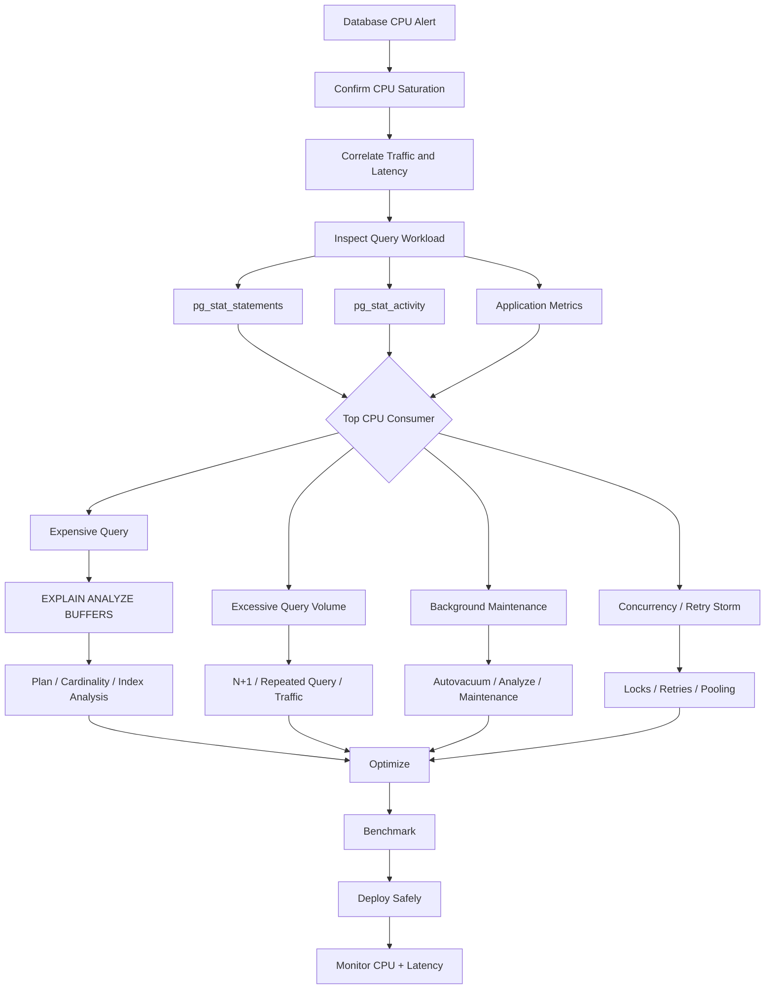
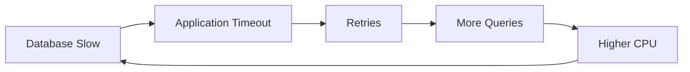
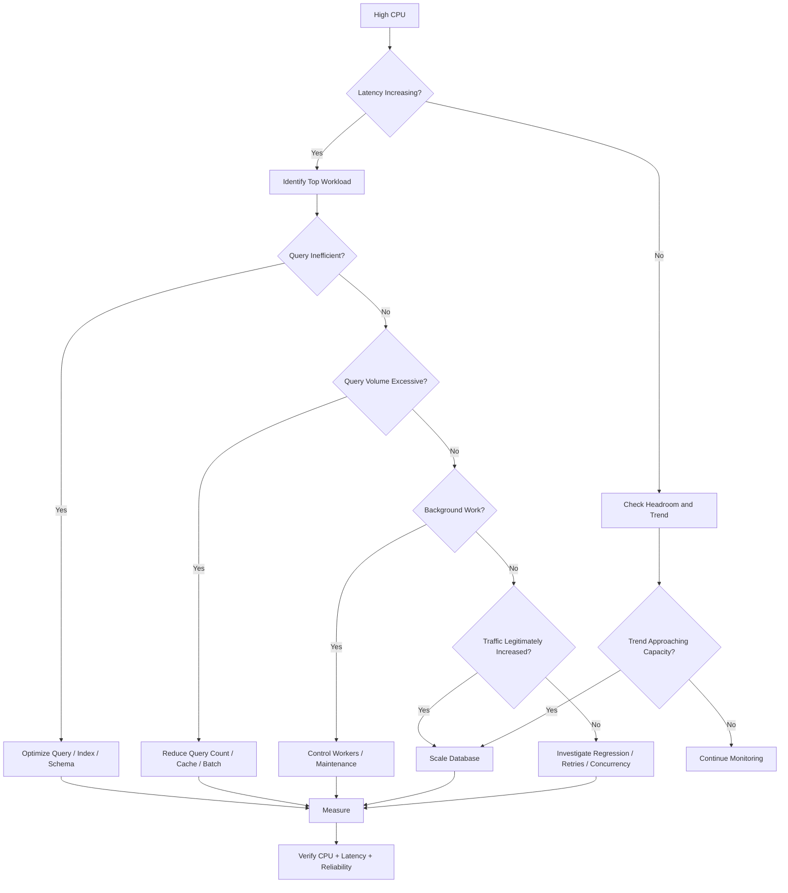

# 21- High Database CPU Troubleshooting

## Overview

High database CPU means the database is spending an unusually large amount of processor time handling workload. In PostgreSQL, CPU can be consumed by query execution, expression evaluation, joins, sorting, aggregation, index processing, concurrency management, background maintenance, or simply excessive query volume.

High CPU is a **symptom**, not a diagnosis.

A production incident should therefore begin with:

```text
High CPU
    ↓
Is CPU actually the database bottleneck?
    ↓
Which workload consumes CPU?
    ↓
Which queries contribute most?
    ↓
Why are those queries expensive?
    ↓
Can the workload or execution plan be improved?
    ↓
Does the fix reduce CPU without damaging writes, latency, or reliability?
```

A useful mental model is:

```text
Database CPU
├── Query execution
│   ├── Sequential scans
│   ├── Joins
│   ├── Sorting
│   ├── Aggregation
│   ├── Expressions
│   └── Function execution
├── Index processing
│   ├── Index scans
│   ├── Bitmap operations
│   └── Index maintenance
├── Concurrency
│   ├── Transaction processing
│   └── Lock management
├── Background work
│   ├── Autovacuum
│   ├── Analyze
│   └── Checkpoint-related activity
└── Excess workload
    ├── Too many queries
    ├── N+1 queries
    ├── Retry storms
    └── Inefficient application behavior
```

The goal is not merely to reduce CPU percentage. The goal is to restore a sustainable relationship between:

```text
workload
+
query efficiency
+
available CPU
+
latency
+
concurrency
```

---

## What High Database CPU Means

CPU utilization measures how much processor capacity the database is consuming.

For example:

```text
Database instance
    CPU capacity = 16 vCPU

Current workload:
    14-15 vCPU continuously consumed
```

This indicates limited headroom.

High CPU becomes especially dangerous when it is accompanied by:

- Increasing query latency.
- Increasing request queueing.
- Connection pool exhaustion.
- Increased p95/p99 latency.
- Replication lag.
- Increased lock waits.
- Query timeouts.
- CPU saturation during traffic spikes.

A database can operate at high CPU without an incident if latency remains stable and sufficient headroom exists.

Conversely, a database at moderate CPU can still be unhealthy if a small number of queries create severe lock, I/O, or connection bottlenecks.

---

## CPU Saturation vs High CPU

These concepts should be distinguished.

| Condition | Interpretation |
|---|---|
| High CPU, stable latency | May be healthy |
| High CPU, increasing latency | Likely capacity/performance problem |
| High CPU, low I/O | Often CPU-bound execution |
| High CPU, high I/O | Mixed workload |
| Low CPU, high latency | Investigate locks, I/O, pools, network |
| High CPU after deployment | Suspect query/application regression |
| High CPU during traffic spike | Could be capacity or workload scaling |
| High CPU during maintenance | Investigate autovacuum/index/DDL activity |

Do not scale the database immediately without identifying the workload.

---

## First Response During an Incident

When CPU is unexpectedly high:

1. Confirm the metric and time window.
2. Identify when the increase started.
3. Correlate CPU with traffic and application latency.
4. Check whether a deployment occurred.
5. Identify top database queries.
6. Inspect active sessions.
7. Check for long-running queries.
8. Check query execution plans.
9. Check background activity.
10. Apply the smallest safe mitigation.
11. Validate CPU and latency after the change.
12. Perform deeper root-cause analysis after stabilization.

The first objective is:

```text
stabilize
```

not:

```text
perform a complete database redesign during an incident
```

---

## High CPU Troubleshooting Architecture



---

## Correlate CPU With Application Behavior

Database CPU should never be analyzed in isolation.

Correlate:

```text
database CPU
+
request rate
+
query rate
+
application latency
+
error rate
+
connection usage
```

For example:

```text
09:00  CPU = 45%
09:30  deployment
09:35  CPU = 80%
09:40  CPU = 95%
09:45  p95 API latency increases
```

This strongly suggests an application/query regression.

Another pattern:

```text
09:00  CPU = 50%
10:00  traffic increases 2x
10:05  CPU = 90%
```

This may indicate normal workload growth exceeding available capacity.

The remediation differs.

---

## Identify the Top Queries

`pg_stat_statements` is one of the most useful PostgreSQL extensions for workload-level analysis.

Example:

```sql
SELECT
    calls,
    total_exec_time,
    mean_exec_time,
    rows,
    shared_blks_hit,
    shared_blks_read,
    query
FROM pg_stat_statements
ORDER BY total_exec_time DESC
LIMIT 20;
```

This identifies queries consuming significant aggregate execution time.

Also inspect:

```sql
SELECT
    calls,
    total_exec_time,
    mean_exec_time,
    rows,
    shared_blks_hit,
    shared_blks_read,
    query
FROM pg_stat_statements
ORDER BY mean_exec_time DESC
LIMIT 20;
```

These answer different questions.

### `total_exec_time`

Useful for finding:

```text
largest aggregate CPU/time consumers
```

### `mean_exec_time`

Useful for finding:

```text
expensive individual executions
```

A query taking:

```text
5 ms × 10 million calls
```

can matter more than:

```text
2 seconds × 20 calls
```

for total system CPU.

---

## Query Frequency Is a CPU Multiplier

A query does not need to be individually expensive to create a CPU incident.

Consider:

```text
query cost = 3 ms
calls      = 5,000,000/day
```

versus:

```text
query cost = 500 ms
calls      = 100/day
```

The first workload can consume substantially more total database CPU.

Therefore analyze:

```text
per-query cost
×
execution frequency
```

not just the slowest individual query.

---

## Query Rate Can Be the Root Cause

Suppose:

```text
average query cost = 2 ms
query rate = 2,000 queries/sec
```

The database may still become CPU-bound.

The fix may be:

```text
reduce query count
```

rather than:

```text
make each query 1 ms faster
```

Potential causes include:

- N+1 ORM queries.
- Duplicate reads.
- Excessive health checks.
- Polling loops.
- Retry storms.
- Chatty microservices.
- Cache misses.
- Inefficient background workers.

---

## N+1 Queries

A common Django pattern is:

```python
orders = Order.objects.all()

for order in orders:
    print(order.customer.email)
```

If the relationship is not prefetched, this can produce:

```text
1 query for orders
+
N queries for customers
```

Even if every individual query is fast, the aggregate workload can consume substantial CPU.

Prefer:

```python
orders = (
    Order.objects
    .select_related("customer")
)
```

For collection relationships, use appropriate `prefetch_related()` strategies.

The principle is:

```text
reduce unnecessary database round trips
```

rather than merely optimizing each individual query.

---

## Repeated Identical Queries

Another CPU pattern is:

```text
service A → SELECT configuration
service A → SELECT configuration
service A → SELECT configuration
...
```

when the data changes rarely.

Potential solutions include:

- Application caching.
- Redis.
- Longer-lived in-process caching where safe.
- Batch reads.
- Request-level deduplication.

Caching should not be used blindly. The data's consistency requirements must be understood.

---

## Cache Miss Storms

A cache can sometimes amplify database CPU when many requests miss simultaneously.

Example:

```text
Redis key expires
      ↓
10,000 requests miss
      ↓
10,000 database queries
      ↓
database CPU spikes
```

Use appropriate cache-stampede protection such as:

```text
request coalescing
locking
stale-while-revalidate
jittered TTLs
prewarming
```

depending on the workload.

---

## Retry Storms

Retries can turn a small database problem into a CPU incident.

Example:

```text
database latency increases
        ↓
application timeout
        ↓
request retries
        ↓
more database queries
        ↓
CPU increases
        ↓
latency increases
        ↓
more retries
```

This creates a positive feedback loop.



Use:

- Bounded retries.
- Exponential backoff.
- Jitter.
- Idempotency.
- Appropriate timeouts.
- Circuit breaking where appropriate.

---

## Inspect Active Sessions

During an incident:

```sql
SELECT
    pid,
    usename,
    application_name,
    client_addr,
    state,
    wait_event_type,
    wait_event,
    query_start,
    now() - query_start AS duration,
    query
FROM pg_stat_activity
WHERE state <> 'idle'
ORDER BY query_start;
```

This helps identify:

- Long-running queries.
- Active CPU consumers.
- Lock waits.
- Background jobs.
- Application sources.
- Unexpected clients.

`pg_stat_activity` provides current session state, while `pg_stat_statements` provides historical/aggregate query statistics.

Use both.

---

## Distinguish CPU Work From Waiting

A query can be active without consuming significant CPU.

For example:

```text
wait_event_type = Lock
```

means the session may be waiting rather than actively executing CPU-intensive work.

Similarly:

```text
wait_event_type = IO
```

indicates a different bottleneck.

A useful incident question is:

> Is the database spending time doing work, or waiting for another resource?

---

## CPU-Bound Query Patterns

Common CPU-heavy operations include:

- Large sequential scans.
- Large joins.
- Hash joins over large inputs.
- Sorting large datasets.
- Aggregation over large datasets.
- Complex expressions.
- Regular expressions.
- JSON processing.
- Function calls per row.
- Repeated casts/conversions.
- Large `DISTINCT` operations.
- Window functions over large result sets.
- Poorly selective queries.

The execution plan reveals which operations dominate.

---

## Sequential Scans

A sequential scan is not inherently bad.

For:

```text
small table
```

or:

```text
query returns most rows
```

it can be optimal.

It becomes suspicious when:

```text
large table
+
high query frequency
+
small result set
+
repeated sequential scans
```

Example:

```sql
SELECT
    id,
    email
FROM app.users
WHERE email = $1;
```

on a table containing:

```text
200 million users
```

with a highly selective email lookup should generally have an efficient access path.

Inspect:

```sql
EXPLAIN (ANALYZE, BUFFERS)
SELECT
    id,
    email
FROM app.users
WHERE email = $1;
```

---

## CPU From Poor Index Design

A database may have an index but still perform excessive work.

Example:

```sql
SELECT
    id,
    created_at,
    total
FROM app.orders
WHERE tenant_id = $1
ORDER BY created_at DESC
LIMIT 50;
```

Existing index:

```text
(created_at)
```

A more appropriate access path may be:

```text
(tenant_id, created_at DESC)
```

if that matches the dominant workload.

Incorrect indexes can cause CPU consumption through:

```text
extra filtering
extra sorting
larger scans
```

---

## Cardinality Misestimation

Suppose:

```text
estimated rows = 100
actual rows = 5,000,000
```

The optimizer may choose a poor plan because its model of the data is wrong.

Possible causes:

- Stale statistics.
- Highly skewed data.
- Correlated columns.
- Rapid data changes.
- Insufficient statistics.

Inspect statistics:

```sql
ANALYZE app.orders;
```

For production, understand why statistics became inaccurate before relying on manual `ANALYZE` as a permanent fix.

Consider extended statistics for correlated columns where appropriate.

---

## Join-Heavy CPU Consumption

Joins can consume substantial CPU.

Example:

```sql
SELECT
    o.id,
    c.email
FROM app.orders o
JOIN app.customers c
    ON c.id = o.customer_id
WHERE o.created_at >= $1;
```

Inspect:

```text
join type
estimated rows
actual rows
loops
join input sizes
```

Potential causes of high CPU include:

```text
large intermediate result
poor cardinality estimates
missing/ineffective access path
bad join order
unselective predicates
```

Do not assume that adding an index to one join column will solve every join problem.

---

## Nested Loop CPU Problems

Nested loops can be highly efficient when the outer relation is small.

For example:

```text
10 outer rows
×
indexed lookup
```

can be excellent.

But:

```text
1,000,000 outer rows
×
expensive inner operation
```

can become extremely expensive.

When a nested loop consumes CPU, inspect:

```text
outer row count
inner loops
inner execution cost
index access
```

The critical metric is often:

```text
loops × inner work
```

---

## Hash Join CPU

Hash joins can be efficient for large relations.

CPU can become significant when:

```text
large input
+
large hash table
+
large probe workload
```

Inspect:

```text
actual rows
hash batches
memory behavior
join predicates
```

If a query unexpectedly processes millions of rows, the root cause may be upstream filtering or cardinality estimation rather than the hash join itself.

---

## Sorting and CPU

Large sorts can consume substantial CPU.

Example:

```sql
SELECT
    id,
    created_at
FROM app.orders
WHERE tenant_id = $1
ORDER BY created_at DESC;
```

If a large number of rows must be sorted, CPU usage can increase.

A suitable index such as:

```text
(tenant_id, created_at DESC)
```

may allow PostgreSQL to retrieve rows in the required order.

But an index is not always the right answer. If the query intentionally returns a large dataset, sorting may simply be part of the required workload.

---

## Aggregation CPU

Queries such as:

```sql
SELECT
    customer_id,
    COUNT(*),
    SUM(total)
FROM app.orders
GROUP BY customer_id;
```

can legitimately consume substantial CPU.

If the query processes millions of rows, an index alone may not dramatically reduce the aggregation cost.

Consider:

- Filtering earlier.
- Pre-aggregation.
- Materialized views.
- Incremental summary tables.
- OLAP workloads.
- Read replicas.
- Analytical databases.

Do not force transactional PostgreSQL to perform workloads better suited to an analytical architecture.

---

## `DISTINCT` CPU

Example:

```sql
SELECT DISTINCT customer_id
FROM app.orders;
```

Depending on the plan, PostgreSQL may need substantial work to eliminate duplicates.

Possible strategies depend on the access pattern:

- Appropriate indexes.
- Query restructuring.
- Precomputed aggregates.
- Materialized views.
- Better data modeling.

Inspect the plan before making changes.

---

## Window Functions

Window functions can be computationally expensive:

```sql
SELECT
    customer_id,
    created_at,
    total,
    ROW_NUMBER() OVER (
        PARTITION BY customer_id
        ORDER BY created_at DESC
    ) AS position
FROM app.orders;
```

They can require:

```text
partitioning
+
ordering
+
processing many rows
```

If this occurs in a high-frequency API path, reconsider whether the operation belongs in synchronous OLTP request processing.

---

## JSON and Expression CPU

PostgreSQL can efficiently handle JSON workloads, but repeatedly processing complex JSON expressions across millions of rows can consume CPU.

Example:

```sql
SELECT *
FROM app.events
WHERE payload->>'event_type' = $1;
```

If this is a high-frequency query, consider whether the access path should include an expression or generated representation appropriate to the workload.

Do not extract and index every JSON field indiscriminately.

---

## Function Calls Per Row

A query such as:

```sql
SELECT
    id,
    expensive_function(payload)
FROM app.events;
```

can execute the function once per row.

For millions of rows:

```text
millions of function executions
```

can become a major CPU consumer.

Inspect execution plans and function behavior when CPU spikes are associated with expression-heavy queries.

---

## Regular Expressions

Patterns such as:

```sql
WHERE email ~* $1
```

can be CPU-intensive, particularly over large datasets.

If the application requires high-volume text search, consider whether the workload belongs in:

```text
specialized indexes
search infrastructure
```

rather than repeatedly evaluating expensive expressions across large tables.

---

## Query Plan Investigation

For a CPU-heavy query:

```sql
EXPLAIN (ANALYZE, BUFFERS)
SELECT
    ...
FROM ...
WHERE ...;
```

Inspect:

```text
actual time
actual rows
loops
Rows Removed by Filter
join nodes
sort nodes
aggregate nodes
buffer activity
```

Look for the operator that performs the largest amount of work.

A useful conceptual calculation is:

```text
node work
≈
actual rows
×
loops
×
per-row processing cost
```

The plan should guide optimization.

---

## Estimated vs Actual Rows

A major troubleshooting signal is:

```text
estimated rows ≠ actual rows
```

For example:

```text
estimated = 10
actual    = 2,000,000
```

This can cause:

```text
wrong join strategy
wrong join order
wrong scan choice
wrong memory assumptions
```

The resulting CPU problem may therefore be a statistics problem rather than an indexing problem.

---

## `Rows Removed by Filter`

Example:

```text
actual rows = 100
Rows Removed by Filter = 10,000,000
```

This indicates significant work occurred before producing the final result.

Investigate:

```text
index alignment
predicate selectivity
query structure
partition pruning
data distribution
```

This is often a strong clue when CPU is high.

---

## Partition Pruning

For large partitioned tables:

```text
events_2026_01
events_2026_02
events_2026_03
...
```

a query with a partition-compatible predicate can avoid scanning irrelevant partitions.

Example:

```sql
SELECT
    count(*)
FROM app.events
WHERE occurred_at >= $1
  AND occurred_at < $2;
```

If partitioning is aligned with the workload, partition pruning can substantially reduce CPU.

But partitioning should not be introduced solely because CPU is high. It should solve a data lifecycle and access-pattern problem.

---

## Connection Pool Amplification

Suppose:

```text
one application instance
    → 10 DB connections
```

becomes:

```text
50 Kubernetes pods
    → 10 DB connections each
    → 500 concurrent connections
```

More concurrency can increase:

```text
query execution
context switching
lock contention
CPU pressure
```

Scaling application replicas does not automatically improve database capacity.

Connection pools must be sized relative to:

```text
database CPU
query latency
workload
number of application instances
```

---

## Too Many Concurrent Queries

A database can become CPU-bound because too much work is happening simultaneously.

This is an important senior-level concept:

```text
more concurrency
≠
more throughput
```

Once CPU is saturated, additional concurrent queries can increase:

```text
queueing
context switching
tail latency
timeouts
```

without increasing useful throughput.

Backpressure can be more effective than simply increasing worker counts.

---

## Celery and Background Jobs

Celery workers can unexpectedly create database CPU incidents.

Example:

```text
100 Celery workers
    ↓
each executes several DB queries
    ↓
high concurrent query rate
    ↓
database CPU saturation
```

Control:

```text
worker concurrency
task rate
batch size
query count
connection pools
```

Background processing should have explicit database capacity assumptions.

---

## Kafka Consumers

Kafka consumers can create similar pressure:

```text
Kafka
  ↓
many consumers
  ↓
database writes
  ↓
index maintenance
  ↓
CPU
```

If consumer concurrency is increased without considering database capacity, CPU can saturate.

Use:

- Controlled consumer concurrency.
- Batching.
- Bulk operations.
- Idempotency.
- Backpressure.
- Appropriate partition/consumer sizing.

---

## Bulk Writes and CPU

Bulk writes can consume substantial CPU because PostgreSQL must maintain:

```text
table storage
+
indexes
+
constraints
+
triggers
```

If CPU spikes during ingestion, inspect:

```text
insert rate
index count
trigger cost
constraint processing
batch size
```

Reducing unnecessary indexes can sometimes improve write throughput significantly.

---

## Autovacuum and CPU

Autovacuum is essential PostgreSQL maintenance.

It can consume CPU while processing high-churn tables.

Do not disable autovacuum simply because CPU is high.

Instead determine:

```text
Which table is being vacuumed?
Why is it generating so much work?
Are dead tuples accumulating?
Are updates/deletes unusually high?
Are autovacuum thresholds appropriate?
```

Inspect table statistics:

```sql
SELECT
    relname,
    n_live_tup,
    n_dead_tup,
    last_autovacuum,
    last_autoanalyze,
    autovacuum_count,
    autoanalyze_count
FROM pg_stat_user_tables
ORDER BY n_dead_tup DESC;
```

---

## Analyze and Statistics Maintenance

`ANALYZE` consumes resources but provides statistics required for good query planning.

If CPU is high during heavy maintenance, identify whether:

```text
autovacuum
autoanalyze
manual maintenance
```

is contributing.

The solution is usually workload/maintenance tuning rather than disabling statistics collection.

---

## Index Maintenance CPU

Indexes can consume CPU during:

```text
INSERT
UPDATE
DELETE
CREATE INDEX
REINDEX
VACUUM-related maintenance
```

A write-heavy workload with many indexes can therefore be CPU-intensive.

Inspect:

```text
index count
index size
write volume
index usage
```

before adding more indexes to solve a read problem.

---

## CPU From DDL

Large operations such as:

```sql
CREATE INDEX
REINDEX
ALTER TABLE
```

can consume significant resources.

During a migration:

```text
CPU increases
+
I/O increases
+
application latency increases
```

Check deployment timelines when the CPU spike starts immediately after a schema change.

Production schema changes should be observable and staged appropriately.

---

## Detect Deployment Correlation

Always ask:

```text
Did the problem begin after:
    application deployment?
    migration?
    feature rollout?
    configuration change?
    traffic change?
```

A new ORM query can cause a CPU incident even when:

```text
application code appears functionally correct
```

Examples:

```text
select_related removed
new filter removed
pagination removed
new aggregation added
query executed inside a loop
cache disabled
```

Database performance is part of application behavior.

---

## Django ORM Query Inspection

For a suspicious queryset:

```python
queryset = (
    Order.objects
    .filter(
        tenant_id=tenant_id,
        status="pending",
    )
    .order_by("-created_at")
)
```

Inspect generated SQL:

```python
print(queryset.query)
```

Then analyze the SQL directly with PostgreSQL tooling.

Use Django query-count tooling in development and application observability in production to identify:

```text
query frequency
N+1 behavior
unexpected ORM expansion
```

---

## FastAPI and SQLAlchemy

For SQLAlchemy applications, inspect generated SQL through the application's database instrumentation rather than relying only on ORM code.

The important boundary is:

```text
Python code
    ↓
ORM/query builder
    ↓
generated SQL
    ↓
PostgreSQL planner
    ↓
execution
```

A CPU incident can originate at any layer.

---

## Query Timeout Is Not CPU Diagnosis

A timeout tells you:

```text
the request took too long
```

It does not tell you:

```text
why
```

Possible causes include:

```text
CPU
I/O
locks
connection pool
network
replica lag
external dependency
```

Always inspect database wait events and execution plans.

---

## CPU and Lock Contention

Locks themselves are not necessarily CPU-heavy.

A system can have:

```text
high CPU
+
high lock contention
```

because many transactions are executing and competing simultaneously.

But if sessions are mostly:

```text
waiting on Lock
```

the primary problem may be concurrency rather than CPU execution.

Do not optimize CPU while ignoring the actual bottleneck.

---

## CPU and I/O

CPU and I/O often interact.

Example:

```text
large sequential scans
    ↓
many pages read
    ↓
CPU processes rows
    ↓
I/O + CPU increase
```

Similarly:

```text
large index scans
    ↓
random heap access
    ↓
I/O increases
    ↓
CPU may remain moderate
```

Use:

```text
EXPLAIN (ANALYZE, BUFFERS)
```

and infrastructure metrics together.

---

## Query CPU vs Instance Capacity

Suppose:

```text
database CPU = 95%
```

and top queries account for:

```text
85% of execution time
```

Optimize queries first.

If:

```text
database CPU = 95%
```

but the workload is already efficient and traffic has doubled, scaling the database may be appropriate.

The decision should be:

```text
inefficient workload?
    → optimize

efficient workload exceeding capacity?
    → scale

both?
    → optimize + scale
```

---

## Vertical Scaling

Increasing CPU capacity can be an appropriate short-term or long-term solution.

Example:

```text
8 vCPU
    ↓
16 vCPU
```

Advantages:

- Fast operational change.
- Minimal application changes.
- Useful for CPU-bound workloads.
- Can restore capacity headroom.

Limitations:

- Higher cost.
- Finite scaling ceiling.
- Does not fix inefficient queries.
- Can hide workload problems.

Use scaling as capacity management, not as a substitute for diagnosis.

---

## Read Replicas and CPU

Read replicas can distribute read workload:

```text
Application
   ├── writes → primary
   └── reads  → replicas
```

This can reduce primary CPU for read-heavy systems.

However:

- Replica lag exists.
- Read-after-write consistency requires consideration.
- Replicas need sufficient CPU themselves.
- Some workloads cannot be safely routed to replicas.

Do not use replicas to hide an inefficient query indefinitely.

---

## Redis as a CPU Mitigation

For repeated, cacheable reads:

```text
Application
    ↓
Redis
    ↓ cache miss
PostgreSQL
```

can reduce database query volume.

Use Redis when:

```text
data is cacheable
+
staleness is acceptable or manageable
+
database access is genuinely repetitive
```

Do not cache transactional invariants merely to avoid database CPU.

---

## Materialized Views

For expensive analytical queries that are repeatedly executed:

```text
large aggregation
    ↓
materialized result
```

can reduce repeated CPU work.

This is useful when:

```text
data freshness requirements permit
```

and the workload is read-heavy.

For real-time transactional requests, a materialized view may not be appropriate.

---

## OLTP vs OLAP CPU

A transactional database should not automatically become the analytics engine for every workload.

Consider:

```text
OLTP
    → small, frequent transactions

OLAP
    → large scans, joins, aggregations
```

If CPU is dominated by:

```text
large reporting queries
```

consider:

```text
read replica
analytics database
warehouse
materialized views
precomputed read models
```

depending on requirements.

---

## CPU Troubleshooting Decision Matrix

| Symptom | Likely direction |
|---|---|
| One query dominates CPU | Query plan optimization |
| Many fast queries dominate CPU | Reduce query frequency |
| CPU spike after deployment | Application/query regression |
| CPU spike after traffic increase | Capacity or workload scaling |
| High CPU + N+1 | Fix ORM access pattern |
| High CPU + retries | Control retry storm |
| High CPU during ingestion | Batch/write/index optimization |
| High CPU during maintenance | Investigate autovacuum/DDL/index work |
| High CPU + large reports | Isolate OLAP workload |
| Low CPU + high latency | Investigate locks/I/O/pools/network |
| High CPU + replica lag | Investigate write/replay workload |
| High CPU + cache miss spike | Investigate cache stampede |

---

## A Production Investigation Example

Suppose:

```text
PostgreSQL CPU
    45% → 92%

API p95
    120 ms → 850 ms
```

Timeline:

```text
10:00 deployment
10:05 CPU increases
10:10 p95 increases
10:15 database CPU reaches 92%
```

`pg_stat_statements` shows:

```text
query A
calls: 8,000,000
mean: 2.5 ms

query B
calls: 20,000
mean: 100 ms
```

Although query B is individually slower, query A may be the larger aggregate CPU contributor.

Inspection reveals:

```text
query A
    ↓
new endpoint
    ↓
N+1 query
    ↓
each request performs 10 extra DB queries
```

The correct fix is:

```text
remove N+1
```

not:

```text
increase database size immediately
```

---

## Another Production Scenario: Query Regression

Suppose CPU rises without increased traffic.

A deployment introduced:

```sql
SELECT *
FROM app.orders
WHERE tenant_id = $1
ORDER BY created_at DESC;
```

The previous implementation had:

```text
LIMIT 50
```

The new query removes the limit.

Result:

```text
more rows scanned
+
more rows sorted
+
more data transferred
+
more CPU
```

The database symptom is high CPU, but the root cause is an application query regression.

---

## Emergency Mitigation

During an active incident, possible mitigations include:

- Roll back a recent application deployment.
- Disable a newly introduced expensive feature.
- Reduce background worker concurrency.
- Temporarily reduce traffic to a problematic endpoint.
- Increase cache effectiveness where safe.
- Stop an unnecessary analytical workload.
- Route appropriate reads to replicas.
- Increase database capacity if immediate headroom is required.

Avoid risky production changes such as:

```text
dropping indexes blindly
disabling autovacuum
changing planner settings without evidence
terminating random sessions
```

Mitigation should be targeted and reversible.

---

## Query Cancellation

A runaway query may need to be cancelled.

Inspect:

```sql
SELECT
    pid,
    application_name,
    query_start,
    now() - query_start AS duration,
    query
FROM pg_stat_activity
WHERE state = 'active'
ORDER BY query_start;
```

Then, when justified:

```sql
SELECT pg_cancel_backend(<pid>);
```

Cancellation is safer than immediately terminating the backend in many cases.

Use:

```sql
SELECT pg_terminate_backend(<pid>);
```

only when stronger intervention is justified.

Always understand the application and transaction consequences before terminating sessions.

---

## Preventing Runaway Queries

Use appropriate controls such as:

```text
statement_timeout
lock_timeout
application request deadlines
query limits
pagination
resource isolation
```

Example:

```sql
SET LOCAL statement_timeout = '5s';
```

Transaction-scoped settings are useful when a particular operation requires a stricter limit.

Timeouts should be designed consistently across:

```text
client
Nginx/load balancer
application
database
```

Avoid contradictory timeout hierarchies.

---

## Connection Pool Backpressure

A connection pool should prevent unlimited concurrency from reaching PostgreSQL.

For example:

```text
100 application requests
        ↓
pool size = 20
        ↓
20 database operations
        ↓
remaining requests wait
```

This can protect the database from uncontrolled concurrency.

However, an undersized pool can create application latency.

The goal is controlled concurrency, not the largest possible pool.

---

## Kubernetes Scaling Trap

Suppose:

```text
10 pods × 10 connections = 100 connections
```

A Horizontal Pod Autoscaler scales to:

```text
50 pods × 10 connections = 500 connections
```

The application may scale successfully while the database becomes CPU-bound.

Before increasing application replicas, understand:

```text
database connection capacity
query concurrency
CPU capacity
workload per request
```

Application autoscaling must account for database capacity.

---

## AWS Considerations

For managed PostgreSQL on AWS, correlate database CPU with:

```text
CPU utilization
DatabaseConnections
ReadIOPS
WriteIOPS
ReadLatency
WriteLatency
NetworkThroughput
FreeableMemory
replica lag
```

Depending on the service and deployment, use the provider's database monitoring capabilities alongside PostgreSQL-native statistics.

Do not rely on a single CloudWatch metric to diagnose database performance.

---

## Monitoring Strategy

Track both infrastructure and query-level metrics.

### Infrastructure

```text
CPU
memory
I/O
storage
network
connections
```

### PostgreSQL

```text
query latency
query calls
buffer hits
buffer reads
active sessions
wait events
dead tuples
autovacuum
replication lag
WAL activity
```

### Application

```text
request rate
p50/p95/p99
error rate
timeouts
retries
worker concurrency
cache hit ratio
```

The strongest signal comes from correlation.

---

## Alerting

Avoid alerts such as:

```text
CPU > 80%
```

without context.

Better alerts combine:

```text
CPU saturation
+
latency degradation
```

or:

```text
CPU saturation
+
sustained duration
```

For example:

```text
CPU > 85%
for 10 minutes
AND
p95 database latency > baseline
```

Thresholds should be tuned to the workload and available headroom.

---

## Capacity Planning

Track:

```text
CPU utilization trend
query volume trend
database size
write throughput
read throughput
connection growth
```

If CPU increases linearly with traffic:

```text
traffic ↑
    ↓
query volume ↑
    ↓
CPU ↑
```

estimate when the system will exhaust available capacity.

Do not wait until:

```text
CPU = 100%
```

to begin scaling discussions.

---

## CPU Headroom

A production database should have enough headroom for:

```text
traffic spikes
maintenance
failover
deployments
background jobs
unexpected queries
```

The correct headroom target depends on the workload.

A system running at:

```text
95% CPU continuously
```

may have insufficient resilience even if requests are currently succeeding.

---

## High Availability Implications

During failover:

```text
primary
    ↓ failure
replica becomes primary
```

the new primary may inherit:

```text
full read/write workload
```

If the previous primary was already near CPU saturation, failover can immediately create another incident.

HA planning must therefore include:

```text
steady-state capacity
+
failover capacity
```

---

## Read Replica Capacity

Read replicas must also have sufficient resources.

If:

```text
primary = 16 vCPU
replica = 4 vCPU
```

and large analytical queries are routed to the replica, the replica may become CPU-bound.

Read scaling is not simply:

```text
add replica
```

It is:

```text
route workload
+
size replicas
+
monitor lag
+
respect consistency
```

---

## Disaster Recovery Considerations

Recovery environments should be capable of handling the expected workload if they become production.

Document:

```text
CPU capacity
connection limits
replica promotion behavior
query workload
backup restoration requirements
```

A DR replica that cannot sustain production traffic is not an adequate capacity plan.

---

## Security Considerations

High CPU incidents can have security implications.

Potential causes include:

- Unbounded API queries.
- Expensive user-controlled search.
- Regex abuse.
- Large export requests.
- Resource exhaustion attacks.
- Excessive authentication/authorization queries.

Protect expensive database operations with:

```text
authentication
authorization
rate limiting
pagination
query limits
timeouts
input validation
```

Do not expose unrestricted database-intensive operations through public APIs.

---

## Reliability Considerations

Database CPU incidents often become cascading failures:

```text
CPU saturation
    ↓
query latency
    ↓
application timeouts
    ↓
retries
    ↓
more database work
    ↓
greater CPU saturation
```

Reliability controls should therefore include:

- Bounded concurrency.
- Backpressure.
- Timeouts.
- Retry budgets.
- Exponential backoff.
- Jitter.
- Idempotency.
- Circuit breaking where appropriate.

---

## Cost Considerations

CPU optimization can reduce cloud costs.

However, optimizing every query is not always cheaper than scaling.

Compare:

```text
engineering effort
+
operational complexity
+
performance benefit
```

against:

```text
additional database capacity cost
```

A useful strategy is often:

```text
fix obvious inefficient workloads
+
maintain reasonable headroom
+
scale when workload legitimately requires it
```

---

## Production Troubleshooting Checklist

### Confirm

- [ ] Confirm CPU metric and time window.
- [ ] Confirm whether CPU saturation is affecting latency.
- [ ] Correlate CPU with request volume.
- [ ] Check deployments and migrations.
- [ ] Check application errors and timeouts.

### Identify Workload

- [ ] Inspect `pg_stat_statements`.
- [ ] Inspect active sessions.
- [ ] Identify top queries by total execution time.
- [ ] Identify high-frequency queries.
- [ ] Check query concurrency.
- [ ] Check background workers.
- [ ] Check retry rates.
- [ ] Check cache hit/miss behavior.

### Analyze Queries

- [ ] Run `EXPLAIN`.
- [ ] Run `EXPLAIN (ANALYZE, BUFFERS)` safely.
- [ ] Compare estimated and actual rows.
- [ ] Inspect joins.
- [ ] Inspect sorts.
- [ ] Inspect aggregations.
- [ ] Inspect filters.
- [ ] Inspect index usage.
- [ ] Check `Rows Removed by Filter`.
- [ ] Check for large result sets.

### Check Database Operations

- [ ] Check autovacuum.
- [ ] Check autoanalyze.
- [ ] Check index maintenance.
- [ ] Check long-running transactions.
- [ ] Check lock waits.
- [ ] Check replication.
- [ ] Check connection counts.

### Mitigate

- [ ] Roll back regressions when appropriate.
- [ ] Reduce background concurrency.
- [ ] Apply rate limiting where necessary.
- [ ] Reduce query volume.
- [ ] Improve caching where safe.
- [ ] Route suitable reads to replicas.
- [ ] Scale database capacity when justified.

### Validate

- [ ] Confirm CPU decreases.
- [ ] Confirm p95/p99 improves.
- [ ] Confirm throughput remains healthy.
- [ ] Confirm replication remains healthy.
- [ ] Confirm writes did not regress.
- [ ] Confirm no new error/retry storm occurs.

---

## Common Mistakes

### Treating CPU as the Root Cause

CPU is a resource metric, not a diagnosis.

**Better approach:** identify the workload consuming CPU.

### Optimizing Only the Slowest Query

A query taking:

```text
1 second × 100 calls
```

may consume less total CPU than:

```text
3 ms × 10 million calls
```

**Better approach:** analyze aggregate workload.

### Adding Indexes Immediately

An index can help but can also increase write CPU and maintenance cost.

**Better approach:** inspect the execution plan first.

### Assuming Sequential Scans Are Always Bad

Sequential scans can be optimal for large result sets or small tables.

**Better approach:** evaluate selectivity and actual work.

### Increasing Connection Pool Size

More connections can increase concurrency and CPU pressure.

**Better approach:** treat connection pools as concurrency controls.

### Scaling Kubernetes Pods Without Database Analysis

More pods can produce more database queries.

**Better approach:** model aggregate database concurrency.

### Disabling Autovacuum

This can make the database healthier temporarily only in appearance while creating serious long-term problems.

**Better approach:** investigate why maintenance is expensive.

### Blindly Killing Sessions

A session may be executing an important transaction.

**Better approach:** identify the query, owner, application, transaction state, and business impact before cancelling it.

### Using Redis as a Universal Fix

Caching can reduce repeated reads but introduces consistency and invalidation complexity.

**Better approach:** cache only workloads with appropriate consistency semantics.

### Ignoring Retries

Retries can amplify CPU saturation.

**Better approach:** use bounded retries, backoff, jitter, and idempotency.

### Ignoring Background Workers

Celery and Kafka consumers can create significant database load even when API traffic is normal.

**Better approach:** monitor all database clients.

### Optimizing During an Incident Without Measuring

Changing indexes, planner settings, or schema structures without evidence can make the incident worse.

**Better approach:** make targeted, reversible changes and measure each one.

---

## Senior-Level Diagnostic Model

When database CPU is high, reason across five dimensions:

### Work

```text
What is the database doing?
```

### Volume

```text
How many times is it doing it?
```

### Efficiency

```text
Is each operation doing unnecessary work?
```

### Concurrency

```text
How many operations are executing simultaneously?
```

### Capacity

```text
Does the database have enough CPU for the legitimate workload?
```

This produces a useful model:

```text
Database CPU pressure
    =
    work per operation
    ×
    operations per second
    ×
    concurrency effects
```

Then optimize in this order:

```text
remove unnecessary work
        ↓
reduce unnecessary query volume
        ↓
improve execution efficiency
        ↓
control concurrency
        ↓
scale capacity
```

---

## Practical Decision Framework



---

## Production Best Practices

- Instrument database queries before incidents occur.
- Enable and retain useful `pg_stat_statements` data.
- Monitor query frequency, not just query latency.
- Track p95/p99 database latency.
- Correlate database metrics with application traces.
- Establish database CPU headroom targets.
- Control application connection pools.
- Limit background-worker concurrency.
- Use bounded retries with exponential backoff and jitter.
- Prevent unbounded API queries.
- Review ORM query counts.
- Use appropriate indexes based on real query patterns.
- Keep statistics current.
- Monitor autovacuum and table churn.
- Separate analytical workloads when necessary.
- Load-test realistic concurrency.
- Include failover capacity in HA planning.
- Make performance changes measurable and reversible.

---

## Interview Traps

### Is 90% Database CPU Always Bad?

No. High CPU can be healthy if throughput and latency are stable and sufficient headroom exists. Sustained saturation with increasing latency is the stronger signal.

### What Is the First Thing You Check?

Confirm the CPU signal, correlate it with latency and workload, then identify which queries or activities are consuming the CPU.

### Which PostgreSQL Tool Helps Identify Expensive Queries?

`pg_stat_statements` is a primary tool for aggregate query statistics. `pg_stat_activity` provides current session state.

### Is the Slowest Query Always the Largest CPU Consumer?

No. Query frequency matters:

```text
cost × calls
```

can make a fast, extremely frequent query the dominant workload.

### Does a Sequential Scan Mean an Index Is Missing?

No. Sequential scans can be optimal. Check table size, selectivity, result size, and the execution plan.

### Can More Connections Reduce CPU?

Usually not. More concurrency can increase CPU pressure and queueing once the database is saturated.

### Can More Kubernetes Pods Cause High Database CPU?

Yes. More application instances can produce more concurrent database queries and more aggregate connection demand.

### Can Redis Fix High Database CPU?

It can reduce repetitive, cacheable reads, but it does not fix CPU-intensive transactional workloads, bad queries, or excessive writes.

### Can Read Replicas Solve High CPU?

They can distribute suitable read workloads, reducing primary CPU, but they do not solve write CPU and introduce consistency and replication-lag considerations.

### What Is a Retry Storm?

A feedback loop where database latency causes application retries, retries generate more database workload, and the additional workload causes further latency.

### How Can You Distinguish CPU From Lock Contention?

Inspect PostgreSQL wait events. Sessions waiting on locks are not equivalent to sessions actively consuming CPU.

### How Do You Investigate a CPU-Heavy Query?

Use:

```sql
EXPLAIN (ANALYZE, BUFFERS)
```

and inspect:

```text
actual rows
loops
join operations
sorts
aggregations
filters
buffer activity
```

### When Should You Scale the Database Instead of Optimizing?

When the workload is already reasonably efficient and legitimate traffic has exceeded available capacity. In practice, obvious query inefficiencies should be addressed while maintaining sufficient capacity headroom.

### What Is the Senior-Level Approach to High Database CPU?

Treat CPU as a workload symptom and analyze:

```text
work
+
query frequency
+
execution efficiency
+
concurrency
+
capacity
```

Then reduce unnecessary work, optimize expensive access paths, control concurrency, and scale only when the remaining workload genuinely requires more capacity.

## Key Takeaways

- **High database CPU is a symptom, not a diagnosis:** identify the queries, workload volume, concurrency, maintenance activity, and application behavior responsible for the CPU consumption.
- **Optimize aggregate workload, not just slow queries:** query frequency, N+1 patterns, retries, background workers, cache misses, and excessive concurrency can consume more CPU than a small number of individually slow queries.
- **Use PostgreSQL evidence:** combine `pg_stat_statements`, `pg_stat_activity`, execution plans, wait events, buffer statistics, and infrastructure metrics to distinguish CPU-bound execution from locks, I/O, pooling, and other bottlenecks.
- **Control concurrency as well as query cost:** larger pools, more Kubernetes pods, Celery workers, Kafka consumers, and retries can amplify database CPU after saturation.
- **Scale only after understanding the workload:** optimize inefficient queries and workload patterns first, then add capacity when the remaining production workload legitimately requires it.