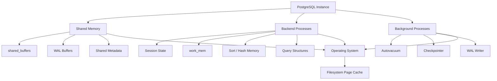
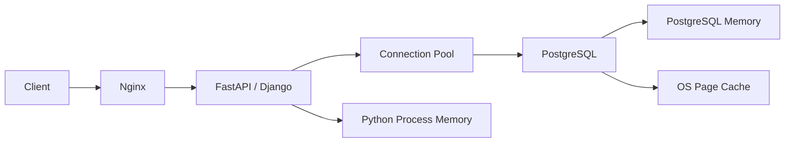
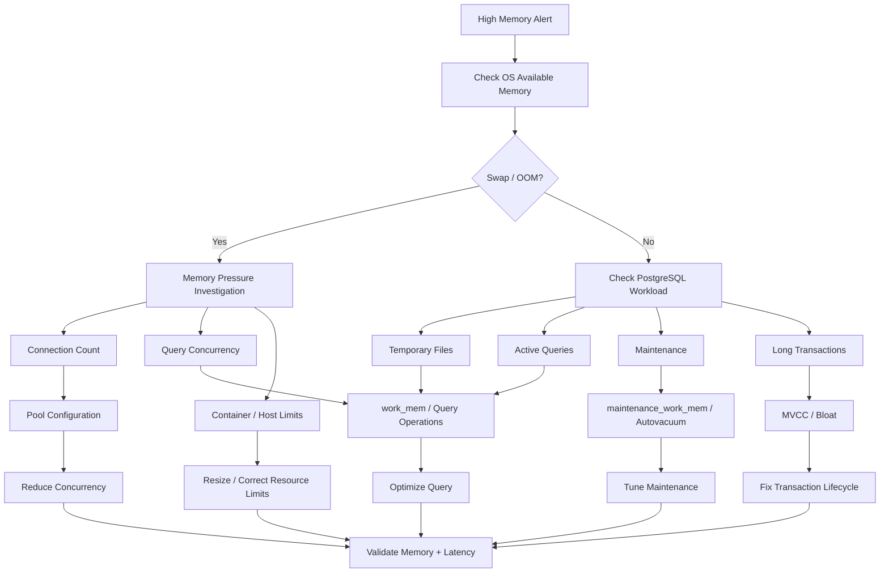

# 22- High Database Memory Troubleshooting

## Overview

High database memory usage is not automatically a problem. PostgreSQL and the operating system intentionally use available memory for caching, query execution, connections, maintenance, and other workloads.

The important question is not:

> "Why is database memory high?"

It is:

> "Is memory pressure causing measurable performance, reliability, or capacity problems?"

A useful model is:

```text
Database Memory
├── PostgreSQL shared memory
│   ├── shared_buffers
│   ├── WAL buffers
│   └── other shared structures
├── Per-session / per-operation memory
│   ├── work_mem
│   ├── maintenance_work_mem
│   └── backend-local allocations
├── Operating-system page cache
│   └── filesystem cache
└── Connection/application overhead
    ├── PostgreSQL backend processes
    ├── connection state
    └── prepared/session state
```

Memory pressure becomes dangerous when it leads to:

```text
memory pressure
    ↓
OS reclaim / swapping / allocation failures
    ↓
query latency increases
    ↓
connections remain busy longer
    ↓
connection pools fill
    ↓
request latency increases
```

High memory utilization can therefore be either:

- Normal cache utilization.
- A legitimate workload requirement.
- A configuration problem.
- A query-level memory problem.
- A connection-scaling problem.
- A memory leak or unexpected process growth.
- A symptom of broader system overload.

---

## Why Database Memory Matters

Memory directly affects database performance.

Enough memory allows the system to:

- Cache frequently accessed data.
- Avoid repeated disk reads.
- Perform joins efficiently.
- Sort data without excessive temporary I/O.
- Build indexes more efficiently.
- Maintain working sets in memory.
- Support concurrent workloads.

Too little memory can cause:

```text
cache misses
+
temporary files
+
disk I/O
+
longer queries
+
higher latency
```

Too much aggressively allocated per-query memory can cause:

```text
many concurrent operations
×
large memory allocation
=
memory exhaustion
```

The second problem is particularly important in PostgreSQL because some memory settings are **per operation or per session**, not global limits.

---

## PostgreSQL Memory Architecture

A simplified PostgreSQL memory architecture looks like:



This distinction matters because PostgreSQL does not have one single memory pool representing all database memory consumption.

---

## `shared_buffers`

`shared_buffers` controls the amount of memory PostgreSQL allocates for its shared buffer cache.

Example:

```conf
shared_buffers = 4GB
```

The buffer cache stores PostgreSQL data pages so frequently accessed data does not always need to be read from storage.

Conceptually:

```text
Query
  ↓
PostgreSQL buffer cache
  ↓
page found?
 ├── yes → use cached page
 └── no  → read from storage
```

A larger buffer cache can improve cache residency, but making it excessively large does not guarantee better performance.

---

## PostgreSQL and the OS Page Cache

PostgreSQL also relies heavily on the operating system's filesystem cache.

This means memory can be used at multiple layers:

```text
Application
    ↓
PostgreSQL
    ↓
shared_buffers
    ↓
OS page cache
    ↓
Storage
```

Therefore:

```text
OS memory usage ≠ PostgreSQL shared_buffers
```

A database host may show high memory utilization even when PostgreSQL is behaving normally because Linux is using free memory for filesystem caching.

This is why:

```text
free memory
```

should not be interpreted in isolation.

---

## Linux Memory Metrics

On Linux, inspect:

```bash
free -h
```

Example:

```text
               total        used        free      shared  buff/cache   available
Mem:            32Gi        18Gi        2Gi        1Gi        12Gi        13Gi
Swap:            4Gi       256Mi        4Gi
```

The `available` memory figure is generally more useful than simply looking at `free`.

Also inspect:

```bash
vmstat 1
```

and:

```bash
cat /proc/meminfo
```

Look for:

```text
MemAvailable
SwapTotal
SwapFree
SwapCached
Dirty
```

The exact interpretation depends on the operating system and workload.

---

## Swap Is an Important Signal

Swap activity is usually much more concerning than high memory utilization alone.

Check:

```bash
swapon --show
```

and:

```bash
vmstat 1
```

Look at:

```text
si
so
```

where sustained non-zero swap-in/swap-out activity can indicate memory pressure.

A database experiencing significant swapping can suffer severe latency because database workloads are sensitive to storage latency.

For production databases, unexpected active swapping should be investigated rather than treated as normal cache usage.

---

## Memory Pressure vs High Memory Usage

| Condition | Interpretation |
|---|---|
| High memory, high `MemAvailable` | Often normal |
| High memory, no swap activity | May be healthy |
| High memory, sustained swap | Memory pressure |
| High memory, OOM kills | Critical |
| High memory after query concurrency spike | Per-query memory issue |
| High memory after connection growth | Session/backend overhead |
| High memory during maintenance | Investigate maintenance workload |
| High memory + temporary files | Query memory may be insufficient |
| High memory + latency | Investigate workload and OS pressure |

---

## Query Memory: `work_mem`

`work_mem` controls the amount of memory available for certain query operations before PostgreSQL starts using temporary files.

Operations can include:

- Sorts.
- Hash tables.
- Hash joins.
- Hash aggregates.
- Other executor operations.

Example:

```conf
work_mem = 16MB
```

The critical point is:

> `work_mem` is not a global memory allocation for the entire database.

It can be consumed by individual operations within individual queries.

Conceptually:

```text
10 concurrent queries
    ×
multiple sort/hash operations
    ×
16 MB
```

can require substantially more than:

```text
16 MB
```

of memory.

---

## Why Increasing `work_mem` Can Be Dangerous

Suppose:

```text
work_mem = 256MB
```

and a query contains several memory-consuming operations.

Now imagine:

```text
50 concurrent queries
```

The theoretical memory requirement can become very large.

This is why blindly changing:

```conf
work_mem = 1GB
```

is dangerous.

It may improve one analytical query while causing production memory exhaustion under concurrency.

---

## `work_mem` and Query Concurrency

A useful conceptual model is:

```text
Potential query memory
≈
concurrent queries
×
memory-consuming operations per query
×
work_mem
```

This is not a precise PostgreSQL memory accounting formula, but it is an important capacity-planning model.

For example:

```text
20 concurrent queries
×
3 relevant operations
×
64MB
=
3.84GB
```

before accounting for other PostgreSQL and operating-system memory.

This is why concurrency must be considered when tuning `work_mem`.

---

## Local `work_mem` Overrides

A query requiring more memory does not necessarily justify globally increasing `work_mem`.

A controlled operation can use:

```sql
BEGIN;

SET LOCAL work_mem = '128MB';

SELECT ...
FROM ...
ORDER BY ...;

COMMIT;
```

This limits the larger setting to the transaction.

Use this carefully and only after understanding the query's concurrency characteristics.

---

## Sort Memory

Consider:

```sql
SELECT
    id,
    created_at
FROM app.orders
ORDER BY created_at DESC;
```

If PostgreSQL must sort a large dataset, it may consume significant memory.

If insufficient memory is available for the sort, PostgreSQL can use temporary files.

The goal is not:

```text
never spill to disk
```

The goal is:

```text
choose a memory configuration appropriate to workload and concurrency
```

---

## Temporary Files

Temporary files can indicate operations exceeded available in-memory execution resources.

Inspect:

```sql
SELECT
    datname,
    temp_files,
    temp_bytes
FROM pg_stat_database
ORDER BY temp_bytes DESC;
```

Large temporary-file activity can indicate:

- Large sorts.
- Hash operations.
- Aggregations.
- Complex queries.
- Insufficient `work_mem`.
- Analytical workloads running on OLTP infrastructure.

Temporary files are not automatically a problem.

A temporary file may be preferable to exhausting server memory.

---

## Hash Operations

Hash joins and hash aggregation can consume significant memory.

Example:

```sql
SELECT
    customer_id,
    COUNT(*)
FROM app.orders
GROUP BY customer_id;
```

The executor may build in-memory structures to process the aggregation.

If the workload is large and highly concurrent, aggregate memory consumption can become significant.

Inspect the plan:

```sql
EXPLAIN (ANALYZE, BUFFERS)
SELECT
    customer_id,
    COUNT(*)
FROM app.orders
GROUP BY customer_id;
```

Look at the relevant hash or aggregate nodes and their actual behavior.

---

## Memory Spills

When a query operation cannot remain entirely in memory, PostgreSQL can spill intermediate data to temporary files.

This creates a trade-off:

```text
more memory
    ↓
less temporary I/O

less memory
    ↓
more temporary I/O
```

But:

```text
more memory
```

is not universally better because concurrency multiplies the memory requirement.

The correct balance depends on:

```text
query workload
+
concurrency
+
available RAM
+
storage performance
```

---

## `maintenance_work_mem`

`maintenance_work_mem` applies to certain maintenance operations such as:

- `VACUUM`.
- `CREATE INDEX`.
- `ALTER TABLE` operations that require maintenance memory.
- Other maintenance tasks.

Example:

```conf
maintenance_work_mem = 256MB
```

It is distinct from `work_mem`.

Increasing it can improve maintenance performance, but concurrent maintenance operations can consume substantial memory.

Autovacuum has additional behavior because multiple workers may operate concurrently.

---

## `autovacuum_work_mem`

PostgreSQL can configure memory specifically for autovacuum workers.

For example:

```conf
autovacuum_work_mem = 256MB
```

The operational question is:

```text
How many autovacuum workers can run concurrently?
```

rather than simply:

```text
How large should this setting be?
```

Multiple workers can multiply memory consumption.

---

## Connection Memory

PostgreSQL uses a process-based architecture.

Each client connection corresponds to a backend process.

Therefore:

```text
more connections
    ↓
more backend processes
    ↓
more per-session memory
```

Connection count can therefore affect memory usage independently of query complexity.

Inspect:

```sql
SELECT
    count(*)
FROM pg_stat_activity;
```

Break it down:

```sql
SELECT
    application_name,
    state,
    count(*)
FROM pg_stat_activity
GROUP BY application_name, state
ORDER BY count(*) DESC;
```

---

## Connection Pool Explosion

A common Kubernetes mistake is:

```text
20 pods
×
20 database connections
=
400 connections
```

After autoscaling:

```text
100 pods
×
20 connections
=
2,000 connections
```

The application may appear healthy while the database experiences:

```text
connection overhead
+
memory growth
+
CPU pressure
+
context switching
```

Connection pooling must therefore be designed at the fleet level.

---

## Django Connection Considerations

Django's:

```python
CONN_MAX_AGE
```

controls persistent connection reuse.

It is **not** a maximum-size connection pool.

For example:

```python
DATABASES = {
    "default": {
        "ENGINE": "django.db.backends.postgresql",
        "NAME": "app",
        "USER": "app_runtime",
        "PASSWORD": "...",
        "HOST": "db",
        "PORT": "5432",
        "CONN_MAX_AGE": 60,
    }
}
```

For large deployments, consider an external pooler such as PgBouncer where appropriate.

---

## PgBouncer and Memory Scaling

PgBouncer can reduce the number of actual PostgreSQL server connections by pooling client connections.

Conceptually:

```text
Many application connections
        ↓
    PgBouncer
        ↓
Fewer PostgreSQL connections
```

This can reduce backend-process overhead.

However, pooling modes have behavioral constraints.

Transaction pooling, for example, can be incompatible with applications relying on session-specific state.

Review:

- Temporary tables.
- Session variables.
- Prepared statements.
- Advisory locks.
- Session-level configuration.
- Connection-specific state.

Do not introduce transaction pooling without checking application compatibility.

---

## Idle Connections and Memory

Idle connections consume resources even when they are not executing queries.

Inspect:

```sql
SELECT
    state,
    count(*)
FROM pg_stat_activity
GROUP BY state;
```

Also inspect:

```sql
SELECT
    pid,
    usename,
    application_name,
    client_addr,
    state,
    backend_start,
    state_change
FROM pg_stat_activity
ORDER BY backend_start;
```

A large number of idle connections can indicate poor pool configuration or excessive application replicas.

---

## Idle in Transaction

`idle in transaction` deserves special attention.

Example:

```text
application starts transaction
    ↓
executes query
    ↓
does external work
    ↓
connection remains idle in transaction
```

This can cause:

- Long transaction lifetimes.
- MVCC cleanup delays.
- Bloat.
- Connection pool exhaustion.
- Lock retention in some cases.
- Increased operational risk.

Inspect:

```sql
SELECT
    pid,
    usename,
    application_name,
    xact_start,
    now() - xact_start AS transaction_age,
    state,
    query
FROM pg_stat_activity
WHERE state = 'idle in transaction'
ORDER BY xact_start;
```

Memory may not be the only problem.

---

## Prepared Statements and Session State

Long-lived sessions may maintain session-specific state.

Depending on the driver and workload, this can include:

- Prepared statements.
- Temporary objects.
- Session configuration.
- Application metadata.
- Cached state.

When investigating unexpectedly high memory, correlate memory growth with:

```text
connection count
+
connection age
+
application pool behavior
```

rather than looking only at SQL execution.

---

## Large Result Sets

A query returning millions of rows can create memory pressure at multiple layers:

```text
PostgreSQL
    ↓
network
    ↓
Python driver
    ↓
Django/FastAPI
    ↓
application objects
    ↓
HTTP response
```

For example:

```python
rows = list(Order.objects.all())
```

can consume large amounts of application memory.

Prefer streaming, pagination, batching, or asynchronous export workflows when processing large datasets.

---

## Database Memory vs Application Memory

A production incident can be misdiagnosed because the database and application are different memory consumers.



If:

```text
application memory = 20GB
database memory = 8GB
```

the database may not be responsible for host memory pressure.

Always identify the actual process consuming memory.

---

## Container Memory and Kubernetes

Kubernetes introduces another layer of memory accounting.

A PostgreSQL container may have:

```yaml
resources:
  requests:
    memory: "8Gi"
  limits:
    memory: "16Gi"
```

If PostgreSQL and its OS environment require more memory than the container limit permits, the container can be terminated by the platform.

Database memory configuration must therefore fit within the actual memory available to the process.

Do not blindly copy PostgreSQL tuning values from a bare-metal server into a constrained container.

---

## Kubernetes OOM Conditions

A pod can be terminated due to an out-of-memory condition even when PostgreSQL's internal configuration appears reasonable.

Investigate:

```bash
kubectl describe pod <pod>
```

and:

```bash
kubectl top pod <pod>
```

Check for:

```text
OOMKilled
memory limit
memory working set
restart count
```

Also inspect node-level pressure.

A container memory limit is not the same thing as:

```text
physical server RAM
```

---

## Docker Memory Limits

Similarly, Docker can impose a memory limit.

Check container configuration:

```bash
docker stats
```

and:

```bash
docker inspect <container>
```

If PostgreSQL is containerized, ensure:

```text
PostgreSQL memory configuration
+
connection capacity
+
OS/container overhead
```

fits within the container's actual memory budget.

---

## Memory Fragmentation and Allocator Behavior

Not all memory returned by an allocation can immediately appear as free memory at the operating-system level.

Long-lived processes can show memory patterns affected by:

- Allocation behavior.
- Fragmentation.
- Query workload.
- Connection lifetime.
- Memory contexts.

Therefore a simple:

```text
RSS increased
```

does not automatically prove a memory leak.

Correlate process memory with workload and PostgreSQL statistics.

---

## PostgreSQL Memory Contexts

PostgreSQL internally organizes allocations into memory contexts.

These help PostgreSQL manage memory associated with:

```text
sessions
transactions
queries
executor operations
```

Memory-context information can be useful when diagnosing PostgreSQL-specific memory behavior.

In supported PostgreSQL versions, extensions and diagnostic tooling can expose memory-context information for deeper investigations.

Do not infer a leak solely from high RSS; establish whether memory remains associated with active or persistent contexts and whether it grows abnormally over time.

---

## Detecting a Possible Memory Leak

A suspected leak has a pattern such as:

```text
same workload
+
same connection count
+
same query volume
+
memory continuously increases
+
memory does not stabilize
```

Investigate:

- Connection growth.
- Long-lived sessions.
- Temporary objects.
- Prepared statements.
- Extensions.
- Application-side memory.
- PostgreSQL version.
- Known PostgreSQL defects.
- Query-specific behavior.

A stable high-water mark is different from unbounded growth.

---

## Memory and Temporary Objects

Temporary tables and other temporary objects consume database resources.

Applications that create temporary objects repeatedly can create unexpected memory, storage, or catalog pressure.

Inspect application behavior if memory or temporary storage grows after:

```text
report generation
batch processing
data exports
ETL jobs
```

Temporary objects should have explicit lifecycle expectations.

---

## Large Transactions

Large transactions can indirectly create memory and operational pressure.

Example:

```text
BEGIN
    update millions of rows
    perform large processing
COMMIT
```

Potential consequences include:

- Large transaction state.
- Long MVCC visibility horizon.
- Delayed cleanup.
- Large WAL volume.
- Long lock durations.
- High application/database resource usage.

Prefer controlled batching when business semantics permit.

---

## MVCC and Long Transactions

PostgreSQL uses MVCC.

Long-running transactions can prevent old row versions from becoming removable because PostgreSQL must preserve visibility for active snapshots.

This can lead to:

```text
dead tuples
    ↓
table/index bloat
    ↓
larger working set
    ↓
more cache pressure
    ↓
more I/O
```

Therefore a memory incident can sometimes originate from transaction management rather than memory configuration.

---

## Memory and Table Bloat

A bloated table or index occupies more storage and may require more pages to process.

For a query scanning:

```text
10 GB logical data
```

versus:

```text
30 GB bloated physical representation
```

the latter can create substantially more cache and I/O pressure.

Investigate:

```sql
SELECT
    relname,
    n_live_tup,
    n_dead_tup,
    last_autovacuum,
    last_autoanalyze
FROM pg_stat_user_tables
ORDER BY n_dead_tup DESC;
```

Bloat estimation often requires additional tooling or extensions; avoid treating `n_dead_tup` alone as an exact bloat measurement.

---

## Cache Hit Ratio

PostgreSQL statistics can provide useful cache information.

For example:

```sql
SELECT
    datname,
    blks_read,
    blks_hit,
    round(
        100.0 * blks_hit /
        NULLIF(blks_hit + blks_read, 0),
        2
    ) AS cache_hit_ratio
FROM pg_stat_database
ORDER BY datname;
```

A low cache hit ratio may indicate:

- Working set exceeds available memory.
- Poor locality.
- Large scans.
- Inefficient query patterns.
- Cold cache.
- Storage-heavy workload.

Do not use a single cache-hit percentage as a universal health target. Workload characteristics matter.

---

## Cache Thrashing

A database can have substantial memory but still perform poorly if the workload continually replaces useful cached pages.

Example:

```text
small hot dataset
+
large sequential reporting query
        ↓
many unrelated pages loaded
        ↓
cache locality deteriorates
```

This is one reason analytical workloads can interfere with transactional workloads.

Potential solutions include:

- Workload isolation.
- Read replicas.
- Dedicated analytics infrastructure.
- Better query filtering.
- Partitioning.
- Materialized views.

---

## `shared_buffers` vs `work_mem`

These settings solve different problems.

| Setting | Purpose | Scope |
|---|---|---|
| `shared_buffers` | PostgreSQL buffer cache | Shared |
| `work_mem` | Query operation memory | Per operation |
| `maintenance_work_mem` | Maintenance operations | Per maintenance operation |
| `autovacuum_work_mem` | Autovacuum worker memory | Per autovacuum worker |
| OS page cache | Filesystem caching | OS-wide |

A common mistake is treating all memory settings as if they were one global pool.

---

## Configuration Inspection

Inspect effective PostgreSQL settings:

```sql
SELECT
    name,
    setting,
    unit,
    source
FROM pg_settings
WHERE name IN (
    'shared_buffers',
    'work_mem',
    'maintenance_work_mem',
    'autovacuum_work_mem',
    'max_connections'
)
ORDER BY name;
```

Also inspect:

```sql
SELECT
    name,
    setting,
    unit,
    context
FROM pg_settings
WHERE name IN (
    'shared_buffers',
    'work_mem',
    'maintenance_work_mem',
    'autovacuum_work_mem',
    'max_connections'
);
```

The `source` and `context` fields help determine where a setting came from and how it can be changed.

---

## `max_connections`

`max_connections` is not a performance scaling knob.

Increasing it can increase:

```text
backend process count
+
memory usage
+
concurrency
+
CPU contention
```

If an application needs hundreds or thousands of logical connections, use connection pooling rather than automatically increasing PostgreSQL's connection limit.

A better architecture is often:

```text
many clients
    ↓
PgBouncer
    ↓
controlled PostgreSQL connections
```

where application semantics permit.

---

## Memory and Connection Pool Design

Connection pools should be sized using:

```text
database CPU
+
query latency
+
memory capacity
+
workload concurrency
```

For example:

```text
PostgreSQL:
    16 vCPU
    32 GB RAM

Applications:
    40 pods
```

A configuration of:

```text
20 connections/pod
```

would produce:

```text
800 possible PostgreSQL connections
```

This may be completely inappropriate even if each individual application instance appears reasonable.

---

## Read Replicas and Memory

Read replicas also need enough memory for their workloads.

If a replica receives:

```text
large reporting queries
```

it may require substantial memory for:

```text
sorts
hash joins
aggregation
cache
```

Replica architecture should therefore account for workload shape, not merely query routing.

---

## Redis and Database Memory

Redis is an independent memory consumer.

A system may have:

```text
PostgreSQL memory
+
Redis memory
+
application memory
+
OS cache
```

If these components share infrastructure, total host memory must account for all of them.

Avoid placing unrelated memory-intensive services on the same database host unless the resource isolation is intentional.

---

## Memory and Kafka/Celery

Kafka consumers and Celery workers can increase database memory indirectly by increasing concurrent database sessions.

Example:

```text
Kafka partitions
    ↓
consumer concurrency ↑
    ↓
database connection usage ↑
    ↓
query concurrency ↑
    ↓
per-query memory ↑
```

The same applies to Celery:

```text
worker concurrency ↑
    ↓
database concurrency ↑
    ↓
memory pressure ↑
```

Concurrency controls must therefore span the entire architecture.

---

## Query-Level Memory Troubleshooting Workflow

When a query appears to cause memory pressure:

1. Identify the exact SQL.
2. Check its frequency.
3. Check concurrent execution count.
4. Run `EXPLAIN`.
5. Run `EXPLAIN (ANALYZE, BUFFERS)` safely.
6. Identify sort/hash/aggregate operations.
7. Check temporary-file activity.
8. Check estimated vs actual rows.
9. Determine whether the query can process less data.
10. Consider indexes or query restructuring.
11. Evaluate whether it belongs on OLTP infrastructure.
12. Tune memory only after understanding concurrency.

---

## Safe Use of `EXPLAIN ANALYZE`

Remember:

```sql
EXPLAIN (ANALYZE, BUFFERS)
```

executes the query.

For `SELECT`, this is generally safe from a data-modification perspective, but it still consumes real production resources.

For `INSERT`, `UPDATE`, or `DELETE`, `EXPLAIN ANALYZE` executes the statement and can modify data.

Use production execution carefully.

---

## Reducing Query Memory Consumption

The best solution is often to reduce the amount of data the query needs to process.

Prefer:

```text
filter earlier
+
select fewer columns
+
limit results
+
paginate
+
aggregate incrementally
+
use appropriate indexes
```

rather than simply:

```text
increase work_mem
```

For example, this:

```sql
SELECT *
FROM app.events
ORDER BY occurred_at DESC;
```

may process vastly more data than:

```sql
SELECT
    id,
    occurred_at,
    event_type
FROM app.events
WHERE tenant_id = $1
ORDER BY occurred_at DESC
LIMIT 100;
```

The second query reduces both execution and memory requirements.

---

## Keyset Pagination

Large `OFFSET` values can become inefficient:

```sql
SELECT ...
FROM app.orders
ORDER BY id
LIMIT 100 OFFSET 1000000;
```

Keyset pagination can reduce the amount of work:

```sql
SELECT ...
FROM app.orders
WHERE id > $1
ORDER BY id
LIMIT 100;
```

This can reduce:

```text
rows processed
+
sorting/scanning work
+
memory pressure
```

when the access pattern and indexes support it.

---

## Large Exports

Avoid synchronous endpoints that construct huge responses in memory.

Instead:

```text
API request
    ↓
create export job
    ↓
Celery / worker
    ↓
batch database reads
    ↓
write object to S3
    ↓
return download reference
```

This protects both:

```text
application memory
+
database resources
```

and allows controlled concurrency.

---

## Memory Troubleshooting Architecture



---

## Production Investigation Sequence

A reliable investigation sequence is:

### Confirm Host Pressure

```bash
free -h
vmstat 1
swapon --show
```

Check:

```text
MemAvailable
swap activity
OOM events
container limits
```

### Confirm Database Connections

```sql
SELECT
    state,
    count(*)
FROM pg_stat_activity
GROUP BY state;
```

### Identify Long Transactions

```sql
SELECT
    pid,
    application_name,
    state,
    xact_start,
    now() - xact_start AS transaction_age,
    query
FROM pg_stat_activity
WHERE xact_start IS NOT NULL
ORDER BY xact_start;
```

### Inspect Query Workload

Use:

```text
pg_stat_statements
pg_stat_activity
application traces
```

### Inspect Temporary I/O

```sql
SELECT
    datname,
    temp_files,
    temp_bytes
FROM pg_stat_database
ORDER BY temp_bytes DESC;
```

### Inspect Maintenance

```sql
SELECT
    relname,
    n_dead_tup,
    last_autovacuum,
    last_autoanalyze
FROM pg_stat_user_tables
ORDER BY n_dead_tup DESC;
```

### Inspect Configuration

Review:

```text
shared_buffers
work_mem
maintenance_work_mem
autovacuum_work_mem
max_connections
```

---

## Memory Incident Decision Matrix

| Symptom | Likely investigation |
|---|---|
| High RAM, high `MemAvailable` | Likely normal cache use |
| High RAM + swap | Memory pressure |
| High RAM + OOM | Capacity/configuration problem |
| Memory increases with connections | Pool/connection problem |
| Memory spikes with concurrent queries | Per-operation memory |
| High temp bytes | Sort/hash/query workload |
| Memory spikes during index creation | Maintenance workload |
| Memory spikes during vacuum | Autovacuum/maintenance |
| Memory growth with long-lived sessions | Session/temporary state |
| Memory + bloat | Long transactions/autovacuum |
| App memory high, DB normal | Application issue |
| Container OOM, host has RAM | Container limit/configuration |
| Analytics causes memory pressure | Workload isolation problem |

---

## Monitoring

A production monitoring system should track:

### Host

```text
Memory utilization
MemAvailable
swap activity
OOM events
```

### PostgreSQL

```text
active connections
idle connections
idle-in-transaction sessions
temporary files
temporary bytes
query latency
query concurrency
autovacuum activity
database size
table/index growth
```

### Application

```text
connection pool usage
pool wait time
request concurrency
request latency
worker concurrency
retry rate
```

### Kubernetes

```text
pod memory working set
memory limits
OOMKilled events
restart count
node memory pressure
```

---

## Alerting Strategy

Avoid alerting only on:

```text
memory > 80%
```

Instead correlate:

```text
memory pressure
+
swap activity
+
application/database latency
```

Useful signals include:

```text
MemAvailable falling rapidly
sustained swap-in/out
OOM events
connection growth
temporary-file growth
```

The alert should indicate actual resource pressure rather than normal filesystem caching.

---

## Security Considerations

Memory troubleshooting can expose sensitive operational information.

Avoid logging:

- Database credentials.
- Query parameters containing secrets.
- Customer data.
- Authentication tokens.
- Sensitive query results.

Database diagnostics should follow least privilege.

Only authorized operators should have access to:

```text
pg_stat_activity
query text
production logs
database configuration
```

Query monitoring systems should also consider whether normalized SQL or parameter redaction is required.

---

## High Availability Considerations

A failover changes workload placement.

For example:

```text
Primary
    ↓ failure
Replica promoted
    ↓
full production workload
```

The promoted database must have enough memory for:

```text
shared buffers
+
query concurrency
+
maintenance
+
connection overhead
```

Do not size a standby only for replication and assume it can immediately sustain the complete production workload.

---

## Disaster Recovery Considerations

DR capacity should consider memory requirements for:

- Restoration.
- WAL replay.
- Production traffic after promotion.
- Background maintenance.
- Backup verification.
- Large queries.

If the DR environment has substantially less memory than production, document that limitation explicitly.

---

## Cost Considerations

Memory upgrades can be expensive, but memory pressure can also create much larger operational costs through:

```text
higher latency
+
more I/O
+
larger database instances
+
failed requests
+
retries
+
incident response
```

Before increasing instance size, determine whether the problem is:

```text
legitimate working-set growth
```

or:

```text
avoidable workload inefficiency
```

---

## Common Mistakes

### Treating High Memory Usage as Automatically Bad

Linux uses available memory for caching.

**Better approach:** inspect `MemAvailable`, swap, latency, and OOM behavior.

### Increasing `work_mem` Globally

`work_mem` can multiply across concurrent operations.

**Better approach:** optimize the query and use targeted settings when justified.

### Increasing `max_connections`

More connections can increase memory and concurrency pressure.

**Better approach:** use appropriately sized connection pools and, where compatible, a pooler.

### Ignoring Application Memory

A large Python process can consume more memory than PostgreSQL.

**Better approach:** identify which process/container actually owns the memory.

### Disabling Autovacuum

This can worsen bloat and long-term resource consumption.

**Better approach:** diagnose autovacuum workload and transaction behavior.

### Assuming Swap Means Immediate Database Failure

Small swap usage is not equivalent to severe swapping.

**Better approach:** inspect sustained swap activity and latency impact.

### Assuming `shared_buffers` Is All Database Memory

PostgreSQL also uses backend-local and operation-specific memory, while the OS manages filesystem cache.

**Better approach:** analyze the complete memory architecture.

### Setting Huge `maintenance_work_mem`

Maintenance operations can run concurrently.

**Better approach:** account for the number of simultaneous workers.

### Ignoring Idle-in-Transaction Sessions

These sessions can hold snapshots and resources for long periods.

**Better approach:** monitor transaction age and application transaction boundaries.

### Running Large Exports in API Requests

Large result sets can consume memory in both PostgreSQL and Python.

**Better approach:** stream, batch, paginate, or move exports to asynchronous workers.

### Assuming More Memory Always Improves Performance

More memory can reduce spills, but it cannot fix:

```text
N+1 queries
bad joins
unbounded result sets
excessive concurrency
```

**Better approach:** fix workload shape first.

---

## Production Best Practices

- Monitor `MemAvailable` and swap, not memory utilization alone.
- Track PostgreSQL connection counts by application and state.
- Size connection pools across the entire application fleet.
- Treat `work_mem` as a concurrency-sensitive setting.
- Investigate temporary-file growth.
- Keep transactions short and avoid `idle in transaction`.
- Monitor autovacuum and table churn.
- Avoid disabling autovacuum to address memory symptoms.
- Use pagination and bounded result sets.
- Move large exports to asynchronous processing.
- Separate OLTP and analytical workloads when necessary.
- Validate PostgreSQL memory settings against actual container/host limits.
- Include failover capacity in memory planning.
- Correlate database memory with application and infrastructure metrics.
- Use targeted configuration changes rather than broad increases.
- Load-test memory behavior under realistic concurrency.
- Monitor for OOM events and sustained swap activity.
- Treat unbounded memory growth differently from normal cache utilization.

---

## Senior-Level Memory Diagnostic Model

When investigating high database memory, reason through:

```text
1. Where is the memory?
2. Who owns it?
3. Is it expected?
4. Is it growing?
5. Is the OS under pressure?
6. Which workload caused the growth?
7. Is memory per-session, per-query, shared, or OS cache?
8. Does concurrency multiply the allocation?
9. Is the workload itself inefficient?
10. Is the configured capacity appropriate?
```

This produces a stronger diagnosis than simply checking:

```text
RAM = 90%
```

A senior engineer should be able to distinguish:

```text
healthy cache utilization
```

from:

```text
real memory exhaustion
```

and:

```text
query-level memory amplification
```

from:

```text
connection-level memory amplification
```

---

## Practical Troubleshooting Heuristic

Use this sequence during production incidents:

```text
High Memory
    ↓
Check MemAvailable + Swap + OOM
    ↓
Identify process/container consuming memory
    ↓
Check PostgreSQL connection count
    ↓
Check active query concurrency
    ↓
Check temp file growth
    ↓
Check long transactions
    ↓
Check autovacuum / maintenance
    ↓
Inspect expensive queries
    ↓
Inspect work_mem-sensitive operations
    ↓
Reduce workload/concurrency
    ↓
Tune query or targeted memory setting
    ↓
Scale memory if legitimate workload requires it
```

The most important rule is:

> **Do not tune memory before understanding what is consuming it.**

## Key Takeaways

- **High memory utilization is not automatically unhealthy:** distinguish normal PostgreSQL/OS caching from actual memory pressure using `MemAvailable`, swap activity, OOM events, latency, and workload behavior.
- **Per-operation memory can multiply dramatically:** `work_mem`, maintenance memory, and connection-related memory must be evaluated against concurrent queries, operations, workers, and application instances.
- **Query and transaction design often matter more than memory size:** large sorts, hashes, result sets, long transactions, bloat, N+1 queries, and excessive concurrency can create memory pressure that configuration changes alone will not solve.
- **Diagnose the complete memory hierarchy:** distinguish PostgreSQL shared memory, backend-local memory, OS page cache, application memory, Redis/Kafka/Celery workloads, and Kubernetes/container limits.
- **Optimize before blindly scaling:** reduce unnecessary workload and concurrency, fix query and transaction behavior, then increase memory capacity when the legitimate production workload requires it.