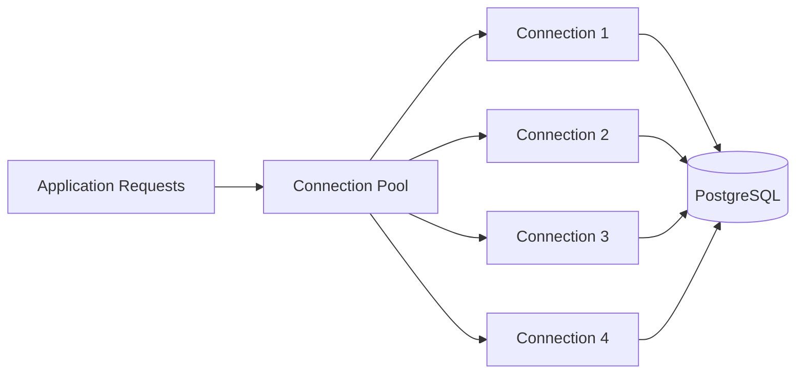
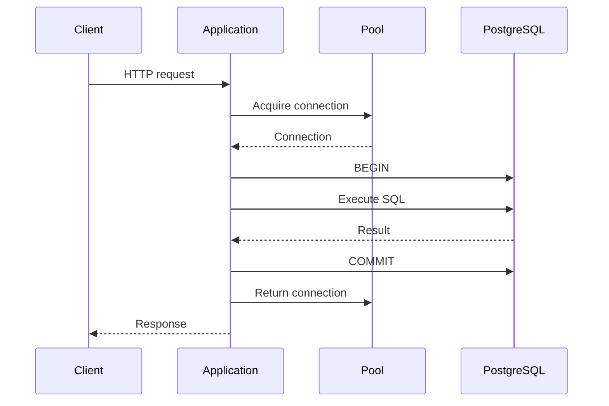
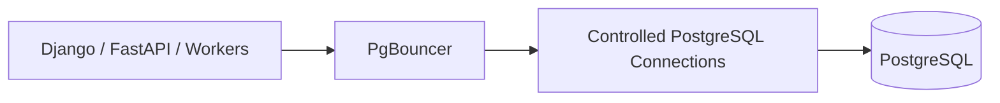
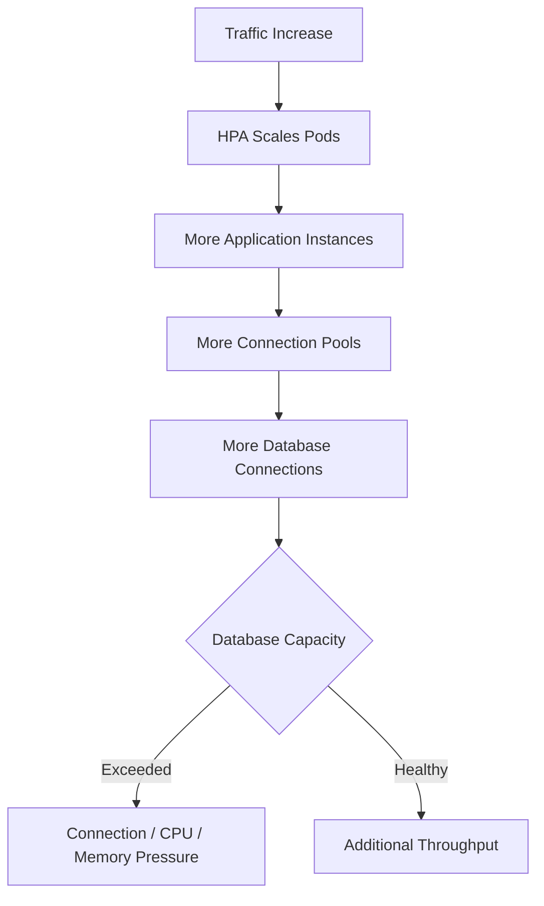
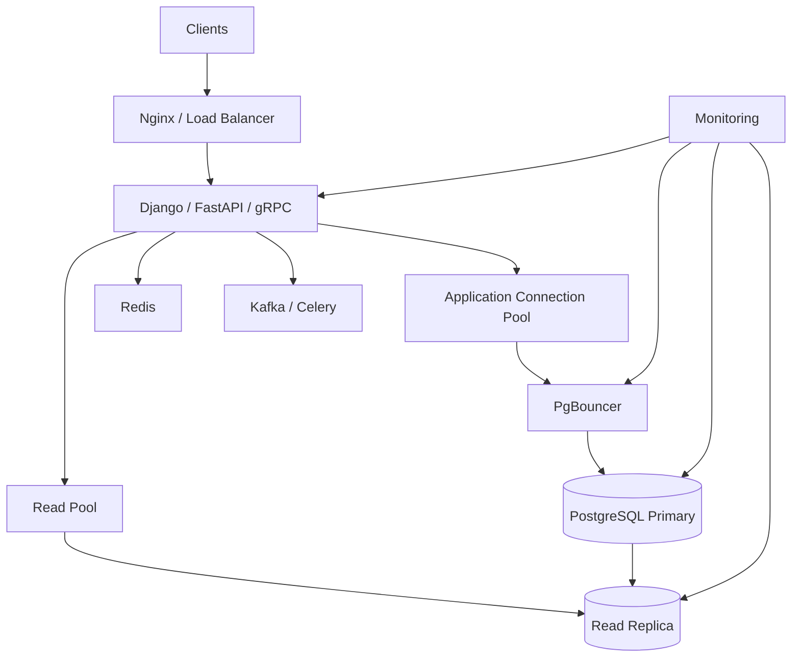
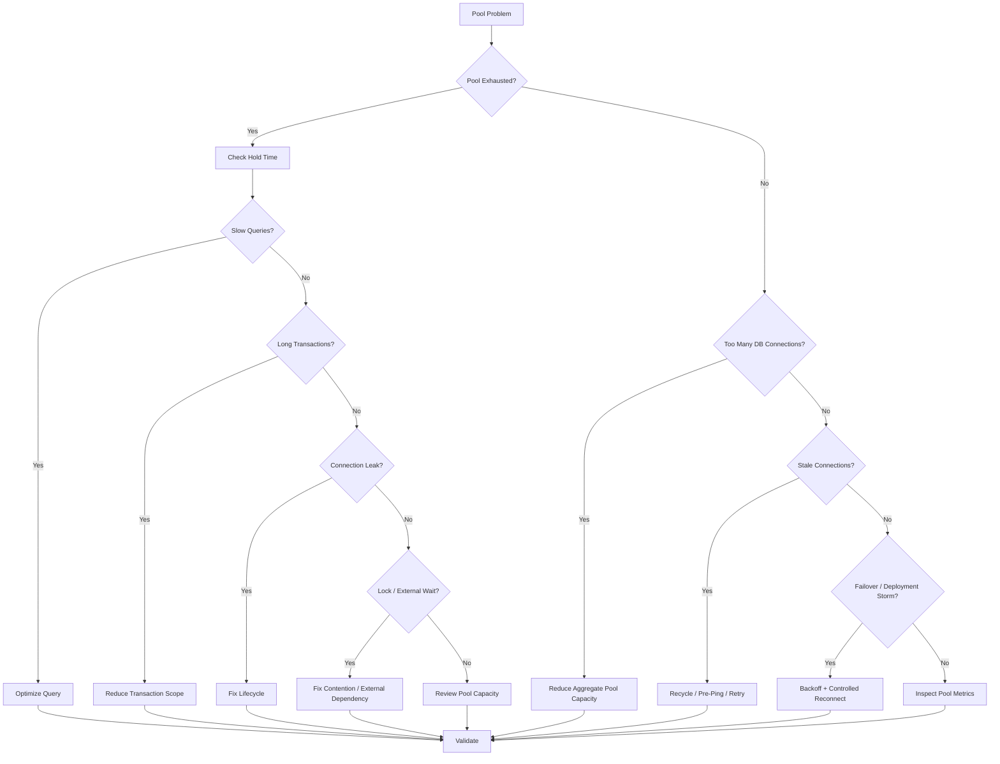

# 23- Connection Pool Problems

## Overview

Connection pooling controls how application requests share database connections. In production backend systems, connection pools are not merely a performance optimization; they are a **database concurrency control mechanism**.

A connection pool sits between application code and the database:

```text
HTTP / gRPC requests
        ↓
Application workers
        ↓
Connection Pool
        ↓
PostgreSQL
```

Without appropriate pooling:

```text
request
   ↓
open database connection
   ↓
authenticate / establish session
   ↓
execute query
   ↓
close connection
```

With pooling:

```text
request
   ↓
borrow connection
   ↓
execute transaction
   ↓
return connection
```

Pooling reduces connection establishment overhead, but it introduces its own failure modes:

- Pool exhaustion.
- Too many database connections.
- Connection leaks.
- Long-held connections.
- Stale connections.
- Idle-in-transaction sessions.
- Pool fragmentation across pods.
- Connection storms after deployment.
- Replica/primary pool imbalance.
- Database failover interactions.
- Incorrect session-state handling.

The most important production principle is:

> **The pool limits application concurrency against the database; it does not create database capacity.**

---

## What Is a Connection Pool?

A connection pool maintains a reusable set of database connections.

Conceptually:



Instead of creating a new database connection for every request, the application borrows an existing connection.

### Why Pooling Exists

Creating a database connection can involve:

```text
TCP connection
    ↓
TLS negotiation
    ↓
authentication
    ↓
PostgreSQL session initialization
    ↓
application/session configuration
```

Repeating this for every request is expensive.

Pooling provides:

- Connection reuse.
- Lower connection setup overhead.
- Controlled database concurrency.
- Better throughput for typical OLTP workloads.
- Protection against uncontrolled connection creation.

---

## Connection Lifecycle

A typical pooled request follows:



The important boundary is:

```text
connection acquired
        ↓
transaction/work performed
        ↓
connection returned
```

A connection should not remain checked out while the application performs unrelated work.

---

## Pool States

A useful conceptual model is:

| State | Meaning |
|---|---|
| Available | Ready to be borrowed |
| In use | Currently owned by an application operation |
| Waiting | Request is waiting for a connection |
| Broken | Connection failed health checks or encountered failure |
| Closing | Being removed from the pool |
| Creating | Pool is establishing a new connection |

The exact states and APIs depend on the pool implementation.

---

## Pool Exhaustion

Pool exhaustion occurs when all available connections are in use and additional requests must wait.

Example:

```text
pool size = 20

20 requests
    ↓
20 connections acquired

request 21
    ↓
waits for connection
```

If the first 20 requests hold connections for too long:

```text
pool wait time ↑
    ↓
application latency ↑
    ↓
request timeouts
```

Pool exhaustion is often a **symptom of slow database work, long transactions, excessive concurrency, or connection leaks**.

---

## Pool Exhaustion Is Not the Same as Database Overload

These are related but different.

### Pool Exhaustion

```text
application
    ↓
pool has no available connections
```

### Database Connection Saturation

```text
PostgreSQL
    ↓
too many backend connections
```

### Database CPU Saturation

```text
PostgreSQL
    ↓
connections execute too much work
    ↓
CPU saturated
```

A production incident may contain all three:

```text
slow queries
    ↓
connections held longer
    ↓
pool exhausted
    ↓
requests wait
    ↓
retries
    ↓
more database pressure
```

---

## Connection Pool Sizing

Pool size should be based on:

```text
database capacity
+
query latency
+
application concurrency
+
number of application instances
```

Suppose:

```text
40 Kubernetes pods
pool size = 10
```

Then the possible database connection count is:

```text
40 × 10 = 400
```

If the database supports only a much smaller safe concurrency level, this configuration is dangerous.

The important calculation is:

```text
aggregate pool capacity
=
pool size per instance
×
number of instances
```

---

## Pool Size Is a Fleet-Level Setting

A common mistake is configuring each service independently:

```text
service A → 20 connections
service B → 20 connections
service C → 20 connections
```

while forgetting that:

```text
20 + 20 + 20 = 60
```

connections reach the same database.

In Kubernetes:

```text
pods
×
pool size
```

should be considered during capacity planning.

---

## Database Connection Budget

A useful production practice is to define a connection budget.

For example:

```text
PostgreSQL connection capacity
        ↓
reserve capacity for:
    administration
    monitoring
    migrations
    failover
        ↓
remaining capacity
        ↓
allocated across services
```

Example:

```text
max_connections = 300

reserved operational capacity = 30

application budget = 270
```

The application budget can then be divided intentionally across services.

Do not simply configure every service with:

```text
pool_size = 50
```

until PostgreSQL reaches its connection limit.

---

## PostgreSQL `max_connections`

`max_connections` limits the number of concurrent PostgreSQL connections.

Inspect it:

```sql
SHOW max_connections;
```

Current connections:

```sql
SELECT count(*)
FROM pg_stat_activity;
```

Break them down:

```sql
SELECT
    application_name,
    usename,
    state,
    count(*)
FROM pg_stat_activity
GROUP BY application_name, usename, state
ORDER BY count(*) DESC;
```

Increasing `max_connections` is not automatically a solution.

More connections can increase:

- Memory consumption.
- CPU contention.
- Context switching.
- Lock contention.
- Query concurrency.
- Tail latency.

---

## Connection Pool vs Query Concurrency

A pool effectively controls how many database operations can execute concurrently.

For example:

```text
pool = 20

100 incoming requests
        ↓
20 database operations
80 requests waiting
```

This can be healthier than:

```text
pool = 100

100 database operations
        ↓
database CPU saturation
        ↓
all queries become slower
```

The larger pool can therefore produce **lower overall system performance**.

---

## Queueing Effects

When the database becomes saturated:

```text
query execution time ↑
        ↓
connection hold time ↑
        ↓
pool wait time ↑
        ↓
request latency ↑
```

This creates queueing.

A simplified relationship is:

```text
concurrency ≈ throughput × latency
```

If latency increases while throughput remains constant, more concurrent connections may be occupied.

This is one reason a slow database can quickly exhaust an otherwise correctly sized pool.

---

## Connection Acquisition Timeout

Pools should normally have a bounded wait time.

For example:

```text
request
  ↓
acquire connection
  ↓
wait 5 seconds
  ↓
no connection available
  ↓
fail fast
```

Without a bound:

```text
pool wait
    ↓
request hangs
    ↓
application worker remains occupied
    ↓
more requests queue
```

The exact timeout should be consistent with the application's request deadline.

---

## Different Timeout Layers

Do not confuse:

| Timeout | Controls |
|---|---|
| Pool acquisition timeout | Waiting for an available connection |
| Connection timeout | Establishing a database connection |
| `statement_timeout` | Maximum statement execution time |
| `lock_timeout` | Waiting to acquire a lock |
| Application request timeout | Overall request deadline |
| Load balancer timeout | Network/request lifecycle |

A robust system has a deliberate timeout hierarchy.

---

## Connection Leaks

A connection leak occurs when application code acquires a connection and fails to return it.

Typical causes:

- Missing context manager.
- Exception path skips release.
- Unclosed transaction.
- Manually managed connections.
- Incorrect async resource handling.
- Framework integration bugs.

Conceptually:

```text
request 1 → acquire → never release
request 2 → acquire → never release
request 3 → acquire → never release
...
```

Eventually:

```text
pool exhausted
```

---

## Safe Connection Management

Use framework-supported lifecycle management.

For SQLAlchemy:

```python
from sqlalchemy import create_engine, text

engine = create_engine(
    "postgresql+psycopg://user:password@db:5432/app",
    pool_size=10,
    max_overflow=5,
    pool_timeout=10,
    pool_pre_ping=True,
)

with engine.connect() as connection:
    result = connection.execute(
        text("SELECT id FROM users WHERE id = :id"),
        {"id": 123},
    )
```

The context manager ensures the connection is returned to the pool.

---

## SQLAlchemy Pool Parameters

A typical synchronous configuration might include:

```python
engine = create_engine(
    DATABASE_URL,
    pool_size=10,
    max_overflow=5,
    pool_timeout=10,
    pool_recycle=1800,
    pool_pre_ping=True,
)
```

Important settings:

| Setting | Purpose |
|---|---|
| `pool_size` | Persistent pooled connections |
| `max_overflow` | Additional temporary connections |
| `pool_timeout` | Maximum wait for a pool connection |
| `pool_recycle` | Recycle connections after configured age |
| `pool_pre_ping` | Validate a connection before use |

Exact behavior depends on the SQLAlchemy pool configuration and deployment environment.

---

## `max_overflow` Can Surprise You

Suppose:

```text
pool_size = 10
max_overflow = 20
```

The application may temporarily establish up to:

```text
30 connections
```

for that pool.

Across:

```text
40 pods
```

that can become:

```text
40 × 30 = 1,200
```

possible connections.

Always calculate the **maximum aggregate connection demand**, not just `pool_size`.

---

## Django Persistent Connections

Django supports persistent database connections through:

```python
DATABASES = {
    "default": {
        "ENGINE": "django.db.backends.postgresql",
        "NAME": "app",
        "USER": "app_runtime",
        "PASSWORD": "...",
        "HOST": "db",
        "PORT": "5432",
        "CONN_MAX_AGE": 60,
    }
}
```

`CONN_MAX_AGE` controls how long connections can be reused.

It is important to understand:

> Django's `CONN_MAX_AGE` is connection persistence, not a general-purpose configurable pool-size setting.

Large Django deployments may use an external pooler where appropriate.

---

## PgBouncer

PgBouncer provides external PostgreSQL connection pooling.

Architecture:



It can be particularly useful when:

```text
many application clients
+
relatively small safe database connection count
```

are required.

---

## Session Pooling

In session pooling:

```text
client
    ↓
gets PostgreSQL connection
    ↓
keeps it for session lifetime
    ↓
disconnects
```

Advantages:

- Strong session compatibility.
- Session state remains attached to the connection.

Limitations:

- Less efficient connection multiplexing.
- More PostgreSQL backend connections.

---

## Transaction Pooling

In transaction pooling:

```text
client
    ↓
transaction begins
    ↓
connection assigned
    ↓
transaction ends
    ↓
connection returned
```

This can dramatically reduce the number of PostgreSQL server connections.

However, it can break applications relying on connection/session state such as:

- Temporary tables.
- Session variables.
- Session-level advisory locks.
- Certain prepared-statement behaviors.
- Connection-local settings.

Use transaction pooling only after verifying application and driver compatibility.

---

## Statement Pooling

Statement pooling assigns connections at the individual statement level.

This provides aggressive multiplexing but imposes even stronger restrictions.

Most modern applications should not assume statement pooling is transparent.

Use it only when the application's SQL/session semantics are explicitly compatible.

---

## Stale Connections

Connections can become unusable because of:

- Database restart.
- Network failure.
- Load balancer changes.
- Firewall timeout.
- Failover.
- Database maintenance.
- Idle connection timeout.

The pool may still contain a connection object that is no longer valid.

This can produce:

```text
application
    ↓
borrow stale connection
    ↓
query fails
```

---

## `pool_pre_ping`

For SQLAlchemy:

```python
engine = create_engine(
    DATABASE_URL,
    pool_pre_ping=True,
)
```

The pool checks whether a connection is usable before handing it to the application.

This can improve resilience against stale connections.

It does not eliminate every connection failure because failures can still occur after the health check.

Applications still need appropriate error handling and transaction retry semantics.

---

## Connection Recycling

Long-lived connections can be recycled periodically:

```python
engine = create_engine(
    DATABASE_URL,
    pool_recycle=1800,
)
```

This can help with infrastructure that terminates long-lived idle connections.

Recycling is not a replacement for proper failure handling.

---

## Database Failover and Pools

Consider:

```text
Application
    ↓
Primary
    ↓ failure
Replica promoted
```

Existing connections may still point to the old primary or may become invalid.

A production system should ensure:

```text
connection failure
    ↓
discard invalid connection
    ↓
resolve current database endpoint
    ↓
establish new connection
    ↓
retry only when transaction semantics allow
```

Do not blindly retry every failed database operation.

---

## Stable Database Endpoints

Applications should generally connect through a stable endpoint that can move during failover.

For example:

```text
Application
    ↓
database endpoint
    ↓
current primary
```

rather than hard-coding:

```text
specific database node IP
```

This reduces failover coupling.

AWS-managed database services commonly provide endpoints designed for this purpose.

---

## Connection Failure During a Transaction

The most dangerous case is:

```text
BEGIN
UPDATE ...
COMMIT
```

where the connection fails around the commit boundary.

The client may not know whether the transaction committed.

This is an **uncertain outcome**.

Therefore:

```text
connection failure
≠
safe automatic retry
```

Use idempotency and business-level transaction design when retries are required.

---

## Connection Pool Problems During Failover

A failover can create a connection storm:

```text
database fails
    ↓
existing connections fail
    ↓
many application requests retry
    ↓
all pools create new connections
    ↓
new primary receives connection storm
```

Mitigate with:

- Bounded retries.
- Exponential backoff.
- Jitter.
- Connection creation limits.
- Stable endpoints.
- Health checks.
- Controlled application startup.

---

## Deployment Connection Storms

Rolling deployments can temporarily double application capacity.

Example:

```text
old pods = 50
new pods = 50
```

If each pod maintains:

```text
10 connections
```

the database may temporarily see:

```text
100 × 10 = 1,000 connections
```

even though normal operation requires only:

```text
50 × 10 = 500
```

Deployment capacity must therefore be included in connection planning.

---

## Kubernetes Autoscaling

Autoscaling can create the same problem.



The HPA target should account for database capacity.

Scaling application pods without database-aware limits can turn a traffic spike into a database outage.

---

## Pool Fragmentation

A pool is local to a process or pooling layer.

Suppose:

```text
10 pods
pool size = 10
```

You effectively have:

```text
10 separate pools
```

not one global pool of 100 connections.

This creates fragmentation:

```text
pod A → 10 connections
pod B → 2 connections
pod C → 10 connections
...
```

The aggregate behavior depends on traffic distribution.

External pooling can provide a more centralized connection management layer.

---

## Async Applications

Async frameworks introduce additional considerations.

For example:

```text
FastAPI
    ↓
async database driver
    ↓
async connection pool
```

A connection should not be held while awaiting unrelated work.

Bad lifecycle:

```text
acquire DB connection
    ↓
call external HTTP service
    ↓
wait 2 seconds
    ↓
database connection remains occupied
```

Better:

```text
perform external work
    ↓
acquire connection
    ↓
short database transaction
    ↓
release connection
```

This increases effective pool capacity.

---

## Connection Pool and Transaction Scope

A transaction should generally be:

```text
short
focused
deterministic
```

Avoid:

```text
BEGIN
    ↓
database query
    ↓
HTTP request
    ↓
Kafka publish
    ↓
external API
    ↓
COMMIT
```

This holds a database connection while external systems are unavailable.

Prefer patterns such as:

```text
database transaction
    ↓
state change + outbox event
    ↓
commit
    ↓
asynchronous event delivery
```

---

## Idle in Transaction

One of the most important connection problems is:

```text
idle in transaction
```

Inspect:

```sql
SELECT
    pid,
    usename,
    application_name,
    state,
    xact_start,
    now() - xact_start AS transaction_age,
    query
FROM pg_stat_activity
WHERE state = 'idle in transaction'
ORDER BY xact_start;
```

These sessions can:

- Hold resources.
- Keep snapshots open.
- Delay cleanup.
- Increase bloat.
- Consume pool capacity.

Investigate transaction boundaries in the application.

---

## Connection Leaks in Background Workers

Celery workers are especially important because they are long-lived processes.

Potential problem:

```text
worker
    ↓
opens connection
    ↓
task fails
    ↓
connection not properly cleaned up
    ↓
repeated tasks
    ↓
resource accumulation
```

Use framework-supported database connection lifecycle management and explicitly verify behavior for long-running workers.

---

## Connection Pools and Kafka Consumers

Kafka consumers can have long process lifetimes and high concurrency.

Consider:

```text
100 consumer instances
×
10 connections
=
1,000 connections
```

This can be problematic even if API traffic is low.

Database concurrency should be designed together with:

```text
consumer concurrency
partition count
batch size
commit strategy
database capacity
```

---

## Connection Pools and gRPC

gRPC services often maintain long-lived processes and high concurrency.

A single gRPC process may handle many simultaneous requests.

This does not mean the database pool should be equally large.

Instead:

```text
gRPC concurrency
    ↓
bounded database concurrency
    ↓
controlled PostgreSQL workload
```

Use application-level backpressure when database capacity is lower than request concurrency.

---

## Primary and Replica Pools

Applications using read replicas may maintain separate pools:

```text
Write pool
    ↓
Primary

Read pool
    ↓
Replica
```

This prevents read-heavy traffic from consuming all primary connections.

However, separate pools can create new problems:

```text
read pool too large
    ↓
replica overloaded
```

or:

```text
write pool too small
    ↓
write latency increases
```

Pool sizing should follow workload allocation.

---

## Read-After-Write and Pool Routing

A common architecture is:

```text
POST /orders
    ↓
primary

GET /orders/123
    ↓
replica
```

If replication is asynchronous, the read may not immediately observe the write.

Possible solutions include:

- Route the read to the primary for a consistency window.
- Use session/request consistency state.
- Use LSN-aware routing.
- Accept eventual consistency explicitly.

Connection pooling does not solve replication consistency.

---

## Connection Pool Metrics

Track:

```text
pool size
active connections
idle connections
waiting requests
acquisition latency
connection creation rate
connection failures
connection lifetime
```

These metrics should be available per:

```text
service
instance
database
pool
primary/replica
```

---

## PostgreSQL Connection Metrics

Useful diagnostics include:

```sql
SELECT
    state,
    count(*)
FROM pg_stat_activity
GROUP BY state;
```

Application-level breakdown:

```sql
SELECT
    application_name,
    state,
    count(*)
FROM pg_stat_activity
GROUP BY application_name, state
ORDER BY count(*) DESC;
```

Long-running sessions:

```sql
SELECT
    pid,
    application_name,
    state,
    query_start,
    now() - query_start AS duration,
    query
FROM pg_stat_activity
WHERE state <> 'idle'
ORDER BY query_start;
```

---

## Connection States Worth Monitoring

| State | Operational meaning |
|---|---|
| `active` | Executing work |
| `idle` | Available but connected |
| `idle in transaction` | Transaction open without active query |
| `idle in transaction (aborted)` | Transaction failed and remains open |
| `disabled` | Session activity state requiring investigation |

The exact states visible depend on PostgreSQL session lifecycle.

---

## Detecting Pool Exhaustion

Application metrics should show:

```text
pool wait time
pool timeout count
active connection count
idle connection count
```

A typical pattern:

```text
pool active = 20/20
pool waiters = 100
database query latency = high
```

This suggests connections are being held too long.

Do not immediately increase the pool.

First determine why the connections are occupied.

---

## Detecting Connection Leaks

Look for:

```text
connection count continuously increasing
+
stable traffic
+
stable pool configuration
```

Also inspect:

```text
connection age
idle sessions
idle-in-transaction sessions
application instance restarts
```

A leak may occur in:

- Application code.
- Worker lifecycle.
- Driver integration.
- Error handling.
- Transaction management.

---

## Slow Queries Cause Pool Problems

Consider:

```text
normal query = 20 ms
pool size = 20
```

The pool may handle high throughput.

Now a query regression produces:

```text
query = 2 seconds
```

Connections remain occupied 100× longer.

The same pool now supports far fewer operations.

Therefore:

> **Pool exhaustion is often downstream of query latency.**

Fixing the underlying query can be more effective than increasing pool size.

---

## Lock Contention Causes Pool Problems

Similarly:

```text
query waiting for lock
    ↓
connection remains occupied
    ↓
pool capacity decreases
```

Inspect:

```sql
SELECT
    pid,
    wait_event_type,
    wait_event,
    query_start,
    query
FROM pg_stat_activity
WHERE state = 'active';
```

A connection pool can expose a database locking problem as an application timeout problem.

---

## Network Problems Cause Pool Problems

If network latency increases:

```text
database round trip ↑
    ↓
connection hold time ↑
    ↓
pool availability ↓
```

The database itself may have normal CPU and I/O.

Always distinguish:

```text
database execution time
```

from:

```text
connection/network/request time
```

---

## Connection Pool and Memory

Every PostgreSQL connection consumes resources.

More connections generally mean:

```text
more backend processes
+
more session memory
+
more concurrent query memory
```

Therefore pool configuration directly affects the memory architecture discussed in database memory troubleshooting.

A large pool can contribute to:

```text
memory pressure
+
CPU pressure
+
lock contention
```

---

## Pool Exhaustion and Retry Storms

A dangerous pattern is:

```text
pool exhausted
    ↓
request timeout
    ↓
retry
    ↓
new request tries pool
    ↓
pool still exhausted
    ↓
more retries
```

This creates additional application pressure without increasing database capacity.

Use:

```text
bounded retries
+
exponential backoff
+
jitter
+
request deadlines
```

---

## Pool Exhaustion and Backpressure

Backpressure intentionally prevents unlimited work from entering the database.

Example:

```text
1,000 incoming requests
        ↓
pool = 50
        ↓
50 database operations
        ↓
remaining work waits or fails quickly
```

This may be preferable to:

```text
1,000 database operations
        ↓
database saturation
        ↓
all requests become slow
```

Controlled rejection can be healthier than uncontrolled queue growth.

---

## Pool Configuration Anti-Pattern

Avoid configurations such as:

```text
pool_size = 100
max_overflow = 100
```

across many application pods without calculating aggregate capacity.

For example:

```text
30 pods
×
200 possible connections
=
6,000 connections
```

This can overwhelm PostgreSQL before the application reaches its intended traffic capacity.

---

## Pooling Architecture for Microservices

A shared PostgreSQL cluster might serve:

```text
orders service
payments service
users service
reporting service
workers
admin tools
```

Each can create its own pool.

Therefore:

```text
per-service pool sizing
```

must be coordinated against:

```text
database-wide connection budget
```

A noisy service should not be able to consume every database connection.

---

## PgBouncer as a Capacity Boundary

A useful architecture is:

```text
                 ┌── Service A
                 │
Clients ─────────┼── Service B
                 │
                 └── Workers
                       ↓
                  PgBouncer
                       ↓
              Controlled connections
                       ↓
                  PostgreSQL
```

This allows many logical client connections to share fewer PostgreSQL server connections when the workload and session semantics permit.

---

## Connection Pool and Security

Database credentials should not be embedded directly in application source code.

Use:

```text
AWS Secrets Manager
AWS IAM / workload identity where supported
Kubernetes secrets with appropriate controls
environment-specific secret injection
```

Connection pools also retain authenticated sessions, so credential rotation must account for existing connections.

A robust rotation process should consider:

```text
new credentials available
    ↓
new connections use new credential
    ↓
old connections naturally drain
    ↓
old credential revoked
```

Exact implementation depends on the database authentication mechanism and pooling architecture.

---

## Session State and Security

Session state becomes especially important with pooling.

For multi-tenant systems using PostgreSQL RLS, an application might use:

```sql
SET LOCAL app.tenant_id = 'tenant-123';
```

inside a transaction.

The context must be:

```text
validated
+
transaction-scoped
+
reset automatically with transaction end
```

Do not leave tenant context attached to a reusable connection.

Otherwise:

```text
request A → tenant A
connection returned
request B → tenant B
```

can create serious isolation risks if session state is incorrectly reused.

---

## Resetting Connection State

Pooled connections may retain session state unless the pooling layer/framework resets it.

Potential state includes:

- Session parameters.
- Temporary objects.
- Prepared statements.
- Role changes.
- Search path.
- Advisory locks.
- Application-specific settings.

Applications should use pool-supported reset behavior and avoid relying on undocumented connection state.

---

## `SET LOCAL` vs `SET`

For transaction-scoped state:

```sql
SET LOCAL app.tenant_id = 'tenant-123';
```

is often safer than:

```sql
SET app.tenant_id = 'tenant-123';
```

because `SET LOCAL` lasts only for the current transaction.

This is particularly useful with pooled connections.

---

## Connection Pool and Transactions

A connection should normally be returned only when its transaction state is clean.

Bad state:

```text
connection returned
    ↓
transaction still open
```

This can cause:

- Pool contamination.
- Lock retention.
- Snapshot retention.
- Unexpected behavior for the next request.

Frameworks and drivers should manage transaction cleanup, but application code must use them correctly.

---

## Broken Transactions

If a transaction fails:

```text
BEGIN
UPDATE ...
ERROR
```

PostgreSQL places the transaction into an aborted state until it is rolled back.

A pooled connection must not be reused by another request while remaining in this state.

The application/driver must ensure:

```text
failed transaction
    ↓
ROLLBACK
    ↓
connection clean
    ↓
return to pool
```

---

## Connection Pool During Database Restart

When PostgreSQL restarts:

```text
existing connections fail
```

A healthy application should:

```text
detect connection failure
    ↓
discard broken connection
    ↓
wait/backoff
    ↓
create replacement connection
```

Avoid aggressive reconnect loops.

Otherwise:

```text
database restarting
    ↓
thousands of reconnect attempts
    ↓
connection storm
```

---

## Operational Recovery Strategy

During database failure:

1. Stop or reduce unnecessary database traffic.
2. Prevent aggressive retries.
3. Allow the database to become healthy.
4. Re-establish connections gradually.
5. Validate application health.
6. Restore normal traffic.
7. Monitor connection and query load.

This is especially important after failover.

---

## Health Checks

Database health checks should be carefully designed.

A Kubernetes readiness check that opens a new database connection on every probe can itself create unnecessary load.

Avoid:

```text
every second
×
every pod
×
new database connection
```

Prefer appropriate connection reuse or lightweight health checks while ensuring the check actually represents application readiness.

---

## Pooling During CI/CD

Deployment systems should consider:

```text
old pods
+
new pods
+
migration jobs
+
management commands
```

all potentially connecting to PostgreSQL simultaneously.

Migration jobs should use appropriate credentials and connection limits.

Avoid deployment procedures that unintentionally create a large temporary connection spike.

---

## Production Troubleshooting Workflow

When connection pool problems occur:

### Confirm Application Symptoms

Check:

```text
request latency
timeouts
pool acquisition latency
pool timeout errors
connection creation failures
```

### Inspect PostgreSQL

Run:

```sql
SELECT
    application_name,
    usename,
    state,
    count(*)
FROM pg_stat_activity
GROUP BY application_name, usename, state
ORDER BY count(*) DESC;
```

### Identify Long-Held Connections

Inspect:

```text
query duration
transaction duration
idle-in-transaction sessions
lock waits
```

### Check Query Performance

Use:

```text
pg_stat_statements
EXPLAIN
EXPLAIN (ANALYZE, BUFFERS)
```

where appropriate.

### Check Fleet Scaling

Calculate:

```text
pods × pool capacity
```

including:

```text
pool_size
+
max_overflow
```

where applicable.

### Check External Infrastructure

Investigate:

```text
PgBouncer
network
load balancer
database failover
cloud maintenance
```

---

## Diagnostic Query Set

### Connection Count

```sql
SELECT count(*)
FROM pg_stat_activity;
```

### Connections by Application

```sql
SELECT
    application_name,
    count(*)
FROM pg_stat_activity
GROUP BY application_name
ORDER BY count(*) DESC;
```

### Connections by State

```sql
SELECT
    state,
    count(*)
FROM pg_stat_activity
GROUP BY state
ORDER BY count(*) DESC;
```

### Long Transactions

```sql
SELECT
    pid,
    application_name,
    usename,
    xact_start,
    now() - xact_start AS transaction_age,
    state,
    query
FROM pg_stat_activity
WHERE xact_start IS NOT NULL
ORDER BY xact_start;
```

### Active Queries

```sql
SELECT
    pid,
    application_name,
    query_start,
    now() - query_start AS duration,
    wait_event_type,
    wait_event,
    query
FROM pg_stat_activity
WHERE state = 'active'
ORDER BY query_start;
```

---

## Common Connection Pool Failure Modes

| Failure | Typical symptom | Primary investigation |
|---|---|---|
| Pool exhaustion | Requests wait for connections | Query/transaction duration |
| Connection leak | Connections steadily accumulate | Application lifecycle |
| Too-large pool | DB overload | Aggregate pool capacity |
| Too-small pool | High pool wait time | Throughput vs DB capacity |
| Stale connections | Intermittent connection errors | Network/failover/lifetime |
| Idle in transaction | Long transactions | Application transaction scope |
| Retry storm | Connection spike | Retry policy |
| Pod scaling | Connection explosion | Fleet-level pool calculation |
| Slow query | Pool saturation | Execution plan |
| Lock contention | Connections occupied waiting | `pg_stat_activity` / locks |
| Failover storm | Reconnect spike | Endpoint/retry strategy |
| Session-state leakage | Incorrect behavior/security | Pool reset/session semantics |

---

## Common Mistakes

### Setting Pool Size Per Pod Without Fleet Calculation

```text
pool = 20
pods = 50
```

means:

```text
1,000 possible connections
```

**Better approach:** calculate aggregate connection capacity.

### Increasing the Pool When It Is Exhausted

Pool exhaustion often means queries are holding connections too long.

**Better approach:** inspect query latency, locks, transactions, and connection leaks first.

### Treating `max_connections` as a Performance Setting

More database connections do not automatically produce more throughput.

**Better approach:** establish a connection budget and use pooling.

### Holding Connections During External Calls

```text
DB connection
    ↓
HTTP request
    ↓
Kafka call
    ↓
external service
```

wastes scarce database concurrency.

**Better approach:** keep transactions short and move external work outside them.

### Ignoring `idle in transaction`

These sessions can consume pool capacity and interfere with MVCC cleanup.

**Better approach:** monitor transaction age and fix transaction boundaries.

### Using Huge `max_overflow`

Temporary overflow connections can become permanent database overload when multiplied across pods.

**Better approach:** calculate worst-case aggregate connections.

### Ignoring Kubernetes Autoscaling

More pods mean more pools.

**Better approach:** make database connection capacity part of autoscaling design.

### Retrying Every Connection Error

Some failures occur around transaction commit and have uncertain outcomes.

**Better approach:** retry only when semantics permit and use idempotency.

### Using Transaction Pooling Without Checking Session State

Applications may depend on connection-local state.

**Better approach:** verify compatibility with PgBouncer transaction pooling.

### Ignoring Connection Recycling

Long-lived connections can become stale due to infrastructure timeouts.

**Better approach:** use appropriate health checks, recycling, and failure handling.

### Running Database Health Checks Too Frequently

Health probes can create significant connection churn at scale.

**Better approach:** design health checks as part of database capacity planning.

---

## Production Connection Pool Checklist

### Capacity

- [ ] Calculate aggregate connections across all pods.
- [ ] Include `max_overflow` or equivalent temporary capacity.
- [ ] Reserve database connections for operations.
- [ ] Account for deployment overlap.
- [ ] Account for background workers.
- [ ] Account for read and write pools separately.

### Application

- [ ] Connections are always released.
- [ ] Transactions are short.
- [ ] External calls do not hold database connections.
- [ ] Failed transactions are rolled back.
- [ ] Large operations use controlled concurrency.
- [ ] Async code manages connections correctly.

### PostgreSQL

- [ ] Monitor `pg_stat_activity`.
- [ ] Monitor connection count.
- [ ] Monitor `idle in transaction`.
- [ ] Monitor query latency.
- [ ] Monitor lock waits.
- [ ] Monitor database CPU and memory.

### Pool

- [ ] Pool acquisition timeout is configured.
- [ ] Connection creation is bounded.
- [ ] Stale connections are handled.
- [ ] Session state is reset appropriately.
- [ ] Pool metrics are exposed.
- [ ] Pool behavior is tested during database failure.

### Reliability

- [ ] Retry policies are bounded.
- [ ] Exponential backoff is used.
- [ ] Jitter is used for synchronized failures.
- [ ] Database endpoints support failover.
- [ ] Connection storms are considered.
- [ ] Failover behavior is tested.

---

## Production Architecture

A robust backend architecture might look like:



The architecture provides:

```text
bounded application concurrency
+
controlled PostgreSQL connections
+
read/write separation
+
background workload isolation
+
observability
```

The exact architecture depends on application semantics and scale.

---

## Senior-Level Connection Pool Reasoning

When a pool problem occurs, ask:

```text
How many logical clients exist?
How many application instances exist?
How many connections can each instance create?
How many connections can the database safely support?
How long does each request hold a connection?
Why is connection hold time increasing?
Are queries slow?
Are transactions long?
Are locks involved?
Are connections leaking?
Is a failover or deployment creating a connection storm?
```

A useful model is:

```text
Aggregate DB connections
    =
    application instances
    ×
    maximum connections per instance
```

and:

```text
Connection occupancy
    =
    query / transaction concurrency
    ×
    connection hold duration
```

This explains why:

```text
slow queries
```

can create:

```text
pool exhaustion
```

without any change to the pool configuration.

---

## Connection Pool Decision Framework



---

## Cost and Scalability

Connection pools influence infrastructure cost indirectly.

An oversized pool can require:

```text
larger database instances
+
more memory
+
more CPU
```

An undersized pool can require:

```text
more application replicas
+
higher request latency
+
more worker capacity
```

The goal is not maximum connections.

The goal is:

```text
maximum useful throughput
within safe database concurrency
```

---

## High Availability and Disaster Recovery

Pool configuration must be tested during:

```text
primary failure
replica promotion
network partition
database restart
planned maintenance
application deployment
```

Verify that:

```text
old connections fail cleanly
+
new connections resolve the correct endpoint
+
reconnects are bounded
+
transactions are not blindly retried
+
application readiness recovers
```

A database failover test that ignores connection pools is incomplete.

---

## Operational Best Practices

- Treat connection pools as concurrency controls.
- Calculate connection capacity across the entire application fleet.
- Keep transactions short.
- Never hold database connections during unnecessary external work.
- Monitor pool acquisition latency.
- Monitor PostgreSQL connection state.
- Investigate `idle in transaction`.
- Use bounded pool acquisition timeouts.
- Handle stale connections.
- Use appropriate connection recycling.
- Test database failover with realistic application concurrency.
- Control reconnect storms with backoff and jitter.
- Avoid blindly increasing `max_connections`.
- Avoid oversized pools in Kubernetes.
- Include deployment and autoscaling behavior in capacity planning.
- Verify PgBouncer compatibility before using transaction or statement pooling.
- Keep tenant/session context transaction-scoped when using pooled connections.
- Make database capacity a first-class dependency of application autoscaling.

---

## Interview Traps

### Does a Larger Connection Pool Improve Performance?

Not necessarily. Once the database reaches its useful concurrency limit, additional connections can increase contention, CPU, memory usage, and latency.

### What Causes Pool Exhaustion?

Common causes include:

```text
slow queries
long transactions
lock waits
connection leaks
external calls while holding connections
insufficient pool size
```

### Should You Increase the Pool When It Is Exhausted?

Not automatically. First determine why existing connections are occupied.

### How Do You Calculate Database Connection Demand?

At a basic level:

```text
application instances
×
maximum connections per instance
```

Include overflow connections and background workers where applicable.

### Why Can Kubernetes Scaling Break a Healthy Database?

Every new pod can create another connection pool. Application autoscaling can therefore multiply database connections faster than database capacity.

### What Is the Difference Between Pool Exhaustion and Database Saturation?

Pool exhaustion means application requests cannot acquire connections. Database saturation means PostgreSQL itself is constrained by CPU, memory, I/O, locks, or other resources. One can cause the other.

### Why Are Long Transactions Dangerous?

They keep connections occupied longer and can retain locks and MVCC snapshots, reducing pool capacity and potentially causing broader database contention.

### Why Is `idle in transaction` Important?

The connection is still associated with an open transaction even though it is not actively executing a query. This can consume pool capacity and delay database cleanup.

### Why Can PgBouncer Help?

It can multiplex many logical client connections onto fewer PostgreSQL server connections, reducing PostgreSQL backend-process overhead when the application's session semantics permit it.

### What Is the Main Risk of Transaction Pooling?

Connection-local state cannot be assumed to persist between transactions because the next transaction may use a different PostgreSQL server connection.

### Why Are Retries Dangerous During Failover?

Many clients can reconnect simultaneously, producing a connection storm against the recovering or newly promoted database.

### What Is the Senior-Level Way to Diagnose Pool Problems?

Trace the complete path:

```text
request
    ↓
pool acquisition
    ↓
connection hold time
    ↓
transaction
    ↓
query execution / lock wait
    ↓
connection release
```

Then determine whether the bottleneck is **pool capacity, query performance, transaction scope, database capacity, application concurrency, or failure recovery behavior**.

## Key Takeaways

- **Connection pools are concurrency controls, not database capacity multipliers:** increasing pool size can worsen CPU, memory, lock contention, and latency once PostgreSQL is saturated.
- **Pool exhaustion is often a downstream symptom:** slow queries, long transactions, lock waits, connection leaks, and external calls can hold connections long enough to exhaust a healthy-looking pool.
- **Always calculate connection capacity across the fleet:** Kubernetes pods, Celery workers, Kafka consumers, read/write pools, `max_overflow`, deployments, and autoscaling can multiply database connections dramatically.
- **Design for failure as well as steady state:** stale connections, failover, deployment overlap, and retry storms require bounded reconnects, backoff, jitter, stable endpoints, and correct transaction semantics.
- **Keep pooled connections clean and short-lived:** release connections reliably, roll back failed transactions, avoid `idle in transaction`, reset session state, and use transaction-scoped context such as `SET LOCAL` where appropriate.