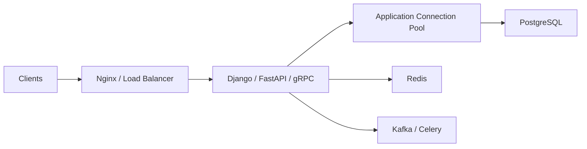
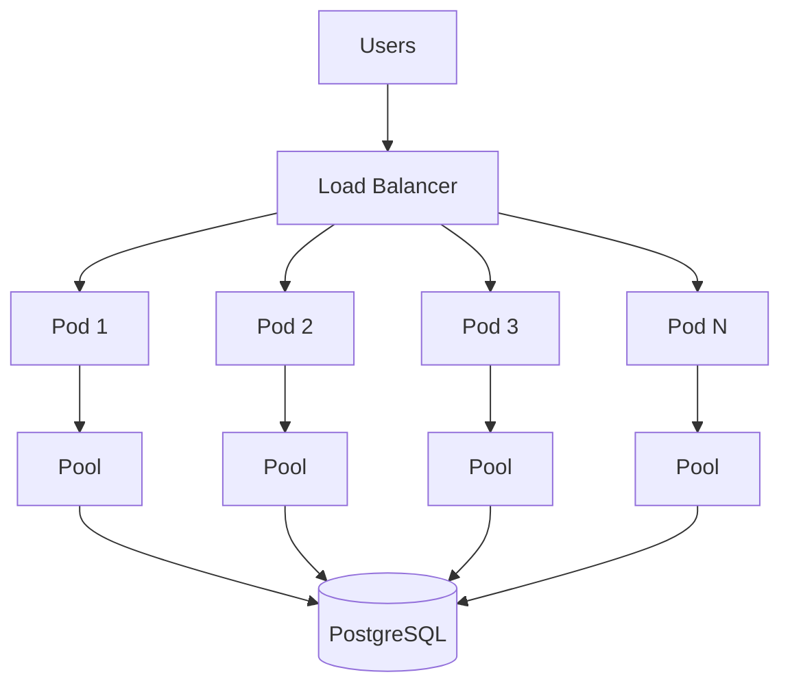
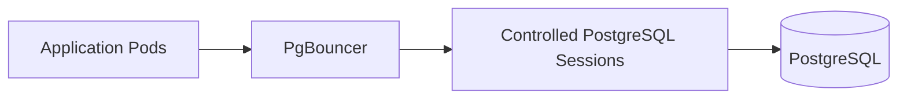
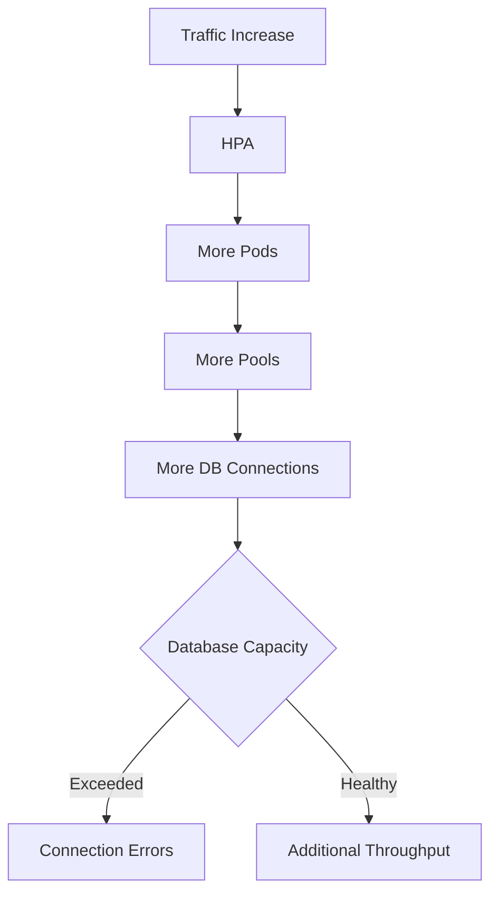
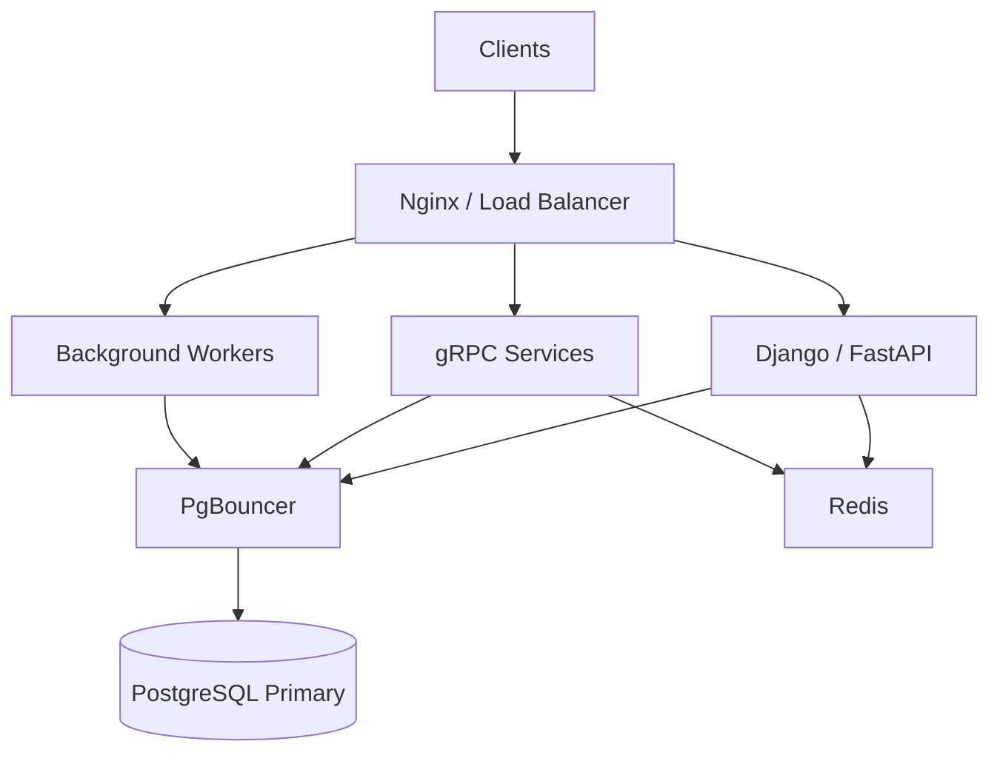
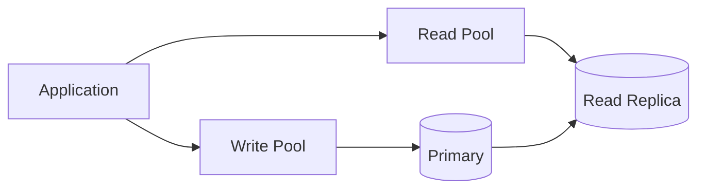
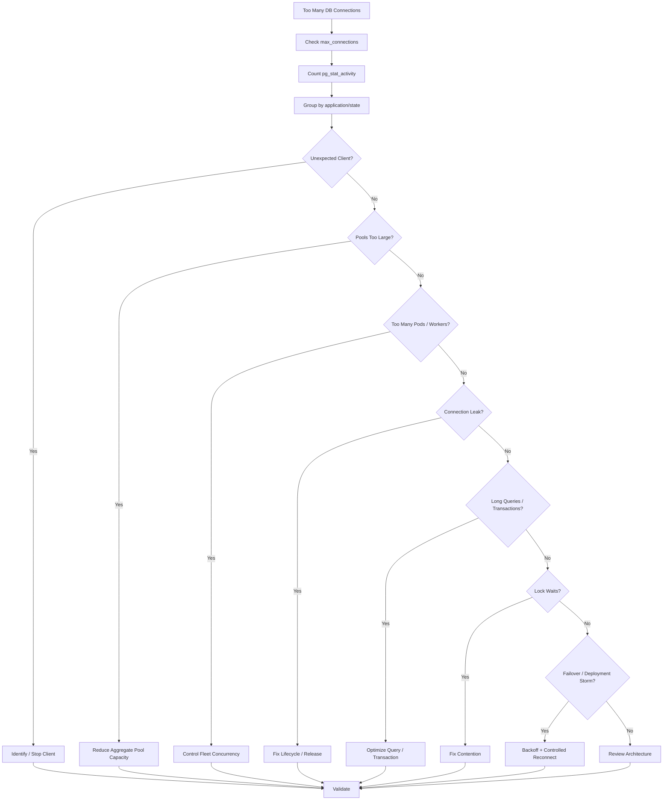

# 24- Too Many Database Connections

## Overview

Too many database connections is a common production failure mode in backend systems using PostgreSQL.

The problem usually appears as:

```text
Application traffic
    ↓
More application instances
    ↓
More connection pools
    ↓
More PostgreSQL connections
    ↓
Database connection limit reached
    ↓
New connections fail
    ↓
Requests wait or fail
    ↓
Retries increase load
```

The database may fail even when application CPU and memory look healthy.

The key principle is:

> **Database connections are a finite shared resource, and application scaling can multiply connection demand unexpectedly.**

Too many connections can cause:

- `too many connections` errors.
- Connection pool exhaustion.
- Increased PostgreSQL memory usage.
- Higher CPU consumption.
- Context-switching overhead.
- Increased lock contention.
- Higher query latency.
- Connection storms during deployments or failover.
- Cascading application failures.

The solution is rarely just:

```text
increase max_connections
```

A production solution requires understanding:

```text
connection demand
+
pool configuration
+
application fleet size
+
database capacity
+
query concurrency
+
failure behavior
```

---

## What Is a Database Connection?

A database connection is a client-to-database session through which SQL operations are executed.

A simplified lifecycle is:

```text
Application
    ↓
TCP connection
    ↓
TLS negotiation if enabled
    ↓
Authentication
    ↓
PostgreSQL session
    ↓
SQL execution
    ↓
Transaction
    ↓
Connection reuse or close
```

PostgreSQL uses a process-based architecture where client connections are associated with PostgreSQL backend processes.

Therefore, increasing connections has real resource costs.

---

## Why Connection Limits Exist

A database cannot safely support unlimited concurrent sessions.

Every connection can consume:

```text
backend process resources
+
session state
+
memory
+
CPU scheduling
+
transaction state
+
potential query memory
```

A connection limit provides a hard boundary against uncontrolled resource consumption.

Inspect:

```sql
SHOW max_connections;
```

Current connections:

```sql
SELECT count(*)
FROM pg_stat_activity;
```

---

## Connection Architecture

A typical backend architecture looks like:



With many application instances:



The important detail is that each application instance may maintain its own pool.

---

## The Fleet-Level Connection Calculation

Suppose:

```text
20 Kubernetes pods
pool size = 10
```

Then:

```text
20 × 10 = 200 possible database connections
```

If autoscaling increases the deployment to:

```text
100 pods
```

the potential becomes:

```text
100 × 10 = 1,000 connections
```

The database does not care that each pod independently considers a pool of `10` to be reasonable.

The database sees:

```text
1,000 connections
```

This is one of the most common causes of connection exhaustion.

---

## Include Overflow Connections

Some pools can create connections beyond their steady-state pool size.

For example:

```python
engine = create_engine(
    DATABASE_URL,
    pool_size=10,
    max_overflow=5,
)
```

A pool may temporarily reach:

```text
10 + 5 = 15 connections
```

If there are:

```text
50 pods
```

the aggregate potential becomes:

```text
50 × 15 = 750 connections
```

Connection capacity calculations must include all possible connection sources.

---

## Connection Budget

A production database should have an explicit connection budget.

For example:

```text
PostgreSQL max_connections = 300

Operational reserve       = 30
Monitoring/admin reserve  = 10
Migration reserve         = 10
Application budget        = 250
```

Then divide the application budget across services:

```text
orders service      = 80
users service       = 50
payments service    = 50
reporting service   = 30
workers             = 40
```

The exact numbers depend on workload and architecture.

The important principle is:

> **Treat connections as a capacity budget shared by every database client.**

---

## Why `max_connections` Is Not a Scaling Strategy

Increasing:

```conf
max_connections = 500
```

may make connection errors disappear temporarily.

But it can also increase:

```text
PostgreSQL backend processes
+
memory consumption
+
query concurrency
+
CPU contention
+
lock contention
```

This can transform:

```text
connection limit problem
```

into:

```text
database performance problem
```

or even:

```text
database memory exhaustion
```

---

## Connection Limit vs Useful Concurrency

A database can technically accept:

```text
500 connections
```

without being able to efficiently execute:

```text
500 concurrent expensive queries
```

For CPU-bound workloads:

```text
more connections
    ↓
more concurrent work
    ↓
CPU saturation
    ↓
query latency increases
```

Therefore:

```text
max_connections
```

should not be confused with:

```text
optimal query concurrency
```

---

## Connection Pooling

Connection pooling allows many requests to reuse a smaller number of database connections.

Without pooling:

```text
request
    ↓
new connection
    ↓
query
    ↓
close
```

With pooling:

```text
request
    ↓
borrow connection
    ↓
query
    ↓
return connection
```

Pooling reduces connection setup overhead and provides a natural concurrency boundary.

---

## Pool Size vs Database Capacity

A pool should not be sized according to:

```text
number of HTTP requests
```

It should be sized according to:

```text
database capacity
+
query duration
+
workload concurrency
```

For example:

```text
10,000 HTTP requests
```

does not imply:

```text
10,000 database connections
```

If requests spend most of their time waiting on external services, only a small subset may need a database connection at a given moment.

---

## Pool Exhaustion

A pool is exhausted when all available connections are currently checked out.

Example:

```text
pool size = 20

20 requests
    ↓
20 connections acquired

request 21
    ↓
waits
```

If the first 20 requests are slow:

```text
connection hold time ↑
    ↓
pool availability ↓
    ↓
pool wait time ↑
```

Pool exhaustion is often caused by:

- Slow queries.
- Lock waits.
- Long transactions.
- Connection leaks.
- External calls inside transactions.
- Excessive application concurrency.

---

## Too Many Connections vs Pool Exhaustion

These are different failure modes.

| Problem | Meaning |
|---|---|
| Too many database connections | PostgreSQL is receiving more connections than intended |
| Pool exhaustion | Application pool has no available connection |
| Database CPU saturation | Existing connections are doing too much work |
| Connection leak | Connections are not being returned correctly |
| Connection storm | Many connections are created simultaneously |
| Stale connection | Existing connection is no longer usable |

One problem can cause another.

For example:

```text
slow query
    ↓
connection held longer
    ↓
pool exhaustion
    ↓
application retries
    ↓
more connections requested
    ↓
database connection pressure
```

---

## PostgreSQL Connection Diagnostics

Start with:

```sql
SELECT
    count(*)
FROM pg_stat_activity;
```

Then:

```sql
SELECT
    state,
    count(*)
FROM pg_stat_activity
GROUP BY state
ORDER BY count(*) DESC;
```

Break connections down by application:

```sql
SELECT
    application_name,
    usename,
    state,
    count(*)
FROM pg_stat_activity
GROUP BY application_name, usename, state
ORDER BY count(*) DESC;
```

This often reveals the source of unexpected connections immediately.

---

## Connections by Client Address

When application names are insufficient:

```sql
SELECT
    client_addr,
    application_name,
    usename,
    state,
    count(*)
FROM pg_stat_activity
GROUP BY client_addr, application_name, usename, state
ORDER BY count(*) DESC;
```

This can help identify:

- Unexpected hosts.
- Kubernetes workloads.
- Admin clients.
- Background workers.
- Monitoring tools.

---

## Active Connections

Inspect active queries:

```sql
SELECT
    pid,
    application_name,
    usename,
    client_addr,
    state,
    query_start,
    now() - query_start AS duration,
    wait_event_type,
    wait_event,
    query
FROM pg_stat_activity
WHERE state = 'active'
ORDER BY query_start;
```

Look for:

```text
long-running queries
lock waits
unexpected applications
high concurrency
```

---

## Idle Connections

Idle connections are not executing SQL, but they still represent PostgreSQL sessions.

Inspect:

```sql
SELECT
    application_name,
    state,
    count(*)
FROM pg_stat_activity
WHERE state = 'idle'
GROUP BY application_name, state
ORDER BY count(*) DESC;
```

A large idle population may indicate:

```text
oversized pools
too many application replicas
poor pool management
```

Idle connections are not automatically bad, but their aggregate count must fit within the database connection budget.

---

## `idle in transaction`

This state is more concerning.

Inspect:

```sql
SELECT
    pid,
    application_name,
    usename,
    xact_start,
    now() - xact_start AS transaction_age,
    state,
    query
FROM pg_stat_activity
WHERE state = 'idle in transaction'
ORDER BY xact_start;
```

Typical cause:

```text
BEGIN
    ↓
query
    ↓
application performs unrelated work
    ↓
transaction remains open
```

Consequences can include:

- Connection pool exhaustion.
- Long-lived snapshots.
- Delayed MVCC cleanup.
- Lock retention.
- Table/index bloat.
- Increased database resource usage.

---

## Connection Leaks

A connection leak occurs when an application fails to return a connection to the pool.

Typical lifecycle:

```text
request
    ↓
acquire connection
    ↓
exception
    ↓
release skipped
    ↓
connection remains checked out
```

Repeated failures eventually produce:

```text
pool exhausted
```

Look for:

```text
connection count increasing
+
stable traffic
+
stable application instance count
```

Connection leaks should be investigated in application lifecycle management and driver usage.

---

## Safe Connection Lifecycle

Use framework-supported resource management.

SQLAlchemy:

```python
from sqlalchemy import text

with engine.connect() as connection:
    result = connection.execute(
        text("SELECT id FROM users WHERE id = :id"),
        {"id": 123},
    )
```

The context manager returns the connection to the pool.

Avoid manually managing connections unless the lifecycle is explicitly controlled.

---

## Django Connection Management

Django manages database connections through its database backend.

Persistent connections can be configured with:

```python
DATABASES = {
    "default": {
        "ENGINE": "django.db.backends.postgresql",
        "NAME": "app",
        "USER": "app_runtime",
        "PASSWORD": "...",
        "HOST": "db",
        "PORT": "5432",
        "CONN_MAX_AGE": 60,
    }
}
```

`CONN_MAX_AGE` controls connection persistence.

It is important to distinguish this from a traditional pool:

> **`CONN_MAX_AGE` is not a maximum connection pool size.**

In large Django deployments, external pooling may be appropriate.

---

## FastAPI and SQLAlchemy

FastAPI applications commonly use SQLAlchemy or another database layer.

A production pool might look like:

```python
from sqlalchemy import create_engine

engine = create_engine(
    DATABASE_URL,
    pool_size=10,
    max_overflow=5,
    pool_timeout=10,
    pool_recycle=1800,
    pool_pre_ping=True,
)
```

The important part is not the exact numbers.

The important part is ensuring:

```text
pool_size
+
max_overflow
```

is compatible with:

```text
number of application instances
+
database connection budget
```

---

## Async Connection Pools

Async applications need the same capacity discipline.

Conceptually:

```text
many async requests
        ↓
bounded async DB pool
        ↓
controlled PostgreSQL concurrency
```

Do not create a new pool per request.

A pool should normally have application/process lifetime rather than request lifetime.

---

## Pool Per Process

With multiple worker processes:

```text
4 application workers
×
pool size 10
=
40 potential connections
```

This can surprise engineers who think:

```text
pool size = 10
```

means:

```text
10 connections total
```

The actual scope depends on where the pool is instantiated.

Always understand whether the pool is:

```text
per process
per pod
per host
or centralized
```

---

## Gunicorn and Database Connections

Suppose:

```text
8 Gunicorn workers
pool size = 10
```

If each worker owns its own pool:

```text
8 × 10 = 80 connections
```

Now deploy:

```text
20 pods
```

Potentially:

```text
20 × 8 × 10 = 1,600 connections
```

This is why process-level architecture must be included in connection calculations.

---

## Celery Workers

Celery can create database connections independently of the API.

For example:

```text
API pods
    +
Celery workers
    +
scheduled tasks
    +
management commands
```

all consume database connections.

A complete connection budget must include every client.

---

## Kafka Consumers

Kafka consumers can similarly create database connection pressure:

```text
Kafka partitions
    ↓
consumer concurrency
    ↓
database connections
```

If consumer concurrency increases from:

```text
20 → 100
```

database connections may increase proportionally.

Consumer concurrency should therefore be constrained by database capacity.

---

## Microservices and Shared Databases

Suppose several services share PostgreSQL:

```text
orders
payments
users
inventory
reporting
```

Each service may maintain its own pool.

The database sees:

```text
orders pool
+
payments pool
+
users pool
+
inventory pool
+
reporting pool
```

A service can therefore exhaust shared database connections even when its own configuration appears reasonable.

---

## Read and Write Pools

Applications using replicas may maintain separate pools:

```text
write pool
    ↓
primary

read pool
    ↓
replica
```

This can prevent read traffic from consuming the primary's entire connection budget.

But each pool must be sized independently.

For example:

```text
primary connection budget = 100
replica connection budget = 150
```

should reflect actual workload distribution.

---

## PgBouncer

PgBouncer can provide an additional pooling layer:



It is useful when:

```text
many client connections
+
fewer desired PostgreSQL backend connections
```

are required.

This is especially valuable in environments with:

- Many application processes.
- Large Kubernetes fleets.
- Short-lived connections.
- Serverless-style connection patterns.

---

## PgBouncer Session Pooling

Session pooling keeps a PostgreSQL connection assigned to a client session.

Advantages:

- Better compatibility with session state.
- Predictable connection-local behavior.

Limitation:

```text
client count
```

can still map closely to:

```text
PostgreSQL connection count
```

so multiplexing benefits are limited compared with transaction pooling.

---

## PgBouncer Transaction Pooling

Transaction pooling assigns a PostgreSQL connection for a transaction:

```text
BEGIN
    ↓
PostgreSQL connection assigned
    ↓
queries
    ↓
COMMIT
    ↓
connection returned
```

This allows many logical clients to share fewer PostgreSQL connections.

However, transaction pooling can conflict with session-specific features such as:

- Temporary tables.
- Session variables.
- Session-level advisory locks.
- Connection-local configuration.
- Certain prepared-statement behaviors.

Verify driver and application compatibility before enabling it.

---

## Connection Storms

A connection storm occurs when many clients create connections simultaneously.

Common triggers:

- Database restart.
- Failover.
- Kubernetes rollout.
- Autoscaling event.
- Network recovery.
- Application restart.
- Pool configuration change.

Example:

```text
Database restart
    ↓
all connections fail
    ↓
100 pods reconnect
    ↓
each pod creates 10 connections
    ↓
1,000 connection attempts
    ↓
database recovery becomes harder
```

Connection storms can prolong outages.

---

## Reconnect Backoff

Applications should avoid immediate infinite reconnect loops.

Use:

```text
connection failure
    ↓
wait
    ↓
retry
    ↓
exponential backoff
    ↓
jitter
```

This spreads connection creation over time.

The goal is:

```text
controlled recovery
```

rather than:

```text
synchronized reconnect storm
```

---

## Database Failover

During failover:

```text
primary
    ↓
failure
    ↓
replica promotion
    ↓
new primary
```

Existing connections may become invalid.

Applications should:

- Detect broken connections.
- Discard them.
- Resolve the correct database endpoint.
- Reconnect gradually.
- Avoid unbounded retries.
- Handle uncertain transaction outcomes correctly.

A connection failure near `COMMIT` can leave the client uncertain about whether the transaction committed.

---

## Deployment Connection Spikes

Rolling deployments can temporarily increase connection count.

Example:

```text
old pods = 50
new pods = 50

pool = 10
```

Potential connection demand:

```text
100 × 10 = 1,000
```

even if steady-state demand is:

```text
50 × 10 = 500
```

Deployment strategy must therefore be included in connection capacity planning.

---

## Kubernetes Autoscaling

HPA can create a connection explosion:



Do not allow:

```text
application autoscaling
```

to scale independently of:

```text
database capacity
```

Possible controls include:

- Maximum pod count.
- Smaller per-pod pools.
- PgBouncer.
- Queue-based backpressure.
- Database-aware scaling policies.

---

## Connection Limits and Serverless

Serverless workloads can be particularly problematic.

If many short-lived instances each create database connections:

```text
request burst
    ↓
many instances
    ↓
many connections
    ↓
database connection exhaustion
```

Connection pooling at the application process level may provide limited benefit because instances are short-lived.

External pooling or a database connectivity layer can be more appropriate depending on the architecture.

---

## Connection Pool Fragmentation

Suppose:

```text
10 pods
pool size = 10
```

You have:

```text
10 independent pools
```

not:

```text
one centralized pool of 100 connections
```

Traffic distribution can therefore leave:

```text
pod A → pool exhausted
pod B → pool mostly idle
```

while aggregate capacity remains available elsewhere.

Centralized pooling can reduce this fragmentation when appropriate.

---

## Long Transactions

A connection is often held for the duration of a transaction.

Therefore:

```text
transaction duration ↑
    ↓
connection hold time ↑
    ↓
effective pool capacity ↓
```

Avoid:

```text
BEGIN
    ↓
database query
    ↓
HTTP request
    ↓
external API
    ↓
Kafka operation
    ↓
COMMIT
```

Keep transaction scope focused on database work.

---

## Lock Waits

A connection waiting for a lock is still occupied.

Inspect:

```sql
SELECT
    pid,
    application_name,
    wait_event_type,
    wait_event,
    query_start,
    now() - query_start AS duration,
    query
FROM pg_stat_activity
WHERE state = 'active'
ORDER BY query_start;
```

If many connections are waiting on locks:

```text
connection count high
```

may be a symptom of:

```text
locking problem
```

rather than insufficient connection capacity.

---

## Slow Queries

Slow queries hold connections longer.

For example:

```text
query latency = 20 ms
pool = 20
```

may support high throughput.

If a query regression produces:

```text
query latency = 2 seconds
```

connections remain occupied much longer.

This can cause:

```text
pool exhaustion
```

without changing pool size.

Connection troubleshooting must therefore include query troubleshooting.

---

## Query Frequency

Too many connections can sometimes be caused by too much application concurrency.

But excessive query frequency can also increase connection occupancy.

Common causes:

- N+1 queries.
- Repeated polling.
- Duplicate queries.
- Cache misses.
- Retry storms.
- Background jobs.
- Overly aggressive consumers.

Use:

```text
pg_stat_statements
```

to identify workload patterns.

---

## Connection Pool and Memory

PostgreSQL connections consume memory.

A rough conceptual relationship is:

```text
connection count
    ×
per-connection/session overhead
```

plus:

```text
query-local memory
```

and:

```text
shared database memory
```

Therefore too many connections can contribute to memory pressure.

This is particularly dangerous when `work_mem` is also configured aggressively.

---

## Connection Pool and CPU

Too many connections can increase CPU consumption through:

```text
more concurrent queries
+
more scheduling
+
more context switching
+
more contention
```

The result can be:

```text
more connections
    ↓
less useful throughput
```

after the database reaches its optimal concurrency.

---

## Connection Pool and Locks

More concurrent transactions can increase lock contention.

Example:

```text
100 workers
    ↓
same hot row
    ↓
100 concurrent transactions
    ↓
lock contention
```

Reducing connection concurrency can sometimes improve throughput by reducing contention.

This is why connection limits can be a performance optimization, not merely a restriction.

---

## Connection Pool and Memory Settings

The interaction between:

```text
max_connections
+
work_mem
+
maintenance_work_mem
+
shared_buffers
```

must be considered.

For example:

```text
max_connections = very high
work_mem = very high
```

can create dangerous theoretical memory requirements under concurrent workloads.

Do not tune these settings independently.

---

## Too Many Connections Troubleshooting Workflow

### Confirm the Error

Look for errors such as:

```text
FATAL: sorry, too many clients already
```

or:

```text
remaining connection slots are reserved for non-replication superuser connections
```

The exact message depends on the PostgreSQL state and available reserved slots.

### Inspect Capacity

```sql
SHOW max_connections;
```

### Inspect Current Usage

```sql
SELECT count(*)
FROM pg_stat_activity;
```

### Identify Sources

```sql
SELECT
    application_name,
    usename,
    state,
    count(*)
FROM pg_stat_activity
GROUP BY application_name, usename, state
ORDER BY count(*) DESC;
```

### Identify Long-Lived Sessions

```sql
SELECT
    pid,
    application_name,
    state,
    backend_start,
    xact_start,
    query_start,
    query
FROM pg_stat_activity
ORDER BY backend_start;
```

### Inspect Pool Configuration

Calculate:

```text
pods
×
workers per pod
×
pool capacity
```

including overflow.

### Identify Why Connections Are Occupied

Check:

```text
slow queries
lock waits
long transactions
external calls
connection leaks
```

### Apply Controlled Mitigation

Depending on the cause:

```text
reduce application replicas
reduce pool size
reduce worker concurrency
stop runaway clients
fix connection leaks
cancel justified runaway queries
use PgBouncer
scale database capacity
```

---

## Emergency Mitigation

During a production incident, prioritize stabilization.

Possible actions:

- Stop an uncontrolled deployment.
- Roll back a deployment causing connection growth.
- Reduce Kubernetes replica count.
- Reduce worker concurrency.
- Temporarily disable a noisy background job.
- Reduce connection pool capacity for a problematic service.
- Terminate clearly identified abandoned sessions when justified.
- Introduce controlled backpressure.
- Increase database capacity if immediate headroom is required.

Avoid immediately changing:

```conf
max_connections
```

without understanding the memory and CPU consequences.

---

## Reserved Connection Slots

PostgreSQL can reserve connection capacity for privileged or replication-related access.

This is important during incidents because:

```text
application connections exhausted
```

does not necessarily mean:

```text
administrative access is impossible
```

Understand the configured reservation behavior before using all remaining capacity.

---

## Connection Cleanup

Do not routinely terminate idle connections simply because they are idle.

Idle connections can be valid pooled sessions.

Instead identify:

```text
abandoned sessions
+
idle-in-transaction sessions
+
unexpected clients
+
excessive pool sizing
```

The goal is to fix the source of excessive connections rather than repeatedly deleting symptoms.

---

## Connection Ownership

Every connection should have an identifiable owner.

Use PostgreSQL `application_name` where possible.

For example:

```text
orders-api
payments-api
celery-worker
reporting-service
migration-job
```

Then:

```sql
SELECT
    application_name,
    count(*)
FROM pg_stat_activity
GROUP BY application_name
ORDER BY count(*) DESC;
```

This dramatically improves incident response.

---

## Application Connection Naming

Drivers and frameworks can often configure an application name.

For PostgreSQL clients, use meaningful names such as:

```text
orders-api
```

instead of:

```text
python
```

This allows database operators to identify the source of connections quickly.

---

## Monitoring

Track connection metrics at multiple layers.

### Application

```text
pool size
active connections
idle connections
pool waiters
pool acquisition latency
connection failures
```

### PostgreSQL

```text
current connections
connections by application
connections by state
idle-in-transaction sessions
connection creation rate
```

### Infrastructure

```text
CPU
memory
network
pod count
container restarts
```

### Deployment

```text
pod creation rate
rolling update size
autoscaling events
migration jobs
```

---

## Connection Utilization

A useful application metric is:

```text
active connections / pool capacity
```

For example:

```text
18 / 20 = 90%
```

Sustained high utilization indicates limited connection headroom.

But low pool utilization does not prove the database has spare capacity because other clients may be consuming connections.

---

## Connection Acquisition Latency

Track:

```text
time waiting for a pool connection
```

Example:

```text
database query = 20 ms
pool acquisition = 800 ms
```

The application may report:

```text
slow database request
```

even though PostgreSQL query execution is fast.

This distinction is critical.

---

## Alerting

Useful alerts include:

```text
connection utilization > threshold
+
sustained duration
```

or:

```text
connection utilization increasing rapidly
```

Also alert on:

```text
pool timeout rate
idle-in-transaction duration
connection creation rate
unexpected application connection growth
```

Avoid relying solely on:

```text
current connections > 80%
```

without considering workload and reserved capacity.

---

## Production Architecture With PgBouncer

A common architecture is:



This can provide:

```text
many logical client sessions
        ↓
controlled PostgreSQL backend connections
```

when pooling semantics are compatible.

---

## Read Replica Architecture

For read-heavy systems:



This separates connection budgets for:

```text
writes
```

and:

```text
reads
```

However, read replicas introduce:

```text
replication lag
+
read-after-write considerations
```

Connection management does not eliminate those consistency concerns.

---

## Security Considerations

Too many connections can also represent a security problem.

Potential causes include:

- Compromised service creating connections.
- Connection exhaustion attacks.
- Unauthenticated public access attempts.
- Poorly restricted database networking.
- Shared credentials across many services.

Use:

```text
private networking
+
authentication
+
least-privilege roles
+
connection limits
+
rate limiting
+
monitoring
```

Do not expose PostgreSQL directly to the public internet unless there is an exceptional, explicitly secured architecture.

---

## Reliability Considerations

Connection exhaustion can cascade through the application:

```text
DB connections exhausted
    ↓
new requests cannot connect
    ↓
application errors
    ↓
retries
    ↓
more connection attempts
    ↓
database remains overloaded
```

This is why retry policy and connection capacity must be designed together.

---

## Disaster Recovery

After database failover:

```text
new primary
    ↓
application reconnects
    ↓
many clients reconnect simultaneously
```

DR testing should therefore include:

- Connection recovery.
- Pool behavior.
- Reconnect rate.
- Retry behavior.
- Application readiness.
- Database connection capacity.

A failover test without connection-storm testing is incomplete.

---

## Cost Considerations

An oversized connection architecture can increase infrastructure cost by requiring:

```text
larger PostgreSQL instances
+
more memory
+
higher CPU capacity
```

An undersized pool can increase:

```text
application replicas
+
request latency
+
worker count
```

The objective is not to maximize or minimize connections.

The objective is:

```text
controlled concurrency
+
efficient database utilization
+
sufficient headroom
```

---

## Production Best Practices

- Establish an explicit database connection budget.
- Calculate aggregate connections across every application and worker.
- Include Kubernetes pod count and process count.
- Include pool overflow capacity.
- Keep transactions short.
- Avoid holding connections during external calls.
- Monitor `pg_stat_activity`.
- Track connections by `application_name`.
- Monitor pool acquisition latency.
- Monitor `idle in transaction`.
- Use bounded pool acquisition timeouts.
- Handle stale connections.
- Use bounded reconnect retries with backoff and jitter.
- Include deployments and autoscaling in connection planning.
- Consider PgBouncer for high client-to-database connection ratios.
- Validate transaction-pooling compatibility before enabling it.
- Avoid blindly increasing `max_connections`.
- Include connection capacity in HA and DR testing.
- Make application autoscaling database-aware.
- Load-test connection behavior under realistic concurrency.

---

## Connection Capacity Planning Example

Suppose:

```text
PostgreSQL:
    max_connections = 300

Services:
    orders      = 20 pods
    payments    = 10 pods
    users       = 10 pods

Pool:
    size = 5
    overflow = 2
```

Maximum theoretical application connections:

```text
orders:
20 × (5 + 2) = 140

payments:
10 × (5 + 2) = 70

users:
10 × (5 + 2) = 70

Total:
280
```

This leaves only:

```text
300 - 280 = 20
```

connections for:

```text
administration
monitoring
migrations
unexpected clients
```

This design has very little safety margin.

A better architecture may reduce pool sizes, introduce external pooling, reserve more capacity, or constrain application scaling.

---

## Senior-Level Capacity Model

A useful model is:

```text
Maximum database connections
    =
    all application pools
    +
    background workers
    +
    administrative clients
    +
    monitoring
    +
    migration jobs
    +
    operational reserve
```

For each application instance:

```text
maximum pool capacity
    =
    pool size
    +
    overflow capacity
```

For each deployment:

```text
fleet connection capacity
    =
    instances
    ×
    per-instance capacity
```

For multi-process applications:

```text
fleet capacity
    =
    pods
    ×
    processes per pod
    ×
    pool capacity per process
```

This is the level of reasoning required for production capacity planning.

---

## Troubleshooting Decision Framework



---

## Common Mistakes

### Increasing `max_connections` Immediately

This can hide the symptom while increasing memory and CPU pressure.

**Better approach:** identify why connection demand increased.

### Configuring Pool Size Per Pod Without Fleet Calculation

```text
pool = 10
pods = 100
```

means:

```text
1,000 potential connections
```

**Better approach:** calculate aggregate capacity.

### Forgetting Worker Processes

A pool may exist per process.

```text
8 workers × 10 connections
```

is:

```text
80 connections
```

not `10`.

### Ignoring `max_overflow`

A pool configured as:

```text
pool_size = 10
max_overflow = 10
```

can reach:

```text
20 connections
```

per pool.

**Better approach:** include overflow in capacity planning.

### Treating Idle Connections as Automatically Bad

Idle pooled connections can be normal.

**Better approach:** distinguish healthy idle sessions from excessive pool sizing and `idle in transaction`.

### Ignoring Slow Queries

Slow queries hold connections longer.

**Better approach:** correlate connection occupancy with query latency.

### Holding Connections During External Calls

This reduces effective pool capacity.

**Better approach:** perform external operations outside database transactions when business semantics permit.

### Ignoring Kubernetes Autoscaling

More pods create more pools.

**Better approach:** make HPA limits database-aware.

### Ignoring Celery and Kafka

Background workers can consume significant database connection capacity.

**Better approach:** include every database client in the connection budget.

### Using Transaction Pooling Without Testing Session Semantics

Transaction pooling can break session-dependent behavior.

**Better approach:** verify temporary tables, session variables, advisory locks, prepared statements, and other connection-local features.

### Creating a Pool Per Request

This defeats pooling and can create connection storms.

**Better approach:** create pools at appropriate application/process lifetime.

### Retrying Aggressively During Database Failure

This can create a connection storm.

**Better approach:** use bounded exponential backoff and jitter.

### Assuming More Connections Mean More Throughput

After database saturation:

```text
more connections
    ↓
more contention
    ↓
higher latency
```

**Better approach:** identify optimal concurrency through measurement.

---

## Production Checklist

### Database

- [ ] `max_connections` is known.
- [ ] Reserved operational capacity is known.
- [ ] Current connections are monitored.
- [ ] Connections are grouped by application.
- [ ] `idle in transaction` is monitored.
- [ ] CPU and memory are monitored.

### Application

- [ ] Pool size is explicitly configured.
- [ ] Overflow capacity is understood.
- [ ] Pool scope is understood.
- [ ] Worker-process multiplication is understood.
- [ ] Connections are reliably returned.
- [ ] Transactions are short.
- [ ] External calls do not unnecessarily hold connections.

### Kubernetes

- [ ] Maximum pod count is known.
- [ ] Pods × processes × pool capacity is calculated.
- [ ] Rolling deployments are included.
- [ ] HPA behavior is database-aware.
- [ ] Background workers are included.

### Reliability

- [ ] Connection acquisition timeout exists.
- [ ] Reconnect behavior is bounded.
- [ ] Backoff and jitter are implemented.
- [ ] Database failover has been tested.
- [ ] Connection storms are part of failure testing.

### Operations

- [ ] `application_name` identifies clients.
- [ ] Pool metrics are available.
- [ ] PostgreSQL connection metrics are available.
- [ ] Query latency is correlated with connection usage.
- [ ] Alerts exist for connection exhaustion.
- [ ] Runbooks identify connection sources and mitigation steps.

---

## Interview Traps

### What Is the Main Cause of Too Many Database Connections?

There is no single cause. Common causes include oversized pools, too many application instances, worker concurrency, connection leaks, deployment spikes, failover reconnect storms, and long-held connections.

### Why Is Increasing `max_connections` Often a Bad Fix?

Because each connection consumes resources and permits more concurrent work. Increasing the limit can turn connection exhaustion into memory, CPU, or lock contention.

### How Do You Calculate Connection Demand in Kubernetes?

At a basic level:

```text
pods
×
processes per pod
×
maximum connections per process
```

where maximum connections include pool overflow if applicable.

### What Should You Check First?

Check:

```sql
SHOW max_connections;

SELECT
    application_name,
    state,
    count(*)
FROM pg_stat_activity
GROUP BY application_name, state;
```

Then determine which clients are consuming the connection budget.

### Why Can Slow Queries Cause Too Many Connections?

Slow queries hold connections for longer periods, reducing pool turnover and causing more requests to wait or attempt additional connections.

### Why Is `idle in transaction` Dangerous?

The connection remains occupied while a transaction stays open. It can also retain snapshots and interfere with MVCC cleanup.

### Why Can Kubernetes Autoscaling Cause a Database Outage?

Every additional pod may create another pool. Scaling from 20 to 100 pods can multiply database connection demand by five.

### How Does PgBouncer Help?

It can multiplex many client connections onto fewer PostgreSQL server connections, reducing PostgreSQL backend connection requirements when application session semantics permit.

### What Is the Difference Between Session and Transaction Pooling?

Session pooling keeps a database connection associated with a client session. Transaction pooling returns the server connection after each transaction, enabling greater multiplexing but restricting connection-local session state.

### Why Are Connection Storms Dangerous?

Many clients reconnect simultaneously after a restart or failover, consuming database resources precisely when the database is already recovering.

### What Is the Senior-Level Approach?

Treat connections as a finite fleet-wide resource:

```text
application concurrency
+
pool capacity
+
database capacity
+
query latency
+
worker concurrency
+
failure behavior
```

Then control concurrency and connection demand before increasing PostgreSQL limits.

## Key Takeaways

- **Database connections are a finite shared resource:** calculate the aggregate connection budget across pods, processes, pools, overflow connections, workers, migrations, and operational clients.
- **Do not treat `max_connections` as a scaling knob:** increasing it can convert connection exhaustion into memory pressure, CPU saturation, lock contention, and higher latency.
- **Connection exhaustion is often caused by another problem:** slow queries, long transactions, lock waits, leaks, excessive worker concurrency, autoscaling, and deployment/failover storms can all increase connection demand.
- **Connection pooling must be designed at fleet scale:** understand pool scope, process multiplication, Kubernetes autoscaling, PgBouncer behavior, and read/write pool separation.
- **Production systems need controlled recovery:** use bounded pool waits, connection cleanup, stable endpoints, exponential backoff, jitter, and database-aware autoscaling to prevent connection storms and cascading failures.