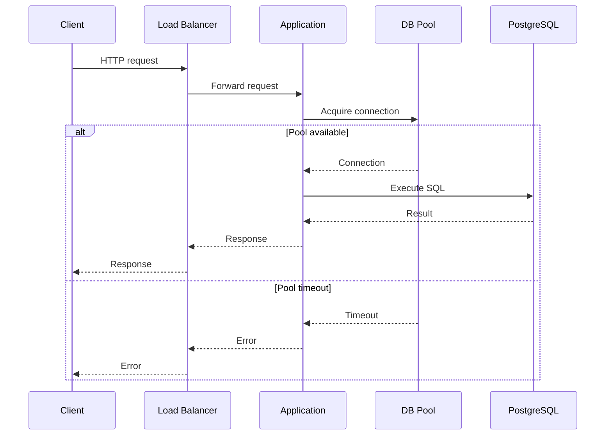
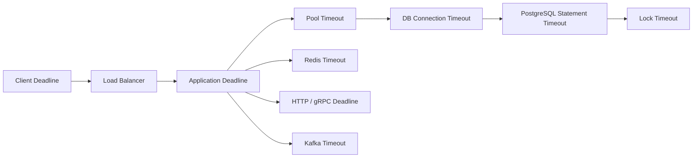
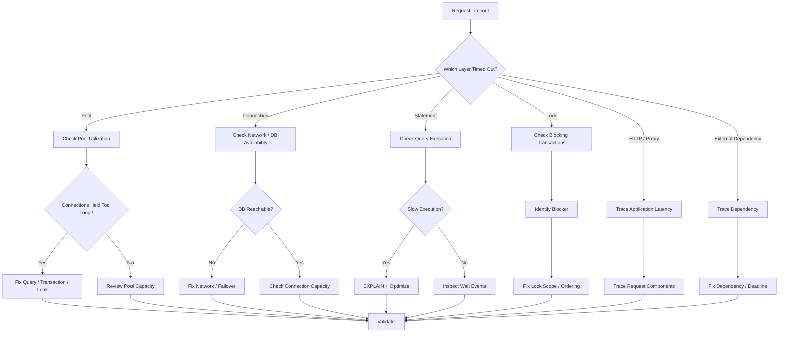

# 25- Timeout Troubleshooting

## Overview

Timeouts are one of the most common failure signals in production backend systems. A timeout does not identify the root cause; it only means that some operation did not complete within an allowed time budget.

A typical request may cross several timeout boundaries:

```text
Client
  ↓
Nginx / Load Balancer
  ↓
Django / FastAPI / gRPC
  ↓
Connection Pool
  ↓
PostgreSQL
  ↓
Storage / Network
```

A timeout can therefore originate from:

- Application request handling.
- Connection acquisition.
- Database connection establishment.
- SQL execution.
- Lock acquisition.
- Network communication.
- Load balancer or proxy limits.
- External service calls.
- Background job execution.

The central troubleshooting principle is:

> **Identify which timeout fired, then determine whether the request was waiting, executing, blocked, or disconnected.**

Increasing a timeout without understanding the bottleneck often converts a fast failure into a slow failure.

---

## Timeout vs Slow Operation

A slow operation and a timeout are related but different.

A slow query might take:

```text
2 seconds
```

while the configured timeout is:

```text
5 seconds
```

The query is slow but succeeds.

If the query takes:

```text
8 seconds
```

the timeout may terminate it.

The important distinction is:

```text
operation duration
```

versus:

```text
allowed duration
```

---

## Timeout Layers

A production request can have multiple timeout boundaries.

| Layer | Example timeout | What it controls |
|---|---:|---|
| Client | 30s | Overall client wait |
| Nginx | 60s | Upstream response |
| Load balancer | 60s | Connection/request lifecycle |
| Application | 30s | Request handling |
| Pool | 5s | Waiting for DB connection |
| DB connection | 5s | Establishing connection |
| PostgreSQL `statement_timeout` | 10s | Statement execution |
| PostgreSQL `lock_timeout` | 2s | Lock acquisition wait |
| External API | 5s | Outbound call |
| Celery task | 60s | Worker execution |

The exact values depend on the architecture.

A useful principle is:

```text
inner operation timeout
    <
request timeout
    <
client / infrastructure timeout
```

The ordering must be deliberate.

---

## Request Timeout Lifecycle

Consider:



The timeout could occur before PostgreSQL executes any SQL.

This is why database timeout troubleshooting must include the application and connection pool.

---

## The First Question: What Timed Out?

When investigating a timeout, determine:

```text
What component emitted the timeout?
When did it occur?
What operation was waiting?
What operation was executing?
How long had it been running?
```

For example:

```text
pool timeout
```

means:

```text
application could not acquire a connection
```

It does not necessarily mean:

```text
PostgreSQL query timed out
```

---

## Common Timeout Categories

### Connection Acquisition Timeout

The application waits for a pooled connection:

```text
request
  ↓
pool
  ↓
all connections busy
  ↓
wait
  ↓
timeout
```

Common causes:

- Slow queries.
- Long transactions.
- Lock waits.
- Connection leaks.
- Pool too small.

---

### Connection Establishment Timeout

The application cannot establish a database connection:

```text
application
    ↓
TCP / TLS / authentication
    ↓
database
```

Potential causes:

- Database unavailable.
- Network failure.
- Security group/firewall issue.
- DNS problem.
- TLS failure.
- Connection storm.
- Database connection exhaustion.

---

### Statement Timeout

PostgreSQL terminates a statement that exceeds `statement_timeout`.

Inspect:

```sql
SHOW statement_timeout;
```

Set it for a session:

```sql
SET statement_timeout = '10s';
```

This controls statement execution time, not pool acquisition.

---

### Lock Timeout

`lock_timeout` limits how long a statement waits to acquire a lock.

Inspect:

```sql
SHOW lock_timeout;
```

Example:

```sql
SET lock_timeout = '2s';
```

A lock timeout is fundamentally different from a slow query.

The query may not be executing expensive work at all; it may simply be waiting for another transaction.

---

## `statement_timeout` vs `lock_timeout`

| Setting | Purpose |
|---|---|
| `statement_timeout` | Maximum allowed statement execution time |
| `lock_timeout` | Maximum time waiting to acquire a lock |
| Pool timeout | Maximum wait for an application connection |
| Connection timeout | Maximum time establishing connection |

For example:

```text
Pool timeout
    ↓
no DB connection available
```

versus:

```text
Pool connection acquired
    ↓
SQL sent
    ↓
waiting for lock
    ↓
lock_timeout
```

versus:

```text
SQL executing
    ↓
expensive query
    ↓
statement_timeout
```

These require different fixes.

---

## PostgreSQL Timeout Diagnostics

Inspect active sessions:

```sql
SELECT
    pid,
    application_name,
    usename,
    state,
    query_start,
    now() - query_start AS duration,
    wait_event_type,
    wait_event,
    query
FROM pg_stat_activity
WHERE state = 'active'
ORDER BY query_start;
```

The `wait_event_type` and `wait_event` fields are particularly useful.

---

## Waiting vs Executing

A query can be:

```text
active
```

while actually waiting for:

- A lock.
- I/O.
- Another internal resource.
- Client communication.

Therefore:

```text
state = active
```

does not necessarily mean:

```text
CPU is actively executing SQL
```

Inspect wait information before concluding that the query is CPU-bound.

---

## Lock Timeout Investigation

Find blocking relationships:

```sql
SELECT
    blocked.pid AS blocked_pid,
    blocked.query AS blocked_query,
    blocking.pid AS blocking_pid,
    blocking.query AS blocking_query
FROM pg_stat_activity AS blocked
JOIN pg_stat_activity AS blocking
    ON blocking.pid = ANY(pg_blocking_pids(blocked.pid));
```

If many requests hit `lock_timeout`, investigate:

```text
blocking transaction
+
transaction duration
+
lock ordering
+
hot rows
+
DDL
```

---

## Long Transactions

A long transaction can cause several timeout symptoms.

```text
long transaction
    ↓
locks retained
    ↓
other queries wait
    ↓
connection occupancy increases
    ↓
pool exhaustion
    ↓
request timeouts
```

Inspect transaction age:

```sql
SELECT
    pid,
    application_name,
    usename,
    xact_start,
    now() - xact_start AS transaction_age,
    state,
    query
FROM pg_stat_activity
WHERE xact_start IS NOT NULL
ORDER BY xact_start;
```

---

## Idle in Transaction

A particularly dangerous state is:

```text
idle in transaction
```

Example:

```text
BEGIN
    ↓
SELECT ...
    ↓
application waits
    ↓
transaction remains open
```

The session is not actively executing SQL, but the transaction remains open.

Potential consequences:

- Locks remain held.
- MVCC snapshots remain active.
- Cleanup can be delayed.
- Connections remain occupied.
- Other requests may eventually time out.

---

## Slow Query Timeout

A query may genuinely require too much work.

Common causes:

- Missing index.
- Incorrect index.
- Poor join order.
- Cardinality estimation errors.
- Large sort.
- Hash spill.
- Excessive aggregation.
- Large result set.
- Data growth.
- Query regression.
- N+1 query pattern.

Investigate with:

```sql
EXPLAIN (ANALYZE, BUFFERS)
SELECT ...
```

Remember:

> `EXPLAIN ANALYZE` executes the statement.

Use extra care with modifying statements.

---

## Execution Plan Analysis

A timeout-producing query should be examined for:

```text
estimated rows vs actual rows
scan type
join algorithm
loops
sort/hash operations
buffer activity
temporary I/O
parallelism
```

For example:

```text
estimated rows = 10
actual rows = 1,000,000
```

can indicate a severe cardinality estimation problem.

That can lead the optimizer toward a poor execution plan.

---

## Timeout Caused by Missing Index

Consider:

```sql
SELECT id, status, created_at
FROM orders
WHERE customer_id = $1
ORDER BY created_at DESC
LIMIT 50;
```

If PostgreSQL must scan a huge portion of the table:

```text
large table scan
    ↓
high execution time
    ↓
statement timeout
```

A suitable index may reduce execution work:

```sql
CREATE INDEX orders_customer_created_idx
ON orders (customer_id, created_at DESC);
```

The correct index must be validated with the actual execution plan and workload.

---

## Timeout Caused by Wrong Index

An existing index does not guarantee a good plan.

Possible causes:

- Wrong column order.
- Low selectivity.
- Query predicates do not match the index.
- Type conversion prevents effective use.
- Partial-index predicate does not match.
- Statistics are stale or inaccurate.
- The planner correctly determines a sequential scan is cheaper.

Do not assume:

```text
query timed out
+
index exists
=
PostgreSQL ignored the index
```

---

## Connection Pool Timeout

A pool timeout may look like a database timeout from the application's perspective.

Example:

```text
pool size = 20

20 connections
    ↓
all occupied by slow queries
    ↓
request 21 waits
    ↓
pool timeout
```

The underlying cause is:

```text
connection hold time
```

not necessarily:

```text
connection establishment
```

---

## Connection Pool Diagnostic Model

Measure:

```text
pool acquisition time
+
connection hold time
+
SQL execution time
+
transaction duration
```

For example:

```text
pool wait       = 1.5s
query execution = 100ms
```

The problem is not query execution.

It is pool availability.

---

## Timeout Caused by Connection Leaks

A connection leak can produce:

```text
connection count ↑
    ↓
pool capacity ↓
    ↓
pool wait ↑
    ↓
timeout
```

Look for:

```text
connections continuously accumulating
+
stable traffic
+
unexpected pool utilization
```

Check:

```sql
SELECT
    application_name,
    state,
    count(*)
FROM pg_stat_activity
GROUP BY application_name, state
ORDER BY count(*) DESC;
```

---

## Timeout Caused by Too Many Connections

When PostgreSQL approaches its connection limit:

```text
new connection attempt
    ↓
connection refused
```

Check:

```sql
SHOW max_connections;
```

and:

```sql
SELECT count(*)
FROM pg_stat_activity;
```

Then identify connection sources.

```sql
SELECT
    application_name,
    usename,
    state,
    count(*)
FROM pg_stat_activity
GROUP BY application_name, usename, state
ORDER BY count(*) DESC;
```

---

## Network Timeout

A database query can execute successfully while the application still experiences a timeout.

For example:

```text
Application
    ↓
network
    ↓
PostgreSQL
```

Potential issues:

- Network latency.
- Packet loss.
- DNS delays.
- Firewall behavior.
- Load balancer timeout.
- TLS problems.
- Cross-region connectivity.

Separate:

```text
database execution time
```

from:

```text
network transfer time
```

and:

```text
application processing time
```

---

## Large Result Sets

A query may execute quickly but return millions of rows.

```text
PostgreSQL execution
    ↓
large result
    ↓
network transfer
    ↓
application deserialization
    ↓
response serialization
    ↓
timeout
```

For APIs, avoid returning unbounded result sets.

Prefer:

```sql
SELECT id, name, status
FROM customers
ORDER BY id
LIMIT 100;
```

For large exports, use asynchronous processing.

---

## Pagination and Timeouts

Offset pagination can become increasingly expensive:

```sql
SELECT id, created_at
FROM events
ORDER BY created_at DESC
LIMIT 100
OFFSET 1000000;
```

For large datasets, keyset pagination is often more efficient:

```sql
SELECT id, created_at
FROM events
WHERE created_at < $1
ORDER BY created_at DESC
LIMIT 100;
```

The exact keyset predicate should use a deterministic ordering, often including a unique tie-breaker.

---

## Timeout Caused by N+1 Queries

An API might execute:

```text
1 query for customers
+
1 query per customer
```

For 1,000 customers:

```text
1,001 queries
```

Even if every individual query is fast, aggregate latency can exceed the request timeout.

Use:

```text
select_related
prefetch_related
```

in Django where appropriate, or equivalent eager-loading strategies in other ORMs.

---

## Django Timeout Troubleshooting

A Django request can time out because of:

- Database pool/connection availability.
- Slow ORM-generated SQL.
- N+1 queries.
- Lock contention.
- External API calls.
- Serialization.
- Large querysets.
- Application worker saturation.

Inspect generated SQL and query count before changing timeout values.

For database-specific behavior, use PostgreSQL diagnostics directly.

---

## FastAPI Timeout Troubleshooting

FastAPI applications can encounter:

```text
request timeout
+
database timeout
+
pool timeout
+
external HTTP timeout
```

These should be measured separately.

For example:

```text
request total = 5s
DB pool wait  = 2s
DB execution  = 1s
external API  = 1.5s
serialization = 0.5s
```

Increasing the request timeout does not solve any of these individual bottlenecks.

---

## Async Timeout Problems

Async applications require careful timeout propagation.

Bad architecture:

```text
client timeout = 5s
application timeout = 30s
database timeout = 60s
```

The client can disconnect after 5 seconds while the backend continues executing work.

This wastes:

```text
application workers
+
database connections
+
database CPU
```

Timeouts should align with cancellation and request lifecycle.

---

## Timeout Propagation

A useful design is:

```text
Client deadline
    ↓
Load balancer deadline
    ↓
Application deadline
    ↓
Database statement deadline
    ↓
External service deadline
```

Inner operations should generally have less time than the parent request.

Example:

```text
request deadline       = 5s
DB pool acquisition    = 500ms
DB statement timeout   = 3s
external API timeout   = 2s
```

The exact values depend on workload.

---

## Timeout Budgets

A request has a finite latency budget.

For example:

```text
Total request budget = 2 seconds

DB = 800 ms
Redis = 100 ms
External API = 700 ms
Application = 300 ms
Network overhead = 100 ms
```

The individual budgets should add up to a realistic value.

Do not configure every dependency with:

```text
2 second timeout
```

because they could all independently consume the full request budget.

---

## Timeout Configuration Hierarchy

A typical hierarchy is:

```text
Client timeout
    >
Load balancer timeout
    >
Application request timeout
    >
Dependency timeout
    >
Database statement timeout
```

This is not an absolute rule for every architecture, but the relationship should be intentional.

A lower-level dependency should normally fail before the caller's overall deadline.

---

## External Service Timeouts

A backend request may depend on:

```text
PostgreSQL
Redis
Kafka
HTTP API
gRPC service
```

For each dependency, define:

```text
connect timeout
read timeout
overall operation deadline
```

Avoid indefinite waits.

---

## gRPC Deadlines

gRPC uses deadlines rather than relying solely on arbitrary server-side waits.

A request can carry a deadline through service boundaries:

```text
Service A
    ↓ deadline
Service B
    ↓ remaining deadline
Service C
```

This prevents downstream work from continuing indefinitely after the caller's useful deadline has expired.

---

## HTTP Timeout Layers

With:

```text
Client
 ↓
ALB / Nginx
 ↓
FastAPI
 ↓
PostgreSQL
```

a timeout at Nginx may produce a different error from a PostgreSQL `statement_timeout`.

Always identify the layer from:

```text
HTTP status
application logs
proxy logs
database logs
trace spans
```

---

## Cancellation

Timeouts should ideally cancel work that is no longer useful.

For example:

```text
client disconnects
    ↓
request cancellation
    ↓
application stops waiting
    ↓
database operation cancelled
```

Without cancellation:

```text
client gone
    ↓
database query continues
    ↓
connection remains occupied
    ↓
database work continues unnecessarily
```

Cancellation behavior depends on framework, driver, protocol, and infrastructure.

---

## PostgreSQL Query Cancellation

PostgreSQL supports cancellation of running queries.

Operationally, a DBA may use:

```sql
SELECT pg_cancel_backend(<pid>);
```

This requests cancellation of the current query.

For stronger termination:

```sql
SELECT pg_terminate_backend(<pid>);
```

Termination disconnects the session and should be used carefully.

Prefer understanding and fixing the root cause rather than repeatedly killing sessions.

---

## Timeout and Transactions

Suppose:

```text
BEGIN
UPDATE ...
query timeout
```

The transaction may now be in an aborted state.

The application must ensure:

```text
ROLLBACK
```

before the connection is returned to the pool.

A failed transaction should not contaminate a reusable connection.

---

## Serialization Failures and Timeouts

Not every retryable database failure is a timeout.

PostgreSQL can return serialization failures such as:

```text
SQLSTATE 40001
```

and deadlocks:

```text
SQLSTATE 40P01
```

These have different causes from:

```text
statement_timeout
```

Retry policies should distinguish failure classes.

---

## Retrying Timed-Out Queries

Blindly retrying a timed-out query can make the problem worse.

Example:

```text
slow query
    ↓
timeout
    ↓
retry
    ↓
same slow query
    ↓
timeout
    ↓
retry
```

This creates:

```text
more database work
```

while the database is already overloaded.

Use bounded retries only where the operation is safe and retryable.

---

## Idempotency and Timeout Recovery

A timeout does not always mean the database operation did not happen.

The dangerous boundary is:

```text
database COMMIT
    ↓
network failure
    ↓
client receives timeout
```

The client may not know whether the transaction committed.

For business operations, use idempotency keys or other deduplication mechanisms where appropriate.

---

## Timeout and Connection Pools

A timeout should release scarce resources promptly.

Bad:

```text
request timeout
    ↓
database operation continues
    ↓
connection remains occupied
```

Better:

```text
deadline exceeded
    ↓
cancel work where possible
    ↓
rollback if required
    ↓
release connection
```

This prevents one timed-out request from consuming resources long after the client has stopped waiting.

---

## Timeout and Redis

Redis operations can also introduce latency.

Potential causes:

- Large commands.
- Blocking operations.
- Network latency.
- Slow consumers.
- Connection pool exhaustion.
- Redis CPU saturation.

Do not assume:

```text
database timeout
```

means:

```text
PostgreSQL problem
```

Trace the entire request.

---

## Timeout and Kafka

Kafka-related operations can delay requests because of:

- Broker unavailability.
- Metadata delays.
- Producer retries.
- Consumer lag.
- Slow acknowledgements.

Avoid holding database transactions open while waiting for Kafka unless the architecture explicitly requires it.

Transactional outbox patterns can separate database state changes from asynchronous event delivery.

---

## Timeout and Celery

Background work should normally not inherit unlimited request lifetimes.

A request can enqueue:

```text
generate_report
```

and return:

```text
202 Accepted
```

while Celery performs the long-running operation asynchronously.

This avoids making the HTTP timeout budget responsible for long-running work.

---

## Long-Running Exports

A common anti-pattern is:

```text
GET /export
    ↓
query millions of rows
    ↓
generate CSV
    ↓
HTTP response
```

This can cause:

```text
request timeout
+
large database transaction
+
high memory usage
```

Prefer:

```text
POST /exports
    ↓
enqueue Celery task
    ↓
query in controlled batches
    ↓
write object storage
    ↓
return download reference
```

---

## Timeout and Database Replicas

Read replicas can introduce another latency dimension:

```text
application
    ↓
read replica
    ↓
replication lag
```

A replica query may also be delayed by:

- Long-running queries.
- Replay conflicts.
- Resource contention.
- Network latency.

Do not automatically route every slow read to a replica without diagnosing the cause.

---

## Timeout and Failover

During database failover:

```text
primary failure
    ↓
connections fail
    ↓
reconnect
    ↓
new primary
```

Timeouts may temporarily increase.

Aggressive retries can create:

```text
connection storm
+
query storm
```

Use bounded retries and backoff.

---

## Monitoring Timeout Rates

Monitor:

```text
timeout count
timeout rate
timeout latency
dependency
endpoint
database query
application instance
```

Do not monitor only:

```text
HTTP 504 count
```

because different timeout layers can produce different symptoms.

---

## Percentiles Matter

Track:

```text
p50
p95
p99
p99.9
```

Example:

```text
p50 = 100ms
p95 = 300ms
p99 = 4s
```

The average may still look healthy while a significant tail is timing out.

Timeout troubleshooting is therefore closely connected to tail-latency analysis.

---

## Correlation IDs

Use a request ID across:

```text
Nginx
    ↓
application
    ↓
database
    ↓
Kafka
    ↓
Celery
    ↓
external services
```

For example:

```text
request_id = req-8f72...
```

This makes it possible to correlate:

```text
HTTP timeout
+
pool wait
+
SQL execution
+
external dependency
```

---

## PostgreSQL `application_name`

Configure meaningful PostgreSQL application names:

```text
orders-api
payments-api
reporting-worker
```

Then:

```sql
SELECT
    application_name,
    state,
    count(*)
FROM pg_stat_activity
GROUP BY application_name, state
ORDER BY count(*) DESC;
```

This makes database-side timeout investigations much faster.

---

## Logging

Useful timeout logs should contain:

```text
request_id
endpoint
service
database
operation
timeout type
configured timeout
elapsed duration
database pid where available
retry attempt
dependency
```

Avoid logging:

- Passwords.
- Tokens.
- API keys.
- Sensitive query parameters.
- Sensitive customer data.

---

## Tracing

Distributed tracing can reveal:

```text
HTTP request
    ├── pool acquisition: 800ms
    ├── PostgreSQL query: 1.2s
    ├── Redis: 50ms
    └── external API: 900ms
```

This is significantly more useful than:

```text
request took 3 seconds
```

because it identifies where the latency budget was consumed.

---

## Timeout Troubleshooting Workflow

### Identify the Exact Timeout

Determine:

```text
client
proxy
application
pool
connection
database
lock
external dependency
```

### Measure End-to-End Latency

Break the request into:

```text
queueing
+
connection acquisition
+
database execution
+
lock waiting
+
network transfer
+
application processing
```

### Check Database Activity

Run:

```sql
SELECT
    pid,
    application_name,
    state,
    query_start,
    now() - query_start AS duration,
    wait_event_type,
    wait_event,
    query
FROM pg_stat_activity
WHERE state <> 'idle'
ORDER BY query_start;
```

### Check Locks

Inspect blocking relationships:

```sql
SELECT
    blocked.pid AS blocked_pid,
    blocking.pid AS blocking_pid,
    blocked.query AS blocked_query,
    blocking.query AS blocking_query
FROM pg_stat_activity AS blocked
JOIN pg_stat_activity AS blocking
    ON blocking.pid = ANY(pg_blocking_pids(blocked.pid));
```

### Check Pool Metrics

Look at:

```text
active
idle
waiting
acquisition latency
timeouts
connection creation failures
```

### Check Query Plans

For slow SQL:

```sql
EXPLAIN (ANALYZE, BUFFERS)
SELECT ...;
```

### Check Application Scaling

Calculate:

```text
pods
×
processes
×
pool capacity
```

### Check Dependencies

Investigate:

```text
Redis
Kafka
Celery
HTTP services
gRPC services
network
```

---

## Practical Timeout Diagnostic Matrix

| Symptom | Likely cause | First investigation |
|---|---|---|
| Pool timeout | Connections busy | Pool metrics + `pg_stat_activity` |
| `statement_timeout` | SQL too slow | Execution plan |
| `lock_timeout` | Blocking transaction | `pg_blocking_pids()` |
| Connection timeout | DB/network unavailable | Network + DB capacity |
| HTTP 504 | Upstream exceeded proxy deadline | Proxy + application logs |
| High p99 only | Tail latency | Traces + slow queries |
| Timeouts after deployment | Connection/process spike | Pod and pool counts |
| Timeouts after failover | Reconnect storm | Connection/retry metrics |
| Timeouts with low DB CPU | Lock/network/pool issue | Wait events + pool |
| Timeouts with high DB CPU | Excessive query work | Query workload + plans |
| Timeouts after autoscaling | Too much concurrency | HPA + pool capacity |
| Timeouts during exports | Large synchronous workload | Async/batched processing |

---

## Common Mistakes

### Increasing Timeouts Immediately

Changing:

```text
5s → 30s
```

does not make the underlying operation faster.

It may increase resource occupancy.

**Better approach:** identify which component consumed the timeout budget.

### Confusing Pool Timeout With Query Timeout

A pool timeout means:

```text
no connection available
```

not necessarily:

```text
SQL execution exceeded timeout
```

**Better approach:** measure pool acquisition separately.

### Ignoring Lock Waits

A query can time out without consuming significant CPU.

**Better approach:** inspect `wait_event`, locks, and blocking transactions.

### Retrying Every Timeout

Retries can amplify load.

**Better approach:** retry only operations that are safe and appropriate to retry.

### Holding Connections After Request Timeout

The client may have already disconnected while the database continues working.

**Better approach:** propagate cancellation and release resources promptly.

### Running Large Exports Synchronously

Large exports can consume:

```text
connections
CPU
memory
network
```

and exceed HTTP deadlines.

**Better approach:** use Celery or another asynchronous workflow.

### Ignoring N+1 Queries

Thousands of individually fast queries can exceed the request deadline.

**Better approach:** measure query count and optimize ORM access patterns.

### Using the Same Timeout Everywhere

A:

```text
5s timeout
```

for every dependency produces poor failure behavior.

**Better approach:** create explicit timeout budgets.

### Ignoring Kubernetes Scaling

More pods can increase:

```text
database connections
+
query concurrency
+
network traffic
```

**Better approach:** make scaling database-aware.

### Blindly Killing Long Queries

Terminating sessions may remove symptoms while the underlying workload continues to return.

**Better approach:** identify why the query is long-running.

### Ignoring Commit Uncertainty

A timeout around commit does not prove that the transaction failed.

**Better approach:** design idempotent operations and handle uncertain outcomes.

---

## Production Timeout Checklist

### Application

- [ ] Request deadlines are explicitly defined.
- [ ] Dependency timeouts are configured.
- [ ] Pool acquisition timeout is configured.
- [ ] Connection timeout is configured.
- [ ] Cancellation is propagated where supported.
- [ ] Timed-out work releases resources.
- [ ] Retries are bounded.

### PostgreSQL

- [ ] `statement_timeout` is understood.
- [ ] `lock_timeout` is understood.
- [ ] Long-running queries are monitored.
- [ ] Lock waits are monitored.
- [ ] `idle in transaction` is monitored.
- [ ] Query plans are available for slow SQL.
- [ ] Connection usage is monitored.

### Infrastructure

- [ ] Nginx timeout is known.
- [ ] Load balancer timeout is known.
- [ ] Kubernetes readiness/liveness behavior is understood.
- [ ] Network latency is monitored.
- [ ] Deployment spikes are considered.
- [ ] Failover reconnect behavior is tested.

### Observability

- [ ] Request IDs are propagated.
- [ ] Database `application_name` is meaningful.
- [ ] Pool acquisition latency is measured.
- [ ] Timeout rates are tracked by dependency.
- [ ] p95/p99 latency is monitored.
- [ ] Distributed tracing is available.

### Reliability

- [ ] Retry policies use backoff and jitter.
- [ ] Retryable and non-retryable failures are distinguished.
- [ ] Idempotency exists for operations that may be retried.
- [ ] Commit uncertainty is considered.
- [ ] Database failover has been tested.
- [ ] Connection storms are controlled.

---

## Production Timeout Architecture

A mature architecture makes timeout boundaries explicit:



The values should be chosen according to actual latency distributions.

The architecture should prevent a child operation from continuing indefinitely after its parent request is already useless.

---

## Example Timeout Budget

Suppose an API has a:

```text
3 second request deadline
```

A possible budget might be:

```text
DB pool acquisition       300 ms
DB statement              1.5 s
Redis                     200 ms
External service          800 ms
Application processing    200 ms
Remaining headroom        0 ms
```

This budget is too tight because there is no allowance for network and scheduling overhead.

A more realistic design might use:

```text
request deadline          3s
DB pool acquisition       200ms
DB statement              1s
Redis                     150ms
External service          700ms
application               300ms
headroom                  650ms
```

The exact numbers should come from production latency measurements rather than arbitrary defaults.

---

## Senior-Level Timeout Reasoning

When a production request times out, ask:

```text
What timeout fired?

Was the request queued?

Was it waiting for a connection?

Was it waiting for a lock?

Was PostgreSQL executing SQL?

Was PostgreSQL waiting for I/O?

Was the application waiting on another dependency?

Did the client disconnect first?

Did the database operation continue after the timeout?

Could the operation have committed despite the timeout?

Was the operation retried?

Did the retry increase database load?
```

This changes timeout troubleshooting from:

```text
increase timeout
```

to:

```text
identify resource
→
measure wait
→
find bottleneck
→
fix bottleneck
→
validate timeout budget
```

---

## Timeout Troubleshooting Decision Tree



---

## Key Takeaways

- **A timeout identifies a deadline violation, not a root cause:** first determine which layer timed out and whether the operation was waiting, executing, blocked, or disconnected.
- **Separate pool, connection, lock, and statement timeouts:** each represents a different failure mode and requires a different investigation path.
- **Timeouts are often symptoms of resource contention:** slow queries, long transactions, lock waits, connection leaks, excessive concurrency, and dependency latency can consume the available budget.
- **Design explicit timeout budgets and cancellation:** lower-level operations should normally have bounded deadlines, release resources promptly, and avoid continuing expensive work after the caller has timed out.
- **Treat retries as part of timeout design:** bounded retries, backoff, jitter, idempotency, and commit-uncertainty handling prevent timeout recovery from becoming a retry storm.