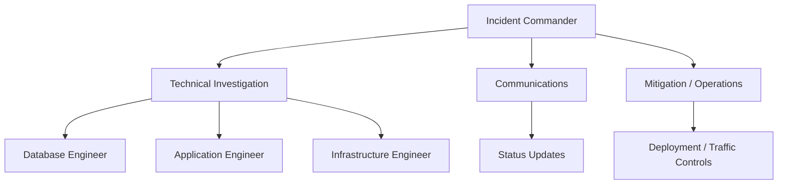
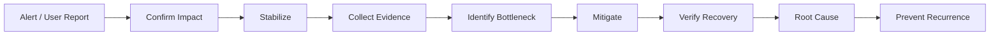

# 26- Production Database Incident Workflow

## Overview

A production database incident is an operational event where database behavior materially affects application availability, correctness, latency, throughput, or data integrity.

Typical symptoms include:

- API latency suddenly increases.
- Requests begin timing out.
- PostgreSQL CPU or memory reaches saturation.
- Database connections are exhausted.
- Queries become unexpectedly slow.
- Lock contention or deadlocks increase.
- Replicas fall behind.
- Writes fail.
- Errors increase after a deployment.
- Storage capacity approaches its limit.
- A primary database becomes unavailable.

The difficult part is that the database is usually only one component of a larger system:

```text
Users
  ↓
Nginx / Load Balancer
  ↓
Django / FastAPI / gRPC
  ↓
Connection Pool
  ↓
PostgreSQL
  ↓
Storage / Replication
```

An incident must therefore be investigated as a **system failure**, not merely as a SQL problem.

A disciplined workflow separates:

```text
stabilization
    ↓
diagnosis
    ↓
mitigation
    ↓
recovery
    ↓
verification
    ↓
root-cause analysis
    ↓
prevention
```

The primary operational rule is:

> **During an incident, restore a safe operating state first. Optimize and permanently fix the system afterward.**

---

## Incident Severity

Not every database anomaly requires the same response.

| Severity | Example | Typical response |
|---|---|---|
| Critical | Primary unavailable, data integrity risk | Immediate incident response |
| High | Major API failure or severe latency | Rapid mitigation |
| Medium | Significant degradation with workaround | Investigate and monitor |
| Low | Capacity warning or isolated slow query | Normal engineering workflow |

Severity should be based on **customer and business impact**, not simply database metrics.

For example:

```text
PostgreSQL CPU = 95%
```

may be acceptable temporarily if requests remain healthy.

Conversely:

```text
PostgreSQL CPU = 50%
API p99 = 20 seconds
```

may represent a severe incident.

---

## Incident Command Structure

For larger incidents, separate responsibilities.



Typical responsibilities:

| Role | Responsibility |
|---|---|
| Incident Commander | Coordinates decisions and priorities |
| Database investigator | PostgreSQL diagnosis |
| Application investigator | Query/request behavior |
| Infrastructure investigator | Kubernetes/AWS/network |
| Mitigation owner | Executes controlled remediation |
| Communications owner | Stakeholder updates |
| Scribe | Records timeline and decisions |

One engineer may perform multiple roles for smaller incidents.

---

## Incident Principles

### Stabilize Before Optimizing

During an active outage:

```text
reduce impact
```

is more important than:

```text
find the perfect root cause
```

### Change One Major Variable at a Time

If you simultaneously:

```text
restart pods
+
increase DB size
+
kill sessions
+
change indexes
+
modify pool sizes
```

you may lose the ability to determine what actually fixed the incident.

### Preserve Evidence

Avoid destroying useful evidence before collecting it.

Examples:

- Query activity.
- Lock relationships.
- Connection counts.
- Database logs.
- Application logs.
- Deployment history.
- Metrics.
- Execution plans.
- Replication state.

### Prefer Reversible Changes

During an incident, prefer:

```text
traffic reduction
+
feature disablement
+
worker throttling
+
rollback
```

over risky permanent schema changes.

---

## Production Incident Lifecycle



The order matters.

Do not spend 30 minutes optimizing a query while the production database is still being overwhelmed by runaway traffic.

---

## Detecting a Database Incident

Signals can originate from multiple layers.

### Application Signals

```text
5xx rate ↑
request latency ↑
timeouts ↑
database errors ↑
pool acquisition latency ↑
```

### PostgreSQL Signals

```text
CPU ↑
memory pressure ↑
connections ↑
lock waits ↑
deadlocks ↑
query latency ↑
I/O latency ↑
WAL generation ↑
replication lag ↑
```

### Infrastructure Signals

```text
pod count ↑
container restarts ↑
node pressure ↑
network errors ↑
storage utilization ↑
deployment activity ↑
```

---

## Establish the Blast Radius

Before changing anything, determine:

```text
Which endpoints are affected?
Which services are affected?
Read, write, or both?
All users or a subset?
Primary or replica?
One region or multiple?
When did it start?
What changed immediately beforehand?
```

Example:

```text
09:10 deployment begins
09:14 database CPU increases
09:16 API p99 increases
09:17 pool timeouts begin
09:18 5xx rate increases
```

This timeline strongly suggests investigating the deployment.

---

## Determine the Failure Domain

Ask whether the problem is:

```text
application
database
network
infrastructure
external dependency
```

A database-looking incident may actually be:

```text
Kubernetes rollout
    ↓
application pods doubled
    ↓
connection pools doubled
    ↓
PostgreSQL overloaded
```

The database is where the failure becomes visible, but not necessarily where it originated.

---

## First Database Checks

Start with basic state.

```sql
SHOW max_connections;
```

```sql
SELECT count(*)
FROM pg_stat_activity;
```

```sql
SELECT
    state,
    count(*)
FROM pg_stat_activity
GROUP BY state
ORDER BY count(*) DESC;
```

Then identify clients:

```sql
SELECT
    application_name,
    usename,
    state,
    count(*)
FROM pg_stat_activity
GROUP BY application_name, usename, state
ORDER BY count(*) DESC;
```

These queries provide a quick view of connection pressure.

---

## Inspect Active Queries

```sql
SELECT
    pid,
    application_name,
    usename,
    state,
    query_start,
    now() - query_start AS duration,
    wait_event_type,
    wait_event,
    query
FROM pg_stat_activity
WHERE state = 'active'
ORDER BY query_start;
```

Look for:

- Long-running queries.
- Unexpected clients.
- Lock waits.
- Large concurrent workloads.
- Queries introduced by recent changes.

---

## Inspect Long Transactions

```sql
SELECT
    pid,
    application_name,
    usename,
    xact_start,
    now() - xact_start AS transaction_age,
    state,
    query
FROM pg_stat_activity
WHERE xact_start IS NOT NULL
ORDER BY xact_start;
```

Long transactions can cause:

```text
locks
+
MVCC cleanup delays
+
connection occupancy
+
bloat
```

and can therefore create secondary failures.

---

## Inspect `idle in transaction`

```sql
SELECT
    pid,
    application_name,
    usename,
    xact_start,
    now() - xact_start AS transaction_age,
    query
FROM pg_stat_activity
WHERE state = 'idle in transaction'
ORDER BY xact_start;
```

This state deserves particular attention during incidents.

An idle-in-transaction session may be holding a transaction open even though it is not currently executing SQL.

---

## Inspect Blocking Relationships

```sql
SELECT
    blocked.pid AS blocked_pid,
    blocked.query AS blocked_query,
    blocking.pid AS blocking_pid,
    blocking.query AS blocking_query
FROM pg_stat_activity AS blocked
JOIN pg_stat_activity AS blocking
    ON blocking.pid = ANY(pg_blocking_pids(blocked.pid));
```

This can reveal:

```text
one blocking transaction
    ↓
many waiting transactions
    ↓
connection pool exhaustion
    ↓
API timeouts
```

---

## Identify the Primary Bottleneck

Common database bottlenecks include:

| Bottleneck | Typical signal |
|---|---|
| CPU | High CPU, expensive queries |
| Memory | Memory pressure, swapping/OOM risk |
| I/O | High I/O latency, slow scans |
| Connections | Connection exhaustion |
| Locks | High wait time |
| Query plan | Unexpected expensive execution |
| Storage | Low disk capacity |
| WAL | High write volume |
| Replication | Increasing replica lag |
| Network | High round-trip latency |

The same application symptom can have several possible database causes.

---

## High CPU Incident

Typical pattern:

```text
CPU ↑
    ↓
query latency ↑
    ↓
connections held longer
    ↓
pool exhaustion
    ↓
request timeout
```

Investigate:

```text
top queries by total execution time
query frequency
execution plans
concurrent query count
recent deployments
data growth
```

Useful tools include:

```text
pg_stat_statements
EXPLAIN
EXPLAIN (ANALYZE, BUFFERS)
pg_stat_activity
```

---

## High Memory Incident

Investigate:

```text
database memory
connection count
concurrent queries
sort/hash operations
work_mem
large result sets
long transactions
```

Do not assume:

```text
high memory
=
shared_buffers problem
```

Per-query memory can multiply with concurrency.

For example:

```text
100 concurrent queries
×
large memory-intensive operations
```

can create significant aggregate memory pressure.

---

## Too Many Connections Incident

Check:

```sql
SHOW max_connections;
```

Then:

```sql
SELECT
    application_name,
    state,
    count(*)
FROM pg_stat_activity
GROUP BY application_name, state
ORDER BY count(*) DESC;
```

Calculate:

```text
pods
×
processes
×
pool capacity
```

Include:

```text
overflow
+
workers
+
migrations
+
administrative clients
```

Do not immediately increase `max_connections`.

---

## Connection Pool Incident

Application-level metrics should show:

```text
pool capacity
active connections
idle connections
waiting requests
acquisition latency
connection errors
```

A pool timeout often means:

```text
connections are occupied too long
```

rather than:

```text
PostgreSQL cannot accept connections
```

Investigate:

```text
slow queries
lock waits
long transactions
connection leaks
external calls inside transactions
```

---

## Slow Query Incident

Use:

```sql
EXPLAIN (ANALYZE, BUFFERS)
SELECT ...;
```

Inspect:

```text
estimated rows
actual rows
scan type
join algorithms
loops
sorts
hash operations
buffer reads
temporary I/O
```

Do not optimize based solely on:

```text
Seq Scan
```

A sequential scan may be the correct plan.

---

## Query Regression After Deployment

A common pattern:

```text
deployment
    ↓
query changes
    ↓
execution plan changes
    ↓
database CPU ↑
    ↓
latency ↑
```

Investigate:

```text
application version
query text
query parameters
execution plan
database statistics
indexes
```

If a deployment is strongly correlated with the incident, rollback may be safer than performing live query surgery.

---

## Lock Contention Incident

Typical pattern:

```text
transaction A
    ↓
holds lock

transactions B/C/D
    ↓
wait

pool occupancy ↑
    ↓
request latency ↑
```

Investigate:

```sql
SELECT
    pid,
    wait_event_type,
    wait_event,
    query_start,
    now() - query_start AS duration,
    query
FROM pg_stat_activity
WHERE state = 'active';
```

Then identify blockers using `pg_blocking_pids()`.

---

## Deadlock Incident

PostgreSQL reports deadlocks using SQLSTATE:

```text
40P01
```

Deadlocks often result from inconsistent lock ordering:

```text
Transaction A:
lock row 1 → row 2

Transaction B:
lock row 2 → row 1
```

The database detects the cycle and aborts one transaction.

The long-term fix is usually:

```text
consistent lock ordering
+
short transactions
+
bounded retry
```

---

## Storage Incident

Check:

```text
disk utilization
database size
WAL growth
temporary files
index growth
table bloat
backup/WAL retention
```

A database running out of storage can cause:

```text
write failures
+
WAL problems
+
checkpoint pressure
+
application errors
```

Storage incidents should be treated as high priority because available remediation options become limited as capacity approaches zero.

---

## Replication Incident

For PostgreSQL streaming replication, inspect replication state:

```sql
SELECT
    application_name,
    state,
    sync_state,
    client_addr,
    write_lsn,
    flush_lsn,
    replay_lsn
FROM pg_stat_replication;
```

Look for:

```text
replica disconnected
replication lag
WAL accumulation
slow replay
long-running replica queries
```

Replica lag can cause:

```text
stale reads
+
read-after-write failures
+
reporting delays
```

---

## Read Replica Incident

A replica can be healthy from a connection perspective but still perform poorly.

Investigate:

```text
replica CPU
replica I/O
long-running queries
replication replay
connection count
query workload
```

Do not automatically send more read traffic to a slow replica.

---

## Incident Mitigation

Mitigation should target the immediate bottleneck.

Possible actions:

| Problem | Possible mitigation |
|---|---|
| Runaway query | Cancel justified query |
| Bad deployment | Roll back |
| Excessive pods | Scale down |
| Excessive workers | Reduce concurrency |
| Connection storm | Throttle reconnects |
| Lock blocker | Resolve blocking transaction |
| Read overload | Route reads differently |
| Expensive feature | Disable feature |
| Storage pressure | Remove safe temporary data / expand storage |
| Replica overload | Reduce read workload |
| External dependency | Apply backpressure |

Mitigation should be deliberate and observable.

---

## Cancelling a Query

If a query is clearly identified as harmful:

```sql
SELECT pg_cancel_backend(<pid>);
```

This requests query cancellation.

If the session itself must be terminated:

```sql
SELECT pg_terminate_backend(<pid>);
```

Termination is more disruptive.

Before terminating anything, confirm:

```text
PID
application
query
transaction
business impact
```

Avoid indiscriminate termination.

---

## Rolling Back a Deployment

If the incident begins immediately after a deployment:

```text
deployment
    ↓
incident
```

and the evidence is strong, rollback is often the safest mitigation.

Rollback can restore:

```text
previous SQL
+
previous query patterns
+
previous connection behavior
+
previous application concurrency
```

Do not wait for perfect root-cause certainty when a safe rollback is available and customer impact is severe.

---

## Feature Flags

Feature flags can reduce database workload without deploying code.

For example:

```text
expensive recommendation query
        ↓
feature flag disabled
        ↓
database workload decreases
```

Useful for:

- New reporting queries.
- Expensive search features.
- High-volume background processing.
- Newly introduced database writes.

Feature flags should be designed so disabling a feature leaves the system in a valid state.

---

## Traffic Reduction

If the database cannot safely handle current traffic:

```text
unbounded traffic
    ↓
database saturation
```

Controlled traffic reduction can preserve availability.

Possible mechanisms:

- Rate limiting.
- Request shedding.
- Queueing.
- Feature disablement.
- Lower concurrency.
- Reduced worker count.

A degraded but functioning system is often preferable to complete database failure.

---

## Background Workload Throttling

Background workloads should not consume all database capacity.

For example:

```text
API traffic
+
Celery workers
+
Kafka consumers
+
report generation
```

If API latency is critical, background workloads may need lower concurrency.

This is a form of workload isolation.

---

## Emergency Connection Control

If one application is exhausting connections:

```text
orders-api → 250 connections
other services → 50 connections
```

identify the source before changing global database settings.

Possible mitigations include:

```text
reduce service replicas
+
reduce pool size
+
reduce worker concurrency
+
restart unhealthy instances
```

The goal is to restore a controlled connection budget.

---

## Emergency Lock Mitigation

If one transaction blocks critical traffic:

```text
blocking transaction
    ↓
many blocked transactions
```

First identify:

```text
who owns the blocker?
why is it open?
what business operation is running?
```

Then decide whether cancellation or termination is safe.

Never treat:

```text
kill blocker
```

as a generic lock-management strategy.

---

## Avoid Dangerous Emergency Changes

During incidents, be cautious with:

```text
large schema changes
DROP / DELETE operations
unreviewed indexes
global timeout increases
max_connections increases
mass session termination
large configuration changes
```

These can make the incident worse or destroy evidence.

---

## Incident Evidence Collection

Capture:

```text
incident start time
incident end time
affected services
affected endpoints
database metrics
application metrics
connection metrics
query metrics
lock information
replication state
deployment history
configuration changes
mitigation actions
```

A useful incident timeline is:

```text
09:10 deployment started
09:14 CPU increased
09:15 query latency increased
09:16 pool wait increased
09:17 API errors increased
09:18 rollback started
09:20 CPU normalized
09:22 API recovered
```

This timeline is extremely valuable for root-cause analysis.

---

## Observability During Incidents

A mature system should provide:

### Metrics

```text
CPU
memory
I/O
connections
query latency
pool utilization
lock waits
deadlocks
replication lag
storage
WAL
```

### Logs

```text
application errors
database errors
slow queries
deployment events
connection failures
authentication failures
```

### Traces

```text
request
  ├── pool acquisition
  ├── SQL
  ├── Redis
  ├── Kafka
  └── external service
```

The objective is to correlate symptoms across layers.

---

## `pg_stat_statements`

`pg_stat_statements` is particularly useful for workload-level diagnosis.

Typical information includes:

```text
query
calls
total execution time
mean execution time
rows
shared block reads
shared block hits
```

For example, identify expensive statements:

```sql
SELECT
    query,
    calls,
    total_exec_time,
    mean_exec_time,
    rows
FROM pg_stat_statements
ORDER BY total_exec_time DESC
LIMIT 20;
```

Total time and mean time answer different questions.

A query executed millions of times with moderate latency may have more production impact than a single extremely slow query.

---

## Query Frequency vs Query Latency

Consider:

```text
Query A
10 ms × 1,000,000 calls

Query B
5 seconds × 10 calls
```

Query A consumes:

```text
10,000 seconds
```

of total execution time.

Query B consumes:

```text
50 seconds
```

Therefore:

> **Optimize according to workload impact, not just the slowest individual query.**

---

## Application Correlation

Use meaningful PostgreSQL `application_name` values:

```text
orders-api
payments-api
reporting-worker
celery-worker
migration-job
```

This allows:

```sql
SELECT
    application_name,
    state,
    count(*)
FROM pg_stat_activity
GROUP BY application_name, state
ORDER BY count(*) DESC;
```

to identify connection and workload sources quickly.

---

## Incident Communication

Updates should communicate:

```text
impact
current state
actions being taken
next decision point
```

Example:

```text
Impact:
Elevated API latency and 5xx errors for order creation.

Current state:
PostgreSQL primary CPU is saturated and write latency is elevated.

Action:
The recent deployment has been rolled back and background worker
concurrency is being reduced.

Next:
We are validating query load and database recovery.
```

Avoid speculation presented as fact.

Prefer:

```text
We observed...
We are investigating...
The current mitigation is...
```

---

## Recovery Verification

Do not declare recovery simply because the alert clears.

Verify:

```text
API error rate
request latency
database CPU
database connections
pool utilization
query latency
lock waits
replication
background workload
```

Recovery should be sustained.

For example:

```text
database CPU normal
+
p99 normal
+
connection count stable
+
no growing lock queue
```

is stronger evidence than:

```text
CPU dropped for 30 seconds
```

---

## Post-Mitigation Monitoring

After mitigation:

```text
watch
    ↓
confirm stability
    ↓
remove temporary controls carefully
```

Do not immediately restore:

```text
100% traffic
+
maximum worker concurrency
+
maximum pod count
```

if the underlying capacity issue remains.

---

## Temporary Mitigation vs Permanent Fix

Document temporary changes separately.

| Temporary mitigation | Permanent fix |
|---|---|
| Scale down workers | Correct worker concurrency |
| Roll back deployment | Fix query |
| Disable feature | Optimize feature |
| Increase instance size | Correct workload architecture |
| Cancel blocker | Fix transaction scope |
| Add emergency capacity | Capacity planning |
| Route reads differently | Improve read architecture |

Temporary mitigation should not silently become permanent architecture.

---

## Root Cause Analysis

After recovery, reconstruct:

```text
What changed?
        ↓
What failed first?
        ↓
What resource became constrained?
        ↓
Why did the system amplify the problem?
        ↓
Why did detection or mitigation take time?
        ↓
Why was the failure not prevented?
```

A strong root cause often contains several layers.

Example:

```text
Root cause:
New query performed an unselective scan.

Contributing factor:
Index was missing.

Amplifier:
Traffic increased after autoscaling.

Secondary failure:
Connection pools became saturated.

Detection gap:
No alert existed for query execution regression.
```

---

## Five Whys

Use the five-whys technique carefully.

Example:

```text
Why did API requests time out?
→ Database queries became slow.

Why did queries become slow?
→ A new query scanned a large table.

Why was the scan introduced?
→ A new endpoint lacked an appropriate access path.

Why was it not detected?
→ Production-scale query testing was missing.

Why was testing missing?
→ Database performance regression was not part of the deployment process.
```

The goal is not literally five questions.

The goal is to identify actionable systemic causes.

---

## Corrective Actions

Corrective actions should address:

### Code

```text
query optimization
transaction scope
connection lifecycle
retry behavior
```

### Database

```text
indexes
statistics
partitioning
configuration
capacity
```

### Architecture

```text
caching
read replicas
async processing
workload isolation
queueing
```

### Operations

```text
alerts
dashboards
runbooks
load testing
deployment controls
```

### Process

```text
code review
database review
performance testing
incident drills
```

---

## Preventing Query Regressions

Use:

```text
query observability
+
execution-plan review
+
production-like testing
+
performance budgets
```

For critical queries, monitor:

```text
mean latency
p95/p99 latency
total execution time
calls
rows
buffer reads
```

Query performance should be treated as an operational contract.

---

## Preventing Connection Incidents

Calculate:

```text
pods
×
processes
×
pool capacity
```

Include:

```text
Celery
Kafka consumers
migration jobs
reporting
admin clients
```

Use:

```text
bounded pools
+
pool timeouts
+
connection budgets
+
PgBouncer where appropriate
```

---

## Preventing Lock Incidents

Use:

```text
short transactions
+
consistent lock ordering
+
appropriate indexes
+
bounded lock waits
+
controlled concurrency
```

Monitor:

```text
lock waits
deadlocks
transaction age
```

---

## Preventing High CPU Incidents

Monitor:

```text
top queries
query frequency
total execution time
CPU utilization
query latency
```

Review:

```text
indexes
execution plans
data growth
query changes
concurrency
```

Do not rely on CPU alerts alone.

---

## Preventing High Memory Incidents

Monitor:

```text
database memory
connection count
query concurrency
temporary file usage
```

Review:

```text
max_connections
work_mem
shared_buffers
large result sets
```

Capacity planning should account for concurrency rather than only static configuration values.

---

## Preventing Replication Incidents

Monitor:

```text
replication lag
WAL generation
replica replay
replica CPU
replica I/O
```

Design applications for:

```text
read-after-write requirements
+
replica failure
+
replica lag
```

Do not assume every read replica is always safe for every read.

---

## Database Incident Runbook

A production runbook should contain:

```text
1. Confirm impact.
2. Identify affected services.
3. Check recent deployments.
4. Check database CPU/memory/I/O.
5. Check connection count.
6. Check active queries.
7. Check lock waits.
8. Check long transactions.
9. Check replication.
10. Check storage.
11. Identify the primary bottleneck.
12. Apply the safest reversible mitigation.
13. Verify recovery.
14. Continue monitoring.
15. Document the timeline.
16. Perform root-cause analysis.
17. Create corrective actions.
```

The exact order may change depending on incident severity.

---

## Production Incident Checklist

### Initial Response

- [ ] Confirm the alert.
- [ ] Confirm customer impact.
- [ ] Establish incident severity.
- [ ] Identify affected services.
- [ ] Record incident start time.
- [ ] Check recent deployments and configuration changes.
- [ ] Assign incident ownership.

### Database State

- [ ] Check CPU.
- [ ] Check memory.
- [ ] Check I/O.
- [ ] Check storage.
- [ ] Check connections.
- [ ] Check active queries.
- [ ] Check lock waits.
- [ ] Check long transactions.
- [ ] Check replication.
- [ ] Check WAL behavior.

### Application State

- [ ] Check request latency.
- [ ] Check error rate.
- [ ] Check pool utilization.
- [ ] Check pool wait time.
- [ ] Check worker concurrency.
- [ ] Check pod count.
- [ ] Check retries.
- [ ] Check recent application changes.

### Mitigation

- [ ] Prefer reversible actions.
- [ ] Reduce unnecessary workload.
- [ ] Roll back unsafe deployments when appropriate.
- [ ] Throttle background work.
- [ ] Reduce traffic when necessary.
- [ ] Cancel clearly identified harmful queries carefully.
- [ ] Avoid uncontrolled configuration changes.

### Recovery

- [ ] Verify database health.
- [ ] Verify application latency.
- [ ] Verify error rates.
- [ ] Verify connection stability.
- [ ] Verify replication.
- [ ] Verify background workloads.
- [ ] Continue monitoring after recovery.

### Follow-Up

- [ ] Preserve incident timeline.
- [ ] Identify root cause.
- [ ] Identify contributing factors.
- [ ] Create corrective actions.
- [ ] Improve monitoring.
- [ ] Update runbooks.
- [ ] Test the fix.

---

## Security Considerations

During incidents, emergency access should still follow security controls.

Avoid:

```text
sharing database passwords
+
using superuser credentials casually
+
copying sensitive production data into local environments
+
logging secrets
```

Use:

```text
least-privilege operational roles
+
audited privileged access
+
temporary access where possible
+
secure credential management
```

Emergency access should be easier to execute, not less secure.

---

## High Availability Considerations

HA systems require incident workflows for:

```text
primary failure
replica promotion
connection recovery
read routing
failback
```

During failover, monitor:

```text
new primary health
connection storms
replication state
application retries
```

Do not assume:

```text
automatic failover
=
application recovery
```

The application must also reconnect correctly and handle transaction uncertainty.

---

## Disaster Recovery Considerations

A database incident can become a DR event if:

```text
primary cannot recover
+
replicas unavailable
+
backups required
```

A mature workflow knows:

```text
RPO
RTO
backup location
PITR procedure
restore procedure
recovery credentials
application recovery process
```

Backups should be regularly tested through actual restore procedures.

---

## Cost Considerations

Emergency scaling may require:

```text
larger database instance
+
more replicas
+
additional storage
```

These can be valid mitigations, but should not permanently compensate for inefficient workload design.

After recovery, determine whether the incident requires:

```text
query optimization
+
architecture change
+
capacity increase
```

or a combination.

---

## Post-Incident Review

A useful post-incident review should answer:

### What Happened?

Describe the technical failure.

### What Was the Customer Impact?

Measure:

```text
duration
affected requests
error rate
latency
affected users
```

### What Changed?

Identify:

```text
deployment
configuration
traffic
data volume
infrastructure
external dependency
```

### Why Did Detection Work or Fail?

Review:

```text
alerts
dashboards
logs
traces
```

### Why Did Mitigation Take Time?

Look for:

```text
missing runbook
missing access
unclear ownership
insufficient observability
```

### What Will Prevent Recurrence?

Every important action should have:

```text
owner
priority
expected outcome
```

---

## Incident Anti-Patterns

### Searching for Root Cause Before Stabilizing

A perfect diagnosis is useless if customer impact continues.

### Restarting Everything

Mass restarts destroy evidence and can create connection storms.

### Killing Random Sessions

Session termination without understanding ownership can make the incident worse.

### Increasing Every Timeout

This increases resource occupancy and can hide the actual bottleneck.

### Increasing `max_connections`

This may convert connection pressure into memory or CPU pressure.

### Adding an Index Without Plan Analysis

An index can increase write cost and may not address the real bottleneck.

### Scaling Application Pods During Database Saturation

More pods can create more:

```text
connections
+
queries
+
database contention
```

### Ignoring Background Workers

Celery and Kafka consumers can consume critical database capacity during an API incident.

### Treating Alerts as Root Causes

```text
CPU high
```

is a symptom.

Determine:

```text
which workload
```

caused it.

### Making Many Changes Simultaneously

This makes causality difficult to establish and rollback difficult.

---

## Interview Traps

### What Is the First Thing You Do During a Database Incident?

Confirm customer impact and stabilize the system. Do not immediately optimize SQL.

### How Do You Determine Whether PostgreSQL Is the Root Cause?

Correlate application latency/errors with:

```text
database metrics
+
query activity
+
locks
+
connections
+
infrastructure
```

### What Would You Check for High Database CPU?

Start with workload:

```text
pg_stat_statements
active queries
query frequency
execution plans
recent deployments
```

Then determine whether the CPU is caused by:

```text
one expensive query
+
many moderately expensive queries
+
excessive concurrency
```

### What Would You Check for Too Many Connections?

Inspect:

```sql
SHOW max_connections;

SELECT
    application_name,
    state,
    count(*)
FROM pg_stat_activity
GROUP BY application_name, state;
```

Then calculate:

```text
pods × processes × pool capacity
```

### How Do You Handle Lock Contention?

Identify blockers using:

```text
pg_stat_activity
pg_locks
pg_blocking_pids()
```

Then safely resolve the blocker and fix transaction scope or lock ordering.

### Would You Increase Database Timeouts During an Incident?

Usually not as a first response. Increasing timeouts can cause connections and resources to remain occupied longer.

### Would You Restart PostgreSQL?

Only when justified by the failure mode and operational runbook. A restart can terminate workloads, destroy evidence, and create a reconnect storm.

### What Makes a Good Database Incident Runbook?

It should provide:

```text
symptom
→
diagnostic queries
→
decision points
→
safe mitigations
→
verification
→
rollback
```

### What Is the Difference Between Mitigation and Root Cause?

Mitigation reduces current impact.

Root cause explains why the incident happened and identifies the systemic change required to prevent recurrence.

### What Is the Senior-Level Approach to Database Incidents?

Treat the database as part of a distributed system:

```text
traffic
+
application concurrency
+
connection pools
+
SQL workload
+
locks
+
storage
+
replication
+
infrastructure
+
failure recovery
```

Then correlate evidence across these layers rather than assuming the database metric that fired the alert is the root cause.

## Key Takeaways

- **Stabilize before optimizing:** confirm impact, identify the failure domain, reduce harmful workload, and prefer reversible mitigations before performing risky database changes.
- **Diagnose across the complete system:** correlate application errors, pool behavior, PostgreSQL queries, locks, CPU, memory, I/O, replication, deployments, and infrastructure rather than treating a database metric as the root cause.
- **Preserve evidence and change deliberately:** collect `pg_stat_activity`, lock state, query metrics, deployment history, and timelines; avoid mass restarts, random session termination, and simultaneous configuration changes.
- **Separate mitigation from permanent remediation:** rollback, throttling, feature flags, and workload reduction restore stability; query fixes, transaction redesign, indexing, capacity planning, and architectural changes prevent recurrence.
- **A mature incident workflow ends with prevention:** verify sustained recovery, document the timeline and root cause, improve observability and runbooks, and test the corrective changes under realistic production conditions.