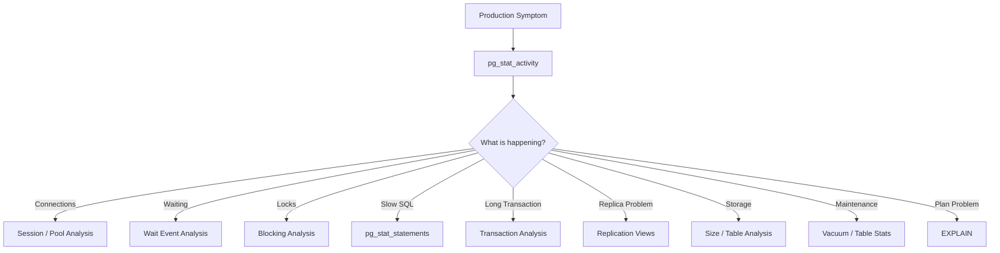
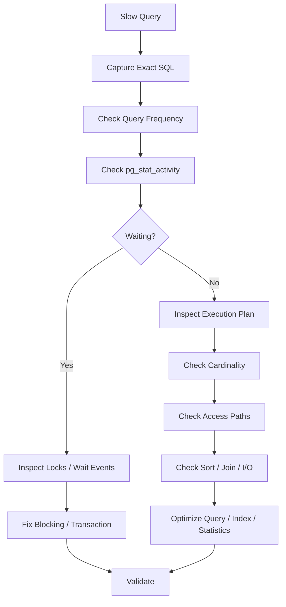
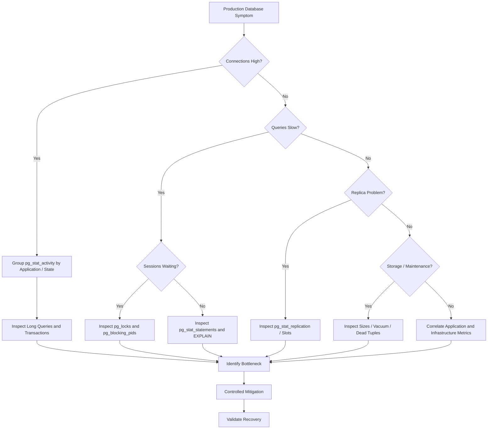

# 27- SQL Diagnostic Queries

## Overview

SQL diagnostic queries are targeted queries used to understand the current state and behavior of a production database.

They answer operational questions such as:

- Who is connected?
- Which queries are running?
- Which transactions are old?
- Who is blocking whom?
- Is the database overloaded?
- Are replicas healthy?
- Is storage approaching capacity?
- Which queries consume the most execution time?
- Is connection usage concentrated in one service?
- Are sessions stuck `idle in transaction`?
- Is a query waiting or actually executing?

For PostgreSQL-backed applications, diagnostic SQL is an essential operational skill for backend engineers working with Django, FastAPI, microservices, Celery, Kafka, and Kubernetes.

The important distinction is:

```text
Diagnostic query
    ↓
observe database state
    ↓
form hypothesis
    ↓
correlate with application / infrastructure metrics
    ↓
take controlled action
```

Diagnostic queries should generally be **read-only and low-impact**. They provide evidence; they should not be treated as automatic remediation.

---

## Diagnostic Mindset

A useful production investigation follows:

```text
Symptom
  ↓
Database state
  ↓
Resource / workload
  ↓
Specific session / query
  ↓
Root cause
  ↓
Mitigation
```

For example:

```text
API timeout
  ↓
pool acquisition latency
  ↓
all DB connections busy
  ↓
many queries waiting on locks
  ↓
one long transaction is blocking updates
```

The first visible symptom was an API timeout, but the database root cause was lock contention.

---

## Diagnostic Query Categories

| Category | Primary question |
|---|---|
| Connections | Who is connected? |
| Active queries | What is running? |
| Wait events | What is the session waiting for? |
| Transactions | Which transactions are old? |
| Locks | Who is blocking whom? |
| Query workload | Which SQL consumes resources? |
| Database size | Where is storage being consumed? |
| Table statistics | Which tables receive activity? |
| Index statistics | Which indexes are being used? |
| Vacuum | Is maintenance keeping up? |
| Replication | Are replicas healthy? |
| Configuration | What limits are configured? |
| Cache / buffers | Is the database reading from disk? |
| Sessions | Are connections accumulating? |

---

## PostgreSQL Diagnostic Architecture



No single catalog view provides the complete picture.

Senior-level diagnosis comes from correlating multiple views.

---

## Check Database Identity

Before running production diagnostics, confirm that you are connected to the intended database.

```sql
SELECT
    current_database() AS database_name,
    current_user AS current_user,
    inet_server_addr() AS server_address,
    inet_server_port() AS server_port,
    version() AS postgres_version;
```

This is especially important when working across:

```text
development
staging
production
read replicas
multiple AWS regions
```

Never assume the shell prompt or connection string identifies the target correctly.

---

## Check Current Session

```sql
SELECT
    pid,
    usename,
    application_name,
    client_addr,
    client_port,
    state,
    backend_start,
    xact_start,
    query_start,
    wait_event_type,
    wait_event,
    query
FROM pg_stat_activity
WHERE pid = pg_backend_pid();
```

Useful during incident response when you need to confirm:

```text
database role
+
application
+
client
+
transaction state
+
wait state
```

---

## Active Connections

```sql
SELECT
    count(*) AS total_connections
FROM pg_stat_activity;
```

Break them down by state:

```sql
SELECT
    state,
    count(*) AS connections
FROM pg_stat_activity
GROUP BY state
ORDER BY connections DESC;
```

Typical states include:

```text
active
idle
idle in transaction
idle in transaction (aborted)
```

---

## Connections by Application

```sql
SELECT
    application_name,
    count(*) AS connections
FROM pg_stat_activity
GROUP BY application_name
ORDER BY connections DESC;
```

This is useful for identifying:

```text
orders-api
payments-api
reporting-worker
celery
migration-job
```

that may be consuming disproportionate database capacity.

---

## Connections by Application and State

```sql
SELECT
    application_name,
    state,
    count(*) AS connections
FROM pg_stat_activity
GROUP BY application_name, state
ORDER BY application_name, connections DESC;
```

This can reveal patterns such as:

```text
orders-api     active                 20
orders-api     idle                   30
reporting      active                 10
celery         idle in transaction     5
```

The combination of application and state is often more useful than total connections alone.

---

## Connection Limit

```sql
SHOW max_connections;
```

Compare configured capacity with actual usage:

```sql
SELECT
    count(*) AS current_connections,
    current_setting('max_connections')::integer AS max_connections,
    round(
        100.0 * count(*) /
        current_setting('max_connections')::integer,
        2
    ) AS utilization_percent
FROM pg_stat_activity;
```

A high percentage requires investigation, but increasing `max_connections` is not automatically the correct solution.

---

## Reserved Connection Capacity

PostgreSQL may reserve connections for superusers through:

```sql
SHOW superuser_reserved_connections;
```

Therefore:

```text
max_connections
```

is not necessarily equivalent to:

```text
connections available to ordinary application roles
```

This matters during connection exhaustion incidents.

---

## Active Queries

```sql
SELECT
    pid,
    application_name,
    usename,
    client_addr,
    query_start,
    now() - query_start AS duration,
    wait_event_type,
    wait_event,
    query
FROM pg_stat_activity
WHERE state = 'active'
ORDER BY query_start;
```

Look for:

- Long-running SQL.
- Unexpected applications.
- Lock waits.
- Large concurrent workloads.
- Queries introduced after deployments.

---

## Long-Running Queries

A simple diagnostic:

```sql
SELECT
    pid,
    application_name,
    usename,
    query_start,
    now() - query_start AS duration,
    wait_event_type,
    wait_event,
    query
FROM pg_stat_activity
WHERE state = 'active'
ORDER BY duration DESC;
```

During an incident, correlate these queries with:

```text
CPU
I/O
locks
application latency
connection utilization
```

A long query is not necessarily harmful, but an unexpectedly long query deserves investigation.

---

## Long Transactions

```sql
SELECT
    pid,
    application_name,
    usename,
    xact_start,
    now() - xact_start AS transaction_age,
    state,
    query
FROM pg_stat_activity
WHERE xact_start IS NOT NULL
ORDER BY xact_start;
```

Long transactions can cause:

```text
locks
+
MVCC cleanup delays
+
bloat
+
connection occupancy
```

They are particularly important during high-latency incidents.

---

## Idle in Transaction

```sql
SELECT
    pid,
    application_name,
    usename,
    xact_start,
    now() - xact_start AS transaction_age,
    state,
    query
FROM pg_stat_activity
WHERE state = 'idle in transaction'
ORDER BY xact_start;
```

A session can be idle while its transaction remains open.

Potential consequences include:

- Locks being retained.
- Old snapshots.
- Delayed cleanup.
- Connection pool pressure.
- Increased application latency.

---

## Aborted Transactions

```sql
SELECT
    pid,
    application_name,
    usename,
    xact_start,
    state,
    query
FROM pg_stat_activity
WHERE state = 'idle in transaction (aborted)';
```

This often indicates:

```text
statement failed
    ↓
transaction became aborted
    ↓
application failed to rollback
```

Connection pooling makes this especially important because the same connection may later be reused.

---

## Waiting Sessions

Inspect wait events:

```sql
SELECT
    pid,
    application_name,
    state,
    wait_event_type,
    wait_event,
    query_start,
    now() - query_start AS duration,
    query
FROM pg_stat_activity
WHERE wait_event IS NOT NULL
ORDER BY query_start;
```

A wait event provides context about why a backend is not progressing.

---

## Wait Events by Type

```sql
SELECT
    wait_event_type,
    wait_event,
    count(*) AS sessions
FROM pg_stat_activity
WHERE wait_event IS NOT NULL
GROUP BY wait_event_type, wait_event
ORDER BY sessions DESC;
```

This provides an aggregate view.

For example:

```text
Lock       transactionid    25
IO         DataFileRead      8
Client     ClientRead        5
```

Interpret these values alongside workload and application behavior.

---

## Locking Diagnostics

Find sessions blocked by other sessions:

```sql
SELECT
    blocked.pid AS blocked_pid,
    blocked.application_name AS blocked_application,
    blocked.query AS blocked_query,
    blocking.pid AS blocking_pid,
    blocking.application_name AS blocking_application,
    blocking.query AS blocking_query
FROM pg_stat_activity AS blocked
JOIN pg_stat_activity AS blocking
    ON blocking.pid = ANY(pg_blocking_pids(blocked.pid));
```

This is one of the most useful production queries for lock incidents.

---

## Detailed Lock Information

Inspect PostgreSQL locks:

```sql
SELECT
    l.pid,
    a.application_name,
    a.usename,
    l.locktype,
    l.mode,
    l.granted,
    l.relation::regclass AS relation,
    l.page,
    l.tuple,
    a.state,
    a.query
FROM pg_locks AS l
JOIN pg_stat_activity AS a
    ON a.pid = l.pid
ORDER BY l.granted, l.pid;
```

`granted = false` indicates a lock request that is currently waiting.

---

## Waiting Locks Only

```sql
SELECT
    l.pid,
    a.application_name,
    l.locktype,
    l.mode,
    l.relation::regclass AS relation,
    a.query
FROM pg_locks AS l
JOIN pg_stat_activity AS a
    ON a.pid = l.pid
WHERE NOT l.granted
ORDER BY l.pid;
```

Use this with blocker information to reconstruct the lock dependency.

---

## Blocking Tree

For a specific blocked session:

```sql
SELECT
    pid,
    pg_blocking_pids(pid) AS blocking_pids,
    query
FROM pg_stat_activity
WHERE cardinality(pg_blocking_pids(pid)) > 0;
```

This helps answer:

```text
Who is waiting?
Who is blocking them?
Is one blocker affecting many sessions?
```

---

## Deadlock Investigation

Deadlocks are normally detected automatically by PostgreSQL.

A deadlock typically produces:

```text
SQLSTATE 40P01
```

Investigate:

```text
database logs
+
pg_locks
+
pg_stat_activity
+
application transaction patterns
```

The catalog views may show the current state, while logs often contain the most useful evidence about the deadlock cycle itself.

---

## Query Workload With `pg_stat_statements`

If enabled, inspect:

```sql
SELECT
    query,
    calls,
    total_exec_time,
    mean_exec_time,
    rows
FROM pg_stat_statements
ORDER BY total_exec_time DESC
LIMIT 20;
```

This identifies statements consuming the most cumulative execution time.

---

## Most Frequently Executed Queries

```sql
SELECT
    query,
    calls,
    mean_exec_time,
    total_exec_time
FROM pg_stat_statements
ORDER BY calls DESC
LIMIT 20;
```

High call count can expose:

```text
N+1 queries
+
chatty APIs
+
polling
+
inefficient ORM behavior
```

---

## Slowest Queries by Mean Time

```sql
SELECT
    query,
    calls,
    mean_exec_time,
    total_exec_time
FROM pg_stat_statements
ORDER BY mean_exec_time DESC
LIMIT 20;
```

Mean execution time identifies expensive statements per execution.

It should not be used alone.

---

## Highest Total Execution Time

```sql
SELECT
    query,
    calls,
    mean_exec_time,
    total_exec_time
FROM pg_stat_statements
ORDER BY total_exec_time DESC
LIMIT 20;
```

This is often more useful for capacity incidents because it captures aggregate workload.

---

## High-Impact Query Analysis

A useful production comparison is:

```text
Query A
10 ms × 1,000,000 calls

Query B
5 seconds × 10 calls
```

Query A may consume significantly more database CPU over the observation period.

Therefore:

> **Prioritize workload impact, not only individual query latency.**

---

## Query Cache and Buffer Activity

Inspect `pg_stat_statements` buffer metrics where available:

```sql
SELECT
    query,
    calls,
    shared_blks_hit,
    shared_blks_read,
    temp_blks_read,
    temp_blks_written
FROM pg_stat_statements
ORDER BY shared_blks_read DESC
LIMIT 20;
```

This helps identify statements performing substantial buffer reads or temporary I/O.

---

## Cache Hit Ratio

A database-level approximation:

```sql
SELECT
    sum(blks_hit) AS buffer_hits,
    sum(blks_read) AS disk_reads,
    round(
        100.0 * sum(blks_hit) /
        NULLIF(sum(blks_hit) + sum(blks_read), 0),
        2
    ) AS hit_ratio_percent
FROM pg_stat_database;
```

A low hit ratio may indicate significant disk reading, but cache hit ratio alone is not sufficient to diagnose performance.

Workload characteristics and I/O latency matter.

---

## Database-Level Statistics

```sql
SELECT
    datname,
    numbackends,
    xact_commit,
    xact_rollback,
    blks_read,
    blks_hit,
    tup_returned,
    tup_fetched,
    tup_inserted,
    tup_updated,
    tup_deleted
FROM pg_stat_database
ORDER BY datname;
```

This provides a broad workload view.

---

## Transaction Rollback Rate

Inspect commits and rollbacks:

```sql
SELECT
    datname,
    xact_commit,
    xact_rollback,
    round(
        100.0 * xact_rollback /
        NULLIF(xact_commit + xact_rollback, 0),
        2
    ) AS rollback_percent
FROM pg_stat_database
ORDER BY rollback_percent DESC;
```

An increase in rollbacks may indicate:

```text
application errors
+
constraint violations
+
timeouts
+
deadlocks
+
serialization failures
```

It is a signal requiring correlation, not automatically a database fault.

---

## Database Size

```sql
SELECT
    datname,
    pg_size_pretty(pg_database_size(datname)) AS size
FROM pg_database
ORDER BY pg_database_size(datname) DESC;
```

Useful for capacity planning and storage incidents.

---

## Table Sizes

```sql
SELECT
    schemaname,
    relname,
    pg_size_pretty(pg_total_relation_size(relid)) AS total_size
FROM pg_catalog.pg_statio_user_tables
ORDER BY pg_total_relation_size(relid) DESC
LIMIT 20;
```

`pg_total_relation_size` includes associated indexes and TOAST storage.

---

## Table Data vs Index Size

```sql
SELECT
    schemaname,
    relname,
    pg_size_pretty(pg_relation_size(relid)) AS table_size,
    pg_size_pretty(pg_indexes_size(relid)) AS indexes_size,
    pg_size_pretty(pg_total_relation_size(relid)) AS total_size
FROM pg_catalog.pg_statio_user_tables
ORDER BY pg_total_relation_size(relid) DESC
LIMIT 20;
```

This helps identify tables where indexes consume a large fraction of storage.

---

## Largest Indexes

```sql
SELECT
    schemaname,
    indexrelname,
    pg_size_pretty(pg_relation_size(indexrelid)) AS index_size
FROM pg_catalog.pg_statio_user_indexes
ORDER BY pg_relation_size(indexrelid) DESC
LIMIT 20;
```

Large indexes affect:

```text
storage
+
cache pressure
+
write amplification
+
backup size
+
replication traffic
```

---

## Index Usage

```sql
SELECT
    schemaname,
    relname,
    indexrelname,
    idx_scan,
    idx_tup_read,
    idx_tup_fetch
FROM pg_stat_user_indexes
ORDER BY idx_scan ASC
LIMIT 20;
```

Low usage is a signal, not proof that an index should be removed.

Consider:

```text
observation period
+
seasonality
+
constraint requirements
+
recent deployment
+
query workload
```

before removing anything.

---

## Table Activity

```sql
SELECT
    schemaname,
    relname,
    seq_scan,
    seq_tup_read,
    idx_scan,
    idx_tup_fetch,
    n_tup_ins,
    n_tup_upd,
    n_tup_del,
    n_live_tup,
    n_dead_tup
FROM pg_stat_user_tables
ORDER BY seq_scan DESC
LIMIT 20;
```

This helps identify heavily accessed and heavily modified tables.

---

## Sequential Scan Investigation

High sequential scans are not automatically a problem.

Investigate:

```text
table size
query selectivity
query frequency
execution time
available indexes
planner estimates
```

A sequential scan may be optimal for:

```text
small tables
large result sets
low-selectivity predicates
```

---

## Dead Tuples

```sql
SELECT
    schemaname,
    relname,
    n_live_tup,
    n_dead_tup,
    last_vacuum,
    last_autovacuum,
    last_analyze,
    last_autoanalyze
FROM pg_stat_user_tables
ORDER BY n_dead_tup DESC
LIMIT 20;
```

High dead tuples can be associated with:

```text
bloat
+
increased I/O
+
slower scans
+
vacuum pressure
```

Interpret the values in context rather than treating a raw dead-tuple count as a universal threshold.

---

## Vacuum and Analyze Status

```sql
SELECT
    schemaname,
    relname,
    last_vacuum,
    last_autovacuum,
    last_analyze,
    last_autoanalyze
FROM pg_stat_user_tables
ORDER BY COALESCE(last_autoanalyze, last_analyze) NULLS FIRST;
```

This can identify tables where statistics or cleanup may not be keeping up.

---

## Tables With High Modification Activity

```sql
SELECT
    schemaname,
    relname,
    n_tup_ins,
    n_tup_upd,
    n_tup_del,
    n_live_tup,
    n_dead_tup
FROM pg_stat_user_tables
ORDER BY
    n_tup_ins + n_tup_upd + n_tup_del DESC
LIMIT 20;
```

High write activity can increase:

```text
WAL
+
vacuum work
+
index maintenance
+
replication load
```

---

## Analyze Statistics

Inspect table statistics:

```sql
SELECT
    schemaname,
    tablename,
    attname,
    n_distinct,
    most_common_vals,
    most_common_freqs
FROM pg_stats
WHERE schemaname NOT IN ('pg_catalog', 'information_schema')
LIMIT 50;
```

Statistics influence planner cardinality estimates.

Incorrect estimates can lead to poor execution plans.

---

## Configuration Diagnostics

Inspect important runtime settings:

```sql
SELECT
    name,
    setting,
    unit,
    source
FROM pg_settings
WHERE name IN (
    'max_connections',
    'shared_buffers',
    'work_mem',
    'maintenance_work_mem',
    'statement_timeout',
    'lock_timeout',
    'idle_in_transaction_session_timeout'
)
ORDER BY name;
```

The `source` column helps identify whether a setting comes from:

```text
configuration file
+
database
+
role
+
session
+
default
```

---

## Timeout Settings

```sql
SELECT
    name,
    setting,
    unit,
    source
FROM pg_settings
WHERE name IN (
    'statement_timeout',
    'lock_timeout',
    'idle_in_transaction_session_timeout'
);
```

These settings control different failure modes.

```text
statement_timeout
    → statement execution

lock_timeout
    → lock acquisition wait

idle_in_transaction_session_timeout
    → idle transaction sessions
```

---

## Memory-Related Settings

```sql
SELECT
    name,
    setting,
    unit,
    source
FROM pg_settings
WHERE name IN (
    'shared_buffers',
    'work_mem',
    'maintenance_work_mem',
    'autovacuum_work_mem',
    'max_connections'
);
```

Remember that `work_mem` is not simply a global memory allocation.

It can be consumed by individual query operations and multiplied by concurrent workloads.

---

## Connection Diagnostics With `pg_settings`

```sql
SELECT
    current_setting('max_connections') AS max_connections,
    current_setting('superuser_reserved_connections') AS reserved_connections,
    (
        SELECT count(*)
        FROM pg_stat_activity
    ) AS current_connections;
```

This gives a compact connection-capacity view.

---

## Replication Diagnostics

On a primary, inspect connected physical standbys:

```sql
SELECT
    application_name,
    client_addr,
    state,
    sync_state,
    write_lsn,
    flush_lsn,
    replay_lsn,
    write_lag,
    flush_lag,
    replay_lag
FROM pg_stat_replication;
```

Look for:

```text
state
sync_state
lag
disconnected replicas
```

---

## Replica Recovery State

On a standby:

```sql
SELECT
    pg_is_in_recovery();
```

A result of:

```text
true
```

indicates the server is currently in recovery/standby mode.

This is useful before executing operational actions that depend on knowing whether a node is primary or standby.

---

## Replication Slot Diagnostics

Inspect replication slots:

```sql
SELECT
    slot_name,
    slot_type,
    active,
    restart_lsn,
    confirmed_flush_lsn
FROM pg_replication_slots;
```

Inactive slots can retain WAL depending on slot type and state.

This makes replication slots an important storage and WAL-retention diagnostic.

---

## WAL Retention Risk

Inspect slot information:

```sql
SELECT
    slot_name,
    active,
    pg_size_pretty(
        pg_wal_lsn_diff(pg_current_wal_lsn(), restart_lsn)
    ) AS retained_wal
FROM pg_replication_slots
WHERE restart_lsn IS NOT NULL
ORDER BY pg_wal_lsn_diff(pg_current_wal_lsn(), restart_lsn) DESC;
```

Large retained WAL can contribute to storage pressure.

Do not remove or advance a replication slot casually; first determine why it exists and whether a consumer still requires it.

---

## Database Activity During Incidents

A useful compact incident query:

```sql
SELECT
    pid,
    application_name,
    usename,
    client_addr,
    state,
    now() - xact_start AS transaction_age,
    now() - query_start AS query_age,
    wait_event_type,
    wait_event,
    query
FROM pg_stat_activity
WHERE pid <> pg_backend_pid()
ORDER BY
    COALESCE(xact_start, query_start) NULLS LAST;
```

This provides a broad operational snapshot.

---

## Find Queries Running Longer Than a Threshold

For example, queries older than one minute:

```sql
SELECT
    pid,
    application_name,
    usename,
    query_start,
    now() - query_start AS duration,
    wait_event_type,
    wait_event,
    query
FROM pg_stat_activity
WHERE state = 'active'
  AND query_start < now() - interval '1 minute'
ORDER BY query_start;
```

Adjust the threshold according to the workload.

Do not use arbitrary thresholds as universal definitions of a bad query.

---

## Find Long Transactions

For example:

```sql
SELECT
    pid,
    application_name,
    usename,
    xact_start,
    now() - xact_start AS transaction_age,
    state,
    query
FROM pg_stat_activity
WHERE xact_start < now() - interval '5 minutes'
ORDER BY xact_start;
```

Long transaction thresholds should be workload-specific.

---

## Find Blocked Sessions

```sql
SELECT
    pid,
    application_name,
    query_start,
    now() - query_start AS wait_duration,
    wait_event_type,
    wait_event,
    query,
    pg_blocking_pids(pid) AS blocking_pids
FROM pg_stat_activity
WHERE cardinality(pg_blocking_pids(pid)) > 0
ORDER BY wait_duration DESC;
```

This combines wait duration with blocker information.

---

## Find Potential Connection Leaks

Compare application-level connection counts over time.

At the database layer:

```sql
SELECT
    application_name,
    client_addr,
    state,
    count(*) AS connections
FROM pg_stat_activity
GROUP BY application_name, client_addr, state
ORDER BY connections DESC;
```

A continuously increasing connection count under stable traffic suggests investigating:

```text
connection lifecycle
+
pool configuration
+
application leaks
+
deployment behavior
```

---

## Identify Client Sources

```sql
SELECT
    client_addr,
    application_name,
    usename,
    count(*) AS connections
FROM pg_stat_activity
GROUP BY client_addr, application_name, usename
ORDER BY connections DESC;
```

This is useful in Kubernetes or microservice environments where multiple pods connect from different network addresses.

---

## Identify Unusual Database Clients

```sql
SELECT
    application_name,
    usename,
    client_addr,
    count(*) AS connections
FROM pg_stat_activity
GROUP BY application_name, usename, client_addr
ORDER BY connections DESC;
```

Unexpected applications can indicate:

```text
misconfiguration
+
migration jobs
+
admin scripts
+
rogue workloads
+
credential misuse
```

Security incidents can therefore sometimes be detected through database activity.

---

## Database Locks by Relation

```sql
SELECT
    l.relation::regclass AS relation,
    l.mode,
    l.granted,
    count(*) AS lock_count
FROM pg_locks AS l
WHERE l.relation IS NOT NULL
GROUP BY l.relation, l.mode, l.granted
ORDER BY lock_count DESC;
```

This helps identify relations experiencing substantial lock activity.

---

## Table Statistics for Incident Diagnosis

```sql
SELECT
    schemaname,
    relname,
    seq_scan,
    idx_scan,
    n_live_tup,
    n_dead_tup,
    n_tup_ins,
    n_tup_upd,
    n_tup_del,
    last_autovacuum,
    last_autoanalyze
FROM pg_stat_user_tables
ORDER BY
    n_tup_upd + n_tup_del + n_tup_ins DESC
LIMIT 30;
```

Use this to correlate:

```text
high write activity
+
dead tuples
+
maintenance
+
query performance
```

---

## Query Plan Diagnostics

For a specific query:

```sql
EXPLAIN
SELECT ...
```

For actual execution:

```sql
EXPLAIN (ANALYZE, BUFFERS)
SELECT ...;
```

Important:

> `EXPLAIN ANALYZE` executes the statement.

Do not run it casually against modifying production statements.

For critical production systems, obtain a safe reproduction or use appropriate plan-only analysis when execution itself is unsafe.

---

## Plan Information to Inspect

Look for:

```text
estimated rows
actual rows
loops
scan type
join algorithm
sort
hash
buffer reads
buffer hits
temporary I/O
```

A common red flag is:

```text
estimated rows: 10
actual rows: 1,000,000
```

which can indicate statistics or cardinality estimation problems.

---

## Query Diagnostic Workflow

When a query is reported as slow:



---

## Diagnostic Query Safety

Production diagnostic queries should be:

- Read-only where possible.
- Bounded with `LIMIT`.
- Focused on relevant rows.
- Executed through controlled administrative access.
- Safe against large catalog scans where possible.

Avoid turning an incident investigation into another workload problem.

For example, prefer:

```sql
SELECT ...
FROM pg_stat_activity
WHERE state = 'active'
LIMIT 100;
```

when a broad query would return unnecessary data.

---

## Avoid Expensive Diagnostics

Do not repeatedly execute heavy queries such as:

```sql
SELECT *
FROM huge_table;
```

during a production incident merely to inspect data.

Prefer:

```sql
SELECT
    count(*)
FROM huge_table;
```

only when the cost is known to be acceptable, or use catalog statistics when approximate information is sufficient.

The diagnostic process itself should have a resource budget.

---

## Safe Production Inspection

A good hierarchy is:

```text
metrics
    ↓
system/catalog views
    ↓
pg_stat_statements
    ↓
targeted SQL
    ↓
EXPLAIN
    ↓
EXPLAIN ANALYZE
```

Move toward more expensive diagnostics only when necessary.

---

## Diagnostic Queries and Security

Diagnostic access should follow least privilege.

Not every application role should be able to inspect:

```text
all sessions
+
queries
+
client addresses
+
administrative state
```

Use dedicated operational roles where appropriate.

Be particularly careful because SQL text may contain sensitive values if applications fail to parameterize queries or logging captures literals.

---

## Avoid Exposing Sensitive Query Text

`pg_stat_activity` and `pg_stat_statements` may expose SQL text.

Therefore:

```text
production database diagnostics
    ↓
privileged access
    ↓
controlled logging
```

Do not copy unrestricted production query output into:

```text
public tickets
+
chat channels
+
Git repositories
+
incident documents
```

without reviewing it for sensitive data.

---

## Diagnostic Queries in Django

Django applications often generate SQL through the ORM.

When diagnosing an ORM problem, identify:

```text
Python code
    ↓
ORM query
    ↓
generated SQL
    ↓
PostgreSQL execution plan
```

The database does not know whether the SQL originated from:

```text
Django
+
FastAPI
+
SQLAlchemy
+
manual SQL
```

Use database-level diagnostics to validate application assumptions.

---

## Diagnostic Queries in FastAPI

For FastAPI services, correlate:

```text
request ID
+
endpoint
+
pool acquisition
+
SQL duration
+
PostgreSQL PID
```

A useful trace may look like:

```text
GET /orders
    ↓
pool wait = 800ms
    ↓
SQL = 1.2s
    ↓
lock wait = 900ms
    ↓
total request = 2.4s
```

This is much more actionable than simply reporting:

```text
GET /orders = slow
```

---

## Kubernetes Diagnostics

When PostgreSQL symptoms correlate with a deployment, inspect:

```text
pod count
+
process count
+
connection pool sizes
+
worker concurrency
```

For example:

```text
10 pods
×
4 application processes
×
10 pool connections
=
400 potential connections
```

This can overwhelm a database even when each individual application instance appears correctly configured.

---

## Celery Diagnostics

Background workers may create significant database workload.

Investigate:

```text
worker count
+
concurrency
+
task retry rate
+
database connections
+
query frequency
```

A retry storm can transform:

```text
temporary failure
```

into:

```text
database overload
```

---

## Kafka Consumer Diagnostics

Kafka consumers can also create database pressure.

Inspect:

```text
consumer count
+
partition assignment
+
batch size
+
commit behavior
+
database write rate
```

Increasing consumer concurrency may increase:

```text
database writes
+
connections
+
lock contention
```

rather than improving overall throughput.

---

## Redis During Database Incidents

If Redis is part of the request path, determine whether:

```text
Redis is protecting PostgreSQL
```

or:

```text
Redis failure is increasing PostgreSQL traffic
```

For example:

```text
Redis outage
    ↓
cache misses
    ↓
database reads ↑
    ↓
PostgreSQL saturation
```

The database incident may therefore be secondary to another dependency failure.

---

## AWS Production Diagnostics

For AWS-hosted PostgreSQL, correlate SQL diagnostics with infrastructure telemetry such as:

```text
CPU
memory
storage
I/O
connections
network
replication
```

For managed PostgreSQL services, use the database's available monitoring facilities together with PostgreSQL catalog views.

The key principle remains:

```text
database evidence
+
infrastructure evidence
+
application evidence
```

---

## Diagnostic Command Reference

| Question | Primary query/view |
|---|---|
| Who is connected? | `pg_stat_activity` |
| How many connections? | `pg_stat_activity` |
| Which queries are active? | `pg_stat_activity` |
| Which sessions are waiting? | `pg_stat_activity` |
| Who is blocking? | `pg_blocking_pids()` |
| What locks exist? | `pg_locks` |
| Which queries consume time? | `pg_stat_statements` |
| Which tables are large? | `pg_total_relation_size()` |
| Which indexes are large? | `pg_relation_size()` |
| Which indexes are used? | `pg_stat_user_indexes` |
| Which tables have dead tuples? | `pg_stat_user_tables` |
| When did autovacuum run? | `pg_stat_user_tables` |
| What are planner statistics? | `pg_stats` |
| Is this a replica? | `pg_is_in_recovery()` |
| Are replicas connected? | `pg_stat_replication` |
| Are replication slots retaining WAL? | `pg_replication_slots` |
| What are timeout settings? | `pg_settings` |
| What is the database size? | `pg_database` |

---

## Incident Query Pack

For a first-pass PostgreSQL incident, these queries provide a strong baseline.

### Connections

```sql
SELECT
    application_name,
    state,
    count(*) AS connections
FROM pg_stat_activity
GROUP BY application_name, state
ORDER BY connections DESC;
```

### Active Queries

```sql
SELECT
    pid,
    application_name,
    state,
    now() - query_start AS duration,
    wait_event_type,
    wait_event,
    query
FROM pg_stat_activity
WHERE state = 'active'
ORDER BY query_start;
```

### Long Transactions

```sql
SELECT
    pid,
    application_name,
    now() - xact_start AS transaction_age,
    state,
    query
FROM pg_stat_activity
WHERE xact_start IS NOT NULL
ORDER BY xact_start;
```

### Blocking

```sql
SELECT
    blocked.pid AS blocked_pid,
    blocking.pid AS blocking_pid,
    blocked.query AS blocked_query,
    blocking.query AS blocking_query
FROM pg_stat_activity AS blocked
JOIN pg_stat_activity AS blocking
    ON blocking.pid = ANY(pg_blocking_pids(blocked.pid));
```

### Top Workload

```sql
SELECT
    query,
    calls,
    total_exec_time,
    mean_exec_time
FROM pg_stat_statements
ORDER BY total_exec_time DESC
LIMIT 20;
```

### Database Size

```sql
SELECT
    datname,
    pg_size_pretty(pg_database_size(datname)) AS size
FROM pg_database
ORDER BY pg_database_size(datname) DESC;
```

### Replication

```sql
SELECT
    application_name,
    state,
    sync_state,
    write_lag,
    flush_lag,
    replay_lag
FROM pg_stat_replication;
```

---

## Diagnostic Workflow for Common Incidents

### High CPU

```text
1. Check database CPU.
2. Inspect pg_stat_statements.
3. Check active query concurrency.
4. Identify high-total-time queries.
5. Inspect execution plans.
6. Check recent deployments.
7. Check retry storms.
8. Check background workers.
9. Validate mitigation.
```

### High Memory

```text
1. Check OS/container memory.
2. Check PostgreSQL memory settings.
3. Check connection count.
4. Check concurrent queries.
5. Check large sorts/hashes.
6. Check long transactions.
7. Check application memory.
8. Validate whether OOM/swap is occurring.
```

### Connection Exhaustion

```text
1. Check max_connections.
2. Count sessions.
3. Group by application.
4. Inspect session states.
5. Find long-running queries.
6. Find idle transactions.
7. Check application pool configuration.
8. Calculate fleet-wide connection capacity.
```

### Lock Contention

```text
1. Find blocked sessions.
2. Identify blockers.
3. Inspect blocker transaction age.
4. Identify affected relations.
5. Determine business operation.
6. Apply controlled mitigation.
7. Fix transaction scope or lock ordering.
```

### Slow Query

```text
1. Capture exact SQL.
2. Check call frequency.
3. Check active execution.
4. Determine whether it is waiting.
5. Run EXPLAIN.
6. Run safe EXPLAIN ANALYZE where appropriate.
7. Compare estimated vs actual rows.
8. Review indexes and query structure.
9. Validate under realistic workload.
```

### Replica Lag

```text
1. Check pg_stat_replication.
2. Measure lag.
3. Check replica CPU/I/O.
4. Check long-running replica queries.
5. Check WAL generation.
6. Check replication slots.
7. Determine whether application routing must change.
```

---

## Common Mistakes

### Looking at Only One View

`pg_stat_activity` may show that queries are slow but not explain the complete workload.

**Better approach:** correlate:

```text
pg_stat_activity
+
pg_locks
+
pg_stat_statements
+
table/index statistics
+
infrastructure metrics
```

### Assuming `active` Means CPU-Bound

A session can be active while waiting for a resource.

**Better approach:** inspect `wait_event_type` and `wait_event`.

### Treating Every Sequential Scan as a Bug

Sequential scans can be optimal.

**Better approach:** inspect table size, selectivity, cost, and execution plan.

### Treating Low Index Usage as Proof of a Bad Index

Statistics may cover only part of the workload.

**Better approach:** consider observation period, seasonality, constraints, and actual query patterns.

### Running `EXPLAIN ANALYZE` on Arbitrary DML

`EXPLAIN ANALYZE` executes the statement.

**Better approach:** use safe test data or plan-only analysis when execution is unsafe.

### Running Expensive Diagnostics During an Outage

A diagnostic query can consume CPU or I/O.

**Better approach:** use lightweight catalog views first and progressively increase diagnostic depth.

### Killing Sessions Without Understanding Them

A session may belong to:

```text
critical transaction
+
migration
+
replication
+
business operation
```

**Better approach:** identify ownership, transaction state, query, and impact before termination.

### Increasing `max_connections`

This can increase memory and concurrency pressure.

**Better approach:** calculate application fleet connection capacity and use pooling appropriately.

### Ignoring Application Context

Database diagnostics without application information can lead to incorrect conclusions.

**Better approach:** use meaningful `application_name`, request IDs, tracing, and deployment metadata.

### Ignoring Background Workloads

Celery and Kafka consumers can create significant database pressure while API traffic appears normal.

**Better approach:** include workers and asynchronous workloads in every capacity investigation.

---

## Production Best Practices

### Maintain a Standard Query Pack

Keep a version-controlled operational reference containing:

```text
connection queries
+
lock queries
+
query workload queries
+
replication queries
+
storage queries
+
maintenance queries
```

### Use Meaningful `application_name`

Configure services so database sessions can be attributed to:

```text
service
+
worker
+
environment
```

### Monitor Continuously

Do not wait for an incident to discover:

```text
connection count
+
query latency
+
lock waits
+
replication lag
```

### Capture Historical Workload Data

Current catalog views are snapshots.

Historical monitoring should retain:

```text
query latency
+
query frequency
+
connections
+
CPU
+
I/O
+
locks
+
replication
```

This is essential for reconstructing incidents after the fact.

### Test Diagnostic Queries

Run operational queries against staging or representative environments before relying on them during production incidents.

### Keep Diagnostic Access Secure

Use:

```text
least privilege
+
audited access
+
secure credentials
+
controlled incident procedures
```

---

## Senior-Level Diagnostic Model

A strong database investigation connects four dimensions:

```text
Workload
    ↓
Resource
    ↓
Wait
    ↓
Impact
```

For example:

```text
Workload:
new reporting query

Resource:
database CPU

Wait:
connection queue

Impact:
API timeout
```

Another incident might be:

```text
Workload:
large transaction

Resource:
row lock

Wait:
other transactions blocked

Impact:
pool exhaustion
```

The database engineer's goal is not merely to find a slow SQL statement.

It is to explain:

```text
why the system is behaving differently
+
which resource is constrained
+
which workload consumes it
+
how the failure propagates
+
what change will safely restore capacity
```

---

## Diagnostic Query Decision Tree



---

## Key Takeaways

- **Use diagnostic queries to build evidence, not assumptions:** correlate `pg_stat_activity`, `pg_locks`, `pg_stat_statements`, PostgreSQL statistics, and infrastructure telemetry.
- **Start with lightweight state inspection:** connections, active queries, wait events, transactions, blockers, and replication provide a high-value first-pass view during incidents.
- **Interpret database metrics in application context:** meaningful `application_name`, connection pools, Django/FastAPI behavior, Celery, Kafka, Kubernetes scaling, and deployments are often essential to identifying the actual cause.
- **Treat diagnostics as production workloads:** prefer read-only, bounded, low-impact queries and escalate from catalog views to targeted `EXPLAIN` analysis only when necessary.
- **Senior diagnosis connects workload to resource to impact:** identify what changed, which resource became constrained, how contention propagated through the system, and which controlled mitigation safely restores service.