# 28- Troubleshooting Decision Tree

## Overview

Production SQL troubleshooting becomes difficult when many symptoms can have the same visible effect.

For example:

```text
API latency increased
```

could be caused by:

```text
slow SQL
+
lock contention
+
connection pool exhaustion
+
database CPU saturation
+
I/O pressure
+
replica lag
+
network latency
+
application concurrency
+
external dependency failure
```

A troubleshooting decision tree provides a repeatable path from:

```text
symptom
    ↓
evidence
    ↓
hypothesis
    ↓
diagnostic query
    ↓
root cause
    ↓
safe mitigation
    ↓
verification
```

The goal is not to memorize isolated SQL commands. The goal is to quickly determine **which branch of the system is failing** and avoid making changes based on assumptions.

This document focuses primarily on PostgreSQL and connects database diagnostics with Django, FastAPI, connection pools, Redis, Kafka, Celery, Kubernetes, Nginx, and AWS-style production environments.

---

## Core Troubleshooting Model

A useful mental model is:

```text
Customer symptom
      ↓
Application behavior
      ↓
Connection / queueing
      ↓
Database workload
      ↓
Database resource
      ↓
Database wait
      ↓
Underlying cause
```

For example:

```text
HTTP 504
  ↓
application request exceeded deadline
  ↓
DB pool acquisition = 2 seconds
  ↓
all connections occupied
  ↓
queries running for several seconds
  ↓
queries waiting on locks
  ↓
one long transaction is blocking updates
```

The correct fix is not:

```text
increase HTTP timeout
```

The correct investigation is:

```text
find blocker
→
understand transaction
→
safely mitigate
→
fix transaction behavior
```

---

## First Principle: Identify the Symptom

Start with the observed behavior.

| Symptom | First question |
|---|---|
| Query returns no rows | Is the query logically filtering everything? |
| Too many rows | Which join or relationship multiplies cardinality? |
| Slow query | Is it executing or waiting? |
| Timeout | Which timeout layer fired? |
| High CPU | Which workload is consuming CPU? |
| High memory | Which component is consuming memory? |
| Connection exhaustion | Who owns the connections? |
| Lock contention | Who is blocking whom? |
| Deadlock | What lock cycle exists? |
| Replica lag | Is replay falling behind or is the replica overloaded? |
| Storage pressure | Which objects or WAL are consuming storage? |
| Query plan regression | What changed in estimates or access paths? |
| High API latency | Where is the latency budget being spent? |

Do not begin with:

```text
Which index should I add?
```

Begin with:

```text
What is actually failing?
```

---

## Master Troubleshooting Decision Tree

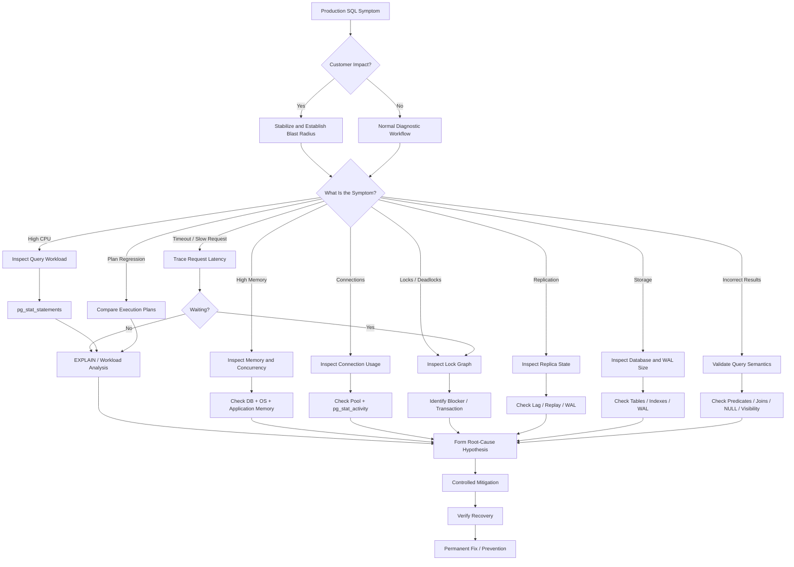
```mermaid
flowchart TD
    A[Production SQL Symptom] --> B{Customer Impact?}

    B -->|Yes| C[Stabilize and Establish Blast Radius]
    B -->|No| D[Normal Diagnostic Workflow]

    C --> E{What Is the Symptom?}
    D --> E

    E -->|Timeout / Slow Request| F[Trace Request Latency]
    E -->|High CPU| G[Inspect Query Workload]
    E -->|High Memory| H[Inspect Memory and Concurrency]
    E -->|Connections| I[Inspect Connection Usage]
    E -->|Locks / Deadlocks| J[Inspect Lock Graph]
    E -->|Replication| K[Inspect Replica State]
    E -->|Storage| L[Inspect Database and WAL Size]
    E -->|Incorrect Results| M[Validate Query Semantics]
    E -->|Plan Regression| N[Compare Execution Plans]

    F --> O{Waiting?}
    O -->|Yes| J
    O -->|No| P[EXPLAIN / Workload Analysis]

    G --> Q[pg_stat_statements]
    Q --> P

    H --> R[Check DB + OS + Application Memory]
    I --> S[Check Pool + pg_stat_activity]

    J --> T[Identify Blocker / Transaction]
    K --> U[Check Lag / Replay / WAL]
    L --> V[Check Tables / Indexes / WAL]

    M --> W[Check Predicates / Joins / NULL / Visibility]
    N --> P

    P --> X[Form Root-Cause Hypothesis]
    R --> X
    S --> X
    T --> X
    U --> X
    V --> X
    W --> X

    X --> Y[Controlled Mitigation]
    Y --> Z[Verify Recovery]
    Z --> AA[Permanent Fix / Prevention]
```

---

## Incident vs Normal Troubleshooting

The workflow differs depending on customer impact.

### Production Incident

Use:

```text
stabilize
→
diagnose
→
mitigate
→
verify
→
root cause
```

### Normal Performance Investigation

Use:

```text
reproduce
→
measure
→
inspect
→
optimize
→
benchmark
→
deploy
→
monitor
```

During an active outage, do not spend excessive time seeking a perfect explanation before reducing impact.

---

## Step: Confirm the Environment

Before diagnosing anything, confirm where you are connected.

```sql
SELECT
    current_database() AS database_name,
    current_user AS current_user,
    inet_server_addr() AS server_address,
    inet_server_port() AS server_port,
    version() AS postgres_version;
```

This prevents one of the most dangerous operational mistakes:

```text
diagnosing or modifying the wrong database
```

This is especially important with:

```text
multiple AWS regions
+
staging/production
+
read replicas
+
failover environments
```

---

## Step: Determine Primary vs Replica

```sql
SELECT pg_is_in_recovery();
```

Interpretation:

```text
false → primary
true  → standby / recovery mode
```

This matters because the operational options differ substantially between primary and replica.

---

## Step: Establish Blast Radius

Determine:

```text
Which service?
Which endpoint?
Which database?
Read or write?
All users or subset?
Primary or replica?
One region or multiple?
When did it start?
What changed?
```

A useful timeline might be:

```text
14:05 deployment
14:08 query latency ↑
14:09 DB CPU ↑
14:10 pool wait ↑
14:11 HTTP 5xx ↑
```

The correlation does not prove causation, but it identifies a strong investigation path.

---

## Connection Troubleshooting Branch

Start with:

```sql
SELECT
    state,
    count(*) AS connections
FROM pg_stat_activity
GROUP BY state
ORDER BY connections DESC;
```

Then:

```sql
SELECT
    application_name,
    state,
    count(*) AS connections
FROM pg_stat_activity
GROUP BY application_name, state
ORDER BY connections DESC;
```

Then inspect capacity:

```sql
SELECT
    count(*) AS current_connections,
    current_setting('max_connections')::integer AS max_connections,
    round(
        100.0 * count(*) /
        current_setting('max_connections')::integer,
        2
    ) AS utilization_percent
FROM pg_stat_activity;
```

---

## Connection Decision Tree

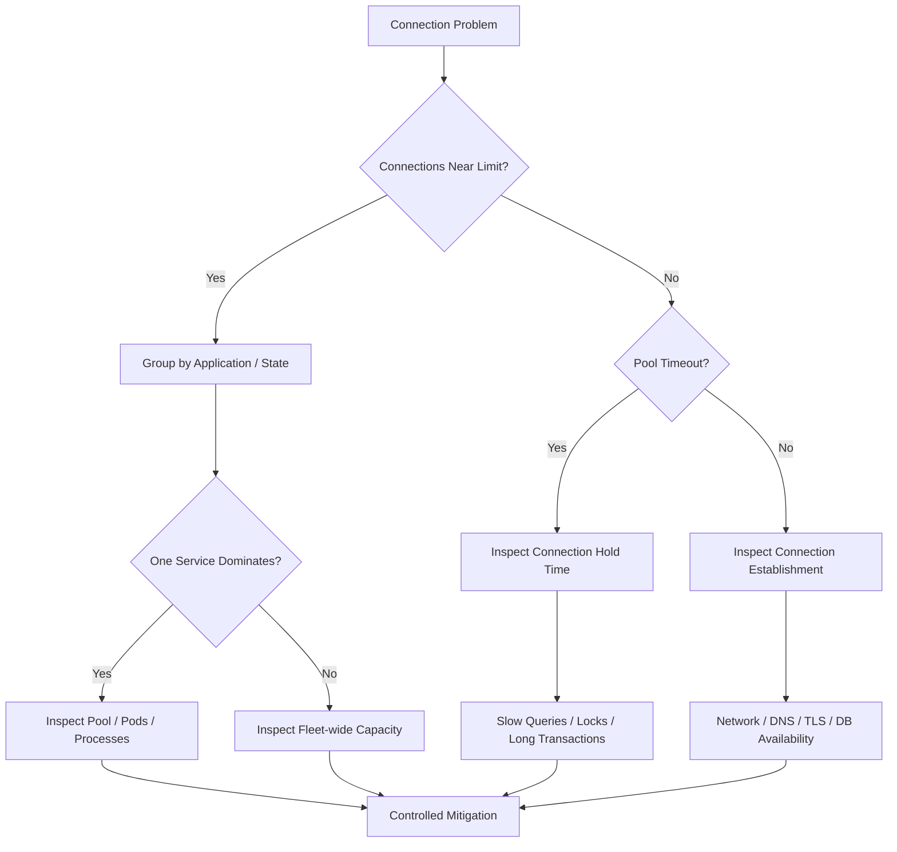
```mermaid
flowchart TD
    A[Connection Problem] --> B{Connections Near Limit?}

    B -->|Yes| C[Group by Application / State]
    B -->|No| D{Pool Timeout?}

    C --> E{One Service Dominates?}
    E -->|Yes| F[Inspect Pool / Pods / Processes]
    E -->|No| G[Inspect Fleet-wide Capacity]

    D -->|Yes| H[Inspect Connection Hold Time]
    D -->|No| I[Inspect Connection Establishment]

    H --> J[Slow Queries / Locks / Long Transactions]
    I --> K[Network / DNS / TLS / DB Availability]

    F --> L[Controlled Mitigation]
    G --> L
    J --> L
    K --> L
```

---

## If Connections Are High

Calculate:

```text
pods
×
processes
×
pool size
```

Include:

```text
max overflow
+
Celery workers
+
Kafka consumers
+
migration jobs
+
administrative sessions
```

Example:

```text
12 pods
×
4 processes
×
10 pool connections
=
480 potential connections
```

This may be far larger than the PostgreSQL instance can safely support.

Do not immediately increase:

```sql
max_connections
```

because additional connections can increase memory and concurrency pressure.

---

## If Pool Acquisition Is Slow

The important question is:

```text
Why are connections not being returned?
```

Investigate:

```text
slow queries
+
lock waits
+
long transactions
+
idle transactions
+
connection leaks
+
external calls inside transactions
```

A pool timeout is often a **secondary symptom**.

---

## Query Troubleshooting Branch

Inspect active queries:

```sql
SELECT
    pid,
    application_name,
    usename,
    state,
    query_start,
    now() - query_start AS duration,
    wait_event_type,
    wait_event,
    query
FROM pg_stat_activity
WHERE state = 'active'
ORDER BY query_start;
```

Then ask:

```text
Is the query executing?
Is it waiting?
Is it blocked?
Is it CPU-heavy?
Is it doing excessive I/O?
```

---

## Slow Query Decision Tree

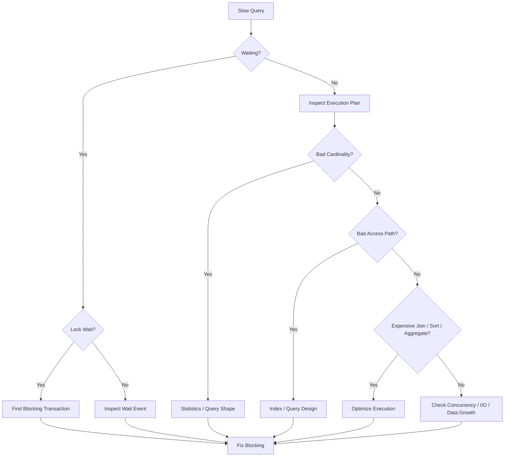
```mermaid
flowchart TD
    A[Slow Query] --> B{Waiting?}

    B -->|Yes| C{Lock Wait?}
    B -->|No| D[Inspect Execution Plan]

    C -->|Yes| E[Find Blocking Transaction]
    C -->|No| F[Inspect Wait Event]

    D --> G{Bad Cardinality?}
    G -->|Yes| H[Statistics / Query Shape]
    G -->|No| I{Bad Access Path?}

    I -->|Yes| J[Index / Query Design]
    I -->|No| K{Expensive Join / Sort / Aggregate?}

    K -->|Yes| L[Optimize Execution]
    K -->|No| M[Check Concurrency / I/O / Data Growth]

    E --> N[Fix Blocking]
    F --> N
    H --> N
    J --> N
    L --> N
    M --> N
```

---

## If the Query Is Waiting

Inspect:

```sql
SELECT
    pid,
    application_name,
    wait_event_type,
    wait_event,
    query_start,
    now() - query_start AS duration,
    query
FROM pg_stat_activity
WHERE wait_event IS NOT NULL
ORDER BY query_start;
```

If the wait is lock-related, inspect blockers.

```sql
SELECT
    blocked.pid AS blocked_pid,
    blocking.pid AS blocking_pid,
    blocked.query AS blocked_query,
    blocking.query AS blocking_query
FROM pg_stat_activity AS blocked
JOIN pg_stat_activity AS blocking
    ON blocking.pid = ANY(pg_blocking_pids(blocked.pid));
```

Do not optimize SQL before establishing that the query is actually executing.

---

## If the Query Is CPU-Bound

Inspect workload:

```sql
SELECT
    query,
    calls,
    total_exec_time,
    mean_exec_time,
    rows
FROM pg_stat_statements
ORDER BY total_exec_time DESC
LIMIT 20;
```

Then investigate:

```text
query frequency
+
execution plan
+
cardinality
+
joins
+
sorts
+
aggregation
+
concurrency
```

High CPU can result from:

```text
one expensive query
```

or:

```text
millions of moderately expensive queries
```

---

## If the Query Is I/O-Bound

Use:

```sql
EXPLAIN (ANALYZE, BUFFERS)
SELECT ...;
```

Inspect:

```text
shared block reads
+
shared block hits
+
temporary reads
+
temporary writes
```

Then correlate with infrastructure metrics.

Possible causes include:

```text
large sequential scans
+
poor index usage
+
cache pressure
+
data growth
+
sort/hash spills
```

---

## If the Query Plan Looks Wrong

Compare:

```text
estimated rows
vs
actual rows
```

Example:

```text
estimated = 100
actual    = 5,000,000
```

Investigate:

```text
statistics
+
data distribution
+
correlated columns
+
query predicates
+
recent data changes
```

Do not assume that the index is the problem.

---

## Index Decision Tree

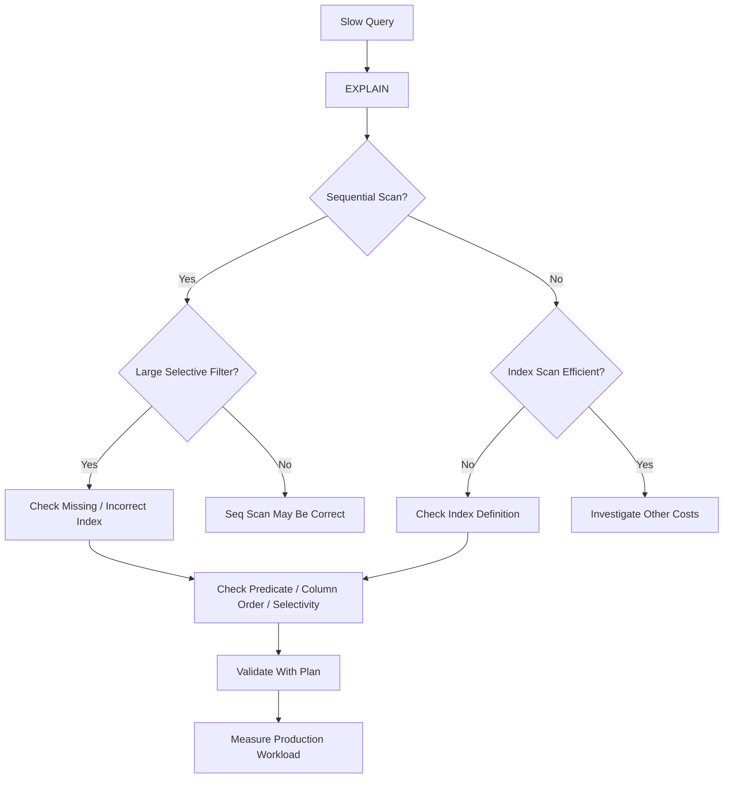
```mermaid
flowchart TD
    A[Slow Query] --> B[EXPLAIN]
    B --> C{Sequential Scan?}

    C -->|No| D{Index Scan Efficient?}
    C -->|Yes| E{Large Selective Filter?}

    E -->|Yes| F[Check Missing / Incorrect Index]
    E -->|No| G[Seq Scan May Be Correct]

    D -->|No| H[Check Index Definition]
    D -->|Yes| I[Investigate Other Costs]

    F --> J[Check Predicate / Column Order / Selectivity]
    H --> J

    J --> K[Validate With Plan]
    K --> L[Measure Production Workload]
```

A sequential scan is not automatically a defect.

The correct question is:

```text
Is the chosen access path appropriate for this workload?
```

---

## If an Index Is Suspected

Inspect indexes:

```sql
SELECT
    schemaname,
    tablename,
    indexname,
    indexdef
FROM pg_indexes
WHERE schemaname NOT IN ('pg_catalog', 'information_schema')
ORDER BY schemaname, tablename, indexname;
```

Then evaluate:

```text
equality predicates
+
range predicates
+
ordering
+
join conditions
+
partial predicates
+
expression usage
```

Do not add an index without validating its workload impact.

---

## If Query Returns No Rows

Start with the base relation:

```sql
SELECT *
FROM target_table
LIMIT 20;
```

Then add predicates incrementally.

```text
base table
    ↓
WHERE
    ↓
JOIN
    ↓
additional filters
    ↓
GROUP BY / HAVING
```

Check:

```text
NULL
+
case
+
whitespace
+
boolean values
+
timestamps
+
time zones
+
tenant filters
+
soft deletes
+
RLS
```

---

## No-Rows Decision Tree

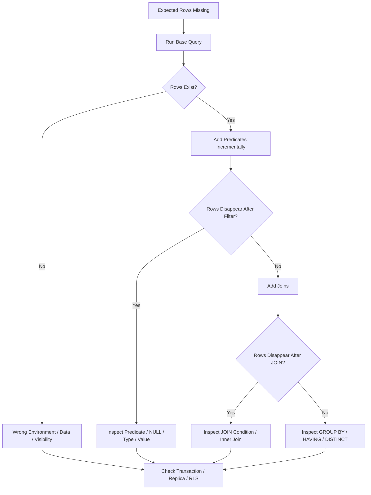
```mermaid
flowchart TD
    A[Expected Rows Missing] --> B[Run Base Query]
    B --> C{Rows Exist?}

    C -->|No| D[Wrong Environment / Data / Visibility]
    C -->|Yes| E[Add Predicates Incrementally]

    E --> F{Rows Disappear After Filter?}
    F -->|Yes| G[Inspect Predicate / NULL / Type / Value]
    F -->|No| H[Add Joins]

    H --> I{Rows Disappear After JOIN?}
    I -->|Yes| J[Inspect JOIN Condition / Inner Join]
    I -->|No| K[Inspect GROUP BY / HAVING / DISTINCT]

    D --> L[Check Transaction / Replica / RLS]
    G --> L
    J --> L
    K --> L
```

---

## If Query Returns Too Many Rows

Determine the expected grain.

Example:

```text
one order
```

versus:

```text
one row per order item
```

A join can multiply rows:

```text
customer
  1
  ↓
orders
  N
  ↓
order_items
  N
```

Investigate:

```text
missing join predicates
+
many-to-many relationships
+
duplicate data
+
incorrect result grain
```

Do not automatically fix the result with:

```sql
DISTINCT
```

`DISTINCT` can hide the underlying cardinality problem and introduce additional work.

---

## Incorrect Results Decision Tree

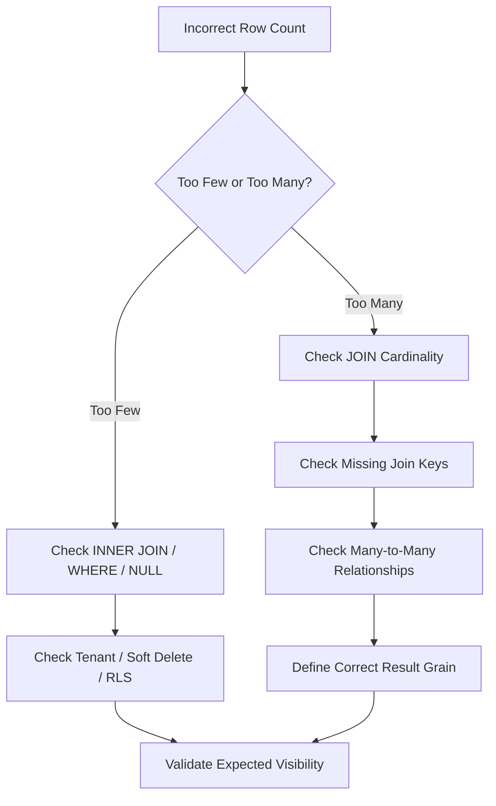
```mermaid
flowchart TD
    A[Incorrect Row Count] --> B{Too Few or Too Many?}

    B -->|Too Few| C[Check INNER JOIN / WHERE / NULL]
    B -->|Too Many| D[Check JOIN Cardinality]

    C --> E[Check Tenant / Soft Delete / RLS]
    D --> F[Check Missing Join Keys]

    F --> G[Check Many-to-Many Relationships]
    G --> H[Define Correct Result Grain]

    E --> I[Validate Expected Visibility]
    H --> I
```

---

## NULL Troubleshooting

Remember:

```sql
column = NULL
```

does not test for NULL.

Use:

```sql
column IS NULL
```

or:

```sql
column IS NOT NULL
```

Also be careful with:

```sql
NOT IN
```

when NULL values can exist in the subquery.

For existence checks, `EXISTS` is often clearer and safer.

---

## JOIN Troubleshooting

When a join produces unexpected results, inspect each relationship independently.

```sql
SELECT count(*)
FROM orders;
```

Then:

```sql
SELECT count(*)
FROM orders
JOIN customers
    ON customers.id = orders.customer_id;
```

Then inspect duplicate relationships.

```sql
SELECT
    customer_id,
    count(*)
FROM orders
GROUP BY customer_id
HAVING count(*) > 1
ORDER BY count(*) DESC;
```

The exact diagnostic should match the intended cardinality.

---

## Aggregation Troubleshooting

If an aggregate is wrong, verify:

```text
GROUP BY grain
+
JOIN multiplication
+
WHERE vs HAVING
+
NULL behavior
+
duplicate source rows
```

For example:

```sql
SELECT
    customer_id,
    count(*) AS order_count
FROM orders
GROUP BY customer_id;
```

If `orders` was joined to another one-to-many table first, the count may no longer represent orders.

---

## Date and Time Troubleshooting

When date queries produce unexpected results, verify:

```text
data type
+
timezone
+
session timezone
+
inclusive/exclusive boundaries
+
application timezone
```

Inspect:

```sql
SHOW timezone;
```

Prefer half-open intervals for time ranges:

```sql
WHERE created_at >= $1
  AND created_at < $2
```

This avoids many boundary and timestamp precision problems.

---

## Type Conversion Troubleshooting

Unexpected results can come from:

```text
integer vs text
+
UUID vs text
+
timestamp vs timestamptz
+
implicit casts
+
application serialization
```

Inspect column definitions:

```sql
SELECT
    column_name,
    data_type,
    udt_name
FROM information_schema.columns
WHERE table_schema = 'public'
  AND table_name = 'orders'
ORDER BY ordinal_position;
```

Avoid unnecessary casts that can prevent efficient index usage.

---

## Timeout Decision Tree

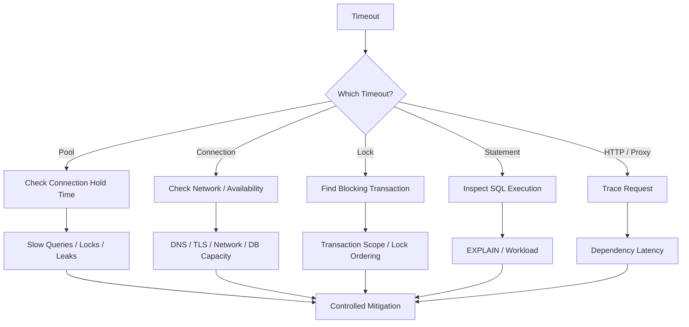
```mermaid
flowchart TD
    A[Timeout] --> B{Which Timeout?}

    B -->|Pool| C[Check Connection Hold Time]
    B -->|Connection| D[Check Network / Availability]
    B -->|Lock| E[Find Blocking Transaction]
    B -->|Statement| F[Inspect SQL Execution]
    B -->|HTTP / Proxy| G[Trace Request]

    C --> H[Slow Queries / Locks / Leaks]
    D --> I[DNS / TLS / Network / DB Capacity]
    E --> J[Transaction Scope / Lock Ordering]
    F --> K[EXPLAIN / Workload]
    G --> L[Dependency Latency]

    H --> M[Controlled Mitigation]
    I --> M
    J --> M
    K --> M
    L --> M
```

---

## If Requests Time Out but Database CPU Is Low

Do not assume PostgreSQL is healthy.

Investigate:

```text
pool acquisition
+
lock waits
+
network latency
+
external dependencies
+
application worker saturation
```

A common pattern is:

```text
DB CPU = 30%
DB connections = 100%
many sessions waiting on locks
API p99 = 15s
```

The bottleneck is contention, not CPU.

---

## If Requests Time Out and Database CPU Is High

Investigate:

```text
top queries
+
query frequency
+
execution plans
+
retry storms
+
connection concurrency
+
background workers
```

Then determine whether CPU is caused by:

```text
query complexity
+
query volume
+
concurrency
+
maintenance
```

---

## If API Is Slow but SQL Is Fast

Trace the complete request:

```text
Nginx / LB
    ↓
application queue
    ↓
DB pool
    ↓
SQL
    ↓
Redis
    ↓
external HTTP/gRPC
    ↓
serialization
```

Example:

```text
DB query       = 50ms
Redis          = 20ms
external API   = 2s
serialization  = 100ms
pool wait      = 800ms
```

The database query is not the primary latency problem.

---

## High CPU Decision Tree

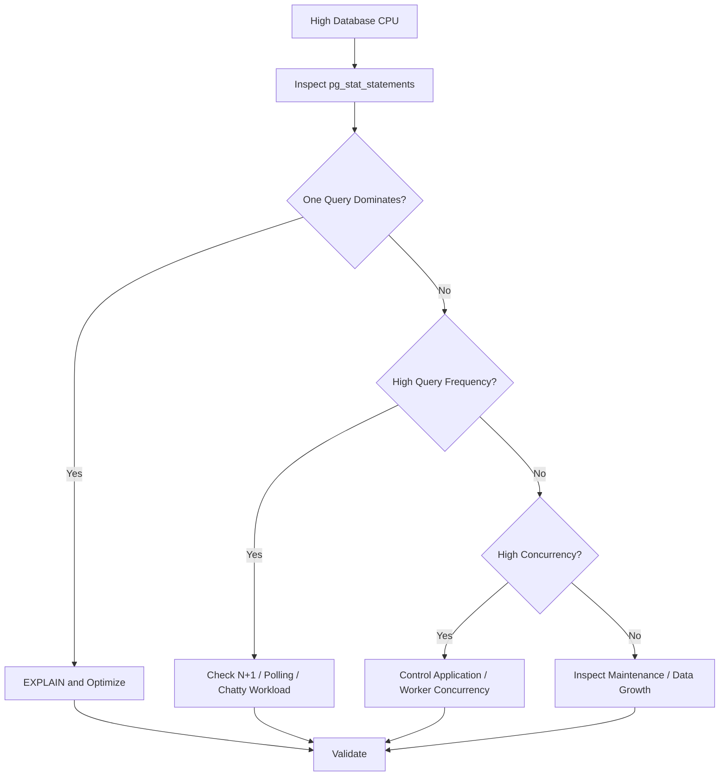
```mermaid
flowchart TD
    A[High Database CPU] --> B[Inspect pg_stat_statements]
    B --> C{One Query Dominates?}

    C -->|Yes| D[EXPLAIN and Optimize]
    C -->|No| E{High Query Frequency?}

    E -->|Yes| F[Check N+1 / Polling / Chatty Workload]
    E -->|No| G{High Concurrency?}

    G -->|Yes| H[Control Application / Worker Concurrency]
    G -->|No| I[Inspect Maintenance / Data Growth]

    D --> J[Validate]
    F --> J
    H --> J
    I --> J
```

---

## High Memory Decision Tree

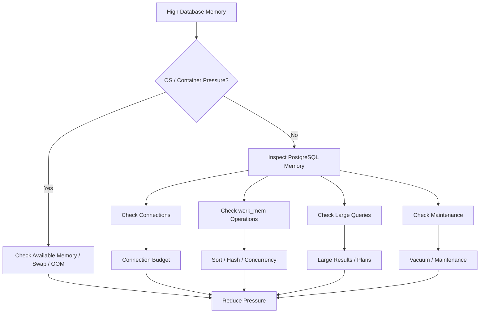
```mermaid
flowchart TD
    A[High Database Memory] --> B{OS / Container Pressure?}

    B -->|Yes| C[Check Available Memory / Swap / OOM]
    B -->|No| D[Inspect PostgreSQL Memory]

    D --> E[Check Connections]
    D --> F[Check work_mem Operations]
    D --> G[Check Large Queries]
    D --> H[Check Maintenance]

    E --> I[Connection Budget]
    F --> J[Sort / Hash / Concurrency]
    G --> K[Large Results / Plans]
    H --> L[Vacuum / Maintenance]

    C --> M[Reduce Pressure]
    I --> M
    J --> M
    K --> M
    L --> M
```

Remember:

```text
work_mem
```

is not simply one global memory allocation.

Multiple operations and concurrent sessions can consume it.

---

## Lock Troubleshooting Decision Tree

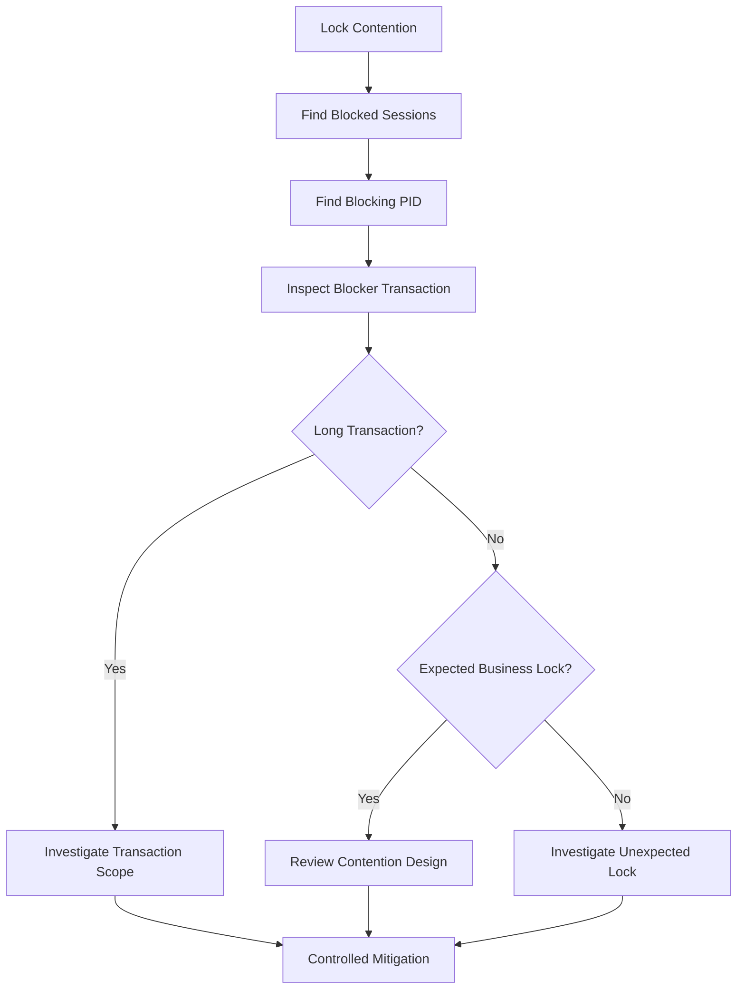
```mermaid
flowchart TD
    A[Lock Contention] --> B[Find Blocked Sessions]
    B --> C[Find Blocking PID]
    C --> D[Inspect Blocker Transaction]

    D --> E{Long Transaction?}
    E -->|Yes| F[Investigate Transaction Scope]
    E -->|No| G{Expected Business Lock?}

    G -->|Yes| H[Review Contention Design]
    G -->|No| I[Investigate Unexpected Lock]

    F --> J[Controlled Mitigation]
    H --> J
    I --> J
```

Use:

```sql
SELECT
    pid,
    application_name,
    xact_start,
    now() - xact_start AS transaction_age,
    state,
    query
FROM pg_stat_activity
WHERE xact_start IS NOT NULL
ORDER BY xact_start;
```

---

## Deadlock Decision Tree

```text
Deadlock detected
    ↓
SQLSTATE 40P01
    ↓
Inspect PostgreSQL logs
    ↓
Reconstruct lock cycle
    ↓
Identify inconsistent lock ordering
    ↓
Normalize acquisition order
    ↓
Retry whole transaction where appropriate
```

Deadlocks should normally be fixed through:

```text
lock ordering
+
short transactions
+
bounded retry
```

rather than by simply increasing timeouts.

---

## Replication Troubleshooting Decision Tree

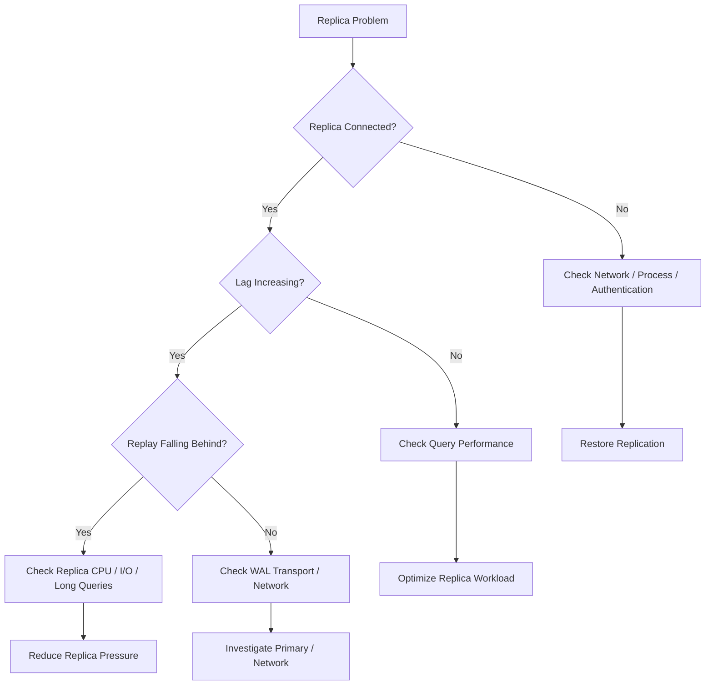
```mermaid
flowchart TD
    A[Replica Problem] --> B{Replica Connected?}

    B -->|No| C[Check Network / Process / Authentication]
    B -->|Yes| D{Lag Increasing?}

    D -->|No| E[Check Query Performance]
    D -->|Yes| F{Replay Falling Behind?}

    F -->|Yes| G[Check Replica CPU / I/O / Long Queries]
    F -->|No| H[Check WAL Transport / Network]

    C --> I[Restore Replication]
    E --> J[Optimize Replica Workload]
    G --> K[Reduce Replica Pressure]
    H --> L[Investigate Primary / Network]
```

Inspect:

```sql
SELECT
    application_name,
    state,
    sync_state,
    write_lag,
    flush_lag,
    replay_lag
FROM pg_stat_replication;
```

---

## Storage Troubleshooting Decision Tree

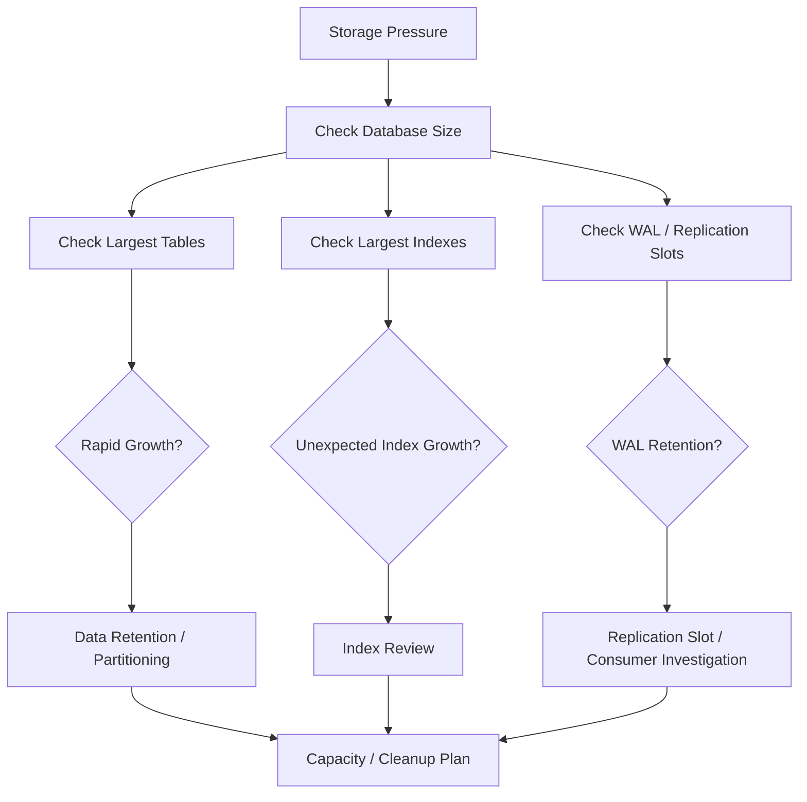
```mermaid
flowchart TD
    A[Storage Pressure] --> B[Check Database Size]
    B --> C[Check Largest Tables]
    B --> D[Check Largest Indexes]
    B --> E[Check WAL / Replication Slots]

    C --> F{Rapid Growth?}
    D --> G{Unexpected Index Growth?}
    E --> H{WAL Retention?}

    F --> I[Data Retention / Partitioning]
    G --> J[Index Review]
    H --> K[Replication Slot / Consumer Investigation]

    I --> L[Capacity / Cleanup Plan]
    J --> L
    K --> L
```

Useful queries include:

```sql
SELECT
    datname,
    pg_size_pretty(pg_database_size(datname)) AS size
FROM pg_database
ORDER BY pg_database_size(datname) DESC;
```

and:

```sql
SELECT
    schemaname,
    relname,
    pg_size_pretty(pg_total_relation_size(relid)) AS total_size
FROM pg_catalog.pg_statio_user_tables
ORDER BY pg_total_relation_size(relid) DESC
LIMIT 20;
```

---

## Query Plan Troubleshooting

Use:

```sql
EXPLAIN
SELECT ...;
```

for a plan without executing the statement.

Use:

```sql
EXPLAIN (ANALYZE, BUFFERS)
SELECT ...;
```

when actual execution is safe and appropriate.

Inspect:

```text
estimated rows
actual rows
loops
scan type
join strategy
sort
hash
buffer activity
temporary I/O
```

Remember:

> Execution-plan `cost` is not elapsed time in milliseconds.

---

## Plan Regression Decision Tree

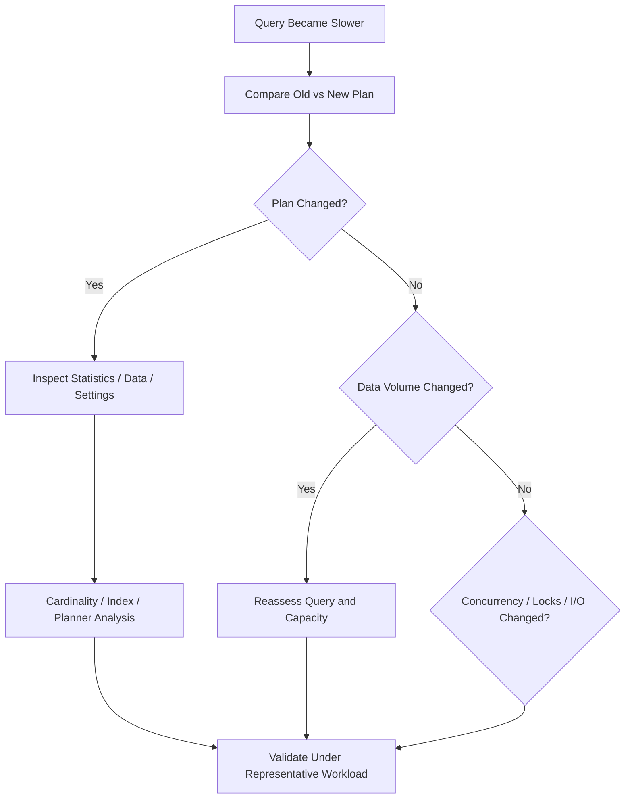
```mermaid
flowchart TD
    A[Query Became Slower] --> B[Compare Old vs New Plan]
    B --> C{Plan Changed?}

    C -->|Yes| D[Inspect Statistics / Data / Settings]
    C -->|No| E{Data Volume Changed?}

    D --> F[Cardinality / Index / Planner Analysis]
    E -->|Yes| G[Reassess Query and Capacity]
    E -->|No| H{Concurrency / Locks / I/O Changed?}

    F --> I[Validate Under Representative Workload]
    G --> I
    H --> I
```

---

## Maintenance Troubleshooting

When performance degrades gradually, inspect:

```text
vacuum
+
autovacuum
+
analyze
+
dead tuples
+
table growth
+
index growth
```

Useful query:

```sql
SELECT
    schemaname,
    relname,
    n_live_tup,
    n_dead_tup,
    last_autovacuum,
    last_autoanalyze
FROM pg_stat_user_tables
ORDER BY n_dead_tup DESC
LIMIT 20;
```

Do not diagnose bloat from a single metric alone.

---

## Statistics Troubleshooting

If the planner estimates incorrectly:

```text
estimated rows ≠ actual rows
```

investigate:

```text
ANALYZE freshness
+
data distribution
+
column statistics
+
correlated predicates
+
extended statistics
```

Inspect:

```sql
SELECT
    schemaname,
    tablename,
    attname,
    n_distinct,
    most_common_vals,
    most_common_freqs
FROM pg_stats
WHERE schemaname = 'public'
LIMIT 50;
```

---

## ORM Troubleshooting Decision Tree

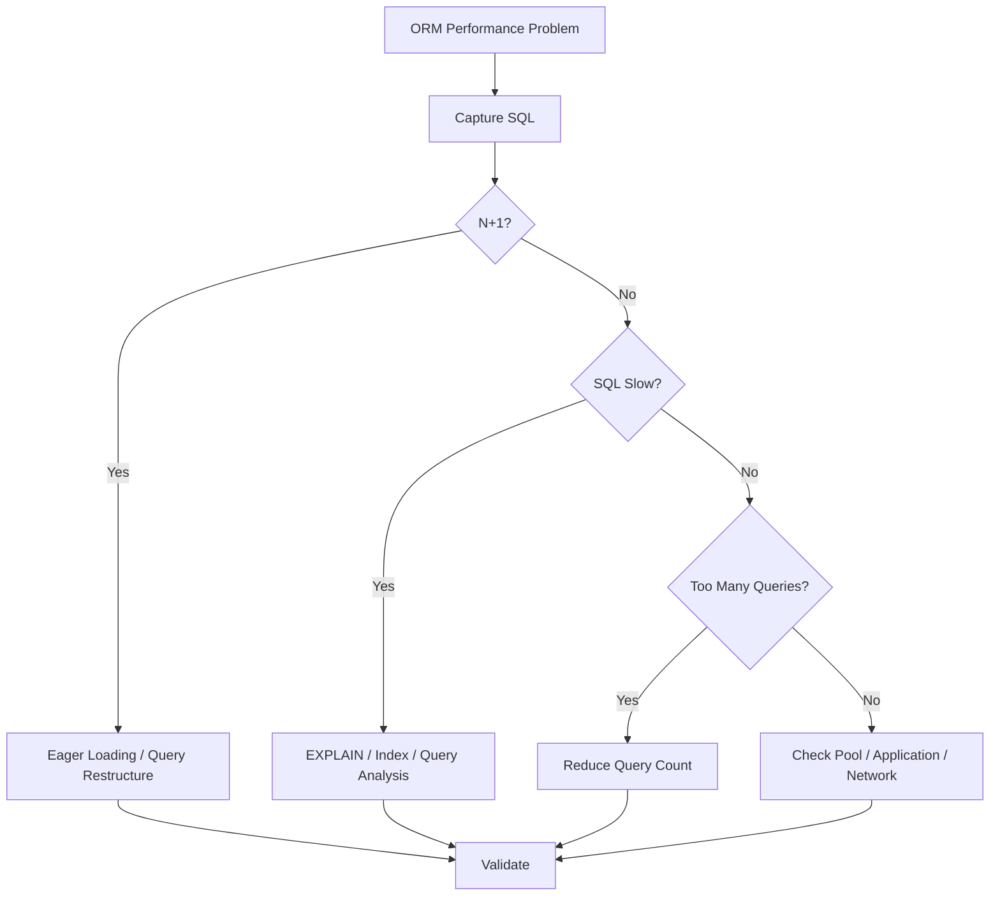
```mermaid
flowchart TD
    A[ORM Performance Problem] --> B[Capture SQL]
    B --> C{N+1?}

    C -->|Yes| D[Eager Loading / Query Restructure]
    C -->|No| E{SQL Slow?}

    E -->|Yes| F[EXPLAIN / Index / Query Analysis]
    E -->|No| G{Too Many Queries?}

    G -->|Yes| H[Reduce Query Count]
    G -->|No| I[Check Pool / Application / Network]

    D --> J[Validate]
    F --> J
    H --> J
    I --> J
```

The ORM does not eliminate database behavior.

Django or SQLAlchemy ultimately produces SQL that PostgreSQL must execute.

---

## Multi-Tenant Troubleshooting

When one tenant reports incorrect or slow results, investigate:

```text
tenant filter
+
RLS
+
indexes
+
tenant data volume
+
connection context
+
replica lag
```

For RLS systems, also verify:

```text
current database role
+
policy definition
+
tenant context
+
table ownership
+
BYPASSRLS
```

Never disable RLS simply to prove that data exists.

---

## Read-After-Write Troubleshooting

A common distributed database issue:

```text
write → primary
read  → replica
```

If replication is asynchronous:

```text
write succeeds
    ↓
replica has not replayed WAL
    ↓
read does not see new data
```

Investigate:

```text
replica lag
+
read routing
+
request consistency requirements
```

Possible solutions include:

```text
primary read
+
session-aware routing
+
LSN-aware routing
+
deliberate consistency model
```

---

## Cache-Related Troubleshooting

If PostgreSQL suddenly receives much more traffic:

```text
check Redis
```

A cache failure can produce:

```text
Redis unavailable
    ↓
cache misses ↑
    ↓
PostgreSQL reads ↑
    ↓
database CPU ↑
```

Therefore:

```text
database overload
```

may be a secondary failure.

---

## Background Workload Troubleshooting

Include:

```text
Celery
+
Kafka consumers
+
scheduled jobs
+
reporting
+
data exports
```

A background workload can consume:

```text
connections
+
CPU
+
I/O
+
locks
```

while the API itself has not changed.

---

## Deployment Correlation

When an incident starts after deployment, compare:

```text
application version
+
query workload
+
connection count
+
pod count
+
worker count
+
database CPU
```

A deployment can increase database load without changing the database itself.

Examples:

```text
new endpoint
+
N+1 query
```

or:

```text
new worker concurrency
+
database write amplification
```

---

## Kubernetes Scaling Branch

When pods increase:

```text
pods ↑
    ↓
processes ↑
    ↓
pool capacity ↑
    ↓
database concurrency ↑
```

This means autoscaling can accidentally overload PostgreSQL.

Database-aware scaling should consider:

```text
CPU
+
request rate
+
pool utilization
+
database capacity
```

rather than application CPU alone.

---

## Production Decision Matrix

| Symptom | Check first | Common root causes |
|---|---|---|
| API timeout | Trace + pool | SQL, locks, dependencies |
| Pool timeout | Pool + connections | Slow queries, leaks, locks |
| High CPU | `pg_stat_statements` | Expensive/high-volume queries |
| High memory | Connections + concurrency | `work_mem`, connections, large operations |
| Lock wait | `pg_blocking_pids()` | Long transaction, hot row |
| Deadlock | Logs + lock cycle | Inconsistent lock ordering |
| No rows | Incremental query | Predicate, join, NULL, visibility |
| Too many rows | Result grain | Join multiplication |
| Slow query | EXPLAIN | Plan, cardinality, I/O |
| Replica lag | `pg_stat_replication` | Replay, I/O, workload |
| Storage pressure | Object sizes + WAL | Data, indexes, bloat, retained WAL |
| N+1 | Query count | ORM access pattern |
| Sudden DB load | Recent changes | Deployment, cache failure, retries |
| Write failures | DB logs + storage | Constraints, capacity, locks |
| Gradual slowdown | Stats + growth | Data volume, maintenance, plan changes |

---

## Production Troubleshooting Sequence

A practical general-purpose sequence is:

### Establish Impact

```text
What is broken?
Who is affected?
When did it start?
```

### Confirm Database Context

```sql
SELECT
    current_database(),
    current_user,
    inet_server_addr(),
    pg_is_in_recovery();
```

### Check Connections

```sql
SELECT
    application_name,
    state,
    count(*)
FROM pg_stat_activity
GROUP BY application_name, state
ORDER BY count(*) DESC;
```

### Check Active Queries

```sql
SELECT
    pid,
    application_name,
    now() - query_start AS duration,
    wait_event_type,
    wait_event,
    query
FROM pg_stat_activity
WHERE state = 'active'
ORDER BY query_start;
```

### Check Locks

```sql
SELECT
    blocked.pid AS blocked_pid,
    blocking.pid AS blocking_pid
FROM pg_stat_activity AS blocked
JOIN pg_stat_activity AS blocking
    ON blocking.pid = ANY(pg_blocking_pids(blocked.pid));
```

### Check Workload

```sql
SELECT
    query,
    calls,
    total_exec_time,
    mean_exec_time
FROM pg_stat_statements
ORDER BY total_exec_time DESC
LIMIT 20;
```

### Check Replication if Relevant

```sql
SELECT
    application_name,
    state,
    sync_state,
    write_lag,
    flush_lag,
    replay_lag
FROM pg_stat_replication;
```

### Check Storage if Relevant

```sql
SELECT
    datname,
    pg_size_pretty(pg_database_size(datname))
FROM pg_database
ORDER BY pg_database_size(datname) DESC;
```

---

## From Symptom to Root Cause

A useful troubleshooting table is:

| Symptom | Evidence | Hypothesis | Validation |
|---|---|---|---|
| API timeout | Pool wait high | Connections occupied | Pool + DB sessions |
| DB CPU high | Query total time high | Expensive workload | `pg_stat_statements` |
| Query slow | Lock wait | Blocking transaction | `pg_blocking_pids()` |
| Query slow | Actual rows huge | Bad cardinality estimate | `EXPLAIN ANALYZE` |
| Replica stale | Replay lag | Replica behind | `pg_stat_replication` |
| Storage full | WAL retained | Replication slot issue | `pg_replication_slots` |
| No rows | Join removes rows | Incorrect join | Incremental query |
| Too many rows | Row multiplication | Incorrect relationship | Grain analysis |
| High DB load | Redis errors | Cache failure | Redis + DB metrics |
| Connections spike | Pod count increased | Scaling amplified DB load | Kubernetes + pool metrics |

---

## Safe Mitigation Hierarchy

During an incident, prefer actions in this order:

```text
reduce unnecessary workload
        ↓
disable expensive feature
        ↓
throttle background work
        ↓
rollback recent deployment
        ↓
route traffic appropriately
        ↓
cancel clearly identified harmful queries
        ↓
scale capacity when justified
        ↓
perform deeper remediation
```

The exact order depends on the failure.

Avoid irreversible changes while the system is unstable unless they are clearly required.

---

## Query Cancellation

For a clearly identified harmful query:

```sql
SELECT pg_cancel_backend(<pid>);
```

This requests cancellation of the current query.

For a session that must be terminated:

```sql
SELECT pg_terminate_backend(<pid>);
```

Use termination carefully.

Before acting, verify:

```text
PID
+
application
+
query
+
transaction
+
business impact
```

---

## Recovery Verification

After mitigation, verify:

```text
API errors
+
API latency
+
database CPU
+
database memory
+
connections
+
pool utilization
+
query latency
+
lock waits
+
replication lag
```

Do not declare recovery because one metric returned to normal.

A healthy recovery should be sustained.

---

## Root-Cause Analysis

After the system stabilizes, ask:

```text
What changed?
What failed first?
What resource became constrained?
Why did the workload increase?
Why did the system amplify the failure?
Why was it not detected earlier?
Why did mitigation take the observed amount of time?
What prevents recurrence?
```

A mature root-cause analysis identifies:

```text
root cause
+
contributing factors
+
amplifiers
+
detection gaps
+
mitigation gaps
```

---

## Common Troubleshooting Mistakes

### Starting With an Index

A slow query does not automatically require an index.

The query may be:

```text
blocked
+
CPU-bound
+
I/O-bound
+
returning too many rows
```

### Assuming High CPU Means One Bad Query

High CPU may result from millions of moderately expensive queries.

Check total workload.

### Increasing Timeouts

Timeouts may be protecting the system from excessive resource occupancy.

Increasing them can worsen the incident.

### Increasing `max_connections`

More connections can increase:

```text
memory
+
CPU
+
contention
```

### Killing Sessions Randomly

Termination can affect critical transactions and destroy useful evidence.

### Running Expensive Diagnostics

A production diagnostic query can itself consume database resources.

### Ignoring Application Behavior

Database symptoms frequently originate from:

```text
ORM changes
+
pool configuration
+
autoscaling
+
retry storms
+
cache failures
```

### Trusting One Metric

CPU, memory, latency, and connections must be interpreted together.

### Using `DISTINCT` to Hide Join Bugs

This may conceal incorrect cardinality while adding sorting or hashing work.

### Declaring Recovery Too Early

A temporary metric improvement does not prove the system is stable.

---

## Security Considerations

Production diagnostics can expose:

```text
SQL text
+
database usernames
+
client addresses
+
application names
+
potentially sensitive values
```

Use:

```text
least-privilege operational access
+
audited administrative roles
+
secure credentials
+
controlled incident channels
```

Do not copy unrestricted production query output into public documentation or tickets.

---

## Reliability and High Availability

A troubleshooting workflow should account for:

```text
primary failure
+
replica lag
+
failover
+
connection recovery
+
retry storms
```

After failover, verify:

```text
application connectivity
+
new primary health
+
replication
+
connection pool recovery
+
transaction behavior
```

Automatic failover does not guarantee automatic application recovery.

---

## Disaster Recovery

For severe incidents, the troubleshooting process may escalate from:

```text
database mitigation
```

to:

```text
failover
```

or:

```text
point-in-time recovery
```

The team should know:

```text
RPO
+
RTO
+
backup location
+
restore procedure
+
recovery credentials
+
application recovery sequence
```

Restore procedures should be tested before an actual disaster.

---

## Monitoring Requirements

A production PostgreSQL environment should monitor at least:

```text
database CPU
database memory
I/O latency
storage utilization
connections
query latency
query volume
lock waits
deadlocks
transaction age
autovacuum activity
replication lag
WAL generation
```

Application monitoring should include:

```text
request latency
5xx rate
timeouts
pool acquisition latency
pool utilization
retry rate
worker concurrency
```

These signals must be correlated rather than interpreted independently.

---

## Interview Traps

### A Query Is Slow. What Do You Check First?

Determine whether it is:

```text
executing
```

or:

```text
waiting
```

Then inspect the execution plan if it is actually executing expensive work.

### CPU Is 100%. Should You Scale the Database?

Not immediately.

First identify:

```text
which queries
+
how often
+
why expensive
+
how much concurrency
```

### Connections Are at 90%. Is the Database Out of Capacity?

Not necessarily.

Investigate:

```text
application pools
+
connection states
+
query duration
+
transaction age
+
fleet-wide connection calculation
```

### API Requests Time Out but Database CPU Is Low. Why?

Possible causes include:

```text
pool exhaustion
+
lock contention
+
network latency
+
external dependencies
+
application worker saturation
```

### There Is a Sequential Scan. Should You Add an Index?

Not automatically.

Determine:

```text
table size
+
selectivity
+
query frequency
+
planner cost
+
actual execution time
```

### A Replica Is Behind. Should You Add Another Replica?

Not necessarily.

First determine whether the bottleneck is:

```text
network
+
WAL transport
+
replica CPU
+
replica I/O
+
long-running queries
```

### What Makes Someone Senior at Database Troubleshooting?

The ability to move from:

```text
symptom
```

to:

```text
measured evidence
```

to:

```text
system-level root cause
```

without making unsafe assumptions.

---

## Senior Troubleshooting Heuristic

Use this mental model:

```text
1. What is the customer-visible symptom?
2. What changed?
3. Which layer first became unhealthy?
4. What resource is constrained?
5. Is the system executing or waiting?
6. Which workload consumes the resource?
7. How is the failure amplified?
8. What is the safest reversible mitigation?
9. How do we verify recovery?
10. What permanent change prevents recurrence?
```

This is more valuable than memorizing hundreds of SQL diagnostic commands.

---

## Key Takeaways

- **Start from the symptom and follow evidence:** identify the affected layer, resource, wait state, workload, and failure propagation before changing database configuration.
- **Use decision trees to separate failure modes:** distinguish slow execution from lock waits, pool exhaustion, connection failures, replication lag, incorrect SQL results, and infrastructure problems.
- **Correlate PostgreSQL with the application:** Django/FastAPI query behavior, connection pools, Redis, Kafka, Celery, Kubernetes scaling, deployments, and retries can create or amplify database failures.
- **Mitigate safely before performing permanent fixes:** reduce workload, throttle background processing, roll back unsafe changes, or cancel clearly identified harmful operations before making risky schema or configuration changes.
- **Senior troubleshooting closes the loop:** verify sustained recovery, reconstruct the incident, identify root cause and contributing factors, and implement observability, testing, architecture, or code changes that prevent recurrence.