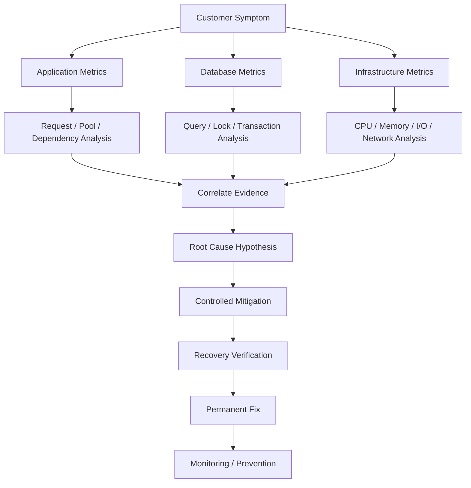
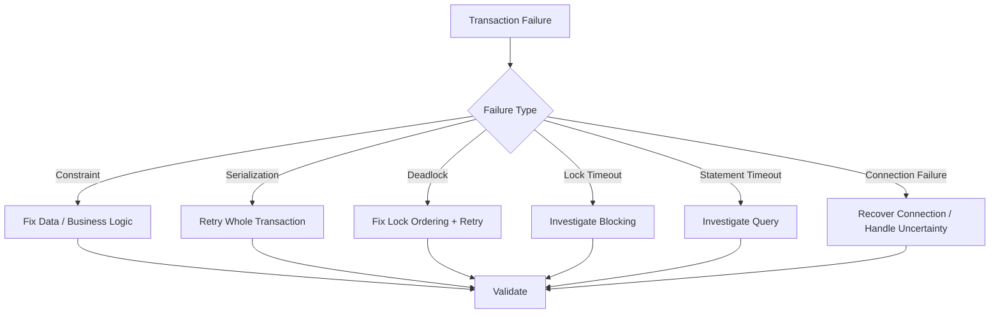
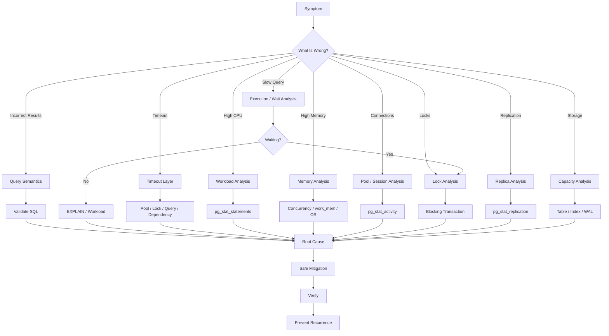
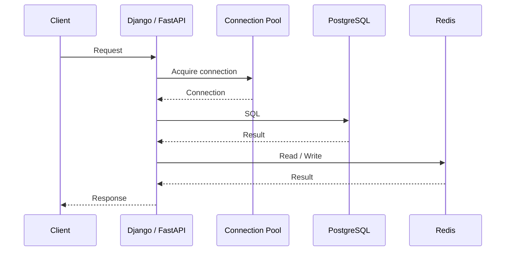

# README

## Overview

The **Troubleshooting** section is a practical reference for diagnosing SQL and database problems in production backend systems.

The goal is not to memorize isolated SQL commands. It is to develop a repeatable troubleshooting process that moves from:

```text
Observed symptom
    ↓
Evidence
    ↓
Hypothesis
    ↓
Diagnostic query / execution plan
    ↓
Root cause
    ↓
Controlled mitigation
    ↓
Verification
    ↓
Permanent prevention
```

The section focuses primarily on PostgreSQL and connects database behavior with the surrounding backend stack:

```text
Client
  ↓
Nginx / Load Balancer
  ↓
Django / FastAPI / gRPC
  ↓
Connection Pool
  ↓
PostgreSQL
  ↓
Redis / Kafka / Celery
  ↓
AWS / Kubernetes / Infrastructure
```

A production database problem is rarely isolated to SQL. Connection pools, application concurrency, transactions, locks, query plans, caching, background workers, replication, and infrastructure can all interact to produce the final symptom.

## Navigation

| # | Section | Layer | Description |
|---|---|---|---|
| 01 | [Troubleshooting](./README.md) | Production Engineering | Diagnosing query problems, slow queries, locks, timeouts, and production incidents |
| 02 | [01- SQL Troubleshooting Methodology](./01-%20SQL%20Troubleshooting%20Methodology.md) | Production Engineering | Structured approach to diagnosing SQL and database problems |
| 03 | [02- Query Returns No Rows](./02-%20Query%20Returns%20No%20Rows.md) | Production Engineering | Diagnose queries that unexpectedly return zero rows |
| 04 | [03- Query Returns Too Many Rows](./03-%20Query%20Returns%20Too%20Many%20Rows.md) | Production Engineering | Diagnose unexpected cardinality and join multiplication |
| 05 | [04- Duplicate Rows After JOIN](./04-%20Duplicate%20Rows%20After%20JOIN.md) | Production Engineering | Diagnose duplicate rows caused by join semantics |
| 06 | [05- Incorrect JOIN Results](./05-%20Incorrect%20JOIN%20Results.md) | Production Engineering | Diagnose incorrect join semantics and cardinality |
| 07 | [06- NULL Related Query Problems](./06-%20NULL%20Related%20Query%20Problems.md) | Production Engineering | Diagnose NULL semantics and three-valued logic issues |
| 08 | [07- Aggregation and GROUP BY Problems](./07-%20Aggregation%20and%20GROUP%20BY%20Problems.md) | Production Engineering | Diagnose incorrect aggregates and grouping behavior |
| 09 | [08- Subquery Problems](./08-%20Subquery%20Problems.md) | Production Engineering | Diagnose incorrect or inefficient subqueries |
| 10 | [09- CTE Problems](./09-%20CTE%20Problems.md) | Production Engineering | Diagnose CTE behavior, materialization, and performance |
| 11 | [10- Window Function Problems](./10-%20Window%20Function%20Problems.md) | Production Engineering | Diagnose incorrect window calculations |
| 12 | [11- Date and Time Query Problems](./11-%20Date%20and%20Time%20Query%20Problems.md) | Production Engineering | Diagnose timestamp, timezone, and boundary issues |
| 13 | [12- Type Conversion Problems](./12-%20Type%20Conversion%20Problems.md) | Production Engineering | Diagnose casts, implicit conversions, and type mismatches |
| 14 | [13- Constraint Violations](./13-%20Constraint%20Violations.md) | Production Engineering | Diagnose and resolve constraint violation errors |
| 15 | [14- Transaction Failures](./14-%20Transaction%20Failures.md) | Production Engineering | Diagnose transaction errors and retryable failures |
| 16 | [15- Deadlocks](./15-%20Deadlocks.md) | Production Engineering | Diagnose cyclic lock dependencies |
| 17 | [16- Lock Contention](./16-%20Lock%20Contention.md) | Production Engineering | Diagnose blocked transactions and hot resources |
| 18 | [17- Slow Query Troubleshooting](./17-%20Slow%20Query%20Troubleshooting.md) | Production Engineering | Diagnose query latency and workload problems |
| 19 | [18- Execution Plan Troubleshooting](./18-%20Execution%20Plan%20Troubleshooting.md) | Production Engineering | Read and troubleshoot PostgreSQL execution plans |
| 20 | [19- Missing Index Troubleshooting](./19-%20Missing%20Index%20Troubleshooting.md) | Production Engineering | Determine whether an index is actually required |
| 21 | [20- Incorrect Index Troubleshooting](./20-%20Incorrect%20Index%20Troubleshooting.md) | Production Engineering | Diagnose poorly designed or ineffective indexes |
| 22 | [21- High Database CPU Troubleshooting](./21-%20High%20Database%20CPU%20Troubleshooting.md) | Production Engineering | Diagnose database CPU saturation |
| 23 | [22- High Database Memory Troubleshooting](./22-%20High%20Database%20Memory%20Troubleshooting.md) | Production Engineering | Diagnose PostgreSQL and system memory pressure |
| 24 | [23- Connection Pool Problems](./23-%20Connection%20Pool%20Problems.md) | Production Engineering | Diagnose pool exhaustion and connection lifecycle issues |
| 25 | [24- Too Many Database Connections](./24-%20Too%20Many%20Database%20Connections.md) | Production Engineering | Diagnose connection limit and exhaustion problems |
| 26 | [25- Timeout Troubleshooting](./25-%20Timeout%20Troubleshooting.md) | Production Engineering | Diagnose database, pool, lock, and request timeouts |
| 27 | [26- Production Database Incident Workflow](./26-%20Production%20Database%20Incident%20Workflow.md) | Production Engineering | Execute a structured production database incident response |
| 28 | [27- SQL Diagnostic Queries](./27-%20SQL%20Diagnostic%20Queries.md) | Production Engineering | Practical PostgreSQL diagnostic query reference |
| 29 | [28- Troubleshooting Decision Tree](./28-%20Troubleshooting%20Decision%20Tree.md) | Production Engineering | Navigate SQL troubleshooting systematically |

---

## Why Troubleshooting Matters

A database can appear healthy while the application is unhealthy.

For example:

```text
PostgreSQL CPU = 40%
```

does not prove that the database is not causing API failures.

The application could still experience:

```text
lock waits
+
connection pool exhaustion
+
network latency
+
replica lag
```

Conversely:

```text
PostgreSQL CPU = 95%
```

does not automatically mean PostgreSQL itself is misconfigured. The workload may have changed because of:

```text
new application release
+
N+1 queries
+
retry storm
+
cache failure
+
Kubernetes autoscaling
+
background worker increase
```

Senior troubleshooting therefore focuses on **causal relationships**, not isolated metrics.

---

## Troubleshooting Architecture



---

## Documentation Map

| File | Topic | Primary Focus |
|---|---|---|
| `01- Query Returns No Rows.md` | No Results | Diagnose queries that unexpectedly return zero rows |
| `02- Query Returns Too Many Rows.md` | Excess Rows | Diagnose unexpected cardinality and join multiplication |
| `03- Incorrect JOIN Results.md` | JOIN Problems | Diagnose incorrect join semantics and cardinality |
| `04- NULL Related Query Problems.md` | NULL | Diagnose NULL semantics and three-valued logic |
| `05- Aggregation and GROUP BY Problems.md` | Aggregation | Diagnose incorrect aggregates and grouping |
| `06- Subquery Problems.md` | Subqueries | Diagnose incorrect or inefficient subqueries |
| `07- CTE Problems.md` | CTEs | Diagnose CTE behavior and performance |
| `08- Window Function Problems.md` | Window Functions | Diagnose incorrect window calculations |
| `09- Date and Time Query Problems.md` | Date/Time | Diagnose timestamp, timezone, and boundary issues |
| `10- Type Conversion Problems.md` | Type Conversion | Diagnose casts, implicit conversions, and type mismatches |
| `11- Transaction Failures.md` | Transactions | Diagnose transaction errors and retryable failures |
| `12- Deadlocks.md` | Deadlocks | Diagnose cyclic lock dependencies |
| `13- Lock Contention.md` | Lock Contention | Diagnose blocked transactions and hot resources |
| `14- Slow Query Troubleshooting.md` | Slow Queries | Diagnose query latency and workload problems |
| `15- Execution Plan Troubleshooting.md` | Execution Plans | Read and troubleshoot PostgreSQL execution plans |
| `16- Missing Index Troubleshooting.md` | Missing Indexes | Determine whether an index is actually required |
| `17- Incorrect Index Troubleshooting.md` | Incorrect Indexes | Diagnose poorly designed or ineffective indexes |
| `18- High Database CPU Troubleshooting.md` | High CPU | Diagnose database CPU saturation |
| `19- High Database Memory Troubleshooting.md` | High Memory | Diagnose PostgreSQL and system memory pressure |
| `20- Connection Pool Problems.md` | Connection Pools | Diagnose pool exhaustion and connection lifecycle issues |
| `21- Timeout Troubleshooting.md` | Timeouts | Diagnose database, pool, lock, and request timeouts |
| `22- Production Database Incident Workflow.md` | Incidents | Execute a structured production database incident response |
| `23- SQL Diagnostic Queries.md` | Diagnostics | Practical PostgreSQL diagnostic query reference |
| `24- Troubleshooting Decision Tree.md` | Decision Tree | Navigate SQL troubleshooting systematically |

---

## Troubleshooting Progression

The documents progress from query-level correctness toward system-level production incidents.

```text
Query Correctness
       ↓
Transactions
       ↓
Concurrency
       ↓
Query Performance
       ↓
Execution Plans
       ↓
Indexes
       ↓
Database Resources
       ↓
Connections
       ↓
Timeouts
       ↓
Production Incidents
       ↓
Diagnostic Workflow
       ↓
Decision-Based Troubleshooting
```

This progression reflects how backend engineers should expand their debugging scope.

---

## Query Correctness

The first group focuses on problems where SQL executes successfully but produces unexpected results.

Typical questions include:

```text
Why did I get zero rows?
Why did I get too many rows?
Why did a JOIN duplicate records?
Why is an aggregate incorrect?
Why does NULL behave differently?
Why does a date filter exclude expected records?
Why does a subquery return unexpected values?
```

The key principle is:

> **Correctness must be established before performance optimization.**

An extremely fast query that returns the wrong data is still a production defect.

---

## Result Cardinality

Result cardinality is one of the most important concepts in SQL troubleshooting.

Before debugging a query, define the expected grain:

```text
one row per customer
one row per order
one row per order item
one row per customer/day
```

Then verify that every JOIN and aggregation preserves or intentionally changes that grain.

A common production bug is:

```text
customer
  ↓
orders
  ↓
order_items
```

where joining multiple one-to-many relationships unintentionally multiplies rows.

Do not automatically use:

```sql
DISTINCT
```

to hide the problem.

First understand why the rows multiplied.

---

## NULL and Three-Valued Logic

SQL uses three-valued logic:

```text
TRUE
FALSE
UNKNOWN
```

This matters for:

```sql
NULL
```

comparisons and predicates.

For example:

```sql
column = NULL
```

does not test whether a value is NULL.

Use:

```sql
column IS NULL
```

Also investigate NULL behavior with:

```text
NOT IN
+
LEFT JOIN
+
aggregations
+
boolean expressions
```

---

## Date and Time Troubleshooting

Date and time bugs frequently come from mismatched assumptions between:

```text
application timezone
+
database timezone
+
timestamp type
+
API representation
```

Inspect:

```sql
SHOW timezone;
```

For time ranges, prefer half-open intervals:

```sql
WHERE created_at >= $1
  AND created_at < $2
```

This avoids many inclusive-boundary and precision problems.

---

## Transaction Troubleshooting

A transaction failure should be classified before deciding whether to retry.

Important PostgreSQL failure classes include:

```text
constraint violations
serialization failures
deadlocks
lock timeouts
statement timeouts
connection failures
```

Examples:

```text
serialization failure → SQLSTATE 40001
deadlock              → SQLSTATE 40P01
```

Retry behavior should be designed around the failure class.

A retry should normally encompass the **whole transaction**, not merely the failed statement.

---

## Transaction Decision Model



---

## Concurrency and Locking

Concurrency problems frequently appear as performance problems.

Typical flow:

```text
Transaction A
    ↓
holds lock
    ↓
Transactions B/C/D wait
    ↓
connections remain occupied
    ↓
pool utilization increases
    ↓
API latency increases
```

Important diagnostic tools include:

```sql
pg_stat_activity
pg_locks
pg_blocking_pids()
```

The key distinction is:

```text
contention
```

versus:

```text
deadlock
```

Contention means sessions are waiting for conflicting resources.

A deadlock means transactions form a cycle where none can make progress without one being aborted.

---

## Lock Troubleshooting

A useful first query is:

```sql
SELECT
    blocked.pid AS blocked_pid,
    blocking.pid AS blocking_pid,
    blocked.query AS blocked_query,
    blocking.query AS blocking_query
FROM pg_stat_activity AS blocked
JOIN pg_stat_activity AS blocking
    ON blocking.pid = ANY(pg_blocking_pids(blocked.pid));
```

Then investigate:

```text
blocker transaction age
+
lock type
+
business operation
+
transaction scope
+
lock ordering
```

Do not assume the blocked query is the root cause.

The blocker is often the more important session.

---

## Slow Query Troubleshooting

A slow query should be investigated through:

```text
exact SQL
    ↓
query frequency
    ↓
active execution
    ↓
wait state
    ↓
execution plan
    ↓
cardinality
    ↓
access path
    ↓
I/O / CPU / memory
```

Use:

```sql
EXPLAIN
SELECT ...;
```

and, where safe:

```sql
EXPLAIN (ANALYZE, BUFFERS)
SELECT ...;
```

Remember that `EXPLAIN ANALYZE` executes the statement.

---

## Execution Plan Troubleshooting

Important plan attributes include:

```text
estimated rows
actual rows
loops
scan type
join strategy
sort
hash
parallelism
buffer reads
buffer hits
temporary I/O
```

A major warning sign is:

```text
estimated rows = 10
actual rows    = 1,000,000
```

This can indicate:

```text
statistics problem
+
data distribution problem
+
cardinality estimation problem
```

Do not optimize an execution plan by looking only at whether it contains an `Index Scan`.

---

## Index Troubleshooting

Indexes should be evaluated against actual access patterns:

```text
WHERE
JOIN
ORDER BY
GROUP BY
range predicates
partial predicates
expressions
```

A sequential scan is not automatically bad.

An existing index is not automatically correct.

A missing index is not automatically the reason for a slow query.

The correct question is:

> **Does the physical access path match the workload?**

---

## Index Validation

Inspect indexes:

```sql
SELECT
    schemaname,
    tablename,
    indexname,
    indexdef
FROM pg_indexes
WHERE schemaname NOT IN ('pg_catalog', 'information_schema')
ORDER BY schemaname, tablename, indexname;
```

Inspect usage:

```sql
SELECT
    schemaname,
    relname,
    indexrelname,
    idx_scan,
    idx_tup_read,
    idx_tup_fetch
FROM pg_stat_user_indexes
ORDER BY idx_scan ASC;
```

Low usage is evidence for investigation, not proof that an index should be deleted.

Consider:

```text
observation period
+
seasonality
+
constraint requirements
+
query workload
```

---

## Database Resource Troubleshooting

When SQL correctness is established, investigate database resources.

Primary categories:

```text
CPU
memory
I/O
connections
locks
storage
WAL
replication
```

A useful model is:

```text
Workload
    ↓
Resource
    ↓
Contention
    ↓
Latency
    ↓
Application impact
```

---

## High CPU

Use workload-level evidence:

```sql
SELECT
    query,
    calls,
    total_exec_time,
    mean_exec_time,
    rows
FROM pg_stat_statements
ORDER BY total_exec_time DESC
LIMIT 20;
```

Investigate:

```text
expensive SQL
+
high-frequency SQL
+
N+1 queries
+
retry storms
+
background workers
+
large scans
+
joins
+
sorts
+
aggregations
```

Do not immediately scale the database before understanding what consumes CPU.

---

## High Memory

Investigate:

```text
database memory
+
OS/container memory
+
connection count
+
query concurrency
+
work_mem
+
large sorts/hashes
+
large result sets
```

Remember:

```text
work_mem
```

can be consumed by multiple operations across multiple concurrent sessions.

A safe memory model therefore considers:

```text
per-operation memory
×
concurrency
```

rather than treating `work_mem` as one global allocation.

---

## Connection Pool Problems

Connection pools control application concurrency.

Typical failure:

```text
slow query
    ↓
connection held longer
    ↓
pool occupancy ↑
    ↓
request waits
    ↓
pool timeout
```

Therefore:

> **Pool exhaustion is often a downstream symptom of database or application behavior.**

Investigate:

```text
pool utilization
+
acquisition latency
+
connection hold time
+
slow queries
+
lock waits
+
long transactions
+
connection leaks
```

---

## Timeout Troubleshooting

Timeouts can occur at several layers:

```text
client
+
Nginx
+
load balancer
+
application
+
connection pool
+
database connection
+
lock acquisition
+
SQL execution
+
external dependency
```

The first question should be:

```text
Which timeout actually fired?
```

For PostgreSQL:

```sql
SHOW statement_timeout;
```

and:

```sql
SHOW lock_timeout;
```

These represent different failure modes.

---

## Timeout Budget

A request should have an intentional latency budget.

Example:

```text
Request deadline     = 3s
Pool acquisition     = 200ms
Database statement   = 1s
Redis                = 150ms
External API         = 700ms
Application overhead = 300ms
Headroom             = 650ms
```

The values should come from actual latency measurements.

Avoid giving every dependency the full request timeout.

---

## Production Database Incidents

A production incident requires a different workflow from normal query optimization.

```text
Detect
  ↓
Confirm impact
  ↓
Stabilize
  ↓
Collect evidence
  ↓
Identify bottleneck
  ↓
Mitigate
  ↓
Verify recovery
  ↓
Root-cause analysis
  ↓
Prevention
```

The first goal is:

> **Restore safe service behavior.**

The second goal is:

> **Understand and prevent recurrence.**

---

## Incident Stabilization

Prefer reversible mitigation:

```text
reduce traffic
+
disable expensive feature
+
throttle workers
+
rollback deployment
+
reduce concurrency
+
route reads appropriately
```

Avoid uncontrolled actions such as:

```text
restart everything
+
kill random sessions
+
increase all timeouts
+
increase max_connections blindly
+
perform large schema changes
```

Emergency changes should be:

```text
controlled
+
observable
+
reversible where possible
```

---

## SQL Diagnostic Queries

The diagnostic query reference provides practical PostgreSQL queries for:

```text
connections
+
active sessions
+
wait events
+
transactions
+
locks
+
query workload
+
table statistics
+
index statistics
+
storage
+
vacuum
+
replication
+
configuration
```

The central PostgreSQL views include:

| View / Function | Purpose |
|---|---|
| `pg_stat_activity` | Sessions, queries, transactions, waits |
| `pg_locks` | Current locks |
| `pg_blocking_pids()` | Blocking relationships |
| `pg_stat_statements` | Query workload statistics |
| `pg_stat_user_tables` | Table activity and maintenance |
| `pg_stat_user_indexes` | Index usage |
| `pg_stats` | Planner statistics |
| `pg_stat_replication` | Primary-side replication state |
| `pg_replication_slots` | Replication slot state |
| `pg_settings` | Runtime configuration |
| `pg_database` | Database-level statistics and metadata |

---

## Troubleshooting Decision Tree

The decision tree document combines the individual troubleshooting areas into a single navigation model.



---

## Diagnostic Order of Operations

When unsure where to start, use this sequence:

```text
1. Confirm environment.
2. Confirm customer impact.
3. Identify the exact symptom.
4. Check recent changes.
5. Check application metrics.
6. Check connection utilization.
7. Check active queries.
8. Check wait events.
9. Check locks.
10. Check transaction age.
11. Check query workload.
12. Check execution plans.
13. Check CPU / memory / I/O.
14. Check storage and replication.
15. Form a root-cause hypothesis.
16. Apply the safest mitigation.
17. Verify recovery.
18. Perform permanent remediation.
```

The sequence is a guide, not a rigid procedure. Severe incidents may require immediate mitigation before completing every diagnostic step.

---

## Symptom-to-Tool Mapping

| Symptom | Primary Tool / Query |
|---|---|
| Zero rows | Incremental SQL debugging |
| Too many rows | Cardinality / JOIN analysis |
| Slow SQL | `EXPLAIN`, `EXPLAIN ANALYZE` |
| Query waiting | `pg_stat_activity` |
| Lock contention | `pg_locks`, `pg_blocking_pids()` |
| Deadlock | PostgreSQL logs + lock analysis |
| High CPU | `pg_stat_statements` |
| High memory | DB + OS + connection metrics |
| Pool exhaustion | Pool metrics + `pg_stat_activity` |
| Timeout | Timeout configuration + tracing |
| Missing index | Execution plan + workload |
| Incorrect index | Index definition + execution plan |
| Replica lag | `pg_stat_replication` |
| WAL retention | `pg_replication_slots` |
| Table growth | `pg_total_relation_size()` |
| Index growth | `pg_relation_size()` |
| Maintenance issue | `pg_stat_user_tables` |
| Planner estimate issue | `pg_stats` + execution plan |

---

## Application-to-Database Troubleshooting

The database should always be analyzed together with the application.



At each boundary ask:

```text
How long did it wait?
How long did it execute?
How many resources were consumed?
Did the caller already time out?
```

This avoids incorrectly attributing every latency problem to SQL.

---

## Django Troubleshooting

For Django, investigate:

```text
ORM-generated SQL
+
query count
+
N+1 behavior
+
transaction boundaries
+
connection reuse
+
database routing
```

A typical debugging path is:

```text
Django view
    ↓
ORM
    ↓
generated SQL
    ↓
PostgreSQL plan
    ↓
database resource usage
```

The ORM does not remove the need to understand SQL execution.

---

## FastAPI Troubleshooting

For FastAPI services, distinguish:

```text
request latency
+
pool acquisition
+
SQL execution
+
Redis
+
external HTTP/gRPC
```

A request taking 3 seconds may contain:

```text
pool wait      = 700ms
database       = 800ms
external API   = 1.2s
application    = 300ms
```

The SQL itself may not be the dominant problem.

---

## Microservices Troubleshooting

A database can become overloaded because multiple services share it:

```text
orders-api
payments-api
reporting-worker
celery
analytics
```

Each service may independently appear healthy.

The database sees their combined workload.

Therefore calculate:

```text
service concurrency
+
pool capacity
+
worker concurrency
+
query frequency
```

at the database level.

---

## Redis Interaction

Redis can both protect and overload PostgreSQL.

Healthy pattern:

```text
request
  ↓
Redis cache hit
  ↓
no database query
```

Failure pattern:

```text
Redis failure
  ↓
cache misses
  ↓
database traffic ↑
  ↓
PostgreSQL saturation
```

A database incident may therefore originate in the caching layer.

---

## Kafka and Celery Interaction

Background processing can consume database capacity through:

```text
high consumer concurrency
+
large batches
+
task retries
+
frequent writes
```

During incidents, background workloads may need throttling to protect interactive API traffic.

A mature architecture treats database capacity as a shared resource across:

```text
synchronous APIs
+
asynchronous workers
```

---

## Kubernetes Interaction

Application autoscaling can unintentionally overload PostgreSQL.

For example:

```text
pods ↑
    ↓
processes ↑
    ↓
connection pools ↑
    ↓
database connections ↑
    ↓
query concurrency ↑
```

Therefore Kubernetes scaling policies should consider database capacity.

Application CPU alone is not always an appropriate autoscaling signal.

---

## Production Observability

A production database troubleshooting system should expose:

### Database Metrics

```text
CPU
memory
I/O
connections
query latency
query volume
lock waits
deadlocks
transaction age
storage
WAL
replication lag
```

### Application Metrics

```text
request latency
5xx rate
timeouts
pool utilization
pool acquisition latency
retry rate
worker concurrency
```

### Distributed Tracing

Trace:

```text
request
├── pool acquisition
├── PostgreSQL
├── Redis
├── Kafka
└── external HTTP/gRPC
```

The objective is to connect the customer symptom to the underlying resource.

---

## Security Considerations

Diagnostic access can expose sensitive information.

Examples:

```text
SQL text
+
database usernames
+
client addresses
+
application names
+
potentially sensitive query parameters
```

Use:

```text
least-privilege operational roles
+
audited administrative access
+
secure credentials
+
controlled incident channels
```

Do not copy unrestricted production diagnostic output into public tickets, repositories, or chat channels.

---

## High Availability Considerations

Troubleshooting must account for:

```text
primary failure
+
replica failure
+
replication lag
+
failover
+
connection recovery
```

After failover, verify:

```text
new primary
+
application connectivity
+
connection pool recovery
+
replication
+
retry behavior
```

Automatic database failover does not guarantee automatic application recovery.

---

## Disaster Recovery Considerations

For severe incidents, the troubleshooting process may escalate to:

```text
failover
```

or:

```text
point-in-time recovery
```

The team should understand:

```text
RPO
+
RTO
+
backup availability
+
restore procedure
+
application recovery sequence
```

Restore procedures should be tested regularly rather than assumed to work.

---

## Performance and Scalability

Troubleshooting should distinguish between:

```text
query optimization
```

and:

```text
capacity scaling
```

Use this progression:

```text
remove unnecessary work
    ↓
optimize SQL
    ↓
fix indexes / statistics
    ↓
control concurrency
    ↓
cache / batch / async processing
    ↓
read replicas / workload isolation
    ↓
partitioning
    ↓
vertical scaling
    ↓
sharding when justified
```

Scaling should not be used to permanently compensate for inefficient workload design.

---

## Cost Considerations

Emergency capacity may require:

```text
larger database instance
+
more replicas
+
more storage
```

These may be appropriate during an incident.

Afterward, determine whether the durable solution should instead be:

```text
query optimization
+
workload isolation
+
caching
+
better connection management
+
partitioning
+
architecture changes
```

Operational cost includes not only infrastructure but also:

```text
database maintenance
+
backup storage
+
replication
+
observability
+
engineering time
```

---

## Common Troubleshooting Anti-Patterns

### Optimize Before Confirming the Problem

Do not start by adding indexes.

### Trust One Metric

A CPU graph alone rarely identifies a root cause.

### Treat Every Slow Query as CPU-Bound

The query may be waiting on a lock.

### Treat Every Connection Problem as PostgreSQL Capacity

The application pool may be exhausted.

### Increase Timeouts

This can increase resource occupancy and worsen saturation.

### Increase `max_connections`

This may increase memory and contention.

### Kill Sessions Randomly

This can terminate important business transactions.

### Use `DISTINCT` to Hide Join Bugs

This can conceal incorrect cardinality.

### Run Expensive Diagnostics

Diagnostics should not become another production workload.

### Ignore Background Workers

Celery and Kafka can consume significant database capacity.

### Ignore Deployment Changes

Application releases are common sources of workload regressions.

### Declare Recovery Too Early

A single healthy metric is not sustained recovery.

---

## Production Troubleshooting Checklist

### Initial Assessment

- [ ] Confirm the database environment.
- [ ] Confirm customer impact.
- [ ] Identify affected services.
- [ ] Identify affected endpoints.
- [ ] Record incident start time.
- [ ] Check recent deployments and configuration changes.

### Database State

- [ ] Check connections.
- [ ] Check active queries.
- [ ] Check wait events.
- [ ] Check long transactions.
- [ ] Check `idle in transaction`.
- [ ] Check locks.
- [ ] Check CPU.
- [ ] Check memory.
- [ ] Check I/O.
- [ ] Check storage.
- [ ] Check replication.

### Query Analysis

- [ ] Capture exact SQL.
- [ ] Check query frequency.
- [ ] Check execution plan.
- [ ] Compare estimated vs actual rows.
- [ ] Check indexes.
- [ ] Check statistics.
- [ ] Check joins.
- [ ] Check sorts and aggregations.

### Application

- [ ] Check connection pool utilization.
- [ ] Check pool acquisition latency.
- [ ] Check request latency.
- [ ] Check retries.
- [ ] Check worker concurrency.
- [ ] Check Redis.
- [ ] Check Kafka.
- [ ] Check external dependencies.

### Incident Response

- [ ] Prefer reversible mitigation.
- [ ] Reduce unnecessary workload.
- [ ] Throttle background processing if required.
- [ ] Roll back unsafe deployments when justified.
- [ ] Avoid uncontrolled configuration changes.
- [ ] Preserve diagnostic evidence.

### Recovery

- [ ] Verify application error rate.
- [ ] Verify latency.
- [ ] Verify database resource usage.
- [ ] Verify connections.
- [ ] Verify locks.
- [ ] Verify replication.
- [ ] Continue monitoring after recovery.

### Follow-Up

- [ ] Document the timeline.
- [ ] Identify root cause.
- [ ] Identify contributing factors.
- [ ] Identify amplification mechanisms.
- [ ] Improve monitoring.
- [ ] Update runbooks.
- [ ] Implement preventive changes.
- [ ] Test the fix.

---

## Interview Perspective

Senior SQL troubleshooting questions are usually less about syntax and more about reasoning.

Be prepared to answer:

```text
A query is slow. What do you check?

Database CPU is high. What do you investigate?

Connections are exhausted. What could cause it?

The query is active but slow. Is it necessarily using CPU?

An API times out but PostgreSQL CPU is low. Why?

A query has a sequential scan. Should you add an index?

A replica is lagging. What do you check?

A deployment caused database load to increase. How do you prove it?

How do you troubleshoot a deadlock?

How do you safely mitigate a production database incident?
```

Strong answers should move through:

```text
symptom
→
measurement
→
hypothesis
→
validation
→
mitigation
→
prevention
```

---

## Senior Troubleshooting Heuristic

Use this mental model when diagnosing unfamiliar production behavior:

```text
What is the customer-visible symptom?

        ↓

Which component first became unhealthy?

        ↓

Which resource is constrained?

        ↓

Is the system executing or waiting?

        ↓

Which workload consumes that resource?

        ↓

What changed?

        ↓

How is the problem being amplified?

        ↓

What is the safest mitigation?

        ↓

How do we verify recovery?

        ↓

What prevents recurrence?
```

This model scales from:

```text
single SQL query
```

to:

```text
multi-service production architecture
```

without changing the fundamental reasoning process.

---

## Key Takeaways

- **Troubleshoot from symptoms to evidence to root cause:** never assume that the first visible database metric is the actual failure.
- **Separate correctness, performance, contention, and capacity problems:** each requires different diagnostic techniques and different fixes.
- **Correlate PostgreSQL with the application and infrastructure:** connection pools, Django/FastAPI, Redis, Kafka, Celery, Kubernetes, deployments, and retries can create or amplify database failures.
- **Use controlled production operations:** preserve evidence, prefer reversible mitigation, avoid unsafe emergency changes, and verify sustained recovery.
- **Senior troubleshooting is causal reasoning:** identify the constrained resource, workload, wait state, amplification path, safe mitigation, and permanent prevention mechanism.