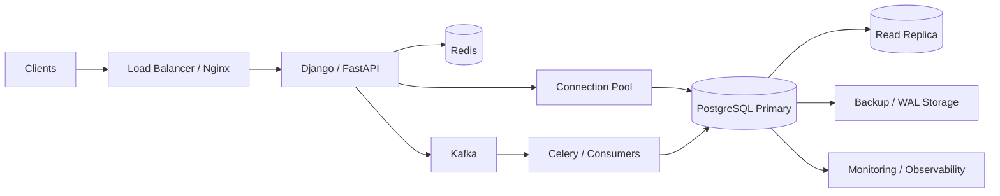
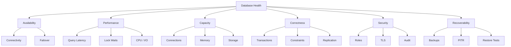
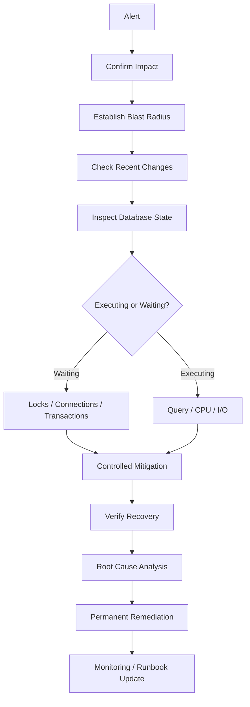

# 01- SQL Production Operations

## Overview

SQL production operations covers the day-to-day activities required to keep a production database **available, performant, secure, recoverable, and operationally predictable**.

For a backend engineer, production database operations extend beyond writing SQL. They include:

```text
database health
+
query workload
+
connections
+
transactions
+
locks
+
replication
+
backups
+
storage
+
maintenance
+
schema changes
+
security
+
observability
+
incident response
```

The operational goal is not simply:

> Keep PostgreSQL running.

It is:

> Keep the database serving correct application workloads within defined performance, availability, security, recovery, and cost boundaries.

A production architecture typically looks like:



---

## Production Operations Responsibilities

Production database operations usually span several areas.

| Area | Primary Responsibility |
|---|---|
| Availability | Keep database service reachable |
| Performance | Keep latency and throughput within targets |
| Capacity | Maintain sufficient CPU, memory, I/O, storage, and connections |
| Query workload | Detect expensive or abnormal SQL |
| Concurrency | Control locks, transactions, and contention |
| Replication | Maintain healthy read replicas and failover capability |
| Backup | Maintain usable backups and WAL/PITR capability |
| Recovery | Restore service and data after failures |
| Schema changes | Deploy migrations safely |
| Security | Control access, encryption, auditing, and credentials |
| Observability | Provide metrics, logs, traces, and alerts |
| Cost | Prevent unnecessary database infrastructure and workload |
| Incident response | Diagnose and mitigate production failures |

---

## Production Operating Model

A useful operating model is:

```text
Observe
   ↓
Understand
   ↓
Operate
   ↓
Validate
   ↓
Automate
   ↓
Improve
```

This separates routine operations from incident response.

### Routine Operations

Examples:

```text
capacity review
+
backup verification
+
replication checks
+
index review
+
maintenance monitoring
+
security review
+
migration planning
```

### Incident Operations

Examples:

```text
database unavailable
+
connection exhaustion
+
high CPU
+
storage exhaustion
+
replication failure
+
lock storm
+
query regression
```

Incident operations prioritize:

```text
stabilization
→
diagnosis
→
mitigation
→
verification
```

---

## Production Database Health Model

Database health should be evaluated across multiple dimensions.



A database can be available but unhealthy.

For example:

```text
database accepts connections
but
p99 query latency = 15 seconds
```

Availability alone is therefore insufficient.

---

## Production SLOs and SLIs

Database operations should be measurable.

Useful SLIs include:

```text
availability
+
query latency
+
transaction latency
+
error rate
+
connection utilization
+
replication lag
+
storage utilization
```

Example SLO model:

| SLI | Example Target |
|---|---|
| Availability | 99.95% |
| API database latency | p95 < 100 ms |
| Critical query latency | p99 < 500 ms |
| Connection utilization | < 70–80% normal operating range |
| Replica lag | < defined application tolerance |
| Storage | Maintain operational headroom |
| Backup recovery | Tested against defined RTO/RPO |

The exact values must come from workload requirements rather than arbitrary defaults.

---

## Monitoring PostgreSQL

A production monitoring stack should cover:

```text
PostgreSQL
+
application
+
connection pools
+
infrastructure
```

### Database Metrics

Monitor:

```text
CPU utilization
memory utilization
I/O latency
IOPS
connections
active sessions
idle transactions
query latency
query throughput
lock waits
deadlocks
transaction age
autovacuum activity
table growth
index growth
WAL generation
replication lag
```

### Application Metrics

Monitor:

```text
request rate
request latency
5xx rate
timeouts
pool acquisition latency
pool utilization
retry rate
worker concurrency
```

### Infrastructure Metrics

Monitor:

```text
EC2 / managed database CPU
memory
network
storage
container resources
Kubernetes pod count
node pressure
```

---

## PostgreSQL Operational Views

Several PostgreSQL views are particularly important.

| View / Function | Operational Use |
|---|---|
| `pg_stat_activity` | Sessions, queries, waits, transactions |
| `pg_locks` | Lock state |
| `pg_blocking_pids()` | Blocking relationships |
| `pg_stat_statements` | Query workload |
| `pg_stat_user_tables` | Table activity and maintenance |
| `pg_stat_user_indexes` | Index usage |
| `pg_stats` | Planner statistics |
| `pg_stat_replication` | Primary-side replication |
| `pg_replication_slots` | Replication slot retention |
| `pg_settings` | Runtime configuration |
| `pg_database` | Database metadata and sizes |

Example:

```sql
SELECT
    pid,
    application_name,
    usename,
    state,
    wait_event_type,
    wait_event,
    xact_start,
    query_start,
    now() - query_start AS query_duration,
    query
FROM pg_stat_activity
ORDER BY query_start NULLS LAST;
```

---

## Connection Operations

PostgreSQL connections consume resources.

The operational capacity is not simply:

```text
max_connections
```

It depends on:

```text
database instance capacity
+
application pool sizes
+
application processes
+
Kubernetes replicas
+
Celery workers
+
background jobs
+
administrative sessions
```

For example:

```text
10 pods
×
4 application processes
×
10 pool connections
=
400 potential application connections
```

If workers add another 100 connections:

```text
total potential connections ≈ 500
```

This must be compared with the database's safe connection budget.

---

## Connection Pool Operations

Connection pools should control concurrency rather than merely maximize connection count.

Monitor:

```text
pool size
+
active connections
+
idle connections
+
pool acquisition latency
+
pool timeout rate
+
connection creation rate
```

Common causes of pool exhaustion:

```text
slow queries
+
lock contention
+
long transactions
+
connection leaks
+
external calls inside transactions
+
insufficient pool sizing
```

A pool timeout is often a downstream symptom.

---

## Django Connection Operations

Django's `CONN_MAX_AGE` controls persistent connection reuse.

It is not equivalent to a configurable application connection pool.

Operational considerations include:

```text
worker/process count
+
database connection limits
+
deployment overlap
+
idle connections
+
database failover
```

Persistent connections should be configured with the database capacity and deployment topology in mind.

---

## FastAPI and SQLAlchemy

A SQLAlchemy engine can manage a connection pool.

```python
from sqlalchemy import create_engine

engine = create_engine(
    "postgresql+psycopg://user:password@db:5432/app",
    pool_size=10,
    max_overflow=5,
    pool_timeout=10,
    pool_recycle=1800,
    pool_pre_ping=True,
)
```

Production settings should be derived from:

```text
database connection budget
+
application concurrency
+
request latency
+
number of application instances
```

Do not copy pool values between environments without recalculating the total connection budget.

---

## Connection Pooling with PgBouncer

PgBouncer can reduce the number of direct PostgreSQL backend connections.

Common modes include:

| Mode | Connection Lifetime |
|---|---|
| Session | Client session |
| Transaction | Transaction |
| Statement | Individual statement |

Transaction pooling can improve connection efficiency but imposes restrictions on session state.

Be especially careful with:

```text
temporary tables
+
session-level settings
+
session-specific state
+
prepared statements
+
advisory locks
```

Choose pooling behavior based on application semantics, not only connection count.

---

## Transaction Operations

Production transactions should generally be:

```text
short
+
explicit
+
bounded
+
business-meaningful
```

Avoid:

```text
BEGIN
    database operation
    external HTTP call
    slow computation
    user interaction
COMMIT
```

Prefer:

```text
database transaction
    ↓
commit
    ↓
external side effect
```

or use a transactional outbox when durable coordination is required.

---

## Transaction Monitoring

Monitor:

```text
transaction age
+
idle in transaction
+
long-running queries
+
commit/rollback failures
```

Useful query:

```sql
SELECT
    pid,
    usename,
    application_name,
    state,
    xact_start,
    now() - xact_start AS transaction_age,
    query
FROM pg_stat_activity
WHERE xact_start IS NOT NULL
ORDER BY xact_start;
```

Long transactions can cause:

```text
lock retention
+
MVCC cleanup delays
+
table/index bloat
+
replication replay pressure
```

---

## Lock Operations

Lock contention should be treated as an operational resource problem.

Inspect:

```sql
SELECT
    blocked.pid AS blocked_pid,
    blocking.pid AS blocking_pid,
    blocked.query AS blocked_query,
    blocking.query AS blocking_query
FROM pg_stat_activity AS blocked
JOIN pg_stat_activity AS blocking
    ON blocking.pid = ANY(pg_blocking_pids(blocked.pid));
```

Then inspect:

```text
blocking transaction age
+
business operation
+
lock type
+
query duration
+
application identity
```

Do not terminate sessions blindly.

---

## Lock Timeouts

`lock_timeout` controls how long a statement waits to acquire a lock.

`statement_timeout` controls how long statement execution is allowed to continue.

They solve different problems.

| Setting | Controls |
|---|---|
| `lock_timeout` | Waiting to acquire locks |
| `statement_timeout` | Total statement execution time |
| Application timeout | Request-level deadline |
| Pool timeout | Waiting to acquire a connection |

These timeout layers should be designed intentionally.

---

## Query Operations

Production query management should monitor:

```text
query frequency
+
total execution time
+
mean execution time
+
p95/p99 latency
+
rows returned
+
buffer activity
```

`pg_stat_statements` is particularly useful for identifying workload-level problems.

```sql
SELECT
    query,
    calls,
    total_exec_time,
    mean_exec_time,
    rows
FROM pg_stat_statements
ORDER BY total_exec_time DESC
LIMIT 20;
```

Prioritize queries by **aggregate workload impact**, not only by individual latency.

---

## Execution Plan Operations

For a representative query:

```sql
EXPLAIN
SELECT ...;
```

For safe read-only analysis:

```sql
EXPLAIN (ANALYZE, BUFFERS)
SELECT ...;
```

Inspect:

```text
estimated rows
+
actual rows
+
loops
+
scan type
+
join strategy
+
sort/hash operations
+
buffer hits
+
buffer reads
```

Do not run `EXPLAIN ANALYZE` on production DML casually because it executes the statement.

---

## Statistics Operations

The query planner relies heavily on statistics.

Monitor:

```text
ANALYZE freshness
+
data distribution
+
estimated vs actual rows
```

Inspect:

```sql
SELECT
    schemaname,
    relname,
    n_live_tup,
    n_dead_tup,
    last_analyze,
    last_autoanalyze
FROM pg_stat_user_tables
ORDER BY n_live_tup DESC;
```

Poor statistics can cause:

```text
bad join order
+
wrong scan choice
+
incorrect cardinality
+
plan regressions
```

---

## Index Operations

Production index management includes:

```text
creation
+
validation
+
usage monitoring
+
bloat monitoring
+
removal
```

Inspect indexes:

```sql
SELECT
    schemaname,
    tablename,
    indexname,
    indexdef
FROM pg_indexes
WHERE schemaname NOT IN ('pg_catalog', 'information_schema')
ORDER BY schemaname, tablename, indexname;
```

Index decisions should consider:

```text
query workload
+
selectivity
+
storage
+
write amplification
+
maintenance
+
replication
```

---

## Creating Indexes in Production

For large tables, consider:

```sql
CREATE INDEX CONCURRENTLY idx_orders_customer_created
ON orders (customer_id, created_at);
```

`CREATE INDEX CONCURRENTLY` reduces blocking of normal writes compared with a regular index build, but:

```text
it takes longer
+
uses additional resources
+
has operational failure modes
+
cannot run inside a transaction block
```

Production migrations should account for these characteristics.

---

## Vacuum and Autovacuum

PostgreSQL uses MVCC, which means obsolete row versions must eventually be cleaned up.

Autovacuum performs important maintenance such as:

```text
dead tuple cleanup
+
statistics maintenance
```

Monitor:

```text
dead tuples
+
autovacuum frequency
+
autovacuum duration
+
transaction age
```

Inspect:

```sql
SELECT
    schemaname,
    relname,
    n_live_tup,
    n_dead_tup,
    last_autovacuum,
    last_autoanalyze
FROM pg_stat_user_tables
ORDER BY n_dead_tup DESC
LIMIT 20;
```

Disabling autovacuum without understanding the workload can create severe operational problems.

---

## Storage Operations

Monitor:

```text
database size
+
table size
+
index size
+
WAL growth
+
temporary files
+
backup storage
```

Database size:

```sql
SELECT
    datname,
    pg_size_pretty(pg_database_size(datname)) AS database_size
FROM pg_database
ORDER BY pg_database_size(datname) DESC;
```

Largest tables:

```sql
SELECT
    schemaname,
    relname,
    pg_size_pretty(pg_total_relation_size(relid)) AS total_size
FROM pg_statio_user_tables
ORDER BY pg_total_relation_size(relid) DESC
LIMIT 20;
```

Storage planning should include operational headroom rather than waiting until disks are nearly full.

---

## WAL Operations

WAL is essential for:

```text
durability
+
crash recovery
+
replication
+
point-in-time recovery
```

High WAL generation may result from:

```text
large write workload
+
bulk updates
+
index changes
+
maintenance
+
schema operations
```

Excessive retained WAL may indicate:

```text
replica lag
+
replication slot retention
+
failed WAL consumers
```

Monitor WAL growth together with replication state.

---

## Replication Operations

For primary-side monitoring:

```sql
SELECT
    application_name,
    client_addr,
    state,
    sync_state,
    write_lag,
    flush_lag,
    replay_lag
FROM pg_stat_replication;
```

Important operational questions:

```text
Is the replica connected?
Is WAL transport healthy?
Is replay keeping up?
Is the replica overloaded?
Is a long-running query preventing replay?
```

Replication lag must be interpreted according to application consistency requirements.

---

## Read Replica Operations

Read replicas are primarily useful for:

```text
read scaling
+
workload isolation
+
reporting
+
disaster recovery
```

They do not solve:

```text
primary write contention
+
primary CPU saturation from writes
+
primary storage bottlenecks
```

Application routing must account for:

```text
replica lag
+
read-after-write requirements
+
failover
```

A request that writes to the primary and immediately reads from a lagging replica may observe stale data.

---

## High Availability Operations

A production PostgreSQL deployment should define:

```text
failure detection
+
failover mechanism
+
stable database endpoint
+
replica promotion
+
application reconnect behavior
```

After failover verify:

```text
new primary
+
application connectivity
+
connection pool recovery
+
replica health
+
replication
+
transaction behavior
```

HA reduces downtime but does not eliminate:

```text
application retry problems
+
connection recovery issues
+
uncertain commits
+
data-loss windows
```

---

## Backup Operations

Backups should be treated as an operational system.

Verify:

```text
backup completion
+
backup retention
+
backup encryption
+
WAL archival
+
backup accessibility
+
restore capability
```

A successful backup job does not prove that recovery works.

---

## Restore Testing

A production-grade backup strategy includes restore tests.

A restore test should validate:

```text
backup integrity
+
required WAL availability
+
database restoration
+
schema compatibility
+
application connectivity
+
permissions
```

Measure:

```text
actual restore duration
```

against:

```text
RTO
```

Measure recoverable data loss against:

```text
RPO
```

---

## Disaster Recovery Operations

A DR plan should define:

```text
who performs recovery
+
where recovery occurs
+
which backups are used
+
how DNS / endpoints change
+
how applications reconnect
+
how background workers recover
+
how caches are rebuilt
+
how event processing resumes
```

Database recovery can interact with:

```text
Kafka
+
Celery
+
Redis
+
external APIs
```

Idempotency is particularly important when recovering application processing after a database restore.

---

## Schema Migration Operations

Production migrations should be designed around:

```text
locking
+
table size
+
deployment ordering
+
backward compatibility
+
rollback capability
```

Prefer:

```text
expand
→
migrate
→
contract
```

For example:

```text
Release 1:
add nullable column

Release 2:
application writes both columns

Release 3:
backfill data

Release 4:
application reads new column

Release 5:
remove old column
```

This reduces coupling between application deployment and schema compatibility.

---

## Dangerous Migration Patterns

Be cautious with:

```text
large table rewrites
+
long-running transactions
+
blocking DDL
+
large synchronous backfills
+
dropping columns immediately
+
renaming fields without application coordination
```

A migration can be logically correct while still being operationally unsafe.

---

## Production Migration Checklist

Before migration:

```text
table size
+
index size
+
expected lock behavior
+
execution duration
+
rollback strategy
+
deployment ordering
```

During migration:

```text
lock waits
+
database CPU
+
I/O
+
query latency
+
replication lag
```

After migration:

```text
application correctness
+
query plans
+
index usage
+
replication
+
error rates
```

---

## Security Operations

Production database operations must follow least privilege.

Separate roles where practical:

```text
application runtime
+
migration
+
read-only reporting
+
administration
+
break-glass
```

Avoid:

```text
superuser application accounts
+
shared credentials
+
hard-coded passwords
+
production credentials in repositories
```

Operational access should be:

```text
authenticated
+
authorized
+
audited
+
time-bounded where possible
```

---

## Credential Rotation

Credential rotation must account for:

```text
application pools
+
Kubernetes secrets
+
Celery workers
+
scheduled jobs
+
read replicas
+
administrative tooling
```

A production-safe rotation strategy generally supports overlapping credentials or coordinated cutover rather than abruptly invalidating the only active credential.

---

## Encryption

Production database traffic should use TLS where required by the deployment and threat model.

Encryption considerations include:

```text
client → database
+
application → database
+
replica communication
+
backup storage
+
administrative connections
```

For PostgreSQL clients, distinguish:

```text
encrypted transport
```

from:

```text
certificate / hostname verification
```

Encryption without proper endpoint verification does not provide the same protection as full TLS verification.

---

## Auditing and Logging

Database operations should be observable.

Capture appropriate events such as:

```text
authentication failures
+
privilege changes
+
DDL
+
sensitive operations
+
administrative activity
```

Avoid indiscriminately logging sensitive query parameters.

Operational logs should support correlation with:

```text
service
+
database role
+
application user
+
request ID
+
timestamp
```

---

## Incident Response

A production database incident should follow a structured workflow.



The first priority is service stabilization.

The root cause analysis follows after the system is stable enough to investigate safely.

---

## Operational Command Reference

Common PostgreSQL commands include:

```bash
psql -h <host> -U <user> -d <database>
```

Check PostgreSQL version:

```sql
SELECT version();
```

Check server recovery state:

```sql
SELECT pg_is_in_recovery();
```

Check current database:

```sql
SELECT current_database();
```

Check current user:

```sql
SELECT current_user;
```

Check configuration:

```sql
SHOW ALL;
```

Use `SHOW` selectively for individual settings when troubleshooting.

---

## Production Safety Rules

Before executing an operational SQL command, determine:

```text
Am I connected to the correct environment?
Am I on the intended primary or replica?
Will this statement modify data?
Can it acquire a significant lock?
Can it run for a long time?
Can it affect replication?
Can it consume substantial CPU/I/O?
Can it be rolled back?
```

For high-risk operations, use:

```text
peer review
+
change record
+
maintenance window where appropriate
+
monitoring
+
rollback plan
```

---

## Production Database Change Classification

| Change | Typical Risk | Operational Consideration |
|---|---|---|
| Read-only diagnostic query | Low–Medium | Query itself can still consume resources |
| Small DML transaction | Medium | Locking and business impact |
| Large update/delete | High | Locks, WAL, I/O, replication |
| Regular index creation | High on large tables | Blocking implications |
| `CREATE INDEX CONCURRENTLY` | Medium | Longer runtime and operational complexity |
| Schema DDL | Medium–High | Lock behavior varies |
| Configuration change | Medium–High | Memory, CPU, connection effects |
| Terminating backend | High | Can abort transactions |
| Failover | High | Connection and transaction consequences |
| Restore | Critical | Data and service availability |

---

## Capacity Planning

Capacity planning should consider:

```text
current workload
+
growth
+
peak traffic
+
background processing
+
failover capacity
+
maintenance overhead
```

Do not size only for average traffic.

For example:

```text
normal traffic = 1,000 requests/s
peak traffic   = 3,000 requests/s
```

The database architecture should account for the peak workload and acceptable degradation behavior.

---

## Headroom

Avoid operating continuously near resource limits.

Important headroom areas include:

```text
CPU
+
memory
+
connections
+
storage
+
I/O
```

Headroom provides space for:

```text
traffic spikes
+
deployments
+
maintenance
+
failover
+
unexpected workloads
```

A system operating at 95% utilization may technically be functional but operationally fragile.

---

## Cost Management

Database cost includes more than the primary instance.

Consider:

```text
primary database
+
read replicas
+
storage
+
backup storage
+
WAL
+
monitoring
+
network transfer
+
managed database features
```

Cost optimization should not compromise:

```text
RPO
+
RTO
+
availability
+
performance
+
security
```

Optimize workload before simply reducing infrastructure capacity.

---

## Operational Automation

Repeated manual operations should become automation.

Good candidates include:

```text
backup verification
+
replication health checks
+
storage alerts
+
connection alerts
+
index reporting
+
query regression detection
+
certificate rotation
+
credential rotation
+
capacity reporting
```

Automation should include safeguards:

```text
validation
+
timeouts
+
least privilege
+
auditability
+
failure handling
```

---

## Runbooks

Every critical database operation should have a runbook.

Examples:

```text
primary database failure
replica lag
connection exhaustion
high CPU
storage exhaustion
deadlock storm
slow query incident
failed migration
backup failure
restore procedure
credential rotation
```

A good runbook contains:

```text
symptom
+
diagnostic commands
+
decision points
+
safe mitigation
+
rollback
+
verification
+
escalation criteria
```

---

## Operational Readiness Checklist

### Availability

- [ ] HA architecture is defined.
- [ ] Failover is tested.
- [ ] Application reconnect behavior is tested.
- [ ] Stable database endpoints are used.

### Performance

- [ ] Query latency is monitored.
- [ ] Query workload is monitored.
- [ ] Execution plans can be inspected.
- [ ] Index usage is reviewed.

### Capacity

- [ ] Connection budget is documented.
- [ ] CPU headroom exists.
- [ ] Memory headroom exists.
- [ ] Storage headroom exists.
- [ ] Peak workload has been tested.

### Reliability

- [ ] Long transactions are monitored.
- [ ] Lock contention is monitored.
- [ ] Deadlocks are monitored.
- [ ] Replication is monitored.

### Backup and DR

- [ ] Backups are automated.
- [ ] Backup retention is defined.
- [ ] WAL/PITR strategy is defined.
- [ ] Restore tests are performed.
- [ ] RPO and RTO are documented.

### Security

- [ ] Runtime roles use least privilege.
- [ ] Administrative access is controlled.
- [ ] Credentials are stored securely.
- [ ] Credential rotation is tested.
- [ ] TLS requirements are enforced.
- [ ] Sensitive operations are audited.

### Operations

- [ ] Production runbooks exist.
- [ ] Migration procedures are documented.
- [ ] Incident procedures are tested.
- [ ] Alerts have clear owners.
- [ ] Operational changes are auditable.

---

## Common Production Mistakes

### Treating Database Operations as DBA-Only Work

Backend engineers directly influence:

```text
query volume
+
transaction duration
+
connection count
+
lock contention
+
database load
```

Database operations are therefore part of backend engineering.

### Using Production as a Debugging Environment

Prefer:

```text
staging
+
production-safe diagnostics
+
observability
```

rather than experimental writes.

### Increasing Capacity Before Understanding Workload

A larger instance can temporarily hide:

```text
N+1 queries
+
bad indexes
+
retry storms
+
connection leaks
```

### Ignoring Background Workers

Celery and Kafka consumers can consume significant database resources.

### Ignoring Deployment Topology

Increasing Kubernetes replicas can increase database connections and query concurrency.

### Treating Replicas as Backups

A replica can replicate corruption or accidental deletion.

Backups and PITR provide a different recovery mechanism.

### Skipping Restore Tests

A backup that has never been restored is an unverified recovery assumption.

### Running Large Operational Queries Without Limits

Diagnostic queries can themselves create production load.

### Making Emergency Changes Without Verification

Every mitigation should have an observable success criterion.

---

## Production Operating Principles

### Prefer Evidence Over Assumptions

Use:

```text
metrics
+
logs
+
traces
+
database views
+
execution plans
```

before changing configuration.

### Prefer Reversible Changes

During incidents:

```text
rollback
+
throttle
+
disable
+
route
```

are often safer than irreversible schema or data changes.

### Keep Transactions Short

Transaction duration affects:

```text
locks
+
MVCC cleanup
+
connection utilization
+
replication
```

### Control Concurrency

More workers and connections do not necessarily increase throughput.

They can increase:

```text
contention
+
CPU pressure
+
memory pressure
+
queueing
```

### Design for Failure

Assume:

```text
connections fail
+
replicas lag
+
queries timeout
+
workers retry
+
deployments overlap
+
networks fail
```

Production systems should have explicit behavior for each.

---

## Key Takeaways

- **Production SQL operations are a system responsibility:** query design, transactions, connection pools, application concurrency, replication, backups, and infrastructure all influence database health.
- **Operate from evidence:** continuously monitor workload, connections, locks, transactions, CPU, memory, I/O, storage, replication, and query behavior rather than relying on a single health metric.
- **Protect production with deliberate operational practices:** short transactions, least privilege, safe migrations, tested backups, controlled failover, capacity headroom, and reversible incident mitigation.
- **Treat recovery as a first-class capability:** HA reduces downtime, while backups, PITR, restore testing, RPO, and RTO determine whether data and service can actually be recovered.
- **Automate repeatable operations and document the rest:** runbooks, monitoring, alerts, migration procedures, and incident workflows turn database operations from ad-hoc actions into a reliable engineering discipline.