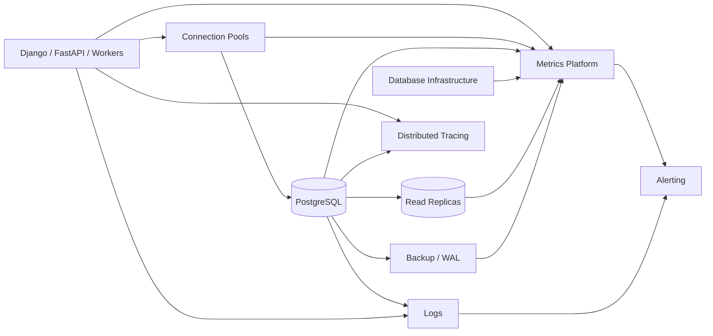
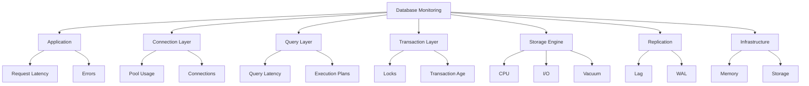
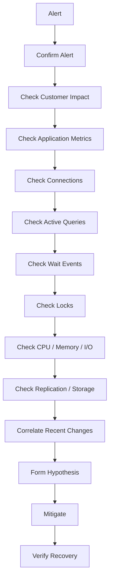

# 02- Database Monitoring

## Overview

Database monitoring is the continuous observation of database health, workload, performance, capacity, reliability, and operational risk.

For PostgreSQL production systems, monitoring should answer four questions:

```text
Is the database available?

Is it serving the expected workload correctly?

Is it approaching a resource or scalability limit?

Can we detect and diagnose failure before customers are affected?
```

A useful monitoring model is:

```text
Application
    ↓
Request / Query Metrics
    ↓
Connection Pool
    ↓
PostgreSQL
    ↓
CPU / Memory / I/O / Storage
    ↓
Replication / Backup / Recovery
```

Monitoring is not the same as collecting every available metric. A production monitoring system should collect signals that support:

- Detection
- Diagnosis
- Capacity planning
- Incident response
- Performance optimization
- Reliability engineering
- Security operations

---

## Database Monitoring Architecture



The important design principle is **correlation**.

For example:

```text
API p99 latency ↑
        ↓
DB query latency ↑
        ↓
lock wait ↑
        ↓
blocking transaction identified
```

This is much more useful than an isolated alert saying:

```text
PostgreSQL CPU = 80%
```

---

## What to Monitor

A production PostgreSQL monitoring system should cover:

| Category | Examples |
|---|---|
| Availability | Connection success, health checks |
| Workload | Queries/sec, transactions/sec, calls |
| Latency | Query latency, transaction latency |
| CPU | Utilization, saturation |
| Memory | Available memory, swap, cache behavior |
| Connections | Active, idle, waiting, utilization |
| Locks | Waiters, blockers, deadlocks |
| Transactions | Age, idle transactions, rollbacks |
| Storage | Database, table, index, WAL size |
| I/O | Read/write throughput and latency |
| Vacuum | Autovacuum, dead tuples, analyze |
| Replication | Lag, replay, WAL retention |
| Backups | Success, freshness, restore readiness |
| Errors | SQL errors, connection failures |
| Security | Authentication failures, privileged activity |

---

## Monitoring vs Observability

These concepts overlap but are not identical.

| Concept | Purpose |
|---|---|
| Monitoring | Detect known failure or degradation |
| Logging | Record discrete events |
| Metrics | Measure numerical behavior over time |
| Tracing | Follow a request across components |
| Profiling | Understand resource consumption |
| Auditing | Establish accountability and security evidence |

A mature production system combines them.

For example:

```text
Metric:
database query latency increased

Trace:
checkout request spent 1.8s in PostgreSQL

Log:
query timeout occurred

Database state:
query waiting on a lock

Audit:
administrative session modified the affected table
```

Together these provide substantially more diagnostic value than any individual signal.

---

## The Four Golden Signals for Database Workloads

The standard service-level golden signals can be adapted to databases:

```text
Latency
Traffic
Errors
Saturation
```

### Latency

Measure:

```text
query latency
transaction latency
connection acquisition latency
replication latency
```

### Traffic

Measure:

```text
queries/sec
transactions/sec
rows processed
connections created
WAL generated
```

### Errors

Measure:

```text
query failures
constraint violations
deadlocks
serialization failures
timeouts
connection failures
```

### Saturation

Measure:

```text
CPU
memory
I/O
connections
storage
locks
```

These four categories provide a useful starting point before adding more specialized database metrics.

---

## PostgreSQL Monitoring Layers

Monitoring should be layered.



A database incident can originate at any layer.

---

## Availability Monitoring

The simplest availability check is whether the application can establish a database connection.

For PostgreSQL:

```sql
SELECT 1;
```

This verifies basic query execution but is not a complete health check.

A deeper health model may include:

```text
connection available
+
primary/replica role correct
+
storage healthy
+
replication healthy
+
acceptable latency
```

Avoid putting expensive diagnostic queries into frequent health checks.

---

## Application Health vs Database Health

A database may be reachable while the application is effectively unavailable.

Example:

```text
PostgreSQL accepts connections
        ↓
queries wait 10 seconds for locks
        ↓
API requests exceed deadline
        ↓
customers receive 5xx / timeout
```

Therefore monitor both:

```text
database availability
```

and:

```text
database-dependent application availability
```

---

## Query Workload Monitoring

Query workload should be monitored by:

```text
frequency
+
latency
+
total execution time
+
rows
```

`pg_stat_statements` is one of the most useful PostgreSQL extensions for workload-level analysis.

Example:

```sql
SELECT
    query,
    calls,
    total_exec_time,
    mean_exec_time,
    rows
FROM pg_stat_statements
ORDER BY total_exec_time DESC
LIMIT 20;
```

This helps identify queries consuming the most aggregate database time.

---

## Why Total Time Matters

Suppose:

| Query | Mean Latency | Calls | Approx. Total Time |
|---|---:|---:|---:|
| A | 2 ms | 1,000,000 | 2,000 s |
| B | 2 s | 100 | 200 s |

Query B is individually slower.

Query A consumes much more database time.

Therefore optimization should consider:

```text
latency × frequency
```

rather than latency alone.

---

## Query Latency Monitoring

Useful measurements include:

```text
mean
p50
p95
p99
maximum
```

Tail latency is particularly important for APIs.

Example:

```text
p50 = 20 ms
p95 = 100 ms
p99 = 2.5 s
```

The average may look healthy while a significant subset of customers experiences severe latency.

---

## Connection Monitoring

Monitor:

```text
total connections
active connections
idle connections
idle in transaction
waiting sessions
connection creation rate
pool utilization
pool acquisition latency
```

PostgreSQL session state can be inspected through:

```sql
SELECT
    state,
    count(*)
FROM pg_stat_activity
GROUP BY state
ORDER BY count(*) DESC;
```

A sudden increase in:

```text
active
```

or:

```text
idle in transaction
```

can indicate an application or workload problem.

---

## Connection Capacity

Connection capacity must be evaluated across the entire application fleet.

Example:

```text
12 Kubernetes pods
×
4 worker processes
×
10 connections
=
480 potential connections
```

Add:

```text
Celery workers
+
administrative sessions
+
monitoring
+
migration jobs
```

The resulting connection budget may exceed the database's safe operating capacity.

Do not treat `max_connections` as a target.

It is a limit, not a guarantee of useful throughput.

---

## Pool Monitoring

Application pools should expose:

```text
pool size
active connections
idle connections
overflow connections
pool wait time
pool timeout count
connection creation rate
```

The important metric is often:

```text
pool acquisition latency
```

because a request can be slow without PostgreSQL actively executing a query.

Example:

```text
Request latency = 1.5s

Pool acquisition = 900ms
SQL execution    = 500ms
Application      = 100ms
```

The database query is not the dominant source of latency.

---

## Active Session Monitoring

`pg_stat_activity` provides a real-time view of database sessions.

```sql
SELECT
    pid,
    usename,
    application_name,
    client_addr,
    state,
    wait_event_type,
    wait_event,
    query_start,
    now() - query_start AS query_duration,
    query
FROM pg_stat_activity
ORDER BY query_start NULLS LAST;
```

Useful fields include:

```text
state
wait_event_type
wait_event
query_start
xact_start
application_name
```

These help distinguish:

```text
executing
```

from:

```text
waiting
```

---

## Wait Events

A query can be slow because it is not actually executing.

It may be waiting for:

```text
lock
+
I/O
+
client communication
+
other database resources
```

Inspect:

```sql
SELECT
    wait_event_type,
    wait_event,
    count(*)
FROM pg_stat_activity
WHERE wait_event IS NOT NULL
GROUP BY wait_event_type, wait_event
ORDER BY count(*) DESC;
```

This distinction is critical:

```text
high CPU
```

and:

```text
high latency + low CPU + lock waits
```

require completely different responses.

---

## Lock Monitoring

Monitor:

```text
lock waits
+
blocking sessions
+
deadlocks
+
long-held locks
```

Blocking relationships can be inspected with:

```sql
SELECT
    blocked.pid AS blocked_pid,
    blocking.pid AS blocking_pid,
    blocked.query AS blocked_query,
    blocking.query AS blocking_query
FROM pg_stat_activity AS blocked
JOIN pg_stat_activity AS blocking
    ON blocking.pid = ANY(pg_blocking_pids(blocked.pid));
```

Monitor the blocker as carefully as the waiter.

---

## Deadlock Monitoring

Deadlocks are different from ordinary lock contention.

```text
Contention:
A waits for B

Deadlock:
A waits for B
B waits for A
```

PostgreSQL detects deadlocks and aborts one transaction.

The PostgreSQL error code is:

```text
40P01
```

Monitor:

```text
deadlock count
+
deadlock logs
+
affected services
+
affected queries
```

Repeated deadlocks usually indicate an application or transaction design problem.

---

## Transaction Monitoring

Track:

```text
transaction age
+
idle in transaction
+
long-running queries
+
rollback rate
```

Example:

```sql
SELECT
    pid,
    usename,
    application_name,
    state,
    xact_start,
    now() - xact_start AS transaction_age,
    query
FROM pg_stat_activity
WHERE xact_start IS NOT NULL
ORDER BY xact_start;
```

Long transactions can cause:

```text
lock retention
+
MVCC cleanup delays
+
table bloat
+
replication replay problems
```

---

## Idle in Transaction

`idle in transaction` deserves special attention.

It means a transaction has started but the session is currently not executing a query.

Example:

```text
BEGIN
UPDATE ...
application pauses
external API call
application waits
COMMIT
```

The database transaction remains open during the external call.

This can retain locks and snapshots unnecessarily.

Monitor:

```text
idle in transaction count
+
transaction age
```

---

## CPU Monitoring

Monitor both:

```text
database CPU utilization
```

and:

```text
CPU-consuming workloads
```

High CPU can result from:

```text
expensive queries
+
high query frequency
+
N+1 queries
+
large joins
+
sorting
+
aggregation
+
JSON processing
+
regular expressions
+
retry storms
```

Use `pg_stat_statements` to identify workload contributors.

Do not assume that the query with the highest mean latency is the primary CPU consumer.

---

## Memory Monitoring

Memory monitoring should include:

```text
database memory
+
OS memory
+
available memory
+
swap
+
container memory limits
+
connection count
+
query concurrency
```

PostgreSQL memory consumption comes from several sources, including:

```text
shared buffers
+
backend processes
+
work_mem allocations
+
maintenance operations
```

`work_mem` is especially important because it can be consumed by multiple operations and sessions concurrently.

---

## Memory Pressure Signals

Potential warning signs include:

```text
available memory falling
+
swap activity
+
OOM events
+
query latency increasing
+
temporary file growth
```

A high percentage of memory utilization alone is not necessarily an incident.

Interpret it with:

```text
MemAvailable
+
swap
+
OOM events
+
latency
+
workload
```

---

## I/O Monitoring

Database I/O should be monitored for:

```text
read throughput
+
write throughput
+
IOPS
+
I/O latency
+
cache behavior
```

High query latency with low CPU may indicate I/O pressure.

Use query-level buffer information:

```sql
EXPLAIN (ANALYZE, BUFFERS)
SELECT ...;
```

Look for:

```text
shared hit
+
shared read
+
temporary read
+
temporary written
```

---

## Storage Monitoring

Track:

```text
database size
+
table size
+
index size
+
WAL storage
+
temporary files
+
backup storage
```

Database size:

```sql
SELECT
    datname,
    pg_size_pretty(pg_database_size(datname)) AS database_size
FROM pg_database
ORDER BY pg_database_size(datname) DESC;
```

Largest relations:

```sql
SELECT
    schemaname,
    relname,
    pg_size_pretty(pg_total_relation_size(relid)) AS total_size
FROM pg_statio_user_tables
ORDER BY pg_total_relation_size(relid) DESC
LIMIT 20;
```

Storage alerts should trigger before the system approaches an unsafe capacity boundary.

---

## Table and Index Growth

Track growth over time rather than looking only at current size.

Useful measurements include:

```text
daily growth
+
weekly growth
+
write volume
+
dead tuples
+
index growth
```

Rapid growth can indicate:

```text
unexpected workload
+
missing retention policy
+
application bug
+
failed cleanup job
```

Historical trends are more useful for capacity planning than point-in-time measurements.

---

## Vacuum Monitoring

Autovacuum is an essential production process.

Monitor:

```text
dead tuples
+
last vacuum
+
last autovacuum
+
last analyze
+
autovacuum duration
```

Example:

```sql
SELECT
    schemaname,
    relname,
    n_live_tup,
    n_dead_tup,
    last_vacuum,
    last_autovacuum,
    last_analyze,
    last_autoanalyze
FROM pg_stat_user_tables
ORDER BY n_dead_tup DESC
LIMIT 20;
```

Persistent dead tuple growth can indicate:

```text
high update/delete workload
+
long transactions
+
autovacuum configuration problems
+
maintenance starvation
```

---

## Statistics Monitoring

Planner statistics affect execution plan quality.

Monitor:

```text
last analyze
+
last autoanalyze
+
estimated vs actual rows
+
plan regressions
```

An application deployment can introduce a bad plan even when the database configuration has not changed.

Therefore query monitoring and statistics monitoring should be correlated with deployments.

---

## Replication Monitoring

For a primary database:

```sql
SELECT
    application_name,
    client_addr,
    state,
    sync_state,
    write_lag,
    flush_lag,
    replay_lag
FROM pg_stat_replication;
```

Monitor:

```text
replica connectivity
+
replication lag
+
WAL transport
+
WAL replay
+
synchronous replication state
```

Replica lag should be measured against application requirements.

A reporting replica may tolerate more lag than a read-after-write API.

---

## Replica Lag

Replica lag can produce application-level correctness problems.

Example:

```text
POST /orders
    ↓
write primary
    ↓
200 OK
    ↓
GET /orders/123
    ↓
read replica
    ↓
record not visible yet
```

The problem is not necessarily a failed database.

It is a consistency mismatch.

Monitor replica lag together with:

```text
read routing
+
read-after-write behavior
```

---

## WAL Monitoring

WAL is required for:

```text
durability
+
crash recovery
+
replication
+
PITR
```

Monitor abnormal WAL growth.

Potential causes include:

```text
write spikes
+
large updates
+
bulk deletes
+
replication lag
+
replication slot retention
```

Replication slots require particular attention because an inactive or stalled consumer can retain WAL and consume significant storage.

---

## Backup Monitoring

A backup monitoring system should measure more than:

```text
backup job = success
```

Monitor:

```text
last successful backup
+
backup age
+
backup duration
+
backup size
+
WAL archive freshness
+
retention
+
restore test results
```

The important question is:

> Can the required recovery point actually be restored?

---

## RPO and Backup Freshness

Suppose:

```text
RPO = 15 minutes
```

and:

```text
latest recoverable WAL = 2 hours old
```

The backup system is operationally unhealthy even if every scheduled job reports success.

Monitor backup freshness against the defined RPO.

---

## Monitoring Query Errors

Track error classes such as:

```text
constraint violations
+
deadlocks
+
serialization failures
+
timeouts
+
connection failures
+
permission errors
```

PostgreSQL SQLSTATE codes are useful for grouping failures.

Examples:

| SQLSTATE | Meaning |
|---|---|
| `40001` | Serialization failure |
| `40P01` | Deadlock detected |
| `23505` | Unique violation |
| `23503` | Foreign-key violation |
| `57014` | Query canceled |

Error classification enables targeted alerting and retry behavior.

---

## Timeout Monitoring

Track timeouts separately.

Possible timeout sources:

```text
pool timeout
+
application timeout
+
lock timeout
+
statement timeout
+
load balancer timeout
+
client timeout
```

A useful dashboard should distinguish:

```text
database execution timeout
```

from:

```text
waiting for connection
```

and:

```text
waiting for lock
```

Otherwise teams may optimize the wrong layer.

---

## Application Correlation

Every database connection should ideally expose enough metadata to identify its source.

Useful fields include:

```text
application_name
+
database role
+
service
+
environment
```

For example:

```text
orders-api
payments-api
reporting-worker
celery-worker
migration-job
```

This makes `pg_stat_activity` significantly more useful during incidents.

---

## Request Correlation

Distributed systems benefit from correlation identifiers.

```text
HTTP request ID
        ↓
application log
        ↓
database session context / tracing
        ↓
SQL operation
```

Where session context is used, prefer transaction-scoped settings such as:

```sql
SET LOCAL app.request_id = 'req-123';
```

Do not treat application-provided context as an authorization mechanism.

---

## Django Monitoring

For Django applications, monitor:

```text
request latency
+
database query count
+
database query duration
+
connection usage
+
transaction duration
+
ORM-generated query patterns
```

Important application-level problems include:

```text
N+1 queries
+
unexpected ORM joins
+
large QuerySets
+
missing pagination
+
long transactions
```

Database monitoring should correlate query spikes with Django endpoint traffic.

---

## FastAPI Monitoring

For FastAPI services, separate:

```text
request latency
+
connection pool acquisition
+
PostgreSQL execution
+
Redis latency
+
external dependency latency
```

Example trace:

```text
POST /checkout
├── pool.acquire       20ms
├── PostgreSQL         80ms
├── Redis               5ms
├── payment API       600ms
└── response            5ms
```

This prevents incorrect attribution of dependency latency to PostgreSQL.

---

## Celery Monitoring

Background workers can significantly affect database workload.

Monitor:

```text
worker concurrency
+
task rate
+
retry rate
+
database queries per task
+
transaction duration
```

A sudden increase in:

```text
Celery retries
```

can cause:

```text
database workload ↑
→
CPU ↑
→
query latency ↑
→
timeouts ↑
→
retries ↑
```

This creates a positive feedback loop.

---

## Kafka Monitoring

Kafka consumers can create similar workload amplification.

Monitor:

```text
consumer lag
+
consumer concurrency
+
batch size
+
database write rate
+
retry rate
```

Database capacity should be considered when increasing Kafka consumer concurrency.

---

## Redis and Database Monitoring

Redis and PostgreSQL should be monitored together when Redis is used as a cache.

A Redis outage can cause:

```text
cache misses ↑
    ↓
PostgreSQL reads ↑
    ↓
database CPU / I/O ↑
    ↓
latency ↑
```

Therefore a database alert can sometimes be a downstream effect of another dependency failure.

---

## Kubernetes Monitoring

Kubernetes changes database workload through application scaling.

Monitor:

```text
pod count
+
container CPU
+
container memory
+
application concurrency
+
connection pool capacity
```

A scaling event can produce:

```text
pods ↑
→
processes ↑
→
connections ↑
→
queries ↑
→
database load ↑
```

Database-aware autoscaling is therefore important.

---

## AWS Monitoring

For AWS-managed PostgreSQL deployments, combine:

```text
database-native metrics
+
CloudWatch metrics
+
application metrics
+
logs
+
traces
```

Monitor relevant infrastructure dimensions such as:

```text
CPU
+
storage
+
connections
+
I/O
+
replication
+
backup state
```

The exact available metrics depend on the managed database service and deployment configuration.

---

## Alert Design

A good alert should answer:

```text
What is wrong?
How severe is it?
Who is affected?
What should the responder investigate?
```

Weak alert:

```text
CPU > 80%
```

Better alert:

```text
Primary database CPU has exceeded the production threshold
for 10 minutes and query latency is simultaneously above the
API SLO.
```

The second alert provides context and reduces alert fatigue.

---

## Alert Categories

Useful alert classes include:

| Severity | Example |
|---|---|
| Critical | Database unavailable |
| Critical | Storage approaching unsafe limit |
| Critical | Recovery capability outside RPO |
| High | Sustained connection exhaustion |
| High | Severe replication lag |
| High | Sustained lock contention |
| High | Query latency violating SLO |
| Medium | Elevated dead tuples |
| Medium | Increased deadlocks |
| Medium | Backup duration increasing |
| Low | Index or storage growth trend |

Thresholds should be workload-specific.

---

## Alert on Symptoms and Causes

Use both:

```text
customer-facing symptoms
```

and:

```text
infrastructure causes
```

For example:

```text
API p99 latency > SLO
```

and:

```text
database lock wait time elevated
```

The first detects impact.

The second accelerates diagnosis.

---

## Avoid Alerting on Every Metric

Excessive alerts create:

```text
alert fatigue
+
ignored notifications
+
slow incident response
```

Prefer alerts that represent:

```text
user impact
+
resource saturation
+
data safety risk
+
recovery risk
```

Metrics that are useful for dashboards do not necessarily need alerts.

---

## Dashboards

A production database dashboard should provide multiple views.

### Executive / Service View

```text
availability
+
API latency
+
error rate
+
database health
```

### Database Health View

```text
CPU
+
memory
+
I/O
+
connections
+
storage
```

### Query View

```text
top queries
+
latency
+
calls
+
total execution time
```

### Concurrency View

```text
locks
+
wait events
+
transactions
+
deadlocks
```

### Replication View

```text
replica state
+
lag
+
WAL
```

### Recovery View

```text
backup freshness
+
WAL archive freshness
+
restore test status
```

---

## Monitoring Retention

Different metrics have different retention requirements.

```text
high-resolution metrics
→
incident analysis

long-term aggregated metrics
→
capacity planning

logs
→
incident / security investigation

audit records
→
compliance / accountability
```

Do not retain every high-cardinality metric indefinitely without considering storage and observability cost.

---

## High Cardinality

Monitoring labels such as:

```text
user_id
request_id
SQL text
```

can create enormous metric cardinality.

Prefer controlled dimensions such as:

```text
service
endpoint
database
query fingerprint
environment
```

Keep high-cardinality identifiers in logs or traces when appropriate rather than metric labels.

---

## Query Fingerprinting

Monitoring individual raw SQL strings can be noisy because parameter values differ.

Conceptually:

```sql
SELECT *
FROM orders
WHERE customer_id = 123;
```

and:

```sql
SELECT *
FROM orders
WHERE customer_id = 456;
```

belong to the same workload pattern.

Query normalization/fingerprinting allows monitoring to aggregate such queries.

`pg_stat_statements` provides normalized query statistics useful for this purpose.

---

## Monitoring Query Plans

Monitoring should identify plan regressions, not just slow queries.

A query can become slower because:

```text
data distribution changed
+
statistics changed
+
index changed
+
table grew
+
planner selected a different plan
```

Track important queries over time and compare:

```text
execution time
+
plan shape
+
rows
+
buffer behavior
```

---

## Performance Regression Detection

A deployment may introduce:

```text
query frequency ↑
+
query latency ↑
+
connection usage ↑
```

Even if application CPU remains normal.

Correlate database metrics with:

```text
deployment timestamp
+
application version
+
feature rollout
```

This is especially important during CI/CD-driven releases.

---

## Capacity Monitoring

Capacity monitoring should focus on trends.

Track:

```text
CPU growth
+
memory growth
+
storage growth
+
connection growth
+
query volume growth
+
WAL growth
```

Example:

```text
Storage:
70% → 75% → 81% → 87%
```

This should trigger capacity planning before storage becomes critical.

---

## Capacity Headroom

A database should maintain sufficient headroom for:

```text
traffic spikes
+
failover
+
maintenance
+
deployments
+
unexpected workloads
```

Do not define a universal percentage as the correct headroom.

The required margin depends on:

```text
traffic variability
+
SLO
+
scaling speed
+
failure scenarios
+
recovery strategy
```

---

## Security Monitoring

Database monitoring should include security signals.

Examples:

```text
authentication failures
+
unexpected users
+
unexpected client addresses
+
privilege changes
+
DDL
+
administrative activity
```

Security monitoring should be separated conceptually from performance monitoring while still allowing correlation during incidents.

---

## Monitoring Access

Monitoring systems often require database access.

Use:

```text
least-privilege monitoring roles
```

rather than:

```text
superuser credentials
```

Monitoring credentials should be:

```text
stored securely
+
rotated
+
audited
+
restricted
```

Avoid exposing SQL text containing sensitive values in dashboards or logs.

---

## High Availability Monitoring

For HA deployments, monitor:

```text
primary availability
+
replica availability
+
replication state
+
replication lag
+
failover readiness
+
application connection recovery
```

A replica being online does not necessarily mean it is a viable failover candidate.

Verify:

```text
replication health
+
replay position
+
capacity
+
configuration
```

---

## Disaster Recovery Monitoring

DR monitoring should verify:

```text
backup freshness
+
WAL archival
+
backup retention
+
cross-region copies where required
+
restore test results
```

A DR dashboard should answer:

```text
What is our latest recoverable point?

Can we restore it?

How long did the last restore take?

Does that satisfy RPO/RTO?
```

---

## Operational Monitoring Workflow

When investigating an alert:



The exact order may change during an incident, but the principle remains:

> Move from broad impact to increasingly specific evidence.

---

## Monitoring During Incidents

During a database incident, prioritize:

```text
customer impact
+
availability
+
latency
+
errors
+
connections
+
waits
+
locks
+
resource saturation
```

Avoid spending the first several minutes examining low-value historical metrics while the system is actively degrading.

---

## Monitoring Common Failure Scenarios

| Scenario | Important Signals |
|---|---|
| Slow queries | Query latency, plans, buffers, CPU |
| Lock storm | Wait events, blockers, transaction age |
| Connection exhaustion | Pool wait, active sessions, connection count |
| CPU saturation | CPU, query workload, calls |
| Memory pressure | Available memory, swap, OOM, concurrency |
| Storage exhaustion | Disk usage, growth rate, WAL |
| Replica lag | Replay lag, WAL rate, long queries |
| Deadlocks | Deadlock count, logs, transaction patterns |
| Migration incident | Locks, query latency, replication |
| Redis failure | Cache miss rate, DB traffic |
| Worker storm | Task rate, retries, DB writes |
| Bad deployment | Query/workload changes by release |

---

## Common Monitoring Mistakes

### Monitoring CPU Only

CPU does not identify:

```text
locks
+
pool exhaustion
+
replica lag
+
storage
```

### Monitoring Averages Only

Averages can hide tail latency.

Use:

```text
p95
+
p99
```

for user-facing latency.

### Alerting on Every Metric

This creates alert fatigue.

### Ignoring Query Frequency

A 2 ms query executed millions of times can dominate workload.

### Ignoring Wait Events

High latency does not necessarily mean high CPU.

### Ignoring Connection Pools

Database connections are shared application resources.

### Ignoring Background Workers

Celery and Kafka consumers can generate substantial database load.

### Ignoring Recent Deployments

Workload changes often originate in application releases.

### Logging Raw Sensitive SQL

Observability data can become a security vulnerability.

### Using Superuser Monitoring Credentials

Monitoring should follow least privilege.

### Treating Backup Success as Recovery Success

Recovery must be validated through restore testing.

---

## Production Monitoring Checklist

### Availability

- [ ] Database connectivity is monitored.
- [ ] Application-level database availability is monitored.
- [ ] HA state is monitored.
- [ ] Failover readiness is monitored.

### Query Workload

- [ ] Query volume is monitored.
- [ ] Query latency is monitored.
- [ ] Query errors are monitored.
- [ ] Top workload queries are visible.
- [ ] Important execution plans can be investigated.

### Connections

- [ ] Total connections are monitored.
- [ ] Active connections are monitored.
- [ ] Idle-in-transaction sessions are monitored.
- [ ] Pool utilization is monitored.
- [ ] Pool wait time is monitored.

### Concurrency

- [ ] Lock waits are monitored.
- [ ] Deadlocks are monitored.
- [ ] Long transactions are monitored.
- [ ] Wait events are visible.

### Resources

- [ ] CPU is monitored.
- [ ] Memory is monitored.
- [ ] I/O is monitored.
- [ ] Storage is monitored.
- [ ] WAL growth is monitored.

### Maintenance

- [ ] Autovacuum is monitored.
- [ ] Dead tuples are monitored.
- [ ] Analyze freshness is monitored.
- [ ] Table and index growth is monitored.

### Replication

- [ ] Replica connectivity is monitored.
- [ ] Replica lag is monitored.
- [ ] WAL replay is monitored.
- [ ] Replication slots are monitored.

### Recovery

- [ ] Backup freshness is monitored.
- [ ] WAL archival is monitored.
- [ ] Backup retention is monitored.
- [ ] Restore tests are tracked.
- [ ] RPO/RTO compliance is measurable.

### Security

- [ ] Authentication failures are monitored.
- [ ] Privileged activity is monitored.
- [ ] Monitoring access follows least privilege.
- [ ] Sensitive data is protected in observability systems.

---

## Interview Perspective

Senior database monitoring questions often test whether you can connect symptoms across layers.

Be prepared to explain:

```text
How would you monitor PostgreSQL in production?

What metrics would you alert on?

How would you distinguish CPU saturation from lock contention?

How would you detect connection pool exhaustion?

How would you detect a query regression after deployment?

How would you monitor replica health?

How would you monitor backups?

Why is CPU alone insufficient?

Why are p99 metrics important?

How do you correlate database metrics with application requests?
```

A strong answer should describe:

```text
application metrics
+
database metrics
+
infrastructure metrics
+
logs
+
traces
+
alerts
+
runbooks
```

rather than listing PostgreSQL metrics in isolation.

---

## Senior Monitoring Model

A mature database monitoring system connects:

```text
Customer
   ↓
API
   ↓
Service
   ↓
Connection Pool
   ↓
SQL
   ↓
PostgreSQL
   ↓
Resource
```

For every incident, ask:

```text
What changed?

What is the customer impact?

Which resource is constrained?

Is the database executing or waiting?

Which workload is responsible?

How is the problem being amplified?

Can we mitigate safely?

How will we know recovery is complete?
```

This transforms monitoring from a collection of dashboards into an operational feedback system.

---

## Key Takeaways

- **Monitor the complete database path:** application latency, connection pools, PostgreSQL workload, locks, resources, replication, storage, and recovery must be observable together.
- **Distinguish execution from waiting:** CPU-heavy queries, lock waits, pool exhaustion, I/O pressure, and replica lag require different diagnostic paths.
- **Prioritize workload and user impact:** query frequency, tail latency, errors, saturation, and application SLOs are more actionable than isolated infrastructure metrics.
- **Monitor recovery capability as well as runtime health:** backups, WAL, replication, restore tests, RPO, and RTO are operational health signals.
- **Build monitoring for diagnosis, not just alerting:** correlate metrics, logs, traces, deployments, and database state so incidents can move quickly from symptom to root cause.