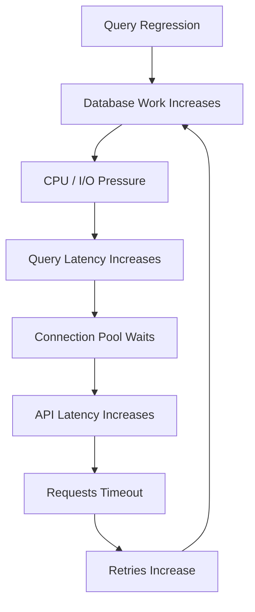
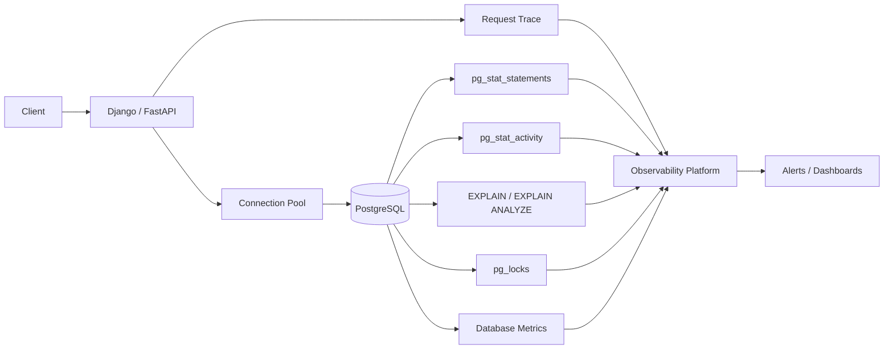
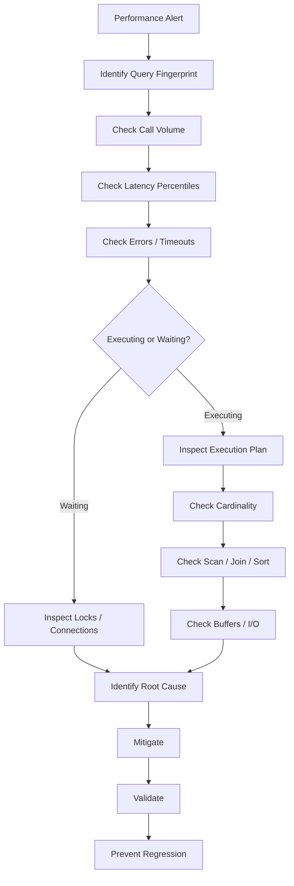

# 03- Query Performance Monitoring

## Overview

Query performance monitoring is the continuous measurement and analysis of SQL workload behavior in production.

The goal is not simply to identify slow queries. A production query monitoring system should answer:

```text
Which queries consume the most database resources?
Which queries are getting slower?
Which queries execute most frequently?
Are queries waiting or actually executing?
Did a deployment change query behavior?
Are execution plans changing?
Is database capacity limiting query throughput?
```

For backend systems, query performance exists across several layers:

```text
API request
    ↓
Application code
    ↓
ORM / query builder
    ↓
Connection pool
    ↓
Network
    ↓
PostgreSQL
    ↓
Query planner
    ↓
Executor
    ↓
Storage / memory / locks
```

A useful production model is:

```text
Query Performance
=
Latency
+
Frequency
+
Resource Consumption
+
Concurrency
+
Plan Stability
+
Result Size
```

A query that takes 2 ms but executes one million times can be more important than a query that takes 2 seconds and executes ten times.

---

## Why Query Performance Monitoring Matters

Poor query performance can propagate through the entire backend architecture.



This creates a feedback loop.

A slow query can therefore become:

```text
database problem
→
connection problem
→
application problem
→
retry problem
→
larger database problem
```

Query monitoring helps detect the problem before it becomes a system-wide failure.

---

## What Should Be Monitored

A production query monitoring system should capture several dimensions.

| Dimension | What It Tells You |
|---|---|
| Query count | How frequently the query executes |
| Mean latency | Typical execution cost |
| p95/p99 latency | Tail behavior |
| Total execution time | Aggregate workload impact |
| Rows returned | Result-set size |
| Rows affected | DML workload |
| Planning time | Planner overhead |
| Execution time | Executor cost |
| Buffer hits | Memory/cache usage |
| Buffer reads | Physical or lower-level reads |
| Temporary I/O | Sort/hash spill behavior |
| Query errors | Correctness/reliability problems |
| Wait events | Blocking or resource waits |
| Execution plan | How PostgreSQL executes the query |
| Database CPU | Resource consumption |
| Connection usage | Concurrency pressure |

Not every metric needs to be collected at the same resolution.

---

## Query Performance Architecture



The strongest implementations correlate application telemetry with database telemetry.

---

## Query Latency

Latency measures how long a query takes to complete.

Important percentiles include:

```text
p50
p95
p99
```

Example:

```text
p50 = 8 ms
p95 = 30 ms
p99 = 800 ms
```

The median appears healthy, but the tail is problematic.

For user-facing APIs, tail latency is often more important than the average.

---

## Mean vs Percentile Latency

| Metric | Useful For |
|---|---|
| Mean | Overall workload analysis |
| p50 | Typical request |
| p95 | High-percentile user experience |
| p99 | Tail latency and pathological cases |
| Maximum | Extreme outliers |

Do not use maximum latency as the only performance signal because a single unusual query can distort it.

---

## Query Frequency

Query frequency measures how often a query executes.

Example:

```text
Query A
2 ms × 1,000,000 calls
= 2,000 seconds of execution time

Query B
2 seconds × 100 calls
= 200 seconds
```

Query B is much slower individually.

Query A consumes much more aggregate database execution time.

This is why:

```text
latency × frequency
```

is an important optimization signal.

---

## Total Execution Time

`pg_stat_statements` can expose aggregate query execution statistics.

Example:

```sql
SELECT
    query,
    calls,
    total_exec_time,
    mean_exec_time,
    rows
FROM pg_stat_statements
ORDER BY total_exec_time DESC
LIMIT 20;
```

This helps identify queries with the largest aggregate database impact.

A useful ranking strategy is:

```text
Top total execution time
+
Top mean latency
+
Top call count
+
Top rows processed
```

---

## `pg_stat_statements`

`pg_stat_statements` tracks normalized statement statistics.

It is useful for:

```text
query ranking
+
performance regression detection
+
workload analysis
+
capacity planning
```

Typical information includes:

```text
calls
total execution time
mean execution time
rows
planning statistics
```

Depending on PostgreSQL version and configuration, additional planning and I/O-related statistics may also be available.

---

## Query Normalization

Consider:

```sql
SELECT *
FROM orders
WHERE customer_id = 1001;
```

and:

```sql
SELECT *
FROM orders
WHERE customer_id = 2002;
```

These represent the same query pattern.

Query statistics should generally group such statements by normalized structure rather than treating every parameter value as a separate workload.

This makes query fingerprints useful for:

```text
aggregation
+
alerting
+
regression analysis
```

---

## Planning Time vs Execution Time

A query has two important performance components:

```text
planning
+
execution
```

Conceptually:

```text
SQL
 ↓
parse / analyze
 ↓
plan
 ↓
execute
 ↓
return result
```

For most frequently executed OLTP queries, execution cost usually dominates.

However, highly dynamic or complex queries can make planning overhead significant.

Measure both when diagnosing performance.

---

## EXPLAIN

Use `EXPLAIN` to inspect the planner's chosen execution strategy.

```sql
EXPLAIN
SELECT
    id,
    created_at,
    status
FROM orders
WHERE customer_id = 123
ORDER BY created_at DESC
LIMIT 50;
```

Inspect:

```text
scan type
+
join strategy
+
estimated rows
+
estimated cost
+
sort operations
+
aggregate operations
```

Remember:

> PostgreSQL's `cost` values are planner estimates, not milliseconds.

---

## EXPLAIN ANALYZE

`EXPLAIN ANALYZE` executes the statement and reports actual execution behavior.

```sql
EXPLAIN (ANALYZE, BUFFERS)
SELECT
    id,
    created_at,
    status
FROM orders
WHERE customer_id = 123
ORDER BY created_at DESC
LIMIT 50;
```

Important fields include:

```text
actual time
+
actual rows
+
loops
+
buffers
```

For production troubleshooting, be careful:

> `EXPLAIN ANALYZE` executes the statement.

Do not casually run it against production `INSERT`, `UPDATE`, or `DELETE` statements.

---

## Estimated Rows vs Actual Rows

One of the most valuable plan diagnostics is:

```text
estimated rows
vs
actual rows
```

Example:

```text
Estimated rows: 100
Actual rows:    500,000
```

A large mismatch can lead to poor plan choices.

Potential causes include:

```text
stale statistics
+
data distribution changes
+
correlated columns
+
insufficient statistics
+
parameter-sensitive workload
```

---

## Query Plans and Monitoring

Query monitoring should not stop at:

```text
query took 2 seconds
```

Ask:

```text
Why did it take 2 seconds?

Was it executing or waiting?

Which plan was selected?

How many rows were expected?

How many rows were processed?

How many buffers were read?

Did the plan change recently?
```

This turns monitoring into diagnosis.

---

## Scan Monitoring

Common scan strategies include:

```text
Sequential Scan
Index Scan
Index Only Scan
Bitmap Index Scan
Bitmap Heap Scan
```

A sequential scan is not automatically a problem.

For example:

```text
table = 10,000 rows
query needs = 8,000 rows
```

A sequential scan may be cheaper than using an index.

Monitor the complete plan rather than alerting on scan type alone.

---

## Index Performance Monitoring

An index should be evaluated through workload evidence.

Useful questions:

```text
Is the index used?

Does it reduce scanned rows?

Does it support the query's filter/order?

Does it improve latency?

What is its write and storage cost?
```

Inspect index usage:

```sql
SELECT
    schemaname,
    relname,
    indexrelname,
    idx_scan,
    idx_tup_read,
    idx_tup_fetch
FROM pg_stat_user_indexes
ORDER BY idx_scan DESC;
```

Low usage does not automatically prove an index is unnecessary. Consider observation period, query seasonality, constraints, and workload history.

---

## Buffer Monitoring

`EXPLAIN (ANALYZE, BUFFERS)` provides useful information about memory and I/O behavior.

Example:

```sql
EXPLAIN (ANALYZE, BUFFERS)
SELECT *
FROM orders
WHERE customer_id = 123;
```

Pay attention to:

```text
shared hit
shared read
shared dirtied
shared written
temp read
temp written
```

A high number of shared reads can indicate substantial data reads from storage or lower cache levels.

A high number of shared hits indicates data was found in PostgreSQL's shared buffer layer, although OS caching and storage behavior still matter.

---

## Temporary I/O

Queries can use temporary files for operations such as:

```text
sorts
+
hash operations
+
materialization
```

Monitor:

```text
temporary reads
+
temporary writes
+
temporary file creation
```

Excessive temporary I/O can indicate:

```text
insufficient working memory
+
large sorts
+
large joins
+
large aggregations
```

Increasing `work_mem` blindly is dangerous because it can be consumed by multiple operations across concurrent sessions.

---

## Join Performance Monitoring

Common join algorithms include:

```text
Nested Loop
Hash Join
Merge Join
```

The correct algorithm depends on:

```text
cardinality
+
available indexes
+
data distribution
+
join conditions
+
sort requirements
```

A nested loop is not inherently bad.

It can be highly efficient when:

```text
outer relation is small
+
inner lookup is indexed
```

Monitoring should focus on actual workload behavior rather than rules such as:

```text
Nested Loop = bad
```

---

## Aggregation Monitoring

Monitor expensive:

```text
GROUP BY
+
COUNT
+
SUM
+
AVG
+
DISTINCT
+
window functions
```

Large aggregations can consume:

```text
CPU
+
memory
+
temporary storage
```

For frequently executed analytical workloads, consider:

```text
pre-aggregation
+
materialized views
+
dedicated OLAP systems
```

rather than forcing the transactional database to perform repeated large analytical operations.

---

## Sort Monitoring

Large sorts can become expensive when:

```text
ORDER BY
+
DISTINCT
+
GROUP BY
+
window functions
```

require substantial memory.

A query such as:

```sql
SELECT *
FROM orders
ORDER BY created_at DESC
LIMIT 50;
```

may benefit from an appropriate index.

Monitor whether sorting occurs and whether it spills to temporary storage.

---

## Cardinality Monitoring

Cardinality means the number of rows flowing through a plan node.

Incorrect cardinality estimates can cause:

```text
wrong join strategy
+
wrong join order
+
wrong scan
+
unnecessary sorting
+
excessive memory
```

Monitor estimated vs actual rows throughout important execution plans.

Do not inspect only the top-level query node.

---

## Loops

Execution plans can contain:

```text
loops
```

A node that costs:

```text
1 ms
```

but executes:

```text
100,000 times
```

can dominate the query.

When reading plans, consider:

```text
node cost × loops
```

rather than inspecting node cost in isolation.

---

## N+1 Query Monitoring

An application may generate:

```text
1 query to load customers
+
1 query per customer
```

Example:

```text
100 customers
→
101 database queries
```

The individual queries may all be fast.

The aggregate workload can still be expensive.

Django applications should monitor ORM patterns such as:

```text
select_related()
+
prefetch_related()
```

where appropriate.

FastAPI applications using SQLAlchemy should similarly inspect relationship loading behavior.

---

## Query Count vs Query Latency

A performance investigation should ask both:

```text
How long does each query take?
```

and:

```text
How many queries does one request execute?
```

Example:

```text
API request
→
1 query × 400 ms
```

versus:

```text
API request
→
100 queries × 5 ms
```

The second request takes roughly 500 ms of database execution before accounting for other overhead.

Optimizing only the individual 5 ms query misses the architectural problem.

---

## Query Result Size

Monitor:

```text
rows returned
+
bytes returned
```

Large result sets consume:

```text
database resources
+
network bandwidth
+
application memory
+
serialization CPU
```

Avoid:

```sql
SELECT *
```

when only a few columns are required.

Prefer explicit projections:

```sql
SELECT
    id,
    status,
    created_at
FROM orders
WHERE customer_id = $1;
```

---

## Pagination Monitoring

Offset pagination can become expensive for large offsets.

Example:

```sql
SELECT id, created_at
FROM orders
ORDER BY created_at DESC
LIMIT 50 OFFSET 500000;
```

The database may need to process a large number of preceding rows.

For large datasets, keyset pagination can provide more predictable performance.

```sql
SELECT id, created_at
FROM orders
WHERE created_at < $1
ORDER BY created_at DESC
LIMIT 50;
```

The exact keyset predicate should account for a stable unique ordering, commonly by using a composite cursor such as `(created_at, id)`.

---

## Query Timeout Monitoring

Track:

```text
statement timeouts
+
lock timeouts
+
application request timeouts
+
connection pool timeouts
```

These are different failure modes.

| Timeout | Indicates |
|---|---|
| Pool timeout | Could not acquire a connection |
| Lock timeout | Could not acquire required lock |
| Statement timeout | Statement exceeded execution deadline |
| Application timeout | Request exceeded service deadline |

Correlating them helps identify the actual bottleneck.

---

## Lock Wait Monitoring

A slow query may actually be waiting.

Monitor:

```text
wait_event_type
+
wait_event
+
blocking PID
+
transaction age
```

Example:

```sql
SELECT
    pid,
    state,
    wait_event_type,
    wait_event,
    query_start,
    now() - query_start AS query_duration,
    query
FROM pg_stat_activity
WHERE wait_event IS NOT NULL;
```

Do not optimize SQL execution plans when the primary problem is lock contention.

---

## Connection Pool Impact

A slow query consumes a database connection for longer.

This can produce:

```text
query latency ↑
→
connection occupancy ↑
→
pool availability ↓
→
pool waits ↑
→
API latency ↑
```

Query performance monitoring should therefore correlate with:

```text
pool utilization
+
pool acquisition latency
+
database connections
```

---

## Query Performance and Retries

Retries can amplify query workload.

Example:

```text
slow query
→
request timeout
→
client retry
→
same query executes again
→
database load increases
→
query becomes slower
```

Monitor:

```text
retry rate
+
query call rate
+
timeout rate
```

Retry policies should use bounded retries and backoff with jitter.

---

## Query Performance and Redis

Caching can change database workload dramatically.

Example:

```text
Redis outage
    ↓
cache hit rate ↓
    ↓
PostgreSQL reads ↑
    ↓
database CPU / I/O ↑
    ↓
query latency ↑
```

Therefore correlate:

```text
Redis cache hit rate
+
PostgreSQL query volume
```

when diagnosing sudden database workload changes.

---

## Query Performance and Celery

Background jobs can generate significant database workload.

Monitor:

```text
tasks/sec
+
database queries/task
+
worker concurrency
+
retry rate
+
transaction duration
```

A worker concurrency increase can create a database concurrency increase even when API traffic is unchanged.

---

## Query Performance and Kafka

Kafka consumers can similarly increase database write pressure.

Monitor:

```text
consumer lag
+
consumer concurrency
+
batch size
+
database writes/sec
+
transaction latency
```

Increasing consumer concurrency without considering database capacity can move the bottleneck downstream.

---

## Query Performance and Deployments

Every application deployment can change query behavior.

Examples:

```text
new ORM query
+
missing index
+
N+1 relationship access
+
changed filtering
+
larger result set
+
new background task
```

Correlate query metrics with:

```text
deployment version
+
feature flag
+
release timestamp
```

This is one of the fastest ways to detect application-induced regressions.

---

## Query Regression Monitoring

A query regression can appear as:

```text
calls ↑
latency ↑
total execution time ↑
rows ↑
buffer reads ↑
```

A simple regression workflow is:

```text
Baseline
   ↓
Deploy change
   ↓
Compare query fingerprint
   ↓
Compare latency
   ↓
Compare call volume
   ↓
Compare plan
   ↓
Investigate
```

Do not compare latency without considering workload changes.

---

## Plan Regression

A query can become slower even when its SQL text has not changed.

Possible causes:

```text
table growth
+
data distribution changes
+
statistics changes
+
index changes
+
planner settings
+
parameter sensitivity
```

Monitor important queries for plan changes.

For critical workloads, preserve representative plans and benchmark them against realistic data distributions.

---

## Parameter-Sensitive Queries

The best plan can depend on parameter values.

For example:

```text
customer_id = small tenant
```

may match:

```text
10 rows
```

while:

```text
customer_id = large tenant
```

may match:

```text
10 million rows
```

The same SQL shape can therefore require different access strategies.

Monitoring should consider workload distribution rather than assuming one execution plan is optimal for every parameter.

---

## Query Performance in Read Replicas

Read replicas can improve read scalability but introduce:

```text
replica lag
+
different cache state
+
different workload
```

A query may be fast on the primary but slower on a replica because the replica has:

```text
different cache state
+
reporting workload
+
replay pressure
```

Monitor query performance per database role and replica, not only globally.

---

## Query Performance and Partitioning

Partitioning can reduce the amount of data scanned when partition pruning applies.

Monitor:

```text
partitions scanned
+
partitions pruned
+
partition size
+
query latency
```

Partitioning is not a substitute for appropriate local indexes.

It also does not automatically solve:

```text
row-level contention
+
poor query predicates
+
bad joins
```

---

## Query Performance Monitoring Workflow

A practical investigation workflow is:



---

## Production Query Investigation

When a query becomes slow, ask:

### Workload

```text
Did call volume increase?

Did result size increase?

Did concurrency increase?

Did retries increase?
```

### Query

```text
Did SQL change?

Did ORM behavior change?

Did predicates change?

Did joins change?
```

### Planner

```text
Did statistics change?

Did estimated rows become inaccurate?

Did the execution plan change?
```

### Resources

```text
Is CPU saturated?

Is I/O saturated?

Is memory under pressure?

Is temporary I/O increasing?
```

### Concurrency

```text
Is the query waiting for locks?

Are transactions long?

Is the connection pool exhausted?
```

---

## Safe Production Diagnostics

Prefer read-only diagnostics.

Examples:

```sql
SELECT
    pid,
    state,
    wait_event_type,
    wait_event,
    query_start,
    query
FROM pg_stat_activity
WHERE pid <> pg_backend_pid();
```

```sql
SELECT
    query,
    calls,
    total_exec_time,
    mean_exec_time
FROM pg_stat_statements
ORDER BY total_exec_time DESC
LIMIT 20;
```

```sql
SELECT
    schemaname,
    relname,
    n_live_tup,
    n_dead_tup,
    last_autoanalyze
FROM pg_stat_user_tables
ORDER BY n_dead_tup DESC
LIMIT 20;
```

Keep diagnostic queries bounded and avoid repeatedly polling expensive catalog queries at high frequency.

---

## Query Monitoring Thresholds

Avoid universal thresholds such as:

```text
query > 100 ms = bad
```

The correct threshold depends on:

```text
workload
+
SLO
+
query purpose
+
frequency
+
resource consumption
```

A batch query may legitimately take several minutes.

A customer-facing lookup may need to remain below tens of milliseconds.

---

## Critical vs Background Queries

Different workloads should have different expectations.

| Workload | Typical Monitoring Focus |
|---|---|
| API lookup | p95/p99 latency |
| Authentication query | Latency + reliability |
| Transactional write | Latency + lock waits |
| Reporting | Total resource consumption |
| Batch processing | Throughput + duration |
| ETL | Runtime + I/O |
| Analytics | Resource isolation |
| Maintenance | Duration + impact |

Do not use one latency threshold for every query class.

---

## Query Performance Dashboards

A useful dashboard can contain:

```text
Top queries by total execution time
Top queries by mean latency
Top queries by call count
Top queries by rows
p95 / p99 database latency
Database CPU
Database I/O
Connection utilization
Lock waits
Deadlocks
Temporary I/O
Replica lag
```

Also include:

```text
deployment markers
+
incident markers
+
feature rollout markers
```

This makes correlation much easier.

---

## High-Cardinality Monitoring

Avoid turning arbitrary query parameters into metric labels.

Bad example:

```text
query_latency{user_id="123456"}
```

This creates high metric cardinality.

Prefer controlled dimensions:

```text
service
endpoint
query_fingerprint
database
environment
```

Put request IDs and other high-cardinality identifiers into logs or traces where appropriate.

---

## Query Sampling

Large systems may execute enormous numbers of queries.

Capturing every detail at maximum resolution can be expensive.

Use a combination of:

```text
aggregated query statistics
+
targeted slow-query logging
+
trace sampling
+
on-demand execution plans
```

Critical workloads may justify deeper instrumentation.

---

## Logging Slow Queries

Slow-query logging can identify statements exceeding an operational threshold.

The threshold should be based on:

```text
service SLO
+
query workload
+
acceptable database latency
```

Do not choose an extremely low threshold simply to collect more logs.

That can create:

```text
log volume
+
storage cost
+
noise
```

---

## Query Performance and Security

Performance monitoring can expose sensitive information.

Potentially sensitive data includes:

```text
query parameters
+
customer identifiers
+
emails
+
tokens
+
personal data
```

Prefer:

```text
normalized SQL
+
redacted parameters
+
controlled access
```

Monitoring systems should follow least privilege and appropriate data retention policies.

---

## Query Performance and Cost

Expensive queries increase infrastructure cost through:

```text
CPU
+
I/O
+
memory
+
storage
+
replicas
+
network
```

An inefficient query can force:

```text
larger database instance
+
additional replicas
+
larger cache
```

Optimization can therefore reduce both latency and infrastructure cost.

---

## Preventing Query Regressions

Production teams should combine:

```text
code review
+
query review
+
automated tests
+
representative datasets
+
execution-plan inspection
+
production monitoring
```

For important queries:

```text
baseline performance
→
deploy
→
compare workload
→
compare plan
→
verify latency
```

Do not rely solely on unit tests for query performance.

---

## Query Performance Testing

Use realistic data volumes.

A query that performs well against:

```text
10,000 rows
```

may fail at:

```text
100 million rows
```

Test:

```text
data volume
+
data distribution
+
concurrency
+
realistic indexes
+
realistic parameters
```

Load testing should include the database as a shared bottleneck rather than testing application servers independently.

---

## Production Best Practices

- Monitor query frequency and aggregate execution time.
- Track p95/p99 latency for important workloads.
- Use `pg_stat_statements` for workload analysis.
- Inspect execution plans when latency changes.
- Compare estimated and actual cardinality.
- Distinguish execution from lock or connection waiting.
- Monitor query behavior after deployments.
- Investigate N+1 patterns at the application layer.
- Monitor result size and rows processed.
- Track temporary I/O and buffer behavior.
- Treat indexes as workload-specific investments.
- Use representative production-like datasets for testing.
- Keep monitoring data secure and appropriately redacted.

---

## Common Mistakes

### Optimizing Only the Slowest Query

The slowest query is not necessarily the largest workload contributor.

Check:

```text
latency
+
frequency
+
total execution time
```

### Treating Sequential Scans as Automatically Bad

Sequential scans can be optimal for large result sets.

### Looking Only at Average Latency

Tail latency can hide serious production problems.

### Ignoring Query Frequency

A very fast query can still dominate database capacity.

### Ignoring `loops`

A cheap plan node executed thousands of times can become expensive.

### Blaming the Database for N+1

The SQL may be individually efficient while the application generates excessive query volume.

### Increasing `work_mem` Globally

This can multiply memory consumption across concurrent operations.

### Running `EXPLAIN ANALYZE` on Production DML

It executes the statement.

### Adding an Index Without Measuring Usage

Indexes consume storage and increase write and maintenance costs.

### Ignoring Locks

A query waiting for another transaction is not necessarily a query-plan problem.

### Ignoring Retries

Retries can amplify a database performance incident.

### Ignoring Background Workers

Celery and Kafka consumers can alter database workload independently of API traffic.

---

## Senior-Level Performance Model

At senior level, query performance should be modeled as:

```text
Database Work
=
Query Cost
×
Query Frequency
×
Concurrency
```

But the system-level impact is broader:

```text
Query Cost
        ↓
Connection Occupancy
        ↓
Pool Utilization
        ↓
Request Queueing
        ↓
Tail Latency
        ↓
Timeouts
        ↓
Retries
        ↓
Additional Query Load
```

This is why query performance is an architectural concern rather than an isolated SQL concern.

---

## Practical Performance Review

For an important production query, review:

| Area | Questions |
|---|---|
| SQL | Is the query logically efficient? |
| Cardinality | Are estimated rows accurate? |
| Indexes | Does an appropriate index exist? |
| Plan | Is the selected plan appropriate? |
| Frequency | How often does it execute? |
| Latency | What are p50/p95/p99 values? |
| Result size | How much data is returned? |
| Concurrency | How many executions overlap? |
| Locks | Does it wait? |
| Resources | CPU, memory, I/O impact? |
| Application | Does ORM generate excessive queries? |
| Deployment | Did recent code change behavior? |
| Reliability | Does timeout/retry behavior amplify load? |
| Cost | Does optimization reduce infrastructure pressure? |

---

## Production Query Performance Checklist

### Workload

- [ ] Query call count is monitored.
- [ ] Total execution time is monitored.
- [ ] Mean latency is monitored.
- [ ] p95/p99 latency is monitored.
- [ ] Rows processed are monitored.

### Execution

- [ ] Important queries can be analyzed with `EXPLAIN`.
- [ ] Representative execution plans are understood.
- [ ] Estimated vs actual rows are checked.
- [ ] Buffer behavior is understood.
- [ ] Temporary I/O is monitored.

### Concurrency

- [ ] Lock waits are monitored.
- [ ] Connection pool utilization is monitored.
- [ ] Long transactions are monitored.
- [ ] Deadlocks are monitored.
- [ ] Timeout types are distinguishable.

### Application

- [ ] N+1 queries are detected.
- [ ] ORM-generated SQL can be inspected.
- [ ] Query count per request is measurable.
- [ ] Background workers are included in workload analysis.
- [ ] Deployment changes are correlated with query behavior.

### Reliability

- [ ] Retry amplification is monitored.
- [ ] Query timeouts are tracked.
- [ ] Replica performance is monitored.
- [ ] Query regressions can be detected.

### Security

- [ ] Sensitive query parameters are protected.
- [ ] Monitoring access follows least privilege.
- [ ] High-cardinality identifiers are not used as uncontrolled metric labels.
- [ ] Query logs have appropriate retention.

---

## Interview Perspective

A strong senior-level answer to:

> How do you monitor SQL query performance in production?

should cover:

```text
pg_stat_statements
+
query frequency
+
total execution time
+
p95/p99 latency
+
EXPLAIN / EXPLAIN ANALYZE
+
BUFFERS
+
cardinality
+
indexes
+
locks
+
connection pools
+
application traces
+
deployments
```

For a slow query, explain the diagnostic sequence:

```text
Identify workload
→
measure frequency and latency
→
check whether it is executing or waiting
→
inspect execution plan
→
compare estimated vs actual rows
→
inspect indexes and I/O
→
check application-generated query volume
→
mitigate
→
validate
→
prevent regression
```

Avoid answers based only on:

```text
"Add an index."
```

The senior-level answer explains **why the query is slow, how to prove it, how to mitigate it safely, and how to prevent recurrence**.

---

## Key Takeaways

- **Monitor workload, not just slow queries:** query frequency, total execution time, latency percentiles, rows, and resource consumption determine real database impact.
- **Use PostgreSQL evidence to diagnose performance:** combine `pg_stat_statements`, execution plans, cardinality, buffers, wait events, locks, and infrastructure metrics.
- **Correlate database performance with the application:** ORM behavior, N+1 queries, connection pools, retries, Celery/Kafka workloads, Redis failures, and deployments can all change SQL workload.
- **Treat query performance as a system-level concern:** query cost multiplied by frequency and concurrency affects connections, queueing, tail latency, timeouts, and infrastructure cost.
- **Prevent regressions continuously:** baseline important workloads, validate plans against realistic data, monitor deployments, and protect query telemetry from excessive cost or sensitive-data exposure.