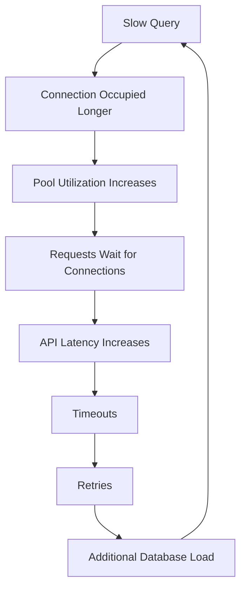
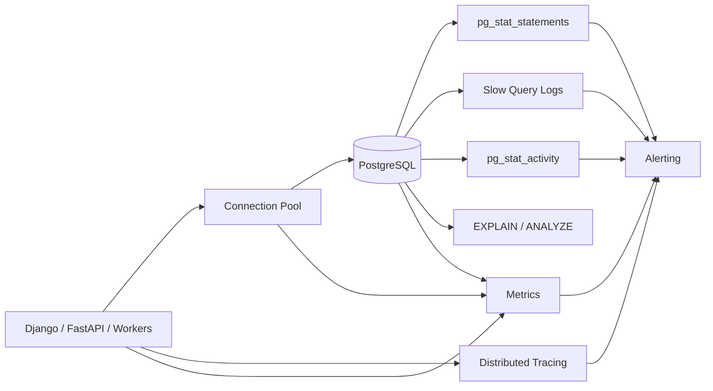
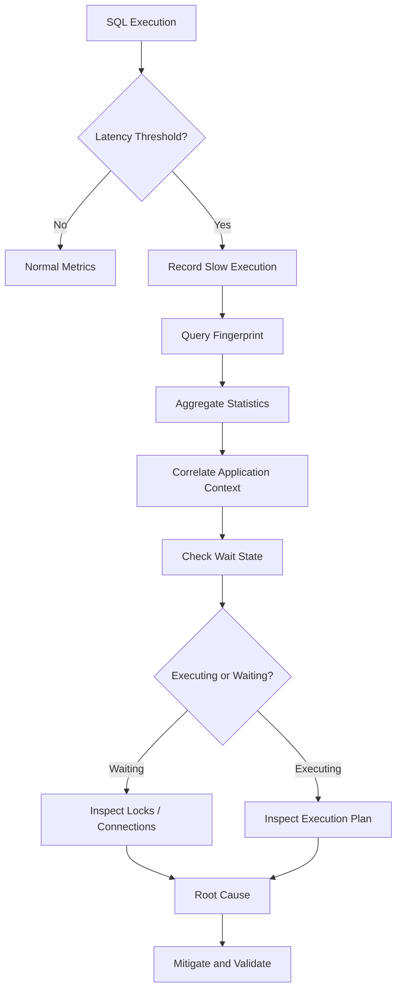
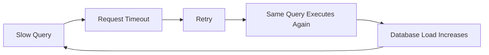

# 04- Slow Query Monitoring

## Overview

Slow query monitoring is the focused detection, measurement, investigation, and operational management of SQL statements whose execution time or resource consumption exceeds an acceptable threshold.

It is a subset of query performance monitoring, but the objective is different:

```text
Query Performance Monitoring
→ understand overall SQL workload

Slow Query Monitoring
→ identify queries that are unusually expensive or harmful
```

A slow query can be problematic because of:

- High execution latency
- High execution frequency
- Excessive CPU consumption
- Excessive I/O
- Large memory usage
- Lock waits
- Large result sets
- Temporary file usage
- Plan regressions
- Resource amplification through retries

A production strategy should therefore avoid treating:

```text
query > X milliseconds
```

as the complete definition of a slow query.

A better model is:

```text
Slow Query
=
Latency
+
Frequency
+
Resource Consumption
+
Concurrency
+
User Impact
```

---

## Why Slow Query Monitoring Matters

A single expensive query can consume database capacity and affect unrelated requests.



This is why slow-query monitoring is not merely a database administrator concern.

Backend engineers need to understand:

```text
Which query is slow?
Why is it slow?
How often does it execute?
Is it executing or waiting?
What changed?
What is the safest mitigation?
```

---

## Slow Query Detection Architecture



The strongest approach combines:

```text
database statistics
+
slow-query logs
+
application traces
+
connection metrics
+
infrastructure metrics
```

---

## What Counts as a Slow Query?

There is no universal threshold.

A useful threshold depends on:

| Query Type | Monitoring Priority |
|---|---|
| Authentication lookup | Very low latency |
| API lookup | Low latency |
| Transactional write | Low latency + lock behavior |
| Search query | Latency + result size |
| Reporting query | Total resource consumption |
| Batch job | Duration + throughput |
| ETL query | Resource utilization |
| Administrative query | Operational impact |

For example:

```text
50 ms
```

may be unacceptable for a high-volume API lookup but completely normal for a complex administrative report.

---

## Fixed Thresholds vs Dynamic Detection

### Fixed Threshold

Example:

```text
Alert if query > 1 second
```

Advantages:

- Simple
- Easy to understand
- Easy to configure
- Predictable

Limitations:

- Ignores workload differences
- Produces false positives
- Misses gradually degrading queries

### Dynamic Threshold

Compare current behavior against:

```text
historical baseline
+
query class
+
time of day
+
workload volume
```

Advantages:

- Detects regressions
- Better for heterogeneous workloads

Limitations:

- More complex
- Requires historical data
- Baselines can be polluted by previous incidents

Production systems commonly use fixed thresholds for critical user-facing paths and historical comparison for regression detection.

---

## Query Latency Percentiles

Monitor:

```text
p50
p95
p99
```

Example:

```text
p50 = 20 ms
p95 = 80 ms
p99 = 1.8 s
```

The average may still look healthy while a meaningful tail of queries is slow.

For user-facing systems, p95 and p99 are often more actionable than the average.

---

## Slow Query Frequency

A query should be evaluated by both:

```text
latency
```

and:

```text
frequency
```

Consider:

```text
Query A:
20 ms × 500,000 calls

Query B:
5 seconds × 20 calls
```

Query B is slower individually.

Query A may consume substantially more total database execution time.

Therefore monitor:

```text
slow executions
+
calls
+
total execution time
```

---

## Total Execution Time

`pg_stat_statements` is one of the primary tools for identifying high-impact SQL workloads.

```sql
SELECT
    query,
    calls,
    total_exec_time,
    mean_exec_time,
    rows
FROM pg_stat_statements
ORDER BY total_exec_time DESC
LIMIT 20;
```

This answers:

```text
Which query patterns consume the most aggregate database time?
```

It does not necessarily identify the single worst latency outlier.

Use multiple rankings:

```text
Top total execution time
Top mean latency
Top call count
Top rows processed
```

---

## `pg_stat_statements`

`pg_stat_statements` aggregates execution statistics for normalized SQL statements.

It is useful for:

- Slow query discovery
- Query workload ranking
- Regression detection
- Capacity analysis
- Identifying high-frequency queries
- Comparing application releases

Example:

```sql
SELECT
    query,
    calls,
    total_exec_time,
    mean_exec_time,
    rows
FROM pg_stat_statements
WHERE calls > 0
ORDER BY mean_exec_time DESC
LIMIT 20;
```

Use an appropriate observation window when interpreting the results.

Statistics can be reset, and low usage does not automatically mean a query or index is unimportant.

---

## Slow Query Logs

Slow-query logging provides statement-level evidence.

It is useful when:

```text
a query crosses an operational threshold
+
you need exact SQL context
+
statistics alone are insufficient
```

Slow-query logs can help answer:

```text
When did the query become slow?

How often is it happening?

Which application is issuing it?

Was it associated with an incident?
```

Avoid setting the threshold unnecessarily low.

Logging every moderately slow query can create:

```text
high log volume
+
storage cost
+
noise
+
difficult investigations
```

---

## Query Fingerprinting

A slow-query system should group equivalent query shapes.

For example:

```sql
SELECT *
FROM orders
WHERE customer_id = 1001;
```

and:

```sql
SELECT *
FROM orders
WHERE customer_id = 2002;
```

represent the same workload pattern.

Query fingerprinting makes it easier to detect:

```text
the same query becoming slower
```

rather than treating every parameter value as a separate query.

---

## Slow Query Detection Pipeline



---

## Executing vs Waiting

One of the most important slow-query distinctions is:

```text
slow because execution is expensive
```

versus:

```text
slow because execution is waiting
```

A query may spend most of its lifetime waiting for:

```text
row locks
+
table locks
+
I/O
+
other resources
```

Inspect:

```sql
SELECT
    pid,
    state,
    wait_event_type,
    wait_event,
    query_start,
    now() - query_start AS duration,
    query
FROM pg_stat_activity
WHERE state <> 'idle'
ORDER BY query_start;
```

If the query is waiting on a lock, adding an index may not solve the immediate problem.

---

## Lock Waits as Slow Queries

Consider:

```text
Transaction A
    ↓
locks order 123
    ↓
application pauses

Transaction B
    ↓
UPDATE order 123
    ↓
waits
```

Transaction B appears to be a slow query.

But its execution plan may be completely efficient.

The real problem is:

```text
transaction A
+
lock duration
```

Therefore slow-query monitoring should correlate:

```text
query duration
+
wait events
+
blocking PID
+
transaction age
```

---

## Finding Blocking Sessions

```sql
SELECT
    blocked.pid AS blocked_pid,
    blocking.pid AS blocking_pid,
    blocked.query AS blocked_query,
    blocking.query AS blocking_query
FROM pg_stat_activity AS blocked
JOIN pg_stat_activity AS blocking
    ON blocking.pid = ANY(pg_blocking_pids(blocked.pid));
```

The blocker often matters more than the slow query itself.

Investigate:

```text
why the blocker exists
+
how long it has been active
+
whether it is idle in transaction
+
which resource it holds
```

---

## Connection Pool Interaction

A slow query holds a connection longer.

```text
Query duration ↑
        ↓
Connection occupancy ↑
        ↓
Pool capacity ↓
        ↓
Pool wait time ↑
        ↓
Request latency ↑
```

Monitor:

```text
database query latency
+
pool acquisition latency
+
active connections
+
pool utilization
```

A request timeout caused by waiting for a pool connection is not the same as a slow SQL execution.

---

## Pool Exhaustion Can Look Like Slow Queries

Example:

```text
API request latency = 2 seconds

Connection acquisition = 1.7 seconds
SQL execution = 250 ms
Application = 50 ms
```

The SQL query is not the primary performance problem.

The application is waiting for a connection.

Always decompose latency before optimizing SQL.

---

## Application-Level Slow Queries

Django and SQLAlchemy applications can produce slow database behavior without a single inherently expensive SQL statement.

Common patterns:

```text
N+1 queries
+
excessive query count
+
large QuerySets
+
missing pagination
+
unnecessary columns
+
repeated identical queries
```

Example:

```text
Request
→ 1 query for orders
→ 100 queries for customers
→ 100 queries for products
```

Each query may be individually fast.

The request can still be slow and expensive.

---

## Django Slow Query Monitoring

Useful application-level signals include:

```text
endpoint
+
query count
+
database time
+
total request time
```

During development and testing, Django query inspection can identify ORM behavior.

Production monitoring should aggregate query behavior rather than logging every SQL statement indiscriminately.

Look for patterns involving:

```python
select_related()
prefetch_related()
```

and ensure they match actual access patterns.

---

## FastAPI and SQLAlchemy

For FastAPI services using SQLAlchemy, monitor:

```text
request latency
+
pool acquisition time
+
query execution time
+
transaction duration
```

The distinction between:

```text
pool wait
```

and:

```text
database execution
```

is particularly important in asynchronous services with high concurrency.

---

## Background Workers

Slow queries may originate outside HTTP traffic.

Monitor:

```text
Celery task rate
+
Kafka consumer rate
+
worker concurrency
+
database query rate
+
query latency
+
retry rate
```

Example:

```text
Celery concurrency ↑
→
database write concurrency ↑
→
lock contention ↑
→
query latency ↑
```

A database incident may therefore originate from a worker deployment rather than an API deployment.

---

## Slow Queries and Retries

Retries can amplify a slow-query incident.



Monitor:

```text
query timeout rate
+
retry rate
+
query calls
+
database CPU
```

Use bounded retries with exponential backoff and jitter.

---

## Execution Plan Analysis

Once a query is confirmed to be executing slowly, inspect the plan.

```sql
EXPLAIN
SELECT
    id,
    status,
    created_at
FROM orders
WHERE customer_id = 123
ORDER BY created_at DESC
LIMIT 50;
```

For controlled diagnostic environments:

```sql
EXPLAIN (ANALYZE, BUFFERS)
SELECT
    id,
    status,
    created_at
FROM orders
WHERE customer_id = 123
ORDER BY created_at DESC
LIMIT 50;
```

Remember:

> `EXPLAIN ANALYZE` executes the statement.

Do not run it casually against production DML.

---

## What to Inspect in a Slow Plan

Review:

```text
scan type
+
estimated rows
+
actual rows
+
loops
+
join strategy
+
sorts
+
aggregations
+
buffer activity
+
temporary I/O
```

Do not stop at:

```text
Sequential Scan
```

A sequential scan can be the correct plan.

---

## Cardinality Problems

A large difference between:

```text
estimated rows
```

and:

```text
actual rows
```

can cause poor plan selection.

Example:

```text
Estimated: 50 rows
Actual:    500,000 rows
```

Potential causes include:

```text
stale statistics
+
data distribution changes
+
correlated columns
+
insufficient statistics
+
parameter-sensitive workload
```

Cardinality errors can propagate through the entire plan.

---

## Index Investigation

When a slow query filters or joins on a column, inspect existing indexes before creating a new one.

Ask:

```text
Does an appropriate index exist?

Does its column order match the access pattern?

Is the predicate selective?

Can the index support ordering?

Can a covering strategy help?

Is the index actually used?
```

Inspect existing indexes:

```sql
SELECT
    schemaname,
    tablename,
    indexname,
    indexdef
FROM pg_indexes
WHERE schemaname NOT IN ('pg_catalog', 'information_schema')
ORDER BY schemaname, tablename, indexname;
```

---

## Index Usage

Index usage can be inspected with:

```sql
SELECT
    schemaname,
    relname,
    indexrelname,
    idx_scan,
    idx_tup_read,
    idx_tup_fetch
FROM pg_stat_user_indexes
ORDER BY idx_scan DESC;
```

Interpret these statistics carefully.

An index with low usage may still be:

```text
important for rare critical queries
+
enforcing uniqueness
+
used seasonally
```

Do not drop indexes based on one snapshot.

---

## Query Result Size

A query may be slow because it returns too much data.

Monitor:

```text
rows returned
+
bytes returned
```

Large result sets increase:

```text
database work
+
network traffic
+
application memory
+
serialization cost
```

Prefer explicit projections:

```sql
SELECT
    id,
    status,
    created_at
FROM orders
WHERE customer_id = $1;
```

rather than:

```sql
SELECT *
```

when all columns are unnecessary.

---

## Pagination Problems

Large offsets can create progressively more work.

Avoid assuming:

```sql
LIMIT 50 OFFSET 500000;
```

will be efficient on large tables.

Keyset pagination can provide more predictable access:

```sql
SELECT
    id,
    created_at
FROM orders
WHERE (created_at, id) < ($1, $2)
ORDER BY created_at DESC, id DESC
LIMIT 50;
```

Use a stable unique ordering and appropriate supporting indexes.

---

## Slow Aggregations

Monitor queries containing:

```text
GROUP BY
+
DISTINCT
+
window functions
+
large joins
+
large sorts
```

Potential symptoms:

```text
high CPU
+
high memory
+
temporary I/O
```

For repeatedly executed analytical workloads, consider:

```text
materialized views
+
pre-aggregation
+
OLAP workload isolation
```

rather than repeatedly running large analytical queries on OLTP tables.

---

## Temporary File Usage

Large sorts and hash operations can spill to temporary storage.

In an execution plan:

```text
temp read
+
temp written
```

can indicate substantial temporary I/O.

Possible causes:

```text
large datasets
+
insufficient working memory
+
large sorts
+
large hash operations
```

Do not respond by blindly increasing `work_mem`.

It can multiply memory consumption across concurrent operations.

---

## Slow Queries and Table Growth

A query may have been fast for years and become slow as data grows.

Example:

```text
10 million rows
→
100 million rows
→
1 billion rows
```

The workload may have changed even though the SQL did not.

Monitor:

```text
table growth
+
query latency
+
query plan
+
index size
+
statistics
```

Performance testing should use production-like data volumes.

---

## Partitioning and Slow Queries

Partitioning can help when queries contain predicates aligned with the partition key.

Monitor:

```text
partitions scanned
+
partitions pruned
+
partition size
```

Partitioning does not automatically make queries fast.

It does not replace:

```text
appropriate indexes
+
good predicates
+
correct joins
```

and does not inherently eliminate row-level contention.

---

## Replica Slow Queries

A query can be slower on a read replica because of:

```text
cache state
+
reporting workload
+
I/O pressure
+
replay activity
```

Monitor query performance per replica.

Also correlate:

```text
query latency
+
replica lag
```

A read-routing decision should consider consistency requirements as well as performance.

---

## Query Performance During Deployments

Deployments are common causes of slow-query regressions.

Potential causes:

```text
new query
+
changed ORM relationship
+
missing index
+
larger result set
+
new background worker
+
changed filtering
```

Compare:

```text
before deployment
vs
after deployment
```

using:

```text
query calls
+
latency
+
total execution time
+
plan
+
database resource usage
```

---

## Slow Query Monitoring by Release

Where practical, associate workload metrics with:

```text
service
+
version
+
endpoint
+
query fingerprint
```

Then a regression can be expressed as:

```text
release 2026.09.04
→
query fingerprint X
→
calls +40%
→
p95 latency +80%
→
total DB time +120%
```

This is much more actionable than:

```text
database became slow
```

---

## Slow Query Alerting

A useful slow-query alert should include:

```text
query fingerprint
+
service
+
database
+
current latency
+
baseline latency
+
call volume
+
error / timeout rate
```

Example:

```text
Query fingerprint:
orders_by_customer

p95:
850 ms

Baseline:
70 ms

Calls:
12,000/min

Service:
orders-api
```

This gives responders immediate context.

---

## Alert on Workload Impact

Do not alert only when:

```text
one execution > 1 second
```

Consider:

```text
p95 latency
+
p99 latency
+
total execution time
+
call volume
+
database CPU
```

A frequently executed moderately slow query can be more damaging than a rare extreme outlier.

---

## Slow Query Logs and Sensitive Data

SQL logs can expose:

```text
customer identifiers
+
emails
+
tokens
+
personal information
```

Use:

```text
normalized SQL
+
parameter redaction
+
controlled access
```

Do not trade security for debugging convenience.

Monitoring infrastructure should have:

```text
least privilege
+
retention controls
+
access auditing
```

---

## Production Mitigation Strategies

When a slow query causes an incident, possible mitigations include:

| Problem | Possible Mitigation |
|---|---|
| Query frequency spike | Rate limit / cache / fix caller |
| Missing index | Add appropriate index |
| Bad plan | Investigate statistics / plan behavior |
| Lock contention | Resolve blocker / reduce transaction scope |
| N+1 | Change application query pattern |
| Large result | Pagination / projection |
| Reporting load | Isolate analytical workload |
| Cache failure | Restore cache / control DB fallback |
| Worker storm | Reduce worker concurrency |
| Retry storm | Reduce retries / add backoff |
| Replica overload | Rebalance read traffic |

Mitigation should be reversible where possible.

---

## Emergency Query Cancellation

During severe incidents, cancellation may be necessary.

First identify the affected session carefully.

```sql
SELECT
    pid,
    usename,
    application_name,
    state,
    query_start,
    query
FROM pg_stat_activity
WHERE state <> 'idle';
```

PostgreSQL provides:

```sql
SELECT pg_cancel_backend(<pid>);
```

Cancellation is safer than terminating a backend in many cases because it requests cancellation of the current query rather than terminating the entire session.

Use termination only with deliberate operational justification.

---

## Timeouts as a Safety Boundary

Timeouts prevent pathological queries from occupying resources indefinitely.

Relevant PostgreSQL settings include:

```text
statement_timeout
lock_timeout
idle_in_transaction_session_timeout
```

They serve different purposes.

| Setting | Purpose |
|---|---|
| `statement_timeout` | Limits statement execution duration |
| `lock_timeout` | Limits waiting to acquire a lock |
| `idle_in_transaction_session_timeout` | Limits idle sessions holding open transactions |

Avoid using one timeout as a substitute for diagnosing the underlying problem.

---

## Monitoring Slow Query Trends

Track slow-query behavior over time:

```text
slow query count
+
slow query percentage
+
p95/p99 latency
+
total execution time
+
top fingerprints
```

Example:

```text
Week 1:
slow executions = 0.4%

Week 2:
slow executions = 0.8%

Week 3:
slow executions = 2.1%
```

A gradual increase may indicate:

```text
data growth
+
application regression
+
index degradation
+
capacity pressure
```

before an obvious outage occurs.

---

## Slow Query Monitoring and Capacity Planning

Use historical slow-query data to answer:

```text
When does the database become saturated?

Which queries scale poorly?

Which endpoints generate the most database work?

How does workload change as traffic grows?
```

A query whose cost grows approximately with table size deserves different treatment from one whose cost remains stable through an index lookup.

---

## Query Cost Model

A useful operational approximation is:

```text
Database Work
≈
Query Cost
×
Frequency
×
Concurrency
```

For slow-query monitoring, add:

```text
User Impact
```

A query can therefore be:

```text
slow but harmless
```

or:

```text
moderately slow but operationally dangerous
```

depending on how frequently and concurrently it executes.

---

## Common Mistakes

### Using One Global Slow Threshold

Different workloads have different latency requirements.

### Looking Only at Mean Latency

Tail latency can hide severe outliers.

### Looking Only at the Slowest Query

Aggregate execution time and frequency matter.

### Assuming Slow Means Bad SQL

The query may be waiting for a lock or connection.

### Adding an Index Immediately

First establish whether the query is actually suffering from an access-path problem.

### Running `EXPLAIN ANALYZE` Against Production DML

It executes the statement.

### Ignoring `loops`

A cheap plan node repeated thousands of times can dominate execution.

### Increasing `work_mem` Blindly

Concurrent memory consumption can become dangerous.

### Ignoring N+1 Queries

The problem may be query volume rather than individual query latency.

### Ignoring Retries

Retries can amplify the database workload.

### Ignoring Background Workers

Celery and Kafka consumers can create substantial database traffic.

### Logging Sensitive Parameters

Slow-query logs can become a data-exposure mechanism.

### Dropping Low-Usage Indexes Immediately

Index statistics may be incomplete, reset, or affected by workload seasonality.

---

## Production Investigation Checklist

### Detect

- [ ] Identify the slow query fingerprint.
- [ ] Measure p95/p99 latency.
- [ ] Check call frequency.
- [ ] Check total execution time.
- [ ] Confirm whether customer impact exists.

### Classify

- [ ] Is the query executing or waiting?
- [ ] Is the database CPU constrained?
- [ ] Is I/O constrained?
- [ ] Is memory under pressure?
- [ ] Is the connection pool exhausted?
- [ ] Is there lock contention?

### Investigate

- [ ] Inspect `pg_stat_statements`.
- [ ] Inspect `pg_stat_activity`.
- [ ] Inspect blocking sessions.
- [ ] Inspect execution plans.
- [ ] Compare estimated and actual rows.
- [ ] Inspect indexes.
- [ ] Inspect buffer and temporary I/O behavior.

### Correlate

- [ ] Check recent deployments.
- [ ] Check traffic changes.
- [ ] Check retry rates.
- [ ] Check Redis/cache behavior.
- [ ] Check Celery/Kafka workloads.
- [ ] Check replica state.

### Mitigate

- [ ] Reduce workload if necessary.
- [ ] Resolve blocking transactions.
- [ ] Apply a safe query/index fix.
- [ ] Control retries.
- [ ] Protect the database with appropriate timeouts.

### Validate

- [ ] Confirm query latency recovered.
- [ ] Confirm connection pressure recovered.
- [ ] Confirm database resource usage recovered.
- [ ] Confirm customer-facing latency recovered.
- [ ] Record the root cause and preventive action.

---

## Production Best Practices

- Use `pg_stat_statements` as a primary workload-level source.
- Use slow-query logging for detailed threshold-based investigation.
- Monitor p95 and p99 rather than averages alone.
- Rank queries by both latency and aggregate execution time.
- Always distinguish execution time from wait time.
- Correlate slow queries with connection pool utilization.
- Include Django, FastAPI, Celery, and Kafka workloads in database analysis.
- Compare query behavior before and after deployments.
- Inspect execution plans before changing indexes.
- Validate cardinality estimates and buffer behavior.
- Use realistic data volumes for performance testing.
- Apply bounded timeouts to protect database capacity.
- Keep slow-query telemetry secure and redact sensitive data.
- Prefer reversible incident mitigations.
- Record query-performance regressions as engineering signals rather than isolated database events.

---

## Interview Perspective

A strong senior-level answer to:

> How would you monitor and troubleshoot slow SQL queries in production?

should cover:

```text
1. Detect query fingerprints with pg_stat_statements.
2. Monitor p95/p99 and aggregate execution time.
3. Determine whether the query is executing or waiting.
4. Inspect locks, connection pools, and transaction duration.
5. Analyze EXPLAIN plans and cardinality.
6. Check indexes, I/O, memory, and CPU.
7. Correlate with application deployments and workload changes.
8. Check N+1, retries, Celery, Kafka, and cache failures.
9. Apply the safest mitigation.
10. Validate recovery and prevent recurrence.
```

A weak answer is:

```text
"Find slow queries and add indexes."
```

A senior answer recognizes that a slow query can be caused by:

```text
SQL
+
planner
+
statistics
+
locks
+
connections
+
application behavior
+
infrastructure
+
workload amplification
```

---

## Senior-Level Mental Model

Treat every slow query as a hypothesis rather than a diagnosis.

```text
Slow Query
    ↓
Is it actually executing?
    ├── No → locks / I/O / connection / resource wait
    └── Yes
          ↓
      Is the plan appropriate?
          ├── No → statistics / indexes / query shape / planner
          └── Yes
                ↓
            Is workload volume excessive?
                ├── Yes → caching / batching / rate limiting / architecture
                └── No
                      ↓
                  Is the data volume growing?
                      ├── Yes → indexing / partitioning / workload redesign
                      └── No
                            ↓
                        Investigate resource saturation
```

The objective is not simply to make one SQL statement faster.

The objective is to ensure that:

```text
query behavior
+
application concurrency
+
database capacity
+
user-facing latency
```

remain within acceptable operational boundaries.

---

## Key Takeaways

- **A slow query is a symptom, not automatically a SQL problem:** first determine whether the query is executing, waiting on locks, waiting for a connection, or affected by infrastructure pressure.
- **Measure impact across multiple dimensions:** latency, frequency, total execution time, concurrency, result size, and resource consumption determine whether a slow query is operationally significant.
- **Use PostgreSQL evidence before changing the query:** `pg_stat_statements`, `pg_stat_activity`, execution plans, cardinality, buffers, locks, and index usage provide the evidence needed for safe optimization.
- **Correlate slow queries with the entire backend system:** deployments, ORM behavior, connection pools, retries, Redis failures, Celery workers, Kafka consumers, and replica workload can all create or amplify slow-query incidents.
- **Treat slow-query monitoring as a reliability mechanism:** detect regressions early, apply bounded timeouts and safe mitigations, validate recovery, and prevent recurrence through workload-aware engineering.