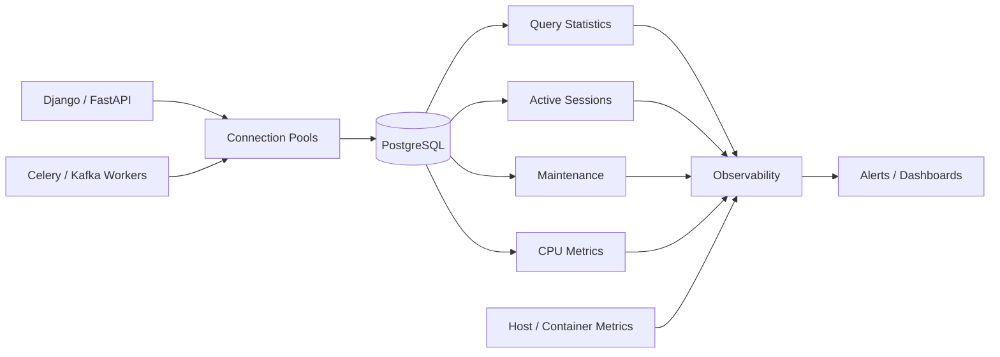
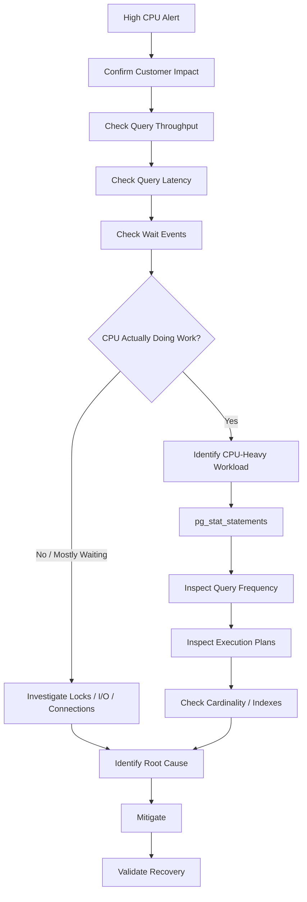
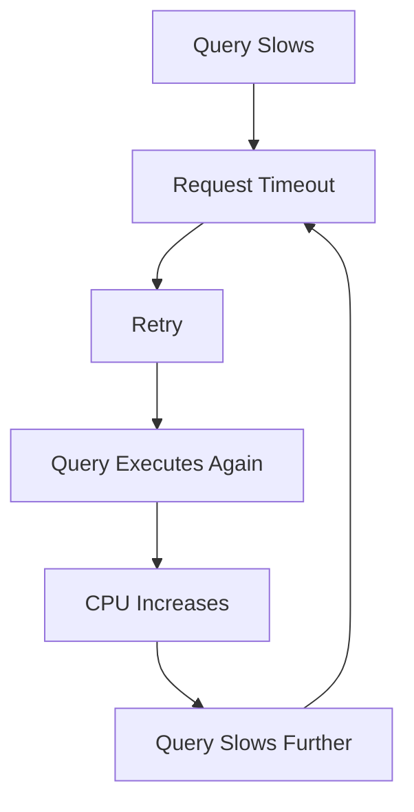

# 05- Database CPU Monitoring

## Overview

Database CPU monitoring is the continuous measurement of CPU consumption, CPU saturation, and CPU-intensive database workloads.

For PostgreSQL production systems, high CPU is a **symptom**, not a root cause.

A database can consume excessive CPU because of:

- Expensive SQL execution
- High query frequency
- Poor execution plans
- Large joins
- Sorting and aggregation
- JSON or text processing
- Regular expressions
- N+1 application behavior
- Retry storms
- Excessive connection concurrency
- Autovacuum or other maintenance activity
- DDL operations
- Background workers
- Analytical workloads running on an OLTP database

The correct investigation therefore connects:

```text
CPU
+
Query workload
+
Concurrency
+
Wait events
+
Application behavior
+
Recent changes
```

The objective is not simply to keep CPU below an arbitrary percentage. The objective is to keep database throughput and latency within acceptable limits while maintaining sufficient capacity for traffic spikes and failure scenarios.

---

## CPU Monitoring Architecture



CPU monitoring should combine:

```text
infrastructure metrics
+
PostgreSQL workload statistics
+
application telemetry
```

Monitoring only host CPU cannot tell you which workload caused the increase.

---

## What CPU Utilization Means

CPU utilization indicates how much processor capacity is being consumed.

High CPU can mean:

```text
the database is doing useful work
```

or:

```text
the database is doing excessive or inefficient work
```

For example:

```text
CPU = 90%
Query throughput = healthy
Latency = healthy
```

may be acceptable.

But:

```text
CPU = 90%
Query latency = increasing
Connection waits = increasing
Timeouts = increasing
```

indicates a likely capacity or workload problem.

CPU percentage must therefore be interpreted with:

```text
latency
+
throughput
+
saturation
+
errors
```

---

## CPU Saturation vs CPU Utilization

These concepts should be distinguished.

### High Utilization

The CPU is busy.

### CPU Saturation

The workload wants more CPU than is currently available, causing queueing or reduced service capacity.

A useful production model is:

```text
CPU utilization
+
run queue
+
query latency
+
throughput
```

A database can have high utilization without immediate user impact if sufficient headroom remains.

---

## Why Database CPU Becomes High

Common causes include:

| Cause | Typical Symptom |
|---|---|
| Expensive query | High CPU per execution |
| High query frequency | Many executions |
| N+1 queries | Excessive query count |
| Bad execution plan | Unexpected CPU growth |
| Large joins | High CPU and memory |
| Sorts | CPU + memory/temp I/O |
| Aggregations | CPU + memory |
| JSON processing | CPU-heavy expressions |
| Regex | CPU-heavy filtering |
| Retry storm | Query volume suddenly increases |
| Autovacuum | Maintenance CPU |
| Analytics workload | Sustained CPU |
| Worker scaling | Increased concurrent queries |
| Missing/incorrect index | Excessive rows processed |

The first step is classification, not optimization.

---

## CPU Investigation Model



This prevents teams from jumping directly to:

```text
increase database instance size
```

before understanding the workload.

---

## CPU Monitoring Signals

A useful CPU dashboard should include:

```text
CPU utilization
+
CPU load / run queue
+
query calls
+
query execution time
+
database latency
+
active connections
+
wait events
+
autovacuum activity
+
temporary I/O
```

The exact infrastructure metrics depend on the operating system, container platform, and managed database service.

---

## CPU and Query Throughput

CPU should be interpreted relative to workload volume.

Example:

```text
Queries/sec ↑
CPU ↑
Latency stable
```

This may represent normal scaling behavior.

But:

```text
Queries/sec stable
CPU ↑
Latency ↑
```

is more suspicious.

Possible causes include:

```text
plan regression
+
data growth
+
index change
+
statistics problem
+
more expensive query parameters
```

---

## CPU and Query Latency

Consider:

```text
CPU = 95%
p99 query latency = 2 seconds
```

versus:

```text
CPU = 95%
p99 query latency = 20 ms
```

The first strongly suggests CPU pressure is affecting workload performance.

The second may be sustainable depending on available headroom and workload requirements.

Always correlate CPU with latency and throughput.

---

## CPU and Wait Events

A query can be slow while consuming little CPU.

For example:

```text
Query
 ↓
waits for row lock
 ↓
CPU remains relatively low
 ↓
query latency increases
```

Inspect:

```sql
SELECT
    wait_event_type,
    wait_event,
    count(*)
FROM pg_stat_activity
WHERE wait_event IS NOT NULL
GROUP BY wait_event_type, wait_event
ORDER BY count(*) DESC;
```

If most sessions are waiting rather than executing, adding CPU may not address the immediate bottleneck.

---

## Identifying CPU-Heavy Queries

`pg_stat_statements` is one of the most useful tools for identifying expensive workloads.

```sql
SELECT
    query,
    calls,
    total_exec_time,
    mean_exec_time,
    rows
FROM pg_stat_statements
ORDER BY total_exec_time DESC
LIMIT 20;
```

This identifies queries consuming the most aggregate execution time.

However, aggregate execution time is not a direct CPU measurement.

Use it together with:

```text
CPU metrics
+
execution plans
+
query frequency
```

to establish causality.

---

## Ranking by Query Frequency

High-frequency queries can dominate CPU even when each execution is inexpensive.

```sql
SELECT
    query,
    calls,
    mean_exec_time,
    total_exec_time
FROM pg_stat_statements
ORDER BY calls DESC
LIMIT 20;
```

Consider:

```text
1 ms × 10,000,000 executions
```

This can be a much larger workload than:

```text
5 seconds × 100 executions
```

---

## Ranking by Total Execution Time

```sql
SELECT
    query,
    calls,
    total_exec_time,
    mean_exec_time
FROM pg_stat_statements
ORDER BY total_exec_time DESC
LIMIT 20;
```

This helps identify the largest aggregate query workloads.

For CPU investigations, inspect both:

```text
high call count
+
high total execution time
```

---

## Ranking by Mean Latency

```sql
SELECT
    query,
    calls,
    mean_exec_time,
    total_exec_time
FROM pg_stat_statements
WHERE calls >= 100
ORDER BY mean_exec_time DESC
LIMIT 20;
```

Filtering by a minimum call count avoids overreacting to a query executed once.

The threshold should reflect the application's workload.

---

## CPU Cost of N+1 Queries

N+1 queries are often CPU problems disguised as application problems.

Example:

```text
1 query → load 500 orders
500 queries → load customer information
500 queries → load product information
```

Even if each query is inexpensive, aggregate CPU consumption can become substantial.

For Django, inspect ORM relationship loading and use appropriate:

```python
select_related()
prefetch_related()
```

For SQLAlchemy, inspect relationship loading strategies and generated SQL.

---

## CPU-Heavy Sequential Scans

A sequential scan can be completely correct.

The problem occurs when:

```text
large table
+
low-selectivity filter
+
high query frequency
```

causes PostgreSQL to repeatedly inspect large numbers of rows.

Use:

```sql
EXPLAIN (ANALYZE, BUFFERS)
SELECT ...
```

in a controlled environment to determine:

```text
rows scanned
+
rows returned
+
actual execution time
+
buffer activity
```

Do not add an index merely because a sequential scan appears in the plan.

---

## CPU and Incorrect Indexes

An index can exist while the workload remains CPU-intensive.

Possible reasons include:

```text
wrong column order
+
low selectivity
+
expression mismatch
+
implicit casts
+
non-sargable predicates
+
incorrect partial predicate
+
planner estimates
```

Inspect the complete execution plan before changing the index.

---

## CPU and Cardinality

Incorrect row estimates can cause inefficient plans.

Example:

```text
Estimated rows = 100
Actual rows    = 5,000,000
```

This can cause the planner to select an inappropriate join or access strategy.

Check:

```text
estimated rows
+
actual rows
+
loops
```

Large mismatches can indicate statistics or data-distribution problems.

---

## CPU and Joins

Large joins can consume substantial CPU.

Common contributors include:

```text
large nested loops
+
hash joins
+
merge joins
+
poor join order
+
row multiplication
```

A nested loop is not automatically bad.

For example:

```text
small outer relation
+
indexed inner lookup
```

can be highly efficient.

The problem is usually incorrect cardinality or excessive work, not the join algorithm's name.

---

## CPU and Aggregation

CPU-intensive SQL commonly includes:

```text
GROUP BY
+
DISTINCT
+
COUNT
+
SUM
+
window functions
```

Large aggregations can also consume significant memory and temporary storage.

For repeatedly executed analytical workloads, consider:

```text
pre-aggregation
+
materialized views
+
OLAP isolation
```

rather than continuously consuming CPU on the transactional database.

---

## CPU and Sorting

Large sorts can consume significant CPU.

Examples:

```sql
ORDER BY
DISTINCT
window functions
```

An appropriate index can sometimes eliminate or reduce sorting.

For example, an index aligned with:

```text
WHERE customer_id = ?
ORDER BY created_at DESC
```

may allow PostgreSQL to retrieve the required rows in the desired order.

Validate the plan rather than assuming an index will always remove sorting.

---

## CPU and JSON Processing

PostgreSQL JSON/JSONB operations can become CPU-intensive when applied to large row sets.

Example pattern:

```sql
SELECT *
FROM events
WHERE payload->>'event_type' = 'purchase';
```

If this processes millions of rows repeatedly, CPU consumption can increase substantially.

Possible solutions may include:

```text
appropriate expression indexes
+
GIN indexes where suitable
+
schema changes for frequently queried fields
+
workload redesign
```

Choose based on actual access patterns.

---

## CPU and Regular Expressions

Regular expressions can be expensive when applied to large datasets.

Example:

```sql
SELECT *
FROM customers
WHERE email ~ 'pattern';
```

Repeated regex evaluation over large tables can consume significant CPU.

For frequently executed searches, consider whether:

```text
B-tree
+
trigram
+
normalized columns
+
search infrastructure
```

better matches the workload.

---

## CPU and Functions

CPU can increase when SQL repeatedly invokes expensive functions.

Examples include:

```text
JSON transformation
+
string processing
+
cryptographic functions
+
regular expressions
+
user-defined functions
```

Inspect whether the function is evaluated:

```text
once
```

or:

```text
millions of times
```

because function cost multiplied by row count can become substantial.

---

## CPU and Large Result Sets

Returning large result sets consumes CPU in:

```text
database serialization
+
network transfer
+
application deserialization
+
JSON encoding
```

Monitor:

```text
rows returned
+
response size
```

Prefer:

```text
pagination
+
projection
+
aggregation
```

when appropriate.

---

## CPU and Connection Concurrency

More connections do not automatically produce more useful throughput.

Example:

```text
10 concurrent queries
→
CPU 60%

50 concurrent queries
→
CPU 100%
→
latency increases
```

Additional concurrency can increase:

```text
CPU contention
+
memory consumption
+
context switching
+
queueing
```

Connection pools should therefore control concurrency rather than maximizing the number of active database sessions.

---

## Connection Pool Amplification

Suppose:

```text
20 Kubernetes pods
×
10 connections
=
200 possible connections
```

A deployment that increases pod count to 50 could create:

```text
50 × 10 = 500 connections
```

The application may suddenly increase database concurrency without any increase in customer traffic.

Monitor:

```text
pod count
+
pool size
+
active connections
+
CPU
+
query latency
```

together.

---

## CPU and Retry Storms

Retries can turn a performance problem into a CPU incident.



Monitor:

```text
timeout rate
+
retry rate
+
query calls
+
CPU
```

Use:

```text
bounded retries
+
exponential backoff
+
jitter
```

and avoid retrying non-transient database errors.

---

## CPU and Celery

Celery workers can create substantial database CPU load.

Example:

```text
Worker concurrency ↑
        ↓
Queries/task ↑
        ↓
Database concurrency ↑
        ↓
CPU ↑
```

Monitor:

```text
worker concurrency
+
task throughput
+
database query rate
+
query latency
```

Do not scale workers independently of database capacity.

---

## CPU and Kafka Consumers

Kafka consumers can similarly increase database workload.

Example:

```text
Kafka consumer count ↑
        ↓
database writes/sec ↑
        ↓
CPU ↑
```

Monitor:

```text
consumer lag
+
consumer concurrency
+
batch size
+
database write rate
```

Batch processing can reduce per-row overhead, but transaction size and lock duration must remain controlled.

---

## CPU and Redis Failures

A Redis cache failure can indirectly cause PostgreSQL CPU saturation.

```text
Redis unavailable
    ↓
cache misses ↑
    ↓
database reads ↑
    ↓
PostgreSQL CPU ↑
```

During a CPU incident, check:

```text
cache hit rate
+
Redis health
+
database query volume
```

Do not assume every database workload increase originates in PostgreSQL.

---

## CPU and Autovacuum

Autovacuum consumes CPU as part of normal database maintenance.

CPU increases may be associated with:

```text
high update/delete volume
+
dead tuple cleanup
+
analyze activity
+
large tables
```

Inspect table maintenance statistics:

```sql
SELECT
    schemaname,
    relname,
    n_live_tup,
    n_dead_tup,
    last_autovacuum,
    last_autoanalyze
FROM pg_stat_user_tables
ORDER BY n_dead_tup DESC
LIMIT 20;
```

Do not disable autovacuum simply because it consumes CPU.

That can create larger problems involving:

```text
bloat
+
statistics
+
query performance
+
transaction ID maintenance
```

---

## CPU and DDL

Schema changes can create CPU and I/O pressure.

Examples:

```text
CREATE INDEX
+
large table rewrites
+
ALTER TABLE operations
+
data migrations
```

Before running expensive production operations, consider:

```text
table size
+
traffic
+
CPU headroom
+
I/O headroom
+
replication impact
```

For indexes, `CREATE INDEX CONCURRENTLY` can reduce blocking of ordinary writes, but it is slower, has additional operational considerations, and cannot run inside a transaction block.

---

## CPU and Statistics

Planner statistics influence execution plans.

After substantial data changes, stale statistics can contribute to poor plans.

Monitor:

```text
last analyze
+
last autoanalyze
+
estimated vs actual rows
```

A CPU regression may therefore be caused by:

```text
statistics
→
plan selection
→
more rows processed
→
CPU increase
```

---

## CPU and Data Growth

Queries can become more CPU-intensive as tables grow.

Example:

```text
10 million rows
→
100 million rows
→
500 million rows
```

A query that was acceptable at 10 million rows may become expensive later.

Track:

```text
table size
+
query latency
+
rows processed
+
CPU
```

Capacity planning must consider workload growth, not only current performance.

---

## CPU and Partitioning

Partitioning can reduce the amount of data processed when partition pruning applies.

Monitor:

```text
partitions scanned
+
partitions pruned
+
rows processed
```

Partitioning is not a universal CPU optimization.

It does not automatically solve:

```text
poor predicates
+
expensive joins
+
hot rows
+
high query frequency
```

---

## CPU Troubleshooting Query Set

### Active Sessions

```sql
SELECT
    pid,
    usename,
    application_name,
    state,
    wait_event_type,
    wait_event,
    query_start,
    now() - query_start AS query_duration,
    query
FROM pg_stat_activity
WHERE state <> 'idle'
ORDER BY query_start;
```

### Top Workloads

```sql
SELECT
    query,
    calls,
    total_exec_time,
    mean_exec_time,
    rows
FROM pg_stat_statements
ORDER BY total_exec_time DESC
LIMIT 20;
```

### Highest Frequency

```sql
SELECT
    query,
    calls,
    mean_exec_time,
    total_exec_time
FROM pg_stat_statements
ORDER BY calls DESC
LIMIT 20;
```

### Table Maintenance

```sql
SELECT
    schemaname,
    relname,
    n_live_tup,
    n_dead_tup,
    last_autovacuum,
    last_autoanalyze
FROM pg_stat_user_tables
ORDER BY n_dead_tup DESC
LIMIT 20;
```

---

## CPU Investigation Sequence

Use the following workflow during an incident:

1. Confirm CPU saturation and customer impact.
2. Check query throughput and latency.
3. Determine whether sessions are executing or waiting.
4. Identify top query fingerprints.
5. Check whether query frequency changed.
6. Check recent deployments and feature rollouts.
7. Inspect execution plans for high-impact queries.
8. Compare estimated and actual cardinality.
9. Check indexes, joins, sorts, and aggregations.
10. Check connection and worker concurrency.
11. Check Redis, Celery, Kafka, and retry behavior.
12. Check maintenance activity.
13. Apply the safest reversible mitigation.
14. Validate recovery.
15. Prevent recurrence.

---

## Emergency Mitigation

During severe CPU saturation, mitigation should prioritize protecting availability.

Possible actions include:

```text
reduce worker concurrency
+
disable non-critical batch jobs
+
rate-limit expensive endpoints
+
temporarily reduce background workload
+
restore failed cache capacity
+
stop runaway queries
+
control retries
```

Depending on the workload, adding read replicas can reduce read pressure on the primary.

However:

> Read replicas do not solve write CPU pressure.

Vertical scaling may be appropriate when the workload is legitimate and sustained, but it should not replace root-cause analysis.

---

## Query Cancellation

If a runaway query is consuming resources, identify it carefully:

```sql
SELECT
    pid,
    usename,
    application_name,
    state,
    query_start,
    now() - query_start AS duration,
    query
FROM pg_stat_activity
WHERE state <> 'idle'
ORDER BY query_start;
```

Then, when operationally justified:

```sql
SELECT pg_cancel_backend(<pid>);
```

Cancellation is generally preferable to immediately terminating the entire session.

Do not terminate sessions blindly.

Consider:

```text
transaction state
+
application behavior
+
locks
+
customer impact
```

before taking action.

---

## Timeouts as CPU Protection

Appropriate timeouts can prevent pathological workloads from consuming CPU indefinitely.

Relevant PostgreSQL settings include:

```text
statement_timeout
+
lock_timeout
+
idle_in_transaction_session_timeout
```

They solve different problems.

| Setting | Purpose |
|---|---|
| `statement_timeout` | Limits statement execution duration |
| `lock_timeout` | Limits time waiting to acquire locks |
| `idle_in_transaction_session_timeout` | Terminates sessions idle inside transactions |

Timeouts are safety boundaries, not substitutes for query optimization.

---

## Vertical Scaling

Increasing CPU capacity can be appropriate when:

```text
workload is legitimate
+
queries are already reasonably optimized
+
CPU is consistently saturated
+
latency requirements justify more capacity
```

Advantages:

- Simple
- Fast to implement
- Minimal application changes

Limitations:

- Higher cost
- Finite scaling ceiling
- Does not fix inefficient workload
- Does not solve lock contention
- Does not solve connection storms

Use vertical scaling as part of capacity management, not as the only performance strategy.

---

## Horizontal Scaling

Horizontal strategies may include:

```text
read replicas
+
workload isolation
+
OLAP separation
+
caching
+
service decomposition
+
sharding
```

These are architectural changes and should be driven by workload characteristics.

For example:

```text
Read-heavy workload
→
read replicas / caching

Analytics workload
→
OLAP system

Write-heavy workload
→
optimize writes / batching / partitioning / sharding where justified
```

---

## CPU Capacity and High Availability

Do not run production databases continuously at the edge of CPU capacity.

A primary database may need additional capacity during:

```text
traffic spikes
+
failover
+
maintenance
+
replica loss
```

For example:

```text
Primary
CPU = 75%

Replica fails
    ↓
reads move to primary
    ↓
CPU = 95%
    ↓
latency increases
```

Capacity planning must consider failure scenarios, not only steady-state workload.

---

## CPU Monitoring in Kubernetes

Container-level CPU limits can complicate diagnosis.

A database may appear to have:

```text
CPU available at host level
```

while the container is constrained by:

```text
CPU limit
```

Monitor both:

```text
container CPU usage
+
container CPU throttling
+
host CPU
+
database CPU
```

For managed PostgreSQL, the relevant infrastructure metrics depend on the service and deployment model.

---

## CPU Monitoring in AWS

For AWS-managed PostgreSQL deployments, combine:

```text
database metrics
+
CloudWatch metrics
+
PostgreSQL statistics
+
application telemetry
```

Useful categories include:

```text
CPU
+
connections
+
I/O
+
storage
+
replication
+
latency
```

Do not rely exclusively on infrastructure-level CPU metrics when PostgreSQL-level workload data is available.

---

## CPU Alerts

Avoid a single alert such as:

```text
CPU > 80%
```

Prefer multi-signal alerts.

For example:

```text
CPU sustained above the operational threshold
AND
database latency exceeds its SLO
```

This reduces false positives.

Other useful alerts include:

```text
CPU saturation sustained
+
query latency regression
+
connection pressure
+
query throughput anomaly
```

---

## CPU Dashboard

A useful production dashboard should show:

```text
CPU utilization
CPU saturation / run queue
Query calls/sec
Total query execution time
p95/p99 database latency
Active connections
Pool utilization
Lock waits
Temporary I/O
Autovacuum activity
WAL generation
Replica lag
```

Add deployment markers so engineers can correlate:

```text
release
→
query behavior
→
CPU change
```

---

## Security Considerations

CPU monitoring systems can expose:

```text
SQL statements
+
database usernames
+
client addresses
+
application identifiers
```

Protect monitoring data with:

```text
least-privilege access
+
appropriate retention
+
redaction
+
audit logging
```

Avoid exposing sensitive query parameters in dashboards or logs.

Monitoring credentials should not use PostgreSQL superuser access unless there is a documented operational requirement.

---

## Cost Considerations

CPU pressure can drive infrastructure cost through:

```text
larger database instances
+
additional replicas
+
higher observability volume
+
more worker capacity
```

Before scaling infrastructure, determine whether the CPU is being spent on:

```text
necessary workload
```

or:

```text
avoidable work
```

Examples of avoidable work include:

```text
N+1 queries
+
duplicate queries
+
retry storms
+
inefficient joins
+
unnecessary background jobs
```

Query optimization can therefore reduce both latency and infrastructure cost.

---

## Common Mistakes

### Treating High CPU as the Root Cause

High CPU only tells you that processors are busy.

Find the workload causing it.

### Adding More CPU Immediately

Scaling may hide an inefficient query temporarily.

### Assuming Sequential Scans Are Bad

A sequential scan can be optimal.

### Looking Only at Mean Query Time

Frequency and aggregate execution time matter.

### Ignoring Query Frequency

A 1 ms query executed millions of times can dominate CPU.

### Ignoring Locks

A CPU problem and a lock-wait problem require different solutions.

### Increasing Connection Pools

More connections can increase CPU contention and memory pressure.

### Scaling Celery Workers Without Database Analysis

Worker concurrency directly affects database concurrency.

### Ignoring Kafka Consumers

Consumer scaling can increase database write pressure.

### Ignoring Redis Failures

Cache failures can suddenly increase PostgreSQL read traffic.

### Disabling Autovacuum

This can create larger performance and maintenance problems.

### Increasing `work_mem` Blindly

Per-operation memory can multiply across concurrent queries.

### Using CPU Percentage Without Latency

High CPU can be acceptable when throughput and latency remain healthy.

### Killing Queries Without Understanding Them

Query cancellation can create application errors or transaction side effects.

---

## Production CPU Monitoring Checklist

### Detection

- [ ] CPU utilization is monitored.
- [ ] CPU saturation is monitored.
- [ ] Query throughput is monitored.
- [ ] Database latency is monitored.
- [ ] CPU alerts include workload context.

### Query Workload

- [ ] `pg_stat_statements` is available.
- [ ] Top queries by total execution time are visible.
- [ ] High-frequency queries are visible.
- [ ] Query latency percentiles are monitored.
- [ ] Query fingerprints can be correlated with services.

### Diagnosis

- [ ] `pg_stat_activity` is available.
- [ ] Wait events are monitored.
- [ ] Blocking sessions can be identified.
- [ ] Execution plans can be inspected.
- [ ] Estimated vs actual cardinality can be compared.

### Application

- [ ] Connection pool utilization is monitored.
- [ ] N+1 patterns are investigated.
- [ ] Celery workloads are monitored.
- [ ] Kafka consumer workloads are monitored.
- [ ] Retry rates are monitored.
- [ ] Redis cache behavior is correlated with database load.

### Maintenance

- [ ] Autovacuum activity is monitored.
- [ ] Dead tuples are monitored.
- [ ] Analyze activity is monitored.
- [ ] DDL operations are visible.

### Capacity

- [ ] CPU growth is tracked over time.
- [ ] Traffic growth is tracked.
- [ ] Capacity headroom is defined.
- [ ] Failover scenarios are considered.
- [ ] Scaling decisions are based on workload evidence.

### Security

- [ ] Monitoring access follows least privilege.
- [ ] Sensitive query data is protected.
- [ ] Monitoring credentials are managed securely.
- [ ] Observability data has appropriate retention.

---

## Interview Perspective

A strong senior-level answer to:

> How would you troubleshoot high CPU on a PostgreSQL database?

should follow a structured process:

```text
1. Confirm CPU saturation and customer impact.
2. Check query throughput and latency.
3. Determine whether sessions are executing or waiting.
4. Use pg_stat_statements to identify workload contributors.
5. Compare query frequency and total execution time.
6. Inspect execution plans.
7. Check cardinality, indexes, joins, sorts, and aggregations.
8. Check connection pool and worker concurrency.
9. Check retries, Redis, Celery, and Kafka.
10. Check autovacuum and maintenance activity.
11. Mitigate safely.
12. Validate recovery.
13. Prevent recurrence.
```

A strong answer also explains that:

```text
high CPU
≠
bad query
```

and:

```text
low CPU
≠
healthy database
```

A database can be unhealthy because of:

```text
locks
+
I/O
+
connection exhaustion
+
replication
+
storage
```

without CPU being saturated.

---

## Senior-Level CPU Mental Model

At senior level, think about CPU as a shared finite resource.

```text
Application Workload
        ↓
Query Frequency
        ↓
Query Cost
        ↓
Concurrency
        ↓
CPU Consumption
        ↓
Queueing
        ↓
Latency
        ↓
Timeouts
        ↓
Retries
        ↓
More Work
```

The optimization target is therefore:

```text
useful throughput per unit of CPU
```

rather than simply:

```text
lower CPU percentage
```

A mature response to CPU pressure asks:

```text
What workload changed?

Which queries consume the capacity?

Are they executing or waiting?

Why did their cost increase?

Can unnecessary work be removed?

Can concurrency be controlled?

Can the workload be cached or isolated?

Do we need more capacity?

What happens during failover?
```

This produces a more reliable database architecture than reacting to CPU graphs in isolation.

---

## Key Takeaways

- **High database CPU is a symptom, not a diagnosis:** correlate CPU with query volume, latency, execution plans, wait events, maintenance activity, and application behavior.
- **Optimize aggregate workload:** query frequency, execution cost, concurrency, N+1 patterns, retries, workers, and cache failures can matter more than one slow SQL statement.
- **Distinguish execution from waiting:** CPU saturation requires different remediation from lock contention, I/O pressure, or connection pool exhaustion.
- **Scale only after understanding the workload:** vertical scaling can provide capacity quickly, while replicas, caching, workload isolation, and sharding address different architectural bottlenecks.
- **Design CPU monitoring around reliability:** maintain headroom for traffic spikes and failover, use multi-signal alerts, and validate that mitigations improve both database health and customer-facing latency.