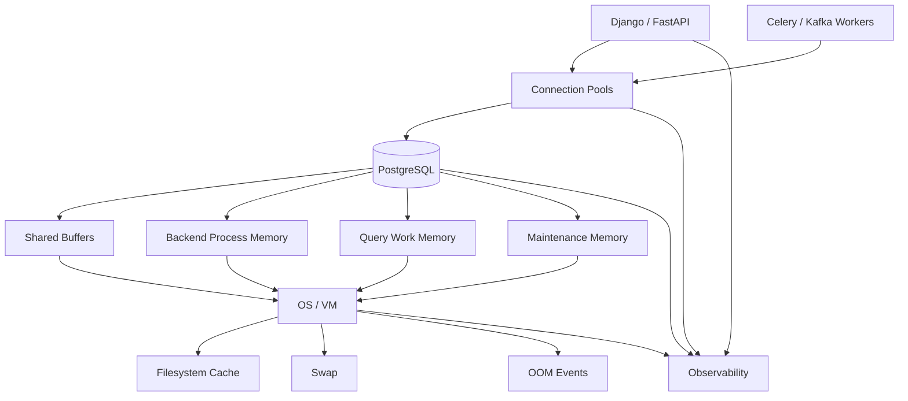
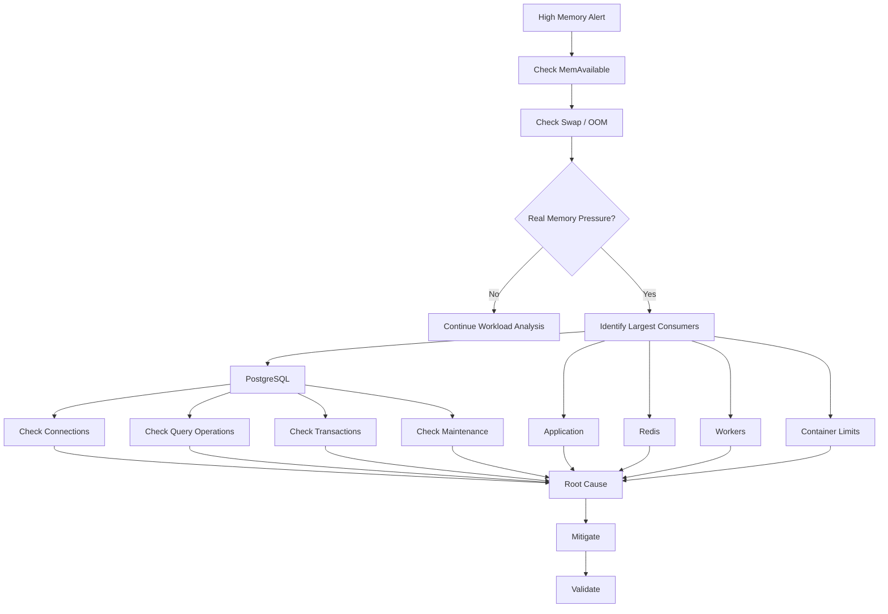

# 06- Database Memory Monitoring

## Overview

Database memory monitoring is the process of measuring how PostgreSQL and the surrounding system consume, allocate, reclaim, and compete for memory.

Memory problems are often harder to diagnose than CPU problems because PostgreSQL memory is distributed across several layers:

```text
PostgreSQL shared memory
+
PostgreSQL backend/process memory
+
OS filesystem cache
+
connection/session memory
+
query-operation memory
+
autovacuum/maintenance memory
+
application memory
+
container/VM limits
```

A database showing high memory utilization is not automatically unhealthy. The important questions are:

```text
Is memory pressure causing swap or OOM events?
Are queries spilling to disk?
Are connections consuming excessive memory?
Is the OS reclaiming useful cache?
Are long transactions causing bloat?
Is PostgreSQL constrained by a container limit?
```

The objective is to distinguish:

```text
healthy memory utilization
```

from:

```text
memory pressure
```

and then identify the workload or configuration responsible.

---

## Memory Monitoring Architecture



Memory monitoring should therefore operate at multiple levels:

| Layer | What to Monitor |
|---|---|
| PostgreSQL | `shared_buffers`, sessions, work memory, maintenance |
| Query | Sort/hash memory, temporary files, result size |
| OS | Available memory, swap, page cache, OOM |
| Container | Memory usage, limits, OOM kills |
| Application | Worker/process memory |
| Connection pool | Connections and concurrency |
| Infrastructure | Instance/container memory pressure |

---

## PostgreSQL Memory Model

PostgreSQL uses several distinct memory areas.

A simplified model is:

```text
PostgreSQL Instance
│
├── Shared Memory
│   └── shared_buffers
│
├── Backend Processes
│   ├── session state
│   ├── work_mem allocations
│   ├── sort/hash operations
│   └── other memory contexts
│
└── Maintenance Processes
    ├── autovacuum
    ├── VACUUM
    └── CREATE INDEX
```

This distinction matters because a configuration such as:

```text
work_mem = 256 MB
```

does not mean PostgreSQL reserves exactly 256 MB for the entire server.

`work_mem` applies to individual query operations, so concurrent operations can multiply memory usage.

---

## `shared_buffers`

`shared_buffers` is PostgreSQL's shared buffer cache.

Inspect it with:

```sql
SHOW shared_buffers;
```

It stores database pages that PostgreSQL processes can reuse.

A larger buffer cache can reduce physical reads, but increasing it indefinitely is not necessarily beneficial because PostgreSQL also relies heavily on the operating system's filesystem cache.

Monitor:

```text
shared_buffers
+
cache hit behavior
+
OS available memory
+
I/O
```

The correct value depends on workload, system memory, PostgreSQL version, and deployment environment.

---

## Operating System Page Cache

PostgreSQL does not operate in isolation from the OS.

The operating system caches filesystem data in memory.

A simplified path is:

```text
Query
  ↓
PostgreSQL
  ↓
shared_buffers
  ↓
OS filesystem cache
  ↓
Storage
```

Consequently, memory reported as "used" by Linux is not necessarily memory that PostgreSQL is actively consuming.

Inspect Linux memory with:

```bash
free -h
```

Pay attention to:

```text
MemAvailable
Swap
```

rather than treating the `used` column as a direct indicator of memory exhaustion.

---

## Swap

Swap allows the operating system to move memory pages to storage.

Some swap activity can occur without an immediate incident, but sustained database swapping is generally a serious warning sign because storage is much slower than RAM.

Symptoms may include:

```text
high latency
+
I/O increase
+
query stalls
+
CPU waiting
```

Check:

```bash
free -h
```

and:

```bash
vmstat 1
```

During an incident, determine whether memory pressure is actually causing swap activity rather than assuming high memory usage means swapping.

---

## Out-of-Memory Conditions

An OOM event occurs when the system or container cannot satisfy memory requirements.

Possible symptoms:

```text
PostgreSQL process terminated
+
container restarted
+
Kubernetes OOMKilled
+
database instability
```

At the infrastructure layer, inspect:

```text
system logs
+
container events
+
Kubernetes events
+
cloud monitoring
```

A PostgreSQL-level metric alone may not reveal an operating-system or container-level OOM event.

---

## Memory Pressure vs High Utilization

Consider:

```text
Memory usage = 90%
Swap = 0
OOM = 0
Latency = healthy
```

This may be completely acceptable.

Compare with:

```text
Memory usage = 90%
Swap ↑
OOM events ↑
Temporary I/O ↑
Latency ↑
```

This is a real memory-pressure problem.

A useful production model is:

```text
Memory Health
=
Available Memory
+
Swap Behavior
+
OOM Events
+
Latency
+
Workload Behavior
```

---

## `work_mem`

`work_mem` controls the amount of memory available to individual query operations such as:

```text
sorts
+
hash tables
+
some other executor operations
```

Inspect it:

```sql
SHOW work_mem;
```

The important point is:

```text
work_mem × concurrent operations
```

can be much larger than:

```text
work_mem
```

For example:

```text
work_mem = 64 MB

100 concurrent operations
```

does not imply a maximum of 64 MB.

Multiple operations can each consume memory.

---

## Why Increasing `work_mem` Can Be Dangerous

Suppose a workload executes:

```text
20 concurrent queries
```

and each query performs:

```text
2 memory-intensive operations
```

A theoretical upper-bound-style reasoning model might be:

```text
20 × 2 × 64 MB
=
2.5 GB
```

Actual memory usage depends on the execution plan and implementation, so this is not a precise allocation guarantee.

The important engineering lesson is:

> Per-operation memory must be evaluated against concurrency.

---

## Detecting Temporary Spills

When a query cannot complete an in-memory sort or hash operation within available working memory, PostgreSQL may use temporary files.

Inspect:

```sql
EXPLAIN (ANALYZE, BUFFERS)
SELECT ...
```

and look for temporary I/O.

Temporary files can indicate:

```text
large sorts
+
large hash operations
+
insufficient working memory
+
large intermediate results
```

Do not automatically increase `work_mem`.

First determine why the query processes so much data.

---

## Query Memory and Execution Plans

A query plan can reveal operations likely to consume substantial memory:

```text
Sort
+
Hash
+
HashAggregate
+
WindowAgg
```

Example:

```sql
EXPLAIN (ANALYZE, BUFFERS)
SELECT
    customer_id,
    COUNT(*)
FROM orders
GROUP BY customer_id;
```

Investigate:

```text
rows processed
+
sort/hash strategy
+
execution time
+
temporary I/O
```

A query processing millions of unnecessary rows is often better fixed at the query or index level than by increasing memory.

---

## Large Result Sets

Returning large result sets can consume memory at multiple layers:

```text
PostgreSQL
    ↓
network
    ↓
Python driver
    ↓
Django / FastAPI
    ↓
serialization
    ↓
HTTP response
```

For example:

```text
5 million rows
```

may create significant memory pressure in the application even if PostgreSQL itself remains healthy.

Prefer:

```text
pagination
+
streaming where appropriate
+
projection
+
aggregation
+
asynchronous exports
```

for large datasets.

---

## `SELECT *` and Memory

A query such as:

```sql
SELECT *
FROM orders
WHERE customer_id = $1;
```

may transfer columns that the application does not need.

Prefer explicit projections:

```sql
SELECT
    id,
    status,
    created_at
FROM orders
WHERE customer_id = $1;
```

This can reduce:

```text
database tuple processing
+
network traffic
+
driver memory
+
application memory
+
serialization cost
```

---

## Large Pagination and Memory

Large offsets can create unnecessary work:

```sql
SELECT ...
FROM orders
ORDER BY created_at DESC
LIMIT 100
OFFSET 500000;
```

Keyset pagination is often more predictable for large datasets:

```sql
SELECT
    id,
    created_at
FROM orders
WHERE (created_at, id) < ($1, $2)
ORDER BY created_at DESC, id DESC
LIMIT 100;
```

The appropriate index should support the access pattern.

---

## Connection Memory

Every PostgreSQL connection has process/session overhead.

Additional memory can be consumed by:

```text
query execution
+
sort/hash operations
+
session state
+
temporary objects
```

Therefore:

```text
max_connections ↑
```

can increase memory risk even when queries themselves are reasonable.

This is one reason connection pooling is important.

---

## Connection Pooling and Memory

Consider:

```text
30 Kubernetes pods
×
10 database connections
=
300 potential connections
```

If each pod is scaled to:

```text
20 connections
```

the potential concurrency becomes:

```text
600 connections
```

This can increase:

```text
PostgreSQL backend memory
+
query concurrency
+
CPU contention
+
lock contention
```

Pool sizing must therefore be based on the database's total capacity, not merely per-application needs.

---

## Django Connection Behavior

Django's:

```python
CONN_MAX_AGE
```

controls persistent connection reuse.

It is not equivalent to a configurable maximum-size connection pool.

For production systems, consider the complete topology:

```text
Django processes
+
Kubernetes replicas
+
database connections
+
PgBouncer if used
+
PostgreSQL capacity
```

Memory analysis should include the aggregate number of active sessions.

---

## FastAPI and SQLAlchemy

SQLAlchemy connection pools also affect database concurrency.

Example:

```python
from sqlalchemy import create_engine

engine = create_engine(
    "postgresql+psycopg://user:password@db:5432/app",
    pool_size=10,
    max_overflow=5,
    pool_timeout=10,
    pool_recycle=1800,
    pool_pre_ping=True,
)
```

The important memory relationship is:

```text
application instances
×
pool capacity
×
query concurrency
```

not simply:

```text
pool_size
```

---

## PgBouncer and Memory

PgBouncer can reduce the number of PostgreSQL server connections by multiplexing application connections.

This can reduce:

```text
PostgreSQL backend process overhead
+
connection-related memory
```

However, pooling mode has behavioral implications.

For example, transaction pooling changes the lifetime of server-side session state.

Features such as:

```text
temporary tables
+
session settings
+
session-level prepared statements
+
advisory locks
```

require careful compatibility analysis depending on the pooling mode and application behavior.

---

## Long Transactions

Long-running transactions can cause memory-related operational problems indirectly through MVCC.

Example:

```text
Transaction A
    ↓
starts
    ↓
remains open for hours

Other transactions
    ↓
UPDATE / DELETE rows
    ↓
dead tuples accumulate
```

The resulting bloat can increase:

```text
storage
+
I/O
+
cache pressure
+
query work
```

Inspect transaction age:

```sql
SELECT
    pid,
    usename,
    state,
    xact_start,
    now() - xact_start AS transaction_age,
    query
FROM pg_stat_activity
WHERE xact_start IS NOT NULL
ORDER BY xact_start;
```

---

## Idle in Transaction

An especially dangerous state is:

```text
idle in transaction
```

The application has started a transaction but is not actively executing SQL.

This can retain resources and prevent cleanup progress.

Inspect:

```sql
SELECT
    pid,
    usename,
    state,
    xact_start,
    state_change,
    query
FROM pg_stat_activity
WHERE state = 'idle in transaction'
ORDER BY xact_start;
```

Prevent this through:

```text
short transaction scopes
+
application timeouts
+
careful external-call placement
```

---

## MVCC, Bloat, and Memory Pressure

PostgreSQL's MVCC design means updates and deletes can create dead tuples.

If cleanup cannot keep up:

```text
dead tuples ↑
    ↓
table/index size ↑
    ↓
pages accessed ↑
    ↓
cache pressure ↑
    ↓
I/O and query work ↑
```

Memory pressure may therefore be a downstream symptom of transaction and maintenance behavior.

---

## Autovacuum Memory

Autovacuum performs maintenance in the background and consumes resources.

Inspect:

```sql
SELECT
    schemaname,
    relname,
    n_live_tup,
    n_dead_tup,
    last_autovacuum,
    last_autoanalyze
FROM pg_stat_user_tables
ORDER BY n_dead_tup DESC
LIMIT 20;
```

Maintenance memory can also be affected by PostgreSQL configuration such as:

```text
maintenance_work_mem
+
autovacuum_work_mem
```

These settings must be considered alongside the number of concurrent maintenance operations.

---

## `maintenance_work_mem`

`maintenance_work_mem` is used by maintenance operations such as:

```text
VACUUM
+
CREATE INDEX
+
ALTER TABLE operations that require maintenance work
```

Inspect:

```sql
SHOW maintenance_work_mem;
```

Large values can accelerate some operations but increase memory requirements.

Do not assume:

```text
larger = always better
```

because production systems execute maintenance concurrently with application workloads.

---

## Memory and Index Creation

Index creation can consume substantial resources.

Before running large index operations, evaluate:

```text
table size
+
available memory
+
CPU
+
I/O
+
replication
+
concurrent workload
```

For production systems, `CREATE INDEX CONCURRENTLY` can reduce blocking of ordinary writes but has different operational characteristics and still consumes resources.

---

## Cache Hit Behavior

PostgreSQL cache efficiency matters when diagnosing memory.

A low cache hit ratio can indicate insufficient effective caching, but cache hit ratio should not be treated as an isolated health metric.

Investigate together with:

```text
working-set size
+
query access pattern
+
I/O latency
+
database workload
```

A high hit ratio does not prove that a database is healthy.

---

## Memory Contexts

PostgreSQL uses memory contexts to organize memory allocations.

For advanced troubleshooting, memory context inspection can help determine where PostgreSQL is allocating memory.

This is especially useful when:

```text
memory growth is unexplained
+
normal workload metrics look healthy
+
a specific backend appears to retain memory
```

Memory-context inspection is more advanced than normal operational monitoring and should be used carefully because diagnostic interfaces and available views can vary across PostgreSQL versions.

---

## Monitoring `pg_stat_activity`

A useful operational query is:

```sql
SELECT
    pid,
    usename,
    application_name,
    client_addr,
    state,
    wait_event_type,
    wait_event,
    xact_start,
    query_start,
    now() - query_start AS query_duration,
    query
FROM pg_stat_activity
WHERE state <> 'idle'
ORDER BY query_start;
```

Use it to correlate:

```text
active sessions
+
transaction age
+
query duration
+
wait state
```

This helps distinguish memory pressure from lock or connection-related problems.

---

## Memory Monitoring from Linux

Useful commands include:

```bash
free -h
```

```bash
vmstat 1
```

```bash
ps aux --sort=-%mem | head -20
```

These provide different perspectives:

| Command | Useful For |
|---|---|
| `free -h` | Overall memory and swap |
| `vmstat 1` | Memory, swap, I/O, CPU behavior |
| `ps` | Process-level memory |
| Container metrics | Container limits and usage |
| Kubernetes metrics | Pod/resource behavior |

Interpret OS metrics in the context of the database deployment model.

---

## Kubernetes Memory Monitoring

For PostgreSQL running in Kubernetes, distinguish:

```text
node memory
+
pod memory
+
container memory limit
+
PostgreSQL memory
```

A pod can be OOM-killed even when the Kubernetes node has available memory if the container exceeds its configured limit.

Monitor:

```text
container memory usage
+
memory working set
+
OOMKilled events
+
pod restarts
+
resource limits
```

Avoid setting limits without accounting for realistic PostgreSQL memory behavior.

---

## Docker Memory Limits

Docker can similarly constrain PostgreSQL:

```text
Host memory
    ↓
Container memory limit
    ↓
PostgreSQL
```

A configuration that works on a large developer machine can fail under a production container limit.

Always test with production-like resource constraints.

---

## Redis and Application Memory

Database memory incidents can be confused with application infrastructure memory problems.

A backend service may have:

```text
PostgreSQL
+
Redis
+
Python workers
+
Kafka clients
```

on the same host or resource domain.

Monitor them separately.

For example:

```text
Redis memory ↑
→
host available memory ↓
→
PostgreSQL cache effectiveness ↓
```

The PostgreSQL workload may remain unchanged while system memory pressure increases.

---

## Celery and Worker Memory

Celery workers can consume substantial memory through:

```text
large query results
+
large task payloads
+
serialization
+
application objects
```

A worker processing:

```text
1 million database rows
```

may become a larger memory problem at the application layer than at PostgreSQL.

Use:

```text
chunking
+
streaming where appropriate
+
bounded task sizes
+
controlled concurrency
```

for large workloads.

---

## Kafka and Memory

Kafka consumers can increase memory through:

```text
consumer buffers
+
batch size
+
deserialized messages
+
database write batches
```

When database and Kafka workloads share infrastructure, correlate:

```text
consumer lag
+
batch size
+
worker memory
+
database memory
```

Do not diagnose database memory in isolation.

---

## Query Memory Troubleshooting Workflow



---

## Memory Troubleshooting Checklist

### Confirm Pressure

- [ ] Check available memory.
- [ ] Check swap activity.
- [ ] Check OOM events.
- [ ] Check database latency.
- [ ] Check temporary I/O.

### PostgreSQL

- [ ] Inspect `shared_buffers`.
- [ ] Inspect `work_mem`.
- [ ] Inspect `maintenance_work_mem`.
- [ ] Inspect active connections.
- [ ] Inspect active transactions.
- [ ] Inspect long-running transactions.
- [ ] Inspect autovacuum activity.

### Query Workload

- [ ] Identify large sorts.
- [ ] Identify large hash operations.
- [ ] Inspect execution plans.
- [ ] Check temporary file usage.
- [ ] Check result-set size.
- [ ] Check `SELECT *` usage.
- [ ] Check pagination strategy.

### Application

- [ ] Inspect connection pool size.
- [ ] Inspect worker concurrency.
- [ ] Check Celery memory.
- [ ] Check Kafka consumer memory.
- [ ] Check Redis memory.
- [ ] Check Python process memory.

### Infrastructure

- [ ] Check Kubernetes memory limits.
- [ ] Check Docker limits.
- [ ] Check node memory.
- [ ] Check instance memory.
- [ ] Check OOM events and restarts.

---

## Diagnosing High Memory Step by Step

### Establish Whether Memory Is Actually the Bottleneck

Check:

```text
MemAvailable
+
swap
+
OOM
+
latency
+
I/O
```

Do not start by changing PostgreSQL parameters.

### Identify the Largest Consumer

Determine whether memory is primarily used by:

```text
PostgreSQL
+
application
+
Redis
+
workers
+
OS cache
```

### Inspect Connection Count

High connection counts can increase PostgreSQL memory consumption.

### Inspect Query Operations

Look for:

```text
sorts
+
hashes
+
large aggregations
+
large intermediate results
```

### Inspect Transaction Age

Long transactions can cause downstream bloat and cleanup problems.

### Inspect Maintenance

Check:

```text
autovacuum
+
VACUUM
+
index creation
```

### Validate the Fix

After mitigation, verify:

```text
memory pressure ↓
+
swap stable
+
latency recovered
+
query throughput healthy
+
no OOM events
```

---

## Common Memory Pressure Scenarios

### Scenario: `work_mem` Too High

```text
Large work_mem
+
high concurrency
=
memory pressure
```

Mitigation:

```text
reduce global work_mem
+
optimize expensive queries
+
use targeted session/query settings only when justified
```

### Scenario: Connection Explosion

```text
Kubernetes replicas ↑
+
pool size ↑
=
connections ↑
```

Mitigation:

```text
right-size pools
+
use pooling infrastructure
+
control application concurrency
```

### Scenario: Large Export

```text
SELECT millions of rows
→
Python loads everything
→
worker memory spikes
```

Mitigation:

```text
chunking
+
streaming
+
asynchronous export
+
object storage
```

### Scenario: Long Transaction

```text
transaction remains open
→
cleanup delayed
→
dead tuples ↑
→
bloat ↑
→
I/O/cache pressure ↑
```

Mitigation:

```text
short transactions
+
transaction timeout
+
application lifecycle fixes
```

---

## Emergency Mitigation

During severe memory pressure, prioritize preserving database availability.

Potential actions include:

```text
reduce worker concurrency
+
stop non-critical batch workloads
+
control connection growth
+
cancel runaway queries
+
reduce retry storms
+
temporarily move analytical workloads
```

Avoid making multiple large PostgreSQL configuration changes simultaneously during an incident.

Change one variable where possible and observe the effect.

---

## Memory and Query Cancellation

Identify suspicious queries first:

```sql
SELECT
    pid,
    usename,
    application_name,
    state,
    query_start,
    now() - query_start AS duration,
    query
FROM pg_stat_activity
WHERE state <> 'idle'
ORDER BY query_start;
```

Then, when operationally justified:

```sql
SELECT pg_cancel_backend(<pid>);
```

Do not assume the longest-running query is consuming the most memory.

Investigate the workload and execution plan before taking action.

---

## Memory and Timeouts

Timeouts can limit runaway workloads.

Useful settings include:

```text
statement_timeout
+
idle_in_transaction_session_timeout
```

`statement_timeout` limits statement execution time.

`idle_in_transaction_session_timeout` protects against sessions remaining idle inside transactions.

`lock_timeout` is different: it limits time spent waiting to acquire locks, not memory consumption.

Timeouts protect capacity but do not fix inefficient SQL.

---

## Memory and High Availability

Memory capacity should include failure scenarios.

Example:

```text
Primary
    ↓
Replica fails
    ↓
read traffic moves to primary
    ↓
connection count ↑
    ↓
query concurrency ↑
    ↓
memory pressure ↑
```

A database that is healthy only under steady-state traffic may become unstable during failover.

Capacity planning should include:

```text
normal workload
+
traffic spikes
+
worker spikes
+
failover
+
maintenance
```

---

## Memory and Disaster Recovery

Recovery operations can have significant resource requirements.

Examples include:

```text
restore
+
reindexing
+
large VACUUM
+
data backfills
```

Do not perform resource-intensive recovery or maintenance operations without considering:

```text
available memory
+
CPU
+
I/O
+
replication
+
application workload
```

Where possible, validate recovery procedures in environments with realistic resource constraints.

---

## Memory and Security

Memory monitoring can expose operational information such as:

```text
SQL statements
+
database users
+
application names
+
client addresses
```

Protect diagnostic access through:

```text
least privilege
+
restricted monitoring roles
+
secure dashboards
+
audit logging
```

Avoid logging or exposing sensitive query parameters merely to improve memory troubleshooting.

---

## Cost Considerations

Memory pressure can lead to infrastructure scaling:

```text
larger database instance
+
more replicas
+
larger Kubernetes nodes
+
higher observability costs
```

Before scaling memory, identify whether the problem is:

```text
legitimate workload growth
```

or:

```text
avoidable memory consumption
```

Examples of avoidable consumption include:

```text
excessive connections
+
large result sets
+
N+1 queries
+
oversized worker concurrency
+
unbounded batch processing
+
excessive work_mem
```

---

## Production Best Practices

- Monitor available memory rather than relying only on memory-used percentages.
- Monitor swap and OOM events explicitly.
- Treat `work_mem` as per-operation memory, not server-wide memory.
- Control total connection concurrency across all application instances.
- Keep transactions short and avoid `idle in transaction`.
- Monitor temporary file usage for memory-intensive query operations.
- Investigate large sorts, hashes, aggregations, and result sets.
- Avoid loading millions of database rows into Python memory.
- Monitor PostgreSQL, Redis, workers, and containers independently.
- Include failover and deployment scenarios in memory capacity planning.
- Do not disable autovacuum to reduce temporary resource usage.
- Avoid blindly increasing `work_mem` or `shared_buffers`.
- Use query optimization before infrastructure scaling when the workload is avoidable.
- Apply bounded timeouts to protect against pathological workloads.
- Validate memory changes under realistic concurrency.

---

## Common Mistakes

### Treating Linux "Used Memory" as Exhaustion

Filesystem cache can make used memory appear high while the system remains healthy.

### Increasing `work_mem` Globally

Per-operation memory can multiply across concurrent sessions.

### Increasing `shared_buffers` Indefinitely

PostgreSQL also relies on the OS page cache.

### Increasing `max_connections`

More connections can increase memory consumption and contention.

### Ignoring Application Memory

The database may be healthy while Django, FastAPI, or Celery consumes the available memory.

### Loading Large QuerySets Into Python

Large result sets can cause application OOM events.

### Ignoring Long Transactions

MVCC cleanup delays can produce bloat and indirect memory pressure.

### Disabling Autovacuum

This can increase bloat and worsen query and storage behavior.

### Ignoring Container Limits

A Kubernetes pod can be OOM-killed even when the node has available memory.

### Assuming Temporary I/O Means Only More Memory Is Needed

The query may simply be processing too much data.

### Scaling Workers Without Database Capacity Analysis

More workers can increase both connection and query memory consumption.

### Diagnosing Only PostgreSQL

Redis, Kafka, Celery, and application processes may be competing for the same memory resources.

---

## Interview Perspective

A strong senior-level answer to:

> How would you troubleshoot high memory usage in PostgreSQL?

should follow a structured approach:

```text
1. Determine whether memory is actually under pressure.
2. Check available memory, swap, and OOM events.
3. Identify whether PostgreSQL or another process consumes memory.
4. Check connection count and pool sizing.
5. Inspect work_mem and concurrent memory-intensive operations.
6. Inspect temporary I/O and execution plans.
7. Check large result sets and application memory.
8. Investigate long-running transactions and bloat.
9. Check autovacuum and maintenance activity.
10. Consider container and infrastructure limits.
11. Apply the safest mitigation.
12. Validate recovery and prevent recurrence.
```

A weak answer is:

```text
"Increase RAM."
```

A stronger answer recognizes:

```text
memory usage
≠
memory pressure
```

and:

```text
memory pressure
≠
PostgreSQL configuration problem
```

---

## Senior-Level Memory Mental Model

Think of memory as a shared capacity budget.

```text
Physical / Container Memory
        │
        ├── OS Kernel
        ├── Filesystem Cache
        ├── PostgreSQL Shared Memory
        ├── PostgreSQL Backend Processes
        │      ├── Session State
        │      ├── Sorts
        │      └── Hashes
        ├── Autovacuum / Maintenance
        ├── Application Processes
        ├── Redis
        └── Workers
```

Then reason about concurrency:

```text
Memory per operation
        ×
Concurrent operations
        +
Connection overhead
        +
Shared memory
        +
Other processes
        ≤
Available memory
```

The senior-level question is not:

```text
"How much RAM does PostgreSQL use?"
```

It is:

```text
"Which workload consumes memory,
at what concurrency,
under which resource limits,
and does that consumption threaten latency or availability?"
```

That model leads to safer decisions about query optimization, connection pooling, worker concurrency, PostgreSQL configuration, and infrastructure scaling.

---

## Key Takeaways

- **High memory utilization is not automatically a problem:** evaluate `MemAvailable`, swap, OOM events, latency, I/O, and workload behavior to determine whether real memory pressure exists.
- **Per-operation memory multiplies with concurrency:** `work_mem`, connection count, query operations, maintenance, and worker concurrency must be evaluated as an aggregate memory budget.
- **Query and transaction design can cause indirect memory pressure:** large result sets, expensive sorts/hashes, long transactions, bloat, and excessive connections can matter more than simply increasing RAM.
- **Diagnose the complete resource hierarchy:** PostgreSQL, OS cache, application processes, Redis, Celery, Kafka, Docker, and Kubernetes limits can all participate in a memory incident.
- **Scale only after understanding the workload:** optimize unnecessary memory consumption first, then size infrastructure with production concurrency, traffic spikes, maintenance, and failover scenarios in mind.