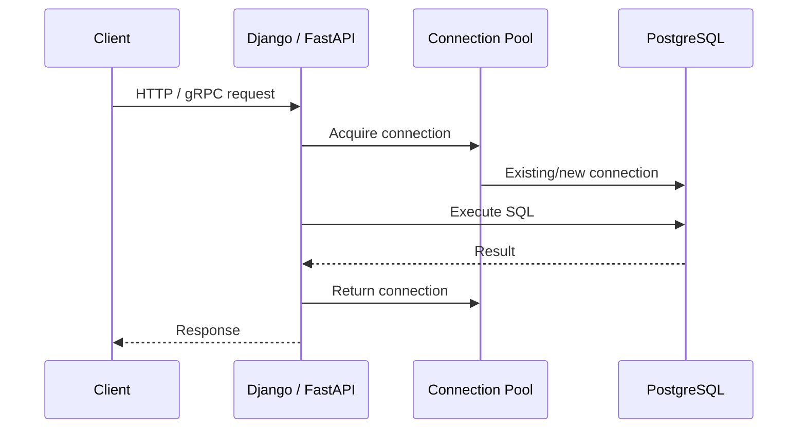
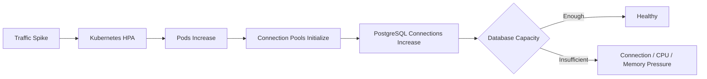
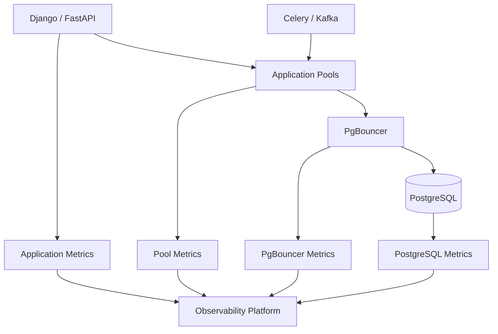
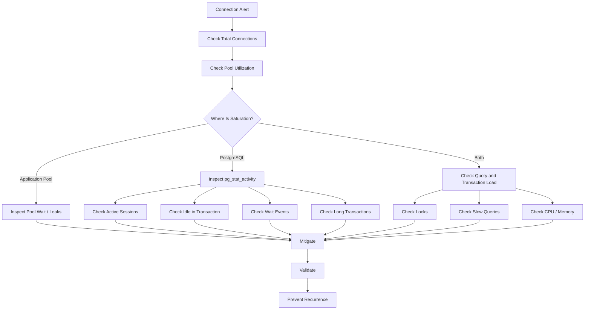

# 07- Connection Monitoring

## Overview

Connection monitoring is the practice of measuring, diagnosing, and controlling database connections across the application, connection pool, pooling infrastructure, and PostgreSQL server.

For production backend systems, connections are a finite resource:

```text
Django / FastAPI
        ↓
Application Connection Pool
        ↓
PgBouncer (optional)
        ↓
PostgreSQL
        ↓
Backend Processes
```

A connection problem can appear as:

```text
connection timeout
+
pool exhaustion
+
high database memory
+
too many clients
+
slow requests
+
lock contention
+
database unavailability
```

Connection monitoring is therefore not simply counting active PostgreSQL sessions. It requires understanding:

- Who created the connections?
- How many connections can the application create?
- How many connections can PostgreSQL accept?
- Are connections active, idle, or stuck?
- Are transactions being held open?
- Are connections waiting for locks?
- Are pools exhausted before PostgreSQL is exhausted?
- What happens during Kubernetes scaling or failover?

---

## Connection Lifecycle

A typical request follows this path:



The important distinction is:

```text
application request
≠
database connection
```

A request may reuse an existing connection, while a connection may remain open while serving multiple requests.

This is why persistent connections and pooling can improve latency while simultaneously creating connection-capacity risks if configured incorrectly.

---

## PostgreSQL Connection Model

PostgreSQL uses a process-based server architecture.

A client connection normally corresponds to a PostgreSQL backend process.

A simplified model is:

```text
PostgreSQL
│
├── Connection 1 → Backend Process
├── Connection 2 → Backend Process
├── Connection 3 → Backend Process
├── ...
└── Connection N → Backend Process
```

Each connection therefore has resource implications:

```text
process memory
+
session state
+
query execution memory
+
CPU scheduling
+
transaction state
```

This is one reason PostgreSQL should not be treated as if connections were free lightweight objects.

---

## Connection Limits

PostgreSQL controls connection capacity through:

```sql
SHOW max_connections;
```

Inspect the current connection count:

```sql
SELECT count(*)
FROM pg_stat_activity;
```

A simple comparison is:

```text
current connections
vs
max_connections
```

However, production capacity planning must also account for reserved administrative capacity and the fact that not every connection consumes the same workload resources.

Do not simply set `max_connections` to a very large number to avoid connection errors.

---

## `pg_stat_activity`

`pg_stat_activity` is the primary PostgreSQL view for connection and session monitoring.

A useful diagnostic query is:

```sql
SELECT
    pid,
    usename,
    application_name,
    client_addr,
    state,
    wait_event_type,
    wait_event,
    backend_start,
    xact_start,
    query_start,
    state_change,
    now() - query_start AS query_duration,
    now() - xact_start AS transaction_age,
    query
FROM pg_stat_activity
ORDER BY backend_start;
```

It provides visibility into:

| Field | Meaning |
|---|---|
| `pid` | PostgreSQL backend process ID |
| `usename` | Database role |
| `application_name` | Client/application identifier |
| `client_addr` | Client address |
| `state` | Session state |
| `wait_event_type` | Broad wait category |
| `wait_event` | Specific wait |
| `backend_start` | Connection creation time |
| `xact_start` | Transaction start |
| `query_start` | Current query start |
| `state_change` | Last state transition |
| `query` | Current or most recent query |

---

## Connection States

The most important states include:

| State | Interpretation |
|---|---|
| `active` | Currently executing a query |
| `idle` | Connected but not executing |
| `idle in transaction` | Transaction is open but session is not executing |
| `idle in transaction (aborted)` | Transaction failed and remains open until rollback |
| `disabled` | Monitoring/session behavior may indicate restricted activity |

`idle` is not automatically a problem.

A persistent pooled connection can legitimately remain idle between requests.

`idle in transaction` is much more concerning because the transaction remains open.

---

## Active Connections

Find currently active sessions:

```sql
SELECT
    pid,
    usename,
    application_name,
    client_addr,
    query_start,
    now() - query_start AS duration,
    wait_event_type,
    wait_event,
    query
FROM pg_stat_activity
WHERE state = 'active'
ORDER BY query_start;
```

Use this to answer:

```text
What is executing?
How long has it been executing?
Is it waiting?
Which application created it?
```

Do not assume every active connection is expensive.

A short query executing normally is very different from hundreds of CPU-intensive queries running concurrently.

---

## Idle Connections

Find idle sessions:

```sql
SELECT
    usename,
    application_name,
    client_addr,
    count(*) AS connections
FROM pg_stat_activity
WHERE state = 'idle'
GROUP BY
    usename,
    application_name,
    client_addr
ORDER BY connections DESC;
```

A large number of idle connections may indicate:

```text
large application pools
+
too many application instances
+
persistent connections
+
poor pool sizing
```

But idle connections can also be expected when using connection pooling.

The correct question is:

> Is the idle connection count consistent with the intended architecture and resource budget?

---

## Idle in Transaction

This state deserves special attention:

```sql
SELECT
    pid,
    usename,
    application_name,
    client_addr,
    xact_start,
    now() - xact_start AS transaction_age,
    state_change,
    query
FROM pg_stat_activity
WHERE state = 'idle in transaction'
ORDER BY xact_start;
```

Typical causes include:

```text
BEGIN
→
database query
→
application performs external work
→
transaction remains open
```

For example:

```text
BEGIN
UPDATE order
CALL external API
wait 5 seconds
COMMIT
```

The database transaction is unnecessarily held while the application waits for another service.

Prefer:

```text
short DB transaction
+
external operation outside transaction
+
explicit consistency mechanism when required
```

For workflows requiring durable coordination, use patterns such as a transactional outbox rather than holding database transactions across network calls.

---

## Connection Age

Long-lived connections are not inherently bad.

Persistent connections can reduce:

```text
TCP setup
+
TLS handshake
+
authentication
+
startup overhead
```

But very old connections can become problematic when:

```text
network infrastructure changes
+
database failover occurs
+
credentials rotate
+
session state becomes stale
+
connection enters an unexpected state
```

Monitor connection age:

```sql
SELECT
    pid,
    usename,
    application_name,
    backend_start,
    now() - backend_start AS connection_age,
    state
FROM pg_stat_activity
ORDER BY backend_start;
```

---

## Connection Count by Application

A production database should identify clients through `application_name`.

Example:

```sql
SELECT
    application_name,
    usename,
    state,
    count(*) AS connections
FROM pg_stat_activity
GROUP BY
    application_name,
    usename,
    state
ORDER BY
    application_name,
    connections DESC;
```

This makes it possible to identify:

```text
Django API
FastAPI service
Celery workers
migration jobs
reporting service
admin tools
```

rather than seeing only anonymous database connections.

---

## Setting `application_name`

For PostgreSQL clients, configure a meaningful application name.

Example connection string:

```text
postgresql://user:password@db:5432/app?application_name=orders-api
```

For multiple services, use distinct names:

```text
orders-api
payments-api
celery-orders
reporting-worker
migration-job
```

This greatly improves incident diagnosis.

---

## Connection Monitoring by Role

Connections can also be grouped by database role:

```sql
SELECT
    usename,
    state,
    count(*) AS connections
FROM pg_stat_activity
GROUP BY usename, state
ORDER BY usename, state;
```

This can reveal problems such as:

```text
application role → 400 connections
migration role → 50 connections
reporting role → 100 connections
```

The role-level view is particularly useful in multi-service environments.

---

## Connection Pool Architecture

Application pools commonly look like:

```text
Kubernetes
│
├── Pod 1
│   └── Pool → 10 connections
│
├── Pod 2
│   └── Pool → 10 connections
│
├── Pod 3
│   └── Pool → 10 connections
│
└── Pod N
    └── Pool → 10 connections
```

The database sees the aggregate:

```text
Pods × pool capacity
```

For example:

```text
30 pods × 10 connections
=
300 potential PostgreSQL connections
```

This is one of the most common production connection-sizing mistakes.

---

## Pool Capacity vs Database Capacity

Suppose:

```text
PostgreSQL max_connections = 300
```

and:

```text
40 pods × 10 connections
=
400 possible connections
```

The architecture can exhaust PostgreSQL even though every individual application instance appears correctly configured.

Connection capacity must therefore be calculated across the entire deployment.

---

## Connection Pool Exhaustion

Pool exhaustion occurs when application requests need connections but all pool slots are occupied.

The flow becomes:

```text
Request
  ↓
Acquire connection
  ↓
Pool full
  ↓
Wait
  ↓
Pool timeout
  ↓
Application error
```

The database itself may still have available connections.

This distinction is critical:

```text
pool exhaustion
≠
PostgreSQL connection exhaustion
```

---

## PostgreSQL Exhaustion vs Pool Exhaustion

| Condition | Primary Symptom | First Investigation |
|---|---|---|
| Application pool exhausted | Requests wait for pool | Pool metrics |
| PostgreSQL max connections reached | Connection errors | `pg_stat_activity` |
| Slow queries | Connections remain busy | Query monitoring |
| Lock contention | Connections wait | `pg_locks`, wait events |
| Long transactions | Connections remain occupied | `xact_start` |
| Connection leak | Pool capacity gradually disappears | Pool lifecycle |
| Network failure | Connection failures/timeouts | Network/client logs |

A senior engineer distinguishes these conditions before changing capacity.

---

## Connection Leaks

A connection leak occurs when application code acquires a connection but does not reliably return it.

For example, incorrect resource handling can cause:

```text
request
→
acquire connection
→
exception
→
cleanup skipped
→
connection retained
```

In Python systems, use context-managed or framework-managed database access rather than manually managing connections unless there is a strong reason to do so.

For SQLAlchemy:

```python
with engine.connect() as connection:
    result = connection.execute(query)
```

The context manager ensures the connection is returned to the pool.

---

## Django Connection Monitoring

Django manages database connections through its database layer.

Persistent connection behavior is influenced by:

```python
DATABASES = {
    "default": {
        "ENGINE": "django.db.backends.postgresql",
        "NAME": "app",
        "USER": "app_runtime",
        "PASSWORD": "...",
        "HOST": "db",
        "PORT": "5432",
        "CONN_MAX_AGE": 60,
    }
}
```

`CONN_MAX_AGE` controls how long Django may reuse a persistent connection.

It does not represent a maximum pool size.

When diagnosing Django connection problems, inspect both:

```text
Django worker/process count
+
database connection behavior
```

and PostgreSQL:

```text
pg_stat_activity
```

---

## FastAPI and SQLAlchemy Monitoring

For FastAPI services using SQLAlchemy, monitor:

```text
pool size
+
overflow
+
checked-out connections
+
pool wait time
+
connection creation
+
connection failures
```

Example:

```python
from sqlalchemy import create_engine

engine = create_engine(
    "postgresql+psycopg://user:password@db:5432/app",
    pool_size=10,
    max_overflow=5,
    pool_timeout=10,
    pool_recycle=1800,
    pool_pre_ping=True,
)
```

The important production metric is not just:

```text
pool_size
```

but:

```text
pool utilization
+
wait time
+
request concurrency
+
database capacity
```

---

## PgBouncer

PgBouncer can sit between applications and PostgreSQL:

```text
Django / FastAPI / Workers
          ↓
      PgBouncer
          ↓
      PostgreSQL
```

It can reduce the number of actual PostgreSQL backend connections by multiplexing application connections.

Monitor both sides:

```text
application connections
+
PgBouncer client connections
+
PgBouncer server connections
+
PostgreSQL connections
```

A healthy PgBouncer deployment can still hide an overloaded PostgreSQL server if server-side capacity is not monitored.

---

## PgBouncer Pooling Modes

| Mode | Connection Lifetime | Main Consideration |
|---|---|---|
| Session | Client session | Strong session semantics, less multiplexing |
| Transaction | Transaction | Better multiplexing, session state limitations |
| Statement | Individual statement | Maximum multiplexing, strongest limitations |

Transaction and statement pooling require careful review of session-dependent application behavior.

Do not introduce PgBouncer solely because PostgreSQL has many connections without understanding the application's use of:

```text
session variables
+
temporary tables
+
prepared statements
+
advisory locks
+
session-level state
```

---

## Connection Wait Time

Connection acquisition latency is an important metric.

A request may be slow even when its SQL executes quickly:

```text
Request
  ↓
Wait 800 ms for connection
  ↓
SQL executes in 20 ms
  ↓
Response
```

The database query itself is not the primary problem.

Measure:

```text
connection acquisition time
+
query execution time
+
transaction time
+
request latency
```

This distinction is essential for diagnosing tail latency.

---

## Connection Pool Backpressure

Pools provide a useful form of concurrency control.

Instead of allowing unlimited database requests:

```text
1000 application requests
        ↓
10 database connections
        ↓
bounded database concurrency
```

The pool can protect PostgreSQL from uncontrolled concurrency.

However, excessive pool waiting can increase application latency.

The goal is:

```text
bounded concurrency
+
reasonable queueing
+
database capacity protection
```

not:

```text
maximum possible connections
```

---

## Connection Pool Sizing

A production sizing process should consider:

```text
database CPU capacity
+
query latency
+
lock contention
+
memory
+
application concurrency
+
number of instances
+
background workers
+
failover behavior
```

For example:

```text
20 pods
×
8 connections
=
160 connections
```

If Celery workers can add another:

```text
40 connections
```

the database may see:

```text
200 connections
```

before administrative or reporting workloads are considered.

---

## Connection Monitoring During Kubernetes Scaling

Horizontal scaling can create connection storms.

Example:



A traffic spike can therefore create two separate scaling effects:

```text
request concurrency ↑
+
database connection count ↑
```

Use controlled pool sizes and database-aware autoscaling.

---

## Connection Storms

A connection storm can occur during:

```text
deployment
+
Kubernetes restart
+
database failover
+
network recovery
+
large-scale autoscaling
```

If hundreds of processes simultaneously reconnect:

```text
connections ↑↑↑
CPU ↑
authentication work ↑
memory ↑
latency ↑
```

Mitigation includes:

```text
connection pooling
+
bounded pools
+
connection backoff
+
jitter
+
stable database endpoints
+
controlled rollout
```

---

## Failover and Connections

During PostgreSQL failover:

```text
Old primary
    ↓
unavailable
    ↓
new primary selected
    ↓
application connections become invalid
    ↓
clients reconnect
```

Applications must tolerate stale connections.

Connection recovery should include:

```text
bounded retries
+
exponential backoff
+
jitter
+
connection validation
+
stable endpoint
```

Avoid immediate infinite reconnect loops.

---

## `pool_pre_ping`

Connection pools may contain connections that appear available to the application but are no longer usable.

A pool health check can detect stale connections before handing them to the application.

For SQLAlchemy:

```python
engine = create_engine(
    DATABASE_URL,
    pool_pre_ping=True,
)
```

This improves resilience against certain stale-connection scenarios, but it is not a replacement for correct failover handling and retry design.

---

## Connection Recycling

Long-lived connections may need periodic recycling depending on:

```text
load balancers
+
network infrastructure
+
database failover behavior
+
cloud infrastructure
```

SQLAlchemy supports:

```python
pool_recycle=1800
```

Recycling should be based on actual infrastructure behavior rather than arbitrary values.

Too-aggressive recycling can create unnecessary connection churn.

---

## Connection Timeouts

Different timeout layers solve different problems.

| Timeout | Protects Against |
|---|---|
| Pool acquisition timeout | Waiting too long for a pool slot |
| Connection timeout | Establishing database connection |
| `statement_timeout` | Long-running SQL |
| `lock_timeout` | Waiting too long for a lock |
| `idle_in_transaction_session_timeout` | Abandoned open transactions |
| HTTP request timeout | End-to-end API latency |

These should be designed together.

A database connection timeout does not solve query execution problems.

---

## Locking and Connections

Connections can remain occupied because their queries are waiting for locks.

Inspect wait events:

```sql
SELECT
    pid,
    usename,
    application_name,
    state,
    wait_event_type,
    wait_event,
    query_start,
    now() - query_start AS duration,
    query
FROM pg_stat_activity
WHERE wait_event IS NOT NULL
ORDER BY query_start;
```

For blocking analysis:

```sql
SELECT
    blocked.pid AS blocked_pid,
    blocked.query AS blocked_query,
    blocker.pid AS blocker_pid,
    blocker.query AS blocker_query
FROM pg_stat_activity AS blocked
JOIN pg_stat_activity AS blocker
    ON blocker.pid = ANY(pg_blocking_pids(blocked.pid));
```

Connection saturation can therefore be a downstream symptom of lock contention.

---

## Connection Monitoring and Transactions

A connection pool is especially sensitive to long transactions:

```text
Pool connection
    ↓
BEGIN
    ↓
database work
    ↓
external API call
    ↓
slow processing
    ↓
COMMIT
    ↓
connection returned
```

The connection remains unavailable to other requests throughout the transaction.

Short transaction scopes improve:

```text
pool utilization
+
database concurrency
+
lock duration
+
tail latency
```

---

## Connection Monitoring and Read Replicas

Production systems may have separate pools:

```text
Primary Pool
    ↓
Writes

Replica Pool
    ↓
Reads
```

Monitor them independently.

Replica connections may become excessive because reporting workloads create many long-running sessions.

A read replica is not a replacement for connection pooling.

---

## Connection Monitoring and Background Workers

Celery workers and Kafka consumers can consume database connections independently from API traffic.

Example:

```text
API
├── 20 connections

Celery
├── 30 connections

Reporting
├── 20 connections

Migration
├── 5 connections
```

The database sees the aggregate.

Background workloads should have explicit connection and concurrency budgets.

---

## Connection Monitoring Queries

### Total Connections

```sql
SELECT count(*) AS total_connections
FROM pg_stat_activity;
```

### Connections by State

```sql
SELECT
    state,
    count(*) AS connections
FROM pg_stat_activity
GROUP BY state
ORDER BY connections DESC;
```

### Connections by Application

```sql
SELECT
    application_name,
    count(*) AS connections
FROM pg_stat_activity
GROUP BY application_name
ORDER BY connections DESC;
```

### Connections by User

```sql
SELECT
    usename,
    count(*) AS connections
FROM pg_stat_activity
GROUP BY usename
ORDER BY connections DESC;
```

### Long-Running Queries

```sql
SELECT
    pid,
    usename,
    application_name,
    query_start,
    now() - query_start AS duration,
    state,
    query
FROM pg_stat_activity
WHERE query_start IS NOT NULL
  AND state <> 'idle'
ORDER BY query_start;
```

### Long-Running Transactions

```sql
SELECT
    pid,
    usename,
    application_name,
    xact_start,
    now() - xact_start AS transaction_age,
    state,
    query
FROM pg_stat_activity
WHERE xact_start IS NOT NULL
ORDER BY xact_start;
```

---

## Connection Utilization

A useful operational metric is:

```text
connection utilization
=
active/allocated connections
relative to available capacity
```

Do not define health solely as:

```text
connections < max_connections
```

Also monitor:

```text
active connections
+
idle connections
+
waiting connections
+
pool utilization
+
query latency
+
transaction duration
```

A database with 50% connection utilization but severe lock contention can be less healthy than one with 80% utilization and fast queries.

---

## Connection Metrics

A production monitoring system should track:

| Metric | Why It Matters |
|---|---|
| Total connections | Capacity consumption |
| Active connections | Current execution concurrency |
| Idle connections | Pool sizing and session footprint |
| Idle-in-transaction sessions | Transaction leaks |
| Connection creation rate | Connection storms |
| Pool utilization | Application-side capacity |
| Pool wait time | Backpressure |
| Connection errors | Availability |
| Query duration | Connection occupancy |
| Transaction duration | Resource retention |
| Lock wait time | Blocked connections |
| Database CPU | Execution capacity |
| Database memory | Connection/query resource pressure |

---

## Alerting Strategy

Avoid alerts such as:

```text
"connections > 70%"
```

without workload context.

Better alerting combines signals:

```text
high connection utilization
+
high pool wait time
+
increasing query latency
```

or:

```text
high connection count
+
high memory
+
connection creation spike
```

or:

```text
idle in transaction
+
transaction age above threshold
```

Alerts should indicate a likely operational problem rather than a single isolated metric.

---

## Connection Monitoring Architecture



A useful observability design correlates:

```text
HTTP request ID
+
service
+
application_name
+
database role
+
connection pool
+
query
+
database PID
```

This allows an incident to be traced from:

```text
API latency
→
pool wait
→
database PID
→
query
→
lock / CPU / I/O
```

---

## Monitoring Database PID Correlation

When PostgreSQL exposes:

```text
pid = 12345
```

application logs may not directly contain that PID.

Use:

```text
application_name
+
request ID
+
query logs
+
database monitoring
```

to correlate activity.

Avoid relying exclusively on PostgreSQL PID values because backend processes are lifecycle-specific and can change.

---

## Security Considerations

Connection monitoring can expose:

```text
database usernames
+
client addresses
+
application names
+
SQL statements
```

Protect monitoring access with least privilege.

Avoid exposing unrestricted `pg_stat_activity` information to untrusted users.

Particularly protect:

```text
production SQL
+
sensitive query parameters
+
customer identifiers
+
internal network information
```

Monitoring systems should also avoid storing credentials in connection metadata or logs.

---

## High Availability Considerations

Connection monitoring should include:

```text
primary
+
replicas
+
poolers
+
failover events
```

During failover, watch:

```text
connection failures
+
reconnection rate
+
new primary connections
+
old primary connections
+
pool wait time
+
query latency
```

A successful database failover can still produce an application outage if clients cannot reconnect correctly.

---

## Disaster Recovery Considerations

After a database recovery or restore, connection behavior may change because:

```text
application fleet reconnects
+
workers restart
+
poolers reconnect
+
traffic resumes
```

A recovery plan should therefore include connection capacity.

Do not validate DR only by checking:

```text
database starts
```

Also validate:

```text
applications reconnect
+
pools recover
+
queries execute
+
connection counts stabilize
```

---

## Cost and Scalability

Connections indirectly affect infrastructure cost.

Excessive connections can lead to:

```text
larger database instances
+
more memory
+
larger poolers
+
higher monitoring volume
+
lower useful concurrency
```

Scaling application replicas without controlling connection pools can increase database capacity requirements faster than application traffic itself.

Connection budgets should therefore be part of capacity planning.

---

## Production Connection Budget

Define an explicit budget:

```text
PostgreSQL capacity
    ↓
Reserve administrative capacity
    ↓
PgBouncer / application capacity
    ↓
API pools
    ↓
Worker pools
    ↓
Reporting pools
```

For example:

```text
Database connection budget: 250

API services:          140
Background workers:     50
Reporting:              30
Operational reserve:    30
```

The exact numbers depend on workload and infrastructure.

The important principle is that the budget is explicit.

---

## Deployment Considerations

Deployments can temporarily multiply connections.

For example:

```text
Old pods: 20 × 10 = 200
New pods: 20 × 10 = 200
```

During a rolling deployment:

```text
potential = 400 connections
```

before old pods terminate.

Connection capacity planning must account for rollout overlap.

Mitigation includes:

```text
bounded pool sizes
+
controlled rolling updates
+
appropriate termination behavior
+
connection draining
+
capacity-aware autoscaling
```

---

## Connection Draining

During graceful shutdown:

```text
Pod receives termination
        ↓
Stop accepting new requests
        ↓
Finish in-flight work
        ↓
Complete transactions
        ↓
Return/close connections
        ↓
Process exits
```

Poor shutdown handling can leave:

```text
unfinished transactions
+
aborted requests
+
reconnection bursts
+
connection churn
```

Graceful application lifecycle handling is therefore part of connection reliability.

---

## Common Mistakes

### Increasing `max_connections` Blindly

This can turn connection exhaustion into:

```text
memory pressure
+
CPU contention
+
worse latency
```

### Giving Every Pod a Large Pool

Per-pod configuration does not account for fleet-wide connection capacity.

### Treating Idle Connections as Automatically Bad

Idle pooled connections can be normal.

### Ignoring `idle in transaction`

This can retain transactions and interfere with cleanup and concurrency.

### Monitoring Only PostgreSQL

Pool exhaustion can happen before PostgreSQL reaches its limit.

### Ignoring Background Workers

Celery and Kafka consumers can consume significant connection capacity.

### Creating Unlimited Connections During Retries

Reconnect storms can amplify a database outage.

### Using Aggressive Connection Recycling

Excessive recycling creates connection churn and unnecessary authentication/handshake work.

### Ignoring Deployment Overlap

Rolling deployments can temporarily double connection demand.

### Assuming PgBouncer Solves Everything

PgBouncer reduces backend connection pressure but does not fix:

```text
slow queries
+
locks
+
bad transaction scopes
+
excessive concurrency
```

### Holding Transactions Across External Calls

This ties up both connections and transactional resources unnecessarily.

### Using Connection Count as the Only Health Metric

Connection count without latency, wait events, memory, CPU, and transaction information is incomplete.

---

## Production Troubleshooting Workflow

When connection usage becomes abnormal:



A practical incident sequence is:

1. Determine whether the problem is application-pool or PostgreSQL-side.
2. Check total and active connections.
3. Group connections by application and database role.
4. Inspect long-running queries and transactions.
5. Check `idle in transaction`.
6. Check wait events and blocking sessions.
7. Check database CPU and memory.
8. Check recent deployment or autoscaling activity.
9. Check connection creation/reconnection rates.
10. Apply bounded mitigation.
11. Validate recovery.
12. Fix the underlying capacity or lifecycle problem.

---

## Operational Best Practices

- Define a fleet-wide connection budget.
- Monitor both application pools and PostgreSQL connections.
- Set meaningful `application_name` values.
- Track active, idle, and idle-in-transaction sessions separately.
- Monitor pool acquisition latency and PostgreSQL query latency independently.
- Keep database transactions short.
- Use bounded pool sizes.
- Include Kubernetes deployment overlap in capacity planning.
- Include Celery, Kafka, reporting, and migration workloads in the budget.
- Use connection validation and recycling where infrastructure requires it.
- Handle failover with bounded retry and backoff.
- Prevent reconnect storms with jitter.
- Use PgBouncer when connection multiplexing provides a real architectural benefit.
- Monitor poolers and PostgreSQL independently.
- Correlate database sessions with application telemetry.
- Treat connection count, CPU, memory, locks, and latency as a combined health signal.

---

## Interview Perspective

A strong answer to:

> How do you monitor and troubleshoot PostgreSQL connection issues?

should cover the complete path:

```text
Application
→
Connection Pool
→
PgBouncer
→
PostgreSQL
```

Then explain:

```text
1. Check pool utilization and pool wait time.
2. Check PostgreSQL connection count.
3. Group connections by application and role.
4. Inspect pg_stat_activity.
5. Check active vs idle vs idle-in-transaction.
6. Check long-running transactions.
7. Check wait events and locks.
8. Check query latency.
9. Check CPU and memory.
10. Check deployment/autoscaling/reconnect storms.
11. Verify connection budgets across the fleet.
12. Apply bounded mitigation and fix the underlying cause.
```

A senior engineer should also explain why:

```text
more connections
≠
more throughput
```

At some point, additional concurrency increases:

```text
CPU contention
+
memory consumption
+
lock contention
+
context switching
+
tail latency
```

Connection pools are therefore both resource managers and concurrency controls.

---

## Senior-Level Connection Mental Model

Think about database connections as a shared concurrency budget.

```text
Application Instances
        ↓
Connection Pools
        ↓
Pooler
        ↓
PostgreSQL Connection Capacity
        ↓
Database CPU / Memory / I/O / Locks
```

The critical relationship is:

```text
Total Connection Demand
=
API pools
+
worker pools
+
reporting
+
administrative workloads
+
deployment overlap
+
failover reconnects
```

Then evaluate:

```text
Connection Demand
vs
Database Capacity
```

while also considering:

```text
Query Duration
+
Transaction Duration
+
Lock Wait
+
CPU
+
Memory
```

A mature production design does not attempt to maximize the number of database connections. It establishes the **smallest useful concurrency level that keeps the database efficiently utilized without overwhelming its CPU, memory, I/O, and locking capacity**.

## Key Takeaways

- **Monitor the complete connection path:** application pools, PgBouncer, PostgreSQL sessions, and database resource utilization must be observed together.
- **Connection count is not enough:** distinguish active, idle, idle-in-transaction, waiting, and leaked connections, and correlate them with query and transaction duration.
- **Size connections fleet-wide:** Kubernetes replicas, Django/FastAPI pools, Celery/Kafka workers, reporting jobs, deployments, and failover reconnects all consume the same database capacity.
- **More connections do not necessarily increase throughput:** excessive concurrency can amplify CPU, memory, lock contention, and tail latency.
- **Treat connection failures as lifecycle and capacity problems:** use bounded pools, short transactions, connection validation, graceful draining, backoff, jitter, and explicit connection budgets.