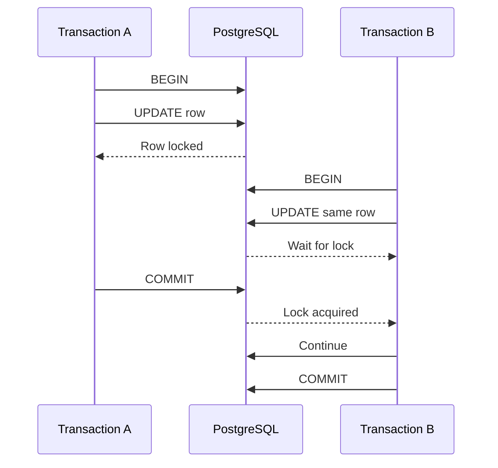
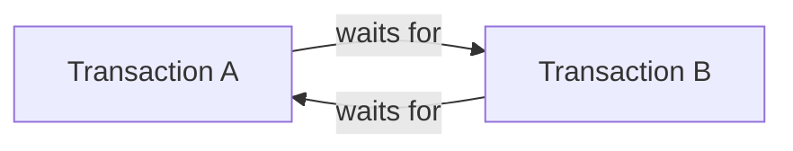
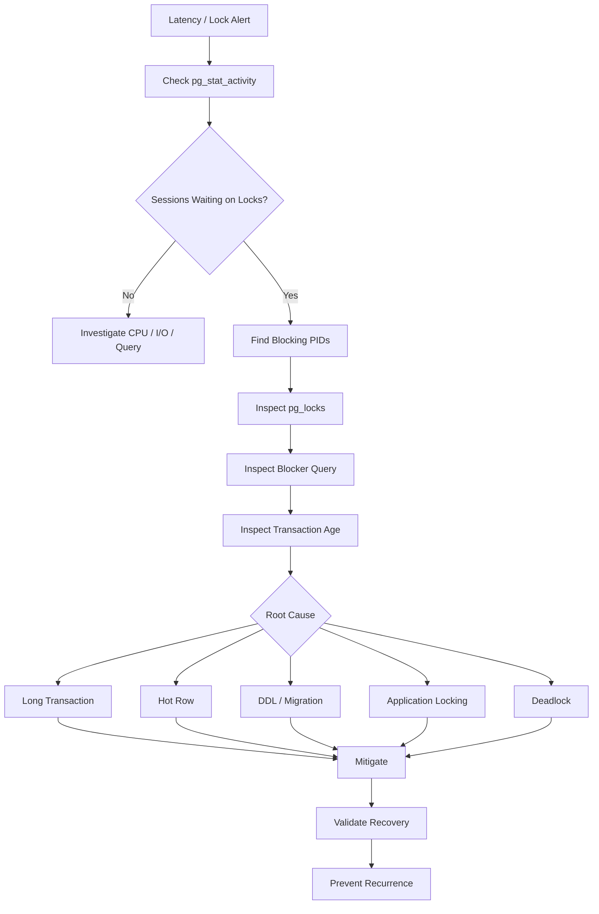

# 08- Lock and Deadlock Monitoring

## Overview

Lock and deadlock monitoring is the practice of detecting database sessions that are blocked, identifying the resources they are waiting for, finding the sessions causing the blockage, and distinguishing normal contention from actual deadlocks.

In PostgreSQL, concurrency is expected. Multiple Django, FastAPI, Celery, reporting, and administrative workloads may access the same rows simultaneously. Locks preserve transactional correctness, but excessive waiting can turn into:

```text
lock contention
    ↓
query latency
    ↓
connection pool exhaustion
    ↓
request timeouts
    ↓
retry amplification
    ↓
system-wide instability
```

Deadlocks are a more specific failure mode:

```text
Transaction A waits for B
Transaction B waits for A
```

PostgreSQL detects the cycle and aborts one transaction.

Production monitoring therefore needs to answer four questions quickly:

1. **Who is waiting?**
2. **What are they waiting for?**
3. **Who is blocking them?**
4. **Is this ordinary contention or a deadlock?**

---

## Lock Contention vs Deadlock

These conditions are related but different.

| Condition | Meaning | Typical Result |
|---|---|---|
| Normal locking | A transaction briefly waits for another | Usually harmless |
| Lock contention | Many sessions compete for the same resource | Increased latency |
| Long lock wait | A session waits for an unusually long time | Request degradation |
| Deadlock | Transactions form a circular dependency | PostgreSQL aborts one transaction |
| Lock storm | Large numbers of sessions accumulate behind a blocker | System-wide slowdown |

A useful mental model is:

```text
Contention:
A → waits for B
B → eventually completes
A → continues

Deadlock:
A → waits for B
B → waits for A
PostgreSQL → detects cycle
          → aborts one transaction
```

---

## Why Locks Exist

Locks protect concurrent operations from producing invalid results.

For example:

```text
Transaction A
    ↓
UPDATE account
SET balance = ...

Transaction B
    ↓
UPDATE same account
SET balance = ...
```

PostgreSQL must coordinate these operations.

Locks are therefore not inherently a performance problem.

The production problem is usually:

```text
lock duration
+
lock frequency
+
contention level
+
transaction scope
```

A short lock held for a few milliseconds is very different from a lock held for several seconds while an application waits on an external service.

---

## PostgreSQL MVCC and Locking

PostgreSQL uses MVCC to allow many readers and writers to proceed concurrently without requiring every read to acquire a blocking row lock.

Simplified:

```text
Reader
  ↓
reads visible row version

Writer
  ↓
creates a new row version
```

However, operations still require locks for coordination.

Examples include:

```text
UPDATE
DELETE
SELECT FOR UPDATE
DDL
foreign-key enforcement
advisory locks
```

Therefore:

```text
MVCC
≠
no locks
```

MVCC reduces unnecessary blocking but does not eliminate lock contention.

---

## Lock Lifecycle

A typical transaction behaves like:



The important observation is:

```text
Transaction A's duration
→
determines how long B may wait
```

This is why transaction design is central to lock monitoring.

---

## `pg_stat_activity`

`pg_stat_activity` shows session state and wait information.

A useful query is:

```sql
SELECT
    pid,
    usename,
    application_name,
    client_addr,
    state,
    wait_event_type,
    wait_event,
    xact_start,
    query_start,
    now() - xact_start AS transaction_age,
    now() - query_start AS query_age,
    query
FROM pg_stat_activity
WHERE state <> 'idle'
ORDER BY query_start;
```

Pay particular attention to:

```text
wait_event_type
wait_event
xact_start
query_start
state
application_name
```

These fields help determine whether a session is:

```text
executing
+
waiting
+
holding a long transaction
```

---

## Wait Events

PostgreSQL exposes wait information through:

```sql
SELECT
    pid,
    wait_event_type,
    wait_event,
    state,
    query
FROM pg_stat_activity
WHERE wait_event IS NOT NULL;
```

A session waiting on a lock can often be identified through:

```text
wait_event_type = Lock
```

The exact wait event provides additional context.

Do not interpret every wait as a database failure. PostgreSQL naturally waits for many resources, and short waits are often normal.

---

## Finding Blocked Sessions

A practical query is:

```sql
SELECT
    blocked.pid AS blocked_pid,
    blocked.usename AS blocked_user,
    blocked.application_name AS blocked_application,
    blocked.query_start AS blocked_query_start,
    now() - blocked.query_start AS blocked_duration,
    blocked.wait_event_type,
    blocked.wait_event,
    blocked.query AS blocked_query,
    blocker.pid AS blocker_pid,
    blocker.usename AS blocker_user,
    blocker.application_name AS blocker_application,
    blocker.query_start AS blocker_query_start,
    blocker.query AS blocker_query
FROM pg_stat_activity AS blocked
JOIN pg_stat_activity AS blocker
    ON blocker.pid = ANY(pg_blocking_pids(blocked.pid))
ORDER BY blocked.query_start;
```

This is one of the most useful operational queries during a lock incident.

It connects:

```text
waiter
→
blocker
→
application
→
query
→
duration
```

---

## `pg_blocking_pids()`

PostgreSQL provides:

```sql
pg_blocking_pids(pid)
```

to identify sessions blocking a specified backend.

Example:

```sql
SELECT
    pid,
    pg_blocking_pids(pid) AS blocking_pids,
    query
FROM pg_stat_activity
WHERE cardinality(pg_blocking_pids(pid)) > 0;
```

This is preferable to attempting to infer blockers from raw lock rows alone.

`pg_locks` provides detailed lock information, while `pg_blocking_pids()` directly answers the operational question:

> Which backend is blocking this session?

---

## `pg_locks`

`pg_locks` exposes locks held or awaited by PostgreSQL processes.

Inspect it with:

```sql
SELECT
    pid,
    locktype,
    mode,
    granted,
    relation::regclass AS relation,
    page,
    tuple,
    virtualxid,
    transactionid
FROM pg_locks
ORDER BY pid;
```

The important distinction is:

```text
granted = true
```

means the lock is held.

```text
granted = false
```

means the backend is waiting for that lock.

---

## Combining `pg_locks` and `pg_stat_activity`

For deeper investigation:

```sql
SELECT
    l.pid,
    a.usename,
    a.application_name,
    a.state,
    l.locktype,
    l.mode,
    l.granted,
    l.relation::regclass AS relation,
    a.xact_start,
    a.query_start,
    a.query
FROM pg_locks AS l
JOIN pg_stat_activity AS a
    ON a.pid = l.pid
WHERE l.granted = false
ORDER BY a.query_start;
```

This provides:

```text
session
+
lock
+
resource
+
wait state
+
transaction age
+
query
```

---

## Identifying the Root Blocker

A blocked session may itself be blocked by another session.

For example:

```text
A holds lock
↓
B waits for A
↓
C waits for B
↓
D waits for C
```

The most important session may be:

```text
A
```

because terminating B or C does not necessarily remove the underlying cause.

This is why production diagnosis should reconstruct the blocking chain rather than inspecting only one waiter.

---

## Blocking Chains

Conceptually:


A single long-running transaction can therefore create a large queue.

The impact may be much larger than the resource used by the original transaction.

---

## Lock Duration

A lock is often only as dangerous as the transaction holding it.

Consider:

```text
BEGIN
UPDATE order
SET status = 'processing'
WHERE id = 100;

COMMIT;
```

This transaction may complete quickly.

Compare:

```text
BEGIN
UPDATE order
SET status = 'processing'
WHERE id = 100;

call external API
wait 5 seconds
perform application work
COMMIT;
```

The second design keeps the transaction and associated locks open while the application performs unrelated work.

Avoid external network calls inside database transactions unless the consistency requirement explicitly justifies the design.

---

## `idle in transaction`

A particularly important state is:

```text
idle in transaction
```

Find these sessions:

```sql
SELECT
    pid,
    usename,
    application_name,
    xact_start,
    now() - xact_start AS transaction_age,
    state_change,
    query
FROM pg_stat_activity
WHERE state = 'idle in transaction'
ORDER BY xact_start;
```

These sessions may not currently be executing SQL, but their transaction remains open.

Potential consequences include:

```text
long-lived snapshots
+
delayed cleanup
+
unnecessary locks
+
table/index bloat
+
connection pool occupancy
```

---

## Long-Running Transactions

Find transactions older than a chosen operational threshold:

```sql
SELECT
    pid,
    usename,
    application_name,
    xact_start,
    now() - xact_start AS transaction_age,
    state,
    query
FROM pg_stat_activity
WHERE xact_start IS NOT NULL
ORDER BY xact_start;
```

The correct threshold depends on the workload.

A transaction lasting several seconds may be normal in one workload and unacceptable in another.

Monitor relative to:

```text
normal transaction duration
+
lock duration
+
request timeout
+
business workload
```

---

## Row-Level Contention

A common production pattern is a hot row.

Example:

```sql
UPDATE accounts
SET balance = balance - $1
WHERE id = $2;
```

If thousands of requests update the same account:

```text
many requests
      ↓
same row
      ↓
serialized updates
      ↓
lock waits
      ↓
tail latency
```

Adding more application instances does not solve this.

The database resource itself is the bottleneck.

---

## Hot Row Monitoring

Look for:

```text
many sessions
+
same table/resource
+
lock waits
+
similar UPDATE statements
```

Correlate:

```text
pg_stat_activity
+
pg_locks
+
query statistics
+
application metrics
```

Potential architectural solutions include:

```text
atomic updates
+
optimistic concurrency
+
queue serialization
+
sharded counters
+
partitioned workload
```

The correct solution depends on the invariant being protected.

---

## `SELECT FOR UPDATE`

Explicit row locking is often used when application logic requires a read-modify-write sequence.

Example:

```sql
BEGIN;

SELECT
    id,
    balance
FROM accounts
WHERE id = $1
FOR UPDATE;

UPDATE accounts
SET balance = balance - $2
WHERE id = $1;

COMMIT;
```

This can be correct when the application must serialize modifications to the selected row.

The risk is transaction duration.

Keep the transaction focused:

```text
lock row
→
perform required database work
→
commit
```

Do not hold the lock while performing external work.

---

## `NOWAIT`

When waiting is unacceptable:

```sql
SELECT
    id,
    status
FROM orders
WHERE id = $1
FOR UPDATE NOWAIT;
```

If the row is already locked, PostgreSQL returns an error instead of waiting.

Use this when the application has a meaningful alternative:

```text
return conflict
+
retry later
+
queue work
```

Do not use `NOWAIT` merely to hide an underlying contention problem.

---

## `SKIP LOCKED`

`SKIP LOCKED` is useful for queue-like workloads:

```sql
SELECT
    id
FROM jobs
WHERE status = 'pending'
ORDER BY id
FOR UPDATE SKIP LOCKED
LIMIT 100;
```

Multiple workers can claim different rows without waiting for already-locked rows.

This is useful for:

```text
database-backed job queues
+
batch workers
+
parallel task claiming
```

It is not appropriate when the application requires every matching row to be observed immediately.

Because locked rows are skipped, fairness and starvation must be considered.

---

## Advisory Locks

PostgreSQL advisory locks allow applications to coordinate using application-defined lock keys.

They can be useful for:

```text
singleton jobs
+
resource-specific coordination
+
application-level serialization
```

However, advisory locks are still locks.

They can:

```text
block
+
deadlock
+
remain held for too long
```

depending on whether session-level or transaction-level advisory locking is used.

Monitor them like other lock resources.

---

## Deadlocks

A deadlock occurs when transactions form a circular dependency.

Example:

```text
Transaction A
    locks row 1
    waits for row 2

Transaction B
    locks row 2
    waits for row 1
```

Graphically:



Neither transaction can progress.

PostgreSQL detects the cycle and aborts one transaction.

---

## Deadlock Detection

PostgreSQL reports deadlocks using SQLSTATE:

```text
40P01
```

Applications should recognize this as a transaction-level failure that may be safely retried when the operation is designed to be retryable.

The retry should encompass the **entire transaction**, not just the failed statement.

---

## Deadlock Prevention

The most effective prevention technique is consistent lock ordering.

Bad:

```text
Transaction A:
lock customer
lock order

Transaction B:
lock order
lock customer
```

Better:

```text
All transactions:
lock customer
lock order
```

The same principle applies to:

```text
multiple rows
+
multiple tables
+
advisory locks
+
application resources
```

Establish and document a consistent ordering for operations that can overlap.

---

## Multi-Row Updates

Applications can accidentally create deadlocks when multiple rows are locked in inconsistent order.

For example:

```text
Request A:
row 10 → row 20

Request B:
row 20 → row 10
```

Prefer deterministic ordering:

```sql
SELECT id
FROM accounts
WHERE id = ANY($1)
ORDER BY id
FOR UPDATE;
```

Then perform the required updates using the locked rows.

The exact design depends on the transaction's business semantics, but deterministic ordering reduces deadlock opportunities.

---

## Foreign Keys and Hidden Locking

An application may not explicitly use:

```sql
FOR UPDATE
```

and still encounter locking.

Lock behavior can arise from:

```text
UPDATE
+
DELETE
+
foreign-key enforcement
+
triggers
+
DDL
+
advisory locks
```

When investigating a lock incident, inspect the complete transaction rather than assuming the visible SQL statement is the only resource involved.

---

## DDL and Lock Monitoring

Schema changes can create significant locking.

Examples include:

```text
ALTER TABLE
+
certain index operations
+
constraint changes
```

A migration that is harmless in staging can block production traffic when a table is large or heavily used.

For production migrations:

```text
inspect lock requirements
+
estimate duration
+
use online/concurrent techniques where appropriate
+
set appropriate timeouts
+
monitor blocking
```

`CREATE INDEX CONCURRENTLY` can reduce blocking of ordinary writes, but it has operational trade-offs and cannot run inside a transaction block.

---

## Lock Timeouts

PostgreSQL provides:

```sql
SET lock_timeout = '2s';
```

This limits how long a statement waits to acquire a lock.

It is different from:

```sql
SET statement_timeout = '5s';
```

which limits statement execution time.

Conceptually:

```text
lock_timeout
    ↓
time waiting for a lock

statement_timeout
    ↓
total statement execution time
```

These settings solve different problems.

---

## Timeout Design

Timeouts should be layered:

```text
HTTP timeout
    ↓
application/database acquisition timeout
    ↓
statement_timeout
    ↓
lock_timeout
```

Exact values depend on the service's latency objectives.

The goal is to fail boundedly rather than allow blocked work to consume connections indefinitely.

---

## Deadlock Retry Strategy

A retry should be:

```text
bounded
+
backed off
+
jittered
+
idempotent
```

Conceptually:

```text
BEGIN
  ↓
execute transaction
  ↓
deadlock
  ↓
ROLLBACK
  ↓
wait with jitter
  ↓
BEGIN again
  ↓
retry whole transaction
```

Avoid:

```text
instant retry
+
unlimited retry
```

because many clients retrying simultaneously can create a retry storm.

---

## Django Lock Monitoring

Django exposes row locking through:

```python
from django.db import transaction

with transaction.atomic():
    order = (
        Order.objects
        .select_for_update()
        .get(pk=order_id)
    )

    order.status = "processing"
    order.save(update_fields=["status"])
```

Production considerations:

- Keep the `atomic()` block small.
- Avoid network calls inside it.
- Avoid unnecessary ORM queries while holding the lock.
- Monitor transaction duration.
- Handle deadlock and serialization failures at the transaction boundary.
- Do not assume `select_for_update()` is harmless simply because it is convenient.

---

## FastAPI and SQLAlchemy

With SQLAlchemy, explicit transaction boundaries should remain visible.

A conceptual pattern is:

```python
with engine.begin() as connection:
    connection.execute(...)
    connection.execute(...)
```

For explicit row-locking operations, the generated SQL should be inspected to ensure the expected locking semantics are actually being used.

The key principle is framework-independent:

```text
acquire lock
→
perform minimal required work
→
commit
```

---

## Connection Pools Amplify Lock Problems

Suppose:

```text
1 transaction holds a lock
```

and:

```text
50 application connections
```

wait behind it.

Those 50 connections may consume:

```text
pool capacity
+
memory
+
application concurrency
```

while doing no useful database work.

The incident can therefore propagate:

```text
lock
→
blocked connections
→
pool exhaustion
→
API latency
→
request timeouts
→
retries
→
more database pressure
```

This is why lock monitoring must be integrated with connection monitoring.

---

## Lock Contention and CPU

Lock contention does not necessarily produce high CPU.

A database can have:

```text
low CPU
+
high query latency
+
many blocked sessions
```

because sessions are waiting rather than executing.

Conversely:

```text
high CPU
+
many active sessions
```

may indicate query execution rather than locking.

Always inspect wait events before concluding that the database needs more CPU.

---

## Lock Contention and Memory

Blocked sessions still occupy database resources.

Large numbers of waiting connections can contribute to:

```text
backend memory
+
pool occupancy
+
application memory
```

A lock incident can therefore eventually become a memory or connection-capacity incident.

---

## Monitoring Metrics

Production monitoring should include:

| Metric | Purpose |
|---|---|
| Lock wait count | Detect contention |
| Lock wait duration | Measure impact |
| Blocked sessions | Detect queues |
| Blocking sessions | Identify root blockers |
| Long transactions | Detect lock retention |
| `idle in transaction` | Detect transaction lifecycle issues |
| Deadlock count | Detect circular dependencies |
| Query latency | Measure user impact |
| Pool wait time | Detect downstream saturation |
| Connection count | Measure resource pressure |
| CPU | Distinguish execution from waiting |
| I/O | Identify storage-related effects |

---

## PostgreSQL Lock Metrics

A useful diagnostic query is:

```sql
SELECT
    wait_event_type,
    wait_event,
    count(*) AS sessions
FROM pg_stat_activity
WHERE wait_event IS NOT NULL
GROUP BY
    wait_event_type,
    wait_event
ORDER BY sessions DESC;
```

This gives a high-level view of what sessions are waiting for.

For lock-focused monitoring:

```sql
SELECT count(*) AS waiting_sessions
FROM pg_stat_activity
WHERE wait_event_type = 'Lock';
```

Track this over time rather than relying only on one snapshot.

---

## Deadlock Logging

PostgreSQL can log lock waits and deadlocks.

Relevant configuration includes:

```text
log_lock_waits
deadlock_timeout
```

`deadlock_timeout` controls how long PostgreSQL waits before checking for a deadlock during lock acquisition; it is not a general lock-wait timeout.

`log_lock_waits` can help identify unusually long lock waits.

Use these settings carefully because logging can increase volume during high-contention incidents.

---

## Lock Monitoring Dashboard

A practical dashboard might contain:

```text
┌─────────────────────────────────────────┐
│ Active Connections                       │
│ Waiting Connections                      │
│ Lock Waits                               │
│ Deadlocks                                │
│ Longest Transaction                      │
│ Longest Lock Wait                        │
│ Connection Pool Utilization              │
│ Database CPU                             │
│ Query Latency                            │
└─────────────────────────────────────────┘
```

Correlate these metrics with:

```text
deployment events
+
traffic
+
application errors
+
database query changes
```

A spike in lock waits immediately after a deployment is significantly more actionable than an isolated lock-wait metric.

---

## Production Incident Workflow



---

## Incident Response Procedure

When production traffic is affected:

### Establish Impact

Check:

```text
API latency
+
error rate
+
connection pool wait
+
database query latency
```

### Find Waiting Sessions

```sql
SELECT
    pid,
    usename,
    application_name,
    wait_event_type,
    wait_event,
    query_start,
    now() - query_start AS duration,
    query
FROM pg_stat_activity
WHERE wait_event_type = 'Lock'
ORDER BY query_start;
```

### Find Blockers

Use:

```sql
pg_blocking_pids(pid)
```

to identify blockers.

### Inspect the Root Blocker

Determine:

```text
transaction age
+
query
+
application
+
database role
+
whether it is safe to terminate
```

### Check Recent Changes

Look for:

```text
deployment
+
migration
+
batch job
+
traffic spike
+
worker scaling
```

### Mitigate Carefully

Possible actions include:

```text
stop non-critical workload
+
cancel problematic query
+
terminate an abandoned session
+
pause workers
+
roll back problematic deployment
```

### Validate Recovery

Confirm:

```text
lock waits ↓
+
query latency ↓
+
pool utilization normal
+
error rate recovered
```

---

## `pg_cancel_backend()` vs `pg_terminate_backend()`

Cancellation asks PostgreSQL to stop the current query:

```sql
SELECT pg_cancel_backend(<pid>);
```

Termination ends the backend session:

```sql
SELECT pg_terminate_backend(<pid>);
```

Use termination more carefully because it disconnects the session and rolls back its active transaction.

A safe operational sequence is generally:

```text
identify
→
understand
→
cancel if appropriate
→
terminate only when justified
→
observe recovery
```

Do not terminate sessions based solely on age.

---

## Production Lock Kill Criteria

Before terminating a backend, consider:

```text
Is it actually blocking production traffic?
Is it the root blocker?
Is the transaction abandoned?
Could termination cause business-side effects?
Is it a critical migration?
Will killing it cause a retry storm?
Will another worker immediately recreate the problem?
```

The goal is to restore service while minimizing additional damage.

---

## Security Considerations

Lock monitoring exposes information such as:

```text
database users
+
application names
+
client addresses
+
SQL statements
+
transaction activity
```

Restrict diagnostic permissions in production.

Use dedicated operational roles where appropriate and avoid giving application roles broad monitoring or administrative privileges.

Monitoring queries should also avoid exposing sensitive query parameters unnecessarily.

---

## High Availability Considerations

Lock incidents can become more severe during failover.

For example:

```text
Primary failure
    ↓
connections reconnect
    ↓
application retries
    ↓
new primary receives burst
    ↓
hot rows / locks increase
```

After failover, monitor:

```text
connection rate
+
lock waits
+
deadlocks
+
transaction duration
+
query latency
```

Do not treat failover as complete merely because the new primary accepts connections.

---

## Disaster Recovery Considerations

Recovery and maintenance operations can interact with production locking.

Examples include:

```text
large data restoration
+
schema migrations
+
index creation
+
backfills
```

Run resource-intensive operations with:

```text
timeouts
+
controlled concurrency
+
monitoring
+
rollback strategy
```

Test operational procedures in environments that approximate production scale.

---

## Cost and Scalability

Lock contention can make additional application capacity counterproductive.

Example:

```text
10 pods
→
100 concurrent database requests
```

becomes:

```text
30 pods
→
300 concurrent database requests
```

If all requests compete for the same hot row:

```text
more pods
→
more waiting
→
more connections
→
higher latency
```

The database resource must be redesigned rather than simply scaled horizontally.

Potential solutions include:

```text
work partitioning
+
queue serialization
+
sharded counters
+
optimistic concurrency
+
reducing critical sections
```

---

## Common Mistakes

### Treating All Lock Waits as Incidents

Short lock waits are normal.

Measure duration, frequency, and user impact.

### Looking Only at the Blocked Session

The root cause is often the blocker.

Always inspect the blocking chain.

### Killing the Longest Query

The longest query may not be holding the problematic lock.

### Ignoring Transaction Duration

Locks are often symptoms of transaction design.

### Calling External Services Inside Transactions

This unnecessarily extends transaction and lock lifetime.

### Increasing Connection Pool Size

This can increase the number of blocked sessions and make the incident worse.

### Retrying Immediately After Deadlocks

Synchronized retries can create a retry storm.

### Retrying Only the Failed SQL Statement

A deadlock aborts the transaction. Retry the whole transaction when appropriate.

### Using `SKIP LOCKED` Without Understanding Semantics

Rows can be skipped temporarily, creating fairness or starvation concerns.

### Assuming MVCC Eliminates Locking

PostgreSQL still requires locks for many write and coordination operations.

### Ignoring DDL

Production migrations can create significant lock contention.

### Using `statement_timeout` as a Lock Timeout

These settings protect against different failure modes.

### Ignoring Advisory Locks

Application-defined locks can deadlock just like other locking mechanisms.

---

## Troubleshooting Decision Matrix

| Symptom | Likely Investigation |
|---|---|
| One blocked query | Find blocker with `pg_blocking_pids()` |
| Many blocked queries | Find root blocker and blocking chain |
| High lock wait + low CPU | Lock contention |
| High CPU + low lock waits | Query execution |
| `idle in transaction` | Application transaction lifecycle |
| Deadlock errors `40P01` | Lock ordering / concurrent transaction paths |
| Lock waits after deployment | Migration or application behavior |
| Hot single row | Contended business resource |
| Pool exhaustion + lock waits | Lock contention propagating into application |
| High latency after failover | Reconnect/retry/concurrency amplification |

---

## Testing Lock Behavior

Lock behavior should be tested explicitly.

For example, two PostgreSQL sessions can simulate contention:

**Session A**

```sql
BEGIN;

SELECT id
FROM orders
WHERE id = 100
FOR UPDATE;
```

**Session B**

```sql
BEGIN;

SELECT id
FROM orders
WHERE id = 100
FOR UPDATE;
```

Session B will wait while Session A holds the row lock.

Then:

**Session A**

```sql
COMMIT;
```

Session B can continue.

This type of controlled test is useful for validating:

```text
timeouts
+
monitoring
+
application behavior
+
retry logic
```

---

## Testing Deadlocks

A controlled deadlock can be created by locking resources in opposite order.

**Session A**

```sql
BEGIN;

SELECT id
FROM orders
WHERE id = 100
FOR UPDATE;
```

**Session B**

```sql
BEGIN;

SELECT id
FROM orders
WHERE id = 200
FOR UPDATE;
```

Then:

**Session A**

```sql
SELECT id
FROM orders
WHERE id = 200
FOR UPDATE;
```

and:

**Session B**

```sql
SELECT id
FROM orders
WHERE id = 100
FOR UPDATE;
```

PostgreSQL detects the circular dependency and aborts one transaction.

This should be tested in a non-production environment.

---

## Production Best Practices

- Monitor both lock waiters and root blockers.
- Use `pg_stat_activity`, `pg_locks`, and `pg_blocking_pids()` together.
- Track transaction duration, not only query duration.
- Treat `idle in transaction` as an important operational signal.
- Keep critical sections and transactions short.
- Establish deterministic lock ordering.
- Avoid external calls inside database transactions.
- Use `NOWAIT` or `SKIP LOCKED` only when their semantics match the business workflow.
- Retry deadlocked transactions as complete units with bounded backoff and jitter.
- Include connection pool metrics in lock incident analysis.
- Monitor DDL and migration locking behavior.
- Use timeouts to bound waiting and execution.
- Correlate lock events with deployments, traffic, workers, and migrations.
- Test contention and deadlock behavior before production incidents occur.
- Do not solve row-level contention by simply increasing application concurrency.

---

## Interview Perspective

A strong answer to:

> How would you troubleshoot a PostgreSQL deadlock or lock contention issue?

should follow this reasoning:

```text
1. Determine whether the issue is waiting or execution.
2. Inspect pg_stat_activity.
3. Identify sessions waiting on locks.
4. Use pg_blocking_pids() to find blockers.
5. Inspect pg_locks for lock details.
6. Reconstruct the blocking chain.
7. Inspect transaction age and application identity.
8. Determine whether the root cause is a long transaction, hot row,
   DDL, inconsistent lock ordering, or another workload.
9. Check connection pool impact.
10. Mitigate safely.
11. Retry aborted transactions where appropriate.
12. Fix transaction and locking design to prevent recurrence.
```

For deadlocks specifically, explain:

```text
deadlock
→
circular wait
→
PostgreSQL detects cycle
→
one transaction is aborted
→
application receives SQLSTATE 40P01
→
whole transaction may be retried
```

The important distinction is:

```text
lock contention
=
waiting

deadlock
=
circular waiting
```

---

## Senior-Level Lock Mental Model

Think of locking as a dependency graph:

```text
Transaction
    ↓
Locks resource
    ↓
Another transaction requests resource
    ↓
Wait relationship created
    ↓
More transactions may queue
```

For contention:

```text
A → B
A waits for B
```

For deadlock:

```text
A → B
B → A
```

For a production incident:

```text
Database lock
    ↓
Blocked query
    ↓
Connection occupied
    ↓
Pool capacity reduced
    ↓
Request waits
    ↓
HTTP timeout
    ↓
Retry
    ↓
More concurrency
    ↓
More contention
```

The senior-level goal is therefore not merely to identify a deadlock. It is to understand the **resource dependency, transaction lifecycle, concurrency level, and application behavior that allowed the database lock to become a system-level failure**.

## Key Takeaways

- **Distinguish contention from deadlocks:** contention is waiting for a resource; a deadlock is a circular dependency that PostgreSQL resolves by aborting one transaction.
- **Find the root blocker, not just the waiter:** combine `pg_stat_activity`, `pg_locks`, and `pg_blocking_pids()` to reconstruct the blocking chain.
- **Transaction design determines lock impact:** short transactions, deterministic lock ordering, and no unnecessary external work inside transactions dramatically reduce contention.
- **Lock problems propagate beyond PostgreSQL:** blocked connections can exhaust pools, increase API latency, trigger retries, and amplify system-wide load.
- **Treat deadlocks as retryable transaction failures when appropriate:** retry the whole transaction with bounded backoff and jitter, while fixing the underlying concurrency pattern.