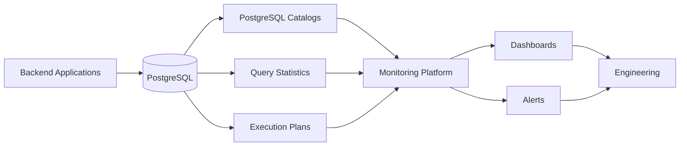
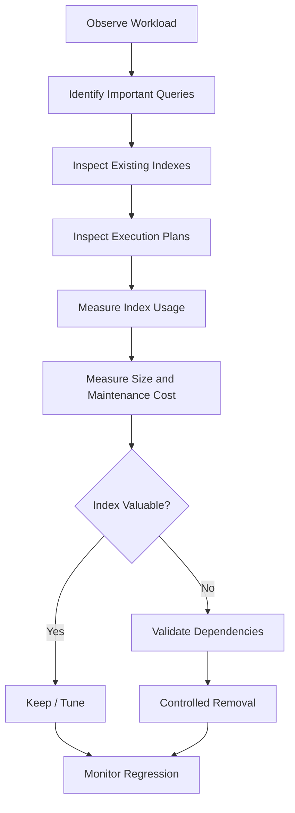

# 09- Index Monitoring

## Overview

Index monitoring is the continuous observation of database indexes to determine whether they are:

- Being used by important queries.
- Providing meaningful performance benefits.
- Growing unexpectedly.
- Consuming excessive storage.
- Increasing write amplification.
- Becoming bloated or inefficient.
- Creating operational cost without sufficient value.

An index is not a free performance optimization. Every additional index can improve reads while increasing the cost of:

```text
INSERT
UPDATE
DELETE
VACUUM
ANALYZE
backup
replication
storage
```

Production index management is therefore an optimization problem:

```text
Query workload
      ↓
Index usage
      ↓
Query performance
      ↓
Index maintenance cost
      ↓
Storage / replication / backup cost
```

For PostgreSQL, index monitoring should combine catalog information, query statistics, execution plans, table statistics, storage measurements, and application behavior.

---

## Why Index Monitoring Matters

A database can remain functionally correct while its indexes gradually become operational problems.

Common examples include:

```text
unused index
    ↓
extra storage
    ↓
larger backups
    ↓
more cache pressure
    ↓
higher write maintenance cost
```

Or:

```text
missing / incorrect index
    ↓
sequential scan
    ↓
high query latency
    ↓
higher CPU / I/O
    ↓
connection pool pressure
```

Index monitoring therefore serves two opposite goals:

| Goal | Monitoring Question |
|---|---|
| Find useful indexes | Which indexes serve important queries? |
| Find missing indexes | Which important queries lack an effective access path? |
| Find unused indexes | Which indexes provide little observed value? |
| Find incorrect indexes | Are existing indexes mismatched with workload patterns? |
| Control storage | Which indexes are consuming significant disk space? |
| Control write cost | Which indexes increase write amplification? |
| Detect bloat | Are indexes becoming inefficient over time? |
| Prevent regressions | Did a schema/query change alter index behavior? |

---

## PostgreSQL Index Architecture

An index is a separate database structure associated with a table.

For a B-tree index:

```text
Table
 ├── heap pages
 ├── row versions
 └── indexes
      └── B-tree pages
           ├── root
           ├── internal pages
           └── leaf pages
```

A query may use the index to locate relevant table rows:

```text
SQL
 ↓
Planner
 ↓
Index access path
 ↓
Index entries
 ↓
Heap / visibility checks
 ↓
Rows
```

Alternatively, PostgreSQL may decide that a sequential scan is cheaper.

Therefore:

> An index existing does not mean PostgreSQL should use it.

---

## What Should Be Monitored

A production index monitoring strategy should cover several dimensions.

| Dimension | Example Signal |
|---|---|
| Usage | `idx_scan` |
| Read efficiency | Query execution plans |
| Query frequency | `pg_stat_statements` |
| Size | `pg_relation_size()` |
| Growth | Size over time |
| Write impact | DML workload and index count |
| Bloat | Index size/structure analysis |
| Coverage | Query predicates and ordering |
| Redundancy | Overlapping indexes |
| Maintenance | VACUUM / ANALYZE behavior |
| Replication impact | WAL and replica workload |
| Backup impact | Database/index size |
| Regression | Plan changes over time |

No single metric is sufficient.

---

## Index Usage Statistics

PostgreSQL exposes index usage statistics through:

```text
pg_stat_user_indexes
pg_stat_all_indexes
```

A useful query is:

```sql
SELECT
    schemaname,
    relname AS table_name,
    indexrelname AS index_name,
    idx_scan,
    idx_tup_read,
    idx_tup_fetch
FROM pg_stat_user_indexes
ORDER BY idx_scan DESC;
```

Important fields include:

| Column | Meaning |
|---|---|
| `idx_scan` | Number of index scans initiated |
| `idx_tup_read` | Index entries returned by scans |
| `idx_tup_fetch` | Table rows fetched through the index |

These statistics help identify workload usage but should not be interpreted in isolation.

---

## Low `idx_scan` Does Not Automatically Mean Unused

Consider:

```text
idx_scan = 0
```

This does not necessarily mean:

```text
DROP INDEX
```

Possible explanations include:

- Statistics were recently reset.
- The database has only recently started receiving traffic.
- The index serves an infrequent but critical query.
- The index supports a constraint.
- Workload is seasonal.
- The application path is currently inactive.
- The index is used only during maintenance or operational tasks.

Before removing an index, inspect:

```text
age of statistics
+
query history
+
constraints
+
application behavior
+
workload seasonality
```

---

## Inspecting Indexes

List indexes with:

```sql
SELECT
    schemaname,
    tablename,
    indexname,
    indexdef
FROM pg_indexes
ORDER BY schemaname, tablename, indexname;
```

For a specific table:

```sql
SELECT
    indexname,
    indexdef
FROM pg_indexes
WHERE tablename = 'orders';
```

This is useful when comparing:

```text
query access pattern
vs
existing index definition
```

---

## Index Size Monitoring

Index storage can be inspected with:

```sql
SELECT
    schemaname,
    relname AS table_name,
    indexrelname AS index_name,
    pg_size_pretty(pg_relation_size(indexrelid)) AS index_size
FROM pg_stat_user_indexes
ORDER BY pg_relation_size(indexrelid) DESC;
```

For a total database view:

```sql
SELECT
    pg_size_pretty(pg_database_size(current_database())) AS database_size;
```

Large indexes matter because they affect:

```text
disk usage
+
cache pressure
+
backup size
+
replication
+
maintenance
```

---

## Index Growth

A single size measurement is less useful than a trend.

Track:

```text
index size
+
table size
+
row count
+
write volume
```

over time.

For example:

```text
Month 1 → 2 GB
Month 2 → 3 GB
Month 3 → 5 GB
Month 4 → 9 GB
```

This may indicate:

```text
data growth
+
bloat
+
index design
+
workload change
```

Index growth should be correlated with table growth before assuming bloat.

---

## Index-to-Table Size

A useful diagnostic comparison is:

```sql
SELECT
    schemaname,
    relname AS table_name,
    pg_size_pretty(pg_relation_size(relid)) AS table_size,
    pg_size_pretty(pg_indexes_size(relid)) AS indexes_size
FROM pg_catalog.pg_statio_user_tables
ORDER BY pg_indexes_size(relid) DESC;
```

A table can legitimately have indexes larger than the heap because it may have:

```text
multiple indexes
+
wide indexed columns
+
covering indexes
+
historical data
```

The ratio is therefore a diagnostic signal, not a correctness rule.

---

## Index Usage vs Index Size

A useful operational report combines usage and size:

```sql
SELECT
    s.schemaname,
    s.relname AS table_name,
    s.indexrelname AS index_name,
    s.idx_scan,
    pg_size_pretty(pg_relation_size(s.indexrelid)) AS index_size
FROM pg_stat_user_indexes AS s
ORDER BY
    s.idx_scan ASC,
    pg_relation_size(s.indexrelid) DESC;
```

This helps surface indexes that are:

```text
large
+
rarely scanned
```

These candidates deserve investigation, not automatic deletion.

---

## Indexes Supporting Constraints

Some indexes exist because of constraints.

Examples:

```text
PRIMARY KEY
UNIQUE
```

Inspect constraints before considering removal.

A constraint-backed index may have:

```text
low query usage
```

but still be essential for:

```text
data integrity
```

Never remove an index simply because its `idx_scan` value is low without determining why it exists.

---

## Foreign-Key Index Monitoring

A foreign key does not automatically mean the referencing column has a useful index.

For example:

```sql
CREATE TABLE orders (
    id bigint PRIMARY KEY,
    customer_id bigint REFERENCES customers(id)
);
```

An index on:

```text
orders.customer_id
```

may be important for:

```text
joins
+
parent deletes/updates
+
relationship lookups
```

Monitor foreign-key access patterns separately from primary-key and unique indexes.

---

## Query-Level Index Monitoring

Index statistics answer:

> Is this index being scanned?

Execution plans answer:

> Is this index helping this query?

Use:

```sql
EXPLAIN (ANALYZE, BUFFERS)
SELECT
    id,
    status,
    created_at
FROM orders
WHERE customer_id = $1
  AND status = $2
ORDER BY created_at DESC
LIMIT 50;
```

Inspect:

```text
scan type
+
actual rows
+
estimated rows
+
buffers
+
execution time
+
loops
```

Remember that `EXPLAIN ANALYZE` executes the query.

Do not use it casually against production `INSERT`, `UPDATE`, or `DELETE` statements because it executes those statements.

---

## Sequential Scans Are Not Automatically Bad

A sequential scan may be the optimal plan.

For example:

```text
query returns 80% of table
```

Using an index could require:

```text
index traversal
+
many heap accesses
```

A sequential scan may be cheaper.

Therefore:

```text
sequential scan
≠
missing index
```

The correct question is:

> Is the selected access path appropriate for the workload and data distribution?

---

## Index Scan

An index scan typically behaves like:

```text
Index
 ↓
matching entries
 ↓
heap row lookup
 ↓
visibility checks
 ↓
result
```

It is useful when the query retrieves a relatively selective subset of rows.

Potential limitation:

```text
many random heap accesses
```

can make an index scan slower than a sequential scan.

---

## Bitmap Index Scans

PostgreSQL may choose a bitmap strategy:

```text
Index
 ↓
bitmap of matching heap pages
 ↓
heap scan
 ↓
rows
```

This can be useful when:

```text
many rows match
+
random heap access would be expensive
```

A bitmap scan is not evidence that an index is incorrectly designed.

Interpret the entire plan.

---

## Index-Only Scans

An index-only scan can avoid many heap accesses when the index contains all required columns and PostgreSQL can determine tuple visibility efficiently.

For example:

```sql
CREATE INDEX orders_customer_status_created_idx
ON orders (customer_id, status, created_at DESC)
INCLUDE (total_amount);
```

Potential benefits:

```text
less heap I/O
+
smaller query cost
+
better read performance
```

However, `INCLUDE` columns increase index size and are not equivalent to key columns for search or ordering.

---

## Composite Index Monitoring

For a query:

```sql
SELECT *
FROM orders
WHERE customer_id = $1
  AND status = $2
ORDER BY created_at DESC;
```

a candidate index might be:

```sql
CREATE INDEX orders_customer_status_created_idx
ON orders (customer_id, status, created_at DESC);
```

Monitor whether the workload actually matches the index.

Index design should reflect:

```text
equality predicates
+
range predicates
+
ordering
+
result coverage
```

rather than simply listing every commonly queried column.

---

## Index Column Order

Composite indexes have an ordered structure.

For:

```text
(customer_id, status, created_at)
```

the planner can efficiently exploit predicates involving the leading columns.

Monitoring should therefore identify queries that:

```text
filter customer_id
filter customer_id + status
order by created_at after filtering
```

rather than assuming all permutations are equally supported.

Do not automatically create:

```text
A,B
B,A
A
B
```

for every workload.

That creates unnecessary maintenance cost.

---

## Partial Index Monitoring

Partial indexes can target frequently accessed subsets.

Example:

```sql
CREATE INDEX orders_pending_idx
ON orders (created_at)
WHERE status = 'pending';
```

This can be highly effective when:

```text
pending rows are a small subset
+
queries frequently target pending rows
```

Monitor:

```text
index size
+
idx_scan
+
query predicates
+
data distribution
```

If the distribution changes significantly, the index's value may change too.

---

## Expression Index Monitoring

Expression indexes support queries using computed expressions.

Example:

```sql
CREATE INDEX users_lower_email_idx
ON users (lower(email));
```

The query should use the corresponding expression:

```sql
SELECT id
FROM users
WHERE lower(email) = $1;
```

Monitor whether the expression index is actually used.

A common failure is:

```text
index exists
+
query expression differs
+
planner cannot use the index as intended
```

---

## Pattern-Matching Indexes

Search workloads may use specialized indexes.

For example:

```text
B-tree
+
pg_trgm
+
GIN
```

depending on the query pattern.

Monitoring should begin with the actual query:

```sql
EXPLAIN (ANALYZE, BUFFERS)
SELECT id
FROM users
WHERE email LIKE $1;
```

Do not assume every string search requires a specialized index.

---

## Index Redundancy

Overlapping indexes can create unnecessary cost.

For example:

```text
(customer_id)
(customer_id, status)
```

may both be useful, or the first may be redundant depending on the workload.

Evaluate:

```text
query patterns
+
idx_scan
+
constraint requirements
+
index size
+
write workload
```

before removing one.

Redundancy analysis should be workload-driven rather than purely structural.

---

## Duplicate Indexes

Exact duplicate indexes provide little additional read value.

Inspect definitions:

```sql
SELECT
    indexrelid::regclass AS index_name,
    indrelid::regclass AS table_name,
    pg_get_indexdef(indexrelid) AS definition
FROM pg_index
ORDER BY indrelid, indexrelid;
```

Duplicate indexes often result from:

```text
migration history
+
ORM-generated migrations
+
manual production changes
+
schema refactoring
```

They increase maintenance cost without necessarily improving query performance.

---

## Index Bloat

Index bloat refers to inefficient index storage caused by accumulated dead or obsolete space.

Potential causes include:

```text
frequent updates
+
deletes
+
long-lived transactions
+
maintenance behavior
```

Bloat can increase:

```text
index size
+
I/O
+
cache pressure
+
maintenance cost
```

Do not diagnose bloat from size alone.

Use appropriate PostgreSQL extensions or operational tooling when detailed bloat measurement is required.

---

## VACUUM and Indexes

Autovacuum helps maintain PostgreSQL tables and indexes by cleaning up dead tuple information and maintaining visibility statistics.

Monitor:

```sql
SELECT
    schemaname,
    relname AS table_name,
    n_live_tup,
    n_dead_tup,
    last_autovacuum,
    last_autoanalyze,
    autovacuum_count,
    autoanalyze_count
FROM pg_stat_user_tables
ORDER BY n_dead_tup DESC;
```

High dead tuples combined with growing indexes may indicate a maintenance problem.

Do not assume every large index needs manual rebuilding.

---

## Index Maintenance

Potential maintenance actions include:

```text
VACUUM
+
REINDEX
+
index replacement
+
index removal
```

For production systems, consider:

```text
blocking behavior
+
write traffic
+
replication
+
storage headroom
+
maintenance window
```

`REINDEX CONCURRENTLY` can reduce blocking for normal writes compared with a standard rebuild, but it consumes additional resources and has operational trade-offs.

---

## Creating Indexes in Production

For large, heavily used tables, consider:

```sql
CREATE INDEX CONCURRENTLY orders_customer_created_idx
ON orders (customer_id, created_at DESC);
```

Advantages:

- Reduces blocking of normal writes compared with a regular index build.
- Useful for online production changes.

Limitations:

- More expensive operationally.
- Takes longer.
- Requires additional resources.
- Cannot run inside a transaction block.
- Failure may require cleanup of an invalid index.

Monitor:

```text
build progress
+
CPU
+
I/O
+
locks
+
replication
+
storage
```

---

## Monitoring Index Creation Progress

PostgreSQL exposes progress information for index builds.

For example:

```sql
SELECT
    pid,
    datname,
    relid::regclass AS table_name,
    index_relid::regclass AS index_name,
    phase,
    lockers_total,
    lockers_done,
    blocks_total,
    blocks_done,
    tuples_total,
    tuples_done
FROM pg_stat_progress_create_index;
```

This is useful during long-running production index operations.

---

## Index Drop Safety

Before dropping an index:

```text
1. Verify why it exists.
2. Inspect constraint dependencies.
3. Inspect usage statistics.
4. Inspect query history.
5. Consider statistics reset timing.
6. Check seasonal workloads.
7. Validate application paths.
8. Measure size and maintenance cost.
9. Prefer controlled removal.
10. Monitor after the change.
```

For production systems, removing an index should be treated as a schema change rather than a casual cleanup task.

---

## Query Statistics with `pg_stat_statements`

Index monitoring becomes much more useful when correlated with query workload.

If enabled, inspect:

```sql
SELECT
    calls,
    total_exec_time,
    mean_exec_time,
    rows,
    query
FROM pg_stat_statements
ORDER BY total_exec_time DESC
LIMIT 20;
```

Look for:

```text
high-frequency queries
+
high-total-time queries
+
high-latency queries
+
queries scanning large row counts
```

Then correlate them with execution plans and indexes.

---

## Query Workload vs Index Usage

Suppose:

```text
Index A:
idx_scan = 2,000,000

Index B:
idx_scan = 5
```

It is tempting to call A good and B bad.

But the correct analysis is:

```text
Index A
→ high usage
→ does it reduce query cost?

Index B
→ low usage
→ is it required for a critical operation?
```

Usage tells you **how often** an index is scanned.

Execution plans and workload analysis tell you **why it matters**.

---

## Index Monitoring Architecture

A production monitoring architecture can look like:



Typical sources include:

```text
pg_stat_user_indexes
pg_stat_user_tables
pg_stat_statements
pg_stat_activity
pg_locks
pg_stat_progress_create_index
```

plus host and infrastructure metrics.

---

## Monitoring in Django and FastAPI

The application should expose enough context to correlate database activity with backend behavior.

Useful identifiers include:

```text
service
+
environment
+
application_name
+
request ID
+
endpoint
+
worker type
```

For example:

```text
api-service
worker-service
reporting-service
migration-job
```

This makes it easier to identify whether index behavior changed because of:

```text
API deployment
+
Celery workload
+
reporting query
+
batch process
```

---

## ORM Query Monitoring

Django ORM and SQLAlchemy can hide the exact SQL workload from application developers.

Production monitoring should therefore correlate:

```text
ORM operation
→
generated SQL
→
query fingerprint
→
execution plan
→
index usage
```

Watch for ORM patterns such as:

```text
N+1 queries
+
unbounded result sets
+
unexpected joins
+
inefficient filters
+
missing pagination
```

An index may appear unused simply because the application is issuing the wrong query.

---

## Index Monitoring in Read Replicas

Read replicas may have a different workload from the primary.

For example:

```text
Primary
→ writes
→ transactional reads

Replica
→ API reads
→ reporting
→ dashboards
```

An index that is valuable on a read replica may have limited value on the primary.

However, schema/index definitions normally need to remain compatible across physical replicas.

Monitor workload by database role rather than assuming one environment's query pattern represents all environments.

---

## Indexes and Replication

Indexes increase the amount of work associated with writes.

A write such as:

```sql
INSERT INTO orders (...)
VALUES (...);
```

may require updates to:

```text
table heap
+
primary-key index
+
foreign-key-related indexes
+
secondary indexes
+
partial/expression indexes
```

More indexes can therefore increase:

```text
WAL generation
+
replica replay work
+
storage
+
backup size
```

Monitor replication lag after significant index or workload changes.

---

## Indexes and Write-Heavy Systems

For write-heavy systems:

```text
INSERT/UPDATE/DELETE
```

may dominate the workload.

Every additional index should have a measurable purpose.

Questions to ask:

```text
Which query requires it?
How frequently does that query execute?
How expensive is it without the index?
How large is the index?
What write workload does it add?
Is there another index that already supports the query?
```

This is especially important for:

```text
event ingestion
+
Kafka consumers
+
Celery workers
+
high-volume APIs
```

---

## Indexes and Hot Tables

A table receiving thousands of writes per second may have expensive indexes even when individual index updates are small.

Monitor:

```text
write throughput
+
index count
+
index size
+
WAL rate
+
replica lag
+
CPU
```

An index optimization that improves one read query can still be harmful if it significantly increases the write path.

---

## Partitioned Tables

For partitioned tables, index monitoring must consider individual partitions.

```text
orders
 ├── orders_2026_01
 ├── orders_2026_02
 ├── orders_2026_03
 └── orders_2026_04
```

An index may be:

```text
useful on hot partitions
+
unnecessary on archival partitions
```

Monitor:

```text
partition size
+
index size
+
query frequency
+
partition pruning
```

Do not assume every partition has identical workload characteristics.

---

## Indexes and Multi-Tenancy

Multi-tenant systems often have access patterns such as:

```sql
SELECT ...
FROM orders
WHERE tenant_id = $1
  AND status = $2
ORDER BY created_at DESC;
```

A common index pattern is:

```text
tenant_id
+
status
+
created_at
```

Monitor tenant-specific workload because:

```text
large tenant
+
small tenants
```

may have very different access patterns.

A single global index can also become a hot resource depending on workload and data distribution.

---

## Indexes and Row-Level Security

RLS can add tenant or authorization predicates to query execution.

For example:

```text
application predicate
+
RLS predicate
```

The resulting access pattern must be considered when designing and monitoring indexes.

Monitor actual plans rather than indexing only the SQL visible in application code.

---

## Keyset Pagination

Offset pagination can become expensive as offsets grow:

```sql
SELECT id, created_at
FROM orders
ORDER BY created_at DESC
LIMIT 50 OFFSET 500000;
```

Keyset pagination can use an ordered index more effectively:

```sql
SELECT id, created_at
FROM orders
WHERE created_at < $1
ORDER BY created_at DESC
LIMIT 50;
```

Monitoring should verify:

```text
index usage
+
rows scanned
+
execution time
+
pagination depth
```

---

## Index Monitoring Alerts

Avoid alerting on simple rules such as:

```text
idx_scan < 10
```

A better alerting strategy combines signals.

Examples:

```text
index size > threshold
AND
usage remains low
AND
index is not constraint-backed
```

or:

```text
query latency increases
AND
plan changed
AND
index scan disappeared
```

or:

```text
index growth increases significantly
AND
table growth remains stable
```

The goal is actionable alerts rather than noisy dashboards.

---

## Useful Monitoring Queries

### Largest Indexes

```sql
SELECT
    schemaname,
    relname AS table_name,
    indexrelname AS index_name,
    pg_size_pretty(pg_relation_size(indexrelid)) AS index_size
FROM pg_stat_user_indexes
ORDER BY pg_relation_size(indexrelid) DESC
LIMIT 20;
```

### Least-Scanned Indexes

```sql
SELECT
    schemaname,
    relname AS table_name,
    indexrelname AS index_name,
    idx_scan,
    pg_size_pretty(pg_relation_size(indexrelid)) AS index_size
FROM pg_stat_user_indexes
ORDER BY idx_scan ASC, pg_relation_size(indexrelid) DESC
LIMIT 20;
```

### Table and Index Sizes

```sql
SELECT
    schemaname,
    relname AS table_name,
    pg_size_pretty(pg_relation_size(relid)) AS table_size,
    pg_size_pretty(pg_indexes_size(relid)) AS indexes_size
FROM pg_catalog.pg_statio_user_tables
ORDER BY pg_indexes_size(relid) DESC;
```

### Table Maintenance

```sql
SELECT
    schemaname,
    relname AS table_name,
    n_live_tup,
    n_dead_tup,
    last_autovacuum,
    last_autoanalyze
FROM pg_stat_user_tables
ORDER BY n_dead_tup DESC;
```

---

## Production Index Review Workflow

A mature index review should follow:



The process should be evidence-driven.

---

## Safe Index Removal Process

A practical production workflow is:

### Identify Candidate

Find indexes with:

```text
low usage
+
high storage
+
high maintenance cost
```

### Validate Dependencies

Check:

```text
PRIMARY KEY
+
UNIQUE
+
foreign keys
+
application assumptions
```

### Check Query History

Use:

```text
pg_stat_statements
+
application metrics
+
query logs
```

### Check Statistics Lifetime

Determine whether:

```text
statistics reset recently
```

before trusting low `idx_scan`.

### Remove Carefully

Prefer a controlled schema migration and use:

```sql
DROP INDEX CONCURRENTLY IF EXISTS orders_old_idx;
```

when appropriate.

### Monitor

After removal:

```text
query latency
+
execution plans
+
CPU
+
I/O
+
errors
```

must be observed for regression.

---

## Security Considerations

Index definitions and query statistics can reveal information about:

```text
schema structure
+
table names
+
application behavior
+
query patterns
```

Restrict access to operational diagnostics appropriately.

Avoid exposing sensitive SQL or query parameters through dashboards and logs.

Monitoring roles should have the minimum permissions required for operational visibility.

---

## Reliability and High Availability

Index operations can affect availability even when they do not directly modify application data.

Risks include:

```text
long index builds
+
storage exhaustion
+
CPU saturation
+
I/O pressure
+
replication lag
+
migration failures
```

For HA systems:

```text
primary
+
replicas
+
backup storage
```

should all have sufficient capacity for index growth and maintenance.

A database that is operationally healthy today may become unavailable after an index operation if storage headroom is insufficient.

---

## Disaster Recovery and Backups

Indexes contribute to database storage requirements and therefore affect:

```text
backup size
+
backup duration
+
restore time
+
replication storage
```

When planning database capacity, account for:

```text
heap
+
indexes
+
WAL
+
temporary space
+
maintenance headroom
```

Large index-heavy databases can have significantly longer recovery operations.

---

## Cost Considerations

Index cost includes more than disk space.

Consider:

| Cost | Impact |
|---|---|
| Storage | Larger database footprint |
| RAM/cache | More pages competing for memory |
| CPU | Index maintenance and traversal |
| I/O | Reads, writes, vacuum, rebuilds |
| WAL | Write amplification |
| Replication | More replay work |
| Backups | Larger backup footprint |
| Restore | Longer recovery |
| Maintenance | VACUUM/reindex resources |

A useful senior-level principle is:

> An index should earn its operational cost through meaningful workload improvement or data integrity.

---

## Common Mistakes

### Dropping Every Low-Usage Index

Why it happens:

```text
idx_scan = 0
```

is interpreted as proof of uselessness.

Avoid it by checking:

```text
statistics age
+
constraints
+
critical paths
+
seasonality
```

### Assuming Every Sequential Scan Is Bad

Sequential scans can be optimal for large result sets.

### Adding an Index Without Measuring the Query

The index may never be used.

Always inspect the execution plan.

### Creating Too Many Composite Indexes

Each additional index increases:

```text
storage
+
write cost
+
maintenance
```

### Ignoring Index Size

A rarely used multi-gigabyte index can create substantial operational cost.

### Ignoring Write Workload

An index that improves reads can still damage a write-heavy system.

### Assuming `idx_scan` Measures Query Importance

A single critical query can be more important than millions of low-value scans.

### Ignoring Statistics Resets

Low usage immediately after a restart or statistics reset can be misleading.

### Rebuilding Indexes Automatically

Large rebuilds consume resources and can create unnecessary production risk.

### Ignoring Replica Impact

Index-heavy write workloads can increase WAL and replica replay pressure.

### Treating Index Bloat as a Size Problem

Large size may simply reflect legitimate data growth.

### Creating Indexes During Peak Traffic Without Planning

Even online techniques consume CPU, I/O, memory, and storage.

---

## Production Checklist

Before adding an index:

- Identify the exact query pattern.
- Confirm the query is important enough to optimize.
- Inspect `EXPLAIN (ANALYZE, BUFFERS)`.
- Check existing indexes for coverage.
- Evaluate column order.
- Consider selectivity.
- Consider write amplification.
- Estimate storage growth.
- Consider replicas and backups.
- Plan production-safe creation.

Before removing an index:

- Check usage statistics.
- Check statistics reset history.
- Check constraints.
- Check application query history.
- Check seasonal and operational workloads.
- Check overlapping indexes.
- Validate the replacement access path.
- Remove through controlled deployment.
- Monitor query regression afterward.

During ongoing operations:

- Track index size.
- Track index usage.
- Track query performance.
- Track table growth.
- Track maintenance activity.
- Track WAL and replication impact.
- Review indexes periodically.

---

## Senior-Level Index Monitoring Model

Think of every index as a production dependency:

```text
                   ┌───────────────┐
                   │     Query     │
                   └───────┬───────┘
                           │
                           ▼
                   ┌───────────────┐
                   │     Index     │
                   └───────┬───────┘
                           │
          ┌────────────────┼────────────────┐
          ▼                ▼                ▼
       Read Cost       Write Cost       Storage
          │                │                │
          ▼                ▼                ▼
       Latency           WAL           Backups
                           │
                           ▼
                       Replicas
```

A good index is not simply one that makes a query faster.

A good production index provides enough workload value to justify:

```text
read benefit
+
write overhead
+
storage
+
maintenance
+
replication
+
backup
+
operational complexity
```

---

## Interview Perspective

A strong answer to:

> How do you monitor database indexes in production?

should include:

```text
1. pg_stat_user_indexes
2. pg_stat_statements
3. EXPLAIN (ANALYZE, BUFFERS)
4. Index size and growth
5. Table growth and dead tuples
6. Constraint dependencies
7. Query frequency and business importance
8. Write amplification
9. Replication and backup impact
10. Regression monitoring
```

A particularly important distinction is:

```text
Index usage
    ≠
Index usefulness
```

`idx_scan` tells you how often an index has been scanned during the statistics period.

The execution plan tells you how the index participates in a particular query.

The workload tells you whether that query actually matters.

The operational metrics tell you whether maintaining the index is worth its cost.

## Key Takeaways

- **Monitor indexes across multiple dimensions:** usage, query performance, size, growth, maintenance cost, write amplification, and replication impact.
- **Never remove an index solely because `idx_scan` is low:** validate statistics lifetime, constraints, critical paths, seasonality, and query history first.
- **Use execution plans to measure index effectiveness:** `EXPLAIN (ANALYZE, BUFFERS)` reveals whether an index actually improves the access path.
- **Treat indexes as production resources:** every index consumes storage and contributes to write, WAL, replication, backup, and maintenance costs.
- **Make index changes evidence-driven:** add, tune, or remove indexes based on workload behavior and measured operational impact, then monitor for regression.