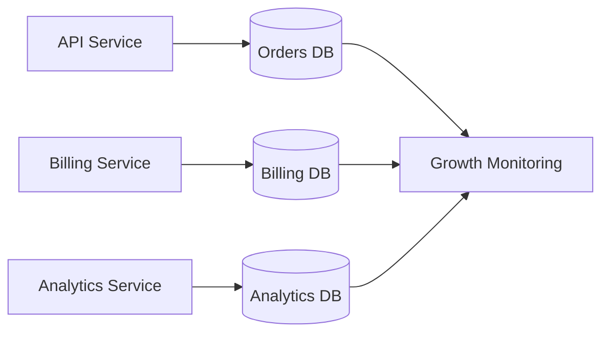
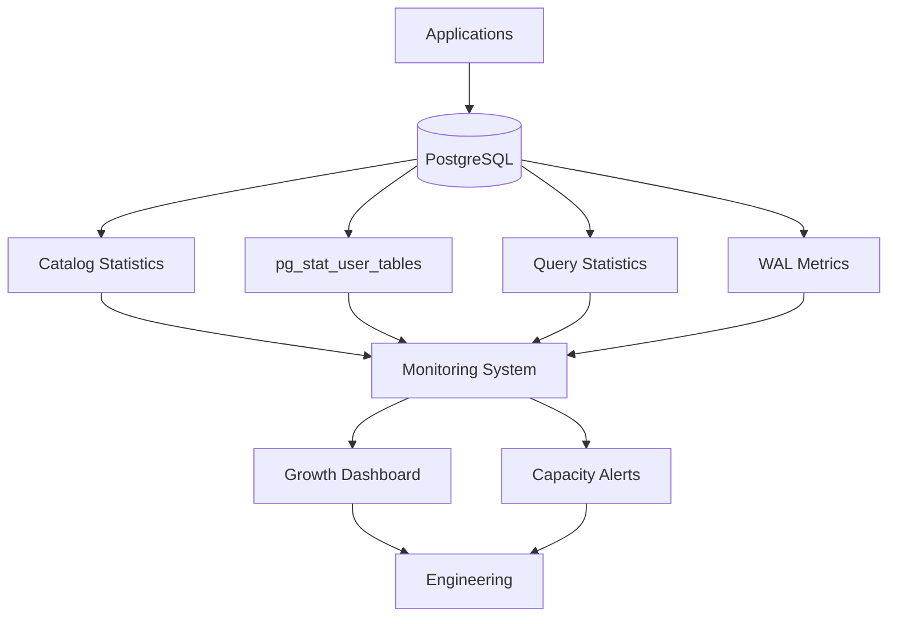
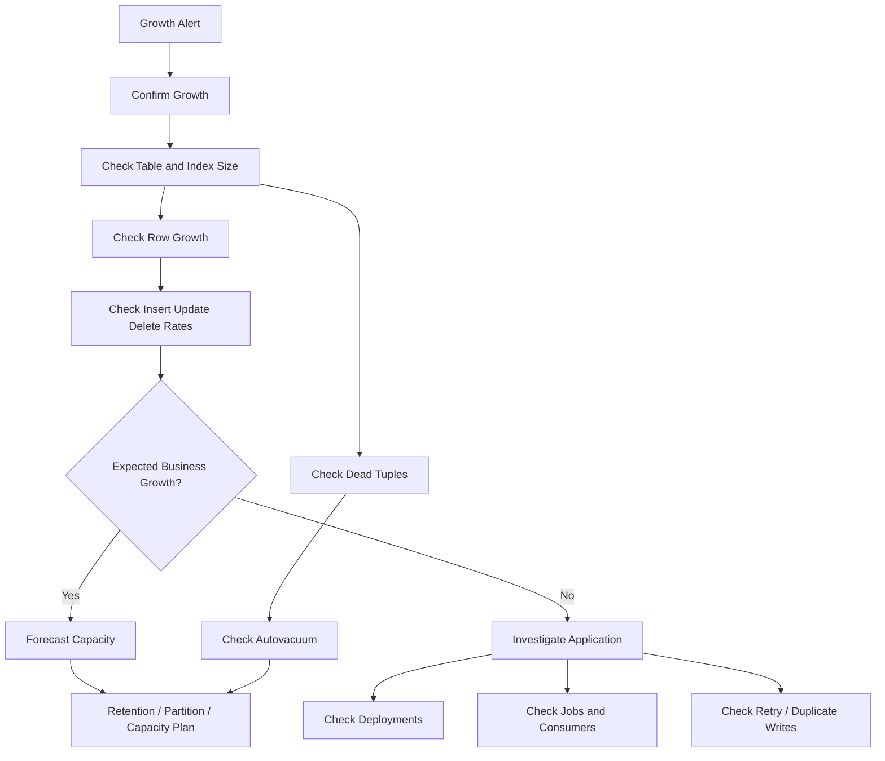

# 10- Table Growth Monitoring

## Overview

Table growth monitoring is the continuous measurement of how database tables and their associated storage structures grow over time.

In PostgreSQL, table growth is more than tracking the number of rows. A production database must distinguish between:

- Logical data growth.
- Physical table growth.
- Index growth.
- Dead tuples and bloat.
- WAL generation.
- Partition growth.
- Temporary and maintenance storage.
- Backup and replication growth.

A useful mental model is:

```text
Application writes
       ↓
Table rows / row versions
       ↓
Heap + indexes
       ↓
WAL generation
       ↓
Replication + backups
       ↓
Storage + operational cost
```

Monitoring growth allows engineers to answer questions such as:

- Which tables are growing fastest?
- Is growth expected from business traffic?
- Is physical growth larger than logical growth?
- Are dead tuples accumulating?
- Which indexes consume the most storage?
- Which tables will exhaust storage first?
- Is partitioning or archival becoming necessary?
- Is growth increasing backup, replication, or recovery time?

---

## Why Table Growth Monitoring Matters

A database can be healthy today and still have an operational capacity problem developing underneath it.

For example:

```text
Database size
     ↓
2 TB
     ↓
+100 GB/month
     ↓
2.8 TB after 8 months
     ↓
backup window increases
     ↓
restore time increases
     ↓
storage headroom decreases
```

Growth monitoring turns this into a predictable capacity-planning problem.

Without it, teams often discover capacity issues through:

```text
disk full
connection failures
failed writes
slow queries
failed backups
replication lag
```

rather than through proactive monitoring.

---

## Logical Growth vs Physical Growth

These concepts must be separated.

### Logical Growth

Logical growth describes the business data being stored:

```text
row count
+
logical row size
+
business events
```

For example:

```text
orders
January → 10 million rows
February → 12 million rows
March → 15 million rows
```

### Physical Growth

Physical growth describes actual storage consumption:

```text
heap
+
indexes
+
TOAST
+
free space
+
metadata
```

A table can physically grow faster than its logical row count because of:

- Updates.
- Deletes.
- Dead tuples.
- Row versioning.
- Large variable-length values.
- Index growth.
- Bloat.

Therefore:

```text
row growth ≠ storage growth
```

---

## PostgreSQL Storage Model

For a PostgreSQL table:

```text
Table
 ├── Heap relation
 ├── Index relations
 └── TOAST relations
```

An update does not generally overwrite the existing row version in place. PostgreSQL's MVCC model creates a new row version and eventually removes obsolete versions through vacuuming.

This means write-heavy tables can experience:

```text
UPDATE
 ↓
new tuple version
 ↓
dead tuple eventually created
 ↓
VACUUM
 ↓
space becomes reusable
```

Physical file size may therefore remain larger than the currently active logical data.

---

## What Should Be Monitored

A production table-growth dashboard should track multiple dimensions.

| Metric | Why It Matters |
|---|---|
| Table size | Physical storage consumption |
| Index size | Secondary storage consumption |
| Total relation size | Complete table footprint |
| Row estimate | Logical growth |
| Dead tuples | MVCC cleanup pressure |
| Insert rate | Current growth velocity |
| Update/delete rate | Potential bloat pressure |
| Partition size | Partition lifecycle |
| WAL volume | Replication and recovery impact |
| Backup size | DR cost |
| Storage utilization | Capacity risk |
| Autovacuum activity | Maintenance health |
| Analyze activity | Statistics freshness |

No single metric explains database growth.

---

## Measuring Table Size

A useful first query is:

```sql
SELECT
    schemaname,
    relname AS table_name,
    pg_size_pretty(pg_total_relation_size(relid)) AS total_size,
    pg_size_pretty(pg_relation_size(relid)) AS table_size,
    pg_size_pretty(pg_indexes_size(relid)) AS indexes_size
FROM pg_catalog.pg_statio_user_tables
ORDER BY pg_total_relation_size(relid) DESC;
```

This separates:

```text
total relation size
table heap size
index size
```

and quickly identifies the largest tables.

---

## Heap Size vs Total Size

These values answer different questions.

```text
pg_relation_size()
        ↓
table's main relation

pg_indexes_size()
        ↓
indexes associated with table

pg_total_relation_size()
        ↓
table + indexes + associated storage
```

For capacity planning, total size is usually more useful.

For diagnosing growth, the components are more useful.

---

## TOAST Storage

Large PostgreSQL values may be stored using TOAST.

Common examples include:

```text
large text
large JSONB values
large bytea values
```

Therefore a table's apparent heap size may not explain all of its physical storage.

Inspect TOAST relationships when a table's size behaves unexpectedly.

A useful catalog query is:

```sql
SELECT
    c.oid::regclass AS table_name,
    c.reltoastrelid::regclass AS toast_table
FROM pg_class AS c
WHERE c.relkind IN ('r', 'm')
  AND c.reltoastrelid <> 0
ORDER BY c.oid::regclass::text;
```

---

## Row Growth

PostgreSQL statistics provide approximate row counts through:

```text
pg_stat_user_tables
```

For example:

```sql
SELECT
    schemaname,
    relname AS table_name,
    n_live_tup,
    n_dead_tup,
    n_tup_ins,
    n_tup_upd,
    n_tup_del
FROM pg_stat_user_tables
ORDER BY n_live_tup DESC;
```

Important distinction:

```text
n_live_tup
```

is an estimate, not an exact `COUNT(*)`.

For high-volume production monitoring, estimates are usually preferable to repeatedly running expensive full-table counts.

---

## Exact Row Counts

An exact count:

```sql
SELECT COUNT(*)
FROM orders;
```

may require substantial work for a large table.

Do not use frequent exact counts as the primary production monitoring mechanism for very large tables.

Prefer:

```text
PostgreSQL statistics
+
application metrics
+
periodic controlled measurements
```

for continuous monitoring.

---

## Growth Rate

The absolute size is useful, but growth velocity is often more actionable.

For example:

```text
orders
1.0 TB
+
50 GB/month
```

is different from:

```text
orders
1.0 TB
+
300 GB/month
```

Track:

```text
size(t)
-
size(t-1)
```

over a consistent interval.

A simple growth model is:

```text
monthly_growth =
    current_size - previous_size
```

Long-term trends are more useful than individual measurements.

---

## Growth Forecasting

Suppose:

```text
Current database size = 3 TB
Free storage = 1 TB
Growth = 150 GB/month
```

A simplistic estimate is:

```text
1 TB / 150 GB ≈ 6.7 months
```

But production planning should include:

```text
growth variability
+
WAL
+
temporary space
+
maintenance operations
+
backup requirements
+
failover headroom
```

Never plan to consume 100% of available disk.

---

## Storage Headroom

A database should maintain operational headroom.

Storage pressure can affect:

```text
INSERT
UPDATE
CREATE INDEX
VACUUM
WAL
temporary queries
backups
```

A production alert should therefore fire before:

```text
disk utilization → 100%
```

Use capacity thresholds appropriate to workload and recovery requirements rather than relying on a universal percentage.

---

## Dead Tuple Monitoring

Monitor:

```sql
SELECT
    schemaname,
    relname AS table_name,
    n_live_tup,
    n_dead_tup,
    last_autovacuum,
    last_autoanalyze
FROM pg_stat_user_tables
ORDER BY n_dead_tup DESC;
```

High dead tuples can indicate:

```text
heavy UPDATE/DELETE workload
+
autovacuum lag
+
long-running transactions
+
maintenance pressure
```

Dead tuples do not automatically mean an emergency.

Interpret them relative to:

```text
table size
+
write rate
+
autovacuum activity
+
transaction age
```

---

## Dead Tuples vs Bloat

These concepts are related but not identical.

```text
dead tuples
    ↓
obsolete row versions

bloat
    ↓
inefficient physical storage
```

A table may have dead tuples that vacuum can clean efficiently without requiring a physical rewrite.

Do not automatically run aggressive maintenance whenever `n_dead_tup` increases.

---

## Autovacuum and Table Growth

Autovacuum is central to PostgreSQL table maintenance.

It helps:

- Reclaim reusable space.
- Maintain visibility information.
- Trigger automatic analyze operations.
- Prevent transaction ID wraparound problems.

For large or write-heavy tables, default settings may require workload-specific tuning.

Monitor:

```text
last_autovacuum
+
autovacuum_count
+
dead tuples
+
transaction age
```

A table growing rapidly may need different maintenance behavior from a static table.

---

## Update-Heavy Tables

Consider:

```text
orders
```

with frequent updates to:

```text
status
updated_at
processing_state
```

The table may experience substantial row-version churn.

Monitor:

```text
n_tup_upd
+
n_dead_tup
+
autovacuum frequency
+
table size
```

If physical growth significantly exceeds business data growth, investigate:

```text
update frequency
+
long transactions
+
vacuum effectiveness
+
fillfactor
+
index growth
```

---

## Insert-Heavy Tables

Append-heavy tables behave differently.

Examples include:

```text
events
audit_events
application_logs
metrics
Kafka ingestion tables
```

Growth may be predictable:

```text
events/day
×
average row size
```

For these workloads, monitor:

```text
rows/day
+
bytes/day
+
partition size
+
retention
+
WAL volume
```

Retention and partition lifecycle often become more important than vacuum tuning.

---

## Delete-Heavy Tables

Deleting rows does not necessarily reduce the physical table file immediately.

For example:

```sql
DELETE FROM events
WHERE created_at < $1;
```

can create dead tuples that require vacuuming.

If the goal is large-scale retention cleanup, alternatives may include:

```text
partition detach/drop
+
archival
+
batch deletion
```

depending on schema architecture.

---

## Large Deletes

Large deletes can create substantial:

```text
dead tuples
+
WAL
+
replication traffic
+
lock duration
+
vacuum work
```

Instead of:

```sql
DELETE FROM events
WHERE created_at < $1;
```

against hundreds of millions of rows, a production design may use time-based partitions and drop old partitions.

When batch deletion is required, use carefully controlled batches and monitor transaction duration, WAL, locks, and replica lag.

---

## Partition Growth Monitoring

Partitioning is useful for managing predictable growth.

Example:

```text
events
 ├── events_2026_01
 ├── events_2026_02
 ├── events_2026_03
 └── events_2026_04
```

Monitor each partition:

```text
size
+
row growth
+
index size
+
write rate
+
retention age
```

This allows:

```text
hot partitions
→ active writes

cold partitions
→ archive / detach

expired partitions
→ drop
```

---

## Partition Size Query

A useful query is:

```sql
SELECT
    c.oid::regclass AS relation_name,
    pg_size_pretty(pg_total_relation_size(c.oid)) AS total_size
FROM pg_class AS c
WHERE c.relkind IN ('r', 'p')
ORDER BY pg_total_relation_size(c.oid) DESC;
```

For detailed partition hierarchy, PostgreSQL catalog information can be combined with partition metadata to identify parent/child relationships.

---

## Index Growth

Table growth and index growth should be monitored independently.

For example:

```text
Table
500 GB

Indexes
1.2 TB
```

may be legitimate for a highly indexed workload, but it deserves investigation.

Track:

```text
table size
+
index size
+
index count
+
index growth
+
index usage
```

See the index monitoring documentation for deeper analysis of individual indexes.

---

## Index-to-Table Growth

A useful trend is:

```text
index_size / table_size
```

Track it over time rather than applying a fixed threshold.

A rapidly increasing ratio may indicate:

```text
new indexes
+
wide indexes
+
INCLUDE columns
+
index bloat
+
changing data distribution
```

---

## Storage Breakdown

A database capacity model should resemble:

```text
Database storage
├── Table heap
├── Indexes
├── TOAST
├── WAL
├── Temporary files
└── Operational headroom
```

Backups and replicas introduce additional storage requirements outside the primary database volume.

Capacity planning should account for all relevant storage domains.

---

## WAL Growth

Table growth can increase WAL generation, but WAL volume is not simply equal to table-size growth.

WAL is affected by:

```text
INSERT
UPDATE
DELETE
index maintenance
full-page writes
bulk operations
```

Monitor WAL independently.

For example, a workload that updates the same rows repeatedly may generate substantial WAL without adding many new rows.

---

## Replication Impact

More writes generally mean more WAL.

```text
Application
    ↓
Primary
    ↓
WAL
    ↓
Replica
```

Growth-related workload changes can therefore affect:

```text
replication lag
+
replica storage
+
replay CPU
+
recovery time
```

Monitor growth and replication together when scaling a production PostgreSQL system.

---

## Backup and Recovery Impact

As tables grow:

```text
database size ↑
    ↓
backup size ↑
    ↓
backup duration ↑
    ↓
restore duration ↑
```

This affects disaster recovery objectives.

A database that grows from:

```text
500 GB → 5 TB
```

may require a completely different backup and recovery strategy.

Consider:

```text
base backups
+
WAL archiving
+
PITR
+
retention
+
restore testing
```

---

## Growth and RPO/RTO

Growth can affect recovery objectives.

For example:

```text
larger base backup
+
more WAL
+
slower storage
```

can increase recovery time.

Therefore database capacity planning should include:

```text
growth forecast
+
backup throughput
+
WAL archive throughput
+
restore throughput
+
RTO target
```

Do not treat storage planning as separate from disaster recovery planning.

---

## Table Growth and Query Performance

Growth can change query behavior even when SQL and indexes remain unchanged.

Example:

```text
100K rows
→ index scan

100M rows
→ different cardinality
→ different cost model
→ potentially different plan
```

Growth affects:

```text
statistics
+
cardinality
+
index size
+
cache behavior
+
I/O
+
execution plans
```

This is why performance monitoring and growth monitoring must be connected.

---

## Statistics and Growth

As tables grow, planner statistics must remain representative.

Monitor:

```text
last_autoanalyze
+
analyze frequency
+
query plan changes
```

A stale statistical picture can cause:

```text
incorrect cardinality estimate
→
poor execution plan
→
higher latency
```

Rapidly changing tables may require workload-specific autovacuum/analyze configuration.

---

## Large Tables and Index Creation

Growth increases the cost of schema operations.

For a multi-terabyte table:

```sql
CREATE INDEX ...
```

may require substantial:

```text
CPU
+
I/O
+
temporary storage
+
time
```

For production systems, consider online approaches such as:

```sql
CREATE INDEX CONCURRENTLY ...
```

when appropriate.

Monitor:

```text
storage headroom
+
index build progress
+
locks
+
CPU
+
I/O
+
replication
```

---

## Growth and Connection Pools

Table growth can indirectly affect connection pools.

Example:

```text
table grows
 ↓
query becomes slower
 ↓
transactions remain open longer
 ↓
connections remain occupied
 ↓
pool exhaustion
 ↓
API latency increases
```

Therefore:

```text
storage growth
→
query performance
→
transaction duration
→
connection pressure
```

can become a cascading production failure.

---

## Growth and Application Architecture

Backend architecture influences database growth.

### Django

Common growth sources include:

```text
ORM-created business tables
+
Celery task tables
+
audit tables
+
session tables
```

### FastAPI

Common growth sources include:

```text
API event records
+
job metadata
+
audit logs
+
application-specific state
```

### Kafka Consumers

High-volume consumers can produce rapid database growth:

```text
Kafka
 ↓
consumer
 ↓
batch insert
 ↓
PostgreSQL
 ↓
rapid table growth
```

This should be paired with:

```text
retention
+
partitioning
+
batching
+
backpressure
```

---

## Growth and Redis

Redis can reduce database read pressure but does not stop persistent database growth.

For example:

```text
PostgreSQL
→ durable source of truth

Redis
→ cached representation
```

Do not mistake reduced query traffic for reduced storage growth.

Database retention remains an independent concern.

---

## Growth in Microservices

Each service owning its database creates independent growth patterns.



Track growth per service:

```text
database
+
schema
+
table
+
partition
```

A single service can become the organization's primary storage consumer without being the highest-traffic service.

---

## Data Retention

Growth monitoring should lead to explicit retention policies.

For each high-growth table define:

```text
business purpose
+
retention period
+
archival strategy
+
deletion strategy
+
compliance requirements
```

Example:

| Data | Retention Strategy |
|---|---|
| Active orders | Keep online |
| Old orders | Archive or retain in colder storage |
| Application logs | Short retention |
| Audit records | Compliance-driven |
| Events | Partition + retention |
| Temporary job records | Periodic cleanup |

Retention must be designed with legal, compliance, and business requirements rather than purely storage cost.

---

## Archival Strategies

Common strategies include:

```text
PostgreSQL → object storage
PostgreSQL → analytical warehouse
PostgreSQL → archive database
Partition → detach → archive
```

For AWS architectures, object storage can be appropriate for historical data that does not need OLTP query performance.

Do not archive data merely because it is old if applications still require low-latency transactional access.

---

## Table Growth Alerts

Useful alerts include:

```text
storage utilization exceeds threshold
```

```text
table growth rate exceeds expected baseline
```

```text
dead tuples remain elevated
```

```text
autovacuum falls behind
```

```text
partition exceeds expected size
```

```text
WAL growth changes unexpectedly
```

```text
backup size or duration increases sharply
```

Alerts should be based on actionable conditions rather than arbitrary size thresholds alone.

---

## Growth Anomaly Detection

Suppose:

```text
Normal growth:
20 GB/day

Observed:
80 GB/day
```

Do not immediately assume the database is broken.

Investigate:

```text
traffic increase
+
deployment
+
batch job
+
Kafka consumer
+
duplicate writes
+
retry storm
+
schema change
+
index creation
```

Growth anomalies can reveal application bugs.

---

## Application-Level Growth Metrics

Database metrics should be correlated with application metrics.

Useful dimensions include:

```text
requests/sec
+
writes/sec
+
events/sec
+
orders/day
+
rows inserted/request
+
batch size
```

For example:

```text
API traffic ↑ 20%
Database rows ↑ 400%
```

may indicate:

```text
duplicate writes
+
retry bug
+
event amplification
```

---

## Growth Monitoring Architecture

A production monitoring system can look like:



Combine:

```text
database metrics
+
host metrics
+
application metrics
+
backup metrics
+
replication metrics
```

---

## Recommended Growth Dashboard

A useful dashboard should include:

### Database Level

```text
total size
storage utilization
WAL rate
backup size
backup duration
```

### Table Level

```text
top tables by size
top tables by growth
row estimates
dead tuples
autovacuum activity
```

### Index Level

```text
top indexes by size
index growth
index usage
```

### Operational Level

```text
replication lag
CPU
I/O
memory
temporary files
connection utilization
```

---

## Growth Investigation Workflow

When a table grows unexpectedly:



This prevents premature maintenance operations.

---

## Production Troubleshooting Queries

### Largest Tables

```sql
SELECT
    schemaname,
    relname AS table_name,
    pg_size_pretty(pg_total_relation_size(relid)) AS total_size
FROM pg_catalog.pg_statio_user_tables
ORDER BY pg_total_relation_size(relid) DESC
LIMIT 20;
```

### Row and Write Activity

```sql
SELECT
    schemaname,
    relname AS table_name,
    n_live_tup,
    n_dead_tup,
    n_tup_ins,
    n_tup_upd,
    n_tup_del
FROM pg_stat_user_tables
ORDER BY n_tup_ins DESC;
```

### Autovacuum State

```sql
SELECT
    schemaname,
    relname AS table_name,
    n_dead_tup,
    last_autovacuum,
    last_autoanalyze,
    autovacuum_count,
    autoanalyze_count
FROM pg_stat_user_tables
ORDER BY n_dead_tup DESC;
```

### Table and Index Breakdown

```sql
SELECT
    schemaname,
    relname AS table_name,
    pg_size_pretty(pg_relation_size(relid)) AS table_size,
    pg_size_pretty(pg_indexes_size(relid)) AS indexes_size,
    pg_size_pretty(pg_total_relation_size(relid)) AS total_size
FROM pg_catalog.pg_statio_user_tables
ORDER BY pg_total_relation_size(relid) DESC;
```

---

## Operational Runbook

When storage growth becomes abnormal:

### Confirm

Verify:

```text
database size
+
table size
+
index size
+
WAL
```

### Identify

Determine:

```text
which relation grew
+
when it grew
+
how quickly it grew
```

### Correlate

Check:

```text
deployments
+
traffic
+
Celery jobs
+
Kafka consumers
+
batch processes
```

### Classify

Determine whether growth is:

```text
expected
+
temporary
+
structural
+
application bug
+
maintenance issue
```

### Act

Potential actions:

```text
increase capacity
+
fix application behavior
+
tune retention
+
partition
+
archive
+
batch deletes
+
optimize indexes
+
tune autovacuum
```

### Validate

After the change:

```text
growth rate
+
storage headroom
+
query performance
+
replication
+
backup behavior
```

should be monitored.

---

## Security Considerations

Growth monitoring can expose:

```text
table names
+
schema design
+
business volume
+
tenant activity
+
query patterns
```

Restrict operational dashboards and catalog access appropriately.

For multi-tenant systems, avoid exposing tenant-level growth information to unauthorized users.

Do not log sensitive row contents merely to explain storage growth.

Prefer metadata:

```text
table
+
partition
+
size
+
row estimates
+
operation counts
```

---

## Reliability Considerations

Growth-related failures can become cascading incidents.

For example:

```text
storage pressure
 ↓
writes slow/fail
 ↓
transactions remain open
 ↓
connection pool fills
 ↓
API latency increases
 ↓
retries increase
 ↓
database load increases
```

Growth monitoring should therefore be connected to:

```text
storage
+
query latency
+
connections
+
replication
+
application retries
```

---

## High Availability Considerations

For replicated PostgreSQL:

```text
Primary storage growth
        ↓
WAL
        ↓
Replica replay
        ↓
Replica storage
```

A replica must have sufficient capacity as well.

Failover planning should consider:

```text
primary storage
+
replica storage
+
WAL retention
+
backup storage
```

A replica that is technically healthy but nearly out of disk is not a reliable failover target.

---

## Disaster Recovery Considerations

Growth directly affects DR.

Track:

```text
database size
+
backup duration
+
WAL archive rate
+
restore throughput
+
restore duration
```

Periodically validate that:

```text
RPO
+
RTO
```

remain achievable as the database grows.

A DR design that worked at 500 GB may not work at 5 TB.

---

## Scalability Considerations

Table growth is often the first signal that a database architecture must evolve.

Possible progression:

```text
Optimize queries
      ↓
Optimize indexes
      ↓
Tune maintenance
      ↓
Connection / workload scaling
      ↓
Partitioning
      ↓
Read replicas
      ↓
OLAP / warehouse
      ↓
Sharding
```

Do not jump directly to sharding because a table is large.

First understand:

```text
growth rate
+
access patterns
+
write rate
+
retention
+
query workload
+
operational constraints
```

---

## Cost Considerations

Table growth creates several costs:

| Cost | Growth Impact |
|---|---|
| Primary storage | More database disk |
| Replica storage | More replicated data |
| Backups | Larger backups |
| WAL storage | More recovery data |
| Network | More replication/archive traffic |
| I/O | More maintenance and query I/O |
| Compute | Larger indexes and scans |
| DR | Longer backup/restore |
| Operations | More complex lifecycle management |

The cheapest long-term strategy is often not simply buying more storage.

It may be:

```text
retention
+
partitioning
+
archival
+
workload specialization
```

---

## Common Mistakes

### Monitoring Only Database Size

Why it fails:

```text
database = 5 TB
```

does not reveal which tables or indexes caused the growth.

Monitor relation-level breakdowns.

### Using Exact `COUNT(*)` Continuously

Large counts can create unnecessary database work.

Use statistics for routine monitoring.

### Treating Every Growth Spike as Bloat

Growth may be legitimate business traffic.

Correlate with insert/update/delete activity.

### Ignoring Index Growth

Indexes can consume more storage than the table itself.

### Ignoring TOAST

Large JSON, text, or binary values can use substantial auxiliary storage.

### Deleting Millions of Rows in One Transaction

This can create:

```text
WAL
+
dead tuples
+
long transactions
+
replication lag
```

Use partition lifecycle or controlled batching where appropriate.

### Waiting Until Disk Is Almost Full

Maintenance operations often need additional temporary capacity.

Keep sufficient headroom.

### Ignoring Replica Capacity

Primary growth also affects replicas.

### Ignoring Backup Growth

Larger databases can invalidate existing backup and restore assumptions.

### Solving Growth Only by Scaling Storage

Storage postpones the problem but does not answer:

```text
Why is data growing?
How long must it remain online?
Should it be partitioned?
Should it be archived?
```

### Removing Data Without a Retention Policy

Ad-hoc deletion can violate business or compliance requirements.

---

## Production Best Practices

- Track table, index, and total relation size separately.
- Track growth rate rather than only absolute size.
- Monitor row activity alongside physical size.
- Monitor dead tuples and autovacuum behavior.
- Track high-growth tables by partition where applicable.
- Correlate database growth with application writes.
- Maintain storage headroom.
- Include growth in backup and DR capacity planning.
- Use partitioning for predictable high-volume lifecycle management.
- Prefer dropping expired partitions over massive deletes when the data model supports it.
- Treat retention as an explicit product and operational policy.
- Review growth trends during capacity planning.
- Monitor replicas and WAL as write volume increases.
- Investigate unexpected growth as a potential application defect.
- Revisit query plans and indexes as data distributions change.

---

## Interview Traps

### "How do you monitor table growth?"

A strong answer should include:

```text
pg_total_relation_size
pg_relation_size
pg_indexes_size
pg_stat_user_tables
n_live_tup
n_dead_tup
insert/update/delete counters
autovacuum
growth rate
partition sizes
WAL
replication
backups
```

### "Does row count equal table size?"

No.

Physical size also depends on:

```text
row width
+
MVCC versions
+
TOAST
+
free space
+
indexes
```

### "Does DELETE immediately reduce disk usage?"

Not necessarily. Deleted tuples become dead tuples and space may become reusable after vacuuming without immediately shrinking the underlying relation files.

### "How would you handle a rapidly growing events table?"

A strong architecture discussion should consider:

```text
time-based partitioning
+
retention
+
batch ingestion
+
index minimization
+
archival
+
partition dropping
+
OLAP separation
```

rather than simply increasing database storage.

---

## Senior-Level Growth Model

Think of table growth as a lifecycle:

```text
Data Creation
     ↓
Active OLTP Storage
     ↓
Growth Monitoring
     ↓
Partition / Index Management
     ↓
Retention Decision
     ↓
Archive / Delete
     ↓
Storage Reclamation
```

At senior level, the goal is not merely:

> "Monitor how big the table is."

The goal is:

> "Understand why the table is growing, forecast its operational impact, and design a lifecycle that keeps storage, performance, availability, and recovery objectives sustainable."

---

## Growth Capacity Review

For every critical high-growth table, periodically answer:

| Question | Engineering Decision |
|---|---|
| How fast is it growing? | Capacity forecast |
| Why is it growing? | Business vs application behavior |
| How long must data remain online? | Retention |
| Is access time-based? | Partitioning candidate |
| Are writes or updates dominant? | Maintenance strategy |
| Are indexes growing disproportionately? | Index review |
| Is storage becoming expensive? | Archive strategy |
| Is query performance degrading? | Query/index optimization |
| Are replicas keeping up? | Replication capacity |
| Can backups meet RTO? | DR redesign if necessary |

This converts growth monitoring into an architectural control mechanism.

## Key Takeaways

- **Monitor logical and physical growth separately:** row counts, heap, indexes, TOAST, dead tuples, and total relation size describe different aspects of database growth.
- **Track growth velocity, not just current size:** growth rate determines when storage, backup, replication, and recovery limits will become operational problems.
- **Correlate growth with workload behavior:** unexpected growth can indicate traffic changes, duplicate writes, retry storms, batch jobs, Kafka consumers, or application defects.
- **Treat retention and partitioning as lifecycle controls:** high-volume time-based data is often better managed through partitioning and partition lifecycle operations than massive deletes.
- **Include growth in the complete production capacity model:** storage, WAL, replicas, backups, query performance, connection pressure, HA, and DR must all remain sustainable as data volume increases.