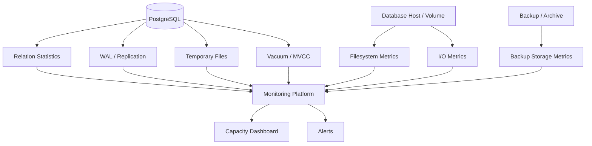
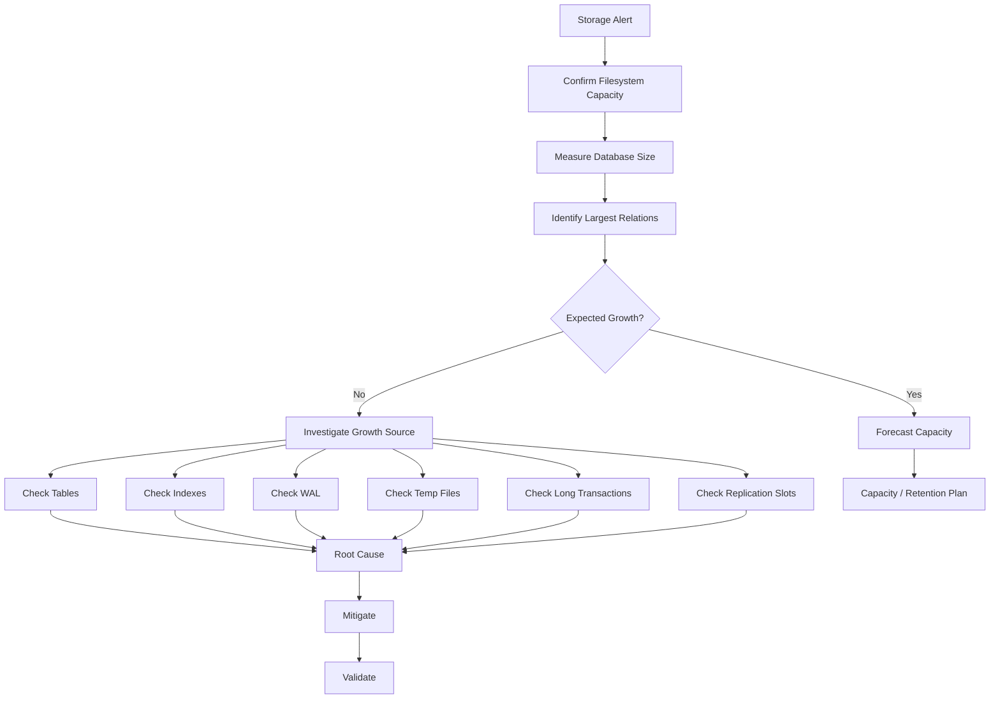
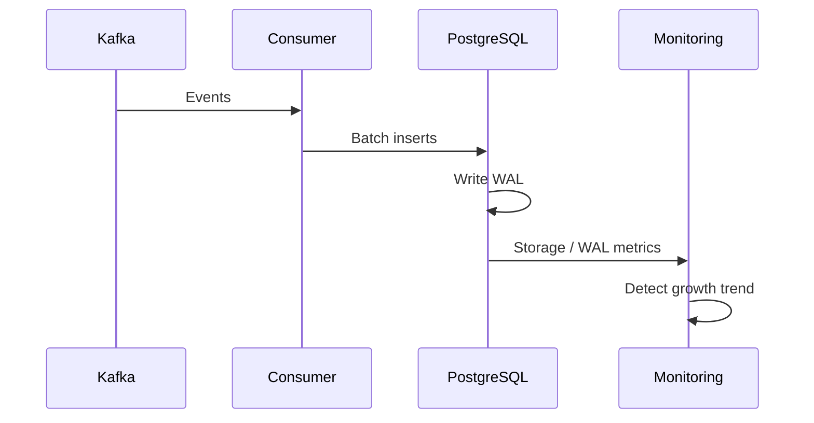

# 11- Storage Monitoring

## Overview

Storage monitoring is the continuous measurement of database storage consumption, capacity, growth, I/O behavior, and storage-related failure risk.

For a production PostgreSQL system, monitoring only disk utilization is insufficient. A database can encounter storage problems because of:

- Table and index growth.
- Dead tuples and bloat.
- WAL accumulation.
- Replication slots retaining WAL.
- Long-running transactions.
- Temporary files.
- Failed or concurrent index builds.
- Backup and archive storage growth.
- Container or volume limits.
- Sudden write amplification.

A useful production model is:

```text
Application
    ↓
PostgreSQL
    ├── Heap
    ├── Indexes
    ├── TOAST
    ├── WAL
    └── Temporary files
         ↓
      Storage
         ↓
 ┌───────┴────────┐
 │                │
Replication     Backups
 │                │
Replica disk     Archive storage
```

Storage monitoring should therefore answer three questions:

1. **How much storage are we using?**
2. **Why is storage changing?**
3. **When will storage become an operational problem?**

---

## Storage Monitoring vs Table Growth Monitoring

Storage monitoring is broader than table growth monitoring.

| Area | Primary Question |
|---|---|
| Table growth | Which tables are growing? |
| Index growth | Which indexes consume storage? |
| Database storage | How much PostgreSQL storage is used? |
| WAL | How much recovery/replication data is accumulating? |
| Temporary storage | Are queries generating excessive temporary files? |
| Filesystem | How much disk capacity remains? |
| Backups | How much backup/archive storage is required? |
| Replication | Is a replica or slot retaining storage? |
| Bloat | Is physical storage growing faster than useful data? |

Table growth is one component of the overall storage problem.

---

## Storage Layers

A production PostgreSQL deployment has multiple storage layers.

```text
Infrastructure
    ↓
Filesystem / EBS / Persistent Volume
    ↓
PostgreSQL data directory
    ├── Tables
    ├── Indexes
    ├── TOAST
    ├── WAL
    └── Temporary files
```

External systems introduce additional storage:

```text
PostgreSQL
 ├── Primary volume
 ├── Replica volumes
 ├── WAL archive
 └── Backup repository
```

For Kubernetes:

```text
PostgreSQL Pod
      ↓
PersistentVolume
      ↓
StorageClass
      ↓
Cloud block storage
```

For AWS-managed PostgreSQL services, the underlying storage is managed by the platform, but capacity, utilization, I/O, and cost still require monitoring.

---

## Why Storage Monitoring Matters

Storage exhaustion can become a database-wide incident.

```text
Disk utilization increases
        ↓
Less free space
        ↓
Maintenance operations become constrained
        ↓
WAL / temp / index operations compete for space
        ↓
Writes or maintenance fail
        ↓
Application errors
```

The danger is that the final failure can happen much later than the event that caused the growth.

For example:

```text
Bad application deployment
        ↓
duplicate writes
        ↓
table grows 2× faster
        ↓
storage slowly fills
        ↓
incident occurs weeks later
```

Storage monitoring provides the evidence needed to detect the problem before capacity becomes critical.

---

## Core Storage Metrics

A production storage dashboard should track at least:

| Metric | Purpose |
|---|---|
| Used storage | Current consumption |
| Free storage | Remaining capacity |
| Storage utilization | Capacity risk |
| Growth rate | Forecasting |
| Database size | PostgreSQL logical storage footprint |
| Largest relations | Identify storage consumers |
| Index size | Detect index-heavy schemas |
| WAL volume | Write/recovery pressure |
| WAL retained | Detect retention problems |
| Temporary file usage | Detect memory pressure/query spill |
| Dead tuples | Detect cleanup pressure |
| Backup size | DR capacity |
| Archive storage | Long-term recovery storage |
| I/O latency | Storage performance |
| IOPS / throughput | Storage saturation |

---

## Filesystem Monitoring

At the infrastructure layer, monitor:

```bash
df -h
```

and:

```bash
df -i
```

The first reports block storage utilization.

The second reports inode utilization.

In most modern database deployments, block capacity is the primary concern, but inode exhaustion can still cause operational failures in filesystems where inode consumption is relevant.

For PostgreSQL hosts, also inspect:

```bash
du -sh "$PGDATA"
```

and, when investigating a known PostgreSQL data directory:

```bash
du -sh "$PGDATA"/*
```

Do not rely on filesystem-level commands alone. PostgreSQL relation-level information is necessary to understand where the storage is going.

---

## PostgreSQL Database Size

Measure the size of a database with:

```sql
SELECT
    datname,
    pg_size_pretty(pg_database_size(datname)) AS size
FROM pg_database
ORDER BY pg_database_size(datname) DESC;
```

For a specific database:

```sql
SELECT pg_size_pretty(pg_database_size(current_database()));
```

This gives a high-level storage figure but does not explain which relations consume the space.

---

## Largest Tables

Use relation-level measurements to identify major consumers:

```sql
SELECT
    schemaname,
    relname AS table_name,
    pg_size_pretty(pg_relation_size(relid)) AS table_size,
    pg_size_pretty(pg_indexes_size(relid)) AS index_size,
    pg_size_pretty(pg_total_relation_size(relid)) AS total_size
FROM pg_catalog.pg_statio_user_tables
ORDER BY pg_total_relation_size(relid) DESC
LIMIT 20;
```

This is one of the most useful first queries during a storage investigation.

---

## Table Size Components

PostgreSQL exposes several useful size functions.

| Function | Measures |
|---|---|
| `pg_relation_size()` | Main relation size |
| `pg_indexes_size()` | Associated indexes |
| `pg_total_relation_size()` | Relation plus indexes and associated TOAST storage |
| `pg_database_size()` | Total database size |

A useful mental model is:

```text
Total table footprint
    =
heap
+
indexes
+
TOAST
+
associated storage
```

Do not interpret the heap size as the complete storage cost of a table.

---

## Index Storage

Indexes can become a major portion of database storage.

Inspect indexes with:

```sql
SELECT
    schemaname,
    relname AS table_name,
    indexrelname AS index_name,
    pg_size_pretty(pg_relation_size(indexrelid)) AS index_size
FROM pg_stat_user_indexes
ORDER BY pg_relation_size(indexrelid) DESC
LIMIT 30;
```

A table with:

```text
table = 200 GB
indexes = 600 GB
```

may be valid for the workload, but it deserves an intentional design review.

Wide or redundant indexes increase:

```text
storage
+
write amplification
+
cache pressure
+
backup size
+
replication traffic
+
maintenance cost
```

---

## TOAST Storage

PostgreSQL uses TOAST for large field values that cannot efficiently remain inline.

Common sources include:

```text
large TEXT
large JSONB
large BYTEA
```

When investigating unexpectedly large tables, inspect whether TOAST contributes significantly to the relation footprint.

Large JSON documents are particularly important in application architectures because an apparently small number of rows can still consume substantial storage.

---

## WAL Storage

Write-ahead logging is another important storage dimension.

```text
Application write
      ↓
PostgreSQL
      ↓
WAL
      ├── crash recovery
      ├── replication
      └── archiving
```

WAL volume is influenced by:

- Inserts.
- Updates.
- Deletes.
- Index modifications.
- Full-page writes.
- Bulk operations.
- Checkpoint behavior.

WAL generation should therefore be monitored independently from table growth.

---

## WAL Retention

High WAL retention can consume significant storage.

Potential causes include:

```text
replication lag
+
replication slots
+
failed consumers
+
archive problems
+
long-running transactions
```

Inspect replication slots with:

```sql
SELECT
    slot_name,
    slot_type,
    active,
    restart_lsn,
    confirmed_flush_lsn
FROM pg_replication_slots;
```

Inactive logical replication slots are particularly important to investigate because a slot can retain WAL needed by its consumer.

Never delete or advance a replication slot casually. Understand the consumer and recovery implications first.

---

## Replication and Storage

Replication can create storage pressure in several ways.

```text
Primary
  ↓ WAL
Replica
  ↓
Replica storage

Primary
  ↓ WAL
Replication slot
  ↓
WAL retained on primary
```

A replica that falls behind can consume additional storage as WAL accumulates.

Monitor:

```text
replica lag
+
WAL retention
+
replication slot state
+
replica disk usage
```

Storage and replication monitoring should be treated as related systems.

---

## Temporary File Storage

Queries can use temporary files when operations such as:

```text
sorts
+
hash operations
+
materialization
```

exceed available per-operation memory.

Large temporary files can create significant disk usage.

Monitor PostgreSQL temporary-file activity through statistics such as:

```sql
SELECT
    datname,
    temp_files,
    pg_size_pretty(temp_bytes) AS temp_bytes
FROM pg_stat_database
ORDER BY temp_bytes DESC;
```

High temporary usage can indicate:

```text
large sorts
+
large hash operations
+
insufficient work_mem
+
high query concurrency
+
poor query plans
```

Do not simply increase `work_mem`. It is allocated per operation and can multiply across concurrent sessions.

---

## Temporary Files and Query Performance

The relationship is often:

```text
Large query
    ↓
Sort / Hash
    ↓
work_mem insufficient
    ↓
Temporary file
    ↓
Disk I/O
    ↓
Query latency
```

A storage alert caused by temporary files may therefore actually be a query-performance problem.

Investigate:

```text
EXPLAIN (ANALYZE, BUFFERS)
+
query frequency
+
concurrency
+
temporary file statistics
```

---

## Dead Tuples and Bloat

PostgreSQL's MVCC model means updates and deletes can leave obsolete row versions.

```text
UPDATE
  ↓
new row version
  ↓
old version becomes dead
  ↓
VACUUM
  ↓
space becomes reusable
```

Monitor:

```sql
SELECT
    schemaname,
    relname AS table_name,
    n_live_tup,
    n_dead_tup,
    last_autovacuum,
    last_autoanalyze
FROM pg_stat_user_tables
ORDER BY n_dead_tup DESC;
```

High dead tuples are not automatically equivalent to catastrophic bloat.

Interpret them alongside:

```text
table size
+
write rate
+
transaction age
+
autovacuum activity
```

---

## Long-Running Transactions

Long-running transactions can prevent PostgreSQL from removing row versions that are still potentially visible to that transaction.

This can contribute to:

```text
dead tuple accumulation
+
table bloat
+
WAL retention
```

Inspect active sessions:

```sql
SELECT
    pid,
    usename,
    application_name,
    client_addr,
    state,
    xact_start,
    query_start,
    wait_event_type,
    wait_event,
    query
FROM pg_stat_activity
WHERE xact_start IS NOT NULL
ORDER BY xact_start;
```

An old transaction is often more useful to investigate than a high dead-tuple count alone.

---

## Storage Growth and Connection Pressure

Storage problems can indirectly become connection problems.

```text
Storage pressure
      ↓
I/O latency increases
      ↓
queries take longer
      ↓
transactions remain active longer
      ↓
connections stay occupied
      ↓
pool exhaustion
      ↓
API latency
```

This is why database storage should not be monitored in isolation.

Correlate:

```text
disk
+
I/O
+
query latency
+
transaction duration
+
connection utilization
```

---

## Storage I/O Monitoring

Capacity and performance are different dimensions.

A volume can have plenty of free space but still be slow.

Monitor:

```text
read latency
write latency
IOPS
throughput
queue depth
utilization
```

At the infrastructure level, tools may include:

```bash
iostat -xz 1
```

For cloud-managed databases, use the provider's storage and database performance metrics.

The exact metrics vary by AWS service and storage configuration, so use the metrics appropriate to the deployed architecture.

---

## Capacity vs Performance

| Condition | Interpretation |
|---|---|
| High disk usage, low I/O | Capacity problem |
| Low disk usage, high I/O latency | Performance problem |
| High disk usage, high I/O | Both |
| Rapid growth, normal I/O | Capacity trend |
| Stable size, increasing latency | Likely performance/query issue |
| WAL increasing rapidly | Write/replication/recovery pressure |
| Temp storage increasing | Query/memory pressure |

Do not solve an I/O latency problem merely by adding disk capacity.

---

## Storage Growth Rate

Absolute size answers:

> How much storage do we use?

Growth rate answers:

> How quickly are we consuming capacity?

For example:

```text
Current storage = 2.4 TB
Growth = 120 GB/month
```

A simple forecast is:

```text
available_capacity / monthly_growth
```

But production forecasting should include:

```text
growth variability
+
maintenance headroom
+
WAL
+
temporary storage
+
backup requirements
+
failover requirements
```

---

## Storage Forecasting

A simple operational model is:

```text
months_to_capacity =
    usable_free_storage / expected_monthly_growth
```

Example:

```text
Free storage = 800 GB
Expected growth = 100 GB/month

≈ 8 months
```

Do not plan to reach the mathematical maximum.

Define an operational reserve for:

```text
unexpected growth
+
maintenance
+
temporary operations
+
failover
```

---

## Storage Headroom

Storage headroom is the capacity intentionally left unused to absorb unexpected workload.

Headroom may be required for:

- Index creation.
- Vacuum-related operations.
- Temporary files.
- WAL.
- Backfills.
- Bulk imports.
- Schema migrations.
- Recovery.
- Traffic spikes.

A database at 95% utilization is not necessarily equivalent to a database with 95% useful capacity remaining.

The appropriate alert threshold depends on:

```text
growth rate
+
storage expansion time
+
workload
+
maintenance behavior
+
cloud architecture
```

---

## Alerting Strategy

Useful alerts include:

| Alert | Reason |
|---|---|
| Low free storage | Capacity risk |
| Rapid growth | Unexpected workload |
| High WAL retention | Replication/archive issue |
| Replica disk pressure | Failover risk |
| Excessive temp files | Query/memory problem |
| High dead tuples | Maintenance pressure |
| Long-running transaction | Vacuum/WAL impact |
| Backup storage growth | DR cost/capacity |
| High I/O latency | Storage performance |
| Storage forecast breach | Capacity planning |

Alerts should be actionable.

For example:

```text
"Disk > 80%"
```

is less useful than:

```text
"Projected storage exhaustion within 14 days
based on the last 30 days of growth."
```

---

## Storage Monitoring Architecture

A production monitoring architecture can combine database and infrastructure metrics:



For Kubernetes and AWS environments, add:

```text
PersistentVolume metrics
+
node metrics
+
cloud storage metrics
+
database metrics
```

---

## PostgreSQL Storage Diagnostic Queries

### Database Sizes

```sql
SELECT
    datname,
    pg_size_pretty(pg_database_size(datname)) AS database_size
FROM pg_database
ORDER BY pg_database_size(datname) DESC;
```

### Largest Relations

```sql
SELECT
    schemaname,
    relname AS relation_name,
    pg_size_pretty(pg_total_relation_size(relid)) AS total_size
FROM pg_catalog.pg_statio_user_tables
ORDER BY pg_total_relation_size(relid) DESC
LIMIT 25;
```

### Table vs Index Storage

```sql
SELECT
    schemaname,
    relname AS table_name,
    pg_size_pretty(pg_relation_size(relid)) AS table_size,
    pg_size_pretty(pg_indexes_size(relid)) AS index_size,
    pg_size_pretty(pg_total_relation_size(relid)) AS total_size
FROM pg_catalog.pg_statio_user_tables
ORDER BY pg_total_relation_size(relid) DESC
LIMIT 25;
```

### Dead Tuples

```sql
SELECT
    schemaname,
    relname AS table_name,
    n_live_tup,
    n_dead_tup,
    last_autovacuum,
    last_autoanalyze
FROM pg_stat_user_tables
ORDER BY n_dead_tup DESC
LIMIT 25;
```

### Temporary File Usage

```sql
SELECT
    datname,
    temp_files,
    pg_size_pretty(temp_bytes) AS temp_bytes
FROM pg_stat_database
ORDER BY temp_bytes DESC;
```

### Replication Slots

```sql
SELECT
    slot_name,
    slot_type,
    active,
    restart_lsn,
    confirmed_flush_lsn
FROM pg_replication_slots;
```

### Long-Running Transactions

```sql
SELECT
    pid,
    usename,
    application_name,
    state,
    xact_start,
    clock_timestamp() - xact_start AS transaction_age,
    wait_event_type,
    wait_event,
    query
FROM pg_stat_activity
WHERE xact_start IS NOT NULL
ORDER BY xact_start;
```

---

## Storage Investigation Workflow

When a storage alert fires, avoid immediately deleting data or restarting PostgreSQL.

Use a structured workflow:



---

## Immediate Incident Response

If storage is approaching a critical threshold:

### Confirm

Check:

```text
filesystem utilization
+
database size
+
WAL
+
temporary storage
```

### Identify the Consumer

Determine whether growth is caused by:

```text
tables
+
indexes
+
WAL
+
temporary files
+
maintenance
```

### Protect Availability

Potential short-term actions include:

```text
expand storage
+
reduce nonessential write load
+
pause controlled backfills
+
pause unnecessary batch jobs
+
investigate replication retention
```

Avoid destructive cleanup without understanding the source.

### Validate

After mitigation, confirm:

```text
free storage increased
+
growth rate normalized
+
queries remain healthy
+
replication is healthy
+
backups remain valid
```

---

## Storage Expansion

Cloud environments often allow storage expansion without replacing the database architecture.

However, expansion should not be treated as the complete solution.

Use it when:

```text
growth is legitimate
+
capacity is insufficient
+
architecture remains appropriate
```

But investigate the root cause when:

```text
growth is unexpected
+
WAL is retained unexpectedly
+
temporary files are exploding
+
indexes are disproportionately large
```

Adding storage buys time; it does not explain the consumption.

---

## Table Growth vs Storage Growth

These are not identical.

Example:

```text
Rows:
+10%

Storage:
+60%
```

Possible explanations include:

```text
larger rows
+
index growth
+
TOAST
+
bloat
+
update churn
```

Conversely:

```text
Rows:
+100%

Storage:
+80%
```

could occur when:

```text
new rows are smaller
+
index growth is limited
```

Always investigate both logical and physical metrics.

---

## Storage and Schema Changes

Schema changes can temporarily increase storage requirements.

Examples:

```text
new index
+
backfill
+
column migration
+
table rewrite
```

A deployment that looks harmless from an application perspective can require substantial temporary capacity.

Before large production migrations, estimate:

```text
current relation size
+
new index size
+
temporary workspace
+
WAL generation
+
replication impact
```

---

## Index Creation

For large production tables, index creation can consume significant resources.

Where appropriate:

```sql
CREATE INDEX CONCURRENTLY orders_customer_created_idx
ON orders (customer_id, created_at DESC);
```

`CREATE INDEX CONCURRENTLY` reduces blocking of ordinary table writes compared with a regular index build, but it is slower and has operational trade-offs.

It also cannot run inside a transaction block.

Before starting a large index build, verify:

```text
free storage
+
I/O capacity
+
replication capacity
+
maintenance window
```

---

## Backfills and Storage

Backfills are a common source of unexpected storage and WAL growth.

For example:

```text
10M rows
+
new indexed column
+
UPDATE backfill
```

can generate:

```text
new row versions
+
WAL
+
index modifications
+
replication traffic
```

Production backfills should therefore be:

```text
bounded
+
observable
+
restartable
+
rate-limited
```

Batching should be designed around transaction duration, WAL generation, lock impact, and replication health rather than merely choosing an arbitrary row count.

---

## Storage and Kafka

Kafka-backed ingestion can create predictable but very high database growth.



Monitor:

```text
Kafka consumer throughput
+
database insert rate
+
bytes written
+
WAL rate
+
table growth
```

A consumer retry storm can create unexpected duplicate writes and storage growth.

---

## Storage and Celery

Celery workloads can create storage pressure through:

```text
bulk imports
+
exports
+
cleanup jobs
+
backfills
+
periodic tasks
```

Track scheduled jobs alongside storage growth.

A failed task that repeatedly retries can create:

```text
duplicate writes
+
WAL
+
table growth
+
index growth
```

Database storage alerts should therefore be correlated with background-job activity.

---

## Storage and Django / FastAPI

Application-level metrics can help explain storage changes.

For Django:

```text
request rate
+
ORM writes
+
Celery tasks
+
management commands
```

For FastAPI:

```text
request rate
+
worker concurrency
+
background jobs
+
batch consumers
```

Useful correlations include:

```text
requests/sec
+
rows inserted/sec
+
bytes written/sec
+
database storage growth
```

This helps distinguish legitimate business growth from application defects.

---

## Storage and Redis

Redis can reduce PostgreSQL read pressure but does not reduce persistent PostgreSQL storage requirements.

For example:

```text
Redis cache
     ↓
fewer SELECT queries

PostgreSQL
     ↓
same persistent data
```

Do not interpret reduced query traffic as reduced database storage consumption.

Redis itself also requires memory/storage monitoring, but that is a separate operational domain.

---

## Storage and Microservices

In a microservice architecture:

```text
Service A → Database A
Service B → Database B
Service C → Database C
```

Each database can have a different:

```text
growth rate
+
retention policy
+
backup requirement
+
storage cost
```

Monitor storage at:

```text
service
→ database
→ schema
→ table
→ partition
```

This allows ownership and remediation to be clear during incidents.

---

## Retention and Archival

Long-term storage growth should eventually trigger a data lifecycle decision.

For high-volume data:

```text
Hot
 ↓
Active PostgreSQL tables

Warm
 ↓
Older partitions / reporting storage

Cold
 ↓
Object storage / archive
```

Potential destinations include:

```text
AWS object storage
+
analytical warehouse
+
archive database
```

The correct strategy depends on:

```text
access frequency
+
latency requirements
+
retention
+
compliance
+
cost
```

---

## Partitioning for Storage Management

Partitioning is particularly useful when data lifecycle follows a predictable key such as:

```text
created_at
+
event_date
+
tenant
```

Example:

```text
events
 ├── events_2026_07
 ├── events_2026_08
 └── events_2026_09
```

Older partitions can be:

```text
detached
+
archived
+
dropped
```

This is often operationally superior to deleting hundreds of millions of rows from a single table.

Partitioning does not automatically solve every storage problem; partition indexes, maintenance, and total relation count still require monitoring.

---

## Backup Storage

Database storage monitoring should include backups.

Track:

```text
backup size
+
backup frequency
+
backup retention
+
archive storage
+
backup growth
```

A database may consume:

```text
2 TB primary storage
+
2 TB replica
+
several TB backups
+
WAL archive
```

Therefore the database's infrastructure footprint is larger than the primary volume alone.

---

## Disaster Recovery

Storage planning and DR planning are connected.

As database size increases:

```text
backup duration ↑
restore duration ↑
storage cost ↑
```

Monitor whether the actual recovery process still satisfies:

```text
RPO
+
RTO
```

Restore testing should be performed against realistic database sizes.

A DR plan validated at 200 GB may fail operationally at 4 TB.

---

## High Availability

HA architectures require sufficient storage across failure domains.

For example:

```text
Primary
  ↓ replication
Standby
  ↓
Backup
```

All relevant storage systems must have capacity.

A standby with insufficient disk space is not a dependable failover target.

Storage alerts should therefore include replicas, not only the primary.

---

## Security Considerations

Storage monitoring can reveal sensitive operational information:

```text
database structure
+
table names
+
business volume
+
tenant activity
+
growth patterns
```

Protect monitoring systems and dashboards using least privilege.

Do not expose:

```text
customer data
+
raw database credentials
+
sensitive query parameters
```

when only storage metadata is required.

Audit administrative actions involving storage expansion, destructive cleanup, retention changes, and backup deletion.

---

## Scalability Considerations

Storage growth is often a signal to reconsider architecture.

A typical progression is:

```text
Query / index optimization
        ↓
Retention policy
        ↓
Partitioning
        ↓
Archival
        ↓
OLAP separation
        ↓
Database scaling
        ↓
Sharding
```

Do not introduce sharding simply because storage has increased.

First determine:

```text
growth rate
+
access patterns
+
write rate
+
retention
+
query workload
+
operational constraints
```

---

## Cost Considerations

Storage affects more than the primary database bill.

| Component | Cost Driver |
|---|---|
| Primary storage | Database size |
| Replica storage | Replicated data |
| Backup storage | Retention and database size |
| WAL archive | Write volume and retention |
| Network | Replication/archive traffic |
| I/O | Storage workload |
| Compute | Larger scans and maintenance |
| Operations | Increased lifecycle complexity |

Cost optimization often comes from:

```text
retention
+
partitioning
+
index reduction
+
archival
+
workload specialization
```

rather than simply choosing a larger volume.

---

## Common Mistakes

### Monitoring Only Free Disk

Free disk identifies capacity but not the cause.

Monitor:

```text
relations
+
indexes
+
WAL
+
temporary files
+
bloat
```

### Treating High Storage Usage as an Immediate Failure

High usage is a risk indicator.

Growth rate and remaining operational headroom matter.

### Ignoring WAL

A replication slot or archive problem can retain large amounts of WAL without corresponding table growth.

### Ignoring Temporary Files

A query workload can temporarily consume substantial disk even when permanent table sizes are stable.

### Assuming Table Size Equals Database Size

Indexes, TOAST, and other relations contribute to the footprint.

### Running Massive Cleanup During an Incident

Large deletes can create additional:

```text
WAL
+
dead tuples
+
I/O
+
replication pressure
```

### Increasing `work_mem` Globally Without Analysis

`work_mem` applies per operation and can multiply across concurrent sessions.

### Ignoring Long Transactions

Long transactions can delay cleanup and contribute to both bloat and WAL retention.

### Ignoring Index Growth

An application's data may be growing normally while indexes consume disproportionate storage.

### Deleting Replication Slots Without Investigation

Slots exist to preserve data needed by consumers. Removing one without understanding its purpose can break replication or CDC pipelines.

### Planning for 100% Capacity

Maintenance and operational actions require headroom.

### Treating Storage Expansion as Root-Cause Analysis

Adding capacity prevents an immediate outage but does not explain abnormal growth.

---

## Production Best Practices

- Monitor filesystem capacity and PostgreSQL relation-level storage together.
- Track database, table, index, WAL, and temporary storage separately.
- Monitor growth rate, not just absolute utilization.
- Maintain explicit storage headroom.
- Monitor replication slots and replica storage.
- Correlate storage growth with application writes, Kafka consumers, and Celery jobs.
- Investigate long-running transactions when bloat or WAL retention appears abnormal.
- Include backup and archive storage in capacity planning.
- Estimate storage impact before large indexes and backfills.
- Use partitioning and retention policies for predictable high-volume data.
- Validate storage expansion procedures before an incident.
- Include storage capacity in HA and DR planning.
- Alert on projected capacity exhaustion rather than waiting for disk-full failures.
- Review storage trends as part of regular capacity planning.

---

## Production Storage Review

For each critical PostgreSQL database, periodically review:

| Area | Questions |
|---|---|
| Capacity | How much storage remains? |
| Growth | How quickly is it being consumed? |
| Tables | Which relations are largest? |
| Indexes | Are indexes disproportionately large? |
| WAL | Is WAL generation or retention increasing? |
| Replication | Are replicas and slots healthy? |
| Temp | Are queries creating excessive temporary files? |
| Vacuum | Is cleanup keeping pace with writes? |
| Transactions | Are old transactions preventing cleanup? |
| Backups | Can backup storage keep up? |
| DR | Does restore time still meet RTO? |
| Cost | Is storage growth economically sustainable? |
| Lifecycle | Should data be archived or partitioned? |

---

## Senior-Level Storage Model

At senior engineering level, storage monitoring is not simply:

```text
"How much disk is left?"
```

It is:

```text
Storage
  ↓
Growth
  ↓
Workload
  ↓
WAL
  ↓
Replication
  ↓
Maintenance
  ↓
Backup / DR
  ↓
Cost
  ↓
Architecture
```

The objective is to understand the entire storage lifecycle.

A mature database operation can predict:

```text
current consumption
+
growth velocity
+
capacity exhaustion date
+
maintenance requirements
+
recovery requirements
```

and take corrective action before storage becomes an availability incident.

## Key Takeaways

- **Monitor storage at multiple layers:** filesystem capacity, PostgreSQL relations, indexes, WAL, temporary files, replicas, and backup storage all contribute to the production storage footprint.
- **Separate capacity from performance:** a database can have sufficient free space while suffering from high I/O latency, or have normal I/O while approaching storage exhaustion.
- **Investigate abnormal growth systematically:** correlate relation growth, WAL retention, temporary files, dead tuples, long transactions, replication slots, deployments, Kafka consumers, and Celery jobs.
- **Treat storage as part of HA and DR:** primary capacity, replica capacity, WAL retention, backup storage, and restore performance must remain sustainable as the database grows.
- **Use storage monitoring for architectural decisions:** growth trends should drive retention, partitioning, archival, indexing, scaling, and cost decisions before capacity becomes an outage.