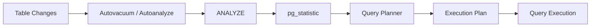
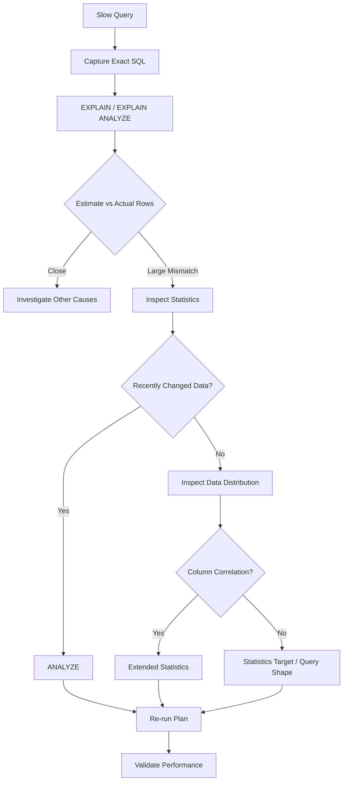

# 12- Database Statistics

## Overview

Database statistics are measurements PostgreSQL uses to understand the data distribution of tables and indexes. The query planner relies on these statistics to estimate:

- How many rows a predicate will match.
- Which values are common or rare.
- How selective a condition is.
- How correlated a column is with physical row order.
- How columns relate to each other.
- Whether an index, sequential scan, join strategy, sort, aggregation, or parallel plan is likely to be efficient.

The planner does not normally know the exact result size of every predicate before executing the query. Instead, it estimates cardinality from statistics and uses those estimates to choose a plan.

```text
Table Data
   ↓
ANALYZE
   ↓
Statistics
   ├── row estimates
   ├── most common values
   ├── histograms
   ├── null fraction
   ├── correlation
   └── extended statistics
          ↓
     Query Planner
          ↓
     Cost Estimates
          ↓
     Execution Plan
```

Incorrect or stale statistics can therefore produce incorrect cardinality estimates, which can lead to inefficient execution plans.

Database statistics are not primarily an application metric. They are planner metadata and an important operational input to query performance.

---

## Why Statistics Matter

Consider:

```sql
SELECT *
FROM orders
WHERE customer_id = 123;
```

The planner needs to estimate how many rows satisfy:

```text
customer_id = 123
```

Suppose the table contains 100 million rows.

If PostgreSQL estimates:

```text
estimated rows = 10
```

it may choose an index-driven plan.

If the actual result contains:

```text
20 million rows
```

that plan may be inappropriate.

The problem is not necessarily the index. The problem may be the planner's understanding of the data distribution.

This is why query optimization should examine:

```text
SQL
+
statistics
+
cardinality estimates
+
execution plan
+
actual execution
```

rather than treating indexes as the only performance mechanism.

---

## PostgreSQL Statistics Lifecycle

Statistics are primarily collected by `ANALYZE`.

`ANALYZE` samples table data and updates planner statistics.



Statistics become important whenever data distribution changes significantly.

Typical triggers include:

- Large bulk inserts.
- Large deletes.
- Large updates.
- Data migrations.
- Backfills.
- ETL jobs.
- Partition creation.
- Significant changes in tenant distribution.
- New columns becoming populated.

---

## Statistics vs Runtime Metrics

These concepts are related but different.

| Concept | Purpose |
|---|---|
| Database statistics | Help planner estimate data distribution |
| Query statistics | Measure query execution history |
| Infrastructure metrics | Measure CPU, memory, I/O, storage |
| Application metrics | Measure API and business behavior |
| Execution plans | Show how PostgreSQL intends to execute a query |

For example:

```text
pg_statistic
    ↓
planner estimates

pg_stat_statements
    ↓
historical query performance

EXPLAIN ANALYZE
    ↓
actual execution behavior
```

A senior troubleshooting workflow combines all three.

---

## PostgreSQL Statistics Catalogs

PostgreSQL exposes statistics through several interfaces.

Useful views and catalogs include:

| Object | Purpose |
|---|---|
| `pg_stats` | Human-readable column statistics |
| `pg_statistic` | Internal statistics catalog |
| `pg_stats_ext` | Extended statistics information |
| `pg_stats_ext_exprs` | Extended statistics for expressions |
| `pg_stat_all_tables` | Table activity and maintenance statistics |
| `pg_stat_user_tables` | User-table activity and maintenance statistics |
| `pg_stat_statements` | Query execution statistics |

For most application-level investigations, prefer `pg_stats` rather than querying `pg_statistic` directly.

---

## Inspecting Column Statistics

A useful starting point is:

```sql
SELECT
    schemaname,
    tablename,
    attname,
    null_frac,
    n_distinct,
    most_common_vals,
    most_common_freqs,
    histogram_bounds,
    correlation
FROM pg_stats
WHERE schemaname = 'public'
  AND tablename = 'orders';
```

These fields provide information about the distribution PostgreSQL has sampled.

---

## Null Fraction

`null_frac` estimates the fraction of rows containing `NULL`.

For example:

```text
null_frac = 0.40
```

means PostgreSQL estimates approximately 40% of sampled rows have a null value.

This helps the planner estimate predicates such as:

```sql
WHERE cancelled_at IS NULL
```

and:

```sql
WHERE cancelled_at IS NOT NULL
```

A changing null distribution can affect plan quality.

---

## Distinct Value Estimates

`n_distinct` describes the estimated number of distinct values.

It can be positive or negative.

A positive value represents an estimated number of distinct values.

A negative value represents a ratio relative to the table size.

For example, a value near:

```text
-1
```

indicates approximately one distinct value per row.

A value near:

```text
-0.01
```

indicates approximately 1% of rows are distinct.

This information helps PostgreSQL estimate equality and grouping operations.

---

## Most Common Values

PostgreSQL stores a sample of the most common values.

Inspect:

```sql
SELECT
    attname,
    most_common_vals,
    most_common_freqs
FROM pg_stats
WHERE tablename = 'orders'
  AND attname = 'status';
```

Suppose the distribution is:

```text
pending   → 70%
completed → 25%
failed    → 4%
cancelled → 1%
```

The planner can use that information when estimating:

```sql
WHERE status = 'pending'
```

versus:

```sql
WHERE status = 'cancelled'
```

This is important because low-cardinality columns are not necessarily uniformly distributed.

---

## Histograms

For values that are not captured as most-common values, PostgreSQL can maintain histogram boundaries.

For example:

```text
price
10
25
50
100
200
500
1000
```

The planner uses the histogram to estimate range predicates such as:

```sql
WHERE price BETWEEN 100 AND 200
```

Histograms are especially useful for ordered data such as:

```text
timestamps
prices
numeric identifiers
dates
measurements
```

---

## Correlation

`correlation` estimates the relationship between the logical ordering of a column and the physical ordering of table rows.

Values close to:

```text
1
```

or:

```text
-1
```

indicate strong correlation.

Values near:

```text
0
```

indicate weak correlation.

Correlation can influence the estimated cost of index scans because an index scan over physically well-ordered data may require less random heap access.

This is one reason the planner may choose different plans for tables with identical indexes but different physical data distributions.

---

## Statistics Target

PostgreSQL controls the amount of statistics collected using a statistics target.

The default target is controlled by:

```sql
default_statistics_target
```

Inspect it with:

```sql
SHOW default_statistics_target;
```

A column can have its own target:

```sql
ALTER TABLE orders
ALTER COLUMN status SET STATISTICS 500;
```

Then refresh:

```sql
ANALYZE orders;
```

A higher target can provide more detailed statistics but increases analysis work and metadata size.

Do not globally increase the statistics target without evidence.

---

## When to Increase Statistics Target

Increasing the statistics target can help when:

- A column has highly skewed values.
- A column has many distinct values.
- Queries frequently filter on the column.
- Estimates are consistently inaccurate.
- The column is important to join or grouping decisions.
- The default statistics sample does not represent the distribution adequately.

Example:

```text
status:
99.5% completed
0.4% pending
0.1% failed
```

Queries for `failed` may be particularly sensitive to accurate statistics.

---

## When Not to Increase It

Do not increase statistics targets simply because:

```text
"more statistics must be better."
```

Potential costs include:

- More work during `ANALYZE`.
- More statistics metadata.
- Increased maintenance overhead.
- Longer analysis operations on large tables.

Tune selectively based on query-plan evidence.

---

## Manual ANALYZE

You can explicitly refresh statistics:

```sql
ANALYZE orders;
```

For selected columns:

```sql
ANALYZE orders (customer_id, status, created_at);
```

For an entire database:

```sql
ANALYZE;
```

In production, prefer targeted operations when diagnosing or immediately recovering from a known statistics issue.

---

## Autoanalyze

PostgreSQL's autovacuum subsystem also performs automatic `ANALYZE`.

The decision is based on table activity and configuration.

Useful table-level statistics include:

```sql
SELECT
    schemaname,
    relname,
    n_live_tup,
    n_dead_tup,
    n_mod_since_analyze,
    last_analyze,
    last_autoanalyze
FROM pg_stat_user_tables
ORDER BY n_mod_since_analyze DESC;
```

This helps identify tables where substantial changes have occurred since the last analysis.

---

## Autoanalyze Thresholds

Autoanalyze is influenced by configuration such as:

```text
autovacuum_analyze_threshold
+
autovacuum_analyze_scale_factor
```

Conceptually, PostgreSQL triggers analysis after enough changes relative to the table.

For very large tables, a percentage-based threshold can become too large.

Example:

```text
500 million rows
×
10% scale factor
=
50 million changes
```

Waiting for that many changes before analyzing may be inappropriate for a highly volatile table.

---

## Per-Table Autovacuum Configuration

High-value tables can receive customized settings.

For example:

```sql
ALTER TABLE orders
SET (
    autovacuum_analyze_scale_factor = 0.02,
    autovacuum_analyze_threshold = 10000
);
```

The correct values depend on:

```text
table size
+
write rate
+
query sensitivity
+
data distribution
+
maintenance capacity
```

Avoid copying the same settings across every table.

---

## Large Tables and Statistics

Statistics collection uses sampling rather than reading every row in the normal case.

Therefore:

```text
table size
+
statistics target
+
data distribution
```

affect how representative the statistics are.

Large tables can have millions of rows but still require careful statistics configuration when distributions are highly skewed.

---

## Cardinality Estimation

Cardinality is the estimated number of rows produced by an operation.

Consider:

```sql
SELECT *
FROM orders
WHERE customer_id = 123;
```

An execution plan may show:

```text
Index Scan
  estimated rows = 15
  actual rows = 150000
```

This is a major estimation error.

The optimizer may consequently make poor decisions about:

```text
join order
+
join algorithm
+
index usage
+
sort strategy
+
parallelism
+
aggregation
```

Cardinality estimation is one of the most important concepts in SQL performance troubleshooting.

---

## Estimated vs Actual Rows

Use:

```sql
EXPLAIN (ANALYZE, BUFFERS)
SELECT *
FROM orders
WHERE customer_id = 123;
```

You may see:

```text
Index Scan using orders_customer_id_idx on orders
  (cost=0.43..50.00 rows=15 width=120)
  (actual time=0.100..500.000 rows=150000 loops=1)
```

The important comparison is:

```text
estimated rows = 15
actual rows    = 150000
```

This is not merely a performance measurement. It is evidence that the planner's model of the data may be inaccurate.

---

## Causes of Cardinality Estimation Errors

Common causes include:

- Stale statistics.
- Data skew.
- Correlated columns.
- Insufficient statistics target.
- Expressions without useful statistics.
- Type conversions.
- Complex predicates.
- Partition-specific distributions.
- Parameter-sensitive workloads.
- Inaccurate assumptions about independent columns.

Not every estimate mismatch means statistics are stale.

---

## Column Independence Assumption

Suppose a table contains:

```text
country
region
```

and the application ensures:

```text
US → North America
India → Asia
Germany → Europe
```

These columns are strongly correlated.

A query:

```sql
WHERE country = 'India'
  AND region = 'Asia'
```

cannot always be estimated accurately by simply multiplying independent selectivities.

This is where extended statistics become valuable.

---

## Extended Statistics

PostgreSQL supports extended statistics for relationships between columns.

Create them with:

```sql
CREATE STATISTICS orders_country_region_stats
    (dependencies, mcv, ndistinct)
ON country, region
FROM orders;
```

Then refresh:

```sql
ANALYZE orders;
```

Extended statistics can help the planner understand relationships that individual column statistics cannot represent.

---

## Types of Extended Statistics

Important types include:

| Type | Helps With |
|---|---|
| `dependencies` | Functional or near-functional relationships |
| `ndistinct` | Distinct-value relationships across columns |
| `mcv` | Common combinations of column values |

The appropriate type depends on the query patterns and data distribution.

---

## Functional Dependencies

Suppose:

```text
country → currency
```

The application may have one currency associated with each country.

Individual column statistics do not fully express that relationship.

Dependencies statistics can help the planner estimate predicates involving both columns.

Use them when the relationship is meaningful to query planning.

---

## Multivariate Most Common Values

For correlated columns, `mcv` statistics can capture common combinations.

Example:

```text
tenant_id
status
```

A multi-tenant application may have:

```text
tenant A → 99% completed
tenant B → 40% completed
```

Global statistics for `status` may not adequately represent each combination.

Extended MCV statistics can improve estimates for predicates involving both columns.

---

## Distinct Combinations

`ndistinct` extended statistics help estimate the number of distinct combinations across multiple columns.

Example:

```sql
CREATE STATISTICS user_country_city_stats
    (ndistinct)
ON country, city
FROM users;
```

This can improve estimates for grouping or distinct-count operations involving both columns.

---

## Inspect Extended Statistics

Use:

```sql
SELECT
    schemaname,
    statistics_name,
    attnames,
    kinds
FROM pg_stats_ext;
```

This shows configured extended statistics.

For deeper inspection, PostgreSQL also exposes additional catalog information through `pg_statistic_ext` and related catalogs.

---

## Statistics on Expressions

Queries frequently filter on expressions:

```sql
WHERE lower(email) = 'user@example.com'
```

or:

```sql
WHERE date(created_at) = DATE '2026-09-04'
```

Normal column statistics may not fully describe the expression's resulting distribution.

Modern PostgreSQL versions provide mechanisms for expression statistics in extended statistics definitions.

However, an expression index may also be required when the access path itself needs to be indexed.

These are different concerns:

```text
statistics → estimate selectivity
index       → provide an access path
```

---

## Statistics and Index Selection

Statistics influence whether PostgreSQL considers an index worthwhile.

For example:

```sql
WHERE status = 'completed'
```

If:

```text
completed = 99.9% of rows
```

an index may provide little benefit.

If:

```text
failed = 0.01% of rows
```

an index may be highly valuable.

The planner uses statistics to estimate this selectivity.

Therefore:

> An existing index does not guarantee an index scan.

---

## Statistics and Sequential Scans

A sequential scan is not automatically evidence of missing statistics.

The planner may correctly choose:

```text
Seq Scan
```

when a large percentage of the table is required.

For example:

```text
table = 1 billion rows
query returns = 700 million rows
```

An index scan may require excessive random heap access.

Statistics help PostgreSQL make this decision.

---

## Statistics and Join Planning

Statistics strongly influence join strategies.

Possible algorithms include:

```text
Nested Loop
Hash Join
Merge Join
```

Suppose PostgreSQL estimates:

```text
outer rows = 10
```

and chooses a nested loop.

If the actual value is:

```text
outer rows = 10 million
```

the plan may become extremely expensive.

This is why large cardinality estimation errors often appear as join-performance problems.

---

## Statistics and Sorts

Statistics can influence the expected number of rows flowing into a sort.

For example:

```sql
SELECT *
FROM orders
WHERE customer_id = 123
ORDER BY created_at DESC;
```

If PostgreSQL estimates very few rows, it may select one strategy.

If millions of rows actually qualify, sorting or scanning behavior can become substantially more expensive.

---

## Statistics and Parallelism

Planner estimates also influence whether parallel execution is worthwhile.

If PostgreSQL estimates:

```text
10 rows
```

parallel execution may not make sense.

If the actual result contains:

```text
100 million rows
```

the chosen plan may underutilize available CPU.

Statistics therefore influence both:

```text
single-query performance
+
resource utilization
```

---

## Statistics and Partitioning

Partitioned tables require special attention.

```text
events
 ├── events_2026_07
 ├── events_2026_08
 └── events_2026_09
```

Data distribution can differ dramatically between partitions.

For example:

```text
July = 10 million rows
August = 100 million rows
September = 2 million rows
```

Planner estimates need to reflect the relevant partition data.

After large partition loads, ensure statistics are appropriately refreshed.

---

## Statistics and Partition Pruning

Partition pruning determines which partitions need to be scanned.

Statistics are not the primary mechanism for deciding whether a partition can be eliminated; partition bounds and query predicates drive pruning.

Statistics then help estimate the amount of data within the partitions that remain candidates.

This distinction matters:

```text
Partition bounds
    ↓
Partition pruning

Statistics
    ↓
Cardinality / cost estimation
```

---

## Statistics and Multi-Tenant Systems

Multi-tenant systems frequently create skew.

Example:

```text
Tenant A → 500 million rows
Tenant B → 20 million rows
Tenant C → 5,000 rows
```

A global statistic for:

```sql
WHERE tenant_id = ?
```

cannot perfectly represent every tenant.

This can create plan differences between:

```text
small tenant
+
large tenant
```

Especially important patterns include:

- Tenant-specific skew.
- Composite tenant indexes.
- RLS predicates.
- Tenant-specific query plans.
- Large-tenant migrations.
- Partitioning or sharding.

---

## Statistics and RLS

Row-level security can add predicates to queries.

For example:

```text
application query
      +
RLS policy
      ↓
effective query conditions
```

Planner estimates therefore need to account for the effective filtering conditions.

When investigating a plan involving RLS, inspect the actual execution plan and workload rather than reasoning only from the application's visible SQL.

Security policies should never be disabled merely to improve plan quality.

---

## Statistics and Prepared Statements

Prepared statements can interact with planning behavior.

PostgreSQL may use:

```text
custom plans
```

or:

```text
generic plans
```

depending on the execution context.

This matters when parameter values have very different selectivity.

Example:

```text
tenant_id = small_tenant
tenant_id = huge_tenant
```

A single generic plan may be suboptimal for one of them.

Statistics still provide important distribution information, but prepared-plan behavior can affect how that information is used.

---

## Statistics and ORMs

Django and SQLAlchemy do not replace PostgreSQL's planner.

The flow remains:

```text
Django ORM
    ↓
SQL
    ↓
PostgreSQL parser
    ↓
Planner
    ↓
Statistics
    ↓
Execution plan
```

If an ORM query is slow:

1. Inspect generated SQL.
2. Run `EXPLAIN`.
3. Compare estimates with actual rows.
4. Inspect statistics.
5. Investigate indexes and query shape.

ORM abstraction does not eliminate database internals.

---

## Statistics and Query Monitoring

Statistics should be correlated with query history.

A useful production stack is:

```text
pg_stat_statements
        ↓
Identify expensive query
        ↓
EXPLAIN (ANALYZE, BUFFERS)
        ↓
Compare estimated vs actual rows
        ↓
Inspect pg_stats
        ↓
Inspect indexes / joins / predicates
        ↓
Correct root cause
```

This is more reliable than changing indexes based solely on slow-query symptoms.

---

## Query Statistics

If `pg_stat_statements` is enabled, inspect query workload using:

```sql
SELECT
    queryid,
    calls,
    total_exec_time,
    mean_exec_time,
    rows,
    query
FROM pg_stat_statements
ORDER BY total_exec_time DESC
LIMIT 20;
```

Use it to identify:

```text
high total cost
+
high average latency
+
high execution frequency
+
high row production
```

Statistics catalogs and query statistics answer different questions.

---

## Statistics Reset and Historical Interpretation

Statistics views can be reset or change after maintenance, restart, extension operations, or administrative actions.

Do not conclude:

```text
"idx_scan is low, therefore the index is useless."
```

without considering:

```text
observation period
+
statistics reset
+
traffic seasonality
+
recent deployment
+
query frequency
```

The same principle applies to query statistics.

---

## Statistics After Bulk Loads

A bulk load can drastically change data distribution.

Example:

```text
Existing table:
100 million rows

Bulk import:
200 million rows
```

The planner's previous statistics may no longer represent the current data.

After significant controlled bulk loading:

```sql
ANALYZE orders;
```

may be appropriate.

For large ingestion pipelines, coordinate statistics maintenance with the ingestion strategy.

---

## Statistics After Backfills

Backfills can change distributions without changing the table's row count substantially.

Example:

```text
is_active = false
```

for most rows initially.

A migration changes millions of rows to:

```text
is_active = true
```

The data distribution has changed even though:

```text
row count ≈ unchanged
```

Statistics should be refreshed after substantial data-distribution changes.

---

## Statistics After Schema Changes

Adding a column does not automatically make it useful to the planner.

Consider:

```sql
ALTER TABLE orders
ADD COLUMN risk_level text;
```

After populating it:

```text
low    → 95%
medium → 4%
high   → 1%
```

queries filtering on `risk_level` may benefit from fresh statistics.

Schema deployment and data migration should therefore be considered together.

---

## Statistics and Vacuum

`VACUUM` and `ANALYZE` serve different purposes.

| Operation | Primary Purpose |
|---|---|
| `VACUUM` | Reclaim/reuse dead-row space and support MVCC cleanup |
| `ANALYZE` | Collect planner statistics |

Autovacuum normally coordinates both maintenance activities, but they are conceptually distinct.

A table can have:

```text
healthy vacuum
+
stale statistics
```

or:

```text
fresh statistics
+
vacuum/bloat problems
```

Do not treat them as interchangeable.

---

## Statistics and Autovacuum Configuration

High-write tables often need more aggressive maintenance than static tables.

Review:

```text
autovacuum_analyze_threshold
autovacuum_analyze_scale_factor
autovacuum_vacuum_threshold
autovacuum_vacuum_scale_factor
```

Do not optimize these independently.

The correct configuration balances:

```text
query-plan freshness
+
vacuum workload
+
I/O
+
table size
+
write rate
```

---

## Detecting Statistics Problems

A strong signal is a large and persistent mismatch:

```text
estimated rows ≪ actual rows
```

or:

```text
estimated rows ≫ actual rows
```

For example:

```text
estimated = 100
actual    = 10,000,000
```

Potential investigation:

```text
1. Is the query representative?
2. When was ANALYZE last run?
3. How many rows changed?
4. Is the column highly skewed?
5. Are multiple columns correlated?
6. Is the statistics target sufficient?
7. Would extended statistics help?
8. Is the problem actually caused by joins or query structure?
```

---

## A Practical Statistics Investigation

### Inspect the Table

```sql
SELECT
    schemaname,
    relname,
    n_live_tup,
    n_dead_tup,
    n_mod_since_analyze,
    last_analyze,
    last_autoanalyze
FROM pg_stat_user_tables
WHERE relname = 'orders';
```

### Inspect Column Statistics

```sql
SELECT
    attname,
    null_frac,
    n_distinct,
    most_common_vals,
    most_common_freqs,
    histogram_bounds,
    correlation
FROM pg_stats
WHERE tablename = 'orders';
```

### Inspect the Query Plan

```sql
EXPLAIN (ANALYZE, BUFFERS)
SELECT *
FROM orders
WHERE customer_id = 123
  AND status = 'completed';
```

### Inspect Extended Statistics

```sql
SELECT
    schemaname,
    statistics_name,
    attnames,
    kinds
FROM pg_stats_ext
WHERE tablename = 'orders';
```

---

## Production Diagnostic Workflow

Use this sequence when suspecting statistics problems:



---

## Do Not Run ANALYZE Blindly

`ANALYZE` is generally a lightweight and useful maintenance operation, but it should not become a substitute for understanding the workload.

If estimates remain inaccurate after:

```sql
ANALYZE;
```

investigate:

```text
data skew
+
correlation
+
statistics target
+
extended statistics
+
expressions
+
query structure
```

Refreshing statistics cannot fix every cardinality estimation problem.

---

## Statistics Target Tuning Example

Suppose:

```sql
SELECT *
FROM orders
WHERE status = 'failed';
```

has an inaccurate estimate.

First inspect:

```sql
SELECT
    attname,
    most_common_vals,
    most_common_freqs
FROM pg_stats
WHERE tablename = 'orders'
  AND attname = 'status';
```

If the distribution is complex and the default target is insufficient, consider:

```sql
ALTER TABLE orders
ALTER COLUMN status SET STATISTICS 500;

ANALYZE orders (status);
```

Then validate the plan again.

The objective is not to maximize the target. The objective is to produce sufficiently accurate planner information at acceptable maintenance cost.

---

## Extended Statistics Example

Suppose:

```sql
SELECT *
FROM orders
WHERE country = 'IN'
  AND currency = 'INR';
```

and the two columns are highly correlated.

Create:

```sql
CREATE STATISTICS orders_country_currency_stats
    (dependencies, mcv)
ON country, currency
FROM orders;
```

Then:

```sql
ANALYZE orders;
```

Validate with:

```sql
EXPLAIN (ANALYZE, BUFFERS)
SELECT *
FROM orders
WHERE country = 'IN'
  AND currency = 'INR';
```

Compare:

```text
estimated rows
vs
actual rows
```

before and after the change.

---

## Statistics and Data Skew

Uniform distributions are easy to estimate.

Real production data often looks like:

```text
Tenant A       60%
Tenant B       20%
Tenant C       10%
Other tenants  10%
```

or:

```text
active      98%
inactive     2%
```

or:

```text
current year      80%
previous years    20%
```

The more skewed the data, the more important accurate statistics become for planner decisions.

---

## Statistics and Time-Series Data

Time-series systems can change distribution rapidly.

Example:

```text
created_at
```

may be heavily concentrated in recent dates.

A query such as:

```sql
WHERE created_at >= now() - interval '1 hour'
```

may have a very different selectivity from:

```sql
WHERE created_at >= now() - interval '1 year'
```

Regular statistics maintenance becomes especially important on high-ingestion tables.

Partitioning may also help operationally, but partitioning and statistics solve different problems.

---

## Statistics and Indexes Are Complementary

Think of them as:

```text
Statistics
    ↓
"What will this predicate probably return?"

Index
    ↓
"How can I retrieve those rows efficiently?"
```

The planner combines both.

A missing index can cause a poor plan even with excellent statistics.

Incorrect statistics can cause a poor plan even with an excellent index.

A bad query shape can cause problems even when both are correct.

---

## Statistics and Query Rewriting

Sometimes the best solution is to change the query rather than statistics.

Examples:

```text
non-sargable predicate
+
unnecessary function
+
bad join condition
+
unnecessary rows
+
incorrect filtering
```

Do not tune planner metadata to compensate for fundamentally inefficient SQL.

---

## Statistics and `SELECT *`

Large result sets can remain expensive even with perfect estimates.

For example:

```sql
SELECT *
FROM orders
WHERE customer_id = 123;
```

If the application only needs:

```text
id
status
created_at
```

use:

```sql
SELECT id, status, created_at
FROM orders
WHERE customer_id = 123;
```

Statistics can improve plan selection, but they do not eliminate unnecessary data transfer.

---

## Statistics and Lock Problems

Not every slow query is a planner problem.

A query can have an excellent plan and still be slow because it is waiting for a lock.

Use:

```sql
SELECT
    pid,
    wait_event_type,
    wait_event,
    state,
    query
FROM pg_stat_activity
WHERE state <> 'idle';
```

If the query is waiting on a lock:

```text
statistics
≠
root cause
```

Always distinguish execution time from waiting time.

---

## Statistics and Connection Pools

Connection pool exhaustion can make a query appear slow from the application's perspective.

The actual sequence may be:

```text
request
 ↓
wait for connection
 ↓
execute SQL quickly
 ↓
return response
```

Database execution statistics will not necessarily represent the entire application latency.

Correlate:

```text
pool wait
+
query execution
+
lock wait
+
network latency
```

---

## Statistics and Read Replicas

Read replicas may have different workloads and data freshness characteristics.

A query plan can differ due to:

```text
data distribution
+
statistics freshness
+
index availability
+
server configuration
```

Replica troubleshooting should therefore inspect the actual replica environment.

Do not assume:

```text
primary plan = replica plan
```

---

## Statistics and High CPU

Bad cardinality estimates can produce expensive plans that increase CPU usage.

For example:

```text
incorrect estimate
    ↓
bad join strategy
    ↓
large nested-loop workload
    ↓
CPU saturation
```

During high CPU incidents, inspect:

```text
pg_stat_statements
+
EXPLAIN
+
estimated vs actual rows
+
wait events
+
query frequency
```

Statistics may be a contributing cause rather than the entire problem.

---

## Monitoring Statistics Freshness

A useful operational dashboard can include:

```text
n_mod_since_analyze
last_autoanalyze
n_live_tup
n_dead_tup
```

For critical tables, alerting should be based on workload and query sensitivity rather than a universal timestamp threshold.

For example:

```text
high write rate
+
high query sensitivity
+
large n_mod_since_analyze
```

is more actionable than:

```text
"ANALYZE has not run in 6 hours."
```

---

## Statistics Maintenance Checklist

For important production tables, review:

- `last_autoanalyze`.
- `n_mod_since_analyze`.
- Table size.
- Write rate.
- Data skew.
- Query-plan accuracy.
- Statistics target.
- Extended statistics.
- Partition-specific behavior.
- Bulk-load behavior.
- Backfill behavior.
- Autovacuum configuration.

---

## Security Considerations

Statistics can reveal information about the database structure and data distribution.

For example:

```text
table names
+
column names
+
value frequencies
+
row counts
```

may reveal business activity.

Protect administrative views and monitoring systems using least privilege.

Do not expose unrestricted PostgreSQL statistics access to application roles merely because monitoring is required.

Use dedicated observability roles and expose only the required metrics.

---

## Scalability Considerations

As databases grow:

```text
table size ↑
+
write rate ↑
+
query volume ↑
+
data skew ↑
```

statistics become increasingly important.

Large systems should avoid relying exclusively on manual analysis.

Use:

```text
autovacuum / autoanalyze
+
targeted statistics configuration
+
query monitoring
+
plan analysis
+
capacity planning
```

High-value tables may require table-specific maintenance policies.

---

## Reliability Considerations

Poor statistics can create plan instability.

For example:

```text
Data distribution changes
        ↓
Statistics change
        ↓
Planner chooses different plan
        ↓
Query latency changes
```

A plan change is not automatically bad.

The important question is whether:

```text
new plan
+
current workload
```

is better or worse.

Production systems should monitor query latency and plan behavior rather than assuming a particular plan must remain forever.

---

## Deployment Considerations

Coordinate statistics with:

```text
schema migrations
+
data migrations
+
backfills
+
index creation
+
bulk imports
```

A deployment can complete successfully while the database remains temporarily under-informed about the new data distribution.

For major data changes:

```text
deploy
 ↓
populate
 ↓
ANALYZE where appropriate
 ↓
validate plans
 ↓
observe production workload
```

Do not place an expensive full-database `ANALYZE` blindly into every application deployment.

---

## CI/CD and Query Regression Testing

Performance-sensitive queries can be tested in CI or staging using:

```sql
EXPLAIN
```

and controlled datasets.

For critical workloads, compare:

```text
estimated rows
+
execution plan
+
execution time
```

across releases.

Be careful with exact-plan assertions because plans can legitimately change with:

```text
PostgreSQL version
+
statistics
+
data volume
+
configuration
+
hardware
```

Prefer performance budgets and meaningful plan characteristics over brittle textual plan snapshots.

---

## Common Mistakes

### Assuming Stale Statistics Are the Cause of Every Bad Plan

A bad plan can result from:

```text
query structure
+
missing index
+
wrong index
+
lock waits
+
parameter-sensitive planning
+
resource saturation
```

### Running `ANALYZE` and Stopping

If the estimate remains wrong, investigate why.

### Increasing Statistics Targets Globally

This increases maintenance work without necessarily improving important queries.

### Ignoring Data Correlation

Independent-column assumptions can produce poor estimates when columns are strongly related.

### Treating Statistics as Indexes

Statistics describe data distribution; they do not provide a retrieval mechanism.

### Assuming Sequential Scans Are Bad

A sequential scan can be the correct plan for large result sets.

### Ignoring Bulk Loads

Large data changes can invalidate assumptions behind existing statistics.

### Ignoring Partition Behavior

Partitioned workloads can have dramatically different data distributions.

### Using Only `pg_stats`

`pg_stats` is useful but does not replace:

```text
EXPLAIN
+
pg_stat_user_tables
+
pg_stat_statements
+
extended statistics
```

### Comparing Estimated Rows Without Actual Rows

The estimate becomes much more useful when compared with execution evidence.

### Tuning Statistics Without Measuring

Statistics targets and extended statistics should be justified by plan-quality evidence.

---

## Interview Traps

### "Does PostgreSQL Know Exactly How Many Rows a Query Will Return?"

Usually no.

The planner generally uses statistics and estimation rather than executing the query first.

### "Does `ANALYZE` Rebuild Indexes?"

No.

`ANALYZE` collects planner statistics.

### "Does `VACUUM` Update Statistics?"

`VACUUM` and `ANALYZE` have different primary responsibilities. Autovacuum can perform both as part of automatic maintenance.

### "Why Did PostgreSQL Ignore My Index?"

Possible reasons include:

```text
low selectivity
+
large result set
+
cost estimates
+
data distribution
+
statistics
+
query shape
```

### "Why Is the Estimate Wrong?"

Possible causes include:

```text
stale statistics
+
skew
+
correlated columns
+
insufficient statistics target
+
missing extended statistics
+
complex predicates
```

### "Are More Statistics Always Better?"

No.

More detailed statistics have maintenance and planning costs and should be targeted where useful.

---

## Production Decision Framework

When a query has a poor execution plan:

```text
1. Capture exact SQL and parameters.
2. Inspect EXPLAIN.
3. Compare estimated and actual rows.
4. Check whether the problem is execution or waiting.
5. Inspect statistics freshness.
6. Inspect data distribution.
7. Check relevant indexes.
8. Check column correlation.
9. Consider extended statistics.
10. Re-run ANALYZE where justified.
11. Validate the new plan.
12. Measure production impact.
```

The important principle is:

```text
Evidence
  ↓
Diagnosis
  ↓
Targeted change
  ↓
Validation
```

not:

```text
Slow query
  ↓
Add index
  ↓
Hope
```

---

## Senior-Level Mental Model

At senior level, database statistics should be viewed as part of the planner's information system.

```text
                Data
                 ↓
        ┌─────────────────┐
        │   Statistics    │
        ├─────────────────┤
        │ MCV             │
        │ Histograms      │
        │ Null fraction   │
        │ Distinct values │
        │ Correlation     │
        │ Extended stats  │
        └────────┬────────┘
                 ↓
          Query Optimizer
                 ↓
       Cardinality Estimates
                 ↓
          Cost Estimation
                 ↓
            Plan Choice
                 ↓
             Execution
```

When plan quality is poor, ask:

```text
Does the optimizer have the right information?
```

If not, improve the information.

If the information is correct, investigate:

```text
query structure
+
indexes
+
configuration
+
concurrency
+
I/O
+
memory
+
workload shape
```

---

## Production Review Questions

For a critical database, ask:

- Are statistics being refreshed automatically?
- Which high-value tables have high `n_mod_since_analyze`?
- Which queries show large estimated-vs-actual row differences?
- Are important columns highly skewed?
- Are correlated predicates producing poor estimates?
- Are extended statistics used where they provide measurable value?
- Are statistics targets intentionally configured?
- Are bulk loads and backfills followed by appropriate analysis?
- Are partitioned tables receiving appropriate statistics maintenance?
- Are plan regressions correlated with statistics changes?
- Are slow queries actually suffering from planning errors rather than locks or connection waits?
- Is statistics monitoring integrated with query-performance monitoring?

---

## Practical Production Heuristic

Use the following mental model:

```text
Fresh statistics
      +
Accurate data distribution
      +
Correct cardinality estimates
      +
Appropriate indexes
      +
Good query shape
      +
Healthy resources
      =
Predictable query performance
```

Statistics are necessary but not sufficient.

A production database needs the entire system to remain healthy.

## Key Takeaways

- **Database statistics provide the planner with a model of data distribution:** PostgreSQL uses them for selectivity, cardinality, cost estimation, and execution-plan selection.
- **Estimated-vs-actual row differences are critical evidence:** large persistent mismatches can indicate stale statistics, skew, column correlation, insufficient statistics targets, or other estimation limitations.
- **Use targeted statistics tuning:** `ANALYZE`, per-column statistics targets, and extended statistics should be driven by measured plan-quality problems rather than applied globally.
- **Statistics are only one part of query performance:** always correlate them with SQL shape, indexes, joins, locks, connection pools, memory, I/O, replicas, and workload behavior.
- **Treat statistics as production infrastructure:** automatic maintenance, monitoring, post-migration validation, and plan-regression analysis become increasingly important as database size and workload complexity grow.