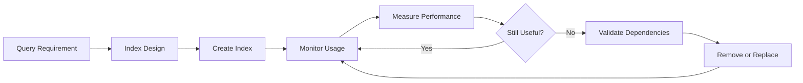
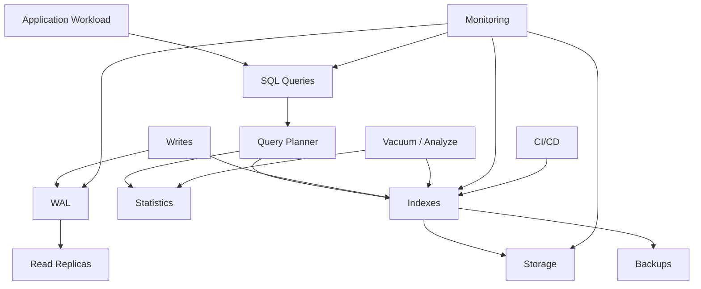

# 13- Index Maintenance

## Overview

Index maintenance is the operational discipline of keeping database indexes correct, useful, reasonably sized, and aligned with the workload.

In PostgreSQL, indexes improve read performance by providing alternative access paths to table data. They also introduce ongoing costs:

- Additional storage.
- Additional WAL generation.
- Extra work during `INSERT`, `UPDATE`, and `DELETE`.
- Cache and memory pressure.
- Replication traffic.
- Backup and restore overhead.
- Maintenance and rebuild requirements.

A production index strategy therefore goes beyond:

```text
"Add an index when a query is slow."
```

It must continuously answer:

```text
Which indexes are useful?
Which are redundant?
Which are growing?
Which are bloated?
Which are expensive to maintain?
Which queries depend on them?
Can they be changed safely?
```

Index maintenance is closely connected to query planning, statistics, vacuum, table growth, replication, deployments, and capacity planning.

---

## Why Index Maintenance Matters

An index can improve:

```text
SELECT
JOIN
ORDER BY
GROUP BY
UNIQUE enforcement
foreign-key-related operations
```

but every additional index increases write cost.

For a table with:

```text
10 indexes
```

an insert may need to maintain multiple index structures in addition to the heap table.

As a result:

```text
More indexes
    ↓
Faster selected reads
    +
More write work
    +
More storage
    +
More WAL
    +
More replication traffic
```

The goal is not to minimize the number of indexes.

The goal is to maintain the **smallest useful set of indexes that supports the production workload**.

---

## Index Lifecycle

A production index typically follows this lifecycle:



Maintenance therefore includes both:

- **Physical maintenance** — managing index size, bloat, storage, and rebuilds.
- **Logical maintenance** — ensuring indexes still match application access patterns.

---

## PostgreSQL Index Architecture

For a normal PostgreSQL table:

```text
Table
 ├── Heap pages
 │    └── Table rows
 │
 └── Index
      ├── Root
      ├── Internal pages
      └── Leaf pages
```

The index stores keys and references to table rows.

For a B-tree index:

```text
             Root
              |
        Internal Pages
          /       \
     Leaf Pages  Leaf Pages
        |             |
   key → TID      key → TID
```

The exact structure depends on the index access method.

Common PostgreSQL index types include:

| Index | Typical Use |
|---|---|
| B-tree | Equality, ranges, ordering |
| GIN | Arrays, JSONB, full-text-like inverted indexes |
| GiST | Geometric/range and extensible search structures |
| BRIN | Very large tables with naturally correlated physical order |
| Hash | Equality lookups in specialized cases |

Maintenance requirements and operational behavior vary by index type.

---

## Index Maintenance vs Index Rebuilding

These terms should not be treated as interchangeable.

| Operation | Purpose |
|---|---|
| `VACUUM` | Removes/reclaims dead tuples and supports index cleanup |
| `ANALYZE` | Refreshes planner statistics |
| `REINDEX` | Rebuilds an index |
| `CREATE INDEX` | Creates a new index |
| `DROP INDEX` | Removes an index |
| `CREATE INDEX CONCURRENTLY` | Creates an index while minimizing blocking of normal writes |
| `REINDEX CONCURRENTLY` | Rebuilds an index with reduced blocking of normal writes |

Most indexes should **not** be routinely rebuilt on a fixed schedule.

Maintenance should be evidence-driven.

---

## Index Usage Monitoring

PostgreSQL exposes index usage statistics through `pg_stat_user_indexes`.

```sql
SELECT
    schemaname,
    relname AS table_name,
    indexrelname AS index_name,
    idx_scan,
    idx_tup_read,
    idx_tup_fetch
FROM pg_stat_user_indexes
ORDER BY idx_scan ASC;
```

These metrics help answer:

```text
How often is this index being scanned?
How many index entries are being read?
How many heap tuples are fetched?
```

However, usage statistics must be interpreted over a meaningful observation period.

A low `idx_scan` value does not automatically mean an index is useless.

---

## Index Usage Metrics

### `idx_scan`

Number of index scans initiated using the index.

Useful for identifying:

```text
frequently used indexes
+
apparently unused indexes
```

### `idx_tup_read`

Number of index entries returned by index scans.

### `idx_tup_fetch`

Number of live table rows fetched by index scans.

The relationship between these values can provide clues about how selective and useful an index is, but they should not be treated as a standalone performance diagnosis.

---

## Index and Table Statistics

Combine index statistics with table statistics.

```sql
SELECT
    s.relname AS table_name,
    s.indexrelname AS index_name,
    s.idx_scan,
    t.n_live_tup,
    t.n_dead_tup,
    t.last_vacuum,
    t.last_autovacuum,
    t.last_analyze,
    t.last_autoanalyze
FROM pg_stat_user_indexes s
JOIN pg_stat_user_tables t
    ON t.relid = s.relid
ORDER BY s.idx_scan ASC;
```

This provides more context.

For example:

```text
low index usage
+
large table
+
high write volume
```

may justify investigation.

But:

```text
low index usage
+
unique constraint
```

does not imply that the index can safely be removed.

---

## Do Not Drop an Index Based Only on `idx_scan`

An index can have low scan activity because:

- The workload is seasonal.
- Statistics were recently reset.
- The application has recently changed.
- Traffic is currently low.
- The index supports a rare but critical query.
- The index enforces uniqueness.
- The index supports a primary key.
- The index is used indirectly by important operations.
- The observation window is too short.

Before removing an index, inspect:

```text
constraints
+
application queries
+
query statistics
+
execution plans
+
deployment history
+
observation period
```

---

## Detecting Duplicate Indexes

Redundant indexes increase write cost without providing meaningful additional read capability.

For example:

```sql
CREATE INDEX orders_customer_id_idx
ON orders (customer_id);

CREATE INDEX orders_customer_id_created_idx
ON orders (customer_id, created_at);
```

The second index may support queries using `customer_id` because of the B-tree prefix, although the complete workload must be evaluated before deciding whether the first index is redundant.

Do not assume every prefix index is removable.

Consider:

```text
query patterns
+
index size
+
ordering requirements
+
partial predicates
+
covering columns
+
write cost
```

---

## Composite Index Maintenance

Composite indexes must be evaluated as complete access paths.

Example:

```sql
CREATE INDEX orders_customer_status_created_idx
ON orders (customer_id, status, created_at DESC);
```

This may support:

```sql
WHERE customer_id = ?
  AND status = ?
ORDER BY created_at DESC;
```

But changing column order can significantly alter usefulness.

Index maintenance should therefore include periodic review of whether composite indexes still match actual query patterns.

---

## Index Column Order

For B-tree indexes, column order matters.

Consider:

```sql
CREATE INDEX users_country_status_idx
ON users (country, status);
```

This is particularly useful for queries beginning with:

```sql
WHERE country = ?
```

The same index is not equivalent to:

```sql
CREATE INDEX users_status_country_idx
ON users (status, country);
```

When reviewing indexes, inspect:

```text
equality predicates
+
range predicates
+
ordering
+
grouping
+
query frequency
```

rather than simply counting indexed columns.

---

## Partial Index Maintenance

Partial indexes cover only rows satisfying a predicate.

Example:

```sql
CREATE INDEX orders_pending_idx
ON orders (created_at)
WHERE status = 'pending';
```

This can be substantially smaller than indexing the entire table.

Monitor:

```text
index size
+
usage
+
predicate selectivity
+
application query patterns
```

A partial index can become less valuable if the predicate's selectivity changes significantly.

---

## Expression Indexes

Expression indexes support queries such as:

```sql
CREATE INDEX users_lower_email_idx
ON users (lower(email));
```

They are useful when the application consistently queries the expression:

```sql
WHERE lower(email) = $1
```

Maintenance should verify that the application still uses the same expression.

A query rewrite can make an expression index obsolete even though the index itself remains healthy.

---

## Covering Indexes and `INCLUDE`

PostgreSQL supports non-key payload columns using `INCLUDE`.

```sql
CREATE INDEX orders_customer_created_idx
ON orders (customer_id, created_at DESC)
INCLUDE (status, total_amount);
```

This can help index-only scans when PostgreSQL can satisfy the query from the index and visibility information permits it.

However:

```text
INCLUDE columns
```

still increase index size and write cost.

Do not add payload columns indiscriminately.

---

## Index Size Monitoring

Monitor index size explicitly.

```sql
SELECT
    schemaname,
    relname AS table_name,
    indexrelname AS index_name,
    pg_size_pretty(pg_relation_size(indexrelid)) AS index_size
FROM pg_stat_user_indexes
ORDER BY pg_relation_size(indexrelid) DESC;
```

Large indexes matter because they affect:

- Disk capacity.
- Cache efficiency.
- Backups.
- Replication.
- Maintenance time.
- Index creation time.
- Restore time.

---

## Finding the Largest Indexes

```sql
SELECT
    schemaname,
    relname AS table_name,
    indexrelname AS index_name,
    pg_size_pretty(pg_relation_size(indexrelid)) AS index_size
FROM pg_stat_user_indexes
ORDER BY pg_relation_size(indexrelid) DESC
LIMIT 20;
```

This is useful during:

- Storage incidents.
- Database capacity reviews.
- Index cleanup projects.
- Migration planning.
- Performance investigations.

---

## Index Growth

An index can grow as the table grows.

For example:

```text
orders
10 million rows
    ↓
100 million rows
    ↓
1 billion rows
```

An index designed when the table contained 10 million rows may eventually become:

```text
large
+
expensive to maintain
+
expensive to cache
```

The query may still be valid, but the economics of the index may have changed.

---

## Index Bloat

Index bloat refers to inefficient use of index pages caused by changes to index contents and page structure over time.

PostgreSQL's MVCC model means updates and deletes create dead tuples that must eventually be cleaned up.

Vacuum and index cleanup help maintain indexes, but indexes can still accumulate inefficient space usage depending on workload.

Bloat should be measured rather than assumed.

---

## Why Bloat Matters

Excessive index bloat can increase:

```text
index size
+
I/O
+
cache pressure
+
backup size
+
replication volume
+
scan cost
```

For large indexes, even a modest percentage of wasted space can represent substantial storage.

---

## Bloat Is Not the Same as "Unused Space"

Do not assume:

```text
index has free space
=
index is bloated
```

Indexes intentionally contain free space for future modifications.

A healthy index can have unused page space.

Use evidence and appropriate inspection tools before rebuilding.

---

## Measuring Index Bloat

There is no single built-in PostgreSQL view that directly provides a perfect universal "bloat percentage" for every index type and workload.

Operational approaches include:

- Catalog-based estimation.
- Extension-based tooling such as `pgstattuple`.
- Index size trends.
- Query performance changes.
- Page-level inspection where justified.

For example, if the `pgstattuple` extension is approved in the environment, `pgstatindex()` can provide B-tree-specific information.

```sql
CREATE EXTENSION IF NOT EXISTS pgstattuple;
```

Then:

```sql
SELECT *
FROM pgstatindex('public.orders_customer_id_idx');
```

Use extension-based diagnostics according to your organization's security and operational policies.

---

## `REINDEX`

`REINDEX` rebuilds an existing index.

```sql
REINDEX INDEX public.orders_customer_id_idx;
```

It can be useful when:

- An index has significant structural problems.
- Bloat is sufficiently severe.
- A rebuild is otherwise justified.
- A PostgreSQL-specific index maintenance issue requires rebuilding.

Do not treat `REINDEX` as routine weekly housekeeping.

---

## `REINDEX TABLE`

You can rebuild indexes associated with a table:

```sql
REINDEX TABLE public.orders;
```

This is a much broader operation than rebuilding one index.

For large production tables, understand:

```text
locking
+
duration
+
I/O
+
WAL
+
replication impact
+
storage requirements
```

before executing it.

---

## `REINDEX CONCURRENTLY`

For production systems where blocking writes is unacceptable, PostgreSQL provides:

```sql
REINDEX INDEX CONCURRENTLY public.orders_customer_id_idx;
```

This reduces blocking of normal table operations compared with a regular rebuild, but it is more complex and resource-intensive.

Consider:

```text
temporary storage
+
additional I/O
+
longer duration
+
WAL
+
replication
+
failure handling
```

Do not assume "concurrently" means "free."

---

## `CREATE INDEX CONCURRENTLY`

When creating a new index on a heavily used production table:

```sql
CREATE INDEX CONCURRENTLY orders_customer_id_idx
ON orders (customer_id);
```

This minimizes blocking of normal writes compared with a regular index creation.

However:

- It takes longer.
- It performs more work.
- It can consume substantial resources.
- It cannot run inside a transaction block.
- Failed concurrent index creation may leave an invalid index that needs cleanup.

Inspect the result after creation.

```sql
SELECT
    indexrelid::regclass AS index_name,
    indisvalid,
    indisready
FROM pg_index
WHERE indexrelid::regclass::text =
      'public.orders_customer_id_idx';
```

---

## Invalid Indexes

Check for invalid indexes:

```sql
SELECT
    indexrelid::regclass AS index_name,
    indisvalid,
    indisready
FROM pg_index
WHERE NOT indisvalid
   OR NOT indisready;
```

An invalid index can remain after an interrupted or failed index operation.

Treat unexpected invalid indexes as operational issues requiring investigation.

---

## Index Creation in CI/CD

For large production tables, index creation should be part of the deployment strategy.

A migration may need:

```text
deploy application compatibility
        ↓
CREATE INDEX CONCURRENTLY
        ↓
validate index
        ↓
observe workload
        ↓
remove obsolete index later
```

With Django, concurrent PostgreSQL index creation may require a migration that is marked non-atomic because `CREATE INDEX CONCURRENTLY` cannot execute inside a transaction block.

Example:

```python
from django.db import migrations


class Migration(migrations.Migration):
    atomic = False

    dependencies = [
        ("orders", "0012_previous"),
    ]

    operations = [
        migrations.RunSQL(
            sql="""
                CREATE INDEX CONCURRENTLY IF NOT EXISTS
                orders_customer_id_idx
                ON orders (customer_id)
            """,
            reverse_sql="""
                DROP INDEX CONCURRENTLY IF EXISTS
                orders_customer_id_idx
            """,
        ),
    ]
```

The exact migration strategy should account for the deployed Django and PostgreSQL versions.

---

## Index Removal

Before dropping an index:

```sql
DROP INDEX CONCURRENTLY IF EXISTS public.orders_customer_id_idx;
```

verify:

```text
1. Is it used?
2. Does it enforce a constraint?
3. Does another index replace its workload?
4. Does any application query depend on it?
5. Is the observation period sufficient?
6. Has the application recently changed?
7. Is rollback possible?
```

Do not remove an index during an incident unless the operational risk is clearly understood.

---

## Indexes Supporting Constraints

Some indexes are created to enforce:

```text
PRIMARY KEY
UNIQUE
```

These are not ordinary optional performance indexes.

For example:

```sql
CREATE TABLE users (
    id bigint PRIMARY KEY,
    email text UNIQUE
);
```

The database maintains indexes associated with these constraints.

Before removing an apparently unused index, determine whether it backs a constraint.

---

## Inspecting Index Definitions

Use:

```sql
SELECT
    schemaname,
    tablename,
    indexname,
    indexdef
FROM pg_indexes
WHERE schemaname = 'public'
ORDER BY tablename, indexname;
```

This is useful for discovering:

```text
duplicate indexes
+
unexpected definitions
+
partial indexes
+
expression indexes
+
index ordering
```

---

## Index Maintenance and Vacuum

Vacuum is important for index health because PostgreSQL must clean up dead row versions generated by MVCC.

The relationship is:

```text
UPDATE / DELETE
      ↓
Dead row versions
      ↓
VACUUM
      ↓
Cleanup / reuse
      ↓
Index maintenance
```

A table with heavy updates and deletes should be monitored for both:

```text
table bloat
+
index growth
```

Do not analyze index health independently of vacuum behavior.

---

## Index Maintenance and HOT Updates

PostgreSQL can perform HOT updates when appropriate, avoiding some index modifications when indexed columns are not changed and a suitable heap page has space.

Therefore:

```text
more indexes
```

can affect the opportunity for HOT updates because changing an indexed column requires index maintenance.

Index design can consequently affect write performance beyond the obvious index-update cost.

---

## Write Amplification

Suppose a table has:

```text
8 indexes
```

and receives:

```text
10,000 writes/second
```

Every relevant row modification may require multiple index updates.

This can increase:

```text
CPU
+
WAL
+
I/O
+
replication traffic
```

For write-heavy systems, unnecessary indexes can become a significant scalability bottleneck.

---

## Indexes and Replication

Index creation and rebuilding can generate substantial I/O and WAL.

On a replicated PostgreSQL system:

```text
Primary
  ↓
WAL
  ↓
Replica
```

large index operations can affect:

- Replica lag.
- WAL retention.
- Replica storage.
- Recovery/replay workload.

Before large maintenance operations, check:

```text
replica health
+
replication lag
+
WAL generation
+
available storage
```

---

## Index Maintenance on Read Replicas

Read replicas normally replay index changes generated on the primary.

You generally do not independently redesign physical indexes on a physical streaming replica.

If a replica needs a different index strategy, that usually indicates an architectural requirement that must be considered carefully, such as:

- A separate reporting database.
- Logical replication.
- A specialized read model.
- An OLAP system.

Do not treat a standard physical read replica as an independently mutable indexing environment.

---

## Indexes and Backups

Indexes contribute to physical database size and can affect:

```text
backup duration
+
backup storage
+
restore duration
```

Large redundant indexes therefore have operational costs even when they do not directly affect query latency.

For disaster recovery planning, measure restore time using realistic production-sized databases.

---

## Indexes and Storage Capacity

Monitor:

```text
database size
+
table size
+
index size
+
free disk
+
growth rate
```

A database may have acceptable table growth but unexpectedly high index growth because:

```text
new indexes
+
wide indexes
+
write-heavy workloads
+
bloat
```

consume additional capacity.

---

## Index Maintenance and Query Performance

Index maintenance should always be connected to actual query behavior.

Use:

```sql
EXPLAIN (ANALYZE, BUFFERS)
SELECT id, status, created_at
FROM orders
WHERE customer_id = 123
ORDER BY created_at DESC
LIMIT 50;
```

Check:

```text
index selected?
estimated rows?
actual rows?
heap fetches?
buffers?
execution time?
```

An index that looks theoretically correct may still be ineffective because:

```text
selectivity is poor
+
data distribution changed
+
query shape changed
+
statistics are stale
```

---

## Index-Only Scans and Visibility

An index-only scan can avoid fetching heap pages when PostgreSQL can obtain required data from the index and determine tuple visibility efficiently.

Visibility information is maintained through the visibility map.

Therefore, index-only scan performance can depend on:

```text
index contents
+
query projection
+
visibility map
+
vacuum effectiveness
```

This is another reason why index maintenance and vacuum are related operational concerns.

---

## Monitoring Index Cache Behavior

A large index does not automatically mean it is bad.

An important question is:

```text
Does the workload benefit enough from this index to justify its footprint?
```

An index used constantly for latency-sensitive API queries may deserve significant cache space.

A huge index used once per week may be a better candidate for review.

Consider:

```text
usage frequency
+
latency sensitivity
+
index size
+
write cost
+
business importance
```

---

## Index Maintenance and Connection Pools

Index operations can consume significant database resources.

If application traffic continues at full concurrency during maintenance:

```text
application load
+
index maintenance
```

may compete for:

```text
CPU
+
I/O
+
memory
+
connections
```

Connection pools should not be used to compensate for maintenance-induced latency.

For major operations, consider:

- Maintenance windows.
- Controlled concurrency.
- Rate limiting.
- Background execution.
- Replica capacity.
- Resource headroom.

---

## Index Maintenance and Kubernetes

In Kubernetes, multiple application replicas can increase database concurrency.

During an index operation:

```text
Pod 1 ─┐
Pod 2 ─┤
Pod 3 ─┼── PostgreSQL
Pod 4 ─┤
Pod 5 ─┘
          ↑
     Index maintenance
```

The resulting resource contention can increase API latency.

Coordinate database maintenance with:

```text
deployment scaling
+
autoscaling
+
background workers
+
Celery
+
batch jobs
```

---

## Index Maintenance and Celery

Celery workers can generate substantial write traffic.

For example:

```text
API traffic
+
Celery workers
+
Kafka consumers
        ↓
   PostgreSQL
```

An index rebuild during a high-volume ingestion job may create unnecessary contention.

Maintenance scheduling should consider all database clients, not just the primary API service.

---

## Index Maintenance and Kafka

Kafka consumers may produce sustained database writes.

A consumer deployment can increase:

```text
INSERT rate
+
UPDATE rate
+
index maintenance
+
WAL generation
```

If an index operation is planned, understand whether consumer throughput should be temporarily reduced.

Backpressure is often safer than allowing the database to saturate.

---

## Index Maintenance and Redis

Redis can reduce database reads, but it does not eliminate index maintenance for writes.

For example:

```text
Redis cache
   ↓
fewer SELECT queries
```

does not change:

```text
INSERT / UPDATE / DELETE
   ↓
index maintenance
```

Caching therefore cannot be used as a justification for keeping arbitrary write-expensive indexes.

---

## Index Maintenance and Microservices

A shared database can have indexes supporting multiple services.

Before removing an index:

```text
Service A
Service B
Service C
```

must be considered.

Database-level usage statistics may not tell you which service generated a scan unless application identity is propagated through mechanisms such as:

```text
application_name
+
query tagging
+
request correlation
```

Service ownership boundaries should be clear before performing destructive index changes.

---

## Index Maintenance and Multi-Tenant Systems

Multi-tenant systems often have indexes such as:

```sql
CREATE INDEX orders_tenant_created_idx
ON orders (tenant_id, created_at DESC);
```

Monitor:

```text
tenant distribution
+
index size
+
large-tenant behavior
+
query selectivity
```

A few large tenants can dominate the index and workload.

If tenant data becomes sufficiently large, architectural options may include:

```text
partitioning
+
tenant placement
+
sharding
+
separate databases
```

Index maintenance alone may not solve the underlying scaling problem.

---

## Index Maintenance and Partitioning

Partitioned tables often have indexes on individual partitions.

```text
orders
 ├── orders_2026_07
 │    └── local indexes
 ├── orders_2026_08
 │    └── local indexes
 └── orders_2026_09
      └── local indexes
```

Maintenance can therefore be performed with partition-specific scope.

This is useful when:

- Recent partitions are hot.
- Historical partitions are rarely queried.
- Old partitions are archived or detached.
- Index creation needs to be staged.

Partitioning can make index lifecycle management easier, but it also increases operational complexity.

---

## Index Maintenance and Table Retention

Retention policies can reduce index size naturally.

For time-series data:

```text
old partition
    ↓
detach
    ↓
archive
    ↓
drop
```

is often preferable to deleting billions of rows individually.

Dropping old partitions can eliminate associated indexes along with the partition.

This is both a data-lifecycle and index-maintenance strategy.

---

## Index Maintenance Checklist

For important production tables, periodically review:

| Area | Questions |
|---|---|
| Usage | Which indexes are actually scanned? |
| Size | Which indexes consume the most storage? |
| Redundancy | Are multiple indexes serving overlapping access paths? |
| Constraints | Does an index enforce PK/UNIQUE semantics? |
| Performance | Does the index improve real production queries? |
| Writes | What write amplification does it introduce? |
| Bloat | Is there evidence of excessive structural overhead? |
| Vacuum | Is maintenance keeping up with churn? |
| Replication | Could maintenance generate significant lag? |
| Backups | Is index size affecting backup/restore objectives? |
| Deployment | Can changes be performed safely online? |
| Growth | Will the index remain economical as data grows? |

---

## Production Index Review Workflow

Use an evidence-driven process:

```text
Identify candidate
      ↓
Inspect index definition
      ↓
Check usage statistics
      ↓
Check constraints/dependencies
      ↓
Inspect query workload
      ↓
Check execution plans
      ↓
Measure size and growth
      ↓
Assess write cost
      ↓
Choose action
 ┌────┼──────────┐
 ↓    ↓          ↓
Keep  Replace    Remove
      ↓
   Validate
```

Never begin with:

```text
"Which indexes look old?"
```

Begin with:

```text
"Which indexes provide measurable value, and what does each one cost?"
```

---

## Safe Index Removal Strategy

For an apparently unused index:

1. Verify that it does not back a primary key or unique constraint.
2. Review `pg_stat_user_indexes`.
3. Check query history.
4. Check application-generated SQL.
5. Consider seasonal workloads.
6. Review recent deployments.
7. Confirm whether another index provides equivalent coverage.
8. Plan rollback.
9. Drop with `DROP INDEX CONCURRENTLY` when appropriate.
10. Monitor query performance after removal.

For critical systems, an index removal should be treated like a production change, not routine cleanup.

---

## Safe Index Creation Strategy

For a large production table:

1. Validate the query workload.
2. Confirm the index design with `EXPLAIN`.
3. Estimate storage requirements.
4. Check database and replica headroom.
5. Schedule the operation appropriately.
6. Prefer `CREATE INDEX CONCURRENTLY` when reduced write blocking is required.
7. Monitor CPU, I/O, WAL, and replica lag.
8. Verify the index is valid.
9. Re-run representative queries.
10. Monitor production latency and index usage.

---

## Common Mistakes

### Rebuilding Every Index on a Schedule

Routine rebuilding creates unnecessary I/O and operational risk.

**Better approach:** rebuild based on measured need.

### Dropping Low-Usage Indexes Immediately

Low scan counts do not prove an index is useless.

**Better approach:** inspect constraints, workload history, and observation period.

### Assuming Large Indexes Are Bad

A large index may be essential to a high-value workload.

**Better approach:** compare size against business and performance value.

### Adding Indexes Without Considering Writes

Every additional index increases write maintenance.

**Better approach:** evaluate read benefit against write amplification.

### Ignoring Index Redundancy

Multiple overlapping indexes can silently consume storage and write capacity.

**Better approach:** periodically review index definitions and workload coverage.

### Ignoring Replica Lag During Maintenance

Large index operations can increase WAL and replay pressure.

**Better approach:** monitor replication during maintenance.

### Running Non-Concurrent Operations During Peak Traffic

A regular index operation may introduce unacceptable blocking.

**Better approach:** understand locking behavior and use concurrent operations when appropriate.

### Treating `CONCURRENTLY` as Risk-Free

Concurrent operations still consume substantial resources and can take longer.

**Better approach:** monitor and plan them like any other production workload.

### Increasing Index Width Indiscriminately

Adding many `INCLUDE` columns can make an index substantially larger.

**Better approach:** add covering columns only when they provide measurable value.

### Forgetting Data Growth

An index that is inexpensive at 10 million rows may become expensive at 1 billion rows.

**Better approach:** review index economics as the database scales.

### Confusing Bloat With Normal Free Space

Not all free index space represents harmful bloat.

**Better approach:** use appropriate measurement techniques.

### Ignoring Vacuum

Poor vacuum behavior can increase dead tuples and maintenance pressure.

**Better approach:** evaluate table churn, vacuum, and index behavior together.

---

## Security Considerations

Index maintenance itself is an administrative operation.

Restrict permissions for:

```text
CREATE INDEX
DROP INDEX
REINDEX
```

to appropriate migration or database administration roles.

Application runtime roles generally should not be able to modify schema objects.

For production systems:

```text
application role
    ↓
DML only

migration role
    ↓
schema changes

administrative role
    ↓
maintenance operations
```

This follows least-privilege principles and reduces the blast radius of application compromise.

---

## Reliability Considerations

Before large index operations, verify:

```text
backup availability
+
rollback strategy
+
storage headroom
+
replica health
+
monitoring
```

Index maintenance should not compromise the database's ability to recover.

If a maintenance operation fails, the system should have a defined recovery procedure rather than relying on manual experimentation during an incident.

---

## High Availability Considerations

For highly available PostgreSQL:

```text
Primary
  ↓ WAL
Replica A
Replica B
```

index changes are normally propagated through WAL to physical replicas.

Before maintenance:

- Check replication health.
- Check replica lag.
- Check WAL retention capacity.
- Ensure sufficient storage.
- Avoid overlapping heavy maintenance operations.
- Verify failover candidates remain healthy.

A maintenance operation that saturates the primary can indirectly reduce HA quality even if no failover occurs.

---

## Disaster Recovery Considerations

Index size contributes to:

```text
backup size
+
restore time
```

Large databases should measure:

```text
RPO
+
RTO
+
backup duration
+
restore duration
```

Removing unnecessary indexes can therefore have DR benefits in addition to reducing production storage and write overhead.

However, indexes required for constraints or critical query performance should not be removed solely to reduce backup size.

---

## Monitoring During Maintenance

At minimum, observe:

```text
CPU
memory
disk I/O
disk utilization
WAL generation
replication lag
active connections
lock waits
query latency
database errors
```

For PostgreSQL, useful views include:

```sql
SELECT
    pid,
    usename,
    state,
    wait_event_type,
    wait_event,
    query
FROM pg_stat_activity
WHERE state <> 'idle';
```

and:

```sql
SELECT
    application_name,
    client_addr,
    state,
    sync_state,
    write_lag,
    flush_lag,
    replay_lag
FROM pg_stat_replication;
```

The exact replication columns available depend on the PostgreSQL version and deployment configuration.

---

## Cost Considerations

Index costs are multidimensional.

| Cost | Impact |
|---|---|
| Storage | Larger database footprint |
| Writes | More index maintenance |
| WAL | More replication and recovery traffic |
| Cache | More memory pressure |
| Backups | Larger backup footprint |
| Restore | Longer recovery operations |
| CPU | More maintenance and scan work |
| Operations | More indexes to monitor and change |

A useful index is an investment.

An unnecessary index is recurring infrastructure cost.

---

## Production Index Maintenance Policy

A mature production policy should define:

```text
Index creation standards
+
Naming conventions
+
Usage observation period
+
Review thresholds
+
Removal procedure
+
Concurrent operation policy
+
Maintenance windows
+
Monitoring requirements
+
Rollback procedures
```

For example:

```text
New index
   ↓
Code review
   ↓
EXPLAIN evidence
   ↓
Migration review
   ↓
Production creation
   ↓
Usage monitoring
   ↓
Periodic review
```

This makes indexing part of engineering governance rather than ad-hoc optimization.

---

## Practical Index Maintenance Queries

### List Indexes

```sql
SELECT
    schemaname,
    tablename,
    indexname,
    indexdef
FROM pg_indexes
WHERE schemaname NOT IN ('pg_catalog', 'information_schema')
ORDER BY tablename, indexname;
```

### Find Large Indexes

```sql
SELECT
    schemaname,
    relname AS table_name,
    indexrelname AS index_name,
    pg_size_pretty(pg_relation_size(indexrelid)) AS index_size
FROM pg_stat_user_indexes
ORDER BY pg_relation_size(indexrelid) DESC
LIMIT 20;
```

### Find Low-Usage Indexes

```sql
SELECT
    schemaname,
    relname AS table_name,
    indexrelname AS index_name,
    idx_scan,
    pg_size_pretty(pg_relation_size(indexrelid)) AS index_size
FROM pg_stat_user_indexes
ORDER BY idx_scan ASC, pg_relation_size(indexrelid) DESC;
```

Treat the output as a candidate list for investigation, not an automatic deletion list.

### Inspect Index Definitions

```sql
SELECT
    schemaname,
    tablename,
    indexname,
    indexdef
FROM pg_indexes
WHERE tablename = 'orders'
ORDER BY indexname;
```

---

## Senior-Level Index Economics

At senior level, index design should be evaluated as a resource allocation problem.

For each index:

```text
Read Benefit
     ↓
Latency reduction
Query coverage
Business criticality

versus

Operational Cost
     ↓
Storage
Write amplification
WAL
Cache pressure
Replication
Backup
Maintenance
```

A simple mental model is:

```text
Index Value =
Performance Benefit
+
Correctness / Constraint Value
+
Operational Benefit

Index Cost =
Storage
+
Write Cost
+
Maintenance
+
Replication
+
Recovery Cost
```

The exact values are difficult to calculate, but the framework prevents simplistic decisions.

---

## Production Architecture

A mature backend architecture treats indexes as part of the database lifecycle:



This makes index maintenance a cross-cutting operational concern rather than a database-only task.

---

## Production Checklist

Before creating an index:

- Confirm the actual query pattern.
- Validate the expected execution plan.
- Check existing indexes.
- Check data distribution and statistics.
- Estimate index size.
- Consider write amplification.
- Consider replicas and WAL.
- Choose an appropriate deployment method.

Before removing an index:

- Check usage history.
- Check constraints.
- Check overlapping indexes.
- Check application queries.
- Check seasonal traffic.
- Confirm rollback.
- Monitor after removal.

Before rebuilding an index:

- Confirm the rebuild is actually necessary.
- Measure suspected bloat.
- Check available storage.
- Check replica capacity.
- Check workload timing.
- Understand locking behavior.
- Monitor the operation.

---

## Interview Traps

### "Should You Rebuild Indexes Regularly?"

No. PostgreSQL does not require routine index rebuilding as a generic maintenance practice.

Measure the problem first.

### "Does `VACUUM` Rebuild Indexes?"

No. Vacuum performs MVCC cleanup and related maintenance; it does not generally rebuild indexes from scratch.

### "Does Every Table Need an Index on Its Foreign Key?"

No. PostgreSQL does not automatically create an index on the referencing foreign-key column merely because the foreign key exists. Indexing may nevertheless be important for common joins and parent-row updates/deletes.

### "Does an Unused Index Mean It Should Be Dropped?"

No.

It may support:

```text
constraints
+
rare critical queries
+
seasonal workloads
```

### "Is `CREATE INDEX CONCURRENTLY` Always Better?"

No.

It reduces blocking of normal writes but is more resource-intensive and operationally complex.

### "Does More Indexes Always Mean Faster Queries?"

No.

Indexes improve selected access paths while increasing write, storage, cache, WAL, and maintenance costs.

### "Is a Large Index Automatically Bad?"

No.

Size must be evaluated against usage, performance value, write cost, and operational impact.

### "Can You Rebuild an Index on a Physical Read Replica?"

Normal physical replicas replay changes from the primary and are not independently writable for this purpose. Index maintenance should be performed through the primary and propagated through replication.

---

## Key Takeaways

- **Index maintenance is both physical and logical:** monitor size, growth, bloat, usage, redundancy, and whether indexes still match real production access patterns.
- **Do not rebuild or drop indexes blindly:** use query statistics, execution plans, constraints, workload history, and measured index size to justify changes.
- **Every index has an operational cost:** account for write amplification, WAL, replication, cache pressure, backups, storage, and recovery time in addition to read performance.
- **Use production-safe maintenance techniques:** understand locking, prefer concurrent operations when appropriate, monitor CPU/I/O/WAL/replication, and integrate index changes into controlled CI/CD migrations.
- **Treat indexes as long-term production assets:** review them as data volume, query patterns, tenants, and architecture evolve rather than assuming an index remains optimal forever.