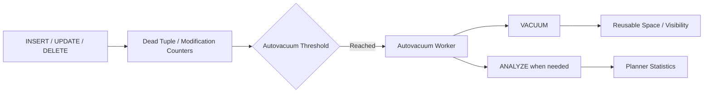
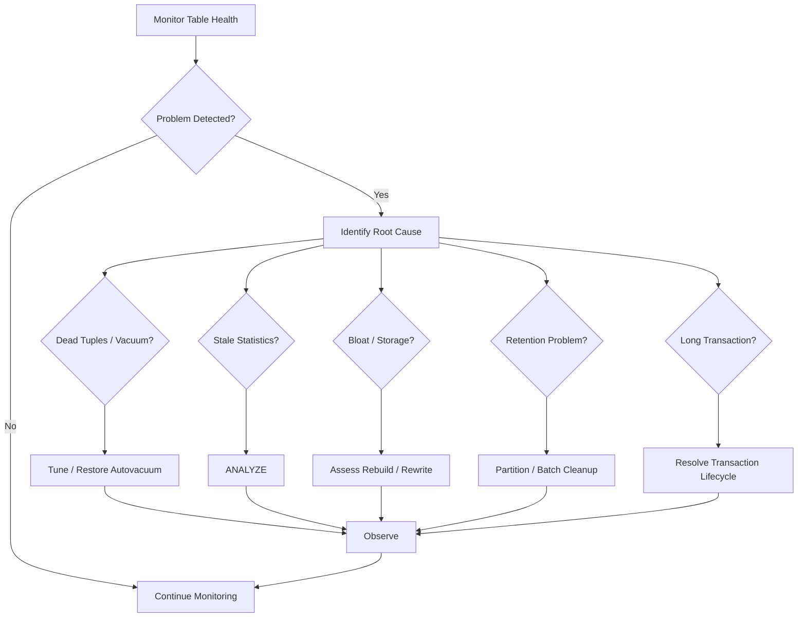

# 14- Table Maintenance

## Overview

Table maintenance is the operational discipline required to keep PostgreSQL tables healthy as data is inserted, updated, deleted, and retained over time.

In PostgreSQL, table maintenance is closely tied to **MVCC**, vacuuming, statistics, table and index bloat, storage growth, transaction duration, locking, and query performance.

A production table is not static:

```text
INSERT / UPDATE / DELETE
        ↓
New row versions
        ↓
Dead row versions
        ↓
VACUUM / AUTOVACUUM
        ↓
Space becomes reusable
        ↓
ANALYZE updates planner statistics
        ↓
Stable query planning
```

Poor table maintenance can eventually manifest as:

- Increasing table size.
- High database storage consumption.
- Poor cache efficiency.
- Slower queries.
- Excessive index growth.
- Transaction ID wraparound risk.
- Long-running vacuum operations.
- High I/O.
- Replication pressure.
- Increased backup and restore times.

Table maintenance should therefore be treated as part of normal production operations rather than an emergency-only activity.

---

## Why Table Maintenance Matters

PostgreSQL uses **MVCC (Multi-Version Concurrency Control)**. Updates and deletes generally do not immediately overwrite or physically remove the old row version.

For example:

```sql
UPDATE orders
SET status = 'completed'
WHERE id = 100;
```

Conceptually, PostgreSQL may create a new row version while the previous version eventually becomes dead.

```text
Before:

Heap
┌──────────────┐
│ order #100   │
│ pending      │
└──────────────┘

UPDATE

After:

Heap
┌──────────────┐
│ old version  │ ← dead when no longer visible
├──────────────┤
│ new version  │ ← current version
└──────────────┘
```

Vacuum helps PostgreSQL determine which old row versions can be cleaned up or reused.

Without effective maintenance, dead tuples can accumulate and cause table growth and performance degradation.

---

## PostgreSQL Table Maintenance Components

The main maintenance mechanisms are:

| Mechanism | Primary Purpose |
|---|---|
| `VACUUM` | Reclaims/reuses space from dead tuples and supports MVCC maintenance |
| `VACUUM FULL` | Rewrites the table to compact it and return space to the OS |
| `ANALYZE` | Refreshes planner statistics |
| Autovacuum | Automatically performs vacuum/analyze based on workload |
| `REINDEX` | Rebuilds indexes when separately justified |
| Partition lifecycle | Removes old data efficiently through detach/drop |
| Monitoring | Detects growth, dead tuples, stale stats, and maintenance failures |

The distinction is important:

```text
VACUUM
    ≠
VACUUM FULL
    ≠
ANALYZE
    ≠
REINDEX
```

Each solves a different problem.

---

## VACUUM

`VACUUM` processes tables to make dead tuple space reusable and maintain PostgreSQL's MVCC bookkeeping.

Basic command:

```sql
VACUUM (ANALYZE) public.orders;
```

Use this when you want both:

```text
dead tuple cleanup
+
fresh planner statistics
```

For normal production operation, autovacuum should usually handle routine maintenance.

---

## What VACUUM Does

Vacuum can:

- Identify dead tuples.
- Make their space reusable.
- Update visibility information.
- Help enable index-only scans by maintaining the visibility map.
- Prevent transaction ID wraparound through aggressive anti-wraparound vacuuming.
- Coordinate cleanup with index maintenance.

It does **not** generally rewrite the entire table into a compact physical structure.

Therefore:

```text
VACUUM
```

does not mean:

```text
"Shrink the table file as much as possible."
```

---

## VACUUM vs VACUUM FULL

| Property | `VACUUM` | `VACUUM FULL` |
|---|---|---|
| Normal maintenance | Yes | No |
| Reuses dead space | Yes | Yes |
| Rewrites table | No | Yes |
| Returns substantial space to OS | Usually no | Yes |
| Requires significant extra disk | Lower | Higher |
| Lock impact | Lower | High |
| Suitable during normal traffic | Generally | Usually not |
| Operational risk | Lower | Higher |

`VACUUM FULL` rewrites the table into a new compact representation.

Example:

```sql
VACUUM FULL public.orders;
```

It should be treated as a heavyweight maintenance operation.

---

## When VACUUM FULL Is Appropriate

`VACUUM FULL` may be justified when:

- A table has experienced substantial one-time data deletion.
- Disk space must actually be returned to the operating system.
- Table bloat is severe.
- The maintenance window can tolerate the required lock.
- Sufficient temporary storage exists.
- The operational impact has been explicitly planned.

It is not a generic replacement for healthy autovacuum.

For large production tables, alternatives such as partition lifecycle management or specialized online table-rewrite tooling may be safer depending on the problem.

---

## ANALYZE

`ANALYZE` collects statistics used by the PostgreSQL query planner.

```sql
ANALYZE public.orders;
```

The planner uses statistics to estimate:

```text
row counts
+
value distributions
+
selectivity
+
join cardinality
```

Those estimates influence decisions such as:

```text
Sequential Scan
Index Scan
Bitmap Scan
Nested Loop
Hash Join
Merge Join
```

A table can be physically healthy while having poor planner statistics.

---

## VACUUM and ANALYZE Are Different

Consider:

```text
VACUUM
    ↓
MVCC cleanup / visibility / reusable space

ANALYZE
    ↓
Planner statistics
```

For example:

```sql
VACUUM public.orders;
ANALYZE public.orders;
```

or:

```sql
VACUUM (ANALYZE) public.orders;
```

Autovacuum can perform both vacuuming and analyze operations based on configured thresholds.

---

## Autovacuum

Autovacuum is PostgreSQL's automatic maintenance mechanism.

Its purpose is to continuously maintain tables without requiring operators to manually run vacuum after every write workload.

Conceptually:



Autovacuum is one of the most important operational components of a PostgreSQL deployment.

---

## Autovacuum Thresholds

Autovacuum decisions are influenced by table-level statistics and configuration.

Conceptually, vacuum triggering is based on a threshold related to:

```text
autovacuum_vacuum_threshold
+
autovacuum_vacuum_scale_factor × table size
```

Similarly, analyze triggering is influenced by:

```text
autovacuum_analyze_threshold
+
autovacuum_analyze_scale_factor × table size
```

The exact behavior should be evaluated using the PostgreSQL version and active configuration.

---

## Why Default Autovacuum Settings May Not Be Enough

A common production problem is a very large, high-churn table.

Suppose:

```text
Table size = 1 billion rows
Scale factor = 0.2
```

A simplistic interpretation would imply a very large modification count before a vacuum trigger.

For high-churn production tables, per-table autovacuum tuning can therefore be useful.

Example:

```sql
ALTER TABLE orders
SET (
    autovacuum_vacuum_scale_factor = 0.02,
    autovacuum_analyze_scale_factor = 0.01
);
```

The correct values depend on workload, table size, vacuum throughput, hardware, and PostgreSQL version.

Do not copy tuning values blindly.

---

## Per-Table Autovacuum Tuning

Large tables often benefit from table-specific settings.

Example:

```sql
ALTER TABLE events
SET (
    autovacuum_vacuum_scale_factor = 0.01,
    autovacuum_analyze_scale_factor = 0.005
);
```

This can cause maintenance to happen more frequently than the cluster-wide defaults.

However, more frequent vacuuming consumes:

```text
CPU
+
I/O
+
autovacuum worker capacity
```

The goal is to maintain a sustainable balance.

---

## Autovacuum Workers

PostgreSQL can run multiple autovacuum workers.

Relevant settings include:

```text
autovacuum
autovacuum_max_workers
autovacuum_naptime
autovacuum_vacuum_cost_limit
autovacuum_vacuum_cost_delay
```

Increasing worker counts is not automatically beneficial.

If the database is already I/O constrained:

```text
more workers
    ↓
more concurrent maintenance I/O
    ↓
less capacity for application workload
```

Tune maintenance based on observed bottlenecks.

---

## Detecting Dead Tuples

Inspect table statistics:

```sql
SELECT
    schemaname,
    relname AS table_name,
    n_live_tup,
    n_dead_tup,
    last_vacuum,
    last_autovacuum,
    vacuum_count,
    autovacuum_count,
    last_analyze,
    last_autoanalyze
FROM pg_stat_user_tables
ORDER BY n_dead_tup DESC;
```

Look for:

```text
high dead tuples
+
high write churn
+
old last_autovacuum
```

A high `n_dead_tup` alone does not necessarily mean the table is unhealthy; interpret it relative to table size, workload, and vacuum progress.

---

## Dead Tuple Ratio

A useful investigative metric is the approximate dead-tuple ratio:

```sql
SELECT
    schemaname,
    relname AS table_name,
    n_live_tup,
    n_dead_tup,
    ROUND(
        100.0 * n_dead_tup /
        NULLIF(n_live_tup + n_dead_tup, 0),
        2
    ) AS dead_tuple_pct
FROM pg_stat_user_tables
ORDER BY dead_tuple_pct DESC NULLS LAST;
```

This is an approximation based on statistics.

Do not use a universal percentage threshold without considering workload and table characteristics.

---

## Table Size Monitoring

Inspect total table size:

```sql
SELECT
    schemaname,
    relname AS table_name,
    pg_size_pretty(pg_total_relation_size(relid)) AS total_size
FROM pg_catalog.pg_statio_user_tables
ORDER BY pg_total_relation_size(relid) DESC
LIMIT 20;
```

`pg_total_relation_size()` includes the table and its indexes, unlike `pg_relation_size()`, which measures the main table relation.

For a more complete breakdown:

```sql
SELECT
    schemaname,
    relname AS table_name,
    pg_size_pretty(pg_relation_size(relid)) AS table_size,
    pg_size_pretty(pg_indexes_size(relid)) AS indexes_size,
    pg_size_pretty(pg_total_relation_size(relid)) AS total_size
FROM pg_catalog.pg_statio_user_tables
ORDER BY pg_total_relation_size(relid) DESC
LIMIT 20;
```

---

## Table Growth Monitoring

Absolute size is less useful than growth over time.

Track:

```text
table size
+
index size
+
row count
+
dead tuples
+
growth rate
```

For example:

```text
orders
    ↓
500 GB
    ↓
550 GB
    ↓
610 GB
    ↓
700 GB
```

A sudden growth acceleration may indicate:

- Application behavior change.
- Duplicate ingestion.
- Retention failure.
- Failed cleanup jobs.
- Index additions.
- Increased update churn.
- Unexpected tenant growth.

Storage monitoring should therefore track both **current size and rate of change**.

---

## Table Bloat

Table bloat occurs when the physical table occupies substantially more space than the current live data requires.

Possible causes include:

- Heavy updates.
- Heavy deletes.
- Long-running transactions.
- Ineffective vacuuming.
- Poor fill-factor/workload interaction.
- Large historical data retained unnecessarily.

Bloat is a symptom, not a diagnosis.

Before attempting to fix it, determine why it developed.

---

## Long-Running Transactions

Long-running transactions are particularly important for MVCC maintenance.

Consider:

```text
Transaction A
    BEGIN
    ↓
Long-running transaction remains open

Transaction B
    UPDATE / DELETE
    ↓
Dead row versions accumulate

VACUUM
    ↓
Cannot remove versions still potentially visible to A
```

Inspect active transactions:

```sql
SELECT
    pid,
    usename,
    application_name,
    client_addr,
    state,
    xact_start,
    now() - xact_start AS transaction_age,
    wait_event_type,
    wait_event,
    query
FROM pg_stat_activity
WHERE xact_start IS NOT NULL
ORDER BY xact_start;
```

Long-running transactions can cause:

```text
dead tuple accumulation
+
table bloat
+
vacuum delays
+
transaction ID pressure
```

---

## Idle in Transaction

A particularly dangerous state is:

```text
idle in transaction
```

The application has started a transaction but is not currently executing a statement.

Inspect it:

```sql
SELECT
    pid,
    usename,
    application_name,
    state,
    xact_start,
    now() - xact_start AS transaction_age,
    query
FROM pg_stat_activity
WHERE state = 'idle in transaction'
ORDER BY xact_start;
```

Common causes include:

- Application code opening transactions too early.
- External API calls inside transactions.
- Connection leaks.
- Incorrect ORM transaction handling.
- Worker failures.

Keep transaction boundaries short and explicit.

---

## Transaction ID Wraparound

PostgreSQL transaction IDs have finite representation.

If transaction ID maintenance falls too far behind, PostgreSQL must protect the database against transaction ID wraparound.

This can become a severe availability incident.

PostgreSQL therefore performs aggressive anti-wraparound vacuuming when necessary.

Monitor transaction age:

```sql
SELECT
    datname,
    age(datfrozenxid) AS xid_age
FROM pg_database
ORDER BY xid_age DESC;
```

Also inspect table-level transaction age:

```sql
SELECT
    schemaname,
    relname AS table_name,
    age(relfrozenxid) AS xid_age
FROM pg_stat_user_tables
ORDER BY xid_age DESC;
```

Do not wait for wraparound pressure to become an incident.

---

## Freeze and Visibility

Vacuum also participates in freezing old transaction IDs so PostgreSQL can safely determine transaction visibility far into the future.

This is why vacuum is not merely:

```text
"space cleanup"
```

It is also part of PostgreSQL's correctness and transaction-ID lifecycle.

A database with suppressed or ineffective autovacuum can eventually face severe operational consequences even if disk space is still available.

---

## Fillfactor

PostgreSQL supports table-level `fillfactor`.

Example:

```sql
ALTER TABLE orders
SET (fillfactor = 80);
```

A lower fillfactor leaves more room on heap pages for future updates.

This can sometimes improve HOT-update opportunities for update-heavy tables.

However:

```text
lower fillfactor
    ↓
more free space per page
    ↓
larger initial table footprint
```

Fillfactor should be tuned only when the workload justifies it.

It is not a generic bloat-reduction setting.

---

## HOT Updates

HOT means **Heap-Only Tuple**.

When an update does not modify indexed columns and a suitable location exists on the same heap page, PostgreSQL may avoid creating new index entries for the update.

Conceptually:

```text
UPDATE non-indexed column
        ↓
Same heap page has room?
        ↓
Yes
        ↓
HOT update
        ↓
Less index maintenance
```

This is particularly relevant for write-heavy workloads.

Excessive indexing can reduce opportunities for HOT updates because updates to indexed columns require corresponding index maintenance.

---

## Table Maintenance and Indexes

Table and index maintenance are closely related.

```text
UPDATE / DELETE
       ↓
Dead heap tuples
       +
Index changes
       ↓
VACUUM
       ↓
Heap cleanup
       +
Index cleanup
```

A table may have acceptable heap behavior but still have large indexes.

Therefore monitor:

```text
table size
+
index size
+
dead tuples
+
vacuum behavior
```

together.

---

## Table Maintenance and Query Performance

Maintenance affects query performance through:

```text
statistics
+
visibility
+
table size
+
bloat
+
cache efficiency
```

For example, stale statistics can cause the planner to choose:

```text
Sequential Scan
```

when an index-based plan would have been more appropriate.

Use:

```sql
ANALYZE public.orders;
```

when statistics are stale or after significant data distribution changes.

---

## Partitioned Tables

Partitioning can simplify maintenance for large datasets.

For example:

```text
orders
 ├── orders_2026_01
 ├── orders_2026_02
 ├── orders_2026_03
 └── orders_2026_04
```

Instead of deleting billions of old rows:

```sql
DELETE FROM orders
WHERE created_at < now() - interval '12 months';
```

a retention process can detach and drop an old partition.

Conceptually:

```text
Old data
   ↓
Detach partition
   ↓
Archive if required
   ↓
Drop partition
   ↓
Table and indexes removed together
```

This can dramatically reduce maintenance cost for time-based retention.

---

## Why Partition Drop Is Better Than Huge DELETEs

A massive delete can create:

```text
dead tuples
+
WAL
+
vacuum work
+
index maintenance
+
long transactions
```

Dropping an obsolete partition removes the partition as a relation instead.

This is often much more efficient for lifecycle management.

The exact operational behavior still depends on foreign keys, dependencies, replication, backups, and the surrounding architecture.

---

## Large Deletes

If partitioning is not possible, large deletes should generally be performed carefully.

Instead of:

```sql
DELETE FROM events
WHERE created_at < now() - interval '2 years';
```

on a massive table, consider controlled batches.

For example:

```sql
WITH batch AS (
    SELECT id
    FROM events
    WHERE created_at < now() - interval '2 years'
    ORDER BY id
    LIMIT 5000
)
DELETE FROM events e
USING batch
WHERE e.id = batch.id;
```

Repeat through a controlled worker process.

Batching reduces transaction size and can make lock, WAL, replication, and vacuum pressure more manageable.

It does not eliminate the total maintenance work.

---

## Table Maintenance and WAL

Maintenance operations can generate or require substantial I/O.

Large operations can affect:

```text
WAL generation
+
replication lag
+
backup throughput
+
storage
```

Before heavy maintenance, inspect:

```text
replica lag
+
available disk
+
WAL capacity
+
application traffic
```

Do not schedule heavy table maintenance without considering the entire database system.

---

## Table Maintenance on Replicas

Physical PostgreSQL replicas replay WAL generated by the primary.

Therefore:

```text
Primary
  ↓ WAL
Replica
  ↓
Replay table/index changes
```

You generally do not independently perform ordinary table maintenance on a physical read replica.

Instead, maintain the primary and allow changes to propagate.

Replica-specific query workloads may still require monitoring for:

- Replay conflicts.
- Long-running queries.
- Replica lag.
- Recovery delays.

---

## Table Maintenance and Backups

Table size directly affects:

```text
backup duration
+
backup storage
+
restore duration
```

Bloat can make this worse because physical backups may contain allocated space that is not efficiently representing live application data.

Production teams should periodically measure:

```text
backup time
+
restore time
+
database size
+
growth rate
```

against the organization's RPO and RTO requirements.

---

## Table Maintenance and Connection Pools

Maintenance operations compete with application traffic for database resources.

A large table rewrite or aggressive maintenance workload can consume:

```text
CPU
+
I/O
+
memory
```

while application connections remain active.

Increasing connection pool size is generally not a solution.

It may make the problem worse:

```text
Maintenance consumes resources
        ↓
Queries become slower
        ↓
Connections remain occupied longer
        ↓
Pool fills
        ↓
More application requests wait
```

Control concurrency instead of blindly increasing pools.

---

## Table Maintenance and Celery

Background workers often perform:

```text
bulk updates
+
cleanup jobs
+
imports
+
exports
```

These workloads can create significant table churn.

For example:

```text
Celery workers
      ↓
large UPDATE workload
      ↓
dead tuples
      ↓
autovacuum workload
```

Schedule large cleanup or migration jobs with database capacity in mind.

---

## Table Maintenance and Kafka

Kafka consumers can continuously update database tables.

A high-throughput consumer may create:

```text
high INSERT rate
+
high UPDATE rate
+
WAL growth
+
vacuum pressure
```

Monitor database maintenance alongside consumer throughput.

Backpressure at the Kafka consumer layer may be preferable to allowing PostgreSQL to saturate.

---

## Table Maintenance and Django

Django applications should keep transaction boundaries deliberate.

For example:

```python
from django.db import transaction


def complete_order(order_id: int) -> None:
    with transaction.atomic():
        order = (
            Order.objects
            .select_for_update()
            .get(id=order_id)
        )

        order.status = "completed"
        order.save(update_fields=["status"])
```

Avoid:

```text
BEGIN
    ↓
database query
    ↓
HTTP request
    ↓
external API
    ↓
more work
    ↓
COMMIT
```

Long transactions can interfere with vacuum and increase table maintenance pressure.

---

## Table Maintenance and FastAPI

FastAPI applications commonly use SQLAlchemy or another database layer.

Transaction scope should remain explicit:

```text
HTTP request
    ↓
Acquire connection
    ↓
BEGIN
    ↓
Database work
    ↓
COMMIT / ROLLBACK
    ↓
Release connection
```

Avoid holding a database transaction while waiting on:

```text
HTTP APIs
+
Kafka
+
Redis
+
file storage
```

unless the architecture explicitly requires that behavior.

---

## Monitoring Autovacuum Activity

Inspect active vacuum processes:

```sql
SELECT
    pid,
    datname,
    relid::regclass AS table_name,
    phase,
    heap_blks_total,
    heap_blks_scanned,
    heap_blks_vacuumed,
    index_vacuum_count,
    num_dead_tuples,
    num_dead_item_ids
FROM pg_stat_progress_vacuum;
```

This is particularly useful during:

- Vacuum investigations.
- Storage incidents.
- High dead-tuple incidents.
- Autovacuum tuning.
- Large-table maintenance.

The exact columns available depend on the PostgreSQL version.

---

## Detecting Long-Running Vacuum

Combine:

```text
pg_stat_progress_vacuum
+
pg_stat_activity
+
pg_stat_user_tables
+
infrastructure metrics
```

A long-running vacuum may be legitimate on a very large table.

The important question is:

```text
Is vacuum progressing fast enough relative to the rate at which dead tuples are being generated?
```

---

## Monitoring Table Maintenance Health

A useful production dashboard should include:

| Metric | Why It Matters |
|---|---|
| Table size | Capacity planning |
| Table growth rate | Forecasting |
| Index size | Storage and write cost |
| Live tuples | Data volume |
| Dead tuples | Vacuum pressure |
| Last autovacuum | Maintenance recency |
| Last autoanalyze | Planner statistics freshness |
| Transaction age | MVCC and wraparound risk |
| Vacuum duration | Maintenance capacity |
| WAL generation | Replication/recovery impact |
| Replica lag | HA health |
| Disk utilization | Capacity risk |
| Query latency | User impact |

---

## Maintenance Alerts

Useful alert categories include:

### Storage

```text
Disk utilization approaching capacity
```

### Vacuum

```text
Autovacuum not keeping up
```

### Dead Tuples

```text
Dead tuple growth exceeds expected workload
```

### Transaction Age

```text
Transaction/XID age approaching operational limits
```

### Statistics

```text
Critical tables have stale statistics
```

### Replication

```text
Maintenance causes abnormal replica lag
```

Alerts should use workload-aware thresholds rather than arbitrary global values.

---

## Maintenance and Statistics After Bulk Loads

Bulk data changes can materially change distributions.

For example:

```text
10 million rows
    ↓
bulk load
    ↓
500 million rows
```

Planner statistics collected before the load may no longer represent the table accurately.

After significant bulk changes, consider:

```sql
ANALYZE public.events;
```

This is particularly important before latency-sensitive workloads resume.

---

## Maintenance After Schema Changes

Schema migrations can affect table maintenance through:

```text
new indexes
+
new columns
+
backfills
+
data rewrites
+
constraint validation
```

A large backfill can generate substantial dead tuples if implemented as updates.

Prefer staged, observable migrations:

```text
Expand
  ↓
Deploy compatible application
  ↓
Backfill in controlled batches
  ↓
Monitor vacuum/WAL/replication
  ↓
Validate
  ↓
Contract
```

---

## Table Backfills

A naive backfill:

```sql
UPDATE orders
SET normalized_email = lower(email);
```

on a huge table may produce significant:

```text
row churn
+
WAL
+
index updates
+
vacuum work
```

A production backfill should consider:

- Batch size.
- Transaction duration.
- Rate limiting.
- Index impact.
- Replica lag.
- Lock contention.
- Vacuum capacity.
- Application traffic.

---

## Security Considerations

Table maintenance requires elevated database privileges.

Application runtime users should generally not be able to perform arbitrary:

```text
VACUUM FULL
ALTER TABLE
DROP TABLE
TRUNCATE
```

Production maintenance should use controlled administrative or migration roles.

Additionally:

- Protect database diagnostic endpoints.
- Avoid exposing internal statistics through public APIs.
- Restrict access to monitoring dashboards.
- Avoid logging sensitive query parameters.
- Audit privileged maintenance operations where required.

---

## Reliability Considerations

Maintenance jobs should be:

- Observable.
- Interruptible where possible.
- Idempotent where appropriate.
- Rate-controlled.
- Scheduled with capacity headroom.
- Tested against production-scale data.

For large operations, define:

```text
start conditions
+
abort conditions
+
rollback strategy
+
monitoring
+
operator ownership
```

Do not start a heavy rewrite or cleanup operation without understanding how it will affect application traffic.

---

## High Availability Considerations

Before heavy maintenance:

```text
Check primary health
Check replica health
Check replication lag
Check storage headroom
Check WAL capacity
Check backup status
```

After maintenance:

```text
Verify replica catches up
Verify query latency
Verify storage behavior
Verify autovacuum health
Verify application errors
```

A maintenance task is successful only if the production system remains healthy afterward.

---

## Disaster Recovery Considerations

Table maintenance affects DR through:

```text
database size
+
WAL volume
+
backup duration
+
restore duration
```

Large table rewrites can temporarily increase storage and I/O demands.

For critical systems, validate maintenance operations against:

```text
RPO
+
RTO
+
backup capacity
+
restore procedures
```

Do not sacrifice recoverability to reduce maintenance duration.

---

## Cost Considerations

Table maintenance consumes infrastructure resources.

Costs include:

```text
CPU
+
storage
+
I/O
+
WAL
+
replication
+
backup storage
+
backup processing
+
operational time
```

Effective maintenance can reduce costs by preventing unnecessary data growth and keeping query workloads efficient.

However, overly aggressive vacuuming can waste CPU and I/O.

The goal is sustainable maintenance, not maximum maintenance activity.

---

## Common Mistakes

### Treating `VACUUM FULL` as Normal Maintenance

`VACUUM FULL` rewrites the table and can require strong locking and substantial resources.

**Better approach:** rely on healthy autovacuum for routine maintenance and reserve full rewrites for justified cases.

### Disabling Autovacuum

Disabling autovacuum may appear attractive during heavy workloads.

It can instead cause:

```text
dead tuples
+
bloat
+
transaction ID pressure
+
maintenance backlog
```

**Better approach:** tune autovacuum per workload when necessary.

### Ignoring Long Transactions

A long-running transaction can prevent vacuum from removing row versions.

**Better approach:** monitor transaction age and eliminate unnecessary long-lived transactions.

### Running Huge Deletes

Large deletes create dead tuples and maintenance work.

**Better approach:** use partition lifecycle management or controlled batching.

### Increasing Connection Pools During Maintenance

More connections do not create more database capacity.

**Better approach:** control application concurrency and protect database headroom.

### Ignoring Table Growth Rate

A table may look healthy today but become a storage incident months later.

**Better approach:** monitor growth trends and forecast capacity.

### Assuming High Dead Tuples Always Mean Failure

Dead tuples are normal in an MVCC database.

**Better approach:** evaluate their ratio, generation rate, table size, and vacuum progress.

### Ignoring Planner Statistics

A physically healthy table can still have poor query performance because statistics are stale.

**Better approach:** monitor autoanalyze behavior and refresh statistics after significant data changes.

### Running Large Backfills Without Rate Limiting

A backfill can compete directly with production traffic.

**Better approach:** batch, observe, throttle, and stop when database health degrades.

### Ignoring Transaction ID Age

Disk utilization can look normal while transaction ID age becomes dangerous.

**Better approach:** monitor XID age independently.

---

## Production Maintenance Workflow

A practical maintenance workflow is:



The key principle is:

```text
Observe
    ↓
Diagnose
    ↓
Choose the least disruptive corrective action
    ↓
Measure the result
```

---

## Production Table Maintenance Checklist

### Daily Monitoring

- Check database storage.
- Check largest tables.
- Check table growth.
- Check dead tuple trends.
- Check long-running transactions.
- Check replication health.
- Check autovacuum activity.

### Periodic Review

- Review autovacuum effectiveness.
- Review table and index bloat.
- Review retention policies.
- Review partition lifecycle.
- Review large backfills.
- Review transaction age.
- Review backup and restore duration.

### Before Heavy Maintenance

- Check application traffic.
- Check CPU and I/O headroom.
- Check storage capacity.
- Check replication lag.
- Check WAL capacity.
- Confirm backup/recovery posture.
- Define abort criteria.
- Notify relevant operators.

### After Maintenance

- Verify query latency.
- Verify table size.
- Verify dead tuples.
- Verify autovacuum behavior.
- Verify replication recovery.
- Verify application error rates.
- Record the outcome for future capacity planning.

---

## Senior-Level Table Maintenance Strategy

A mature database operation should move from reactive maintenance to predictive maintenance.

Instead of asking:

```text
"Is this table bloated?"
```

ask:

```text
How quickly is this table growing?

How many dead tuples are generated per hour?

Can autovacuum remove them fast enough?

Are long transactions preventing cleanup?

How much storage will the table require in six months?

What happens to WAL during maintenance?

How will replicas behave?

What will this do to backup and restore time?
```

This shifts table maintenance from:

```text
database housekeeping
```

to:

```text
capacity + performance + reliability engineering
```

---

## Decision Matrix

| Situation | Preferred Approach |
|---|---|
| Normal table churn | Autovacuum |
| Planner statistics stale | `ANALYZE` |
| High dead tuples | Investigate vacuum and transaction behavior |
| Long-running transaction | Fix transaction lifecycle |
| Old time-based data | Partition lifecycle |
| Large retention cleanup | Partition drop/detach where possible |
| Moderate cleanup without partitioning | Controlled batching |
| Severe physical bloat | Measure and evaluate rewrite strategy |
| Need to return disk to OS | Carefully planned rewrite/compaction |
| Large bulk load | Load in controlled manner and analyze afterward |
| High write churn | Tune autovacuum/fillfactor based on evidence |
| Transaction age risk | Investigate vacuum/freeze progress immediately |

---

## Interview Traps

### "Does VACUUM Shrink the Table?"

Normally, no. Regular `VACUUM` primarily makes dead tuple space reusable within the relation. `VACUUM FULL` rewrites the table and can return substantial space to the operating system.

### "Why Does PostgreSQL Need VACUUM?"

Because MVCC creates row versions that eventually become dead. Vacuum performs cleanup and supports visibility and transaction ID maintenance.

### "Why Can a Long Transaction Cause Bloat?"

Because PostgreSQL may need to retain row versions that could still be visible to the old transaction.

### "Does More Autovacuum Always Mean Better Performance?"

No. Excessive vacuum activity consumes CPU and I/O and can compete with application workloads.

### "Should You Disable Autovacuum for Large Tables?"

Generally no. Large tables often need **better-tuned** autovacuum rather than disabled autovacuum.

### "Why Is Partitioning Useful for Maintenance?"

It allows old data to be removed by partition-level lifecycle operations instead of creating enormous row-level delete workloads.

### "Does ANALYZE Remove Dead Tuples?"

No. `ANALYZE` collects planner statistics.

### "Can Table Maintenance Cause Replica Lag?"

Yes. Heavy data changes, rewrites, and associated WAL can increase replay workload and replica lag.

### "Does a High Dead-Tuple Count Automatically Mean the Database Is Broken?"

No. Evaluate dead tuples relative to table size, churn rate, vacuum progress, transaction age, and query behavior.

### "Why Monitor Transaction Age Separately From Disk Usage?"

Because transaction ID exhaustion is a correctness and availability concern that can occur even when storage capacity looks healthy.

---

## Key Takeaways

- **Autovacuum is core PostgreSQL infrastructure:** healthy vacuum and analyze behavior are required for MVCC cleanup, planner statistics, visibility, and transaction ID maintenance.
- **Diagnose the cause before forcing cleanup:** long transactions, high write churn, poor retention, stale statistics, and insufficient autovacuum capacity require different solutions.
- **Prefer low-disruption lifecycle strategies:** partitioning, controlled batching, and targeted maintenance are usually safer than large table rewrites during production traffic.
- **Monitor tables as production workloads:** track size, growth, dead tuples, vacuum progress, transaction age, WAL, replication, and query performance together.
- **Table maintenance is a capacity and reliability problem:** maintenance decisions must account for application traffic, storage, replication, backups, recovery objectives, and long-term data growth.