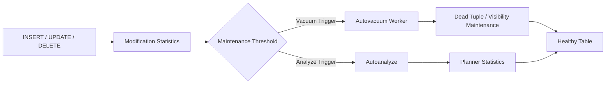

# 15- VACUUM and ANALYZE

## Overview

`VACUUM` and `ANALYZE` are core PostgreSQL maintenance operations that keep tables operationally healthy and help the query planner make accurate decisions.

They solve different problems:

| Operation | Primary Responsibility |
|---|---|
| `VACUUM` | Process dead tuples, maintain visibility information, and support transaction ID management |
| `ANALYZE` | Collect statistics used by the query planner |
| Autovacuum | Automatically performs vacuum and analyze work |
| `VACUUM FULL` | Rewrites and compacts a table, potentially returning space to the OS |

The distinction matters because a database can have:

- Healthy storage but stale statistics.
- Fresh statistics but excessive dead tuples.
- Low dead-tuple counts but dangerous transaction age.
- Healthy tables but overloaded autovacuum workers.
- Good vacuum behavior but poor query plans caused by inaccurate cardinality estimates.

A production PostgreSQL system should therefore treat vacuuming and analyzing as continuous database operations rather than occasional manual commands.

---

## Why PostgreSQL Needs VACUUM

PostgreSQL uses **MVCC (Multi-Version Concurrency Control)**.

An `UPDATE` generally creates a new row version rather than modifying the existing row in place, while the old version eventually becomes dead once no transaction can see it.

For example:

```sql
UPDATE orders
SET status = 'completed'
WHERE id = 100;
```

Conceptually:

```text
Before
┌─────────────────────┐
│ order_id = 100      │
│ status = pending    │
└─────────────────────┘

UPDATE

After
┌─────────────────────┐
│ old row version     │ ← eventually dead
│ status = pending    │
├─────────────────────┤
│ new row version     │ ← current version
│ status = completed  │
└─────────────────────┘
```

The old version cannot simply be removed immediately because another transaction may still need to see it.

`VACUUM` helps PostgreSQL process these dead row versions after they are no longer needed.

---

## What VACUUM Does

Regular `VACUUM` can:

- Identify dead tuples.
- Make their space reusable by future inserts or updates.
- Maintain visibility information.
- Support index cleanup.
- Help index-only scans through visibility-map maintenance.
- Advance transaction ID freezing where required.
- Protect the database from transaction ID wraparound.

A useful mental model is:

```text
UPDATE / DELETE
       ↓
Dead tuple versions
       ↓
VACUUM
       ↓
Space becomes reusable
       +
Visibility / freezing maintenance
```

Regular `VACUUM` is primarily about **reuse and maintenance**, not aggressively shrinking the physical table file.

---

## What VACUUM Does Not Usually Do

A common misconception is:

> `VACUUM` makes the table file smaller.

Normally, it does not compact the entire table and return all unused filesystem space to the operating system.

For example:

```text
Table allocated on disk: 500 GB
Live data:               300 GB
Reusable free space:     200 GB
```

A regular vacuum can make that internal space available for future writes, but the relation may still occupy approximately 500 GB at the filesystem level.

This distinction is important for capacity planning.

---

## VACUUM FULL

`VACUUM FULL` rewrites the table into a compact physical representation.

```sql
VACUUM FULL public.orders;
```

Conceptually:

```text
Existing table
500 GB
   ↓
Table rewrite
   ↓
Compact table
300 GB
```

It can return substantial disk space to the operating system.

However, it is a heavyweight operation and should not be confused with routine vacuuming.

### Characteristics

| Property | `VACUUM` | `VACUUM FULL` |
|---|---|---|
| Routine maintenance | Yes | No |
| Makes dead space reusable | Yes | Yes |
| Rewrites table | No | Yes |
| Can substantially shrink relation | No | Yes |
| Lock impact | Relatively low | High |
| Extra disk requirements | Lower | Potentially substantial |
| Appropriate during normal traffic | Usually | Generally no |

Use `VACUUM FULL` only when the operational benefit justifies the rewrite and locking impact.

---

## Why PostgreSQL Needs ANALYZE

`ANALYZE` collects statistics about table data.

The PostgreSQL planner uses those statistics to estimate:

- Number of matching rows.
- Value distributions.
- Selectivity of predicates.
- Join cardinality.
- Data correlation.
- Most common values.
- Histograms and other distribution information.

These estimates influence execution-plan decisions.

```text
SQL query
   ↓
Planner
   ↓
Statistics
   ↓
Cardinality estimates
   ↓
Access path + join strategy
```

For example, the planner may choose between:

```text
Sequential Scan
Index Scan
Bitmap Heap Scan
Nested Loop
Hash Join
Merge Join
```

based partly on these estimates.

---

## Running ANALYZE

Run analyze for a table:

```sql
ANALYZE public.orders;
```

Analyze the entire database:

```sql
ANALYZE;
```

Analyze selected columns:

```sql
ANALYZE public.orders (customer_id, status, created_at);
```

The goal is not to run `ANALYZE` constantly. PostgreSQL's autovacuum subsystem normally performs autoanalyze based on table modifications.

Manual analyze is useful after significant data changes or when investigating stale statistics.

---

## VACUUM and ANALYZE Solve Different Problems

The difference is fundamental:

```text
VACUUM
  ↓
MVCC / dead tuples / visibility / freezing

ANALYZE
  ↓
Planner statistics / cardinality estimation
```

They are often run together:

```sql
VACUUM (ANALYZE) public.orders;
```

This does not mean the two operations are interchangeable.

A table can require:

```text
ANALYZE
```

without having significant vacuum pressure.

Likewise, a heavily updated table can require:

```text
VACUUM
```

even when planner statistics are still reasonably current.

---

## Autovacuum

Autovacuum automatically performs vacuum and analyze work in the background.

A simplified lifecycle is:



This is one of the most important PostgreSQL production subsystems.

A production database should normally have autovacuum enabled and appropriately tuned.

---

## Autovacuum Triggering

Autovacuum decisions are influenced by thresholds and table size.

Conceptually, vacuum triggering is based on:

```text
autovacuum_vacuum_threshold
+
autovacuum_vacuum_scale_factor × table size
```

Analyze triggering similarly depends on:

```text
autovacuum_analyze_threshold
+
autovacuum_analyze_scale_factor × table size
```

This creates an important operational issue for very large tables.

Suppose a table contains hundreds of millions of rows. A high scale factor can imply a large number of changes before automatic maintenance is triggered.

For high-churn tables, table-specific settings may therefore be appropriate.

---

## Per-Table Autovacuum Configuration

Example:

```sql
ALTER TABLE orders
SET (
    autovacuum_vacuum_scale_factor = 0.02,
    autovacuum_analyze_scale_factor = 0.01
);
```

This can cause maintenance to happen more frequently for the table than the cluster-wide defaults.

However, lower thresholds increase maintenance frequency and therefore can increase:

```text
CPU
+
I/O
+
autovacuum worker utilization
```

Tune from observed workload rather than copying configuration values from another system.

---

## Inspecting Autovacuum Configuration

Inspect relevant settings:

```sql
SELECT
    name,
    setting,
    unit,
    source
FROM pg_settings
WHERE name LIKE 'autovacuum%'
ORDER BY name;
```

Important settings include:

| Setting | Purpose |
|---|---|
| `autovacuum` | Enables/disables autovacuum |
| `autovacuum_max_workers` | Maximum concurrent autovacuum workers |
| `autovacuum_naptime` | Delay between autovacuum launcher cycles |
| `autovacuum_vacuum_threshold` | Base vacuum threshold |
| `autovacuum_vacuum_scale_factor` | Vacuum threshold relative to table size |
| `autovacuum_analyze_threshold` | Base analyze threshold |
| `autovacuum_analyze_scale_factor` | Analyze threshold relative to table size |
| `autovacuum_vacuum_cost_limit` | Cost budget for autovacuum |
| `autovacuum_vacuum_cost_delay` | Cost-based delay for autovacuum |

Exact behavior should always be evaluated against the PostgreSQL version and workload.

---

## Why Large Tables Need Special Attention

Consider:

```text
Table:
1 billion rows

Default-style scale factor:
0.20
```

A scale-factor-based threshold can become very large.

For high-churn tables, waiting for a large percentage of the table to change may allow:

```text
dead tuples
+
bloat
+
stale statistics
```

to accumulate.

This is why experienced PostgreSQL operators often tune high-write tables independently.

---

## Monitoring Dead Tuples

Use `pg_stat_user_tables`:

```sql
SELECT
    schemaname,
    relname AS table_name,
    n_live_tup,
    n_dead_tup,
    last_vacuum,
    last_autovacuum,
    vacuum_count,
    autovacuum_count,
    last_analyze,
    last_autoanalyze
FROM pg_stat_user_tables
ORDER BY n_dead_tup DESC;
```

Important columns include:

- `n_live_tup`
- `n_dead_tup`
- `last_autovacuum`
- `last_autoanalyze`
- `autovacuum_count`
- `autoanalyze_count`

These statistics are useful signals, but they are estimates rather than exact physical counts.

---

## Dead Tuple Ratio

A useful investigative metric is:

```sql
SELECT
    schemaname,
    relname AS table_name,
    n_live_tup,
    n_dead_tup,
    ROUND(
        100.0 * n_dead_tup /
        NULLIF(n_live_tup + n_dead_tup, 0),
        2
    ) AS dead_tuple_pct
FROM pg_stat_user_tables
ORDER BY dead_tuple_pct DESC NULLS LAST;
```

Do not define one universal percentage as the failure threshold.

A 5% dead-tuple ratio on one workload may be harmless while the same ratio on a latency-sensitive, frequently updated table may deserve investigation.

Look at:

```text
dead tuple ratio
+
dead tuple generation rate
+
vacuum frequency
+
table size
+
query performance
```

together.

---

## Monitoring Last Vacuum and Analyze

A useful operational query is:

```sql
SELECT
    schemaname,
    relname AS table_name,
    last_vacuum,
    last_autovacuum,
    last_analyze,
    last_autoanalyze,
    n_live_tup,
    n_dead_tup
FROM pg_stat_user_tables
ORDER BY COALESCE(last_autovacuum, last_vacuum) NULLS FIRST;
```

Investigate tables where:

- Autovacuum has not run for an unexpectedly long period.
- Dead tuples are increasing rapidly.
- Autoanalyze is not keeping up with workload changes.
- Query plans become unstable after large data modifications.

---

## Monitoring Vacuum Progress

PostgreSQL exposes progress for currently running vacuum operations:

```sql
SELECT
    pid,
    datname,
    relid::regclass AS table_name,
    phase,
    heap_blks_total,
    heap_blks_scanned,
    heap_blks_vacuumed,
    index_vacuum_count,
    num_dead_tuples
FROM pg_stat_progress_vacuum;
```

This helps answer:

```text
Is vacuum running?

Which table is being processed?

Which phase is active?

Is it making progress?

How much work remains?
```

A long vacuum is not automatically a problem. Large tables can legitimately require significant time.

The important question is whether maintenance throughput is sufficient relative to the rate at which dead tuples are generated.

---

## VACUUM Phases

A vacuum can progress through phases such as:

- Scanning the heap.
- Vacuuming indexes.
- Vacuuming the heap.
- Performing cleanup.
- Truncating the relation when possible.

The exact phases and progress fields depend on PostgreSQL version.

When troubleshooting, interpret the phase together with table size, I/O activity, dead tuples, and transaction behavior.

---

## Long-Running Transactions and VACUUM

Long-running transactions can prevent vacuum from removing old row versions.

Example:

```text
Transaction A
BEGIN
   ↓
Long-running snapshot
   ↓
Transaction B performs UPDATE/DELETE
   ↓
Dead row versions created
   ↓
VACUUM
   ↓
Some versions still potentially visible to A
   ↓
Cleanup delayed
```

Inspect transaction age:

```sql
SELECT
    pid,
    usename,
    application_name,
    state,
    xact_start,
    now() - xact_start AS transaction_age,
    wait_event_type,
    wait_event,
    query
FROM pg_stat_activity
WHERE xact_start IS NOT NULL
ORDER BY xact_start;
```

Long-running transactions should be treated as an operational concern, not merely a query-performance issue.

---

## Idle in Transaction

A particularly problematic state is:

```text
idle in transaction
```

Inspect it:

```sql
SELECT
    pid,
    usename,
    application_name,
    client_addr,
    xact_start,
    now() - xact_start AS transaction_age,
    query
FROM pg_stat_activity
WHERE state = 'idle in transaction'
ORDER BY xact_start;
```

Common application causes include:

- Transaction opened too early.
- External HTTP call inside a transaction.
- Connection handling bugs.
- Incorrect ORM transaction boundaries.
- Background worker failures.

Avoid:

```text
BEGIN
  ↓
Database query
  ↓
HTTP request
  ↓
Redis operation
  ↓
Kafka operation
  ↓
COMMIT
```

Keep database transactions short and focused.

---

## Transaction ID Freezing

PostgreSQL transaction IDs are finite.

Old transaction IDs eventually need to be frozen so PostgreSQL can continue determining tuple visibility safely.

Vacuum performs freezing work as part of this lifecycle.

Monitor transaction age:

```sql
SELECT
    datname,
    age(datfrozenxid) AS xid_age
FROM pg_database
ORDER BY xid_age DESC;
```

Also inspect table-level age:

```sql
SELECT
    schemaname,
    relname AS table_name,
    age(relfrozenxid) AS xid_age
FROM pg_stat_user_tables
ORDER BY xid_age DESC;
```

Transaction ID wraparound is a serious availability and correctness concern.

Do not wait for emergency anti-wraparound vacuuming before investigating maintenance health.

---

## Visibility Map

PostgreSQL maintains a visibility map associated with heap relations.

It records information about pages whose tuples are known to be visible to all transactions under the relevant visibility rules.

This matters for:

```text
Index-only scans
```

An index-only scan can avoid fetching heap pages when PostgreSQL can determine that the required tuples are visible without consulting the heap.

Vacuum helps maintain visibility information.

Therefore vacuum can indirectly contribute to query performance even when the immediate goal is not space reclamation.

---

## HOT Updates

PostgreSQL can perform **Heap-Only Tuple (HOT)** updates under suitable conditions.

If an update does not modify indexed columns and sufficient space exists on the same heap page, PostgreSQL may avoid creating new index entries for the updated row version.

Conceptually:

```text
UPDATE non-indexed column
        ↓
Space available on same page?
        ↓
Yes
        ↓
HOT update
        ↓
Reduced index maintenance
```

This is particularly relevant for write-heavy tables.

A lower table `fillfactor` can sometimes improve the probability of HOT updates by leaving room on heap pages:

```sql
ALTER TABLE orders
SET (fillfactor = 80);
```

This is workload-specific tuning, not a universal optimization.

---

## VACUUM and Indexes

Vacuum interacts with indexes because dead heap tuples can have corresponding index entries that eventually need cleanup.

Heavy update/delete workloads can therefore produce:

```text
heap churn
+
index churn
+
vacuum work
```

Monitoring only:

```text
table size
```

is insufficient.

Also inspect:

```text
index size
+
index growth
+
vacuum behavior
```

using:

```sql
SELECT
    schemaname,
    relname AS table_name,
    pg_size_pretty(pg_relation_size(relid)) AS table_size,
    pg_size_pretty(pg_indexes_size(relid)) AS indexes_size,
    pg_size_pretty(pg_total_relation_size(relid)) AS total_size
FROM pg_catalog.pg_statio_user_tables
ORDER BY pg_total_relation_size(relid) DESC
LIMIT 20;
```

---

## VACUUM and Table Bloat

Bloat occurs when the physical relation contains more allocated space than is effectively required for its current live workload.

Common contributors include:

- High update/delete rates.
- Long-running transactions.
- Poorly tuned autovacuum.
- Large amounts of churn.
- Workload changes.
- Fillfactor choices.

The correct response is not automatically:

```sql
VACUUM FULL;
```

First determine:

```text
Why did the bloat develop?

Is it still growing?

Can normal vacuum keep up?

Is the storage problem temporary?

Can retention or partitioning solve the underlying cause?
```

A one-time rewrite without fixing the workload often recreates the problem.

---

## VACUUM Cost-Based Throttling

PostgreSQL provides cost-based controls for vacuum work.

The general idea is:

```text
vacuum work
   ↓
consume cost budget
   ↓
optional delay
   ↓
continue
```

This helps prevent vacuum from consuming all database resources.

However, excessive throttling can allow maintenance to fall behind.

The right objective is:

```text
enough vacuum throughput to stay ahead of dead-tuple generation
```

while preserving sufficient capacity for application workloads.

---

## When to Manually Run VACUUM

Manual vacuum can be appropriate when:

- Investigating maintenance behavior.
- Performing controlled maintenance.
- Recovering from a known maintenance backlog.
- Running maintenance after unusual workloads.
- Operating in an environment where autovacuum is intentionally complemented by scheduled operations.

Example:

```sql
VACUUM (ANALYZE) public.orders;
```

Do not build a production strategy that depends on manually vacuuming every table on a fixed schedule when autovacuum can perform the work continuously.

---

## When to Manually Run ANALYZE

Manual `ANALYZE` is useful after significant data changes such as:

- Large bulk loads.
- Large deletes.
- Major backfills.
- Data distribution changes.
- Loading a previously empty table.
- Troubleshooting a suspicious execution plan.

Example:

```sql
ANALYZE public.events;
```

This can provide the planner with more representative statistics before latency-sensitive queries execute.

---

## Bulk Loading and ANALYZE

Consider:

```text
10 million rows
       ↓
Bulk load
       ↓
500 million rows
```

Statistics collected before the load may no longer represent the data.

After a significant bulk load:

```sql
ANALYZE public.events;
```

can be useful.

The important principle is:

> Planner statistics must reflect the current data distribution, not merely the existence of the table.

---

## Large Deletes and VACUUM

A large delete:

```sql
DELETE FROM events
WHERE created_at < now() - interval '2 years';
```

can create substantial cleanup work.

It may generate:

```text
dead tuples
+
WAL
+
index maintenance
+
replication traffic
+
vacuum pressure
```

For time-based retention, partitioning is often preferable.

For non-partitioned tables, controlled batching can reduce transaction size:

```sql
WITH batch AS (
    SELECT id
    FROM events
    WHERE created_at < now() - interval '2 years'
    ORDER BY id
    LIMIT 5000
)
DELETE FROM events e
USING batch
WHERE e.id = batch.id;
```

A background process can repeat the operation while monitoring database health.

---

## Partitioning and Maintenance

Partitioning can dramatically simplify maintenance for large time-series or retention-oriented datasets.

Example:

```text
events
 ├── events_2026_01
 ├── events_2026_02
 ├── events_2026_03
 └── events_2026_04
```

Instead of deleting billions of obsolete rows, an old partition can potentially be detached and dropped.

```text
Old partition
     ↓
Detach
     ↓
Archive if required
     ↓
Drop
     ↓
Entire relation removed
```

This avoids generating the same row-level delete workload.

Partitioning should still be designed around access patterns and operational requirements rather than introduced solely for vacuuming.

---

## VACUUM and Read Replicas

On a physical PostgreSQL replica, normal table maintenance is driven by changes replayed from the primary.

The operational model is therefore:

```text
Primary
  ↓
WAL
  ↓
Replica
  ↓
Replay
```

Monitor replica behavior during heavy write and maintenance workloads.

Relevant symptoms include:

- Replication lag.
- Replay delays.
- Query conflicts.
- Long-running replica queries.

Read replicas do not independently solve primary-side vacuum pressure.

---

## VACUUM and WAL

Vacuum operations themselves should be understood in the context of WAL and replication behavior.

More importantly, the workloads that create vacuum pressure—especially large updates, deletes, and rewrites—can generate substantial WAL.

A maintenance incident can therefore propagate:

```text
Heavy write workload
       ↓
Dead tuples
       +
WAL generation
       ↓
Vacuum pressure
       +
Replica replay pressure
       ↓
Replication lag
```

Monitor WAL and replication alongside vacuum health.

---

## VACUUM and Connection Pools

Maintenance competes with application queries for database resources.

If vacuum or a large maintenance operation consumes significant I/O:

```text
Query latency increases
       ↓
Connections stay busy longer
       ↓
Connection pools fill
       ↓
Application requests wait
```

Increasing connection pool size may amplify the problem by increasing concurrency against an already constrained database.

Treat:

```text
database capacity
+
maintenance capacity
+
application concurrency
```

as one system.

---

## Django Considerations

Django applications should keep transaction boundaries short.

For example:

```python
from django.db import transaction


def complete_order(order_id: int) -> None:
    with transaction.atomic():
        order = (
            Order.objects
            .select_for_update()
            .get(id=order_id)
        )

        order.status = "completed"
        order.save(update_fields=["status"])
```

Avoid keeping the transaction open while performing external operations.

Long Django transactions can indirectly interfere with PostgreSQL vacuum by keeping old snapshots alive.

---

## FastAPI and SQLAlchemy Considerations

With FastAPI and SQLAlchemy, ensure sessions and transactions are properly scoped to the request or unit of work.

A healthy lifecycle is:

```text
Request
  ↓
Acquire connection
  ↓
BEGIN
  ↓
Database operations
  ↓
COMMIT / ROLLBACK
  ↓
Release connection
```

Avoid:

```text
BEGIN
  ↓
Database operation
  ↓
External API call
  ↓
Long processing
  ↓
COMMIT
```

Connection pooling, transaction scope, and vacuum behavior are interconnected operational concerns.

---

## Celery and Background Workers

Celery workers frequently perform:

- Cleanup jobs.
- Imports.
- Bulk updates.
- Data migrations.
- Report generation.

A poorly controlled worker fleet can create extreme table churn:

```text
Many workers
    ↓
High update rate
    ↓
Dead tuples
    ↓
Autovacuum pressure
    ↓
Database contention
```

Use:

- Controlled concurrency.
- Bounded batches.
- Transaction limits.
- Backpressure.
- Monitoring.
- Retry policies with jitter.

Do not allow a maintenance worker to overwhelm the same database it is supposed to maintain.

---

## Kafka Consumers

Kafka consumers can generate sustained database write traffic.

For example:

```text
Kafka
  ↓
Consumer fleet
  ↓
INSERT / UPDATE
  ↓
PostgreSQL
  ↓
Dead tuple / WAL generation
  ↓
VACUUM + replication workload
```

Consumer throughput should be coordinated with database capacity.

If PostgreSQL is saturated, reducing consumer concurrency may be more effective than adding database connections.

---

## Monitoring Strategy

A production dashboard should correlate vacuum and analyze metrics with application workload.

### Table Metrics

- `n_live_tup`
- `n_dead_tup`
- Table size
- Index size
- Growth rate
- Last autovacuum
- Last autoanalyze

### Transaction Metrics

- Oldest transaction age.
- `idle in transaction` sessions.
- XID age.
- Long-running snapshots.

### Maintenance Metrics

- Active vacuum workers.
- Vacuum duration.
- Vacuum progress.
- Autovacuum worker utilization.
- Analyze frequency.

### System Metrics

- CPU.
- I/O.
- Disk utilization.
- WAL generation.
- Replica lag.
- Query latency.
- Connection pool utilization.

---

## A Practical Monitoring Query

A useful first-level health query:

```sql
SELECT
    schemaname,
    relname AS table_name,
    n_live_tup,
    n_dead_tup,
    last_autovacuum,
    last_autoanalyze,
    pg_size_pretty(pg_total_relation_size(relid)) AS total_size
FROM pg_stat_user_tables
ORDER BY
    pg_total_relation_size(relid) DESC
LIMIT 30;
```

This is not a complete bloat analysis, but it provides a practical starting point for identifying large and heavily modified tables.

---

## Maintenance Troubleshooting Workflow

When vacuum or analyze appears unhealthy:

1. Identify the affected table.
2. Check table size and growth.
3. Check live and dead tuple estimates.
4. Check `last_autovacuum` and `last_autoanalyze`.
5. Check active vacuum progress.
6. Check long-running transactions.
7. Check `idle in transaction` sessions.
8. Check XID age.
9. Check write workload.
10. Check WAL and replication lag.
11. Check query plans and statistics.
12. Determine whether the problem is configuration, workload, transaction lifecycle, or data lifecycle.
13. Apply the least disruptive corrective action.
14. Measure the result.

The goal is to diagnose why maintenance is falling behind rather than simply forcing a cleanup operation.

---

## Common Maintenance Scenarios

| Symptom | Likely Investigation |
|---|---|
| High dead tuples | Vacuum frequency, write churn, long transactions |
| Table keeps growing | Bloat, workload, retention, index growth |
| Query plan suddenly changes | Statistics/data distribution |
| Autovacuum rarely runs | Thresholds, table settings, worker availability |
| Vacuum runs constantly | Excessive churn or insufficient maintenance throughput |
| XID age increasing | Vacuum/freeze progress and long transactions |
| Disk suddenly fills | Growth, bloat, indexes, WAL, maintenance operations |
| Replica falls behind | Write volume, WAL generation, replay capacity |
| High I/O during vacuum | Vacuum concurrency and workload contention |
| Statistics stale after bulk load | Run targeted `ANALYZE` and review autoanalyze behavior |

---

## Common Mistakes

### Disabling Autovacuum

Disabling autovacuum may appear to reduce background load.

It can instead create:

```text
dead tuples
+
bloat
+
stale statistics
+
transaction ID risk
```

**Better approach:** tune autovacuum rather than disabling it.

### Assuming VACUUM Shrinks Tables

Regular vacuum primarily makes space reusable.

**Better approach:** distinguish internal reusable space from filesystem-level space.

### Using VACUUM FULL as Routine Maintenance

`VACUUM FULL` rewrites the table and can cause significant locking and I/O.

**Better approach:** reserve it for justified physical compaction scenarios.

### Ignoring Long Transactions

A transaction that remains open can prevent old row versions from being cleaned.

**Better approach:** monitor transaction age and fix application transaction boundaries.

### Treating ANALYZE as Cleanup

`ANALYZE` does not remove dead tuples.

**Better approach:** use it for planner statistics.

### Assuming Fresh Statistics Guarantee Fast Queries

Accurate statistics help planning, but poor indexes, locks, I/O, query design, or excessive result sizes can still cause slow queries.

**Better approach:** inspect the complete execution plan and workload.

### Tuning Every Table the Same Way

A small reference table and a billion-row high-churn table do not have the same maintenance requirements.

**Better approach:** use workload-specific table settings where evidence supports them.

### Increasing Autovacuum Aggressively Without Capacity Analysis

More vacuum activity consumes resources.

**Better approach:** measure whether vacuum is actually falling behind before increasing maintenance concurrency.

### Running Huge Deletes

Large deletes can create substantial vacuum and WAL pressure.

**Better approach:** prefer partition lifecycle operations or controlled batches.

---

## Security Considerations

Maintenance commands require appropriate database privileges.

Application runtime roles should generally not have unrestricted administrative privileges merely because the application needs normal CRUD access.

Protect:

```text
VACUUM FULL
ALTER TABLE
TRUNCATE
DROP
```

and other administrative operations through controlled roles.

Also:

- Restrict access to database statistics.
- Protect monitoring dashboards.
- Avoid exposing internal database state through application APIs.
- Audit privileged operational actions where required.
- Avoid logging sensitive query parameters.

---

## High Availability Considerations

Before heavy maintenance or large data operations, check:

```text
Primary health
Replica health
Storage headroom
WAL capacity
Replication lag
Backup status
Application traffic
```

Afterward, verify:

```text
Query latency
Replica catch-up
Dead tuple behavior
Storage utilization
Autovacuum health
Application error rates
```

Maintenance should not be considered successful merely because the SQL command completed.

---

## Disaster Recovery Considerations

Vacuum and analyze should be considered alongside:

```text
backup duration
+
database size
+
WAL generation
+
restore time
```

Large tables, heavy churn, and unnecessary bloat increase the amount of infrastructure required to protect and recover the database.

For critical workloads, regularly validate that maintenance behavior remains compatible with:

- RPO.
- RTO.
- Backup capacity.
- Restore procedures.
- Replication architecture.

---

## Cost Considerations

Database maintenance consumes:

```text
CPU
+
I/O
+
storage
+
WAL
+
replication capacity
+
backup capacity
```

Effective vacuuming can reduce long-term storage waste and improve query efficiency.

Over-aggressive maintenance can have the opposite effect by consuming resources that should serve application traffic.

The objective is **sustainable maintenance throughput**, not maximum vacuum activity.

---

## Production Best Practices

### Autovacuum

- Keep autovacuum enabled.
- Monitor whether it keeps up with write churn.
- Tune large high-churn tables individually when necessary.
- Monitor worker utilization.
- Avoid blindly increasing worker counts.

### VACUUM

- Treat regular vacuum as continuous maintenance.
- Monitor dead tuples and vacuum progress.
- Investigate long transactions.
- Avoid routine `VACUUM FULL`.
- Consider partition lifecycle management for retention workloads.

### ANALYZE

- Monitor autoanalyze behavior.
- Run targeted analyze after major bulk changes when appropriate.
- Investigate large estimated-vs-actual row-count differences in execution plans.

### Application Design

- Keep transactions short.
- Avoid external calls inside transactions.
- Control worker concurrency.
- Batch large updates and deletes.
- Use connection pools as concurrency controls rather than capacity multipliers.

### Operations

- Track table growth over time.
- Monitor XID age.
- Monitor WAL and replica lag.
- Include maintenance metrics in database dashboards.
- Test maintenance procedures on production-scale datasets.

---

## Interview Traps

### "What Is the Difference Between VACUUM and ANALYZE?"

`VACUUM` primarily handles dead tuples, visibility, reusable space, and freezing. `ANALYZE` collects planner statistics.

### "Why Does PostgreSQL Need VACUUM If It Uses MVCC?"

Because old row versions cannot be immediately overwritten or removed while transactions may still need them. Vacuum eventually processes versions that are no longer required.

### "Does VACUUM FULL Run Automatically?"

Routine autovacuum performs regular vacuuming. `VACUUM FULL` is a separate heavyweight rewrite operation and is not normal background maintenance.

### "Why Can a Long Transaction Prevent VACUUM From Cleaning Rows?"

Its snapshot may require PostgreSQL to retain older row versions for visibility.

### "Can ANALYZE Fix a Slow Query?"

It can fix poor planning caused by stale or inaccurate statistics, but it cannot solve missing indexes, locking, I/O saturation, bad query design, or other independent problems.

### "Why Tune Autovacuum Per Table?"

Large tables and high-churn tables can outgrow assumptions behind cluster-wide scale factors. Per-table settings allow maintenance frequency to better match workload characteristics.

### "Does High Dead-Tuple Count Automatically Mean Bloat?"

No. Dead tuples are normal in an MVCC system. The important questions are how quickly they accumulate, whether vacuum keeps up, and how much physical impact they create.

### "Why Is Transaction Age Relevant to VACUUM?"

Old transactions can prevent cleanup, and insufficient freezing can eventually create transaction ID wraparound risk.

---

## Key Takeaways

- **`VACUUM` and `ANALYZE` solve different problems:** vacuum maintains MVCC-related state and dead tuples, while analyze maintains planner statistics.
- **Autovacuum is a continuous production system:** large and high-churn tables may require workload-specific tuning rather than cluster-wide defaults.
- **Long transactions are a major maintenance dependency:** they can prevent cleanup, increase bloat, and contribute to transaction ID pressure.
- **`VACUUM FULL` is a heavyweight rewrite, not routine maintenance:** prefer healthy autovacuum, targeted maintenance, batching, and partition lifecycle strategies where appropriate.
- **Maintenance must be correlated with the whole system:** table growth, query plans, WAL, replication, connection pools, application workload, storage, backups, and recovery objectives all influence the correct operational decision.