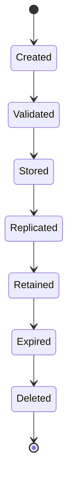
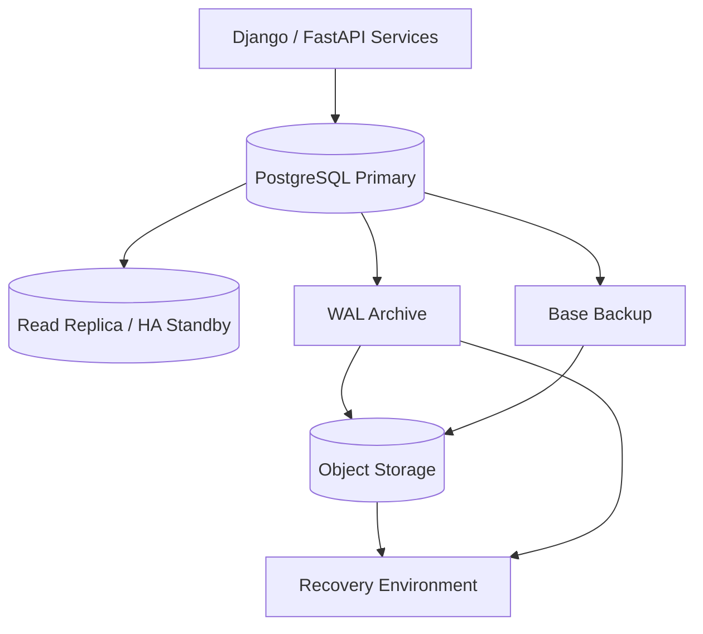

# 16- Database Backups

## Overview

Database backups are a **recovery mechanism**, not a substitute for high availability, replication, or good operational practices.

A production PostgreSQL backup strategy must answer four questions:

1. **What data can be recovered?**
2. **How far back can it be recovered?**
3. **How quickly can it be restored?**
4. **Can the recovery process be trusted under incident conditions?**

A database can have multiple layers of protection:

```text
                    ┌─────────────────────┐
                    │    PostgreSQL       │
                    │     Primary         │
                    └──────────┬──────────┘
                               │
                    ┌──────────▼──────────┐
                    │   WAL Generation    │
                    └───────┬───────┬──────┘
                            │       │
              ┌─────────────▼─┐   ┌▼────────────────┐
              │ Read Replicas │   │ WAL Archive     │
              └───────────────┘   └────────┬────────┘
                                           │
                              ┌────────────▼────────────┐
                              │ Backup/Object Storage   │
                              │ Full + Incremental/WAL  │
                              └────────────┬────────────┘
                                           │
                              ┌────────────▼────────────┐
                              │ Recovery Environment    │
                              │ PITR / Restore Testing  │
                              └─────────────────────────┘
```

The key distinction is:

> **Replication improves availability; backups provide historical recovery.**

If a bad `DELETE`, application bug, ransomware event, or corrupted logical state is replicated immediately to every replica, replicas alone may not provide recovery.

---

## Backup vs Replication vs High Availability

These mechanisms solve different problems.

| Mechanism | Primary Purpose | Historical Recovery | Handles Primary Failure |
|---|---|---:|---:|
| Backup | Data recovery | Yes | Indirectly |
| WAL archive | Point-in-time recovery | Yes | Yes, with restore |
| Read replica | Read scaling / failover | Usually no | Yes |
| Synchronous replica | Reduced data-loss window | No | Yes |
| Multi-AZ HA | Infrastructure availability | No | Yes |
| PITR | Recover to a specific time | Yes | Yes |

A production architecture normally uses several of these together.

---

## Recovery Objectives

Two core recovery objectives define backup requirements.

### RPO

**Recovery Point Objective (RPO)** describes how much data loss is acceptable.

Example:

```text
RPO = 5 minutes
```

means the recovery design should aim to lose no more than approximately five minutes of committed data under the defined failure scenario.

### RTO

**Recovery Time Objective (RTO)** describes how long recovery can take.

Example:

```text
RTO = 30 minutes
```

means the system should be restored to the required operational state within approximately 30 minutes.

These objectives should drive backup architecture rather than being selected after the architecture already exists.

---

## Backup Types

PostgreSQL environments commonly use several backup mechanisms.

| Backup Type | Typical Use |
|---|---|
| Logical backup | Selective export, migration, portability |
| Physical base backup | Full PostgreSQL cluster recovery |
| WAL archive | Point-in-time recovery |
| Snapshot | Infrastructure-level recovery |
| Continuous backup | Low RPO and PITR |
| Replica | Availability and operational continuity |

No single mechanism is ideal for every recovery scenario.

---

## Logical Backups

Logical backups contain database objects and data in a logical representation.

For PostgreSQL:

```bash
pg_dump -Fc -d appdb -f appdb.dump
```

Restore with:

```bash
createdb appdb_restore

pg_restore \
  --dbname=appdb_restore \
  --jobs=4 \
  appdb.dump
```

For a complete cluster containing multiple databases and cluster-wide roles, `pg_dumpall` can be useful, although physical backups are generally more appropriate for full-cluster recovery.

### Advantages

- Portable.
- Useful for migrations.
- Can restore selected objects.
- Useful for development/test environments.
- Independent of the original physical storage layout.

### Limitations

- Full logical restore can be slow for large databases.
- Does not provide continuous PITR by itself.
- Large databases may require substantial restore time.
- Backup and restore throughput depends heavily on object structure and storage.

Logical backups should complement rather than replace physical backup and WAL strategies for critical production databases.

---

## Physical Backups

A physical backup captures PostgreSQL's database files in a form suitable for physical recovery.

A typical architecture is:

```text
PostgreSQL
    │
    ├── Base Backup
    │
    └── WAL Archive
             │
             ▼
      Backup Storage
             │
             ▼
       Recovery Host
```

Physical backup tooling can include PostgreSQL-native mechanisms such as `pg_basebackup` and production backup systems built around PostgreSQL's base-backup and WAL APIs.

Example:

```bash
pg_basebackup \
  -h primary-db.internal \
  -U backup_user \
  -D /backup/base \
  -Fp \
  -Xs \
  -P
```

The exact authentication and transport configuration should be designed specifically for the production environment.

---

## WAL and Point-in-Time Recovery

PostgreSQL writes changes to the **Write-Ahead Log (WAL)** before the corresponding data pages are considered durable.

WAL therefore provides the foundation for continuous recovery.

A simplified flow is:

```text
Transaction
    ↓
WAL record
    ↓
WAL archive
    ↓
Base backup + WAL
    ↓
Recovery
    ↓
Replay WAL
    ↓
Desired database state
```

With an appropriate base backup and continuous WAL archive, PostgreSQL can support **Point-in-Time Recovery (PITR)**.

---

## Point-in-Time Recovery

PITR allows recovery to a specific point before an incident.

Example:

```text
09:00  Normal operation
10:00  Application deployment
10:15  Bug introduced
10:30  Bad DELETE executed
10:45  Incident detected
```

Instead of restoring only to the latest backup:

```text
Latest backup
    ↓
Restore
```

PITR can reconstruct the database to a selected point:

```text
Base backup
    ↓
Replay WAL
    ↓
Stop at 10:29:59
    ↓
Recovered database
```

This can dramatically reduce data loss compared with periodic logical dumps.

---

## Why Replicas Are Not Backups

Consider:

```text
Primary
   │
   ├── UPDATE
   ├── DELETE
   └── Corruption
          │
          ▼
       Replica
```

Replication normally reproduces committed changes.

If an administrator accidentally executes:

```sql
DELETE FROM customers;
```

the destructive change can reach replicas.

Therefore:

```text
Replica ≠ Backup
```

A backup system should provide an independent recovery path and historical retention.

---

## Backup Retention

Retention determines how far back historical recovery is possible.

Example:

| Backup | Retention |
|---|---:|
| Daily backup | 30 days |
| Weekly backup | 12 weeks |
| Monthly backup | 12 months |
| WAL archive | 7–30 days |
| Compliance archive | Policy-dependent |

Retention should reflect:

- Business requirements.
- Regulatory requirements.
- Recovery scenarios.
- Storage cost.
- Data sensitivity.
- Legal retention requirements.

Long retention without lifecycle management can create substantial storage costs.

---

## Backup Storage

Production backups should generally be stored outside the primary database host.

A common AWS architecture is:

```text
PostgreSQL
    │
    ▼
Backup System
    │
    ▼
Amazon S3
    │
    ├── Versioning
    ├── Encryption
    ├── Lifecycle Policies
    └── Restricted IAM
```

For managed PostgreSQL services such as Amazon RDS or Aurora PostgreSQL, native automated backups, snapshots, and PITR capabilities should be evaluated before building a custom backup pipeline.

---

## Backup Isolation

Backups should not depend on the same failure domain as the database.

Avoid:

```text
Primary DB
    +
Backups
    ↓
Same disk / same host
```

A better design is:

```text
Primary Database
       │
       ▼
Independent Backup Storage
       │
       ├── Different failure domain
       ├── Restricted access
       └── Separate retention controls
```

For high-value systems, consider:

- Cross-account backup copies.
- Cross-region copies.
- Object-lock or immutable retention where appropriate.
- Separate administrative access.
- Separate encryption-key controls.
- Offline or logically isolated recovery copies.

---

## Backup Security

A backup contains the database's data and must therefore be treated as highly sensitive.

Protect:

- Customer data.
- Credentials stored in tables.
- Tokens.
- Personal information.
- Encryption-related material.
- Internal operational data.

Security controls should include:

- Encryption at rest.
- Encryption in transit.
- Strong IAM.
- Least privilege.
- Restricted backup deletion.
- Audit logging.
- Retention controls.
- Key management.
- Recovery access controls.

A secure production database with publicly accessible backups is still a security failure.

---

## Encryption at Rest

Backups should be encrypted using a controlled key-management strategy.

On AWS, this commonly involves:

```text
Database
   ↓
Encrypted backup
   ↓
S3 / managed backup storage
   ↓
KMS-managed encryption
```

For sensitive systems, consider who can:

```text
Read backup
Restore backup
Delete backup
Modify retention
Use encryption key
```

These privileges do not necessarily need to belong to the same administrative role.

---

## Encryption in Transit

Backup data moving between:

```text
Database → Backup system
Backup system → Object storage
Object storage → Recovery host
```

should use encrypted transport.

For PostgreSQL-native backup tooling, configure TLS appropriately and verify certificates rather than merely enabling encryption.

Network security should complement TLS:

- Private subnets.
- Security groups.
- Restricted firewall rules.
- Private endpoints where appropriate.
- No unnecessary public database exposure.

---

## Backup IAM Model

A useful production model separates responsibilities.

| Role | Responsibility |
|---|---|
| Application role | Normal application access |
| Backup role | Read data required for backup |
| Recovery operator | Restore and recovery |
| Storage administrator | Backup storage management |
| Security administrator | Audit and key management |
| Break-glass role | Emergency privileged recovery |

The application runtime role should not normally be able to delete production backups.

---

## Backup Credentials

Backup credentials should be treated as production secrets.

Avoid:

```text
backup_password = "production-password"
```

inside:

- Git repositories.
- Docker images.
- Source code.
- CI logs.
- Shell scripts committed to repositories.

Prefer:

- AWS IAM roles where supported.
- AWS Secrets Manager.
- Short-lived credentials.
- Kubernetes workload identity.
- Restricted backup-specific PostgreSQL roles.

---

## PostgreSQL Backup Role

A dedicated backup identity is preferable to using a superuser for every backup operation.

The exact privileges depend on the backup method and PostgreSQL version.

For physical backups, configure the role according to PostgreSQL's replication/backup requirements and grant only the capabilities required by the backup mechanism.

For example, inspect role configuration:

```sql
SELECT
    rolname,
    rolsuper,
    rolreplication,
    rolcanlogin
FROM pg_roles
WHERE rolname = 'backup_user';
```

Do not assume that `SUPERUSER` is necessary simply because a backup operation is privileged.

---

## Backup Lifecycle

A production backup should have a lifecycle:



Important stages include:

1. Create.
2. Validate.
3. Store.
4. Replicate where required.
5. Retain.
6. Test recovery.
7. Expire according to policy.
8. Delete securely.

A backup that exists but cannot be restored is not a reliable backup.

---

## Backup Verification

Do not measure backup health only by:

```text
backup_job = SUCCESS
```

Verification should include:

- Backup artifact exists.
- Expected size is reasonable.
- WAL continuity is intact where applicable.
- Backup metadata is valid.
- Backup can be accessed using recovery credentials.
- Restore can complete.
- Recovered database passes application-level validation.

For critical systems, perform scheduled restoration tests.

---

## Restore Testing

The most important backup test is a restore.

A realistic restore test should validate:

```text
Backup
  ↓
Recovery environment
  ↓
PostgreSQL starts
  ↓
Database becomes accessible
  ↓
Schema is valid
  ↓
Expected records exist
  ↓
Application health checks pass
```

For example:

```bash
pg_restore \
  --dbname=recovery_db \
  --jobs=4 \
  /backup/appdb.dump
```

Then run validation queries:

```sql
SELECT count(*) FROM customers;
SELECT count(*) FROM orders;
SELECT max(created_at) FROM orders;
```

Application-level checks are even more valuable because a technically valid PostgreSQL restore can still contain unexpected logical state.

---

## Recovery Validation

A senior-level recovery test validates more than database startup.

Verify:

### Database

- PostgreSQL starts.
- Required databases exist.
- Required roles exist.
- Extensions are available.
- Tables and indexes exist.
- Constraints are present.

### Application

- Django migrations are compatible.
- FastAPI services can connect.
- Background workers can start.
- Required environment configuration exists.

### Infrastructure

- DNS works.
- Network routes work.
- Security groups permit required traffic.
- Secrets are available.
- Monitoring is operational.

### Business Data

- Critical records exist.
- Recent transactions are present within the expected RPO.
- Referential integrity holds.
- Application invariants remain valid.

---

## Recovery Environment

A dedicated recovery environment is valuable for testing and incident response.

```text
Backup Storage
      │
      ▼
Recovery Environment
      │
      ├── PostgreSQL
      ├── Application
      ├── Validation Jobs
      └── Monitoring
```

The recovery environment should be isolated from production.

Avoid restoring sensitive production data into an uncontrolled developer environment.

---

## Restoring Production Data to Non-Production

Production backups can contain:

- Personal information.
- Credentials.
- Tokens.
- Internal business data.

Therefore:

```text
Production backup
      ↓
Non-production
```

should not automatically mean:

```text
Production data → Developer laptop
```

Prefer:

- Restricted recovery environments.
- Data masking.
- Token invalidation.
- Access controls.
- Encryption.
- Auditing.
- Limited retention.

A restore procedure should explicitly define how sensitive data is handled.

---

## Backup and Schema Migrations

Database migrations affect recoverability.

Consider:

```text
Application version A
        ↓
Migration
        ↓
Application version B
```

If a backup is restored, the recovered database may correspond to an earlier schema version.

Use backward-compatible migration strategies such as:

```text
Expand
  ↓
Deploy compatible application
  ↓
Backfill
  ↓
Switch reads/writes
  ↓
Contract
```

Do not assume every database backup can be restored directly into the latest application version.

Recovery procedures should document the compatible application and schema versions.

---

## Backup and Redis

Redis should not be treated as an automatic replacement for durable PostgreSQL backups.

If PostgreSQL is the source of truth:

```text
PostgreSQL
   ↓
Durable state

Redis
   ↓
Cache / ephemeral state
```

After database recovery, Redis may need to be:

- Flushed.
- Rebuilt.
- Rehydrated.
- Allowed to expire stale values.

A recovery runbook should define cache behavior explicitly.

---

## Backup and Kafka

Kafka introduces another recovery dimension.

Suppose:

```text
PostgreSQL
     ↑
Kafka consumer
```

After restoring PostgreSQL, the consumer offset and database state must be consistent.

Potential recovery strategies include:

- Replaying events from a known offset.
- Rebuilding derived tables.
- Reprocessing an event range.
- Resetting consumer offsets.
- Using idempotent consumers.

Database recovery and event-stream recovery should therefore be designed together for event-driven architectures.

---

## Backup and Celery

Celery jobs may execute against restored data.

After recovery, determine whether queued tasks:

- Can safely be replayed.
- Should be discarded.
- Need deduplication.
- Depend on external systems.
- Require idempotency.

For example:

```text
Database restored
      ↓
Old Celery task executes
      ↓
Duplicate side effect
```

can cause problems if task processing is not idempotent.

---

## Backup and External Side Effects

A database restore does not roll back external systems.

For example:

```text
Database
   ↓
Payment API
   ↓
Payment succeeds
```

If the database is restored to an earlier point, the external payment system does not automatically revert.

The same applies to:

- Email.
- SMS.
- Payment processors.
- Object storage.
- Kafka.
- External APIs.

Recovery planning must account for side effects outside PostgreSQL.

---

## Point-in-Time Recovery and Commit Uncertainty

A recovery target represents a database state at a particular point in time.

External systems may have progressed differently.

For critical workflows, maintain:

- Idempotency keys.
- Transaction identifiers.
- Audit events.
- Reconciliation processes.

This allows the application to identify operations that occurred externally but may no longer be represented in the recovered database state.

---

## Backup Monitoring

A production backup dashboard should include:

| Metric | Why It Matters |
|---|---|
| Last successful backup | Basic freshness |
| Backup age | RPO compliance |
| Backup duration | Capacity and regression |
| Backup size | Growth detection |
| WAL archive freshness | PITR health |
| WAL archive failures | Recovery risk |
| Storage utilization | Capacity |
| Restore-test success | Actual recoverability |
| Restore duration | RTO |
| Backup job failures | Immediate operational signal |

Alerting should be based on business recovery objectives rather than arbitrary schedules.

---

## Backup Monitoring Example

A useful operational report can track:

```text
Database: production
Latest base backup: 2026-09-04 02:00 UTC
Latest WAL archived: 2026-09-04 18:57 UTC
Configured RPO: 15 minutes
Latest restore test: 2026-09-01
Observed restore time: 18 minutes
Configured RTO: 30 minutes
```

This is much more useful than:

```text
Backup: OK
```

---

## Backup Failure Modes

Common failure modes include:

| Failure | Impact | Mitigation |
|---|---|---|
| Backup job fails | Recovery point becomes stale | Alert and retry |
| WAL archive stops | PITR window develops a gap | Monitor continuously |
| Storage fills | Backup failure | Capacity alerts/lifecycle |
| Credentials expire | Backup failure | Rotation and testing |
| Encryption key unavailable | Recovery blocked | Key management and recovery plan |
| Backup deleted | Historical recovery lost | Immutable/cross-account copies |
| Restore is too slow | RTO violation | Regular restore testing |
| Backup is corrupt | Recovery failure | Validation and restore tests |
| Schema incompatible | Application cannot start | Version-aware recovery |
| External side effects diverge | Business inconsistency | Idempotency/reconciliation |

---

## Backup Failures Should Page

A backup failure is not always an immediate production outage, but repeated failures can silently increase recovery risk.

Alert on conditions such as:

```text
No successful backup within RPO window
No recent WAL archive
Backup storage unavailable
Restore test failure
Backup retention policy violation
```

Avoid alerting only on individual transient failures if the backup system has safe retries.

The important condition is whether the recovery objective is being violated.

---

## Backup Architecture for PostgreSQL

A practical production architecture can look like:



For AWS, the object-storage layer may be implemented using Amazon S3 or a managed backup service, depending on the database deployment model.

---

## AWS Managed PostgreSQL

For Amazon RDS or Aurora PostgreSQL, evaluate native capabilities first.

Typical capabilities include:

- Automated backups.
- Point-in-time recovery.
- Manual snapshots.
- Multi-AZ deployment.
- Cross-region recovery options depending on service/configuration.
- Encryption through AWS KMS.

Managed services reduce operational burden but do not remove the need for:

- Recovery testing.
- IAM design.
- Retention planning.
- RPO/RTO validation.
- Application-level recovery procedures.

---

## Kubernetes and Database Backups

Running PostgreSQL on Kubernetes introduces additional operational responsibility.

A production architecture should avoid assuming that:

```text
PersistentVolume
```

is equivalent to:

```text
Backup
```

A volume protects against some infrastructure failures but does not necessarily protect against:

- Accidental deletion.
- Logical corruption.
- Application bugs.
- Malicious changes.
- Cluster-wide failures.

Use database-aware backup tooling and independently stored backup artifacts.

---

## Docker Considerations

Containers are ephemeral.

Do not design a database backup strategy around the container filesystem.

Bad:

```text
PostgreSQL container
       ↓
Local container backup
```

Better:

```text
PostgreSQL
    ↓
Backup system
    ↓
Durable external storage
```

Persistent database storage and independent backup storage serve different purposes.

---

## CI/CD Considerations

CI/CD pipelines can interact with production backups during:

- Migration deployment.
- Restore testing.
- Disaster recovery exercises.
- Database cloning.
- Environment provisioning.

Protect pipelines carefully.

Avoid giving normal deployment pipelines unrestricted permission to:

```text
Delete backups
Change retention
Disable backup policies
Use production recovery credentials
```

Use separate identities and approval boundaries for destructive recovery operations.

---

## Backup Automation

A production backup system should automate:

```text
Backup
  ↓
Validation
  ↓
Storage
  ↓
Retention
  ↓
Monitoring
  ↓
Restore testing
```

Avoid relying on an engineer remembering:

```bash
pg_dump production
```

every Friday.

Manual commands are useful for investigation and ad hoc exports, but critical recovery should be automated and observable.

---

## Backup Runbook

A production recovery runbook should contain:

### Before Recovery

- Incident scope.
- Recovery objective.
- Target recovery timestamp.
- Latest valid backup.
- WAL availability.
- Required credentials.
- Recovery environment.
- Application compatibility.

### During Recovery

- Stop conflicting application writes.
- Restore base backup.
- Replay WAL.
- Stop at the selected recovery target.
- Validate database state.
- Validate critical business records.

### After Recovery

- Redirect application traffic.
- Rebuild or invalidate caches.
- Reconcile Kafka/Celery state.
- Validate external side effects.
- Monitor errors and latency.
- Preserve incident evidence.

---

## Disaster Recovery Testing

A mature organization periodically performs recovery exercises.

A recovery exercise should measure:

```text
Expected RPO
vs
Actual recovered point

Expected RTO
vs
Actual recovery duration
```

Track:

- Backup discovery time.
- Recovery setup time.
- Restore duration.
- WAL replay duration.
- Application startup time.
- Validation time.
- DNS/traffic-switch time.

The result should produce concrete engineering improvements.

---

## Backup Security Checklist

- [ ] Backups encrypted at rest.
- [ ] Backup transport encrypted.
- [ ] Backup storage is access-controlled.
- [ ] Backup deletion requires elevated authorization.
- [ ] Backup credentials are not hard-coded.
- [ ] Backup storage is isolated from production.
- [ ] Sensitive restore environments are protected.
- [ ] Encryption keys have appropriate access controls.
- [ ] Backup access is audited.
- [ ] Retention and deletion policies are enforced.
- [ ] Immutable or isolated copies exist for critical workloads.

---

## Backup Production Checklist

### Recovery Objectives

- [ ] RPO is explicitly defined.
- [ ] RTO is explicitly defined.
- [ ] Backup retention matches business requirements.
- [ ] Recovery procedures are documented.

### Backup Pipeline

- [ ] Base backups succeed.
- [ ] WAL archiving succeeds.
- [ ] Backup storage has sufficient capacity.
- [ ] Backup failures generate alerts.
- [ ] Backup freshness is monitored.

### Recovery

- [ ] Restore tests run periodically.
- [ ] PITR has been tested.
- [ ] Recovery duration is measured.
- [ ] Application compatibility is validated.
- [ ] External side effects are addressed.
- [ ] Redis/Kafka/Celery recovery behavior is documented.

### Security

- [ ] Least-privilege backup roles exist.
- [ ] Backup storage is encrypted.
- [ ] Backup deletion is restricted.
- [ ] Cross-account or isolated copies exist where required.
- [ ] Production data is protected during restore testing.

---

## Common Mistakes and Pitfalls

### Treating a Replica as a Backup

Replication can reproduce logical corruption.

**Avoid it:** maintain independent historical backups.

### Never Testing a Restore

A successful backup job does not prove recoverability.

**Avoid it:** perform scheduled restore tests.

### Ignoring WAL Archive Failures

A base backup may exist while the required WAL chain is incomplete.

**Avoid it:** monitor WAL archive freshness and continuity.

### Storing Backups on the Database Host

A host failure can destroy both the database and backup.

**Avoid it:** use independent durable storage.

### Giving Developers Production Backup Access

Backups contain production data and can become a data-exfiltration path.

**Avoid it:** use restricted recovery environments and masked datasets.

### Using Superuser Credentials Everywhere

Backup scripts often accumulate excessive privileges.

**Avoid it:** create purpose-specific identities.

### Forgetting External Side Effects

Restoring PostgreSQL does not undo a payment, email, Kafka event, or external API call.

**Avoid it:** design idempotency and reconciliation into recovery procedures.

### Ignoring Restore Duration

A backup may satisfy RPO while violating RTO.

**Avoid it:** measure actual restore time at production-scale data volume.

### Assuming Snapshots Solve Every Problem

Infrastructure snapshots do not necessarily provide logical or historical recovery.

**Avoid it:** combine snapshots with database-aware backup and PITR mechanisms.

### Restoring Production Data Directly to Developer Machines

This can create serious security and privacy exposure.

**Avoid it:** use controlled recovery environments and sanitization.

---

## Interview Traps

### "Are Read Replicas Backups?"

No. Replicas primarily provide availability and read scaling. Logical corruption can be replicated to them.

### "What Does PITR Require?"

A suitable base backup plus a continuous, usable WAL archive covering the desired recovery point.

### "What Is the Difference Between RPO and RTO?"

RPO describes acceptable data loss; RTO describes acceptable recovery duration.

### "Why Test Restore If Backups Are Successful?"

Because backup creation and recovery are different operations. Corruption, missing WAL, permissions, encryption-key problems, incompatible schemas, or slow restoration may only become visible during recovery.

### "Why Is WAL Important for Backups?"

WAL records database changes and enables replay from a base backup toward a desired recovery point.

### "Can S3 Backups Alone Guarantee Recovery?"

No. Storage durability is only one part of recovery. You still need valid backup artifacts, usable WAL, credentials, keys, compatible infrastructure, restore procedures, and tested recovery.

### "Why Is Cross-Region Backup Useful?"

It protects against regional infrastructure failures and can improve disaster recovery options, although it introduces additional storage, transfer, security, and operational costs.

### "What Happens to Redis After Database Recovery?"

It depends on the architecture. If Redis is a cache, it may be safely invalidated and rebuilt. If Redis contains authoritative state, it requires its own recovery strategy.

### "What Is a Good Backup Strategy for a Large PostgreSQL Database?"

Typically combine physical base backups, continuous WAL archiving, appropriate retention, independent storage, monitoring, and regularly tested PITR rather than relying exclusively on frequent logical dumps.

---

## Key Takeaways

- **Backups, replication, and HA solve different problems:** replicas improve availability, while independent historical backups provide protection against logical corruption and enable recovery.
- **RPO and RTO should drive backup architecture:** backup frequency, WAL retention, storage design, and restore procedures must be measured against explicit recovery objectives.
- **PITR depends on both a valid base backup and usable WAL:** monitoring backup freshness and WAL continuity is essential for trustworthy recovery.
- **A backup is only valuable if it can be restored:** regularly test full restores and PITR at realistic production data volumes and measure actual RTO.
- **Recovery is a system-wide operation:** PostgreSQL, Redis, Kafka, Celery, application versions, secrets, infrastructure, external side effects, security controls, and reconciliation procedures must all be considered.