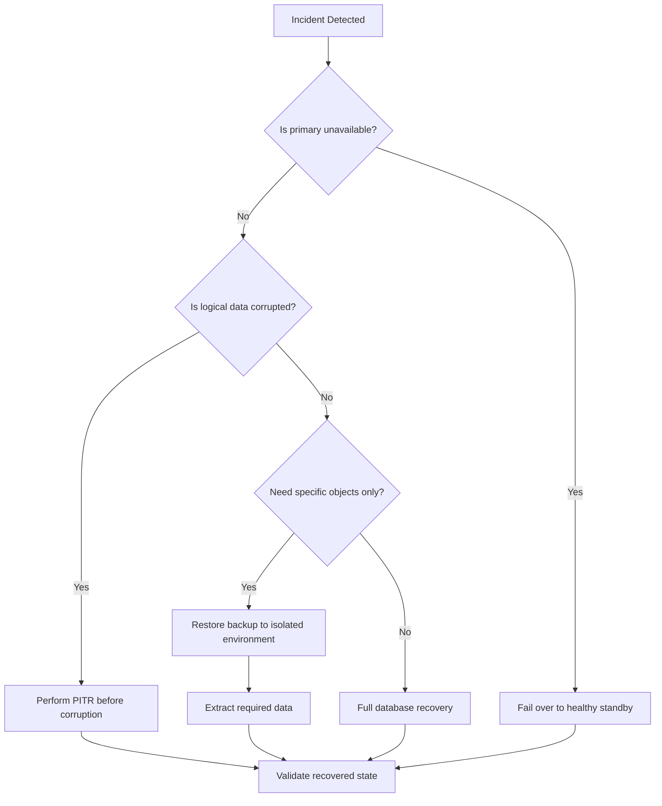

# 17- Restore and Recovery

## Overview

Database restore and recovery is the operational process of turning a backup strategy into an actual recovered system.

A backup answers:

> "Do we have a copy of the data?"

Recovery answers:

> "Can we reconstruct a usable database state within the required RPO and RTO?"

For PostgreSQL production systems, recovery can involve:

- Restoring a physical base backup.
- Restoring a logical backup.
- Replaying WAL.
- Performing point-in-time recovery (PITR).
- Recovering after infrastructure failure.
- Recovering after accidental data deletion.
- Rebuilding a failed primary.
- Re-establishing replication.
- Reconciling application state and external side effects.

The recovery path should be designed before an incident occurs.


---

## Recovery Objectives

Recovery design starts with **RPO** and **RTO**.

### Recovery Point Objective

RPO defines the maximum acceptable amount of data loss.

For example:

```text
RPO = 15 minutes
```

means the organization accepts a recovery point potentially up to approximately 15 minutes behind the failure, depending on the exact failure scenario and backup architecture.

### Recovery Time Objective

RTO defines the maximum acceptable recovery duration.

```text
RTO = 30 minutes
```

means the service should be restored within approximately 30 minutes.

| Requirement | Question |
|---|---|
| RPO | How much committed data can we lose? |
| RTO | How long can recovery take? |
| Retention | How far back can we recover? |
| Recovery target | Which database state should be restored? |
| Validation | How do we know the recovered state is correct? |

A backup strategy that meets RPO but takes two hours to restore does not meet a 30-minute RTO.

---

## Recovery Scenarios

Different failures require different recovery strategies.

| Scenario | Typical Recovery |
|---|---|
| Database host failure | Fail over to HA standby |
| Primary corruption | Fail over or rebuild from backup |
| Accidental row deletion | PITR or targeted logical recovery |
| Bad deployment | PITR or application rollback |
| Dropped table | PITR / restore to separate environment |
| Regional outage | Cross-region recovery |
| Ransomware | Isolated/immutable backup recovery |
| Replica failure | Rebuild replica |
| Complete cluster loss | Base backup + WAL recovery |
| Developer data export | Logical restore into controlled environment |

Do not automatically restore the entire production database for every incident.

---

## Recovery Strategy Selection

A useful decision process is:



The correct strategy depends on whether the problem is:

- Availability.
- Infrastructure failure.
- Logical corruption.
- Accidental modification.
- Security incident.
- Regional disaster.

---

## Recovery from a Physical Base Backup

Physical recovery reconstructs the PostgreSQL cluster from database files and WAL.

A simplified process is:

```text
Base Backup
    ↓
Restore PostgreSQL files
    ↓
Configure recovery
    ↓
Replay WAL
    ↓
Reach recovery target
    ↓
Promote recovered instance
```

The exact recovery configuration depends on PostgreSQL version and the backup tooling being used.

The important architectural requirement is that the base backup and WAL archive form a usable recovery chain.

---

## Point-in-Time Recovery

PITR is one of the most important PostgreSQL recovery techniques.

Suppose:

```text
10:00  Normal operation
10:20  Bad deployment
10:25  Corruption begins
10:40  Incident detected
```

The goal may be:

```text
Recover database
       ↓
Replay WAL
       ↓
Stop before 10:20
       ↓
Validate
```

rather than recovering to the latest available state containing the corruption.

PITR is particularly useful for:

- Accidental deletes.
- Incorrect updates.
- Bad migrations.
- Application bugs.
- Logical corruption.
- Administrative mistakes.

---

## Recovery Target Selection

The recovery target is a critical decision.

Possible targets include:

- Timestamp.
- Transaction ID.
- Named recovery target.
- Immediate recovery.
- Latest available WAL.

Timestamp-based recovery is often operationally intuitive:

```text
Target:
2026-09-04 10:19:59 UTC
```

The selected point must be based on evidence from:

- Application logs.
- Audit logs.
- Database logs.
- Deployment records.
- Monitoring.
- Incident timelines.

Do not arbitrarily select "five minutes before detection" without understanding when corruption actually began.

---

## Recovering to a Separate Environment

For destructive incidents, it is often safer to recover into a separate PostgreSQL instance first.

```text
Production Backup
       │
       ▼
Recovery PostgreSQL
       │
       ├── Inspect data
       ├── Validate schema
       ├── Extract records
       └── Compare with production
```

This avoids immediately replacing production with a potentially incorrect recovery point.

For example, after an accidental deletion:

```text
Production
    ↓
Recover to isolated database
    ↓
Find missing rows
    ↓
Validate relationships
    ↓
Generate controlled repair
    ↓
Apply repair to production
```

This is often safer than full production rollback.

---

## Targeted Data Recovery

Suppose an engineer accidentally executes:

```sql
DELETE FROM orders
WHERE created_at >= '2026-09-04 10:00:00';
```

A full production rollback could remove legitimate transactions created after the incident.

Instead:

1. Recover the database to an isolated environment.
2. Identify the affected records.
3. Validate relationships and dependencies.
4. Export only the required records.
5. Restore them through a controlled operation.
6. Reconcile application state.

This minimizes collateral rollback.

---

## Logical Restore

Logical backups can be restored using tools such as `pg_restore`.

Example:

```bash
createdb recovery_db

pg_restore \
  --dbname=recovery_db \
  --jobs=4 \
  /backup/appdb.dump
```

Logical restore is useful for:

- Selective object recovery.
- Development environments.
- Migration between PostgreSQL environments.
- Smaller databases.
- Targeted recovery.

It is usually not the fastest mechanism for recovering very large production databases.

---

## Selective Logical Recovery

A logical dump can sometimes be inspected or restored selectively.

For example:

```bash
pg_restore \
  --list \
  /backup/appdb.dump
```

This helps identify objects contained in a dump before performing the restore.

A production recovery workflow should avoid blindly restoring an entire backup when only one table or schema is required.

---

## Physical vs Logical Recovery

| Characteristic | Physical Recovery | Logical Recovery |
|---|---|---|
| Large database recovery | Strong | Often slower |
| PITR | Yes | No by itself |
| Object-level recovery | Limited | Strong |
| Portability | Lower | Higher |
| Full-cluster recovery | Strong | More involved |
| Selective restoration | Limited | Strong |
| WAL replay | Yes | No |
| Typical use | DR / full recovery | Object/data recovery |

Production systems often need both approaches.

---

## Recovery from a Failed Primary

High availability and recovery overlap but are not identical.

If a primary fails:

```text
Application
    ↓
Primary ❌
    ↓
Healthy standby
    ↓
Promote
    ↓
Application reconnects
```

If the standby is sufficiently current, failover may be faster than restoring from backup.

However, the failed primary may have acknowledged transactions that were not replicated depending on the replication mode and failure timing.

This is why RPO must be defined for each failure scenario.

---

## Failover vs Restore

| Situation | Prefer |
|---|---|
| Primary host failure | HA failover |
| AZ failure | HA failover |
| Database logical corruption | Backup/PITR |
| Accidental delete | PITR + targeted recovery |
| Regional disaster | Cross-region recovery |
| Replica corruption | Rebuild replica |
| Security compromise | Isolated recovery |

The presence of an HA standby does not eliminate the need for backups.

---

## Recovery from a Bad Migration

Database migrations require special care because schema changes can be difficult to reverse.

Suppose:

```text
Deployment
    ↓
Migration
    ↓
Application errors
```

Do not immediately assume:

```text
Rollback migration
```

is safe.

A migration may have:

- Dropped data.
- Changed data types.
- Modified constraints.
- Created irreversible transformations.
- Triggered long-running operations.

A safer approach is often:

```text
Stop faulty deployment
        ↓
Assess database state
        ↓
Determine whether schema rollback is safe
        ↓
Recover data if required
        ↓
Deploy compatible application version
```

For destructive schema changes, expand-and-contract migrations significantly improve recovery options.

---

## Recovery and Application Versions

A recovered database may correspond to an earlier application schema.

For example:

```text
Backup
  ↓
Schema version 42

Current production
  ↓
Schema version 47
```

The current application may not work correctly against the restored database.

Recovery procedures should therefore record:

- Database schema version.
- Application version.
- Migration state.
- Required extensions.
- Configuration version.
- Compatibility requirements.

---

## Recovery and Django

Django migrations are part of the database recovery state.

Inspect migration state with:

```bash
python manage.py showmigrations
```

After recovery, verify:

- Migration history.
- Expected schema.
- Application version compatibility.
- Required database extensions.
- Database constraints.
- Data migrations.

Do not blindly run:

```bash
python manage.py migrate
```

against a recovered production database until the recovery plan confirms that the migration state is correct.

---

## Recovery and FastAPI

FastAPI itself does not manage database recovery.

The recovery process should validate:

- SQLAlchemy/psycopg connectivity.
- Schema compatibility.
- Configuration.
- Secrets.
- Connection pool settings.
- Background worker compatibility.
- Application startup health checks.

The application layer should remain version-compatible with the recovered database.

---

## Recovery and Connection Pools

After failover or restoration, existing application connections may point to:

- The failed primary.
- An old network endpoint.
- A promoted standby.
- A recovered database with a different identity.

Applications should be designed to:

- Detect broken connections.
- Reconnect.
- Respect connection timeouts.
- Use stable database endpoints.
- Avoid reconnect storms.

Connection pools should not preserve stale connections indefinitely after a database topology change.

---

## Recovery and Redis

Redis recovery depends on its role.

If Redis is a cache:

```text
PostgreSQL recovered
       ↓
Invalidate Redis
       ↓
Rebuild cache
```

This is often safer than trying to make the cache authoritative.

If Redis contains durable application state, it requires its own backup and recovery design.

Never assume PostgreSQL recovery automatically restores Redis state.

---

## Recovery and Kafka

Event-driven systems require additional recovery planning.

Consider:

```text
Kafka
  ↓
Consumer
  ↓
PostgreSQL
```

After PostgreSQL recovery, Kafka offsets may no longer correspond to the restored database state.

Possible approaches include:

- Replay events.
- Reset consumer offsets.
- Rebuild derived tables.
- Reprocess an event range.
- Use idempotent consumers.
- Reconcile database state with event state.

The correct strategy depends on whether Kafka is the source of truth or an integration/event stream.

---

## Recovery and Celery

Celery tasks may have been queued before the database incident.

After recovery, determine:

- Which tasks were already executed.
- Which tasks remain queued.
- Which tasks can be safely replayed.
- Which tasks have external side effects.
- Which tasks require deduplication.

Idempotency is especially important:

```text
Task
  ↓
Database operation
  ↓
External side effect
```

A replayed task should not unintentionally duplicate the external operation.

---

## External Side Effects

Database recovery cannot roll back external systems.

Examples:

```text
PostgreSQL → Payment provider
PostgreSQL → Email provider
PostgreSQL → Kafka
PostgreSQL → Object storage
PostgreSQL → External API
```

If PostgreSQL is restored to an earlier point, these systems may remain at their original state.

Recovery therefore requires:

- Idempotency keys.
- Audit records.
- Reconciliation.
- Duplicate detection.
- Manual review for high-risk operations.

---

## Recovery Validation

Recovery should never stop when PostgreSQL starts successfully.

Validation should occur at multiple levels.

### Infrastructure

- Instance is reachable.
- Storage is healthy.
- Network connectivity works.
- Security groups are correct.
- DNS is correct.

### Database

- PostgreSQL accepts connections.
- Required databases exist.
- Required roles exist.
- Extensions are installed.
- Tables exist.
- Constraints exist.
- Indexes exist.

### Data

- Critical tables contain expected data.
- Referential integrity holds.
- Recent transactions match the expected recovery point.
- Important business invariants hold.

### Application

- API starts.
- Database connections work.
- Background workers start.
- Health checks pass.
- Critical API paths work.

---

## Recovery Validation Queries

Example checks:

```sql
SELECT current_database();

SELECT version();

SELECT count(*) FROM customers;

SELECT count(*) FROM orders;

SELECT max(created_at) FROM orders;

SELECT *
FROM pg_extension
ORDER BY extname;
```

For production recovery, define business-specific validation queries rather than relying exclusively on generic database checks.

---

## Data Integrity Validation

A technically valid PostgreSQL cluster can still contain logically incorrect data.

Check:

- Foreign-key relationships.
- Required records.
- Expected counts.
- Aggregate totals.
- State transitions.
- Uniqueness constraints.
- Critical financial totals.
- Tenant isolation.

For example:

```sql
SELECT COUNT(*)
FROM orders o
LEFT JOIN customers c
    ON c.id = o.customer_id
WHERE c.id IS NULL;
```

An unexpected non-zero result could indicate referential integrity problems.

---

## Recovery Validation and RPO

After recovery, determine the actual recovered point.

Example:

```text
Required RPO: 15 minutes

Incident:       10:45
Recovered to:   10:34

Actual data loss window: 11 minutes
```

This satisfies the defined RPO in this example.

The result should be recorded as part of the incident review.

---

## Recovery Validation and RTO

Measure every recovery phase.

```text
Backup discovery       2 min
Recovery provisioning  4 min
Base restore           8 min
WAL replay             5 min
Validation             4 min
Traffic switch         2 min
--------------------------------
Total                  25 min
```

If the target RTO is 20 minutes, the recovery design needs improvement even if the database itself restored successfully.

---

## Recovery Testing

Restore testing should be automated where practical.

A mature process is:

```text
Scheduled backup
      ↓
Automated recovery environment
      ↓
Restore
      ↓
PITR test
      ↓
Validation queries
      ↓
Application smoke tests
      ↓
Measure recovery time
      ↓
Report
```

Track both:

- Recovery correctness.
- Recovery duration.

A recovery procedure that works only when a specific engineer is available is an operational risk.

---

## Recovery Runbook

A production runbook should be executable under pressure.

### Incident Assessment

Record:

- Incident start time.
- Failure type.
- Corruption start time if known.
- Current primary state.
- Replica state.
- Latest valid backup.
- Latest WAL archive.
- Target recovery point.
- Required RPO/RTO.

### Recovery

1. Freeze or control writes where appropriate.
2. Preserve incident evidence.
3. Select recovery target.
4. Provision recovery infrastructure.
5. Restore the appropriate backup.
6. Replay WAL.
7. Validate database state.
8. Validate application compatibility.
9. Redirect traffic.
10. Reconcile dependent systems.
11. Continue monitoring.

The exact sequence varies by incident type.

---

## Protecting Evidence

During security or corruption incidents, avoid destroying useful evidence.

Before destructive recovery operations, preserve:

- Database logs.
- Application logs.
- Audit logs.
- Deployment information.
- Query history where available.
- Backup metadata.
- WAL metadata.
- Cloud audit records.
- Relevant infrastructure events.

Recovery should restore service without unnecessarily destroying information needed for root-cause analysis.

---

## Recovery Access Control

Recovery operations are highly privileged.

Use separate roles for:

- Backup creation.
- Backup storage.
- Recovery.
- Database administration.
- Application deployment.

Recovery credentials should not be broadly available.

A break-glass recovery process should include:

- Strong authentication.
- Approval where appropriate.
- Audit logging.
- Time-limited access.
- Post-incident review.

---

## Recovery Security

A recovery environment can become a data-exfiltration path.

Protect:

- Backup artifacts.
- Recovery instances.
- Temporary restored databases.
- Credentials.
- Encryption keys.
- Logs containing sensitive values.

Avoid:

```text
Production backup
    ↓
Developer laptop
```

Prefer:

```text
Protected backup storage
        ↓
Restricted recovery environment
        ↓
Controlled access
        ↓
Audited extraction
```

---

## Recovery and Encryption Keys

Encrypted backups are useless if the recovery process cannot access the required keys.

Recovery planning must verify:

- Key availability.
- Key permissions.
- Key rotation implications.
- Cross-region key availability.
- Cross-account permissions.
- Break-glass access.

Test encrypted restore paths, not merely unencrypted development restores.

---

## Recovery in AWS

A typical AWS disaster recovery design may look like:

```text
                 Primary Region
        ┌──────────────────────────┐
        │ Application              │
        │ PostgreSQL               │
        │ Redis / Kafka / Workers  │
        └────────────┬─────────────┘
                     │
              Backups / WAL
                     │
                     ▼
        ┌──────────────────────────┐
        │ Durable Backup Storage   │
        └────────────┬─────────────┘
                     │
              Cross-region copy
                     │
                     ▼
             DR Region
        ┌──────────────────────────┐
        │ Recovery PostgreSQL      │
        │ Application              │
        │ Validation               │
        └──────────────────────────┘
```

For managed PostgreSQL services, use the provider's native recovery capabilities where they meet requirements, while still testing the complete application recovery path.

---

## Kubernetes Recovery

If PostgreSQL runs on Kubernetes, recovery includes both database and infrastructure concerns.

Validate:

- Persistent storage.
- StatefulSet configuration.
- Secrets.
- ConfigMaps.
- Network policies.
- Service endpoints.
- DNS.
- Ingress.
- Database operators if used.
- Monitoring.
- Backup credentials.

Do not assume that recreating the PostgreSQL Pod automatically restores the database.

The database's durable state and its backup/recovery state are separate concerns.

---

## Recovery During a Regional Disaster

Regional recovery introduces additional dependencies:

- Backup replication.
- DNS.
- Secrets.
- KMS keys.
- Container images.
- Infrastructure definitions.
- Network configuration.
- Kafka/event streams.
- Object storage.
- External APIs.

A recovery plan should verify that the DR region can actually obtain all required dependencies.

---

## Infrastructure as Code and Recovery

Recovery infrastructure should be reproducible.

Terraform or equivalent infrastructure-as-code can provision:

- VPC/networking.
- Security groups.
- Database infrastructure.
- Monitoring.
- IAM.
- Recovery instances.
- Application infrastructure.

This reduces dependence on manually configured infrastructure during an incident.

However, infrastructure-as-code itself must be backed up and versioned.

---

## Recovery and DNS

A recovered database may use a different endpoint.

Applications should preferably connect through stable service discovery rather than hard-coded instance addresses.

For example:

```text
Application
    ↓
db.internal.example
    ↓
Current PostgreSQL primary
```

After recovery:

```text
db.internal.example
    ↓
Recovered PostgreSQL
```

DNS changes should be designed with appropriate TTLs and tested during disaster recovery exercises.

---

## Recovery and Read Replicas

After a primary recovery or promotion, replicas may need to be:

- Reconfigured.
- Rebuilt.
- Repointed.
- Validated.
- Re-seeded.

Do not assume the old replication topology remains correct after a recovery event.

Verify:

```sql
SELECT pg_is_in_recovery();
```

and inspect replication state on the appropriate nodes.

---

## Recovery and Application Traffic

Do not immediately expose a recovered database to the full production workload.

A safer process is:

```text
Recovered DB
    ↓
Database validation
    ↓
Application smoke test
    ↓
Limited traffic
    ↓
Observe
    ↓
Full traffic
```

Depending on the architecture, traffic can be introduced using:

- Load balancer routing.
- Service discovery.
- DNS.
- Kubernetes rollout controls.
- Application-level routing.

---

## Recovery Rollback

Recovery itself can fail.

For example:

```text
Recovery DB
    ↓
Validation fails
```

Do not repeatedly modify the same recovery environment without preserving the original recovery artifact.

Prefer:

```text
Immutable backup
      ↓
Recovery attempt A
      ↓
Validation

Immutable backup
      ↓
Recovery attempt B
      ↓
Validation
```

This makes recovery attempts reproducible and easier to troubleshoot.

---

## Recovery Monitoring

During recovery, monitor:

| Signal | Purpose |
|---|---|
| Restore progress | Estimate completion |
| WAL replay position | Measure recovery progress |
| Disk usage | Detect capacity problems |
| CPU | Detect bottlenecks |
| Memory | Detect resource pressure |
| I/O latency | Detect storage limitations |
| Database connections | Validate application connectivity |
| Query latency | Detect performance regression |
| Error rate | Validate application behavior |
| Replication state | Validate topology |
| Recovery duration | Measure RTO |

Recovery should have its own observability rather than relying exclusively on normal production dashboards.

---

## Common Recovery Mistakes

### Restoring Without Identifying the Recovery Target

Restoring to the latest backup may also restore the corrupted state.

**Avoid it:** determine when the unwanted change occurred.

### Testing Only Database Startup

PostgreSQL starting does not prove the application can operate correctly.

**Avoid it:** perform database, data, application, and business validation.

### Restoring Directly Over Production

An incorrect recovery point can create additional data loss.

**Avoid it:** recover into an isolated environment first when the incident permits.

### Ignoring WAL Gaps

A valid base backup without the required WAL cannot necessarily reach the desired recovery point.

**Avoid it:** validate WAL availability and continuity.

### Ignoring Application Compatibility

A restored database may have an older schema.

**Avoid it:** identify compatible application and migration versions.

### Forgetting External Systems

A database restore does not roll back payments, messages, emails, or external APIs.

**Avoid it:** reconcile external state.

### Replaying Background Jobs Blindly

Old Celery or Kafka work can produce duplicate effects.

**Avoid it:** use idempotency and controlled replay.

### Not Measuring RTO

A recovery process may work but take too long.

**Avoid it:** measure recovery time during restore tests.

### Using Production Credentials in Recovery Environments

Recovery environments can have broader access than normal application environments.

**Avoid it:** use dedicated recovery credentials and least privilege.

---

## Operational Best Practices

- Maintain documented recovery runbooks.
- Define RPO and RTO per critical workload.
- Automate backup discovery and restore testing.
- Test PITR, not only full restores.
- Restore into isolated environments before destructive production recovery where possible.
- Measure actual recovery time.
- Validate business-critical data.
- Keep recovery infrastructure reproducible.
- Protect backup encryption keys.
- Maintain independent backup copies.
- Audit recovery operations.
- Test regional recovery for critical systems.
- Rebuild caches rather than treating them as authoritative when possible.
- Design Kafka and Celery processing for replay and idempotency.
- Keep application and migration versions compatible with recovery points.

---

## Recovery Checklist

### Before Recovery

- [ ] Incident type identified.
- [ ] RPO and RTO confirmed.
- [ ] Recovery target identified.
- [ ] Backup identified.
- [ ] Required WAL identified.
- [ ] Recovery credentials available.
- [ ] Encryption keys available.
- [ ] Recovery infrastructure available.
- [ ] Application version identified.

### During Recovery

- [ ] Incident evidence preserved.
- [ ] Backup restored.
- [ ] WAL replay completed.
- [ ] Recovery target reached.
- [ ] Database integrity validated.
- [ ] Business data validated.
- [ ] Application compatibility verified.
- [ ] Dependent systems assessed.

### After Recovery

- [ ] Traffic switched safely.
- [ ] Error rates monitored.
- [ ] Query performance monitored.
- [ ] Redis state reconciled.
- [ ] Kafka offsets assessed.
- [ ] Celery tasks assessed.
- [ ] External side effects reconciled.
- [ ] Replicas rebuilt or validated.
- [ ] RPO measured.
- [ ] RTO measured.
- [ ] Incident timeline documented.

---

## Interview Traps

### "Is Failover the Same as Restore?"

No.

Failover moves service to an existing healthy database node. Restore reconstructs database state from backups and potentially WAL.

### "Why Recover to a Separate Database?"

It reduces the risk of making an already-bad incident worse and allows engineers to inspect and extract the required state before modifying production.

### "What Is the Most Important Part of PITR?"

A valid base backup and a usable WAL archive covering the desired recovery point.

### "Why Can a Restore Be Technically Successful but Operationally Failed?"

The database may start while:

- Business data is incorrect.
- The schema is incompatible.
- External state is inconsistent.
- Recovery took longer than the RTO.
- Required secrets or infrastructure are unavailable.

### "Why Does RPO Need to Be Measured?"

Because the existence of backups does not prove that the recovered point satisfies the business's maximum acceptable data-loss window.

### "Why Does RTO Need a Restore Test?"

Because restore duration depends on real data volume, storage performance, WAL replay, infrastructure provisioning, validation, application startup, and traffic switching.

### "How Do You Recover One Deleted Table Without Rolling Back Everything?"

Typically restore a suitable backup/PITR state into an isolated environment, extract and validate the required records, and apply a controlled repair to production.

### "Does Database Recovery Restore External API State?"

No. External systems must be reconciled separately.

---

## Key Takeaways

- **Recovery is different from backup:** backups provide recoverable data, while recovery reconstructs and validates a usable system within defined RPO and RTO.
- **Choose the recovery strategy based on the failure:** HA failover is appropriate for many infrastructure failures, while PITR and isolated restoration are better suited to logical corruption and accidental changes.
- **Validate the entire recovered system:** database startup is insufficient; verify WAL position, schema, business data, application compatibility, dependent systems, and external side effects.
- **Measure recovery rather than assuming it works:** regularly test restores and PITR and record actual recovery points and recovery duration against RPO/RTO.
- **Design recovery as a system-wide capability:** PostgreSQL, Django/FastAPI, connection pools, Redis, Kafka, Celery, infrastructure, secrets, encryption keys, and external APIs all participate in production recovery.