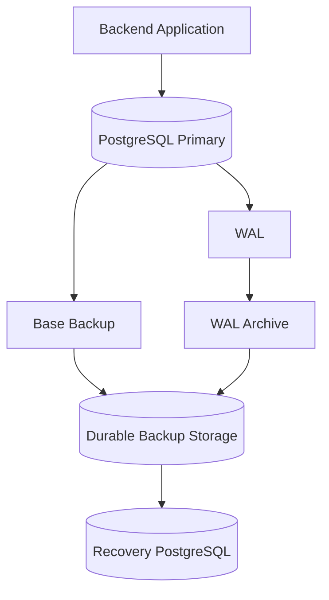
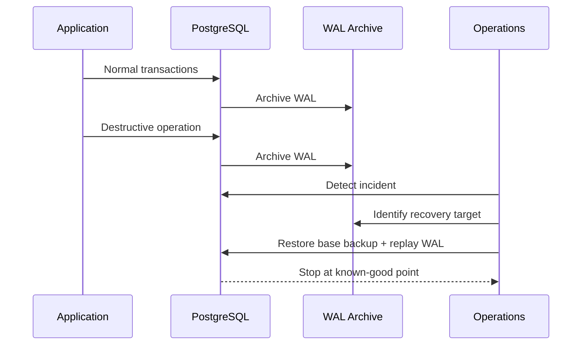
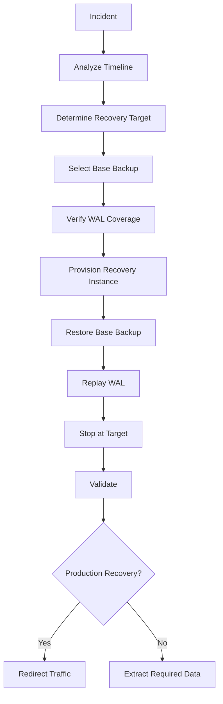
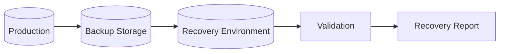

# 18- Point in Time Recovery

## Overview

Point-in-Time Recovery (PITR) is a database recovery technique that reconstructs a database to a specific historical point rather than simply restoring the latest backup.

For PostgreSQL, PITR combines:

- A physical base backup.
- Archived Write-Ahead Log (WAL).
- A recovery target.
- WAL replay from the base backup up to that target.

This makes PITR particularly valuable when the database itself is healthy but its logical state has been damaged by an application bug, accidental deletion, incorrect migration, or administrative error.


PITR is not a replacement for high availability. A replica can provide fast failover, while PITR provides historical recovery capability.

---

## Why PITR Exists

A normal backup may represent only a few points in time:

```text
00:00  Base backup
06:00  Backup
12:00  Backup
18:00  Backup
```

Suppose an accidental deletion occurs at:

```text
14:37
```

Restoring the 12:00 backup loses legitimate changes between 12:00 and 14:37.

Restoring the 18:00 backup may include the accidental deletion.

PITR allows recovery to a point immediately before the unwanted operation, assuming the required WAL is available.

```text
12:00 Base Backup
     │
     ├── WAL
     ├── WAL
     ├── WAL
     ├── 14:36:59 ← Desired recovery point
     ├── 14:37:00 ← Bad operation
     └── ...
```

---

## PITR Architecture

A production PostgreSQL PITR architecture typically looks like:



The recovery database starts from a base backup and replays archived WAL until the requested recovery target is reached.

Typical storage options include:

- AWS S3.
- Object storage provided by a managed database service.
- Dedicated backup systems.
- Cross-region backup storage.

Backup storage should be independent from the database host.

---

## WAL and PITR

PostgreSQL uses WAL to record changes before they are applied to database data files.

Conceptually:

```text
Transaction
    ↓
WAL record
    ↓
WAL flushed
    ↓
Transaction acknowledged
    ↓
Data pages eventually written
```

During recovery, PostgreSQL uses WAL to reconstruct changes after the base backup.

Therefore:

> A base backup without the required WAL history cannot provide arbitrary point-in-time recovery.

---

## Base Backup

A physical base backup represents a consistent starting point for recovery.

PostgreSQL provides mechanisms such as `pg_basebackup` for creating physical backups.

Example:

```bash
pg_basebackup \
  -h primary.internal \
  -U backup_user \
  -D /backups/base/2026-09-04 \
  -Fp \
  -Xs \
  -P
```

The exact production command depends on authentication, WAL archiving, storage, compression, encryption, and backup tooling.

A production backup system should not rely on manually running commands from an engineer's workstation.

---

## WAL Archiving

WAL archiving continuously copies completed WAL segments to durable storage.

A conceptual configuration is:

```ini
wal_level = replica
archive_mode = on
archive_command = '...'
```

The archive command must reliably transfer WAL to durable storage.

A successful command should indicate that the WAL segment has actually been archived.

Poorly designed archive commands can cause:

- WAL accumulation.
- Disk exhaustion.
- Broken recovery chains.
- False assumptions about recoverability.

---

## WAL Archive Reliability

WAL archiving is part of the recovery system, not merely a backup convenience.

Monitor:

- Archive success.
- Archive failures.
- WAL generation rate.
- Archive latency.
- Archive storage capacity.
- Missing WAL segments.
- Retention.
- Recovery testing results.

A base backup from yesterday is not sufficient if today's required WAL was never successfully archived.

---

## Recovery Target

A recovery target specifies where WAL replay should stop.

Common target concepts include:

- Timestamp.
- Transaction identifier.
- Named restore point.
- Immediate recovery.
- Latest available WAL.

Timestamp-based recovery is often the most practical for application incidents.

For example:

```text
Bad deployment:     2026-09-04 14:37 UTC
Recovery target:    2026-09-04 14:36:59 UTC
```

The target should be derived from incident evidence rather than guessed.

---

## Choosing the Recovery Point

Incident investigation should establish:

1. When the unwanted operation started.
2. Whether it affected multiple transactions.
3. Whether legitimate changes occurred afterward.
4. The earliest safe recovery point.
5. Whether targeted data extraction is safer than full rollback.

Useful evidence includes:

- Application logs.
- Audit logs.
- Database logs.
- Deployment timestamps.
- CI/CD history.
- Monitoring events.
- Business records.
- User reports.

The objective is not simply "recover before the incident was detected."

The objective is:

> Recover to the latest known-good database state before the damaging operation.

---

## Timeline Example

Consider:

```text
14:00  Normal production
14:30  Application deployment
14:37  Bug begins deleting records
14:42  First alert
14:45  Incident detected
```

Recovering to 14:45 is unsafe.

A suitable target might be:

```text
14:36:59
```

provided the evidence confirms the destructive operation began at 14:37.



---

## Recovery Targets and Transaction Boundaries

A timestamp does not necessarily map cleanly to the business operation you care about.

Multiple transactions may occur around the same time.

Therefore, recovery analysis should consider:

- Transaction boundaries.
- Application request IDs.
- Audit records.
- WAL timelines.
- Deployment timestamps.
- Database transaction identifiers where available.

For high-value systems, application-level audit records can make PITR decisions significantly safer.

---

## Restore Points

PostgreSQL can create named restore points.

Conceptually:

```sql
SELECT pg_create_restore_point('before_customer_migration');
```

This creates a WAL marker that can be used as a recovery reference.

Restore points are useful before high-risk operational activities such as:

- Major data migrations.
- Large transformations.
- Risky administrative changes.
- Planned maintenance.

They should complement, not replace, normal backups and WAL archiving.

---

## PITR Recovery Flow

A simplified recovery process is:



---

## Recovering to an Isolated Environment

For logical corruption, the safest initial recovery target is usually a separate database.

```text
Production
    │
    │ backups + WAL
    ▼
Recovery PostgreSQL
    │
    ├── Inspect
    ├── Validate
    ├── Compare
    └── Extract required records
```

This enables engineers to answer:

- Are the missing records present?
- Which records changed?
- Is the recovery point correct?
- What application version matches the database?
- Can only the affected records be repaired?

Only after validation should production recovery be considered.

---

## Full Production Rollback vs Targeted Repair

PITR does not always mean replacing production.

Suppose:

```text
14:37  50,000 customers accidentally deleted
14:38  legitimate orders continue
14:45  incident detected
```

Rolling production back to 14:36 could also remove legitimate orders created between 14:37 and 14:45.

A safer strategy may be:

```text
PITR to 14:36
       ↓
Recovery database
       ↓
Extract affected customers
       ↓
Validate
       ↓
Repair production
```

This minimizes collateral data loss.

---

## PITR and Data Extraction

A recovered database can be used as a source for controlled repair.

Example:

```sql
SELECT id, email, status
FROM customers
WHERE id IN (
    '8f2c7a91-1c20-4a2b-9f0e-7c7b7a6e5d11',
    '2b1e6d0f-55b1-4d0f-8d31-0e8a1e0a2d44'
);
```

The extracted data should be validated before applying it to production.

For large repairs, use controlled batches rather than one enormous transaction.

---

## PITR and PostgreSQL Timelines

Recovery and failover can create PostgreSQL timelines.

A timeline identifies a distinct history of WAL after branching from a previous history.

Conceptually:

```text
Timeline 1
     │
     ├── WAL ── WAL ── WAL
     │
     └── Failover
           │
           ▼
       Timeline 2
           │
           ├── WAL
           └── WAL
```

Timeline awareness matters when recovering after:

- Failover.
- Promotion.
- Disaster recovery.
- Multiple recovery attempts.

Backup tooling should preserve the required timeline information.

---

## PITR After Failover

After a failover, the previous primary and promoted standby may have different histories.

Do not blindly continue using the old primary as a replication source.

A production recovery process should establish:

- Which node is authoritative.
- Which timeline is current.
- Which replicas are valid.
- Whether the old primary must be rebuilt.
- Whether WAL archives contain the required history.

---

## PITR and Replicas

Read replicas can help availability and read scaling, but they are not substitutes for PITR.

A replica can also replicate an unwanted operation:

```text
Bad DELETE
   ↓
Primary
   ↓
WAL
   ↓
Replica
```

The replica may therefore contain the same logical corruption.

PITR provides historical recovery independent of the current logical state.

---

## PITR and RPO

PITR capability depends on WAL archival continuity.

For example:

```text
Base backup: 00:00
WAL archived continuously
Incident:    14:37
```

The recovery point can potentially be close to the incident time.

But if WAL archival stopped at:

```text
14:10
```

then recovery beyond 14:10 may not be possible from that backup chain.

Actual RPO therefore depends on the complete backup and WAL pipeline.

---

## PITR and RTO

PITR duration depends on:

- Backup size.
- Storage throughput.
- Database size.
- WAL volume.
- WAL replay speed.
- Recovery infrastructure provisioning.
- Validation time.
- Application startup.
- Traffic switching.

Example:

```text
Provision recovery DB      4 min
Restore base backup        8 min
Replay WAL                  7 min
Validate                    4 min
Switch traffic              2 min
--------------------------------
Total                      25 min
```

If the required RTO is 15 minutes, the architecture needs improvement.

---

## Reducing PITR Recovery Time

Possible improvements include:

- Faster backup storage.
- Faster recovery compute.
- Higher-throughput storage.
- More frequent base backups where appropriate.
- Optimized backup tooling.
- Pre-provisioned DR infrastructure.
- Automated restore workflows.
- Regular recovery testing.
- Reducing unnecessary recovery-time validation.

Do not optimize PITR based only on theoretical benchmarks. Measure actual recovery time with production-scale data.

---

## PITR Storage Strategy

Backup and WAL storage should be:

- Durable.
- Access-controlled.
- Encrypted.
- Independently recoverable.
- Monitored.
- Retained according to policy.
- Protected against accidental deletion.

For AWS environments, object storage such as S3 is commonly used for durable backup artifacts.

A stronger architecture may include:

```text
Primary Region
     │
     ▼
Backup Storage
     │
     ├── Versioning
     ├── Retention
     ├── Encryption
     └── Cross-region copy
```

---

## PITR Security

PITR artifacts can contain the complete production database.

Protect:

- Base backups.
- WAL archives.
- Recovery databases.
- Backup credentials.
- Encryption keys.
- Recovery logs.

Use:

- Least-privilege backup roles.
- Restricted storage policies.
- Encryption at rest.
- Encryption in transit.
- Strong authentication.
- Audit logging.
- Separate recovery credentials.

Never treat backup storage as ordinary application storage.

---

## Recovery Environment Security

A recovered production database is still production-sensitive data.

The recovery environment should have:

- Restricted network access.
- Dedicated credentials.
- Controlled administrative access.
- Encryption.
- Audit logging.
- Data classification.
- Appropriate retention.

Avoid restoring production data into an unrestricted developer environment.

---

## PITR and Django

Django applications frequently rely on migration state.

After PITR, verify:

```bash
python manage.py showmigrations
```

Check:

- Applied migrations.
- Schema version.
- Data migration effects.
- Application release version.
- Database extensions.
- Constraints.
- Expected tables and indexes.

A database recovered to an older point may require an older compatible application version.

---

## PITR and FastAPI

FastAPI does not provide database recovery itself.

Recovery must account for:

- Database driver configuration.
- SQLAlchemy schema expectations.
- Application version.
- Connection pools.
- Background workers.
- Configuration and secrets.
- API health checks.

The application deployment and recovered database schema must be compatible.

---

## PITR and Redis

PITR only restores PostgreSQL.

If Redis is used as a cache:

```text
Recover PostgreSQL
       ↓
Invalidate cache
       ↓
Rebuild from PostgreSQL
```

If Redis stores durable state, it needs a separate recovery strategy.

Do not assume the Redis state corresponds automatically to the recovered PostgreSQL point.

---

## PITR and Kafka

Kafka introduces an important consistency problem.

Suppose:

```text
Kafka event
    ↓
Consumer
    ↓
PostgreSQL
```

After restoring PostgreSQL to an earlier point, Kafka may contain events that correspond to database changes that no longer exist in the recovered state.

Potential strategies include:

- Replay Kafka events.
- Reset consumer offsets.
- Rebuild derived tables.
- Reconcile database and event state.
- Use idempotent consumers.

The correct strategy depends on which system is authoritative.

---

## PITR and Celery

Celery tasks can create similar problems.

Suppose a task:

```text
reads PostgreSQL
    ↓
updates PostgreSQL
    ↓
calls external API
```

If PostgreSQL is rolled back, the external API call cannot be rolled back automatically.

Recovery should therefore consider:

- Task execution history.
- Idempotency keys.
- Retry behavior.
- External side effects.
- Queue state.
- Duplicate detection.

---

## External Side Effects

PITR cannot rewind:

- Payment providers.
- Email delivery.
- SMS delivery.
- External APIs.
- Object storage.
- Kafka consumers.
- Third-party systems.

For systems with significant external effects, maintain:

- Idempotency records.
- Audit logs.
- Reconciliation jobs.
- Business event identifiers.
- External transaction references.

Database recovery is only one part of system recovery.

---

## PITR and Transactional Outbox

A transactional outbox can help coordinate database changes and event publishing.

```text
Transaction
 ├── Business state
 └── Outbox event
          ↓
       Commit
          ↓
     Event publisher
          ↓
        Kafka
```

However, PITR can still create a temporal mismatch if Kafka events from after the recovery point remain available.

After recovery, determine whether events need to be:

- Replayed.
- Suppressed.
- Reconciled.
- Rebuilt.

Idempotent consumers are especially valuable.

---

## PITR and Backups

PITR depends on the relationship between:

```text
Base backup
+
WAL archive
+
Recovery target
```

The base backup provides the starting state.

WAL provides subsequent changes.

The recovery target determines where replay stops.

If any required component is missing, the desired recovery may be impossible.

---

## Retention Planning

Retention determines how far into the past PITR can recover.

Example:

| Requirement | Design |
|---|---|
| Recover last 24 hours | Recent base backup + WAL |
| Recover 7 days | Backup + sufficient WAL retention |
| Recover 30 days | Long-term backup retention + WAL strategy |
| Regulatory retention | Policy-specific archival |
| Regional disaster | Cross-region copies |

Retention should consider:

- Storage cost.
- Compliance.
- Recovery requirements.
- WAL volume.
- Backup frequency.
- Business criticality.

---

## Backup Chain Validation

Do not assume that because a backup job succeeded, PITR works.

Validate:

```text
Base backup exists
       ↓
WAL exists
       ↓
WAL covers target
       ↓
Recovery succeeds
       ↓
Database validates
```

Automated restore tests are significantly more valuable than checking backup-job status alone.

---

## Monitoring PITR Readiness

Monitor:

| Metric | Why It Matters |
|---|---|
| Last successful base backup | Recovery starting point |
| Backup age | RPO coverage |
| WAL archive failures | Recovery-chain integrity |
| WAL archive lag | Potential data-loss window |
| WAL storage usage | Prevent archive exhaustion |
| Backup size | Capacity planning |
| Restore duration | RTO |
| WAL replay duration | Recovery performance |
| Restore test success | Actual recoverability |

A useful operational metric is:

> Time since the last known-good recovery test.

---

## Recovery Testing

A production-grade PITR strategy should periodically perform an actual restore.

Example:



Test:

- Full base restore.
- WAL replay.
- Timestamp recovery.
- Recovery after failover.
- Application connectivity.
- Critical queries.
- Business invariants.
- Recovery duration.

The test should measure both correctness and elapsed time.

---

## PITR Failure Modes

### Missing WAL

The target point is beyond the available WAL.

**Result:** recovery cannot reach the desired timestamp.

### Corrupt Backup

The base backup cannot be restored successfully.

**Result:** the entire recovery chain may be unusable.

### Archive Failure

WAL was generated but not successfully archived.

**Result:** there may be an unrecoverable gap.

### Incorrect Target

Recovery stops before legitimate data or after corruption.

**Result:** unnecessary data loss or persistent corruption.

### Insufficient Storage

Recovery runs out of disk space during restore or WAL replay.

**Result:** recovery fails or stalls.

### Incompatible Application

Database schema is older than the deployed application expects.

**Result:** application errors after recovery.

---

## Common Mistakes

### Treating Replicas as Backups

A replica can reproduce corruption or accidental deletion.

**Avoid it:** maintain independent backups and WAL archives.

### Assuming the Latest Backup Is the Best Recovery Point

The latest backup may already contain the damaging operation.

**Avoid it:** use PITR when historical recovery is required.

### Ignoring WAL Archiving

A base backup alone does not provide arbitrary point-in-time recovery.

**Avoid it:** verify continuous WAL archival.

### Recovering Directly Into Production

An incorrect recovery point can cause additional data loss.

**Avoid it:** recover into an isolated environment first when practical.

### Choosing the Detection Time as the Target

The incident may have started long before it was detected.

**Avoid it:** reconstruct the actual incident timeline.

### Testing Only Backup Creation

A successful backup job does not prove restoration works.

**Avoid it:** execute regular restore and PITR tests.

### Forgetting External Systems

PITR cannot undo external API calls.

**Avoid it:** use idempotency and reconciliation.

### Ignoring Recovery Time

A technically correct PITR process can still violate the RTO.

**Avoid it:** measure real restore and validation duration.

### Losing Encryption Keys

Encrypted backups cannot be recovered without the required keys and permissions.

**Avoid it:** test the complete encrypted recovery path.

---

## Production Recovery Procedure

A disciplined production procedure is:

1. Declare and classify the incident.
2. Preserve relevant logs and evidence.
3. Determine when the damaging operation occurred.
4. Identify the latest known-good recovery point.
5. Identify a suitable base backup.
6. Verify WAL coverage to the target.
7. Provision an isolated recovery environment.
8. Restore the base backup.
9. Replay WAL to the selected target.
10. Validate schema and critical business data.
11. Decide between full rollback and targeted repair.
12. If required, validate the recovered application version.
13. Reconcile Redis, Kafka, Celery, and external side effects.
14. Redirect production traffic only after validation.
15. Rebuild or reconfigure replicas as necessary.
16. Measure actual RPO and RTO.
17. Document the incident and recovery outcome.

---

## Production Checklist

### Backup Infrastructure

- [ ] Base backups are automated.
- [ ] WAL archiving is enabled.
- [ ] WAL archive failures are monitored.
- [ ] Backup storage is durable.
- [ ] Backup artifacts are encrypted.
- [ ] Backup access uses least privilege.
- [ ] Retention policy is documented.
- [ ] Cross-region copies exist where required.

### PITR Readiness

- [ ] Recovery targets can be identified from logs.
- [ ] WAL coverage is verified.
- [ ] Recovery procedures are documented.
- [ ] Recovery credentials are available.
- [ ] Encryption keys are recoverable.
- [ ] Recovery infrastructure is reproducible.
- [ ] Restore tests run regularly.

### Application Recovery

- [ ] Compatible application version is known.
- [ ] Django migration state is validated where applicable.
- [ ] FastAPI/SQLAlchemy schema compatibility is validated where applicable.
- [ ] Connection pools can reconnect.
- [ ] Celery tasks are assessed.
- [ ] Kafka offsets are assessed.
- [ ] Redis state is assessed.
- [ ] External side effects are reconciled.

### Validation

- [ ] Database starts successfully.
- [ ] Required extensions exist.
- [ ] Critical tables contain expected data.
- [ ] Business invariants are validated.
- [ ] Application smoke tests pass.
- [ ] RPO is measured.
- [ ] RTO is measured.

---

## Interview Traps

### "Is PITR the Same as Restoring a Backup?"

No.

A traditional restore reconstructs a database from a backup. PITR restores a base backup and replays WAL until a selected historical recovery target.

### "Why Do You Need WAL for PITR?"

The base backup represents the starting state. WAL contains changes that occurred after that backup.

### "Can a Read Replica Replace PITR?"

No.

A replica is primarily an availability/read-scaling mechanism and may replicate logical corruption. PITR provides historical recovery.

### "Can PITR Recover Redis?"

No.

PITR applies to the PostgreSQL recovery chain. Redis requires its own persistence and recovery strategy.

### "Why Restore to a Separate Environment?"

It allows engineers to inspect and validate the recovered state without immediately replacing production.

### "How Do You Recover One Accidentally Deleted Dataset?"

Restore to an isolated environment at a point before the deletion, extract the affected data, validate it, and apply a controlled repair to production when appropriate.

### "What Determines PITR RPO?"

The continuity and durability of the backup and WAL pipeline. If WAL has gaps, the desired recovery point may be unavailable.

### "What Determines PITR RTO?"

Restore throughput, database size, WAL replay volume, infrastructure provisioning, validation, application startup, and traffic switching.

### "Can PITR Undo a Payment?"

No.

It can restore PostgreSQL state, but external payment systems require separate reconciliation.

---

## Key Takeaways

- **PITR combines a base backup with WAL replay:** the base backup provides the starting state, while archived WAL reconstructs changes up to the selected recovery target.
- **The recovery target must be evidence-driven:** identify the latest known-good point before the damaging operation rather than simply recovering to the incident detection time.
- **PITR is complementary to HA:** replicas provide availability and read scaling, while independent backups and WAL provide historical recovery from logical corruption and disasters.
- **Test the complete recovery path:** verify backup integrity, WAL continuity, restore success, application compatibility, business data, external side effects, actual RPO, and actual RTO.
- **Treat PITR as a system-wide capability:** PostgreSQL recovery must be coordinated with Django/FastAPI, connection pools, Redis, Kafka, Celery, secrets, encryption keys, infrastructure, and external systems.