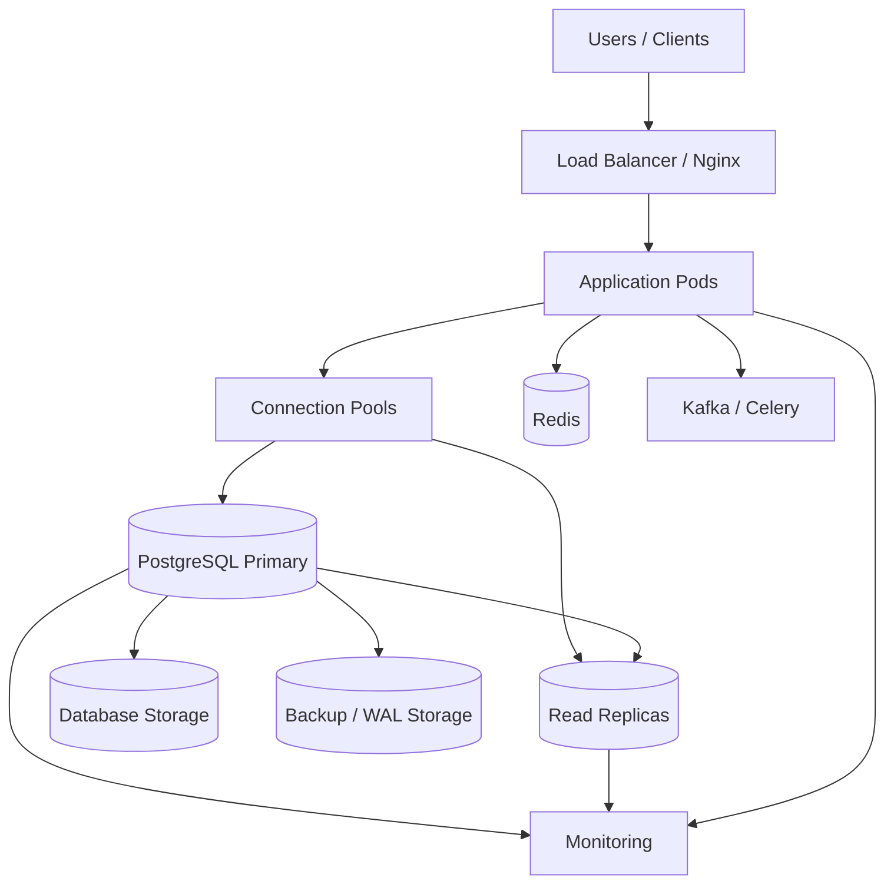
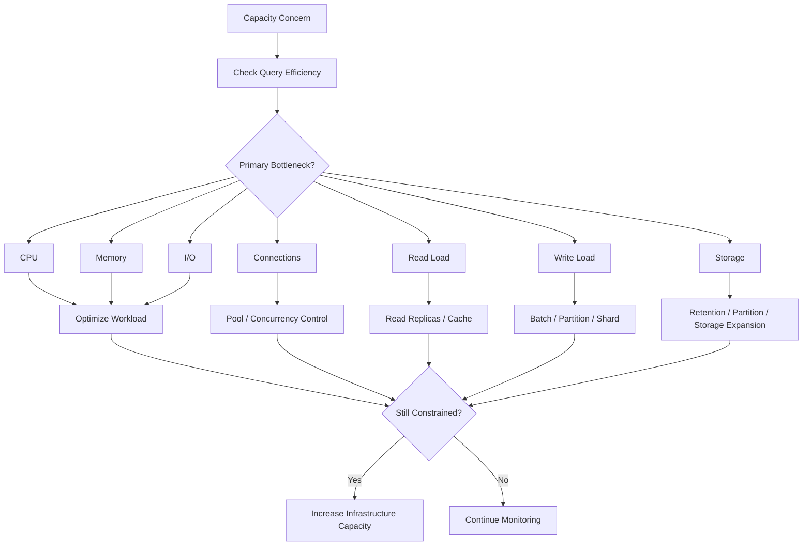

# 19- Database Capacity Planning

## Overview

Database capacity planning is the process of determining whether a database has enough compute, memory, storage, I/O, connection capacity, and workload headroom to meet current and future requirements.

For PostgreSQL-backed backend systems, capacity is not simply a question of "how much CPU or RAM do we need?" A database can become constrained by several different resources:

- CPU.
- Memory.
- Storage capacity.
- Storage IOPS and throughput.
- Network bandwidth.
- Database connections.
- Lock/concurrency capacity.
- WAL generation and replication throughput.
- Autovacuum and maintenance capacity.
- Query execution capacity.
- Operational recovery capacity.

A production capacity plan connects business workload to database resources:

```text
Business growth
      ↓
Requests / transactions
      ↓
SQL workload
      ↓
CPU / memory / I/O / connections / WAL
      ↓
Database capacity
      ↓
Required headroom
      ↓
Scaling decision
```

The goal is not to maximize utilization. The goal is to maintain predictable performance and reliability while leaving enough headroom for traffic growth, maintenance, failover, deployments, and unexpected workload spikes.

---

## Why Capacity Planning Matters

Without capacity planning, databases often scale reactively:

```text
Traffic increases
      ↓
Latency increases
      ↓
CPU reaches saturation
      ↓
Connections queue
      ↓
Requests time out
      ↓
Retries increase load
      ↓
Database becomes less healthy
```

Capacity planning attempts to identify the constraint before it becomes an incident.

A useful production question is:

> "At the expected peak workload, which database resource becomes the limiting factor first?"

That resource determines the practical capacity of the system.

---

## Database Capacity Is Multidimensional

A database may have sufficient storage but insufficient CPU.

It may have sufficient CPU but too many connections.

It may have enough CPU and memory but insufficient disk throughput.

Therefore, capacity should be evaluated across multiple dimensions.

| Resource | Typical Constraint | Common Symptoms |
|---|---|---|
| CPU | Query execution, aggregation, sorting | High CPU, rising query latency |
| Memory | Working sets, sorts, hashes, connections | Swap, OOM, temp I/O |
| Storage | Database growth | Low free space |
| IOPS | Random database I/O | High I/O latency |
| Throughput | WAL/data traffic | High disk/network throughput |
| Connections | Concurrent sessions | Pool exhaustion |
| Locks | Concurrent writes | Lock waits |
| WAL | Write-heavy workload/replication | Replica lag, archive growth |
| Autovacuum | High update/delete workload | Bloat, stale statistics |
| Network | Large results/replication | Network saturation |
| Recovery | Large database/WAL volume | Excessive RTO |

---

## Capacity Planning Architecture

A typical production architecture contains several measurable layers:



Capacity planning must consider the entire path rather than only the PostgreSQL instance.

---

## Workload Modeling

The starting point is workload, not infrastructure size.

Measure:

- Requests per second.
- Transactions per second.
- Queries per second.
- Reads versus writes.
- Average query latency.
- P95/P99 latency.
- Peak traffic.
- Batch workload.
- Background jobs.
- Data growth.
- WAL generation.
- Connection concurrency.

For an API:

```text
10,000 requests/sec
       ↓
3 database queries/request
       ↓
30,000 SQL executions/sec
```

This is only a rough model because caching, batching, asynchronous processing, and request paths can change the actual workload.

The important principle is:

> Capacity planning should begin with workload characteristics and translate them into database resource requirements.

---

## Average vs Peak Workload

Average traffic is insufficient for capacity planning.

Consider:

```text
Average:  2,000 requests/sec
Peak:    10,000 requests/sec
```

A database sized only for 2,000 requests/sec may perform acceptably most of the day and fail during peak periods.

Track:

| Workload | Use |
|---|---|
| Average | Cost and baseline capacity |
| P50 | Typical behavior |
| P95 | High-load behavior |
| P99 | Tail behavior |
| Maximum observed | Incident analysis |
| Forecast peak | Capacity planning |

Production systems should generally be sized against expected peak workload plus operational headroom.

---

## Growth Modeling

A simple growth model can estimate future database size.

Suppose:

```text
Current database size = 500 GB
Monthly growth = 40 GB
Planning horizon = 12 months
```

Ignoring nonlinear growth:

```text
Expected growth = 40 × 12
                = 480 GB

Projected size ≈ 980 GB
```

A production estimate should additionally account for:

- Index growth.
- Table bloat.
- WAL storage.
- Temporary files.
- Backup storage.
- Replicas.
- Partitioning.
- Historical retention.
- Growth acceleration.

---

## Data Growth Is Not the Same as Table Growth

Database size includes more than table data.

Conceptually:

```text
Database footprint
├── Heap/table data
├── Indexes
├── TOAST data
├── Free space / bloat
├── Temporary files
├── WAL
└── Operational overhead
```

A database with 1 TB of logical business data may require significantly more physical storage.

Monitor actual storage consumption rather than estimating capacity only from row counts.

---

## PostgreSQL Storage Monitoring

Useful PostgreSQL queries include:

```sql
SELECT
    pg_size_pretty(pg_database_size(current_database())) AS database_size;
```

For table growth:

```sql
SELECT
    schemaname,
    relname,
    pg_size_pretty(pg_total_relation_size(relid)) AS total_size
FROM pg_catalog.pg_statio_user_tables
ORDER BY pg_total_relation_size(relid) DESC
LIMIT 20;
```

For indexes:

```sql
SELECT
    schemaname,
    relname,
    indexrelname,
    pg_size_pretty(pg_relation_size(indexrelid)) AS index_size
FROM pg_catalog.pg_stat_user_indexes
ORDER BY pg_relation_size(indexrelid) DESC
LIMIT 20;
```

These measurements help identify where storage is actually being consumed.

---

## CPU Capacity

CPU is primarily consumed by query execution and database background work.

Common CPU-intensive operations include:

- Large sequential scans.
- Complex joins.
- Hash joins.
- Aggregations.
- Sorting.
- Window functions.
- JSON processing.
- Regular expressions.
- Expression-heavy queries.
- High query concurrency.
- Autovacuum.
- Index maintenance.

High CPU does not automatically mean the database needs more CPUs.

First determine:

```text
High CPU
   ↓
Which queries?
   ↓
How often?
   ↓
How expensive?
   ↓
Why expensive?
```

A query executed 50,000 times per second at 5 ms may consume more CPU than a 2-second query executed once per minute.

---

## CPU Capacity Model

A useful conceptual model is:

```text
Total CPU demand
≈
query CPU
+ maintenance CPU
+ background CPU
+ replication-related work
```

Capacity planning should leave headroom for:

- Traffic spikes.
- Autovacuum.
- Index creation.
- Checkpoints.
- Failover.
- Operational queries.
- Background jobs.

Running a primary permanently near CPU saturation leaves little room for recovery from abnormal workloads.

---

## Query Efficiency Before Scaling CPU

Before increasing compute, investigate:

```sql
EXPLAIN (ANALYZE, BUFFERS)
SELECT
    id,
    customer_id,
    status
FROM orders
WHERE customer_id = $1
  AND status = $2
ORDER BY created_at DESC
LIMIT 50;
```

Look for:

- Unexpected sequential scans.
- Incorrect cardinality estimates.
- Excessive rows removed by filters.
- Expensive joins.
- Large sorts.
- Hash operations.
- Temp-file usage.
- Repeated execution.

Capacity planning should distinguish:

```text
More workload
```

from:

```text
Same workload made unnecessarily expensive
```

---

## Memory Capacity

PostgreSQL memory comes from multiple sources.

Important areas include:

- `shared_buffers`.
- Operating-system page cache.
- Per-backend memory.
- `work_mem`.
- `maintenance_work_mem`.
- Autovacuum memory.
- Connection overhead.
- Temporary query structures.

A common mistake is assuming:

```text
work_mem = memory allocated once per server
```

It is not.

Memory consumption can multiply across concurrent operations and sessions.

Conceptually:

```text
Potential query memory
≈
concurrent operations × work_mem
```

The actual behavior is more nuanced because not every operation uses its full configured limit.

---

## Connection Capacity

Connections are a finite database resource.

A common architecture mistake is:

```text
20 Kubernetes pods
×
20 application connections
=
400 PostgreSQL connections
```

If each pod also has Celery workers or additional pools, the actual connection demand may be much larger.

Capacity planning must include:

- Web workers.
- Application pools.
- Async workers.
- Celery workers.
- Management jobs.
- Reporting processes.
- Migration jobs.
- Monitoring connections.
- Administrative connections.

---

## Connection Budget

Define a database connection budget.

Example:

```text
PostgreSQL max_connections: 300

Application web:
  10 pods × 15 = 150

Celery:
  5 workers × 10 = 50

Reporting:
  20

Operations:
  20

Reserved headroom:
  60
```

The exact numbers depend on workload and pooling architecture.

The important principle is:

> Size connections across the entire deployment, not independently per application instance.

Connection pools are concurrency controls, not database capacity multipliers.

---

## PgBouncer and Connection Capacity

PgBouncer can reduce PostgreSQL backend connection pressure by multiplexing client connections.

For example:

```text
Application pods
     │
     │ many client connections
     ▼
PgBouncer
     │
     │ controlled PostgreSQL sessions
     ▼
PostgreSQL
```

Transaction pooling can be useful for short-lived transactions, but it has session-state compatibility implications.

Applications using:

- Temporary tables.
- Session variables.
- Session-level advisory locks.
- Certain prepared-statement behaviors.
- Other session-specific state.

must be evaluated carefully before using transaction pooling.

---

## I/O Capacity

Database I/O can become the bottleneck even when CPU utilization is moderate.

Important metrics include:

- Read IOPS.
- Write IOPS.
- Read throughput.
- Write throughput.
- Disk latency.
- WAL write throughput.
- Checkpoint behavior.
- Temporary-file I/O.

A query may be slow because it waits on storage rather than CPU.

Use PostgreSQL wait events and infrastructure metrics together.

---

## Storage Capacity vs Storage Performance

These are separate dimensions.

| Capacity | Performance |
|---|---|
| How much data fits | How quickly data can be accessed |
| Measured in GB/TB | Measured in IOPS/throughput/latency |
| Growth planning | Query and write performance |
| Low disk space risk | I/O saturation risk |

Increasing disk size does not necessarily solve an I/O latency problem.

Similarly, faster storage does not solve an impending disk-capacity problem.

---

## WAL Capacity

Write-heavy workloads can generate significant WAL.

WAL volume affects:

- Disk usage.
- Replication.
- WAL archiving.
- Backup storage.
- Replica replay.
- Recovery time.

Monitor:

```text
WAL generation rate
WAL archive rate
WAL archive failures
Replica replay lag
Archive storage growth
```

A sudden increase in WAL generation may indicate:

- Bulk updates.
- Large deletes.
- Index creation.
- Data migrations.
- Application write amplification.

---

## Replication Capacity

Replication introduces another capacity dimension.

```text
Primary
   │
   ├── WAL generation
   │
   ├── Replica A replay
   ├── Replica B replay
   └── WAL archive
```

The replica must receive and replay WAL fast enough to keep up with the primary.

Capacity planning should monitor:

- WAL generation rate.
- Network throughput.
- Replica replay rate.
- Replica lag.
- Long-running queries on replicas.
- Storage performance.

Adding more replicas can increase network and replay-related workload.

---

## Read Scaling

Read replicas can increase read capacity.

```text
                    ┌── Replica A
Application ──┬─────┼── Replica B
              │     └── Replica C
              │
              └────── Primary
```

However:

- Replicas do not scale writes.
- Replication has operational cost.
- Replica lag affects consistency.
- Reads may need routing logic.
- Each replica consumes compute and storage.

Capacity planning should determine whether the workload is:

```text
CPU-bound
I/O-bound
read-heavy
write-heavy
connection-bound
```

before choosing replication as the solution.

---

## Write Capacity

Write scaling is harder than read scaling because writes usually converge on the primary.

Write capacity can be improved through:

- Query optimization.
- Better indexes.
- Batching.
- Bulk operations.
- Reduced write amplification.
- Partitioning.
- Queue-based ingestion.
- Sharding.
- Workload isolation.

For example:

```text
10,000 individual INSERTs
```

may be substantially less efficient than a carefully designed bulk operation.

---

## Autovacuum Capacity

For PostgreSQL workloads with frequent `UPDATE` and `DELETE` operations, autovacuum is part of capacity planning.

Insufficient maintenance capacity can result in:

- Table bloat.
- Index bloat.
- Stale statistics.
- Poor query plans.
- Increased storage.
- Increased I/O.

Monitor:

- Dead tuples.
- Autovacuum frequency.
- Autovacuum duration.
- Tables being vacuumed.
- Analyze freshness.
- Long-running transactions preventing cleanup.

A database that appears healthy on CPU may still be accumulating maintenance debt.

---

## Statistics Capacity and Query Planning

Statistics affect query plans and therefore indirectly affect capacity.

If statistics become stale:

```text
Stale statistics
      ↓
Bad cardinality estimate
      ↓
Poor execution plan
      ↓
More CPU / I/O
      ↓
Higher latency
```

Monitor statistics freshness and investigate plan regressions after major data-distribution changes.

---

## Lock and Concurrency Capacity

A database can have available CPU and still perform poorly because transactions are waiting for locks.

Monitor:

- Lock waits.
- Long transactions.
- Idle transactions.
- Hot rows.
- Deadlocks.
- Transaction duration.

Example:

```text
100 concurrent workers
        ↓
same counter row
        ↓
row-level contention
        ↓
queueing
        ↓
high latency
```

Adding more workers can make this worse.

---

## Queueing and Database Capacity

Database performance is affected by queueing.

A simplified relationship is:

```text
Concurrency ≈ Throughput × Latency
```

This is the intuition behind Little's Law.

For example, if a database path processes:

```text
2,000 requests/sec
```

with an average database residence time of:

```text
20 ms
```

then the average concurrency attributable to that path is approximately:

```text
2,000 × 0.020 = 40
```

As latency increases, concurrency requirements increase for the same throughput.

This is why slow queries can cause connection-pool exhaustion.

---

## Headroom

Capacity planning should explicitly define headroom.

Headroom protects against:

- Traffic spikes.
- Deployment effects.
- Background jobs.
- Autovacuum.
- Failover.
- Cache misses.
- Unexpected query plans.
- Incident response.
- Growth forecast error.

There is no universal percentage that is correct for every workload.

A low-risk batch system and a latency-sensitive transactional API may require very different operating margins.

The key is to define a measurable operating target based on workload and failure scenarios.

---

## Capacity Planning for Failover

High availability changes capacity requirements.

Suppose:

```text
Primary: 16 vCPU
Standby: 8 vCPU
```

If the standby must immediately serve the production workload after failover, it may not have equivalent capacity.

A production HA design should ensure the failover target can satisfy the required workload within the expected performance envelope.

Consider:

- CPU.
- Memory.
- Storage throughput.
- Connections.
- Replica replay.
- Network.
- Connection routing.
- Cache warm-up.

---

## N+1 Capacity Risk

ORM-driven N+1 queries can silently multiply database workload.

Suppose:

```text
1 API request
    ↓
1 query for orders
    ↓
100 queries for customers
```

One request becomes 101 database operations.

At:

```text
1,000 requests/sec
```

this can produce:

```text
101,000 query executions/sec
```

Capacity planning must account for query frequency, not only API request volume.

Use:

- Django `select_related`.
- Django `prefetch_related`.
- Explicit projections.
- Query batching.
- Appropriate indexes.

---

## Background Workload Capacity

Celery and Kafka consumers can create substantial database load outside HTTP traffic.

```text
HTTP traffic ──────┐
                   │
Celery workers ────┼──> PostgreSQL
                   │
Kafka consumers ───┘
```

Capacity planning should include:

- Scheduled jobs.
- Data exports.
- Report generation.
- Event consumers.
- Reconciliation jobs.
- ETL/CDC pipelines.
- Migrations.

A database can become overloaded even when API traffic is unchanged because background processing increased.

---

## Large Exports

Large exports can consume:

- CPU.
- Memory.
- I/O.
- Connections.
- Network bandwidth.

Avoid running large exports synchronously through API requests.

A better pattern is:

```text
API request
    ↓
Create export job
    ↓
Celery / Kafka
    ↓
Controlled database reads
    ↓
Object storage
    ↓
Download URL
```

This isolates expensive workloads from latency-sensitive transactions.

---

## Capacity Isolation

Not every workload should compete for the same database resources.

Potential isolation mechanisms include:

- Read replicas.
- Dedicated reporting databases.
- OLAP systems.
- Materialized views.
- Redis.
- Queues.
- Separate database instances.
- Separate microservice databases.

For example:

```text
OLTP Primary
     │
     ├── API transactions
     └── Replication
            │
            ▼
       Reporting DB
            │
            ▼
         Analytics
```

This prevents analytical workloads from consuming the primary's transactional capacity.

---

## Partitioning and Capacity

Partitioning can improve operational scalability when tables become very large.

Common strategies include:

- Time-based partitions.
- Tenant-based partitioning.
- Hash partitioning.
- Range partitioning.

Partitioning can reduce the amount of data scanned when partition pruning applies.

It can also simplify:

- Retention.
- Archival.
- Large historical data management.
- Maintenance.

Partitioning does not automatically increase write capacity and does not eliminate row-level contention.

---

## Sharding and Capacity

Sharding distributes data and workload across multiple database instances.

```text
Application
     │
     ▼
Shard Router
 ┌───┼────┐
 ▼   ▼    ▼
S1  S2    S3
```

Sharding should generally be considered after simpler scaling approaches have been evaluated.

It introduces:

- Routing complexity.
- Cross-shard queries.
- Cross-shard transactions.
- Rebalancing.
- Operational complexity.
- Backup complexity.

A database should not be sharded merely because its storage size increased if vertical scaling, partitioning, replicas, or workload optimization are sufficient.

---

## Capacity Forecasting

A practical forecast should combine:

```text
Current utilization
+
Observed growth
+
Expected business growth
+
Seasonality
+
Architecture changes
+
Safety headroom
```

Example:

| Dimension | Current | 12-Month Forecast | Capacity Target |
|---|---:|---:|---:|
| Database size | 700 GB | 1.2 TB | 2 TB |
| Peak QPS | 8,000 | 14,000 | 18,000 |
| CPU | 45% | 70% | < 80% target |
| Connections | 180 | 280 | 400 budget |
| WAL | 150 GB/day | 300 GB/day | Sized accordingly |
| Replica lag | <2 sec | Expected <3 sec | <5 sec |

These are planning values, not universal thresholds.

---

## Capacity Planning Workflow

A reliable workflow is:

1. Define business and technical growth assumptions.
2. Measure current workload.
3. Identify peak and tail behavior.
4. Measure CPU, memory, I/O, connections, WAL, and storage.
5. Identify the current bottleneck.
6. Measure query and transaction efficiency.
7. Forecast workload growth.
8. Estimate resource growth.
9. Add operational headroom.
10. Load-test the expected workload.
11. Validate failover capacity.
12. Estimate infrastructure cost.
13. Define scaling triggers.
14. Revisit the model periodically.

---

## Load Testing

Capacity estimates should be validated with realistic workloads.

A useful load test includes:

- Production-like data volume.
- Representative indexes.
- Realistic query distributions.
- Read/write ratios.
- Background jobs.
- Connection pool behavior.
- Cache behavior.
- Expected peak traffic.
- Burst traffic.
- Failure scenarios.

Avoid testing only with an empty development database.

Query plans and data distributions can change substantially as data grows.

---

## Capacity Thresholds

Define operational thresholds rather than waiting for complete saturation.

| Signal | Possible Capacity Concern |
|---|---|
| CPU | Sustained high utilization |
| Memory | Swap/OOM or severe cache pressure |
| Disk | Low free capacity |
| I/O latency | Sustained increase |
| Connections | Pool/database saturation |
| WAL | Generation exceeds archival/replay capacity |
| Replica lag | Sustained growth |
| Lock waits | Increasing transaction latency |
| Query latency | P95/P99 regression |
| Autovacuum | Falling behind workload |
| Storage growth | Forecast exceeds available capacity |

Thresholds should be tied to service-level objectives and workload behavior.

---

## Capacity Planning with `pg_stat_statements`

`pg_stat_statements` is useful for understanding workload demand.

A simplified query:

```sql
SELECT
    calls,
    total_exec_time,
    mean_exec_time,
    rows,
    query
FROM pg_stat_statements
ORDER BY total_exec_time DESC
LIMIT 20;
```

Useful dimensions include:

- Total execution time.
- Mean execution time.
- Call frequency.
- Rows returned.
- Shared block reads.
- Shared block hits.

Capacity decisions should consider aggregate workload.

A query consuming 10% CPU but executed millions of times may matter more than an individual query that is slower but rare.

---

## Capacity Metrics

A production database dashboard should expose at least:

### Compute

- CPU utilization.
- CPU saturation.
- Load average where relevant.
- Query execution time.

### Memory

- Available memory.
- Swap.
- Cache behavior.
- Memory pressure.
- OOM events.

### Storage

- Used capacity.
- Free capacity.
- Growth rate.
- IOPS.
- Throughput.
- Latency.

### PostgreSQL

- Active sessions.
- Waiting sessions.
- Transaction duration.
- Lock waits.
- Deadlocks.
- Autovacuum activity.
- Checkpoint activity.
- WAL generation.
- Replication lag.

### Application

- Request rate.
- Database query rate.
- Query latency.
- Connection-pool utilization.
- Pool wait time.
- Retry rate.

---

## Capacity Dashboard

A useful operational dashboard should correlate layers:

```text
Traffic
  │
  ├── Requests/sec
  ├── P95/P99 latency
  │
  ▼
Application
  │
  ├── Query count
  ├── Pool utilization
  └── Retries
  │
  ▼
PostgreSQL
  │
  ├── CPU
  ├── Memory
  ├── I/O
  ├── Connections
  ├── Locks
  ├── WAL
  └── Query latency
  │
  ▼
Infrastructure
  │
  ├── Storage
  ├── Network
  └── Instance capacity
```

This correlation is more useful than isolated database metrics.

---

## AWS Capacity Planning

For AWS-managed PostgreSQL environments such as Amazon RDS or Aurora, capacity planning should consider:

- Instance CPU and memory.
- Storage capacity.
- Storage throughput.
- Provisioned IOPS where applicable.
- Network throughput.
- Read replicas.
- Multi-AZ architecture.
- Backup storage.
- Cross-region replication.
- CloudWatch metrics.
- Database-specific metrics.
- Scaling constraints and maintenance windows.

Do not choose an instance class solely from current CPU utilization.

Memory, network, storage performance, connection capacity, and failover behavior also matter.

---

## Kubernetes Capacity Planning

When PostgreSQL runs inside Kubernetes, capacity planning becomes more complex.

Consider:

- Pod CPU requests/limits.
- Pod memory requests/limits.
- Persistent volume performance.
- Node capacity.
- Scheduling.
- Eviction behavior.
- Stateful workload placement.
- Storage classes.
- Availability zones.
- Backup infrastructure.

For managed PostgreSQL, Kubernetes capacity planning generally focuses on application-side resources and database service limits rather than running PostgreSQL directly in the cluster.

---

## Scaling Decision Tree

A useful decision process is:



The first response should usually be diagnosis, not immediate infrastructure expansion.

---

## Cost Considerations

Capacity planning is also cost planning.

Costs can increase through:

- Larger database instances.
- More read replicas.
- Higher-performance storage.
- Additional backup retention.
- Cross-region replication.
- Monitoring.
- Data transfer.
- Increased WAL storage.
- Dedicated reporting systems.

A cheaper architecture that constantly operates near saturation can cost more operationally through incidents and engineering effort.

A more expensive architecture may be justified when it materially improves:

- Reliability.
- RTO/RPO.
- Performance.
- Scalability.
- Operational simplicity.

---

## Security Considerations

Capacity systems often expose operational data that should be restricted.

Protect:

- Database metrics.
- Query text.
- Connection metadata.
- Infrastructure dashboards.
- Backup metrics.
- Administrative endpoints.

Query monitoring can expose sensitive values if SQL logging is poorly configured.

Use:

- Least-privilege monitoring roles.
- Restricted dashboards.
- Redacted application logs.
- Secure metric endpoints.
- Controlled access to database administration tools.

Capacity planning should not become a mechanism for exposing production data.

---

## High Availability Considerations

Capacity planning should include failure conditions.

Ask:

- Can the standby handle production traffic?
- Can replicas absorb expected read traffic after failover?
- Is connection capacity sufficient after failover?
- Does storage have enough headroom?
- Can WAL replay keep up?
- Does the recovery environment have sufficient capacity?
- Does the application reconnect safely?

A database that can handle normal traffic but not failover traffic is not fully capacity-planned.

---

## Disaster Recovery Considerations

Recovery capacity should be planned separately from normal production capacity.

Consider:

- Backup restore throughput.
- Recovery instance size.
- WAL replay rate.
- Network bandwidth.
- Storage throughput.
- Recovery environment startup time.
- Data validation time.

For PITR, measure:

```text
Base backup restore time
+
WAL replay time
+
Validation time
+
Traffic restoration time
```

This determines whether the architecture can satisfy the required RTO.

---

## Capacity Planning Anti-Patterns

### Planning From Average CPU

Average CPU hides peak workload and other constraints.

**Better:** correlate peak traffic, CPU, I/O, memory, connections, and query latency.

### Increasing `max_connections`

This increases the number of sessions PostgreSQL accepts but does not create additional compute capacity.

**Better:** control application concurrency and use appropriate pooling.

### Scaling Before Query Optimization

A poorly designed query remains expensive on a larger machine.

**Better:** inspect workload and execution plans first.

### Ignoring Background Jobs

Celery, Kafka consumers, reporting, and exports can consume significant database capacity.

**Better:** include all database clients in the workload model.

### Ignoring Data Growth

A query that performs well on 10 million rows may behave differently at 1 billion rows.

**Better:** test with production-scale data.

### Treating Storage as One Metric

Capacity and I/O performance are different.

**Better:** monitor free space, IOPS, throughput, and latency separately.

### Using Replicas to Solve Writes

Read replicas do not increase primary write capacity.

**Better:** optimize writes, batch operations, partition, isolate workloads, or evaluate sharding where justified.

### Ignoring Failover Capacity

A smaller standby may become the new production bottleneck.

**Better:** include failover workload in capacity testing.

---

## Production Capacity Review

A senior engineer should periodically review:

### Workload

- Is request volume growing?
- Is query volume growing faster than API traffic?
- Has the read/write ratio changed?
- Are new background jobs increasing load?

### Database

- Which resource is closest to saturation?
- Are query plans stable?
- Is storage growing as expected?
- Is WAL generation increasing?
- Is autovacuum keeping up?

### Application

- Are pools correctly sized?
- Are retries increasing?
- Are N+1 queries appearing?
- Are new endpoints generating excessive SQL?

### Architecture

- Are replicas still sufficient?
- Is caching effective?
- Should reporting be isolated?
- Is partitioning becoming necessary?
- Is sharding justified?

### Reliability

- Can the standby handle failover?
- Are backups restorable?
- Can PITR meet the required RTO?
- Is recovery infrastructure large enough?

---

## Capacity Planning Example

Consider an API platform with:

```text
Current peak:
  6,000 requests/sec

Projected peak:
  12,000 requests/sec

Average DB queries/request:
  4

Current peak database workload:
  ~24,000 query executions/sec
```

Suppose load testing shows:

```text
Current PostgreSQL instance:
  16 vCPU
  64 GB RAM

At 24,000 query executions/sec:
  CPU: 55%
  P95 DB latency: 18 ms
  Connections: 160
  Storage: 900 GB
  WAL: 180 GB/day
```

Forecast:

```text
12,000 requests/sec
×
4 queries/request
=
~48,000 query executions/sec
```

The correct response is not automatically "double the CPU."

First determine whether:

- Query efficiency remains constant.
- Query frequency changes.
- Indexes remain effective.
- Read replicas can absorb reads.
- Caching reduces database demand.
- Connection concurrency changes.
- WAL generation doubles.
- Storage growth accelerates.

Then validate the expected workload with load testing.

---

## Capacity Planning Checklist

### Workload

- [ ] Current request rate is measured.
- [ ] Peak request rate is known.
- [ ] Query rate is measured.
- [ ] Read/write ratio is known.
- [ ] Background workload is included.
- [ ] Growth assumptions are documented.
- [ ] Seasonality is considered.

### Compute

- [ ] CPU utilization is monitored.
- [ ] CPU saturation is understood.
- [ ] Expensive queries are identified.
- [ ] Maintenance CPU is considered.
- [ ] Failover CPU capacity is sufficient.

### Memory

- [ ] Available memory is monitored.
- [ ] Swap is monitored.
- [ ] `work_mem` concurrency is considered.
- [ ] Connection memory is considered.
- [ ] Application memory is included.

### Storage

- [ ] Database size is tracked.
- [ ] Table growth is tracked.
- [ ] Index growth is tracked.
- [ ] Bloat is considered.
- [ ] Free capacity is forecast.
- [ ] IOPS and throughput are monitored.
- [ ] Storage latency is monitored.

### Connections

- [ ] PostgreSQL connection limits are known.
- [ ] Application pool sizes are known.
- [ ] Kubernetes replica counts are included.
- [ ] Celery workers are included.
- [ ] Reporting connections are included.
- [ ] Failover connection demand is considered.

### Replication and Recovery

- [ ] WAL generation is measured.
- [ ] Replica lag is monitored.
- [ ] WAL archival is monitored.
- [ ] Backup storage is sized.
- [ ] PITR is tested.
- [ ] Recovery capacity is tested.
- [ ] RPO and RTO are validated.

### Scaling

- [ ] Current bottleneck is identified.
- [ ] Query optimization is evaluated first.
- [ ] Caching is evaluated.
- [ ] Read replicas are evaluated where appropriate.
- [ ] Partitioning is evaluated for large tables.
- [ ] Sharding is considered only when justified.
- [ ] Cost impact is documented.

---

## Interview Traps

### "How do you decide whether a database needs more CPU?"

Do not answer only with CPU utilization.

First correlate CPU with query workload, query frequency, execution plans, I/O waits, concurrency, autovacuum, and traffic. If the workload is already efficient and CPU is the sustained bottleneck at the required throughput, then additional compute may be appropriate.

### "Is 80% CPU always too high?"

No universal threshold applies to every system.

The important questions are whether performance objectives remain satisfied, whether the workload is stable, how much burst and failure headroom exists, and whether saturation is approaching.

### "Does increasing `max_connections` increase database capacity?"

No.

It increases the number of allowed sessions and can increase memory and scheduling pressure. Connection pooling and controlled concurrency are generally more important.

### "What is the first thing you do when the database is overloaded?"

Identify the actual bottleneck and workload before scaling infrastructure.

Check query activity, wait events, CPU, memory, I/O, locks, connections, WAL, and application behavior.

### "How do read replicas help capacity?"

They can distribute read workload away from the primary, but they do not directly increase write capacity and introduce replication lag and routing complexity.

### "When should you shard?"

When the workload exceeds what can reasonably be handled by simpler approaches such as query optimization, vertical scaling, caching, read replicas, partitioning, and workload isolation, and when the application can tolerate distributed-data complexity.

### "Why does data size matter even when the query is indexed?"

Larger datasets can affect cache residency, index size, statistics, I/O behavior, maintenance, and query planning. Indexes reduce work but do not make dataset growth irrelevant.

### "Why include failover in capacity planning?"

Because the standby becomes the production database after failover. If it cannot handle the workload, the system may trade one failure for another performance incident.

---

## Key Takeaways

- **Capacity planning starts with workload, not instance size:** model requests, SQL execution frequency, read/write ratios, peak traffic, background jobs, data growth, and operational workloads.
- **Identify the limiting resource:** CPU, memory, I/O, storage, connections, locks, WAL, and maintenance capacity can independently become bottlenecks.
- **Optimize before scaling:** query plans, indexing, batching, caching, connection concurrency, workload isolation, and application behavior can materially change required infrastructure.
- **Plan for growth and failure:** include peak demand, headroom, failover capacity, replication, backups, PITR, RPO, and RTO in the capacity model.
- **Validate forecasts empirically:** production-scale load tests and continuous monitoring are more reliable than static utilization thresholds or theoretical capacity estimates.