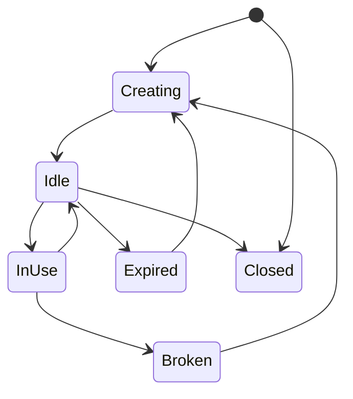
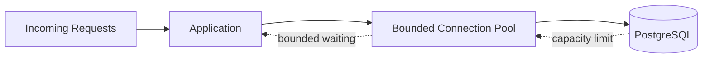

# 20- Connection Pooling

## Overview

Connection pooling is the mechanism used by backend applications to reuse database connections instead of creating a new database connection for every request.

For a PostgreSQL-backed application, establishing a connection involves networking, authentication, session initialization, and creation of a PostgreSQL backend process. Repeating this work for every request is expensive and can overwhelm the database under concurrency.

A connection pool places a bounded set of reusable connections between the application and database:

```text
Application Requests
        │
        ▼
┌─────────────────────┐
│   Connection Pool   │
│                     │
│ idle │ busy │ idle  │
└──────────┬──────────┘
           │
           ▼
      PostgreSQL
```

The purpose of pooling is not to make PostgreSQL capable of unlimited concurrency. It is to **reuse connections and control application concurrency against the database**.

---

## Why Connection Pooling Exists

Without pooling:

```text
Request
  ↓
Open TCP connection
  ↓
TLS / authentication
  ↓
Create database session
  ↓
Execute SQL
  ↓
Close connection
```

With pooling:

```text
Application startup / pool growth
        ↓
Create database connections
        ↓
Request
        ↓
Borrow connection
        ↓
Execute SQL
        ↓
Return connection
```

The second model avoids repeatedly paying connection-establishment costs.

Pooling is especially important for:

- High-throughput APIs.
- Django applications.
- FastAPI applications.
- Microservices.
- gRPC services.
- Celery workers.
- Kubernetes deployments.
- PostgreSQL systems with limited connection capacity.

---

## Connection Lifecycle

A pooled connection typically moves through these states:



A typical request lifecycle is:

1. Application receives a request.
2. Request needs database access.
3. Pool attempts to acquire an idle connection.
4. If available, the connection is borrowed.
5. SQL executes.
6. Transaction is committed or rolled back.
7. Session state is cleaned or reset as required.
8. Connection is returned to the pool.
9. Another request can reuse it.

The connection should not remain checked out while the application performs unrelated work.

---

## Connection Pool Components

A pool generally manages:

| Component | Purpose |
|---|---|
| Pool size | Number of persistent database connections |
| Maximum overflow | Temporary connections beyond the base pool |
| Acquisition timeout | Maximum time waiting for a connection |
| Idle connections | Connections currently available |
| Active connections | Connections currently borrowed |
| Connection validation | Detect broken/stale connections |
| Recycling | Replace connections after a lifetime |
| Reset behavior | Clean transaction/session state |
| Queueing | Control requests waiting for connections |

Different libraries expose different configuration names, but the underlying concepts are similar.

---

## Pool Size

`pool_size` defines the number of persistent connections maintained by an application pool.

For example:

```text
pool_size = 10
```

means the application can maintain approximately 10 pooled database connections.

It does **not** mean the application can efficiently execute only 10 total requests.

Requests that do not require database access can continue independently.

However, only a bounded number of database operations can hold connections concurrently.

---

## Maximum Overflow

Some pool implementations allow temporary connections above the base pool.

For example:

```text
pool_size = 10
max_overflow = 5
```

Potential database connections:

```text
10 persistent
+
5 temporary
=
15 maximum
```

Overflow can absorb short bursts, but it should not be treated as unlimited scaling.

Too much overflow can cause:

- PostgreSQL connection pressure.
- Memory growth.
- CPU scheduling overhead.
- Increased context switching.
- Higher query concurrency.
- Lock contention.

---

## Connection Acquisition Timeout

When all pool connections are busy, new requests wait.

A pool should normally have a bounded acquisition timeout.

```text
Request
   ↓
Acquire connection
   ↓
No connection available
   ↓
Wait
   ↓
Timeout
```

Without bounded waiting, requests can accumulate indefinitely.

A useful failure model is:

```text
Database slow
     ↓
Connections remain busy longer
     ↓
Pool becomes exhausted
     ↓
Requests wait for connections
     ↓
Request latency increases
     ↓
Upstream timeouts/retries occur
```

This is why pool exhaustion is often a **symptom**, not the original problem.

---

## Connection Pooling and PostgreSQL

PostgreSQL uses a process-based server architecture where client connections correspond to PostgreSQL backend processes.

Every connection therefore consumes database resources.

Important PostgreSQL limits and resources include:

- `max_connections`.
- Backend process memory.
- Shared memory.
- CPU scheduling.
- Authentication overhead.
- Session state.
- Network resources.

If an application fleet creates too many connections, PostgreSQL may spend more resources managing connections than executing useful work.

---

## Fleet-Level Connection Capacity

Connection capacity must be calculated across the entire deployment.

Consider:

```text
20 Kubernetes pods
×
10 database connections/pod
=
200 connections
```

Now add:

```text
Celery workers = 50
Reporting jobs = 20
Administrative connections = 10
```

Total potential demand becomes:

```text
280 connections
```

If PostgreSQL has:

```text
max_connections = 300
```

only a small margin remains.

This is why connection capacity must be planned at the **fleet level**, not per service instance.

---

## Connection Budget

A useful production approach is to define an explicit database connection budget.

Example:

| Consumer | Instances | Connections each | Maximum |
|---|---:|---:|---:|
| API | 15 | 8 | 120 |
| Async API | 5 | 8 | 40 |
| Celery | 10 | 5 | 50 |
| Reporting | 2 | 5 | 10 |
| Operations | — | — | 20 |
| Reserved capacity | — | — | 60 |
| **Total** | | | **300** |

The actual values should come from workload testing and database capacity rather than arbitrary formulas.

---

## Connection Pooling Does Not Increase Database Capacity

This is an important distinction.

Pooling provides:

- Connection reuse.
- Bounded concurrency.
- Lower connection setup overhead.
- Better resource control.

Pooling does not provide:

- More CPU.
- More memory.
- More disk I/O.
- More write capacity.
- Unlimited query concurrency.

If PostgreSQL can efficiently process 100 concurrent database operations, changing a pool from 100 to 500 does not make the database five times faster.

It may make the database less stable.

---

## Pool Size vs Application Concurrency

More concurrency is not always better.

Suppose:

```text
Database query time = 20 ms
```

and the application attempts to run:

```text
2,000 concurrent queries
```

The database may become CPU-, I/O-, or lock-bound.

A smaller pool can act as a form of backpressure:

```text
Large application concurrency
          ↓
Bounded connection pool
          ↓
Controlled DB concurrency
          ↓
Predictable database load
```

This is often preferable to allowing every application request to hit PostgreSQL simultaneously.

---

## Connection Pooling and Backpressure

A healthy system intentionally allows some work to wait or fail rather than overwhelming the database.



The pool becomes one of several backpressure mechanisms.

Other mechanisms include:

- API rate limiting.
- Queue limits.
- Kafka consumer concurrency.
- Celery worker limits.
- Circuit breakers.
- Request timeouts.

---

## Pool Exhaustion

Pool exhaustion occurs when all usable connections are checked out and new requests cannot acquire one within the configured timeout.

Common causes include:

| Cause | Effect |
|---|---|
| Slow queries | Connections remain busy |
| Long transactions | Connections remain checked out |
| Lock contention | Requests hold connections while waiting |
| Connection leaks | Connections never return |
| External calls inside transactions | DB connections remain occupied |
| Pool too small | Legitimate concurrency queues |
| Pool too large | Database becomes overloaded |
| Retry storm | Connection demand increases rapidly |

The correct response is to identify the cause rather than automatically increasing the pool size.

---

## Connection Leaks

A connection leak occurs when application code acquires a connection but does not reliably return it.

Bad resource management can eventually produce:

```text
Healthy
  ↓
Connections gradually lost
  ↓
Pool utilization increases
  ↓
Pool exhausted
  ↓
Requests timeout
```

Use context-managed patterns where supported.

For SQLAlchemy:

```python
from sqlalchemy import create_engine, text

engine = create_engine(
    "postgresql+psycopg://user:password@db:5432/app",
    pool_size=10,
    max_overflow=5,
    pool_timeout=10,
    pool_recycle=1800,
    pool_pre_ping=True,
)

with engine.connect() as connection:
    result = connection.execute(
        text("SELECT id, status FROM orders WHERE id = :order_id"),
        {"order_id": order_id},
    )
    row = result.first()
```

The context manager ensures the connection is returned to the pool.

---

## Transactions and Connection Lifetime

A connection checked out from a pool may remain occupied for the entire transaction.

Therefore:

```text
Long transaction
      ↓
Connection occupied longer
      ↓
Pool capacity decreases
      ↓
More requests wait
```

Transactions should generally be:

- Short.
- Explicit.
- Focused on database work.
- Free of unnecessary network calls.
- Free of slow external dependencies.

Avoid:

```text
BEGIN
  ↓
Database update
  ↓
HTTP API call
  ↓
Wait 3 seconds
  ↓
Another database query
  ↓
COMMIT
```

The connection may be occupied throughout the external call.

Prefer:

```text
Prepare data
  ↓
External work
  ↓
Short DB transaction
  ↓
Commit
```

When atomicity across the database and external system is required, use patterns such as a transactional outbox rather than holding a database transaction open across the external call.

---

## Idle in Transaction

One particularly dangerous state is:

```text
idle in transaction
```

The application has started a transaction but is currently not executing a query.

Example:

```text
BEGIN
UPDATE ...
application waits
application performs other work
COMMIT
```

The connection remains occupied.

Long idle transactions can also interfere with PostgreSQL vacuum cleanup and increase operational problems.

Monitor:

```sql
SELECT
    pid,
    usename,
    application_name,
    state,
    xact_start,
    query_start,
    state_change,
    wait_event_type,
    wait_event,
    query
FROM pg_stat_activity
WHERE state = 'idle in transaction'
ORDER BY xact_start;
```

---

## Django Connection Management

Django's database connection handling differs from a traditional explicit application-level pool.

`CONN_MAX_AGE` controls how long Django may reuse a persistent database connection:

```python
DATABASES = {
    "default": {
        "ENGINE": "django.db.backends.postgresql",
        "NAME": "app",
        "USER": "app_runtime",
        "PASSWORD": "...",
        "HOST": "postgres",
        "PORT": "5432",
        "CONN_MAX_AGE": 60,
    }
}
```

Important:

> `CONN_MAX_AGE` is connection persistence, not a configurable pool-size setting.

Django deployment topology, worker count, process model, and an external pooler such as PgBouncer determine the actual connection behavior.

---

## FastAPI and SQLAlchemy

FastAPI applications commonly use SQLAlchemy connection pools.

A typical synchronous engine might use:

```python
from sqlalchemy import create_engine

engine = create_engine(
    "postgresql+psycopg://user:password@db:5432/app",
    pool_size=10,
    max_overflow=5,
    pool_timeout=10,
    pool_recycle=1800,
    pool_pre_ping=True,
)
```

For async applications, use the corresponding async SQLAlchemy engine and async PostgreSQL driver.

The key design principle remains the same:

```text
Request
  ↓
Acquire
  ↓
Database work
  ↓
Commit / rollback
  ↓
Release
```

Do not hold a connection while performing unrelated application work.

---

## PgBouncer

PgBouncer is a lightweight PostgreSQL connection pooler.

Architecture:

```text
Many application clients
          │
          ▼
      PgBouncer
          │
          ▼
Controlled PostgreSQL sessions
          │
          ▼
      PostgreSQL
```

It can be useful when:

- Many application processes create connections.
- Kubernetes scaling creates connection spikes.
- Serverless workloads create frequent connections.
- PostgreSQL connection limits are relatively low.
- Multiple services need controlled database concurrency.

---

## PgBouncer Pooling Modes

| Mode | Connection assignment | Main consideration |
|---|---|---|
| Session pooling | Client keeps server connection for session | Strong session compatibility |
| Transaction pooling | Server connection assigned per transaction | Better multiplexing; session state restrictions |
| Statement pooling | Connection assigned per statement | Most restrictive; limited compatibility |

Transaction pooling is often useful for stateless request/transaction workloads, but applications must not assume a server session remains attached across transactions.

Session-specific features require particular care.

---

## Session State and Pooling

Pooled connections can retain session state.

Examples include:

- `SET` parameters.
- Temporary tables.
- Prepared statements.
- Advisory locks.
- Session authorization.
- Search paths.
- Application-specific settings.

This creates a security and correctness risk:

```text
Request A
  ↓
SET tenant context
  ↓
Connection returned
  ↓
Request B
  ↓
Connection reused
  ↓
Old state accidentally remains
```

For tenant-scoped context, transaction-scoped settings such as:

```sql
SET LOCAL app.tenant_id = 'tenant-123';
```

are safer than session-level state when used correctly.

Always understand how the pooler and driver reset session state.

---

## Pooling and Row-Level Security

PostgreSQL Row-Level Security can use session configuration as part of tenant isolation.

A request may establish:

```sql
BEGIN;

SET LOCAL app.tenant_id = 'tenant-123';

SELECT *
FROM invoices;

COMMIT;
```

`SET LOCAL` limits the setting to the current transaction.

This is particularly useful with transaction pooling because the application should not depend on a connection remaining associated with a request after the transaction ends.

The tenant value must come from a trusted authorization path. Never allow arbitrary client input to directly determine database security context.

---

## Pooling and Read Replicas

Applications with primary and replica databases may use separate pools:

```text
                 ┌── Primary Pool ──> Primary
Application ─────┤
                 └── Replica Pool ──> Replica
```

This allows independent control of:

- Write concurrency.
- Read concurrency.
- Connection budgets.
- Replica capacity.

However, read routing must account for:

- Replica lag.
- Read-after-write requirements.
- Failover.
- Connection limits.
- Replica availability.

A large replica pool does not help if the replica itself is CPU- or I/O-bound.

---

## Connection Pools in Microservices

Suppose:

```text
Service A → pool 10
Service B → pool 10
Service C → pool 10
Service D → pool 10
```

With 10 replicas each:

```text
4 services × 10 replicas × 10 connections
=
400 potential connections
```

The database does not care that these connections came from separate services.

Capacity planning must consider the aggregate fleet.

This becomes especially important during Kubernetes autoscaling.

---

## Kubernetes and Connection Storms

Horizontal Pod Autoscaling can unexpectedly increase database connections.

Example:

```text
10 pods × 10 connections = 100
```

Scale to:

```text
50 pods × 10 connections = 500
```

If PostgreSQL cannot support 500 active sessions, autoscaling the application can destabilize the database.

A production design should coordinate:

- HPA limits.
- Pool size.
- PgBouncer capacity.
- PostgreSQL connection budget.
- Query concurrency.
- Database CPU/memory limits.

Application scaling should never be treated as independent of database capacity.

---

## Deployment Connection Storms

Deployments can temporarily create many connections.

For example:

```text
Old pods: 20 × 10 = 200
New pods: 20 × 10 = 200
```

During a rolling deployment:

```text
Potential = 400 connections
```

If new processes eagerly initialize pools, the database can experience a connection spike even though steady-state traffic has not changed.

Use:

- Controlled rollout.
- Appropriate pool initialization.
- Connection limits.
- PgBouncer where appropriate.
- Graceful termination.
- Readiness checks.
- Deployment capacity testing.

---

## Connection Recycling

Long-lived connections can become stale because of:

- Network failures.
- Load balancer behavior.
- Database failover.
- Firewall state.
- Infrastructure maintenance.
- Server-side connection termination.

Connection recycling replaces connections periodically.

For SQLAlchemy:

```python
engine = create_engine(
    DATABASE_URL,
    pool_recycle=1800,
    pool_pre_ping=True,
)
```

`pool_pre_ping` can detect certain stale connections before use.

Neither setting replaces proper timeout and failure handling.

---

## Database Failover

During PostgreSQL failover:

```text
Old primary
    ↓
connection failure
    ↓
pool detects broken connections
    ↓
new primary endpoint
    ↓
new connections
```

Applications should use a stable database endpoint where possible rather than hard-coding an individual database node.

Pools should be able to discard broken connections and establish new ones.

The application must also handle transactions that were interrupted during failover.

---

## Uncertain Commit

A particularly important failure case occurs when the network fails around commit.

```text
Application
    │
    │ COMMIT
    ▼
PostgreSQL
    │
    X network failure
    │
    ▼
Application
```

The application may not know whether the transaction committed.

Automatically retrying the entire transaction can therefore produce duplicate effects unless the operation is idempotent.

Use:

- Idempotency keys.
- Unique constraints.
- Durable operation identifiers.
- Safe transaction retry strategies.

Connection pooling does not solve transaction ambiguity.

---

## Timeouts

Different timeout layers protect different resources.

| Timeout | Protects |
|---|---|
| Connection acquisition timeout | Waiting for a pool connection |
| Connection timeout | Establishing database connection |
| `lock_timeout` | Waiting to acquire a lock |
| `statement_timeout` | Statement execution duration |
| Application request timeout | End-to-end request |
| Load balancer timeout | Network/request lifecycle |
| Worker timeout | Background job execution |

They should be designed together.

For example:

```text
Client timeout
    >
API timeout
    >
DB statement timeout
```

Exact values depend on the system.

The important point is that no single timeout provides complete protection.

---

## Pool Sizing Strategy

There is no universal pool size.

Start with:

1. Database CPU and memory capacity.
2. Expected query concurrency.
3. Query latency.
4. Application process count.
5. Number of services.
6. Background workers.
7. Database connection limits.
8. Failover requirements.
9. Load-test results.

A common mistake is:

```text
"Server has 64 CPU cores, therefore pool_size = 64."
```

CPU count alone does not determine optimal database concurrency.

If queries are I/O-heavy, CPU count is insufficient to predict useful concurrency.

---

## Pool Sizing Example

Suppose:

```text
Peak database workload = 1,000 queries/sec
Average DB residence time = 20 ms
```

A simplified concurrency estimate is:

```text
Concurrency ≈ Throughput × Latency

Concurrency ≈ 1,000 × 0.020
             ≈ 20
```

This does not mean the correct pool size is exactly 20.

Real systems include:

- Query distribution.
- Different endpoints.
- Lock waits.
- Bursts.
- Transactions containing multiple queries.
- Background work.
- Database resource constraints.

Use the estimate as a starting point and validate with load testing.

---

## Monitoring Connection Pools

Application-level metrics should include:

- Pool size.
- Active connections.
- Idle connections.
- Overflow connections.
- Acquisition wait time.
- Acquisition timeout count.
- Connection creation rate.
- Connection recycling rate.
- Connection errors.
- Pool utilization.

A useful dashboard relationship is:

```text
Pool utilization
+
Pool wait time
+
Database active sessions
+
Database CPU
+
Query latency
```

This helps determine whether the pool is actually the bottleneck.

---

## PostgreSQL Connection Monitoring

Use `pg_stat_activity` to inspect current sessions:

```sql
SELECT
    pid,
    usename,
    application_name,
    client_addr,
    state,
    wait_event_type,
    wait_event,
    xact_start,
    query_start,
    state_change,
    query
FROM pg_stat_activity
ORDER BY query_start NULLS LAST;
```

Count connections by state:

```sql
SELECT
    state,
    count(*)
FROM pg_stat_activity
GROUP BY state
ORDER BY count(*) DESC;
```

Inspect connections by application:

```sql
SELECT
    application_name,
    usename,
    state,
    count(*)
FROM pg_stat_activity
GROUP BY application_name, usename, state
ORDER BY count(*) DESC;
```

These queries help identify which workload is consuming the database connection budget.

---

## Detecting Connection Pressure

Useful signals include:

```text
Pool utilization ↑
Pool wait time ↑
Database active sessions ↑
Database CPU ↑
Query latency ↑
```

This may indicate database saturation.

But:

```text
Pool utilization ↑
Database CPU low
Database queries fast
```

could simply mean the pool is too small.

Conversely:

```text
Pool utilization ↑
Database CPU 95%
```

may mean increasing the pool would make the incident worse.

---

## Connection Pool vs Database Saturation

| Situation | Likely Interpretation |
|---|---|
| Pool full, DB lightly loaded | Pool may be too small |
| Pool full, DB CPU saturated | DB likely bottleneck |
| Pool full, lock waits high | Concurrency/locking bottleneck |
| Pool full, queries slow | Query/I/O bottleneck |
| Pool full, leaked connections | Application bug |
| DB connections high, traffic normal | Pool/configuration problem |
| Connections spike during deploy | Deployment connection storm |

Always correlate application and database metrics.

---

## Connection Pooling and Redis

Redis can sometimes reduce database connection demand by removing repetitive reads:

```text
Request
  ↓
Redis
  ├── Hit → return
  │
  └── Miss → PostgreSQL
```

Caching can reduce:

- Query volume.
- Connection demand.
- Database CPU.
- Database I/O.

However, cache misses can also create a sudden database load spike.

Use:

- Cache-aside patterns.
- TTLs.
- Request coalescing where appropriate.
- Stampede protection.
- Bounded database concurrency.

Do not use Redis merely to hide an unhealthy database architecture.

---

## Connection Pooling and Celery

Celery workers can create their own database connections.

Consider:

```text
10 Celery workers
×
5 DB connections
=
50 potential connections
```

Workers processing database-heavy tasks can compete with HTTP traffic.

Production systems may use:

- Separate connection budgets.
- Dedicated read pools.
- Lower worker concurrency.
- Queue-level rate limits.
- Separate databases for heavy workloads.

Background work should not consume all database capacity needed by user-facing traffic.

---

## Connection Pooling and Kafka Consumers

Kafka consumers can also create substantial database concurrency.

For example:

```text
50 consumers
    ↓
50 concurrent database transactions
```

Increasing consumer concurrency without increasing database capacity awareness can cause:

- Connection exhaustion.
- Lock contention.
- CPU saturation.
- WAL growth.
- Increased transaction latency.

Consumer concurrency should be treated as part of the database capacity model.

---

## Pooling and gRPC

Long-lived gRPC connections do not imply long-lived database connections.

A gRPC server may handle many concurrent RPCs while using a bounded database pool:

```text
Many gRPC streams/RPCs
          ↓
Application concurrency
          ↓
Bounded DB pool
          ↓
PostgreSQL
```

This prevents transport-level concurrency from automatically becoming unlimited database concurrency.

---

## Connection State Hygiene

A pooled connection must be safe for the next request.

Potential state includes:

- Open transactions.
- Session variables.
- Changed isolation settings.
- Temporary tables.
- Prepared statements.
- Advisory locks.
- `search_path`.
- Role changes.

Before returning a connection to the pool, ensure:

```text
Transaction committed or rolled back
+
Expected session state
+
No leaked locks
+
No unexpected temporary state
```

Pool libraries often perform some reset behavior, but applications should understand what is and is not reset.

---

## Security Considerations

Connection pooling affects security because connections carry database identity and session state.

Important controls include:

- Use dedicated runtime roles.
- Avoid superuser application connections.
- Use least privilege.
- Use TLS for database connections.
- Protect database credentials.
- Rotate credentials safely.
- Avoid logging passwords.
- Avoid logging sensitive connection strings.
- Validate tenant context.
- Understand session-state persistence.

A pooled connection must never accidentally carry authorization state from one request into another.

---

## High Availability Considerations

A production pool should behave correctly during:

- Primary failure.
- Database restart.
- Network partition.
- Planned failover.
- Replica promotion.
- DNS/endpoint changes.

The architecture should provide:

```text
Stable DB endpoint
       ↓
Connection pool
       ↓
Healthy PostgreSQL node
```

After failover, existing connections may be invalid and must be recreated.

Connection retry should use bounded backoff and jitter to avoid a reconnect storm.

---

## Reliability and Retry Storms

Suppose PostgreSQL becomes temporarily unavailable.

Without coordination:

```text
1,000 requests
    ↓
1,000 connection failures
    ↓
1,000 immediate retries
    ↓
1,000 more connections
```

This can prevent recovery.

Prefer:

- Bounded retries.
- Exponential backoff.
- Jitter.
- Request deadlines.
- Connection acquisition timeouts.
- Circuit breaking where appropriate.
- Controlled worker concurrency.

Retries should reduce pressure during an outage, not increase it.

---

## Connection Pooling During Deployments

A production deployment should consider:

- Old application processes.
- New application processes.
- Pool initialization.
- Graceful shutdown.
- Connection draining.
- HPA behavior.
- Migration connections.
- Worker restarts.

A rolling deployment can temporarily exceed steady-state connection demand.

Deployment strategy is therefore part of connection capacity planning.

---

## Performance Considerations

Connection pooling reduces connection setup overhead, but it does not eliminate query costs.

If:

```text
Connection setup = 5 ms
Query execution = 500 ms
```

pooling may reduce the setup overhead significantly while leaving the query bottleneck unchanged.

Performance work should therefore distinguish:

```text
Connection establishment latency
+
Pool acquisition latency
+
Database execution latency
+
Lock wait latency
+
Network/result-transfer latency
```

Measure each separately when diagnosing performance.

---

## Operational Failure Scenarios

| Failure | Typical Effect | Response |
|---|---|---|
| Pool exhausted | Requests wait/fail | Inspect leaks, latency, DB saturation |
| PostgreSQL unavailable | Connection failures | Reconnect with backoff |
| Slow query | Connections held longer | Optimize query / reduce concurrency |
| Deadlock | Transaction failure | Retry whole transaction safely |
| Lock contention | Connections waiting | Identify blockers |
| Deployment storm | Connection spike | Control rollout/pool initialization |
| Replica failure | Read pool errors | Route to healthy replica/primary |
| Network failure | Broken connections | Validate/recycle connections |
| Long transaction | Pool + vacuum pressure | Reduce transaction scope |

---

## Common Mistakes

### Making the Pool as Large as Possible

A large pool can overwhelm PostgreSQL.

**Better:** determine useful concurrency through measurement and load testing.

### Increasing the Pool When Queries Are Slow

This often increases concurrent expensive work.

**Better:** identify whether CPU, I/O, locks, or query plans are the actual bottleneck.

### Ignoring Kubernetes Scaling

Per-pod pool sizes multiply across replicas.

**Better:** calculate the maximum fleet-wide connection budget.

### Holding Connections During External Calls

This wastes scarce database concurrency.

**Better:** perform external operations outside database transactions unless strict atomicity requires another architecture.

### Forgetting Background Workers

Celery and Kafka consumers can consume large portions of database capacity.

**Better:** include every database client in capacity planning.

### Assuming `CONN_MAX_AGE` Is a Pool

Django persistent connections are not equivalent to a configurable connection pool.

**Better:** understand Django worker/process behavior and use an external pooler where appropriate.

### Ignoring Session State

Pooled connections can carry state across requests if not properly reset.

**Better:** use transaction-scoped state such as `SET LOCAL` where appropriate and understand pool reset behavior.

### Retrying Aggressively

Immediate reconnect and query retries can create a retry storm.

**Better:** use bounded exponential backoff and jitter.

---

## Production Best Practices

1. **Treat connections as a finite resource.**
2. **Define a fleet-wide database connection budget.**
3. **Keep transactions short and focused.**
4. **Never hold database connections during unnecessary external work.**
5. **Use bounded pool acquisition timeouts.**
6. **Monitor pool utilization and wait time.**
7. **Correlate pool metrics with PostgreSQL CPU, I/O, locks, and query latency.**
8. **Include Celery, Kafka, reporting, and administrative workloads.**
9. **Account for Kubernetes scaling and rolling deployments.**
10. **Use PgBouncer when connection multiplexing materially helps the architecture.**
11. **Understand session-state limitations before using transaction pooling.**
12. **Use safe transaction-scoped context for RLS and multi-tenancy.**
13. **Recycle or validate stale connections appropriately.**
14. **Use bounded retries with backoff and jitter.**
15. **Load-test connection behavior during peak traffic and failover.**

---

## Interview Traps

### "Why do we need connection pooling?"

To reuse connections and bound database concurrency. Creating a new database connection for every request is expensive and can overwhelm PostgreSQL.

### "Does a larger connection pool improve performance?"

Not necessarily. Once the database reaches its useful concurrency limit, more connections can increase contention, CPU scheduling, memory usage, and latency.

### "How do you choose pool size?"

Based on database capacity, query latency, workload concurrency, application process count, connection limits, background workers, failover requirements, and load-test results.

### "What causes connection pool exhaustion?"

Common causes include slow queries, lock contention, long transactions, connection leaks, external calls inside transactions, excessive application concurrency, or an undersized pool.

### "Why can increasing `max_connections` make things worse?"

Each PostgreSQL connection consumes resources. Allowing more sessions can increase memory and scheduling overhead without increasing useful query-processing capacity.

### "What happens during PostgreSQL failover?"

Existing connections to the failed node may become invalid. The pool must discard/recreate them against the new primary, while applications must safely handle interrupted transactions and uncertain commit outcomes.

### "What is PgBouncer?"

A PostgreSQL connection pooler that sits between clients and PostgreSQL and can multiplex many client connections onto a smaller controlled set of server connections.

### "Why is transaction pooling different from session pooling?"

Transaction pooling can assign a PostgreSQL server connection to a client only for the duration of a transaction. Therefore, applications cannot assume session state persists across transactions.

### "Why are idle transactions dangerous?"

They occupy connections and can prevent PostgreSQL from reclaiming old row versions, contributing to connection pressure, bloat, and vacuum problems.

### "Should every application instance have the same pool size?"

Not automatically. Pool size should reflect workload, process count, database capacity, and the aggregate connection budget.

---

## Production Review Checklist

### Application

- [ ] Connections are always returned to the pool.
- [ ] Transactions are short.
- [ ] External calls are not unnecessarily inside transactions.
- [ ] Database operations have appropriate timeouts.
- [ ] Retry logic uses backoff and jitter.
- [ ] Connection errors are handled safely.

### Pool

- [ ] Pool size is explicitly configured.
- [ ] Maximum overflow is understood.
- [ ] Acquisition timeout is bounded.
- [ ] Connection validation/recycling is configured appropriately.
- [ ] Pool utilization is monitored.
- [ ] Pool wait time is monitored.

### PostgreSQL

- [ ] `max_connections` is understood.
- [ ] Active connections are monitored.
- [ ] Idle-in-transaction sessions are monitored.
- [ ] Lock waits are monitored.
- [ ] Query latency is monitored.
- [ ] CPU and memory capacity are monitored.

### Deployment

- [ ] Kubernetes replica scaling is included.
- [ ] Rolling deployments are included.
- [ ] Celery workers are included.
- [ ] Kafka consumers are included.
- [ ] Reporting workloads are included.
- [ ] Failover connection behavior is tested.

### Security

- [ ] Runtime roles use least privilege.
- [ ] Credentials are stored securely.
- [ ] TLS is enabled where required.
- [ ] Session state cannot leak authorization context.
- [ ] Tenant context is validated.
- [ ] Sensitive connection information is not logged.

---

## Key Takeaways

- **Connection pools control concurrency:** they reuse connections and protect PostgreSQL from uncontrolled client concurrency; they do not create additional database capacity.
- **Pool exhaustion is usually a symptom:** slow queries, locks, long transactions, leaks, and external calls can keep connections occupied and cause cascading request latency.
- **Size pools across the entire fleet:** Kubernetes replicas, application processes, Celery workers, Kafka consumers, reporting jobs, and deployments all consume the database connection budget.
- **Connection lifecycle is part of reliability:** stale connections, failover, uncertain commits, retries, and reconnect storms require bounded timeouts, safe transaction handling, and backoff with jitter.
- **Session hygiene matters:** pooled connections can carry transactional or session state, so reset behavior and transaction-scoped context are critical for correctness and multi-tenant security.