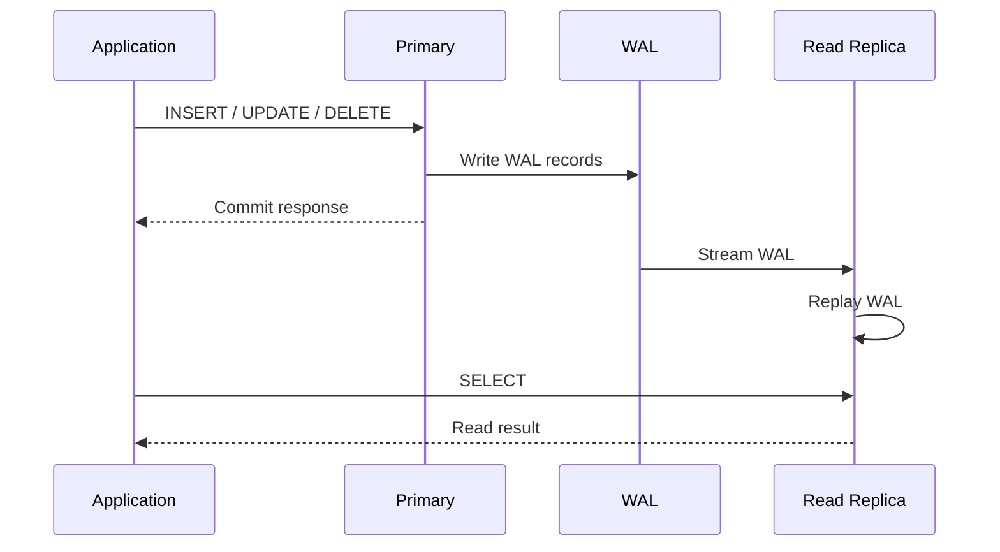
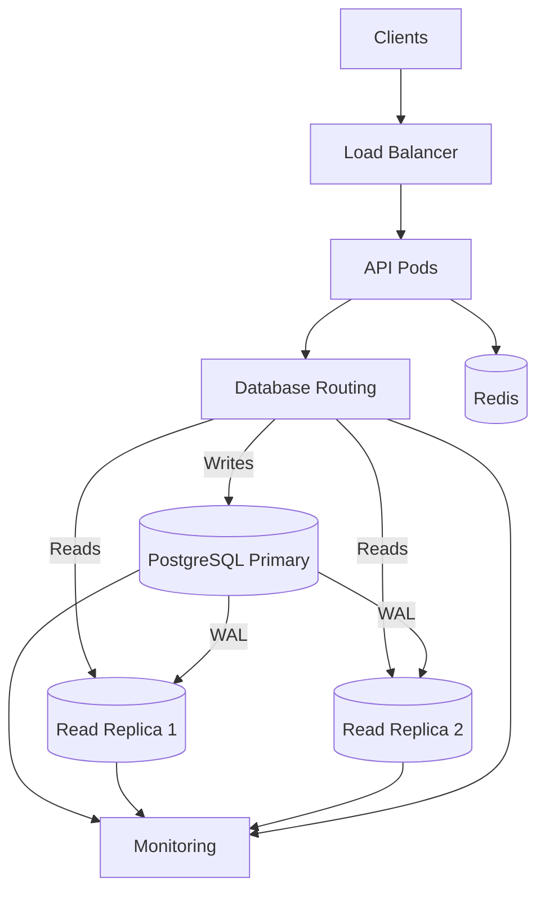

# 21- Read Replicas

## Overview

A read replica is a database instance that continuously receives replicated database changes from a primary database and serves read-only workloads.

For PostgreSQL, a common architecture is:

```text
                    ┌──────────────────┐
                    │   Backend API    │
                    └────────┬─────────┘
                             │
                ┌────────────┴────────────┐
                │                         │
             Writes                     Reads
                │                         │
                ▼                         ▼
        ┌───────────────┐       ┌────────────────┐
        │    Primary    │       │ Read Replica(s)│
        │   PostgreSQL  │──────▶│   PostgreSQL   │
        └───────────────┘  WAL  └────────────────┘
```

The primary handles writes and produces WAL records. Replicas receive and replay those changes, allowing read traffic to be distributed across additional database instances.

Read replicas are primarily a **read-scaling mechanism**. They are not a replacement for backups, and they do not automatically provide strong read-after-write consistency or unlimited database scalability.

---

## Why Read Replicas Exist

A single PostgreSQL primary must handle:

- Inserts.
- Updates.
- Deletes.
- Reads.
- Index maintenance.
- Vacuum-related work.
- Transaction processing.

For a read-heavy workload, reads can become a significant portion of the primary's resource consumption.

Example:

```text
10,000 requests/sec

8,000 read requests
2,000 write requests
```

Sending every request to the primary creates:

```text
                 ┌─────────────┐
All traffic ────▶│   Primary   │
                 └─────────────┘
```

Read replicas allow:

```text
                    ┌─────────────┐
                 ┌─▶│   Replica 1 │
                 │  └─────────────┘
                 │
Reads ───────────┼─▶┌─────────────┐
                 │  │   Replica 2 │
                 │  └─────────────┘
                 │
                 └─▶┌─────────────┐
                    │   Replica 3 │
                    └─────────────┘

Writes ────────────▶ Primary
```

The goal is to increase available read capacity while keeping writes centralized.

---

## Primary and Replica Responsibilities

| Responsibility | Primary | Read Replica |
|---|---:|---:|
| `SELECT` | Yes | Yes |
| `INSERT` | Yes | No |
| `UPDATE` | Yes | No |
| `DELETE` | Yes | No |
| Generate WAL | Yes | No |
| Receive replicated WAL | No | Yes |
| Replay WAL | No | Yes |
| Serve read traffic | Yes | Yes |
| Become future primary | Potentially | Yes |
| Replace backups | No | No |

A replica may be promoted to primary during failover, but replication itself should not be confused with backup or disaster recovery.

---

## PostgreSQL Replication Flow

PostgreSQL physical streaming replication is based on WAL.

A simplified flow is:



The important consequence is that replication is normally **asynchronous unless synchronous replication has explicitly been configured**.

Therefore:

```text
Primary commit
      ↓
Replica receives WAL
      ↓
Replica replays WAL
      ↓
Replica becomes current
```

There may be a delay between these stages.

---

## Read Replica Lag

Replica lag is the difference between the state of the primary and the state currently visible on the replica.

Example:

```text
Primary:
Order 100 created

Replica:
Order 100 not yet visible
```

The application may therefore observe:

```text
POST /orders
    ↓
Primary
    ↓
201 Created

GET /orders/100
    ↓
Replica
    ↓
404 Not Found
```

The order exists on the primary, but replication has not caught up.

This is one of the most important production concerns when introducing read replicas.

---

## Read-After-Write Consistency

Applications frequently require:

> After a successful write, the next read should observe that write.

A replica-based architecture can violate this requirement.

For example:

```text
POST /profile
   ↓
Primary
   ↓
COMMIT

GET /profile
   ↓
Replica
   ↓
Old data
```

This is not necessarily a replication failure. It may be normal asynchronous replication behavior.

Applications must explicitly decide which operations require strong read-after-write behavior.

---

## Read Routing

A typical backend architecture separates database operations:

```text
Application
    │
    ├── Write → Primary
    │
    └── Read  → Replica
```

Routing can happen at:

- Application level.
- Database router level.
- Service/repository layer.
- Proxy layer.
- Infrastructure/load-balancer layer.

Application-level routing often provides the most context because the application knows whether an operation requires fresh data.

---

## Django Read Routing

Django supports database routers that can route reads and writes.

A simplified example:

```python
class PrimaryReplicaRouter:
    def db_for_read(self, model, **hints):
        return "replica"

    def db_for_write(self, model, **hints):
        return "default"

    def allow_relation(self, obj1, obj2, **hints):
        return True
```

Configuration might look like:

```python
DATABASES = {
    "default": {
        "ENGINE": "django.db.backends.postgresql",
        "NAME": "app",
        "HOST": "primary",
        "USER": "app_runtime",
        "PASSWORD": "...",
    },
    "replica": {
        "ENGINE": "django.db.backends.postgresql",
        "NAME": "app",
        "HOST": "replica",
        "USER": "app_readonly",
        "PASSWORD": "...",
    },
}
```

For operations that require the primary:

```python
Order.objects.using("default").get(id=order_id)
```

The exact routing strategy should be centralized rather than scattered throughout application code.

---

## FastAPI and SQLAlchemy

With SQLAlchemy, applications can maintain separate engines or sessions for primary and replica workloads.

Conceptually:

```text
Write session → Primary engine
Read session  → Replica engine
```

For example:

```python
from sqlalchemy import create_engine

primary_engine = create_engine(PRIMARY_DATABASE_URL)

replica_engine = create_engine(REPLICA_DATABASE_URL)
```

A repository or service layer can then choose the appropriate connection based on consistency requirements.

Avoid making every developer manually decide which engine to use for every query. Centralize routing rules where possible.

---

## Primary Fallback

If a replica becomes unavailable, applications may need to route reads elsewhere.

A common strategy is:

```text
Read request
     ↓
Replica healthy?
   /      \
 yes       no
  ↓         ↓
Replica   Primary
```

However, blindly falling back all replica traffic to the primary can overload the primary.

Production systems should define:

- Maximum fallback capacity.
- Health-check behavior.
- Connection limits.
- Circuit breakers.
- Rate limits.
- Failure thresholds.

A replica failure should not automatically become a primary outage.

---

## Lag-Aware Routing

Binary health checks are not sufficient.

A replica may be:

```text
TCP healthy
PostgreSQL accepting connections
Application query succeeds
```

while being several seconds or minutes behind.

Therefore, production routing may consider:

```text
Replica health
+
Replication lag
+
Query latency
+
Capacity
```

Conceptually:

```text
Read
 ↓
Healthy replicas
 ↓
Remove replicas above lag threshold
 ↓
Select least-loaded suitable replica
```

---

## Measuring PostgreSQL Replication Lag

On the primary, inspect replication state with:

```sql
SELECT
    pid,
    application_name,
    client_addr,
    state,
    sync_state,
    write_lsn,
    flush_lsn,
    replay_lsn,
    write_lag,
    flush_lag,
    replay_lag
FROM pg_stat_replication;
```

On a standby, inspect recovery state:

```sql
SELECT
    pg_is_in_recovery();
```

`true` indicates that the server is operating as a standby/recovery instance.

LSNs can also be used for more precise replication coordination.

---

## LSN-Based Read Routing

For stronger read-after-write behavior, an application can associate a write with a WAL position.

Conceptually:

```text
Write to primary
      ↓
Obtain commit/WAL position
      ↓
Client/request carries required position
      ↓
Replica checks replay position
      ↓
Replica is caught up?
   /          \
 yes           no
  ↓             ↓
Read         Primary/wait
```

This is more sophisticated than simply waiting a fixed number of seconds.

A time-based rule such as:

```text
"Always wait 2 seconds after writes"
```

is unreliable because replication latency varies.

---

## Consistency Classes

Not every read needs the same consistency guarantee.

A useful classification is:

| Operation | Suitable replica? |
|---|---|
| Product catalog browsing | Usually |
| Public content | Usually |
| Search results | Usually |
| Analytics | Usually |
| User immediately viewing a created record | Primary or consistency-aware routing |
| Payment status immediately after update | Primary |
| Inventory after purchase | Primary |
| Administrative mutation verification | Usually primary |
| Historical reporting | Replica/OLAP system |

The decision should be based on business correctness, not simply whether a query is technically a `SELECT`.

---

## Replica Reads and Transactions

A transaction executed on a replica provides a consistent view of the replica's state, but not necessarily the latest state of the primary.

For example:

```text
Primary state:
A = 10
B = 20

Replica has:
A = 10
B = 15
```

A transaction on the replica can consistently read:

```text
A = 10
B = 15
```

while still being behind the primary.

Transaction-level consistency and primary-to-replica freshness are separate concepts.

---

## Read Replicas Do Not Scale Writes

A common misconception is:

```text
3 replicas
=
4× database write capacity
```

This is incorrect.

With primary-plus-replicas architecture:

```text
                    ┌─────────────┐
                    │   Primary   │
                    │    Writes   │
                    └──────┬──────┘
                           │
                 ┌─────────┼─────────┐
                 ▼         ▼         ▼
             Replica 1 Replica 2 Replica 3
                Reads      Reads      Reads
```

The primary still handles writes.

If the primary is write-bound because of:

- CPU.
- WAL generation.
- Lock contention.
- Disk throughput.
- Index maintenance.

Adding read replicas will not solve that bottleneck.

---

## Read Replicas vs Caching

Redis and read replicas solve different problems.

```text
Redis
→ Reduce repeated reads and latency

Read replica
→ Add database read capacity
```

A request might use:

```text
Request
  ↓
Redis
  ├── Hit → return
  │
  └── Miss
       ↓
     Replica
       ↓
     Cache
```

Caching can reduce database load, while replicas increase available database read capacity.

They are complementary.

---

## Read Replicas vs OLAP

Read replicas are useful for read scaling, but they are not automatically analytical databases.

Heavy analytical queries can consume:

- CPU.
- Memory.
- I/O.
- Temporary storage.
- Connections.

A reporting query on a replica can therefore interfere with API reads.

For significant analytical workloads, consider:

```text
OLTP Primary
    ↓
CDC / ETL
    ↓
Analytical Warehouse
```

rather than using the operational replica as an unrestricted reporting database.

---

## Multiple Read Replicas

A larger system may use several replicas:

```text
                     Primary
                    /   |   \
                   /    |    \
                  ▼     ▼     ▼
              Replica Replica Replica
                 1       2       3
```

A routing layer can distribute reads.

Possible strategies include:

| Strategy | Description | Risk |
|---|---|---|
| Round robin | Rotate replicas | Ignores lag/capacity |
| Random | Random selection | Uneven distribution possible |
| Least connections | Prefer less-loaded replica | Requires useful load metrics |
| Lag-aware | Exclude stale replicas | More operational complexity |
| Weighted | Assign capacity-based weights | Requires tuning |

For production systems, routing should account for both health and freshness.

---

## Replica Failure

Suppose:

```text
Replica 2 fails
```

A healthy architecture should continue:

```text
                 Primary
                /       \
           Replica 1   Replica 3
```

The application should stop routing new traffic to the failed replica.

If all replicas fail, the system needs a defined fallback strategy.

Possible choices include:

- Route reads to primary.
- Return degraded responses.
- Serve cached data.
- Reject non-critical reads.
- Fail over to another region.

The correct choice depends on business requirements.

---

## Primary Failure and Promotion

A replica can potentially be promoted to primary.

```text
Before:

Primary ──▶ Replica 1
        └──▶ Replica 2

After failure:

Replica 1 ──▶ Replica 2
   ↑
 New Primary
```

Promotion is an HA operation, not simply a read-routing operation.

A production failover process must address:

- Leader election.
- Fencing.
- Split brain.
- Client endpoint changes.
- Connection invalidation.
- Transaction uncertainty.
- Replication state.
- Application retries.

Read replicas can participate in HA, but merely having replicas does not guarantee automatic failover.

---

## Read Replicas and Connection Pools

Each replica may have its own connection pool.

Example:

```text
Primary pool
    ↓
Primary

Replica pool
    ↓
Replica 1 / 2 / 3
```

The connection budget must include all replicas.

A common mistake is to increase replica count and independently configure large pools:

```text
3 replicas
×
20 connections
=
60 replica connections
```

The database instances need sufficient memory and CPU to support those sessions.

---

## Replica Lag and Long Queries

A long-running query on a replica can sometimes conflict with recovery/replay activity.

For example:

```text
Replica
  ↓
Long SELECT
  ↓
Recovery needs to remove/replay conflicting state
  ↓
Conflict handling
```

Depending on PostgreSQL configuration, standby queries may be canceled or replay may be delayed.

Monitor:

- Replay lag.
- Long-running replica queries.
- Recovery conflicts.
- Query duration.
- Replica CPU/I/O.

Do not assume that read-only workloads are operationally harmless.

---

## Read Replicas and Connection Pooling

Replica pools should be bounded independently.

For example:

```text
Primary:
pool = 20

Replica:
pool = 10
```

The correct values depend on the database capacity and workload.

Avoid configuring:

```text
Primary pool = 100
Replica pool = 100
Replica pool = 100
Replica pool = 100
```

without calculating the resulting concurrency.

Connection pooling should protect each database instance rather than simply maximizing connections.

---

## Read Replica Security

Replica access should follow least privilege.

A dedicated read-only role can be used:

```sql
CREATE ROLE app_readonly LOGIN PASSWORD 'managed-secret';

GRANT CONNECT ON DATABASE app TO app_readonly;
GRANT USAGE ON SCHEMA public TO app_readonly;
GRANT SELECT ON ALL TABLES IN SCHEMA public TO app_readonly;
```

Future objects require appropriate default privileges from the role that creates them:

```sql
ALTER DEFAULT PRIVILEGES FOR ROLE app_owner
IN SCHEMA public
GRANT SELECT ON TABLES TO app_readonly;
```

Database credentials should be stored in a proper secret-management system rather than source control.

---

## Read Replicas and Row-Level Security

If PostgreSQL Row-Level Security is used, replica reads still need to respect the application's authorization model.

A replica does not remove the need for:

- Tenant authorization.
- Resource-level authorization.
- RLS policies.
- Secure tenant context.
- Least-privilege database roles.

Caching replica results in Redis adds another authorization boundary.

Never assume:

```text
"Replica is read-only"
=
"Data is safe to expose"
```

Read-only describes mutation capability, not authorization.

---

## Multi-Tenant Systems

In multi-tenant systems, read replicas can help with read scaling:

```text
                    Primary
                       │
              ┌────────┼────────┐
              ▼        ▼        ▼
          Replica 1 Replica 2 Replica 3
```

However, tenant isolation must remain enforced.

Possible controls include:

- Application-level tenant filtering.
- PostgreSQL RLS.
- Tenant-aware indexes.
- Separate database roles.
- Separate databases or schemas where required.

Replication does not create tenant isolation.

---

## Read Replicas and Django Transactions

Django applications must be careful with transaction boundaries.

For example:

```python
from django.db import transaction

with transaction.atomic(using="default"):
    order = Order.objects.using("default").create(
        customer_id=customer_id,
        total=total,
    )

    # Read from primary because the replica may lag.
    created_order = Order.objects.using("default").get(
        pk=order.pk,
    )
```

The application should not assume that immediately switching to:

```python
Order.objects.using("replica").get(pk=order.pk)
```

will find the newly created row.

---

## Read Replicas and Background Workers

Celery jobs often perform database reads.

For example:

```text
Celery
  ↓
Generate report
  ↓
Replica
```

This can be appropriate for non-critical reporting.

However, jobs that require fresh transactional state should read from the primary.

For example:

```text
Payment confirmation
Inventory reservation
Order state transition
```

should generally use the primary or an explicitly consistency-aware design.

---

## Read Replicas and Kafka

Kafka consumers may update a database and then perform follow-up reads.

A subtle consistency problem can occur:

```text
Kafka event
    ↓
Primary update
    ↓
Read replica
    ↓
Replica not caught up
```

The consumer may observe stale state.

Use the primary for operations requiring immediate consistency, or design the workflow around the event's data rather than assuming replica freshness.

---

## Read Replicas and Cache Invalidation

Suppose:

```text
Primary updated
     ↓
Cache invalidated
     ↓
Replica still stale
     ↓
Cache miss
     ↓
Replica returns old data
     ↓
Old data cached again
```

This is a subtle production failure.

Cache invalidation must account for replication lag when freshness matters.

Possible approaches include:

- Read from primary after invalidation.
- Delay caching until replica catches up.
- Use version/LSN-aware routing.
- Use event-driven cache updates.
- Avoid caching highly consistency-sensitive data.

---

## Monitoring

A production read-replica setup should monitor at least:

### Replication

- WAL generation rate.
- Replication lag.
- Replay LSN.
- WAL retention.
- Replication slot health.
- Replica connection state.
- Replica replay failures.

### Database

- CPU.
- Memory.
- Disk I/O.
- Disk capacity.
- Connection utilization.
- Query latency.
- Lock waits.
- Long-running queries.

### Application

- Reads by destination.
- Primary read percentage.
- Replica read percentage.
- Replica fallback rate.
- Read-after-write failures.
- Replica selection errors.
- Query latency by database target.

---

## Example Monitoring Query

On the primary:

```sql
SELECT
    application_name,
    client_addr,
    state,
    sync_state,
    pg_size_pretty(
        pg_wal_lsn_diff(
            pg_current_wal_lsn(),
            replay_lsn
        )
    ) AS approximate_lag_bytes,
    write_lag,
    flush_lag,
    replay_lag
FROM pg_stat_replication;
```

The byte difference is useful as a signal, but it should not be interpreted as a direct time-based lag measurement.

A production monitoring system should track multiple replication signals.

---

## Operational Architecture

A mature architecture can look like:



The routing layer should make consistency requirements explicit rather than simply treating all `SELECT` statements as replica-safe.

---

## Performance Considerations

Read replicas can improve:

- Read throughput.
- Primary CPU utilization.
- Primary I/O utilization.
- API scalability.
- Reporting isolation.

They introduce:

- Replication network traffic.
- Additional database instances.
- Replica lag.
- Routing complexity.
- More connection pools.
- Monitoring requirements.
- Failure modes.

The architecture should therefore optimize the entire system rather than assuming replicas are automatically beneficial.

---

## Scaling Strategy

Before adding replicas, optimize the workload.

A sensible progression is:

```text
Slow reads
   ↓
Fix query plans
   ↓
Add appropriate indexes
   ↓
Reduce N+1 queries
   ↓
Cache repeated reads
   ↓
Optimize connection pooling
   ↓
Add read replicas
   ↓
Consider workload isolation / OLAP
```

Adding replicas to compensate for inefficient SQL can multiply infrastructure cost without solving the underlying problem.

---

## Cost Considerations

Each replica generally introduces:

- Compute cost.
- Storage cost.
- Backup considerations.
- Network traffic.
- Monitoring cost.
- Operational complexity.

Three replicas are not automatically better than one.

Choose replica count based on:

- Required read throughput.
- Availability requirements.
- Failure tolerance.
- Geographic requirements.
- Recovery objectives.
- Workload isolation.

---

## Disaster Recovery Considerations

Read replicas can improve recovery options, but they are not a complete backup strategy.

A replica may replicate:

- Accidental deletes.
- Corrupted application writes.
- Logical mistakes.

Therefore:

```text
Primary
  ├── Read replicas
  └── Independent backups / WAL archives
```

A production PostgreSQL system should use backups and point-in-time recovery in addition to replication.

Cross-region replicas can also support disaster recovery, but network latency and replication lag must be considered.

---

## Deployment and Schema Changes

Schema changes must be compatible with both primary and replicas.

A typical deployment sequence is:

```text
Application supports old + new schema
        ↓
Apply compatible schema change
        ↓
Wait for replicas to catch up
        ↓
Deploy application using new behavior
        ↓
Remove obsolete schema later
```

This expand-and-contract approach reduces compatibility problems.

Large schema operations can also affect replication and replica lag.

Monitor replicas during migrations and backfills.

---

## Common Mistakes

### Sending Every Read to Replicas

Not every read tolerates stale data.

**Better:** classify reads by consistency requirements.

### Assuming Replication Is Instantaneous

Asynchronous replication introduces lag.

**Better:** measure lag and design explicitly for stale reads.

### Using Fixed Delay for Consistency

For example:

```text
"Wait 2 seconds after every write."
```

Replication latency is variable.

**Better:** use primary routing or a stronger synchronization mechanism such as LSN-aware routing where justified.

### Falling Back Everything to Primary

A replica outage can suddenly double or triple primary read traffic.

**Better:** define bounded fallback capacity and graceful degradation.

### Treating Replicas as Backups

Replicas can reproduce destructive or incorrect changes.

**Better:** maintain independent backups and PITR.

### Adding Replicas Before Optimizing Queries

Poor SQL can simply become expensive infrastructure at larger scale.

**Better:** optimize query plans, indexing, N+1 behavior, and caching first.

### Ignoring Background Workers

Celery and Kafka consumers can create substantial replica load.

**Better:** include all database consumers in capacity planning.

### Running Heavy Analytics on API Replicas

Large reports can consume replica resources and increase API latency.

**Better:** isolate analytical workloads when they become significant.

---

## Production Best Practices

1. **Send writes to the primary.**
2. **Route only replica-safe reads to replicas.**
3. **Treat replication lag as a first-class production metric.**
4. **Design explicitly for read-after-write consistency.**
5. **Use primary reads for business-critical fresh state when required.**
6. **Prefer lag-aware routing over simple round robin for sensitive workloads.**
7. **Keep primary fallback bounded.**
8. **Use separate connection pools and capacity budgets.**
9. **Monitor replica CPU, I/O, connections, replay lag, and query latency.**
10. **Do not use replicas as a substitute for backups.**
11. **Keep analytical workloads isolated when they become substantial.**
12. **Test replica failure and primary failover.**
13. **Use stable database endpoints and controlled reconnection behavior.**
14. **Account for replicas in cost and capacity planning.**
15. **Validate cache behavior when replicas may return stale data.**

---

## Production Review Checklist

### Architecture

- [ ] Writes always have a clear primary path.
- [ ] Replica-safe reads are explicitly identified.
- [ ] Read routing is centralized.
- [ ] Replica failure behavior is defined.
- [ ] Primary fallback capacity is bounded.

### Consistency

- [ ] Read-after-write requirements are documented.
- [ ] Critical reads can reach the primary.
- [ ] Replica lag is measured.
- [ ] LSN-aware routing is considered where required.
- [ ] Cache invalidation accounts for replica freshness.

### PostgreSQL

- [ ] Replication state is monitored.
- [ ] Replay lag is monitored.
- [ ] WAL retention is monitored.
- [ ] Long-running replica queries are monitored.
- [ ] Replica connection capacity is monitored.
- [ ] Replica storage capacity is monitored.

### Application

- [ ] Django/FastAPI routing is centralized.
- [ ] Celery database usage is included.
- [ ] Kafka consumer database usage is included.
- [ ] Connection pools are independently sized.
- [ ] Retries use bounded backoff and jitter.

### Reliability

- [ ] Replica failure has been tested.
- [ ] Primary failover has been tested.
- [ ] Interrupted transactions are handled safely.
- [ ] Stable database endpoints are used.
- [ ] Independent backups and PITR exist.

### Security

- [ ] Replica credentials use least privilege.
- [ ] Read-only roles are used where appropriate.
- [ ] TLS is configured.
- [ ] Tenant authorization remains enforced.
- [ ] RLS behavior is tested where applicable.
- [ ] Database credentials are stored securely.

---

## Interview Traps

### "Do read replicas improve write performance?"

No. They primarily scale reads. The primary still handles normal writes and generates WAL.

### "Can a replica immediately return data after a successful write?"

Not necessarily. With asynchronous replication, the replica may lag behind the primary.

### "How do you solve read-after-write inconsistency?"

Possible approaches include routing the affected read to the primary, maintaining a primary-read window, or using a more advanced LSN-aware consistency mechanism.

### "Are read replicas backups?"

No. Replication copies changes, including unwanted changes. Independent backups and PITR are required.

### "What happens if a replica is healthy but several seconds behind?"

A basic health check may still consider it healthy. Production routing should consider replication freshness, not just connectivity.

### "Should every SELECT go to a replica?"

No. Some reads require current transactional state and should use the primary.

### "What happens if all replicas fail?"

The system needs an explicit degradation strategy: primary fallback, cached responses, reduced functionality, or controlled failure.

### "Can read replicas solve a write-heavy workload?"

No. If the primary is write-bound, investigate query efficiency, indexes, contention, batching, partitioning, workload architecture, and eventually write-scaling strategies.

### "Why can a read-only replica still affect application availability?"

A replica can become CPU-, memory-, I/O-, connection-, or replication-bound. Heavy reads can also interfere with WAL replay and increase lag.

### "Why is round-robin replica routing insufficient?"

It does not account for replica lag, different capacities, query latency, or temporary failures.

---

## Key Takeaways

- **Read replicas scale reads, not writes:** they distribute read workload away from the primary while replication continues from the primary.
- **Replication introduces freshness concerns:** asynchronous replicas can lag, so read-after-write behavior must be designed explicitly rather than assumed.
- **Routing must understand consistency:** not every `SELECT` is replica-safe; business-critical reads may need the primary or a consistency-aware routing strategy.
- **Replicas are part of HA and scaling, not backups:** maintain independent backups and PITR, and test both replica failure and primary promotion.
- **Operate replicas as production databases:** monitor lag, CPU, I/O, connections, long queries, fallback traffic, costs, and the impact of migrations and background workloads.