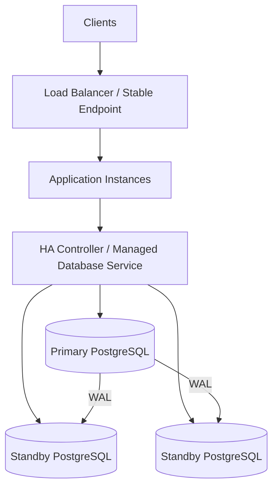
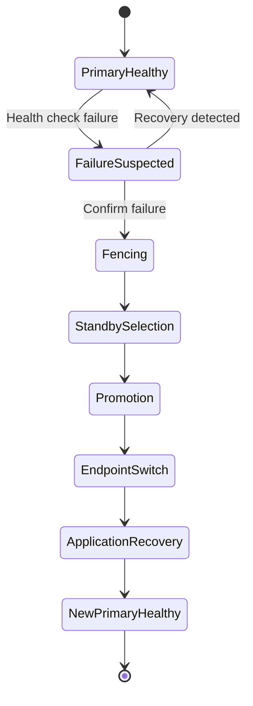

# 22- Database Failover

## Overview

Database failover is the process of moving database leadership from a failed or unhealthy primary instance to a healthy standby so that applications can continue operating.

In a highly available PostgreSQL architecture, failover typically looks like:

```text
                    ┌───────────────┐
                    │   Application │
                    └───────┬───────┘
                            │
                     Stable DB Endpoint
                            │
                            ▼
                    ┌───────────────┐
                    │ HA / DB Proxy │
                    └───────┬───────┘
                            │
                     ┌──────┴──────┐
                     │             │
                     ▼             ▼
              ┌───────────┐  ┌───────────┐
              │  Primary  │  │  Standby  │
              │ PostgreSQL│  │ PostgreSQL│
              └─────┬─────┘  └───────────┘
                    │              ▲
                    │     WAL      │
                    └──────────────┘
```

When the primary fails:

```text
Before:

Application → Primary
                 │
                 └── WAL → Standby


After failover:

Application → New Primary
                 ▲
                 │
              Standby
              promoted
```

Failover is not simply "start another database." A production failover must coordinate failure detection, leader promotion, client routing, connection recovery, transaction uncertainty, replication state, fencing, and application behavior.

The objective is not merely to restart the database. It is to preserve service availability while minimizing data loss and preventing two database instances from simultaneously accepting writes.

---

## Failover vs Recovery vs Disaster Recovery

These concepts are related but different.

| Concept | Purpose | Typical timescale |
|---|---|---|
| Failover | Move service from failed primary to standby | Seconds to minutes |
| Restart | Recover the same database process/instance | Seconds to minutes |
| Restore | Rebuild database from backup | Minutes to hours |
| Point-in-time recovery | Restore database to a selected historical position | Minutes to hours |
| Disaster recovery | Recover service after a major regional/site failure | Minutes to hours |
| Backup | Provide independent recoverable data | Ongoing |

A standby replica can make failover fast, but it does not replace independent backups.

---

## Why Failover Exists

Without failover:

```text
Application
    │
    ▼
Primary
    X
   Failed
```

The application is unavailable until the primary is recovered.

With a standby:

```text
Application
    │
    ▼
Primary
    X
    │
    ▼
Standby promoted
    │
    ▼
Application continues
```

Failover reduces downtime and can improve availability across infrastructure failures.

Typical failure scenarios include:

- Database process failure.
- Host failure.
- Availability Zone failure.
- Storage failure.
- Network isolation.
- Operating system failure.
- Planned maintenance.
- Hardware failure.
- Unhealthy database state.

---

## High Availability Architecture

A common PostgreSQL HA design is:



The application should generally connect through a stable endpoint rather than embedding a specific database host throughout the codebase.

For example:

```text
db-primary.internal
```

can resolve or route to whichever instance currently owns the primary role.

Managed AWS database services can provide this abstraction through service endpoints and managed failover mechanisms.

---

## Failure Detection

Failover begins with determining whether the current primary is actually unhealthy.

Possible signals include:

- Database health checks.
- TCP connectivity.
- PostgreSQL connection checks.
- Query health checks.
- Host health.
- Storage health.
- Replication health.
- Infrastructure health.
- Application-level error rates.

A simplistic health check:

```text
Can I open TCP connection?
```

is insufficient.

A database can accept connections while being unable to make useful progress because of:

- Severe lock contention.
- Storage failure.
- CPU saturation.
- Connection exhaustion.
- Replication problems.
- Long-running transactions.
- Internal database failures.

Health checks should therefore represent the actual failure semantics required by the HA system.

---

## Failure Detection Trade-offs

| Detection strategy | Advantage | Limitation |
|---|---|---|
| TCP check | Simple | Weak signal |
| PostgreSQL connection | Better database signal | May still accept connections while unhealthy |
| Simple query | Tests query path | Adds database load |
| Host health | Detects infrastructure failures | May miss database-specific failures |
| Multi-signal health | More accurate | More complex |
| Quorum-based decision | Reduces false leadership | Requires coordination |

The goal is to avoid both:

- **False positives:** promoting a standby while the primary is still healthy.
- **False negatives:** waiting too long to promote after a genuine failure.

---

## Split Brain

One of the most dangerous failover failures is split brain.

Example:

```text
                Network partition

             ┌───────────────┐
             │               │
          Primary         Standby
             │               │
          accepts         accepts
          writes          writes
```

Both instances believe they are primary.

Now:

```text
Application A → Primary
Application B → Standby
```

Both databases accept conflicting writes.

This can cause severe data divergence.

### Preventing Split Brain

Production HA systems need mechanisms such as:

- Fencing.
- Leader election.
- Quorum.
- External coordination.
- Managed database failover.
- Controlled promotion.
- Preventing the old primary from accepting writes.

The critical rule is:

> There must be a single authoritative database writer.

---

## Fencing

Fencing prevents an old or isolated primary from continuing to accept writes after another instance has been promoted.

Possible fencing mechanisms include:

- Powering off the old host.
- Removing network access.
- Revoking database access.
- Terminating the failed instance.
- Using infrastructure-level leader ownership.
- Managed service orchestration.

Conceptually:

```text
Detect primary failure
        ↓
Fence old primary
        ↓
Promote standby
        ↓
Move writer endpoint
        ↓
Reconnect applications
```

Promotion without fencing can be dangerous if the old primary may still be alive and writable.

---

## Replication and Failover

PostgreSQL streaming replication typically sends WAL from the primary to standbys.

```text
Primary
   │
   ├── WAL → Standby 1
   │
   └── WAL → Standby 2
```

At failover time, the chosen standby is promoted.

However, with asynchronous replication, some transactions acknowledged by the primary may not yet exist on the standby.

This creates a potential data-loss window.

---

## RPO and Failover

Recovery Point Objective describes how much data loss is acceptable.

For example:

```text
RPO = 0
```

means the architecture aims for no committed transaction loss.

Asynchronous replication generally cannot guarantee zero data loss because:

```text
Client
  ↓
Primary commit
  ↓
Client receives success
  ↓
Primary fails
  ↓
WAL had not reached standby
```

That acknowledged transaction may be lost during promotion.

Synchronous replication can reduce this risk, but introduces latency and availability trade-offs.

---

## Synchronous vs Asynchronous Failover

| Model | Data-loss risk | Latency | Availability trade-off |
|---|---|---|---|
| Asynchronous | Possible recent WAL loss | Lower | Better |
| Synchronous | Lower when correctly configured | Higher | Potentially lower |
| Cross-region synchronous | Very low data-loss risk | High | Significant network dependency |

The correct choice depends on business requirements.

A payment system may have a much stricter RPO than an analytics workload.

---

## Failover and RTO

Recovery Time Objective defines how quickly service should be restored.

A simplified model is:

```text
Failure detection
+
Decision time
+
Fencing
+
Promotion
+
Endpoint update
+
Connection recovery
=
Failover duration
```

Reducing only promotion time may not significantly improve total RTO.

For example:

```text
Promotion:          10 seconds
Application retry:  60 seconds
DNS propagation:    30 seconds
Connection recovery: 20 seconds

Total outage:       ~120 seconds
```

Failover design must therefore include the entire application path.

---

## Automatic vs Manual Failover

### Automatic Failover

```text
Failure
  ↓
Detection
  ↓
Fencing
  ↓
Promotion
  ↓
Endpoint update
  ↓
Application recovery
```

Advantages:

- Fast recovery.
- Less human intervention.
- Suitable for strict RTO requirements.

Limitations:

- False-positive risk.
- More complex automation.
- Promotion mistakes can be amplified automatically.

### Manual Failover

```text
Failure
  ↓
Human investigation
  ↓
Promotion
  ↓
Endpoint update
```

Advantages:

- Better human judgment.
- Lower risk of accidental promotion in ambiguous failures.

Limitations:

- Slower.
- Requires operational availability.
- Human error becomes part of recovery.

Many production systems use automated or semi-automated failover with explicit safeguards.

---

## Planned Failover

Failover is not only for unexpected failures.

A controlled promotion can be used for:

- Database maintenance.
- Infrastructure migration.
- Availability Zone changes.
- Hardware replacement.
- Disaster recovery testing.

Planned failover should normally be easier because the primary is still available and replication state can be verified before promotion.

---

## Failover State Machine



A robust system explicitly models these states rather than treating failover as one atomic command.

---

## Choosing the Promotion Candidate

If multiple replicas exist:

```text
Primary
 ├── Replica 1
 ├── Replica 2
 └── Replica 3
```

the system should select a suitable candidate.

Important factors include:

- Replication freshness.
- WAL position.
- Health.
- Storage integrity.
- Availability Zone.
- Region.
- Synchronous status.
- Recovery state.
- Query activity.
- Infrastructure health.

The replica with the lowest observed lag is not automatically the best candidate if its underlying infrastructure is unhealthy.

---

## Stable Database Endpoints

Applications should avoid hard-coding a specific database instance.

Prefer:

```text
Application
    ↓
db-writer endpoint
    ↓
Current primary
```

rather than:

```text
Application
    ↓
postgres-primary-node-17
```

After promotion:

```text
db-writer endpoint
        ↓
New primary
```

This minimizes application changes during failover.

---

## DNS and Failover

DNS can be used to redirect traffic:

```text
db.example.internal
        ↓
New primary
```

However, DNS-based failover has considerations:

- DNS TTL.
- Client-side DNS caching.
- Connection pooling.
- OS resolver caching.
- Application resolver behavior.

Existing database connections will not magically move to the new primary.

Connection pools need explicit recovery behavior.

---

## Connection Pool Recovery

Suppose:

```text
Application pool
     ↓
Old primary
     X
```

Existing connections may fail after the database disappears.

The application should:

1. Detect connection failure.
2. Discard broken connections.
3. Re-resolve the database endpoint if necessary.
4. Establish new connections.
5. Retry safe operations.
6. Avoid retrying unsafe operations blindly.

Connection pooling therefore becomes part of failover architecture.

---

## Transaction Uncertainty

The most difficult application-level failure case is often an ambiguous commit.

Consider:

```text
Application
    ↓
COMMIT
    ↓
Primary
    ↓
Transaction committed
    X
Network response lost
    ↓
Application sees error
```

The transaction may have committed even though the client did not receive confirmation.

The application cannot safely assume:

```text
error = transaction definitely rolled back
```

After failover, blindly retrying the operation may create duplicates.

This is why critical write operations should use:

- Idempotency keys.
- Unique constraints.
- Durable request identifiers.
- State transitions.
- Safe retry semantics.

---

## Idempotent Failover Recovery

For an API such as:

```text
POST /payments
Idempotency-Key: 8f0d...
```

the application can safely retry the operation after an uncertain database failure.

A unique constraint or durable idempotency record can prevent duplicate execution.

Conceptually:

```text
Request
   ↓
Idempotency key
   ↓
Database transaction
   ↓
Commit
   X
Response lost
   ↓
Retry same key
   ↓
Existing result returned
```

This is significantly safer than blindly repeating every failed request.

---

## Retry Strategy

During failover, many clients may simultaneously lose their connections.

If every client retries immediately:

```text
Database failure
      ↓
10,000 clients retry
      ↓
New primary
      ↓
Connection storm
```

The newly promoted database can become overloaded before recovering.

Use:

- Exponential backoff.
- Jitter.
- Retry limits.
- Connection pool limits.
- Circuit breakers.
- Request deadlines.
- Bounded concurrency.

For database transactions, retry the **whole transaction** when the error is known to be retryable.

---

## Failover Retry Example

A conceptual application policy:

| Failure | Retry? | Notes |
|---|---|---|
| Connection reset before commit result | Carefully | Commit may be uncertain |
| Serialization failure `40001` | Yes | Retry whole transaction |
| Deadlock `40P01` | Yes | Retry whole transaction |
| Authentication failure | Usually no | Fix configuration |
| Constraint violation | No | Application/data error |
| Syntax error | No | Code/query error |
| Timeout | Depends | Determine whether operation may have completed |

Retries are a correctness mechanism, not merely a resilience feature.

---

## Read Replicas During Failover

A read replica may become the new primary.

Before promotion:

```text
Primary
   │
   ├── writes
   └── WAL → Replica
```

After promotion:

```text
New Primary
   │
   ├── writes
   └── New replicas
```

Applications must stop treating the promoted instance as a read-only replica.

Database roles, connection endpoints, health checks, and routing must transition consistently.

---

## Read-After-Write After Failover

Suppose:

```text
Client writes to old primary
        ↓
Failover
        ↓
New primary
        ↓
Client reads
```

If the write was not replicated before failure, the read may legitimately not find it.

This is another reason business workflows should use idempotency and explicit state handling.

Applications should not assume:

```text
successful HTTP response
=
data guaranteed to survive every failover scenario
```

The guarantee depends on replication and durability architecture.

---

## Django and Failover

Django applications should use a stable database endpoint:

```python
DATABASES = {
    "default": {
        "ENGINE": "django.db.backends.postgresql",
        "NAME": "app",
        "HOST": "db-writer.internal",
        "USER": "app_runtime",
        "PASSWORD": "...",
        "CONN_MAX_AGE": 60,
    },
}
```

After failover, new connections should reach the current primary.

Django application code should also:

- Keep transactions short.
- Avoid external calls inside transactions.
- Retry only known-safe operations.
- Use idempotency for uncertain writes.
- Avoid assuming a connection remains valid indefinitely.

---

## FastAPI and SQLAlchemy

FastAPI applications commonly use SQLAlchemy connection pools.

Example:

```python
from sqlalchemy import create_engine

engine = create_engine(
    DATABASE_URL,
    pool_size=10,
    max_overflow=5,
    pool_timeout=10,
    pool_pre_ping=True,
)
```

`pool_pre_ping` can detect stale connections when they are checked out, but it does not make an arbitrary transaction automatically safe to retry.

Failover handling still requires correct transaction and retry semantics.

---

## Kubernetes Considerations

In Kubernetes, the database is often outside the application cluster, especially when using a managed database service.

The application architecture might be:

```text
Kubernetes Pods
       │
       ▼
Stable DB Endpoint
       │
       ▼
Managed PostgreSQL
       │
       ├── Primary
       └── Standby
```

Important considerations include:

- Connection pool size per pod.
- Number of pods.
- DNS caching.
- Readiness behavior.
- Startup reconnection.
- Retry storms during failover.
- Network policies.
- Secret rotation.
- Observability.

Scaling application pods during a database failover can make the outage worse if each new pod creates a large connection pool.

---

## AWS Considerations

With managed AWS database services, failover mechanisms can move the writer role to a standby and update the service endpoint.

The application should therefore use the provider's stable writer endpoint rather than relying on instance-specific addresses.

Operational concerns include:

- Multi-AZ configuration.
- Automatic failover behavior.
- Backup and PITR.
- Monitoring.
- CloudWatch metrics and alarms.
- Security groups.
- IAM where supported.
- Connection recovery.
- Application retry behavior.
- Cross-region DR when required.

The managed service reduces operational burden, but application-level correctness during failover remains the application's responsibility.

---

## Monitoring Failover

A production monitoring system should track:

### Primary Health

- Database availability.
- Query success rate.
- Connection failures.
- CPU.
- Memory.
- Storage.
- I/O latency.
- Lock contention.

### Replication

- Replica lag.
- WAL position.
- Replay position.
- Replication connection state.
- WAL retention.
- Replication slot health.

### Failover

- Failure detection time.
- Promotion time.
- Endpoint switch time.
- Connection recovery time.
- Total outage duration.
- Number of failed requests.
- Retry volume.
- Connection storm intensity.

### Application

- HTTP 5xx rate.
- Database exceptions.
- Request latency.
- Transaction retries.
- Idempotency conflicts.
- Queue backlog.

---

## Failover Timeline

A useful operational metric is to break the outage into phases:

```text
T0
│
├── Primary failure
│
├── Detection
│
├── Decision
│
├── Fencing
│
├── Promotion
│
├── Endpoint switch
│
├── Connection recovery
│
├── Retry recovery
│
└── Application healthy
```

Instead of reporting only:

```text
"Failover took 30 seconds"
```

measure:

```text
Detection:          8s
Promotion:          6s
Endpoint switch:    2s
Connection recovery: 7s
Application recovery: 7s
Total:              30s
```

This makes bottlenecks actionable.

---

## Failover Testing

Failover should be tested deliberately.

Useful scenarios include:

- Primary process failure.
- Primary host failure.
- Network isolation.
- Availability Zone failure.
- Replica promotion.
- Replica lag.
- Connection interruption.
- In-flight transaction failure.
- Commit response loss.
- Application retry storm.
- DNS/endpoint transition.
- Connection pool recovery.

A practical game-day flow:

```text
Prepare
  ↓
Verify replica health
  ↓
Inject controlled failure
  ↓
Observe detection
  ↓
Promote standby
  ↓
Verify endpoint routing
  ↓
Verify application recovery
  ↓
Validate data integrity
  ↓
Measure RTO/RPO
```

Testing should occur in environments where the failure can be controlled safely before performing production exercises.

---

## Failover Validation

After promotion, verify:

```sql
SELECT pg_is_in_recovery();
```

A promoted primary should report:

```text
false
```

Also verify:

- Application can establish new connections.
- Writes succeed.
- Reads succeed.
- Expected constraints exist.
- Replication to new standbys is configured.
- Monitoring recognizes the new primary.
- Old primary cannot accept writes.
- Background workers recover.
- Scheduled jobs do not duplicate work.

Failover is not complete merely because the new primary accepts connections.

---

## Background Workers

Celery workers can hold database connections or retry jobs during a failover.

Kafka consumers may also encounter database connection failures.

Example:

```text
Primary fails
    ↓
Celery transaction fails
    ↓
Celery retries
    ↓
New primary available
    ↓
Task executes again
```

Tasks must therefore be designed for idempotency.

For event-driven systems, durable state transitions and unique constraints can prevent duplicate effects.

---

## Redis During Failover

Redis may continue serving cached data while PostgreSQL is unavailable.

This can help reduce pressure, but stale cache data must not be mistaken for authoritative database state.

A dangerous recovery pattern is:

```text
Database fails
   ↓
Application uses stale cache
   ↓
Application performs state-changing operation
   ↓
Incorrect state
```

Cache should generally be treated as an optimization, not the source of durable transactional truth.

---

## Kafka During Failover

Kafka consumers should tolerate database failover.

A typical flow:

```text
Kafka message
    ↓
Consumer
    ↓
Database transaction
    X
Failover
    ↓
Retry message
    ↓
Database transaction succeeds
```

The consumer should commit the Kafka offset only according to the application's delivery and transaction semantics.

Database-side idempotency is often necessary because a consumer can process a message more than once.

---

## Schema Changes During Failover

Schema changes complicate recovery.

For example:

```text
Application version A
        ↓
Schema migration
        ↓
Failover
        ↓
Application version B
```

The promoted database must contain the expected schema state.

Use backward-compatible expand-and-contract migrations:

```text
Expand
  ↓
Deploy compatible application
  ↓
Backfill
  ↓
Switch application behavior
  ↓
Contract later
```

Avoid migrations that make the database temporarily incompatible with either the application or standby recovery process.

---

## Security Considerations

Failover infrastructure must preserve security controls.

Verify:

- Primary and standby use encrypted connections.
- Credentials are stored securely.
- Replication traffic is protected.
- IAM/role permissions remain correct.
- Read-only roles do not accidentally become writable.
- Promoted instances receive correct security policies.
- Old primary access is revoked or fenced.
- Audit logging continues after promotion.
- Secrets are not embedded in failover scripts.

A failover mechanism with excessive administrative privileges can become a significant security risk.

---

## High Availability vs Disaster Recovery

Local HA:

```text
Region
 ├── AZ A
 │    └── Primary
 │
 └── AZ B
      └── Standby
```

protects against many local failures.

Cross-region DR:

```text
Region A
  Primary
     │
     │ replication
     ▼
Region B
  Standby
```

protects against larger regional failures.

However, cross-region failover introduces:

- Higher network latency.
- Greater replication lag.
- More complex application routing.
- DNS/endpoint changes.
- Regional dependency management.
- Potentially larger RPO.

HA and DR should be designed separately according to their failure domains.

---

## Common Failure Modes

| Failure mode | Likely consequence | Mitigation |
|---|---|---|
| False failure detection | Unnecessary promotion | Multi-signal detection |
| Split brain | Conflicting writes | Fencing and quorum |
| Replica lag | Data loss after promotion | Monitor lag and choose candidate carefully |
| Connection storm | New primary overload | Backoff and pool limits |
| Unsafe retries | Duplicate writes | Idempotency |
| Stale DNS/connections | Continued connection failures | Stable endpoints and pool recovery |
| Old primary remains writable | Divergent databases | Fencing |
| No independent backups | Poor recovery options | Backups + PITR |
| Long transactions | Slow recovery / blocking | Keep transactions short |
| Unplanned schema incompatibility | Application failures | Expand-and-contract |
| Untested failover | Unknown RTO/RPO | Regular game days |

---

## Common Mistakes and Pitfalls

### Treating Failover as a DNS Problem

Changing DNS does not migrate existing database connections.

**Better:** design endpoint switching and connection-pool recovery together.

### Promoting Without Fencing

The old primary may continue accepting writes.

**Better:** guarantee single-writer ownership.

### Ignoring Replica Lag

The most recently available replica may still be behind.

**Better:** evaluate WAL/replay position and replication health.

### Retrying Every Failed Write

A lost response does not prove the transaction rolled back.

**Better:** use idempotency and distinguish safe retry conditions.

### Creating Large Connection Pools

After failover, thousands of application workers may reconnect simultaneously.

**Better:** calculate connection budgets across the entire application fleet.

### Assuming Automatic Failover Means Zero Downtime

Failover still requires:

- Detection.
- Promotion.
- Connection recovery.
- Retry handling.
- Application stabilization.

**Better:** measure the complete recovery timeline.

### Using Replicas as Backups

Replicas reproduce database changes, including accidental destructive changes.

**Better:** maintain independent backups and PITR.

### Never Testing Failover

An HA architecture that has never been exercised has an unknown recovery behavior.

**Better:** run controlled failover tests and measure RTO/RPO.

---

## Production Best Practices

1. Use a stable writer endpoint.
2. Maintain at least one suitable standby in an independent failure domain when HA requirements justify it.
3. Monitor replication lag continuously.
4. Use automated failover only with strong failure-detection and fencing controls.
5. Guarantee a single writable primary.
6. Design applications for connection loss and reconnection.
7. Use bounded retries with exponential backoff and jitter.
8. Treat transaction commit uncertainty explicitly.
9. Use idempotency keys for critical externally triggered writes.
10. Keep transactions short and avoid external calls inside them.
11. Size connection pools for the entire application fleet, not individual instances.
12. Maintain independent backups and PITR.
13. Test primary failure, promotion, endpoint switching, and application recovery.
14. Measure actual RTO and RPO rather than relying on theoretical values.
15. Ensure monitoring and alerting continue after role changes.
16. Validate background workers and event consumers during failover.
17. Use backward-compatible schema migrations.
18. Review security permissions after promotion.
19. Document manual recovery procedures even when automatic failover exists.
20. Treat failover as an application-and-database architecture problem, not only a database feature.

---

## Production Checklist

### Architecture

- [ ] Stable writer endpoint exists.
- [ ] Primary and standby use appropriate failure domains.
- [ ] Promotion candidate selection is defined.
- [ ] Fencing strategy exists.
- [ ] Split-brain protection exists.
- [ ] HA and DR strategies are documented separately.

### Replication

- [ ] Replication lag is monitored.
- [ ] WAL retention is monitored.
- [ ] Standby health is monitored.
- [ ] Promotion eligibility is known.
- [ ] Replica capacity is sufficient.

### Application

- [ ] Connection pools recover after failover.
- [ ] Database endpoints are not hard-coded to instances.
- [ ] Safe operations can be retried.
- [ ] Critical writes use idempotency.
- [ ] Transaction boundaries are short and explicit.
- [ ] Celery/Kafka workloads tolerate database interruption.

### Reliability

- [ ] RPO is documented.
- [ ] RTO is documented.
- [ ] Failover has been tested.
- [ ] Recovery timing is measured.
- [ ] Primary promotion has been validated.
- [ ] Old primary is fenced after promotion.

### Security

- [ ] Replication is protected.
- [ ] Database connections use TLS where required.
- [ ] Credentials are managed securely.
- [ ] Least-privilege roles are preserved.
- [ ] Audit logging remains active.
- [ ] Old-primary access is revoked or isolated.

### Recovery

- [ ] Independent backups exist.
- [ ] PITR is configured where required.
- [ ] Restore procedures are documented.
- [ ] Recovery procedures are tested.
- [ ] Cross-region DR is available when required by business objectives.

---

## Interview Traps

### "Is failover the same as replication?"

No. Replication copies database state. Failover changes which database instance is authoritative for writes.

### "Does asynchronous replication guarantee zero data loss?"

No. Transactions acknowledged by the primary may not yet have reached the standby.

### "Why is fencing necessary?"

Because detecting a failed primary is not enough. The old primary must not continue accepting writes after another instance becomes primary.

### "Why can failover cause duplicate transactions?"

The client may lose the response after the database commits. Retrying the operation without idempotency can execute it twice.

### "Why isn't DNS enough for failover?"

Existing connections remain connected to the old database, and clients may cache DNS results.

### "What is the relationship between RPO and replication?"

Replication determines how much recent database state may be available to the standby. Asynchronous replication can create a non-zero RPO.

### "Why can a healthy standby still be a poor failover candidate?"

It may be significantly behind, under resource pressure, in an unhealthy failure domain, or otherwise unsuitable for promotion.

### "Does automatic failover guarantee zero downtime?"

No. Total recovery time includes failure detection, fencing, promotion, endpoint transition, connection recovery, and application stabilization.

### "What should happen to an in-flight transaction during failover?"

The application must treat the outcome as potentially uncertain if it cannot determine whether the transaction committed. Retry semantics should therefore be based on idempotency and known database error behavior.

### "Why should failover be tested if the system is automated?"

Automation itself must be validated. Real failure behavior often exposes issues in connection pools, DNS, retries, monitoring, application assumptions, and operational procedures.

---

## Key Takeaways

- **Failover is a coordinated system operation:** detection, fencing, promotion, endpoint switching, connection recovery, and application retries all contribute to availability.
- **Single-writer ownership is critical:** split brain must be prevented through fencing, quorum, leader coordination, or managed HA mechanisms.
- **RPO and RTO are architecture properties:** asynchronous replication can lose recent acknowledged data, while total recovery time includes much more than database promotion.
- **Application correctness matters during failover:** commit uncertainty, connection loss, and retry storms require idempotency, bounded retries, and short transactions.
- **HA must be tested and measured:** validate failover, promotion, recovery, data integrity, RPO, RTO, background workers, monitoring, and security rather than relying solely on configuration.