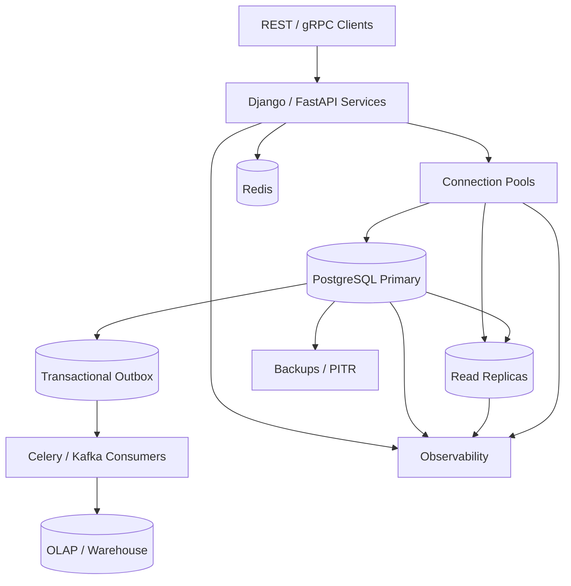

# 23- Production SQL Best Practices

## Overview

Production SQL is not only about writing syntactically correct queries. A production database must remain correct, predictable, secure, observable, and operationally manageable as data volume, traffic, concurrency, and application complexity increase.

For backend engineers, SQL best practices span the complete lifecycle:

```text
Application
    │
    ▼
ORM / SQL Builder
    │
    ▼
Parameterized SQL
    │
    ▼
Connection Pool
    │
    ▼
PostgreSQL
    │
    ├── Query Planning
    ├── Transactions
    ├── Locks / MVCC
    ├── Indexes
    ├── Storage
    └── WAL / Replication
            │
            ├── Monitoring
            ├── Backups
            └── Recovery
```

The important production question is not:

> "Is this query valid?"

It is:

> "Will this query and its surrounding architecture remain correct and predictable under realistic production workload?"

---

## Production SQL Principles

A strong production SQL design generally follows these principles:

| Principle | Production goal |
|---|---|
| Correctness | Preserve business invariants |
| Security | Prevent unauthorized access and injection |
| Predictability | Keep query behavior understandable |
| Performance | Minimize unnecessary CPU, I/O, memory, and network work |
| Concurrency | Handle simultaneous requests safely |
| Scalability | Continue operating as data and traffic grow |
| Reliability | Recover from failures without corruption or uncontrolled retries |
| Observability | Make database behavior measurable |
| Operability | Support safe migrations, maintenance, and recovery |
| Cost efficiency | Avoid unnecessary compute, storage, and network usage |

These concerns are connected. For example, a poorly designed retry mechanism can increase database CPU, exhaust connection pools, increase lock contention, and ultimately cause more failures.

---

## Use the Database to Enforce Invariants

Application validation is useful, but it should not be the only protection for critical invariants.

Suppose an API requires unique email addresses.

Application-only validation:

```python
if not Customer.objects.filter(email=email).exists():
    Customer.objects.create(email=email)
```

Two concurrent requests can both observe that the email does not exist.

```text
Request A ── check ── not found ── insert
Request B ── check ── not found ── insert
```

Use a database constraint:

```sql
CREATE UNIQUE INDEX customers_email_unique
ON customers (email);
```

Then the database becomes the final authority.

### Common Database Constraints

Use constraints for invariants such as:

- `PRIMARY KEY`
- `UNIQUE`
- `FOREIGN KEY`
- `CHECK`
- `NOT NULL`
- Exclusion constraints where appropriate

Example:

```sql
CREATE TABLE orders (
    id bigint GENERATED ALWAYS AS IDENTITY PRIMARY KEY,
    customer_id bigint NOT NULL REFERENCES customers(id),
    status text NOT NULL,
    total_amount numeric(12, 2) NOT NULL CHECK (total_amount >= 0)
);
```

The application should still validate input for usability, but database constraints protect against:

- Concurrent requests.
- Bugs.
- Background workers.
- Administrative scripts.
- Multiple application versions.
- Other services accessing the database.

---

## Prefer Atomic SQL for State Changes

Avoid unnecessary read-modify-write sequences.

Less safe:

```text
SELECT balance
UPDATE balance = balance + amount
```

Prefer an atomic update:

```sql
UPDATE accounts
SET balance = balance + $1
WHERE id = $2;
```

The database performs the modification atomically with respect to concurrent transactions.

For conditional state transitions:

```sql
UPDATE orders
SET status = 'paid'
WHERE id = $1
  AND status = 'pending';
```

Then inspect the affected row count.

This can avoid unnecessary application-level locking.

---

## Keep Transactions Explicit and Short

Transactions define the consistency boundary of a unit of work.

A good transaction generally:

1. Reads the required state.
2. Validates business invariants.
3. Changes the required rows.
4. Records related durable state.
5. Commits quickly.

Avoid:

```text
BEGIN
  database operation
  HTTP request
  external API call
  wait
  another database operation
COMMIT
```

The external call can dramatically extend lock and connection lifetimes.

Prefer:

```text
Database transaction
      ↓
Commit durable state
      ↓
Publish / process asynchronously
      ↓
External system
```

The transactional outbox pattern is useful when database state and an event must remain coordinated.

---

## Transactional Outbox

Example:

```sql
BEGIN;

UPDATE orders
SET status = 'paid'
WHERE id = $1
  AND status = 'pending';

INSERT INTO outbox_events (
    event_type,
    aggregate_id,
    payload
)
VALUES (
    'order.paid',
    $1,
    $2
);

COMMIT;
```

A background worker can later publish the outbox event to Kafka.

```text
Application
    │
    ▼
PostgreSQL transaction
    ├── Business state
    └── Outbox event
             │
             ▼
       Outbox worker
             │
             ▼
           Kafka
```

This avoids the failure window where the database transaction commits but event publication fails.

---

## Design Idempotent Operations

Production systems retry.

Retries happen because of:

- Network failures.
- Database failover.
- Deadlocks.
- Serialization failures.
- Request timeouts.
- Worker retries.
- Message redelivery.

A retried operation must not accidentally produce duplicate business effects.

A common pattern is an idempotency key:

```sql
CREATE UNIQUE INDEX payment_idempotency_key_unique
ON payments (idempotency_key);
```

The application can safely retry a request because the database prevents duplicate records.

Idempotency should be designed around the business operation, not added as a generic retry wrapper.

---

## Use Parameterized Queries

Never construct SQL by interpolating untrusted values.

Unsafe:

```python
query = f"SELECT * FROM users WHERE email = '{email}'"
```

Safe:

```python
cursor.execute(
    "SELECT * FROM users WHERE email = %s",
    (email,),
)
```

Parameterized queries protect values from being interpreted as SQL syntax.

They should be the default for:

- Django raw SQL.
- psycopg.
- SQLAlchemy.
- Database drivers.
- Service-to-service database access.

Parameterization does not automatically make dynamic SQL safe when SQL identifiers or operators are constructed dynamically.

---

## Treat Dynamic SQL Differently

Values and SQL structure are different security problems.

Safe parameterization:

```sql
SELECT *
FROM customers
WHERE email = $1;
```

But this cannot safely parameterize an identifier:

```sql
SELECT *
FROM $1;
```

For dynamic identifiers, use strict allowlists and driver-provided identifier composition.

Example with psycopg:

```python
from psycopg import sql

allowed_columns = {"created_at", "email", "name"}

if sort_column not in allowed_columns:
    raise ValueError("Invalid sort column")

query = sql.SQL(
    "SELECT id, email, name FROM customers ORDER BY {}"
).format(sql.Identifier(sort_column))
```

Never treat an arbitrary request parameter as trusted SQL syntax.

---

## Select Only Required Columns

Avoid unnecessary:

```sql
SELECT *
FROM customers
WHERE id = $1;
```

Prefer:

```sql
SELECT id, email, status
FROM customers
WHERE id = $1;
```

This reduces:

- Network transfer.
- Application memory.
- Serialization work.
- Database tuple processing.
- Potential exposure of sensitive columns.

It also makes API behavior less sensitive to future schema changes.

---

## Avoid N+1 Queries

A typical backend anti-pattern:

```text
SELECT users
SELECT orders for user 1
SELECT orders for user 2
SELECT orders for user 3
...
```

If 1,000 users are returned, the application can issue thousands of queries.

Django example:

```python
orders = Order.objects.select_related("customer").filter(
    status="pending"
)
```

For collections:

```python
customers = Customer.objects.prefetch_related("orders")
```

The exact choice depends on relationship cardinality and query shape.

The important principle is to inspect generated SQL and query counts rather than assuming ORM code is efficient.

---

## Query Performance Is a Workload Problem

A query that executes in 5 ms once may still be harmful if executed 100,000 times per minute.

Consider:

```text
Query A
5 ms × 100,000 executions
=
500 seconds of database execution time
```

Therefore monitor both:

- Per-query latency.
- Query frequency.
- Total execution time.
- Rows processed.
- Buffer activity.
- CPU usage.
- Lock waits.

`pg_stat_statements` is particularly useful for identifying expensive aggregate workloads.

---

## Use EXPLAIN Before Optimizing

Start with:

```sql
EXPLAIN
SELECT id, email
FROM customers
WHERE status = $1;
```

For controlled testing:

```sql
EXPLAIN (ANALYZE, BUFFERS)
SELECT id, email
FROM customers
WHERE status = 'active';
```

`EXPLAIN ANALYZE` actually executes the statement, so use caution with `INSERT`, `UPDATE`, and `DELETE`.

Inspect:

- Estimated rows.
- Actual rows.
- Scan type.
- Join strategy.
- Sorts.
- Aggregation.
- Buffer hits.
- Reads.
- Loops.
- Planning time.
- Execution time.

Do not optimize based only on the presence or absence of an index.

---

## Indexes Should Match Access Patterns

An index should support a real workload.

For:

```sql
SELECT id, created_at
FROM orders
WHERE customer_id = $1
  AND status = $2
ORDER BY created_at DESC
LIMIT 50;
```

an index such as:

```sql
CREATE INDEX orders_customer_status_created_idx
ON orders (customer_id, status, created_at DESC);
```

may be appropriate.

The correct design depends on:

- Equality predicates.
- Range predicates.
- Ordering.
- Join conditions.
- Selectivity.
- Data distribution.
- Query frequency.
- Table size.

Do not add indexes simply because a column appears in a query.

---

## Avoid Redundant Indexes

Suppose a table has:

```text
(customer_id)
(customer_id, status)
(customer_id, status, created_at)
```

These indexes may overlap significantly.

Every index has operational cost:

- Storage.
- WAL generation.
- Insert/update/delete work.
- Cache usage.
- Vacuum maintenance.
- Backup size.
- Replication traffic.

Index design should therefore optimize the overall workload rather than maximize index count.

---

## Use Partial and Covering Indexes Deliberately

For a workload that frequently accesses active records:

```sql
CREATE INDEX orders_pending_idx
ON orders (customer_id, created_at DESC)
WHERE status = 'pending';
```

A partial index can be significantly smaller than indexing every row.

For covering access patterns:

```sql
CREATE INDEX customers_email_idx
ON customers (email)
INCLUDE (id, status);
```

`INCLUDE` columns can help index-only scans, but they are not equivalent to key columns for searching or ordering.

Always validate the resulting plan.

---

## Pagination Must Scale

Offset pagination:

```sql
SELECT id, created_at
FROM orders
ORDER BY created_at DESC
LIMIT 50 OFFSET 100000;
```

can become increasingly expensive because the database may need to process and discard many preceding rows.

Keyset pagination is often better for large datasets:

```sql
SELECT id, created_at
FROM orders
WHERE created_at < $1
ORDER BY created_at DESC
LIMIT 50;
```

For stable pagination, use a deterministic ordering, commonly with a unique tie-breaker:

```sql
SELECT id, created_at
FROM orders
WHERE (created_at, id) < ($1, $2)
ORDER BY created_at DESC, id DESC
LIMIT 50;
```

The corresponding index should match the access pattern.

---

## Control Result Size

Returning millions of rows from PostgreSQL to a Python service is usually an architectural problem.

Large exports should generally be asynchronous:

```text
REST API
   │
   ▼
Create export job
   │
   ▼
Celery worker
   │
   ▼
PostgreSQL
   │
   ▼
Object storage
   │
   ▼
Client downloads result
```

This prevents:

- Request timeouts.
- Large application memory usage.
- Long-lived database connections.
- Connection pool exhaustion.

For large exports, use streaming or database-native bulk mechanisms where appropriate rather than repeatedly loading large result sets into application memory.

---

## Use Appropriate Write Strategies

For large ingestion workloads, individual inserts can become inefficient:

```text
INSERT
INSERT
INSERT
INSERT
...
```

Prefer batching or PostgreSQL bulk-loading facilities where appropriate.

For example, PostgreSQL `COPY` is designed for high-throughput bulk data loading.

Batching should still account for:

- Transaction size.
- Lock duration.
- WAL volume.
- Replication lag.
- Statement timeout.
- Memory.
- Failure recovery.

"Use one giant transaction" is not automatically the optimal answer.

---

## Handle Large Deletes Carefully

A massive:

```sql
DELETE FROM events
WHERE created_at < $1;
```

can create substantial:

- WAL.
- Lock pressure.
- Dead tuples.
- Vacuum work.
- Replication lag.

For large datasets, consider:

- Partitioning.
- Retention-based partition drops.
- Batched deletes.
- Archival.
- Controlled maintenance windows.

If the data has a natural time boundary, partitioning can make lifecycle management much simpler.

---

## Partition When Lifecycle or Query Patterns Justify It

Partitioning can help when:

- Data has a natural range such as time.
- Old data is regularly archived or deleted.
- Queries frequently constrain the partition key.
- Individual partitions can be maintained independently.

Example:

```text
orders
 ├── orders_2026_07
 ├── orders_2026_08
 └── orders_2026_09
```

Partition pruning can reduce the amount of data scanned.

However, partitioning does not automatically solve:

- Poor indexes.
- Hot rows.
- Lock contention.
- Bad queries.
- Excessive partition counts.

---

## Keep Statistics Healthy

PostgreSQL's planner relies heavily on statistics.

After significant data distribution changes, stale statistics can result in poor execution plans.

Useful commands include:

```sql
ANALYZE customers;
```

For broader maintenance:

```sql
VACUUM (ANALYZE) customers;
```

Monitor:

- Autovacuum activity.
- Dead tuples.
- Table growth.
- Statistics freshness.
- Analyze frequency.
- Long-running transactions.

Do not disable autovacuum as a generic performance fix.

---

## Understand VACUUM and MVCC

PostgreSQL uses MVCC, so updates and deletes create tuple versions that eventually require cleanup.

Long-running transactions can prevent cleanup of dead tuples.

This can cause:

```text
Long transaction
      ↓
Old row versions remain visible
      ↓
Vacuum cannot clean them
      ↓
Table/index bloat increases
      ↓
More I/O
      ↓
Query performance degrades
```

Monitor long-running and idle-in-transaction sessions.

A database performance problem can therefore originate from transaction lifecycle rather than query syntax.

---

## Control Connection Pools

Connection pools should be treated as concurrency controls.

Suppose:

```text
20 Kubernetes pods
× 10 database connections
=
200 connections
```

If each pod allows additional overflow connections, the real peak can be higher.

Connection capacity must account for:

- Web workers.
- Async workers.
- Celery workers.
- Management commands.
- Migrations.
- Administrative tools.
- Read pools.
- Write pools.

More connections do not necessarily increase throughput. Excess concurrency can increase:

- CPU pressure.
- Memory usage.
- Lock contention.
- Context switching.
- Query queueing.

---

## Use Timeouts

Production database clients should not wait indefinitely.

Important timeout categories include:

| Timeout | Purpose |
|---|---|
| Connection timeout | Limits connection establishment |
| Pool acquisition timeout | Limits waiting for a pooled connection |
| `statement_timeout` | Limits statement execution |
| `lock_timeout` | Limits waiting to acquire a lock |
| Application request timeout | Limits overall request duration |

They solve different problems.

For example:

```sql
SET LOCAL lock_timeout = '2s';
SET LOCAL statement_timeout = '10s';
```

These can be useful for targeted transactional operations, but should be chosen according to workload requirements.

---

## Handle Lock Contention Deliberately

Locks are required for correctness, but excessive lock waiting reduces throughput.

Common sources include:

- Hot rows.
- Long transactions.
- Large updates.
- Foreign-key interactions.
- DDL.
- Explicit `SELECT FOR UPDATE`.
- Advisory locks.

For queue-like workloads, PostgreSQL can support patterns such as:

```sql
SELECT id
FROM jobs
WHERE status = 'pending'
ORDER BY id
FOR UPDATE SKIP LOCKED
LIMIT 10;
```

`SKIP LOCKED` can improve concurrent worker throughput, but it changes semantics: workers may temporarily skip locked rows.

Use it when skipping temporarily locked work is acceptable.

---

## Avoid Deadlocks Through Consistent Lock Ordering

Suppose:

```text
Transaction A:
lock account 1
lock account 2

Transaction B:
lock account 2
lock account 1
```

A deadlock can occur.

Use deterministic ordering:

```text
always lock lower account ID first
```

PostgreSQL reports deadlocks with SQLSTATE:

```text
40P01
```

A retry can be appropriate, but the entire transaction should be retried with bounded backoff and jitter.

---

## Handle Serialization Failures

Under stronger isolation levels, PostgreSQL may abort a transaction with:

```text
40001
```

This is a serialization failure.

The application should retry the **entire transaction**, not only the failed statement.

Conceptually:

```text
BEGIN
  operation
COMMIT
   X
serialization failure
   ↓
backoff + jitter
   ↓
BEGIN
  operation
COMMIT
```

Retries should be:

- Bounded.
- Observable.
- Idempotent.
- Backed by deadlines.
- Protected against retry storms.

---

## Separate Read and Write Workloads When Necessary

Read-heavy systems may benefit from read replicas:

```text
                 ┌── Read Replica 1
                 │
Application ─────┼── Read Replica 2
                 │
                 └── Primary
                      ↑
                    Writes
```

But replicas introduce consistency considerations.

A write followed immediately by a replica read may observe stale data.

Use the primary for operations requiring strong read-after-write behavior.

Do not add replicas when the real bottleneck is write contention or poorly optimized queries.

---

## Use Redis as a Cache, Not as Transactional Truth

A cache-aside pattern:

```text
Request
  ↓
Redis
  ├── hit → return
  │
  └── miss
       ↓
    PostgreSQL
       ↓
     Redis
```

can reduce database load.

But cache invalidation must be designed carefully.

Important concerns include:

- TTL.
- Stale values.
- Cache stampedes.
- Negative caching.
- Invalidation ordering.
- Failure behavior.

Critical transactional invariants should remain protected by the database unless a deliberate distributed consistency architecture says otherwise.

---

## Separate OLTP and Analytical Workloads

Do not assume the production OLTP database should execute every analytical query.

A large report can consume:

- CPU.
- Memory.
- I/O.
- Connections.
- Buffer cache.
- Locks.

A more scalable architecture can be:

```text
PostgreSQL OLTP
      │
      ├── CDC / replication
      │
      ▼
Data warehouse / OLAP
      │
      ▼
Analytics / reporting
```

This isolates analytical workloads from latency-sensitive API traffic.

---

## Use Database Ownership Boundaries

In microservices, avoid creating an architecture where every service directly modifies every table.

Prefer:

```text
Order Service
    │
    └── Orders database

Payment Service
    │
    └── Payments database
```

Cross-service communication should generally use:

- APIs.
- Events.
- Kafka.
- Explicit integration contracts.

A shared database can be valid in some systems, but unrestricted cross-service table ownership creates coupling and complicates migrations, security, and reliability.

---

## Design Multi-Tenant Queries Carefully

For shared-schema multi-tenancy, tenant filtering is part of correctness.

Example:

```sql
SELECT id, status
FROM orders
WHERE tenant_id = $1
  AND id = $2;
```

Tenant identifiers should be indexed according to real access patterns.

For stronger database-level isolation, PostgreSQL Row-Level Security can add another enforcement layer.

However:

- Application authorization still matters.
- Connection pooling must preserve tenant context safely.
- RLS policies require careful testing.
- Roles that bypass RLS require special protection.

Never rely on an untrusted tenant identifier as the sole authorization mechanism.

---

## Use Safe Schema Migrations

Production migrations should consider:

- Existing data volume.
- Lock acquisition.
- Query compatibility.
- Deployment ordering.
- Replication.
- Rollback strategy.

Prefer expand-and-contract:

```text
Add new structure
      ↓
Deploy backward-compatible application
      ↓
Backfill
      ↓
Switch application behavior
      ↓
Remove old structure later
```

Avoid combining large data rewrites and blocking schema changes into a single deployment without understanding their operational impact.

For large indexes, PostgreSQL supports:

```sql
CREATE INDEX CONCURRENTLY ...
```

This can reduce blocking of normal writes, but it has operational trade-offs and cannot run inside a transaction block.

---

## Monitor SQL Continuously

Production SQL should be observable at several levels.

### Query-Level

Track:

- Query latency.
- Execution count.
- Total execution time.
- Rows returned.
- Rows processed.
- Buffer hits/reads.
- Temporary file usage.
- Query errors.

### Database-Level

Track:

- CPU.
- Memory.
- I/O latency.
- Storage usage.
- Connections.
- Lock waits.
- Transaction age.
- Autovacuum.
- Checkpoints.
- WAL generation.
- Replication lag.

### Application-Level

Track:

- Request latency.
- Database time.
- Query count per request.
- Connection acquisition time.
- Timeout rate.
- Retry count.
- Error rate.

A useful mental model is:

```text
HTTP latency
    =
application time
+ connection acquisition
+ network time
+ database execution
+ lock waiting
+ serialization
```

Optimizing SQL while ignoring connection or lock waits can lead to incorrect conclusions.

---

## Use `pg_stat_statements`

A typical diagnostic query:

```sql
SELECT
    query,
    calls,
    total_exec_time,
    mean_exec_time,
    rows
FROM pg_stat_statements
ORDER BY total_exec_time DESC
LIMIT 20;
```

Look for both:

- High `mean_exec_time`.
- High `total_exec_time`.

A moderately expensive query executed millions of times may be more important than a very slow query executed once.

---

## Monitor Table and Index Growth

Track:

- Table size.
- Index size.
- Dead tuples.
- Table growth rate.
- Index growth rate.
- Rows inserted.
- Rows updated.
- Rows deleted.

Growth trends are more useful than a single snapshot.

For example:

```text
Database size
│
│                 /
│              /
│           /
│        /
│_____/
└────────────────── time
```

A table growing faster than expected may eventually create:

- Longer queries.
- Larger indexes.
- More vacuum work.
- Larger backups.
- More replication traffic.
- Higher storage costs.

Capacity planning should therefore use growth rate, not only current size.

---

## Monitor Replication

For replicated PostgreSQL systems, monitor:

- Replica lag.
- WAL generation.
- WAL retention.
- Replication slots.
- Replay progress.
- Standby availability.
- Long-running queries on replicas.

Replica lag affects:

- Read-after-write behavior.
- Failover RPO.
- Reporting freshness.
- Storage requirements.

A replica that is technically connected but significantly behind may not provide the availability characteristics the architecture expects.

---

## Protect Against Retry Storms

A database outage can trigger a feedback loop:

```text
Database slowdown
      ↓
Requests timeout
      ↓
Applications retry
      ↓
More database traffic
      ↓
Database slows further
```

Break the loop with:

- Exponential backoff.
- Jitter.
- Maximum retry counts.
- Request deadlines.
- Circuit breakers.
- Connection pool limits.
- Queue-based load shedding.
- Idempotency.

Reliability mechanisms must not become load amplifiers.

---

## Treat Background Workers as Database Clients

Celery workers, Kafka consumers, scheduled jobs, and management commands can generate substantial SQL traffic.

A production capacity model should include:

```text
Web traffic
+ Celery
+ Kafka consumers
+ Scheduled jobs
+ Reporting
+ Admin operations
+ Migrations
```

A database may appear healthy under API traffic while being overwhelmed by a background backfill.

Control worker concurrency deliberately.

---

## Avoid Large Synchronous Background Operations

Operations such as:

- Large exports.
- Full-table transformations.
- Backfills.
- Mass deletes.
- Rebuilding application state.

should be designed around database capacity.

A controlled backfill might:

```text
Read batch
   ↓
Process
   ↓
Write batch
   ↓
Commit
   ↓
Observe
   ↓
Repeat
```

Use throttling when necessary to protect API traffic.

---

## Security Best Practices

Production SQL security should include:

- Parameterized queries.
- Least-privilege database roles.
- Separate runtime and migration credentials.
- TLS for database connections where required.
- Secure secret storage.
- Credential rotation.
- Row-Level Security where appropriate.
- Database auditing for sensitive operations.
- Restricted administrative access.
- Avoiding sensitive values in logs.

Do not give application roles:

```text
SUPERUSER
```

unless there is an exceptional, explicitly justified requirement.

A runtime application role should normally have only the permissions necessary for its workload.

---

## Logging Without Leaking Sensitive Data

SQL observability can accidentally expose:

- Passwords.
- Tokens.
- Personal information.
- Payment information.
- Authentication data.

Avoid blindly logging every query parameter.

Use:

- Structured logs.
- Request IDs.
- Database session/application names.
- Redaction.
- Controlled query logging.
- Restricted access to database logs.

Correlation should allow engineers to connect:

```text
HTTP request
   ↓
service
   ↓
database connection
   ↓
query
```

without exposing sensitive values.

---

## High Availability and Failover

Production databases should have an explicit failure strategy.

Typical architecture:

```text
Application
    │
    ▼
Stable Writer Endpoint
    │
    ▼
Primary
    │
    ├── WAL → Standby
    │
    └── WAL → Standby
```

During failure:

```text
Primary
   X
   ↓
Standby promoted
   ↓
Writer endpoint switched
   ↓
Application reconnects
```

Application design must account for:

- Connection failures.
- Transaction uncertainty.
- Retry behavior.
- Replica lag.
- Idempotency.
- Connection pool recovery.

Failover is not complete merely because the standby has been promoted.

---

## Backups and Recovery

Replication is not a replacement for backups.

Maintain:

- Automated backups.
- WAL archiving where required.
- Point-in-time recovery.
- Retention policies.
- Cross-region or isolated copies when required.
- Restore testing.

The critical operational metric is not:

```text
"Backup completed successfully."
```

It is:

```text
"Can we restore the database within the required RTO and RPO?"
```

A backup strategy without tested restoration is incomplete.

---

## Cost Considerations

SQL optimization also reduces infrastructure cost.

Common cost drivers include:

- Excessive CPU.
- Large database instances.
- Storage growth.
- Index duplication.
- High WAL volume.
- Replication traffic.
- Large backups.
- Unbounded connection counts.
- Inefficient analytical workloads.

A useful optimization sequence is:

```text
Correctness
   ↓
Query/workload optimization
   ↓
Concurrency control
   ↓
Storage/index optimization
   ↓
Caching/workload isolation
   ↓
Scaling infrastructure
```

Scaling hardware before understanding the workload can hide architectural problems and increase cost without solving the root cause.

---

## Production SQL Architecture

A mature backend architecture might look like:



The important property is separation of responsibilities:

- PostgreSQL owns durable transactional state.
- Redis handles appropriate caching workloads.
- Kafka handles durable event streaming.
- Celery handles asynchronous task execution.
- Read replicas isolate some read workloads.
- OLAP systems handle analytical workloads.
- Backups provide independent recovery.
- Observability exposes system behavior.

---

## Production Review Workflow

Before shipping an important query or schema change:

### Query Review

1. Identify expected result cardinality.
2. Inspect generated SQL.
3. Check parameters and data types.
4. Review indexes.
5. Run `EXPLAIN`.
6. Use `EXPLAIN ANALYZE` in a controlled environment.
7. Check estimated vs actual rows.
8. Check buffers and I/O.
9. Evaluate query frequency.
10. Consider production data growth.

### Transaction Review

1. Identify the transaction boundary.
2. Check lock acquisition.
3. Ensure transactions are short.
4. Remove external calls from the transaction.
5. Define retry behavior.
6. Handle deadlocks and serialization failures.
7. Consider commit uncertainty.
8. Verify idempotency.

### Schema Review

1. Check constraints.
2. Check indexes.
3. Estimate table size.
4. Estimate migration duration.
5. Check lock behavior.
6. Check replication impact.
7. Consider backward compatibility.
8. Plan rollback or forward recovery.

---

## SQL Decision Framework

When a database problem appears, use this sequence:

```text
Is the result correct?
        │
        ▼
Is the query correct?
        │
        ▼
Is the workload appropriate?
        │
        ▼
Is the execution plan appropriate?
        │
        ▼
Are statistics and indexes healthy?
        │
        ▼
Is the query waiting on locks?
        │
        ▼
Is connection capacity sufficient?
        │
        ▼
Is the workload too large for OLTP?
        │
        ▼
Should caching / replicas / queues / OLAP
be introduced?
        │
        ▼
Only then consider larger infrastructure
```

This prevents premature solutions such as:

- Adding random indexes.
- Increasing `max_connections`.
- Increasing database CPU.
- Adding Redis everywhere.
- Adding replicas to solve write contention.

---

## Common Production Mistakes

### Adding Indexes Without Measuring

An index can improve one query while increasing write and maintenance cost.

**Better:** validate the query plan and workload impact.

### Assuming ORM Means No SQL Knowledge Is Required

Django and SQLAlchemy still generate SQL executed by PostgreSQL.

**Better:** inspect generated SQL and understand execution plans.

### Using `SELECT *` Everywhere

This increases data transfer and can expose columns unnecessarily.

**Better:** select only required fields.

### Holding Transactions During External Calls

This increases lock and connection lifetimes.

**Better:** keep transactions focused and use asynchronous coordination patterns.

### Increasing Connection Counts to Fix Latency

More connections can amplify contention and memory usage.

**Better:** determine whether the bottleneck is CPU, I/O, locks, queries, or pool exhaustion.

### Retrying Every Database Error

Some errors are permanent, and some writes have uncertain outcomes.

**Better:** classify errors and use bounded, idempotent retries.

### Treating Read Replicas as Strongly Consistent

Asynchronous replicas can lag.

**Better:** route consistency-sensitive reads appropriately.

### Treating Redis as the Source of Truth

Cache data can become stale or disappear.

**Better:** keep durable transactional state in the database.

### Running Large Reports on OLTP

Analytical queries can consume resources needed by APIs.

**Better:** isolate analytical workloads.

### Disabling Autovacuum to Improve Performance

This can hide the immediate symptom while increasing table bloat and long-term degradation.

**Better:** diagnose vacuum behavior and tune appropriately.

### Running Huge Backfills Without Throttling

A backfill can compete with production traffic for CPU, I/O, locks, connections, and WAL bandwidth.

**Better:** batch, observe, throttle, and schedule appropriately.

### Assuming Backups Equal Recovery

A backup that has never been restored is an unverified recovery mechanism.

**Better:** test restoration and measure RTO/RPO.

---

## Production Checklist

### Query Design

- [ ] Queries return only required columns.
- [ ] Parameters are bound safely.
- [ ] N+1 query patterns are eliminated.
- [ ] Pagination scales with data size.
- [ ] Query plans have been inspected.
- [ ] Query frequency has been considered.
- [ ] Result sizes are bounded.

### Indexes

- [ ] Indexes match actual access patterns.
- [ ] Composite column order is deliberate.
- [ ] Redundant indexes have been reviewed.
- [ ] Partial indexes are used where justified.
- [ ] Covering indexes are validated by workload.
- [ ] Index growth is monitored.

### Transactions

- [ ] Transaction boundaries are explicit.
- [ ] Transactions are short.
- [ ] External calls are outside critical transactions.
- [ ] Business invariants are protected by constraints.
- [ ] Retry semantics are defined.
- [ ] Idempotency exists for critical retriable operations.

### Concurrency

- [ ] Hot rows are identified.
- [ ] Lock ordering is consistent.
- [ ] Deadlock handling exists.
- [ ] Serialization failures are retried appropriately.
- [ ] Lock and statement timeouts are configured where appropriate.
- [ ] Connection pools have bounded capacity.

### Operations

- [ ] `pg_stat_statements` or equivalent query observability is available.
- [ ] CPU and memory are monitored.
- [ ] Storage growth is monitored.
- [ ] Table and index growth are monitored.
- [ ] Autovacuum behavior is observable.
- [ ] Replication lag is monitored.
- [ ] Slow queries are measurable.
- [ ] Database failover is tested.

### Security

- [ ] Runtime roles use least privilege.
- [ ] Migration credentials are separated.
- [ ] Database connections are appropriately protected.
- [ ] Secrets are centrally managed.
- [ ] Sensitive SQL values are not exposed in logs.
- [ ] Authorization is enforced at the correct layers.
- [ ] Sensitive database operations are auditable.

### Recovery

- [ ] Backups are automated.
- [ ] PITR is configured where required.
- [ ] Backups are independently protected.
- [ ] Restore procedures are documented.
- [ ] Restore tests are performed.
- [ ] RPO and RTO are measurable.

---

## Senior-Level Engineering Heuristics

When reviewing production SQL, ask:

- What happens when this query runs against 100× more rows?
- What happens when 1,000 requests execute it concurrently?
- What happens when the database is slow?
- What happens when the transaction is retried?
- What happens when the connection fails after `COMMIT`?
- What happens when the primary fails?
- What happens when a replica is behind?
- What happens when the index becomes larger than memory?
- What happens when a worker executes this query concurrently with the API?
- What happens when the table grows for three years?
- What happens when the query plan changes after data distribution changes?
- What happens when the migration runs during peak traffic?
- What happens when the application scales from 10 pods to 200?
- What happens when Redis is unavailable?
- What happens when Kafka redelivers the event?
- What happens when the backup must actually be restored?

These questions move SQL design from query correctness toward production engineering.

---

## Interview Traps

### "If a query is slow, add an index."

Not necessarily. The cause could be:

- Poor cardinality estimates.
- Incorrect query shape.
- Lock waiting.
- Excessive result size.
- N+1 queries.
- CPU saturation.
- I/O pressure.
- Connection pool exhaustion.

### "More database connections increase performance."

Not necessarily. Excessive concurrency can increase memory usage, context switching, lock contention, and CPU pressure.

### "A read replica solves database scaling."

Only for workloads that can be moved to replicas. It does not directly scale primary writes.

### "A transaction should contain everything required to complete the request."

No. External calls inside transactions can unnecessarily extend lock and connection lifetimes.

### "Retries make the system reliable."

Only when retries are bounded, correctly classified, idempotent, and coordinated with database transaction semantics.

### "The ORM handles database performance."

The ORM generates SQL, but PostgreSQL still performs planning, execution, locking, I/O, and transaction processing.

### "A sequential scan means the index is missing."

Not necessarily. A sequential scan can be the optimal plan for a large fraction of a table.

### "Replication is enough for disaster recovery."

No. Replicas can reproduce accidental or malicious changes. Independent backups and point-in-time recovery provide additional recovery capabilities.

### "VACUUM fixes every PostgreSQL performance problem."

No. Vacuum manages MVCC cleanup and related maintenance; it does not fix poor query design, lock contention, insufficient indexes, or application-level N+1 patterns.

---

## Key Takeaways

- **Production SQL is a system concern:** correctness, transactions, indexes, concurrency, connection pools, replication, observability, security, and recovery must be designed together.
- **Optimize with evidence:** use execution plans, workload statistics, query frequency, lock information, and resource metrics rather than relying on rules such as "always add an index."
- **Design for failure and concurrency:** short transactions, database constraints, idempotency, bounded retries, consistent locking, and explicit timeout behavior are essential production patterns.
- **Control growth and operational cost:** monitor tables, indexes, statistics, vacuum, WAL, replicas, connections, and workload growth before capacity becomes an incident.
- **Use specialized architecture deliberately:** Redis, read replicas, Kafka, Celery, partitioning, and OLAP systems should solve identified workload problems rather than compensate for poor SQL design.