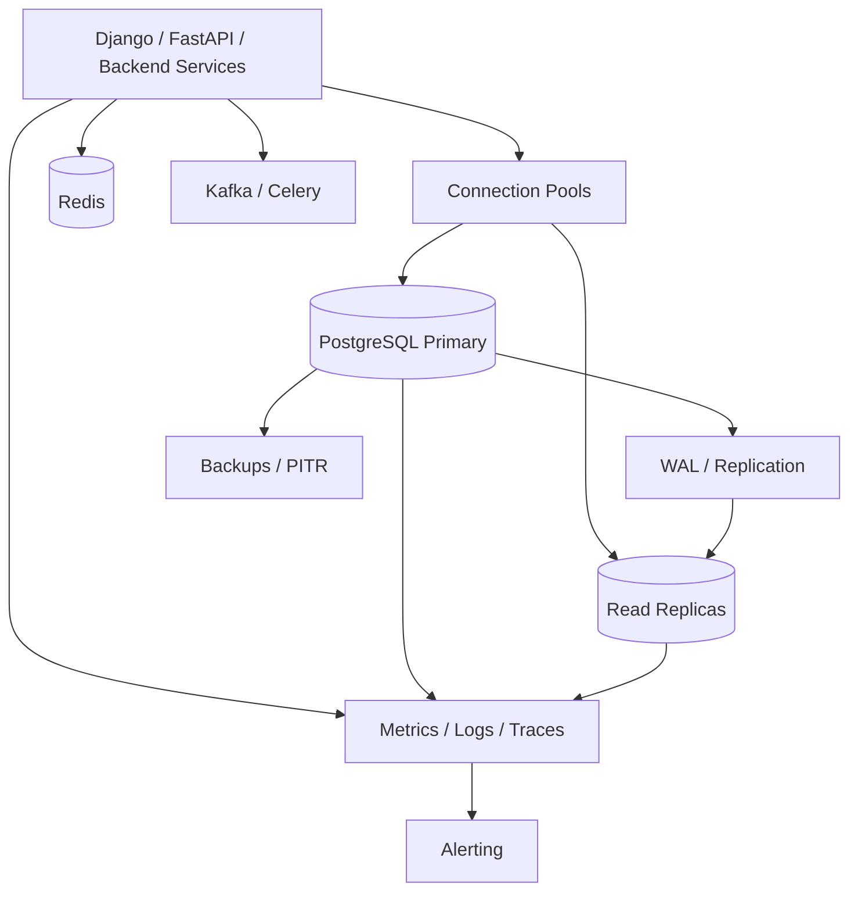

# 24- Database Reliability Practices

## Overview

Database reliability is the ability of a database-backed system to preserve correctness and continue providing its required behavior despite failures, concurrency, traffic growth, deployments, operational mistakes, and infrastructure problems.

For PostgreSQL-backed services, reliability is not provided by replication or backups alone. It is the result of coordinated design across:

- Transactions and constraints.
- Query performance and resource control.
- Connection management.
- Locking and concurrency.
- Backups and recovery.
- Replication and failover.
- Schema migrations.
- Observability.
- Security and access control.
- Application retry and failure handling.
- Capacity planning.

A reliable database architecture should make failures **bounded, observable, recoverable, and safe**.



The senior-level goal is not to eliminate every failure. It is to design the system so that a failure in one component does not become uncontrolled corruption, cascading overload, or an unrecoverable incident.

---

## Reliability vs Availability vs Durability

These concepts are related but different.

| Property | Meaning | Example |
|---|---|---|
| Reliability | Correct and predictable behavior over time | Transactions preserve business invariants |
| Availability | System is accessible when requested | API continues serving after primary failure |
| Durability | Committed data survives failures | Committed transaction survives process/node failure |
| Consistency | Reads and writes obey defined correctness guarantees | Unique constraint remains enforced |
| Recoverability | System can be restored after failure | PITR restores database to a known timestamp |

A system can be highly available but still unreliable if it returns incorrect data.

Similarly, a database can be durable but temporarily unavailable.

Production architecture must define which guarantees matter for each workload.

---

## Define RPO and RTO

Reliability requirements should be measurable.

### Recovery Point Objective

**RPO** defines how much data loss is acceptable after a failure.

```text
RPO = 5 minutes
```

means the organization may tolerate losing up to approximately five minutes of recent committed data, depending on the recovery architecture.

### Recovery Time Objective

**RTO** defines how long recovery may take.

```text
RTO = 15 minutes
```

means the service should be restored within the required 15-minute window.

| Requirement | Typical architectural implications |
|---|---|
| Low RPO | Frequent WAL archiving, synchronous replication, or equivalent mechanisms |
| Low RTO | Automated failover, tested restoration, fast provisioning |
| Both very low | More complex HA/DR architecture and higher operational cost |
| Relaxed RPO/RTO | Simpler and cheaper backup/recovery strategy |

RPO and RTO should be defined per business workload rather than assumed to be identical across the entire system.

---

## Protect Correctness First

The first reliability requirement is preserving valid state.

Use database constraints for invariants.

```sql
CREATE TABLE payments (
    id bigint GENERATED ALWAYS AS IDENTITY PRIMARY KEY,
    order_id bigint NOT NULL REFERENCES orders(id),
    idempotency_key text NOT NULL,
    amount numeric(12, 2) NOT NULL CHECK (amount > 0),
    status text NOT NULL
);

CREATE UNIQUE INDEX payments_idempotency_key_unique
ON payments (idempotency_key);
```

The database protects against:

- Concurrent inserts.
- Application bugs.
- Worker retries.
- Duplicate requests.
- Multiple application instances.

Application validation improves user experience, but database constraints provide the final consistency boundary.

---

## Use Explicit Transaction Boundaries

Transactions should represent a meaningful unit of durable state change.

A typical backend request might follow:

```text
HTTP request
     │
     ▼
Validate request
     │
     ▼
BEGIN
     │
     ├── Read required state
     ├── Validate invariants
     ├── Update rows
     └── Write outbox event
     │
     ▼
COMMIT
     │
     ▼
Return response
```

Keep the transaction short.

Avoid:

```text
BEGIN
  UPDATE database
  call external API
  wait
  call another service
  process large dataset
COMMIT
```

Long transactions can increase:

- Lock duration.
- Connection occupancy.
- MVCC cleanup pressure.
- Dead tuples.
- Replication lag.
- Failure impact.

---

## Keep External Operations Outside Critical Transactions

External systems cannot participate in a normal PostgreSQL transaction automatically.

Consider:

```text
PostgreSQL COMMIT
       │
       ▼
HTTP payment provider
```

If the external call fails after the database commits, the system needs a recovery mechanism.

Prefer durable state transitions plus asynchronous processing:

```text
PostgreSQL transaction
    ├── Business state
    └── Outbox event
             │
             ▼
       Kafka / Celery
             │
             ▼
      External service
```

This provides a durable record of work that still needs to happen.

---

## Use the Transactional Outbox Pattern

Example:

```sql
BEGIN;

UPDATE orders
SET status = 'paid'
WHERE id = $1
  AND status = 'pending';

INSERT INTO outbox_events (
    event_type,
    aggregate_id,
    payload
)
VALUES (
    'order.paid',
    $1,
    $2
);

COMMIT;
```

The outbox worker can safely retry publishing the event.

The event consumer should also be idempotent because Kafka and task queues can deliver messages more than once.

---

## Design for Idempotency

Reliable systems must assume retries.

Possible failure sequence:

```text
Application
    │
    ├── COMMIT
    │
    ├── network failure
    │
    └── client does not receive response
              │
              ▼
          retry request
```

The database may already contain the successful operation.

Use idempotency keys for operations where duplicate effects are unacceptable.

```sql
CREATE UNIQUE INDEX orders_idempotency_key_unique
ON orders (idempotency_key);
```

Retry mechanisms should be:

- Bounded.
- Backoff-based.
- Jittered.
- Idempotent.
- Deadline-aware.
- Observable.

---

## Avoid Retry Storms

Retries can amplify a database failure.

```text
Database slowdown
      ↓
Requests timeout
      ↓
Clients retry
      ↓
More queries
      ↓
Higher CPU / connection usage
      ↓
Database slows further
```

Use:

- Exponential backoff.
- Jitter.
- Maximum retry attempts.
- Request deadlines.
- Connection pool limits.
- Circuit breakers where appropriate.
- Queue-based load shedding.
- Idempotency.

A retry policy should reduce pressure during failure, not increase it.

---

## Understand Connection Pool Reliability

Connection pools protect the database from uncontrolled connection creation, but incorrectly sized pools can become a failure source.

Suppose:

```text
30 Kubernetes pods
× 10 connections
=
300 database connections
```

If Celery workers and additional pools are added, the actual connection budget can be substantially higher.

Model the complete fleet:

```text
Web pods
+ background workers
+ admin processes
+ migrations
+ reporting jobs
+ read pools
+ write pools
```

Connection pool sizing should consider:

- PostgreSQL `max_connections`.
- Memory per backend process.
- Query concurrency.
- Lock contention.
- CPU capacity.
- Application worker count.
- Deployment overlap.

More connections do not automatically increase throughput.

---

## Prevent Connection Leaks

Every database connection should have a predictable lifecycle.

For SQLAlchemy:

```python
from sqlalchemy import create_engine

engine = create_engine(
    database_url,
    pool_size=10,
    max_overflow=5,
    pool_timeout=10,
    pool_pre_ping=True,
)
```

Application code should release connections promptly.

For Django, persistent connections configured through `CONN_MAX_AGE` are not equivalent to a general-purpose maximum-size connection pool. Database capacity must still be managed at the application and infrastructure levels.

Monitor:

- Active connections.
- Idle connections.
- Idle-in-transaction sessions.
- Pool acquisition latency.
- Pool exhaustion.
- Connection errors.

---

## Keep Idle Transactions Under Control

An idle transaction is particularly dangerous when it remains open for a long time.

```text
BEGIN
   │
   ├── query
   │
   └── application waits
          │
          └── transaction remains open
```

Long-running transactions can prevent PostgreSQL from reclaiming old row versions.

This may contribute to:

- Table bloat.
- Index bloat.
- Vacuum delays.
- Increasing storage.
- Replication problems.
- Performance degradation.

Investigate long-running transactions using PostgreSQL activity information.

---

## Control Lock Contention

Locks are required for correctness, but excessive waiting can degrade system reliability.

Common sources:

- Hot rows.
- Large updates.
- Long transactions.
- `SELECT FOR UPDATE`.
- DDL.
- Foreign-key interactions.
- Advisory locks.

Use deterministic lock ordering.

For example, when updating multiple accounts, always acquire locks in a consistent ID order.

For queue-like workloads:

```sql
SELECT id
FROM jobs
WHERE status = 'pending'
ORDER BY id
FOR UPDATE SKIP LOCKED
LIMIT 10;
```

`SKIP LOCKED` can increase worker concurrency, but it should only be used when temporarily skipping locked work is acceptable.

---

## Handle Deadlocks and Serialization Failures

Deadlocks are normal failure modes in concurrent systems, not necessarily evidence of database corruption.

PostgreSQL uses SQLSTATE:

```text
40P01
```

for deadlocks.

Serialization failures commonly use:

```text
40001
```

Retry the **whole transaction**, not merely the failed statement.

Use:

```text
bounded retry
    +
exponential backoff
    +
jitter
    +
idempotent transaction
```

Do not retry indefinitely.

---

## Use Timeouts as Reliability Controls

A production system should not allow database operations to wait forever.

Important timeout layers include:

| Timeout | Protects against |
|---|---|
| Connection timeout | Slow/unreachable database |
| Pool timeout | Pool exhaustion |
| `lock_timeout` | Excessive lock waiting |
| `statement_timeout` | Excessively long SQL execution |
| HTTP timeout | Slow backend request |
| Worker timeout | Stuck background task |

For targeted operations:

```sql
SET LOCAL lock_timeout = '2s';
SET LOCAL statement_timeout = '10s';
```

Timeout values should reflect actual workload requirements.

A timeout is not a substitute for fixing a fundamentally inefficient query.

---

## Monitor Query Workload

Reliability requires knowing what the database is doing.

Useful PostgreSQL signals include:

- Query latency.
- Query execution count.
- Total execution time.
- Rows returned.
- Buffer hits.
- Buffer reads.
- Temporary files.
- Lock waits.
- Active sessions.
- Wait events.

`pg_stat_statements` can identify expensive aggregate workloads.

For example:

```sql
SELECT
    query,
    calls,
    total_exec_time,
    mean_exec_time,
    rows
FROM pg_stat_statements
ORDER BY total_exec_time DESC
LIMIT 20;
```

A query taking 20 ms and executing millions of times can be more operationally significant than a 10-second query executed once.

---

## Monitor Database Resource Health

Monitor at least:

| Area | Important signals |
|---|---|
| CPU | Utilization, saturation, load |
| Memory | Available memory, swap, OOM events |
| Storage | Capacity, IOPS, latency, throughput |
| Connections | Active, idle, waiting, pool exhaustion |
| Transactions | Age, throughput, failures |
| Locks | Waiters, blockers, duration |
| Vacuum | Dead tuples, autovacuum activity |
| WAL | Generation rate, retention |
| Replication | Lag, replay position, failures |
| Queries | Latency, frequency, errors |

Monitoring should cover both absolute values and trends.

A database using 70% CPU may be healthy today but dangerous if workload growth is consistently adding 5% per month.

---

## Use Execution Plans for Performance Reliability

A query plan should be evaluated against realistic production data.

```sql
EXPLAIN (ANALYZE, BUFFERS)
SELECT id, status
FROM orders
WHERE customer_id = $1
ORDER BY created_at DESC
LIMIT 50;
```

Inspect:

- Estimated vs actual rows.
- Scan type.
- Join strategy.
- Loops.
- Sorts.
- Buffer activity.
- Temporary I/O.
- Planning time.
- Execution time.

`EXPLAIN ANALYZE` executes the query, so never casually run it against production `INSERT`, `UPDATE`, or `DELETE` statements.

Reliability includes predictable query behavior as data volume changes.

---

## Keep Statistics and Maintenance Healthy

PostgreSQL query planning depends heavily on statistics.

Regular maintenance includes:

```sql
ANALYZE orders;
```

and, when appropriate:

```sql
VACUUM (ANALYZE) orders;
```

Autovacuum should normally remain enabled.

Monitor:

- Dead tuples.
- Table growth.
- Index growth.
- Autovacuum activity.
- Analyze activity.
- Long-running transactions.
- Transaction ID age.

Do not disable autovacuum simply because vacuum activity is visible during a performance incident. Investigate why maintenance is consuming resources and whether configuration or workload changes are required.

---

## Design Indexes for Reliability

Indexes improve access paths but also introduce operational costs.

Every index can increase:

- Storage.
- Write amplification.
- WAL volume.
- Cache pressure.
- Vacuum work.
- Backup size.
- Replication traffic.

Use indexes based on actual query patterns.

For example:

```sql
CREATE INDEX orders_customer_created_idx
ON orders (customer_id, created_at DESC);
```

Avoid creating indexes without validating:

- Query frequency.
- Selectivity.
- Table size.
- Write workload.
- Existing overlapping indexes.
- Execution plans.

An index that makes one query faster can still make the overall database less reliable if it adds excessive write cost.

---

## Manage Schema Changes Safely

Schema migrations are database operations and therefore reliability events.

A safer deployment pattern is:

```text
Backward-compatible schema
        ↓
Deploy application
        ↓
Enable new behavior
        ↓
Backfill / migrate data
        ↓
Validate
        ↓
Remove obsolete structure later
```

This is commonly called expand-and-contract.

Consider:

- Lock acquisition.
- Migration duration.
- Table size.
- Existing transactions.
- Replication lag.
- Application compatibility.
- Rollback or forward-recovery strategy.

For large indexes:

```sql
CREATE INDEX CONCURRENTLY orders_customer_idx
ON orders (customer_id);
```

`CREATE INDEX CONCURRENTLY` can reduce blocking of normal writes, but it has additional operational complexity and cannot run inside a transaction block.

---

## Make Backfills Resumable

Large data migrations should not assume they will complete in one attempt.

Prefer:

```text
Find next batch
      ↓
Process batch
      ↓
Commit
      ↓
Record progress
      ↓
Repeat
```

A reliable backfill should tolerate:

- Worker restart.
- Deployment.
- Database failover.
- Partial progress.
- Retry.
- Temporary throttling.

Avoid a single transaction that modifies hundreds of millions of rows unless the operational consequences have been explicitly evaluated.

---

## Use Read Replicas Carefully

Read replicas can reduce primary read workload and improve availability options.

```text
                ┌── Replica 1
                │
Application ────┼── Replica 2
                │
                └── Primary
                     │
                   Writes
```

Asynchronous replicas introduce lag.

A request performing:

```text
POST /orders
GET /orders/123
```

may write to the primary and immediately read from a replica that has not replayed the write yet.

For consistency-sensitive operations, use the primary or an appropriate consistency-aware routing mechanism.

Replicas do not solve:

- Primary write saturation.
- Hot-row contention.
- Poor write queries.
- Incorrect transaction design.

---

## Design Failover Around Stable Endpoints

Applications should not hard-code a specific database instance as the permanent writer.

Prefer:

```text
Application
     │
     ▼
Stable database endpoint
     │
     ▼
Current primary
```

During failover:

```text
Old primary
     X
     │
     ▼
Standby promoted
     │
     ▼
Writer endpoint updated
     │
     ▼
Applications reconnect
```

Application pools must handle stale connections and reconnect after failover.

A failover design should explicitly address uncertain transactions.

For example:

```text
Client sends write
      ↓
Primary processes COMMIT
      ↓
Connection fails
      ↓
Client does not know whether commit succeeded
```

Blindly retrying the write can create duplicate business effects.

Idempotency is therefore part of database failover design.

---

## Use Backups as an Independent Recovery Mechanism

Replication improves availability but is not a substitute for backups.

A replica can faithfully reproduce:

- Accidental deletes.
- Incorrect updates.
- Corrupted application logic.
- Malicious changes.

Maintain appropriate:

- Full backups.
- Incremental mechanisms where supported.
- WAL archives.
- Point-in-time recovery.
- Retention policies.
- Isolated backup storage.
- Cross-region copies where required.

Recovery should be tested, not merely configured.

---

## Test Restore Procedures

A reliable recovery process should answer:

- Where is the backup?
- Who can access it?
- How is the restore performed?
- How long does it take?
- What is the target recovery point?
- How is data integrity verified?
- How are application services reconnected?
- What happens to Kafka or Celery messages?
- How is Redis rebuilt or invalidated?
- How is DNS or endpoint routing changed?

A useful operational process is:

```text
Backup
  ↓
Restore
  ↓
Integrity verification
  ↓
Application connectivity
  ↓
Critical query validation
  ↓
Measure RTO
```

Restore testing should happen regularly and should use realistic data volumes where practical.

---

## Account for Redis, Kafka, and Celery During Recovery

Restoring PostgreSQL does not automatically restore the state of every dependent system.

For example:

```text
PostgreSQL
    │
    ├── Durable business state
    │
    └── Outbox events
             │
             ▼
           Kafka
             │
             ▼
        Consumers
```

After database recovery, consumers may:

- Reprocess events.
- Observe missing downstream state.
- Need replay.
- Need deduplication.

Redis should generally be treated as rebuildable cache state unless the architecture explicitly makes it durable system state.

Celery tasks should be idempotent because tasks may be retried or requeued during recovery.

---

## Protect Database Security

Reliability and security are connected.

A compromised database role can destroy availability or data integrity.

Production database roles should follow least privilege.

Separate:

- Runtime application roles.
- Migration roles.
- Read-only roles.
- Administrative roles.
- Break-glass access.

Avoid giving application roles:

```text
SUPERUSER
CREATEROLE
BYPASSRLS
```

unless there is a specific, reviewed requirement.

Protect credentials through appropriate secret-management systems rather than source control or static configuration files.

---

## Secure Backups and Recovery Infrastructure

Backups contain production data and must be protected accordingly.

Use:

- Encryption at rest.
- Encryption in transit.
- Restricted IAM.
- Separate backup access.
- Retention policies.
- Deletion protection or immutable storage where appropriate.
- Cross-account or isolated backup copies where required.
- Auditing of restore and deletion operations.

Recovery environments must also be secured.

Restoring production data into an unrestricted development environment can become a serious data-exposure incident.

---

## Use Observability Correlation

Database reliability incidents often cross multiple layers.

A useful request correlation path is:

```text
Request ID
   │
   ▼
Nginx / Load Balancer
   │
   ▼
Django / FastAPI
   │
   ▼
Connection Pool
   │
   ▼
PostgreSQL
   │
   ├── Query
   ├── Lock
   └── Transaction
```

Capture appropriate identifiers such as:

- Request ID.
- Service name.
- Database role.
- `application_name`.
- Query fingerprint.
- Transaction or job identifier.

Avoid logging sensitive query parameters.

---

## Define Reliability Alerts

Alerts should identify conditions requiring action rather than merely report normal utilization.

Useful alerts include:

- Database unavailable.
- Primary failover.
- Replica lag beyond threshold.
- Connection pool exhaustion.
- Connection count near safe capacity.
- Long-running transactions.
- Idle-in-transaction sessions.
- Lock waits above threshold.
- Deadlock rate increase.
- Serialization failure increase.
- Disk approaching capacity.
- WAL retention growth.
- Backup failure.
- PITR/WAL archive failure.
- Autovacuum falling behind.
- Query latency regression.

Thresholds should be based on service-level requirements and historical behavior.

---

## Capacity Planning Is Reliability Engineering

Capacity should be planned before the database reaches saturation.

Track:

```text
Traffic growth
      +
Data growth
      +
Query growth
      +
Connection growth
      +
WAL growth
      +
Storage growth
```

Capacity planning should include headroom for:

- Traffic spikes.
- Failover.
- Maintenance.
- Backfills.
- Deployments.
- Background workers.
- Replication.
- Recovery operations.

A primary running at 95% sustained capacity may appear healthy until a failover causes all traffic to concentrate on a smaller standby.

---

## Design for Failover Capacity

Consider two database nodes:

```text
Primary: 16 CPU
Standby: 16 CPU
```

If the standby is intended to become primary, it should be capable of handling the expected production workload.

Do not design:

```text
Primary: 16 CPU
Standby: 4 CPU
```

and assume failover preserves normal performance.

Failover capacity is part of normal capacity planning.

---

## Separate Failure Domains

For high availability, avoid placing all critical database components in the same failure domain.

Depending on platform and requirements, use:

- Multiple availability zones.
- Independent storage.
- Separate backup locations.
- Cross-region recovery.
- Independent monitoring.
- Isolated credentials.

AWS-managed database services can reduce operational burden, but application-level reliability still requires correct transaction, timeout, retry, and connection-pool behavior.

---

## Handle Application Deployment Safely

Database reliability can be damaged by deployment sequencing.

A safer deployment might be:

```text
Migration: additive change
        ↓
Application version A remains compatible
        ↓
Deploy application version B
        ↓
Verify
        ↓
Backfill
        ↓
Remove obsolete structure later
```

Avoid deployments where:

```text
New application
     ↓
requires schema not yet deployed
```

or:

```text
Migration
     ↓
removes column
     ↓
old application still running
```

Backward compatibility is particularly important during rolling Kubernetes deployments.

---

## Test Failure Scenarios

Reliability should be tested under realistic failures.

Examples:

| Failure | Expected behavior |
|---|---|
| Primary unavailable | Failover occurs or service enters controlled degraded mode |
| Replica unavailable | Reads reroute or degrade safely |
| Database connection reset | Pool reconnects |
| Query timeout | Request fails within bounded time |
| Deadlock | Transaction retries safely |
| Serialization failure | Transaction retries safely |
| Redis unavailable | Application follows defined cache fallback |
| Kafka unavailable | Outbox retains events |
| Backup failure | Alert triggers before recovery capability is lost |
| Storage nearly full | Capacity alert triggers before writes fail |
| Worker restart | Tasks resume without duplicate business effects |

Failure testing should verify both technical recovery and business correctness.

---

## Avoid Cascading Failures

Database failures often propagate through the application.

A common chain:

```text
Slow PostgreSQL
     ↓
Queries wait
     ↓
Connections remain occupied
     ↓
Pool exhausted
     ↓
HTTP requests wait
     ↓
Requests timeout
     ↓
Clients retry
     ↓
Traffic increases
```

Prevent this with multiple controls:

- Query optimization.
- Connection limits.
- Timeouts.
- Backpressure.
- Retry budgets.
- Circuit breakers.
- Load shedding.
- Queueing.
- Graceful degradation.

Reliability is strongest when each layer limits the failure of the layer beneath it.

---

## Graceful Degradation

Not every feature needs database availability to be identical.

For example:

```text
Critical order API
    ↓
Must use PostgreSQL

Product recommendations
    ↓
Can use Redis
    ↓
Fallback to no recommendations
```

A system should identify:

- Critical paths.
- Degradable paths.
- Read-only fallback behavior.
- Cache fallback behavior.
- Queue-based deferred operations.

Do not introduce silent stale data for operations that require strong consistency.

---

## Operational Runbooks

A production database should have documented runbooks for:

- High CPU.
- High memory.
- Storage exhaustion.
- Connection exhaustion.
- Lock contention.
- Deadlocks.
- Replication lag.
- Primary failure.
- Replica failure.
- Backup failure.
- PITR.
- Long-running transactions.
- Autovacuum problems.
- Failed migrations.

Each runbook should identify:

1. Symptoms.
2. Immediate safety actions.
3. Diagnostic queries and metrics.
4. Mitigation.
5. Escalation criteria.
6. Recovery procedure.
7. Verification.
8. Follow-up actions.

Operational knowledge should not exist only in an individual engineer's memory.

---

## Common Reliability Mistakes

### Treating Replication as Backup

Replication reproduces changes, including bad changes.

**Better:** maintain independent backups and test restoration.

### Unlimited Retries

Retries can turn a database outage into a traffic amplification event.

**Better:** use bounded retries, backoff, jitter, and deadlines.

### Huge Transactions

Large transactions increase locks, MVCC pressure, WAL, and recovery complexity.

**Better:** use controlled batching where appropriate.

### Ignoring Background Workers

Celery and Kafka consumers can consume significant database capacity.

**Better:** include all database clients in capacity planning.

### Over-Provisioning Connections

More connections can increase contention and memory consumption.

**Better:** calculate a fleet-wide connection budget.

### Running External Calls Inside Transactions

External latency extends transaction and lock duration.

**Better:** use durable state transitions and asynchronous coordination.

### No Restore Testing

A successful backup job does not prove recovery works.

**Better:** regularly perform restore tests and measure RTO.

### Assuming Failover Means Zero Downtime

Failover can leave stale application connections, uncertain transactions, and connection-pool failures.

**Better:** test the complete failover path from client to database.

### Disabling Maintenance During Incidents

Disabling autovacuum or other maintenance without understanding the consequences can create longer-term failures.

**Better:** diagnose the underlying resource contention and tune deliberately.

### Ignoring Data Growth

A query that is fast today can become a production bottleneck after years of growth.

**Better:** test against realistic scale and monitor growth trends.

### Logging Everything

Database logs can expose sensitive information and create large operational costs.

**Better:** use structured, selective, redacted logging.

---

## Production Reliability Checklist

### Correctness

- [ ] Critical business invariants have database constraints.
- [ ] Transactions have explicit boundaries.
- [ ] State transitions are atomic where possible.
- [ ] Idempotency exists for retriable operations.
- [ ] Concurrency behavior has been tested.

### Performance

- [ ] Important queries have been analyzed with realistic data.
- [ ] Query frequency is monitored.
- [ ] Indexes match real access patterns.
- [ ] Statistics and vacuum are healthy.
- [ ] Large workloads are isolated or batched.

### Connections

- [ ] Application pools have bounded capacity.
- [ ] Fleet-wide connection usage is known.
- [ ] Pool exhaustion is observable.
- [ ] Connections are released correctly.
- [ ] Idle-in-transaction sessions are monitored.

### Transactions and Locks

- [ ] Transactions are short.
- [ ] External calls are outside critical transactions.
- [ ] Lock ordering is consistent.
- [ ] Deadlock handling exists.
- [ ] Serialization failures are handled.
- [ ] Timeouts are configured appropriately.

### Availability

- [ ] Primary failure behavior is defined.
- [ ] Failover endpoints are stable.
- [ ] Application reconnect behavior is tested.
- [ ] Replica lag is monitored.
- [ ] Standby capacity is sufficient for failover.

### Backups and Recovery

- [ ] Backups are automated.
- [ ] WAL/PITR is configured where required.
- [ ] Backup storage is protected.
- [ ] Restore procedures are documented.
- [ ] Restore tests are performed.
- [ ] RPO and RTO are measurable.

### Operations

- [ ] Database metrics are monitored.
- [ ] Query performance is observable.
- [ ] Lock contention is observable.
- [ ] Storage growth is tracked.
- [ ] WAL and replication are monitored.
- [ ] Runbooks exist for major failure modes.

### Security

- [ ] Runtime roles follow least privilege.
- [ ] Migration access is separated.
- [ ] Database credentials are securely managed.
- [ ] Backups are encrypted and access-controlled.
- [ ] Sensitive database activity is auditable.
- [ ] Production data is protected during recovery testing.

---

## Senior-Level Reliability Review

When reviewing a production database architecture, ask:

- What happens if the primary fails during a transaction?
- What happens if the client loses the connection immediately after `COMMIT`?
- What happens if a replica is five minutes behind?
- What happens if all application pods restart simultaneously?
- What happens if the database becomes slow rather than completely unavailable?
- What happens if connection pools exhaust before PostgreSQL itself reaches its connection limit?
- What happens if a deployment overlaps with a schema migration?
- What happens if Kafka is unavailable after the database transaction commits?
- What happens if a Celery task executes twice?
- What happens if a backfill runs during peak traffic?
- What happens if a developer accidentally deletes production data?
- How long does restoration actually take?
- Can the standby handle the full production workload?
- What happens if the backup system itself fails?
- Which parts of the system can degrade gracefully?
- Which operations require strong consistency?
- Which failures trigger retries, and how are retry storms prevented?

These questions expose reliability weaknesses that are often invisible during normal operation.

---

## Interview Traps

### "High availability means no downtime."

HA reduces downtime; it does not guarantee zero downtime.

Failover itself can involve:

- Detection.
- Promotion.
- Endpoint changes.
- Connection recovery.
- Transaction uncertainty.

### "Read replicas improve database reliability."

They can improve read scalability and provide additional recovery/failover options, but asynchronous replicas introduce lag and do not replace backups.

### "Just retry the query."

Retrying only the failed statement can be incorrect when the transaction has already entered an aborted state or when earlier statements affected transactional state.

Retry the appropriate transaction boundary.

### "More connections improve throughput."

Excessive connections can increase CPU, memory, lock contention, and queueing.

### "A successful backup means recovery is solved."

Recovery must be tested and measured against RPO and RTO.

### "Transactions should contain all business logic."

Transactions should contain the durable consistency boundary, not arbitrary external operations that unnecessarily extend their lifetime.

### "Autovacuum is just background cleanup."

Vacuum is an important part of PostgreSQL's MVCC maintenance and directly affects long-term reliability and storage behavior.

### "Failover is a database-only problem."

Application pools, DNS/endpoints, retries, idempotency, transaction semantics, and health checks are all part of the failover path.

---

## Key Takeaways

- **Reliability is broader than availability:** correctness, durability, recoverability, performance, concurrency, and operational behavior all contribute to a reliable database system.
- **Design for failure explicitly:** bounded retries, idempotency, short transactions, timeouts, connection limits, and tested failover prevent local failures from becoming cascading incidents.
- **Backups and recovery must be verified:** define measurable RPO/RTO and regularly test restoration, PITR, failover, and dependent-system recovery.
- **Monitor the entire database lifecycle:** queries, connections, locks, vacuum, WAL, replication, storage, capacity, and application behavior must be observable together.
- **Reliability is an architectural property:** PostgreSQL, Redis, Kafka, Celery, application services, infrastructure, deployments, and recovery procedures must be designed as one failure-aware system.