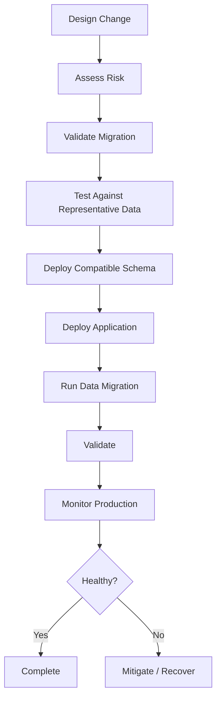
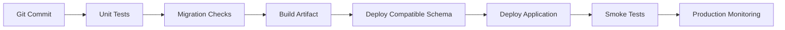
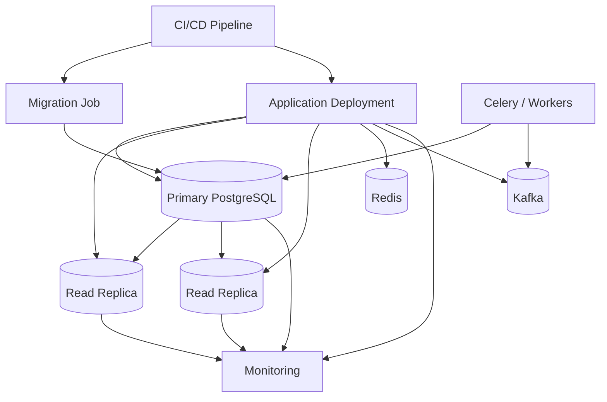

# 01- Database Deployment Fundamentals

## Overview

Database deployment is the controlled process of introducing database schema, data, configuration, and operational changes into an environment without compromising application correctness or availability.

For backend systems, database deployment is more than running migration commands. A production deployment must account for:

- Schema compatibility
- Application version compatibility
- Transaction behavior
- Lock acquisition
- Data volume
- Connection management
- Replication
- Rollback and recovery
- CI/CD orchestration
- Observability
- Security
- High availability

A useful mental model is:

```text
Application Change
        │
        ▼
Database Change
        │
        ├── Schema
        ├── Data
        ├── Constraints
        ├── Indexes
        └── Configuration
        │
        ▼
Compatibility Validation
        │
        ▼
Deployment
        │
        ▼
Monitoring
        │
        ▼
Validation
        │
        ▼
Stable Production State
```

The central production principle is:

> **A database change should be safe while old and new application versions may temporarily coexist.**

This becomes especially important with rolling deployments in Kubernetes, blue/green deployments, multiple application instances, background workers, and microservices.

---

## What Constitutes a Database Deployment?

A database deployment can contain several different change types.

| Change type | Example | Typical risk |
|---|---|---|
| Schema addition | Add nullable column | Low |
| Schema removal | Drop old column | High |
| Index | Create index | Medium |
| Constraint | Add foreign key | Medium/High |
| Data migration | Backfill millions of rows | High |
| Type change | `integer` → `bigint` | Medium/High |
| Rename | Rename column/table | High |
| Function change | Update stored procedure | Medium |
| Permission change | Grant/revoke privileges | Medium |
| Configuration | Change database settings | Medium/High |

The operational risk depends heavily on:

- Table size
- Number of affected rows
- Lock requirements
- Query workload
- Replication topology
- Application compatibility
- Deployment strategy
- Recovery capability

---

## Application and Database Deployment Coupling

The application and database evolve together, but they should not necessarily be deployed as one atomic operation.

Consider an application that changes:

```text
old:
users.email

new:
users.contact_email
```

A direct rename can break older application instances during a rolling deployment.

A safer strategy is:

```text
Phase 1
Add contact_email
       │
       ▼
Phase 2
Deploy application that can read/write both
       │
       ▼
Phase 3
Backfill contact_email
       │
       ▼
Phase 4
Switch application reads to contact_email
       │
       ▼
Phase 5
Stop writing email
       │
       ▼
Phase 6
Remove old email column later
```

This is the foundation of **expand-and-contract schema evolution**.

---

## Database Deployment Lifecycle

A production deployment should normally follow a controlled lifecycle.



Each stage answers a different question:

| Stage | Question |
|---|---|
| Design | What is changing? |
| Risk assessment | What can break? |
| Validation | Does the migration work? |
| Testing | What happens at production scale? |
| Deployment | Can the change be introduced safely? |
| Application rollout | Can all application versions coexist? |
| Data migration | Can existing data be transformed safely? |
| Validation | Is the resulting state correct? |
| Monitoring | Did production behavior remain healthy? |
| Recovery | What happens if the change fails? |

---

## Schema Migrations

A schema migration changes database structure.

Examples include:

```sql
ALTER TABLE customers
ADD COLUMN marketing_opt_in boolean;
```

Or:

```sql
CREATE INDEX CONCURRENTLY customers_email_idx
ON customers (email);
```

Migrations should be:

- Version controlled
- Repeatable
- Tested
- Observable
- Owned
- Compatible with deployment strategy

Frameworks such as Django migrations provide a structured mechanism for managing schema changes, but the generated SQL still executes against the real database.

The database does not know that a migration originated from Django.

---

## Migration Transactions

Some database operations can safely run inside transactions, while others have restrictions.

For PostgreSQL, for example, `CREATE INDEX CONCURRENTLY` cannot run inside a transaction block.

A migration framework therefore needs to understand the transactional characteristics of each operation.

Example Django migration:

```python
from django.db import migrations, models


class Migration(migrations.Migration):
    atomic = False

    dependencies = [
        ("customers", "0012_previous"),
    ]

    operations = [
        migrations.AddField(
            model_name="customer",
            name="marketing_opt_in",
            field=models.BooleanField(default=False),
        ),
    ]
```

Do not assume that wrapping every migration in one large transaction is automatically safer.

A large transaction can create:

- Long lock durations
- Large WAL volume
- Replica lag
- Extended transaction lifetime
- Increased recovery cost

---

## Expand-and-Contract Migrations

Expand-and-contract is one of the most important production deployment patterns.

### Expand

Introduce new structures without removing old ones.

```text
Old Application
      │
      ▼
Existing Schema + New Schema
```

### Migrate

Deploy application code that understands both representations.

```text
Old code ──────► Old schema
New code ──────► Old + New schema
```

Backfill existing data gradually.

### Contract

Once the old representation is no longer required:

```text
Stop old writes
      ↓
Verify old reads are gone
      ↓
Remove old schema
```

This pattern minimizes deployment coupling and supports rolling deployments.

---

## Backward Compatibility

During a deployment, multiple versions of an application may exist simultaneously.

```text
                 Load Balancer
                       │
          ┌────────────┼────────────┐
          ▼            ▼            ▼
      App v1        App v2        App v2
          │            │            │
          └────────────┼────────────┘
                       ▼
                  PostgreSQL
```

The database must support both application versions during the transition.

### Safe compatibility patterns

| Change | Safer approach |
|---|---|
| Add column | Add before application uses it |
| Remove column | Stop application usage first |
| Rename column | Add new name, migrate usage, remove old later |
| Add enum/state | Make application tolerate unknown values |
| Change type | Use compatible intermediate representation |
| Add constraint | Validate existing data before enforcement |
| Large backfill | Run asynchronously/in batches |

---

## Destructive Changes

Destructive operations deserve special treatment.

Examples:

```sql
DROP COLUMN legacy_status;
DROP TABLE old_events;
```

The danger is not just data loss.

A destructive migration can break:

- Older application instances
- Background workers
- Scheduled jobs
- Reporting systems
- ETL processes
- Admin scripts
- Other services
- Long-running processes

Before removing a database object, establish that all consumers have stopped depending on it.

A strong operational rule is:

> **Removal should usually be a separate deployment from introduction.**

---

## Index Deployment

Indexes can improve query performance but can also consume significant resources.

For large PostgreSQL tables, consider:

```sql
CREATE INDEX CONCURRENTLY orders_customer_id_created_at_idx
ON orders (customer_id, created_at DESC);
```

`CONCURRENTLY` reduces blocking of normal table writes, but it:

- Takes longer
- Performs more work
- Has additional failure/retry considerations
- Cannot run inside a transaction block

Index creation should therefore be planned based on:

- Table size
- Current workload
- Storage capacity
- I/O capacity
- Replication behavior
- Query requirements

Never create indexes blindly because a query is slow. First inspect the execution plan and workload.

---

## Constraint Deployment

Adding a constraint to existing data can be more complicated than creating the constraint on a new table.

For example:

```sql
ALTER TABLE orders
ADD CONSTRAINT orders_customer_fk
FOREIGN KEY (customer_id)
REFERENCES customers(id);
```

Before deployment, verify:

- Existing rows satisfy the constraint
- Required indexes exist where appropriate
- Lock behavior is acceptable
- Validation cost is acceptable
- Application writes are compatible

For large tables, PostgreSQL supports strategies that allow validation to be separated from initial constraint creation.

The general production pattern is:

```text
Prepare
  ↓
Validate existing data
  ↓
Introduce constraint safely
  ↓
Monitor
```

---

## Data Migrations

A data migration changes existing records.

Examples:

```sql
UPDATE customers
SET normalized_email = lower(email)
WHERE normalized_email IS NULL;
```

A small table may tolerate a single transaction.

A large production table may not.

Large data migrations can generate:

- High CPU
- High I/O
- WAL growth
- Replica lag
- Lock contention
- Table bloat
- Autovacuum pressure

Prefer controlled batches.

```text
10 million rows
       │
       ├── Batch 1
       ├── Batch 2
       ├── Batch 3
       ├── ...
       └── Batch N
```

The migration should expose progress and support safe interruption.

---

## Idempotent Data Migrations

A production data migration should ideally tolerate retries.

For example:

```sql
UPDATE customers
SET normalized_email = lower(email)
WHERE normalized_email IS NULL
  AND id > $1
  AND id <= $2;
```

A retry of the same batch should not produce an incorrect result.

Avoid migrations that assume:

```text
"this code will execute exactly once"
```

CI/CD retries, operator retries, process failures, and deployment interruptions can violate that assumption.

---

## Migration State and Version Control

Migration files should normally be stored with application source code.

For Django:

```text
app/
├── migrations/
│   ├── 0001_initial.py
│   ├── 0002_add_customer_status.py
│   └── 0003_add_customer_index.py
```

This provides:

- Reviewable changes
- Reproducible environments
- Deployment history
- Dependency ordering
- CI/CD integration

Do not manually modify already-applied migrations in production unless there is a deliberate recovery procedure.

Instead, create a new migration representing the correction.

---

## CI/CD Integration

A common production pipeline is:



A mature pipeline should validate migrations before production.

Typical checks include:

- Migration syntax
- Migration ordering
- Application compatibility
- Test database migration
- Roll-forward behavior
- Query performance where practical
- Schema drift
- Migration duration
- Required permissions

---

## Django Deployment

Django applications commonly execute migrations using:

```bash
python manage.py migrate
```

Before production execution:

```bash
python manage.py showmigrations
```

Review the generated SQL where appropriate:

```bash
python manage.py sqlmigrate customers 0003
```

The important production concern is not the command itself.

It is understanding what SQL the command will execute.

For example, a seemingly simple model change may result in:

- Table rewrite
- Lock acquisition
- Index creation
- Constraint validation
- Data transformation

Always inspect high-risk migrations.

---

## FastAPI and SQLAlchemy Deployment

FastAPI does not provide a database migration system itself.

A common architecture uses Alembic with SQLAlchemy:

```text
FastAPI
   │
   ▼
SQLAlchemy
   │
   ▼
PostgreSQL

Alembic
   │
   ▼
Database Schema
```

Migration commands might be:

```bash
alembic upgrade head
```

and:

```bash
alembic current
```

The same production principles apply:

- Review generated SQL
- Test against realistic data
- Avoid long locks
- Separate schema changes from large backfills
- Monitor deployment effects

---

## Database Deployment in Kubernetes

Kubernetes rolling deployments make backward compatibility especially important.

A simplified deployment looks like:

```text
Old Pods ──────────────┐
                       │
Database migration ────┼──► Compatible schema
                       │
New Pods ──────────────┘
```

Avoid a migration that immediately breaks old pods.

A safer sequence is:

```text
1. Expand schema
2. Deploy compatible application
3. Gradually migrate data
4. Validate
5. Remove obsolete schema later
```

### Migration jobs

A dedicated Kubernetes Job can be used for migrations:

```yaml
apiVersion: batch/v1
kind: Job
metadata:
  name: database-migration
spec:
  template:
    spec:
      restartPolicy: Never
      containers:
        - name: migration
          image: example/backend:release
          command:
            - python
            - manage.py
            - migrate
```

However, running migrations as part of every application pod startup is usually undesirable because multiple pods may race to perform deployment work and application readiness becomes coupled to migration completion.

---

## Database Deployment in Microservices

Microservices introduce additional schema ownership concerns.

A preferred model is:

```text
Service A ──► Database A
Service B ──► Database B
Service C ──► Database C
```

Each service owns its schema and migrations.

If multiple services directly depend on the same database tables:

```text
Service A ──┐
Service B ──┼──► Shared Database
Service C ──┘
```

schema changes become distributed coordination problems.

Before changing a shared table, identify all consumers.

Database ownership is therefore an architectural boundary, not merely an organizational convention.

---

## Deployment and Connection Pools

Schema deployment interacts with connection pooling.

During a rolling deployment:

```text
Old application pools
        +
New application pools
        +
Migration process
        +
Workers
        ↓
PostgreSQL
```

The database may temporarily receive more connections than normal.

Capacity planning should account for deployment overlap.

Avoid using an unbounded connection pool during migrations or application rollout.

---

## Transactions During Deployment

Transactions provide atomicity but do not make every deployment operation safe.

A migration transaction can hold locks until commit:

```text
BEGIN
   │
   ├── ALTER TABLE
   │
   ├── UPDATE ...
   │
   └── COMMIT
        │
        ▼
Locks released
```

If the transaction takes 20 minutes, conflicting operations may wait for 20 minutes.

Therefore, evaluate:

- Transaction duration
- Lock type
- Number of affected rows
- Concurrent workload
- Replica behavior
- WAL generation

Shorter transactions are generally easier to operate.

---

## Deployment and Replication

Database changes propagate through the replication architecture.

```text
Migration on Primary
        │
        ▼
      WAL
        │
        ├────────► Replica 1
        │
        └────────► Replica 2
```

Large migrations can generate substantial WAL and therefore increase replica lag.

Monitor:

- WAL generation
- Replica replay position
- Replica lag
- Replica query conflicts
- Replication slot retention

A migration that completes successfully on the primary can still cause a production incident if replicas fall significantly behind.

---

## Deployment and Read Replicas

If an application reads from replicas, schema rollout must account for replica timing.

Potential sequence:

```text
Primary schema updated
       │
       ▼
Replica replay pending
       │
       ▼
Application reads replica
       │
       ▼
Schema mismatch
```

Applications should not assume that a schema change is visible everywhere simultaneously.

For critical deployment transitions, account for replication lag and ensure application behavior remains compatible with both schema states.

---

## Database Deployment and Caching

Schema and data migrations can invalidate application caches.

For example:

```text
Database migration
       │
       ▼
Data representation changes
       │
       ▼
Old Redis cache entries
       │
       ▼
Application reads stale/incompatible data
```

Consider:

- Cache key versioning
- Cache invalidation
- TTLs
- Warm-up strategies
- Serialization compatibility

A database deployment is therefore not always isolated to PostgreSQL.

---

## Database Deployment and Kafka

Event-driven systems introduce another compatibility boundary.

Suppose a service changes an event:

```json
{
  "customer_id": "123",
  "email": "user@example.com"
}
```

to:

```json
{
  "customer_id": "123",
  "contact_email": "user@example.com"
}
```

Consumers may still expect `email`.

Prefer additive event evolution:

```json
{
  "customer_id": "123",
  "email": "user@example.com",
  "contact_email": "user@example.com"
}
```

Then migrate consumers before removing the old field.

The same backward-compatibility principle applies to:

- Database schemas
- REST APIs
- gRPC contracts
- Kafka events

---

## Database Deployment and Celery

Background workers can outlive web deployments.

```text
Web Application
     │
     ▼
PostgreSQL

Celery Workers
     │
     ▼
PostgreSQL
```

A schema migration that is compatible with the web application may still break an older worker.

Before destructive changes, identify:

- Celery workers
- Scheduled tasks
- Long-running jobs
- Retry queues
- Administrative scripts

Workers should be upgraded or drained appropriately before removing schema dependencies.

---

## Deployment Safety Categories

A useful classification is:

| Change | Typical safety |
|---|---|
| Add nullable column | Usually safe |
| Add table | Usually safe |
| Add index concurrently | Usually safe with planning |
| Add non-validated constraint | Depends on design |
| Large update | High operational risk |
| Large delete | High operational risk |
| Rename column | Unsafe without compatibility layer |
| Drop column | Unsafe until all consumers migrate |
| Drop table | High risk |
| Rewrite large table | High risk |
| Type conversion | Potentially high risk |

"Safe" never means universally safe. Table size, workload, PostgreSQL version, constraints, and application behavior matter.

---

## Lock Risk

One of the most important deployment questions is:

> **What lock does this operation require, and how long might it wait?**

A migration can appear instantaneous in a development database but become dangerous in production because another transaction holds a conflicting lock.

For example:

```text
Migration
   │
   ▼
Waiting for lock
   │
   ▼
Connection occupied
   │
   ▼
Pool pressure
   │
   ▼
API latency
   │
   ▼
Incident
```

Use appropriate timeouts and investigate blockers rather than allowing migrations to wait indefinitely.

---

## Migration Timeouts

Production migrations should have bounded behavior where appropriate.

PostgreSQL provides settings such as:

```sql
SET lock_timeout = '5s';
SET statement_timeout = '10min';
```

These solve different problems:

- `lock_timeout` limits how long an operation waits to acquire a lock.
- `statement_timeout` limits statement execution time.

They should be selected based on the operation.

A timeout is not a substitute for testing. It is a safety boundary.

---

## Rollback vs Roll-Forward

Database rollback is more complicated than application rollback.

Suppose deployment changes:

```text
Schema A
   ↓
Schema B
```

If the application writes data using Schema B, reverting the application binary does not necessarily make the database safely compatible with Schema A.

Therefore:

```text
Application rollback
        ≠
Database rollback
```

A production strategy should often prefer:

```text
Backward-compatible migration
        ↓
Deploy new application
        ↓
Detect issue
        ↓
Roll application backward if necessary
        ↓
Keep compatible schema
        ↓
Fix forward
```

For destructive changes, recovery may require:

- Restore
- PITR
- Compensating migration
- Data reconstruction
- Forward migration

---

## Migration Failure Handling

A failed migration should leave the system in a known state.

Questions to answer:

- Did the migration run partially?
- Was it transactional?
- Which objects were created?
- Which data was changed?
- Did replication remain healthy?
- Can the migration be safely retried?
- Is the application still compatible?
- Is a forward migration required?

Do not automatically rerun a failed migration without understanding its state.

---

## Deployment Validation

Validation should occur at multiple levels.

### Schema validation

Check:

- Tables
- Columns
- Indexes
- Constraints
- Functions
- Permissions

### Data validation

Check:

- Row counts
- Nullability
- Referential integrity
- Expected transformations
- Duplicate conditions

### Application validation

Check:

- API health
- Error rates
- Latency
- Critical workflows
- Background jobs

### Database validation

Check:

- CPU
- Memory
- I/O
- Connections
- Locks
- Replication lag
- WAL generation

---

## Observability

Database deployment should have explicit observability.

Monitor before, during, and after deployment:

```text
Before
  ↓
Baseline metrics

During
  ↓
Migration duration
Lock waits
CPU/I/O
WAL
Replication

After
  ↓
Query latency
Error rate
Application health
Database health
```

Useful PostgreSQL views include:

```sql
SELECT pid,
       usename,
       state,
       wait_event_type,
       wait_event,
       query_start,
       query
FROM pg_stat_activity
WHERE state <> 'idle';
```

And:

```sql
SELECT *
FROM pg_stat_replication;
```

For query-level impact, `pg_stat_statements` is valuable for comparing workload behavior before and after deployment.

---

## Security Considerations

Database deployment credentials should not automatically be the same as application runtime credentials.

A common role separation is:

```text
Migration Role
    │
    ├── CREATE
    ├── ALTER
    ├── INDEX
    └── Schema changes

Runtime Role
    │
    ├── SELECT
    ├── INSERT
    ├── UPDATE
    └── DELETE
```

The application should not normally have unrestricted DDL privileges.

Deployment credentials should be:

- Stored securely
- Least privileged
- Audited
- Rotated
- Restricted to deployment systems

Avoid embedding database credentials in migration files or source code.

---

## Production Deployment Checklist

### Before deployment

- [ ] Migration has been reviewed.
- [ ] Generated SQL has been inspected where appropriate.
- [ ] Migration has been tested against representative data.
- [ ] Lock behavior has been evaluated.
- [ ] Expected execution time is known.
- [ ] Backups are healthy.
- [ ] Recovery procedures are available.
- [ ] Replication is healthy.
- [ ] Connection capacity is sufficient.
- [ ] Application compatibility has been verified.
- [ ] Worker compatibility has been verified.
- [ ] Rollback/roll-forward strategy is defined.

### During deployment

- [ ] Migration progress is monitored.
- [ ] Lock waits are monitored.
- [ ] CPU and I/O are monitored.
- [ ] WAL generation is monitored.
- [ ] Replica lag is monitored.
- [ ] Application errors are monitored.
- [ ] Connection pools are monitored.

### After deployment

- [ ] Schema state is verified.
- [ ] Data migration is validated.
- [ ] Critical queries are healthy.
- [ ] API error rates are normal.
- [ ] Latency is normal.
- [ ] Background jobs are healthy.
- [ ] Replica lag has recovered.
- [ ] Migration artifacts are recorded.
- [ ] Follow-up cleanup is tracked.

---

## Common Mistakes

### Running Destructive Changes Immediately

Dropping a column during the same deployment that stops using it creates unnecessary coupling.

**Better:** stop usage first, verify, then remove it later.

### Treating Migrations as Simple Scripts

A migration executes against a live concurrent system.

**Better:** reason about locks, transactions, data size, replication, and application compatibility.

### Testing Only on Empty Databases

A migration that takes milliseconds on 100 rows may take hours on 500 million rows.

**Better:** test with production-scale characteristics.

### Running Large Backfills Inside One Transaction

This can create excessive locks, WAL, and recovery cost.

**Better:** batch large transformations and monitor progress.

### Ignoring Background Workers

Workers may still execute old code after the web application is upgraded.

**Better:** include Celery, scheduled jobs, Kafka consumers, and operational scripts in compatibility analysis.

### Assuming Application Rollback Reverts the Database

Database changes may already have affected persisted data.

**Better:** design migrations for backward compatibility and prefer roll-forward recovery.

### Running Migrations From Every Application Pod

Multiple pods may race to execute deployment logic and readiness becomes unnecessarily coupled to migration state.

**Better:** use a controlled migration job or deployment stage.

### Ignoring Replica Lag

A large migration can overload WAL and replication.

**Better:** monitor replicas and include lag thresholds in deployment decisions.

---

## Production Deployment Architecture

A mature backend deployment can look like:



The database deployment process must therefore consider the complete system rather than PostgreSQL in isolation.

---

## Senior Engineering Decision Framework

Before approving a production database change, ask:

### Compatibility

- Can old and new application versions coexist?
- Can old workers coexist with the new schema?
- Can replicas serve traffic during the transition?

### Performance

- How many rows are affected?
- What is the expected CPU/I/O cost?
- How much WAL will be generated?
- Could query plans change?

### Concurrency

- What locks are required?
- What happens if another transaction is holding the lock?
- Can this create connection pool pressure?

### Reliability

- What happens if the migration fails halfway through?
- Can it be retried?
- Can the application be rolled back safely?
- Is recovery available?

### Operations

- How will progress be monitored?
- What metric indicates success?
- What metric triggers an abort?
- Who owns the deployment?

### Data

- Is the transformation reversible?
- Is the migration idempotent?
- Can existing data violate the new constraint?
- Does the migration require a backfill?

A strong deployment decision is based on these answers rather than on whether the migration file "looks small."

---

## Interview Traps

### "Can database migrations be rolled back?"

Sometimes, but not always safely. Application rollback and database rollback are different concerns.

### "Is adding a column always safe?"

No. Defaults, constraints, table size, database version, and application behavior can affect risk.

### "Why use `CREATE INDEX CONCURRENTLY`?"

To reduce blocking of normal writes while building an index, accepting additional operational complexity and execution cost.

### "Why are expand-and-contract migrations useful?"

They allow old and new application versions to coexist during rolling deployments.

### "Why can a small SQL migration cause an outage?"

Because lock acquisition, table size, concurrent transactions, replication, and application compatibility can dominate the actual SQL complexity.

### "Should migrations run when an application container starts?"

Usually not as an uncoordinated startup action. Deployment systems should control schema changes explicitly.

### "Why can't you always roll back a database migration?"

Because the migration may have persisted data changes or destroyed information that cannot be reconstructed by reversing the schema operation.

---

## Key Takeaways

- **Database deployment is a compatibility problem as much as a schema problem:** design changes so old and new application versions can safely coexist.
- **Treat migrations as production workloads:** evaluate locks, transaction duration, data volume, WAL, replication, CPU, I/O, and connection pressure before execution.
- **Use expand-and-contract for risky schema evolution:** introduce new structures first, migrate application behavior and data, then remove obsolete structures later.
- **Prefer controlled recovery over blind rollback:** application rollback does not automatically undo database changes; design migrations for safe retry and roll-forward recovery.
- **A production migration is successful only when the system remains healthy:** validate schema, data, application behavior, background workers, replicas, and database performance after deployment.