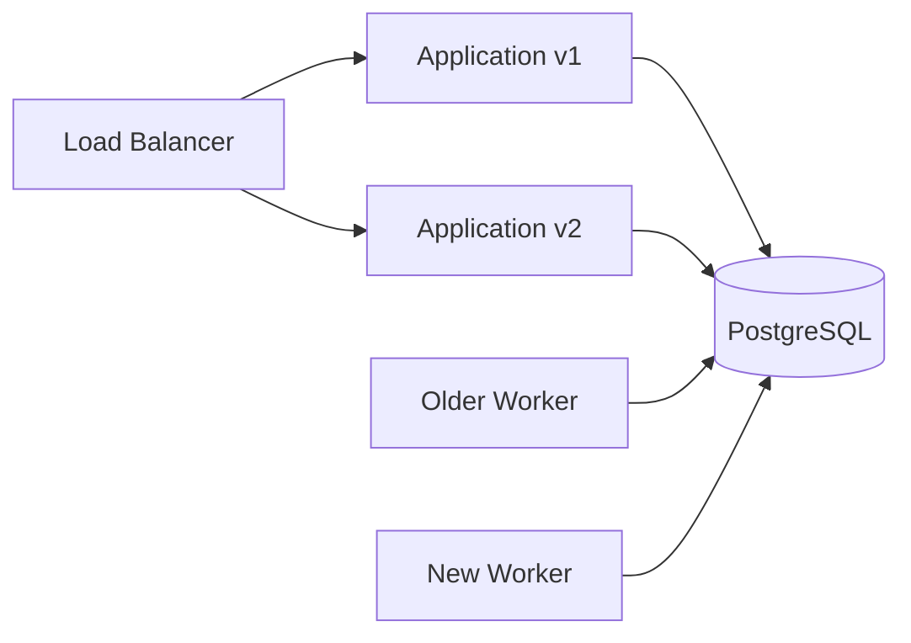
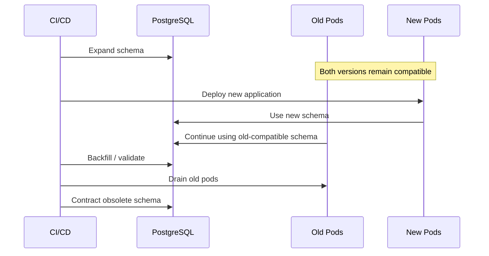

# 02- Schema Changes

## Overview

Schema changes modify the structure or database-level behavior of an existing database. In production systems, schema evolution is a deployment and compatibility problem, not simply a matter of executing `ALTER TABLE`.

Typical schema changes include:

- Adding or removing columns
- Adding or removing tables
- Adding indexes
- Adding or changing constraints
- Changing data types
- Renaming database objects
- Changing defaults
- Introducing partitioning
- Changing database functions or triggers
- Modifying permissions

The safest production approach is to evolve schemas incrementally:

```text
Current Schema
     │
     ▼
Expand
     │
     ▼
Deploy Compatible Application
     │
     ▼
Migrate / Backfill Data
     │
     ▼
Switch Application Behavior
     │
     ▼
Validate
     │
     ▼
Contract
```

The key principle is:

> **Do not require the application and database to change atomically unless the architecture genuinely supports atomic deployment.**

This matters particularly for Kubernetes rolling deployments, multiple application instances, Celery workers, microservices, read replicas, and blue/green deployments.

---

## Schema Changes and Application Compatibility

A database usually outlives a single application process. During deployment, different application versions can access the same database simultaneously.



Therefore, schema changes should normally support a compatibility window.

For example, directly renaming:

```sql
ALTER TABLE customers
RENAME COLUMN email TO contact_email;
```

can break:

- Old application instances
- Older Celery workers
- Reporting jobs
- Operational scripts
- Other services

A safer migration is:

```text
1. Add contact_email.
2. Deploy code that supports both columns.
3. Backfill contact_email.
4. Switch reads to contact_email.
5. Stop writing email.
6. Verify all consumers are migrated.
7. Remove email later.
```

This is the **expand-and-contract** pattern.

---

## Expand-and-Contract

### Expand

Introduce the new schema without removing the old schema.

```sql
ALTER TABLE customers
ADD COLUMN contact_email text;
```

The existing application should continue working.

### Migrate

Deploy application code that can understand both representations.

```text
Application
    │
    ├── Read new column when available
    ├── Maintain compatibility with old column
    └── Write compatible data
```

Backfill existing records separately when necessary.

### Contract

Once all consumers have migrated:

```sql
ALTER TABLE customers
DROP COLUMN email;
```

The contract phase should normally happen in a later deployment.

This separation reduces the blast radius of a failed deployment.

---

## Why Direct Schema Replacement Is Dangerous

A common but unsafe deployment looks like:

```text
1. Change database.
2. Deploy application.
```

During a rolling deployment:

```text
Database: New schema

Application v1 ──► expects old schema
Application v2 ──► expects new schema
```

The old instances can fail before they are replaced.

A safer deployment is:

```text
Database:
Old + New schema
        │
        ▼
Application:
Old-compatible + New-compatible
        │
        ▼
Data migration
        │
        ▼
Application:
New-only
        │
        ▼
Database:
New-only
```

---

## Types of Schema Changes

| Change | Typical risk | Preferred approach |
|---|---:|---|
| Add nullable column | Low | Add first, deploy usage later |
| Add table | Low | Deploy before application dependency |
| Add index | Medium | Assess workload and use concurrent creation when appropriate |
| Add nullable constraint | Medium | Validate existing data |
| Add `NOT NULL` | Medium/High | Backfill first, then enforce |
| Rename column | High | Expand-and-contract |
| Rename table | High | Compatibility layer or staged migration |
| Drop column | High | Remove consumers first |
| Change data type | Medium/High | Use compatible intermediate representation |
| Large data transformation | High | Batch and monitor |
| Drop table | Very high | Verify all consumers and retention requirements |
| Add foreign key to large table | Medium/High | Validate data and assess locking |
| Add partitioning | High | Plan migration and operational impact |

Risk depends on table size, workload, PostgreSQL version, indexes, constraints, replication, and deployment topology.

---

## Adding Columns

Adding a column is usually one of the safer schema changes.

```sql
ALTER TABLE customers
ADD COLUMN marketing_opt_in boolean;
```

The application can initially ignore it.

This allows:

```text
Migration
   ↓
Deploy application
   ↓
Start using column
```

### Nullable vs non-nullable

Adding:

```sql
marketing_opt_in boolean NOT NULL
```

requires an immediately valid value for existing rows.

A safer pattern is often:

```sql
ALTER TABLE customers
ADD COLUMN marketing_opt_in boolean;
```

Then:

```sql
UPDATE customers
SET marketing_opt_in = false
WHERE marketing_opt_in IS NULL;
```

After validating the data:

```sql
ALTER TABLE customers
ALTER COLUMN marketing_opt_in SET NOT NULL;
```

The exact safety characteristics depend on PostgreSQL version and table state, so high-volume production tables should be tested before enforcement.

---

## Adding Defaults

Defaults deserve careful consideration.

For example:

```sql
ALTER TABLE customers
ADD COLUMN active boolean NOT NULL DEFAULT true;
```

Modern PostgreSQL versions can optimize some constant-default column additions without physically rewriting the entire table, but deployment behavior still depends on the database version and operation.

For large production tables, verify the generated operation and expected lock behavior rather than assuming that every `ADD COLUMN` is cheap.

A safer engineering process is:

```text
Check PostgreSQL version
        ↓
Inspect migration SQL
        ↓
Test with production-scale data
        ↓
Evaluate lock duration
        ↓
Deploy
```

---

## Renaming Columns

Direct renames are dangerous because application code often contains many references.

```sql
ALTER TABLE customers
RENAME COLUMN email TO contact_email;
```

A safer migration:

```text
Schema:
email
contact_email

Application:
supports both

Data:
email → contact_email

Application:
uses contact_email

Schema:
remove email
```

For large systems, search for references across:

- Django models
- SQL queries
- ORM expressions
- Celery tasks
- Reporting queries
- ETL pipelines
- Kafka consumers
- Other microservices
- Operational scripts

Database metadata alone does not tell you every external dependency.

---

## Dropping Columns

Dropping a column is a destructive operation.

```sql
ALTER TABLE customers
DROP COLUMN email;
```

Before removal:

- Stop application reads
- Stop application writes
- Migrate background workers
- Update reporting systems
- Search code repositories
- Check scheduled jobs
- Check external consumers
- Verify dashboards and ETL
- Confirm retention requirements

A useful rule is:

> **Deprecation should precede deletion.**

Do not combine "stop using the column" and "delete the column" into one deployment unless you can prove there are no compatibility requirements.

---

## Adding `NOT NULL`

Adding a `NOT NULL` requirement to existing data is a two-stage problem:

```text
Existing data
     │
     ▼
Find invalid rows
     │
     ▼
Repair/backfill
     │
     ▼
Validate
     │
     ▼
Enforce NOT NULL
```

Find invalid records:

```sql
SELECT count(*)
FROM customers
WHERE contact_email IS NULL;
```

After successful backfill:

```sql
ALTER TABLE customers
ALTER COLUMN contact_email SET NOT NULL;
```

Do not assume that application validation alone is sufficient. Database constraints protect against:

- Bugs
- Race conditions
- Administrative scripts
- Other services
- Direct SQL access

---

## Adding Unique Constraints

A uniqueness requirement must account for existing duplicates.

Check first:

```sql
SELECT email, count(*)
FROM customers
GROUP BY email
HAVING count(*) > 1;
```

Only after duplicates are resolved should uniqueness be enforced.

For some large-table workflows, creating a unique index first and then attaching it as a constraint can provide more operational control.

Example:

```sql
CREATE UNIQUE INDEX CONCURRENTLY customers_email_unique_idx
ON customers (email);
```

Then, where appropriate:

```sql
ALTER TABLE customers
ADD CONSTRAINT customers_email_unique
UNIQUE USING INDEX customers_email_unique_idx;
```

The exact operational behavior should be tested before production execution.

---

## Adding Foreign Keys

A foreign key protects referential integrity:

```sql
ALTER TABLE orders
ADD CONSTRAINT orders_customer_fk
FOREIGN KEY (customer_id)
REFERENCES customers(id);
```

Before adding it:

```sql
SELECT count(*)
FROM orders o
LEFT JOIN customers c
    ON c.id = o.customer_id
WHERE c.id IS NULL;
```

Existing invalid rows must be handled before the constraint can be safely enforced.

On large PostgreSQL tables, consider separating constraint creation from validation when appropriate so that the expensive validation step can be scheduled deliberately.

---

## Index Changes

Indexes are schema objects and therefore part of deployment planning.

For large PostgreSQL tables:

```sql
CREATE INDEX CONCURRENTLY orders_customer_created_idx
ON orders (customer_id, created_at DESC);
```

`CREATE INDEX CONCURRENTLY` reduces blocking of normal writes, but it is not free.

It can:

- Take longer
- Consume additional resources
- Generate substantial I/O
- Affect replication
- Require special migration handling
- Fail and leave an index requiring cleanup

It also cannot run inside a transaction block.

Do not create an index merely because a query is slow. First inspect:

```sql
EXPLAIN (ANALYZE, BUFFERS)
SELECT id, created_at
FROM orders
WHERE customer_id = $1
ORDER BY created_at DESC
LIMIT 50;
```

---

## Data Type Changes

Changing a data type can range from trivial to highly disruptive.

Example:

```sql
ALTER TABLE customers
ALTER COLUMN external_id TYPE bigint
USING external_id::bigint;
```

Potential risks include:

- Table rewrites
- Long locks
- Conversion failures
- Increased WAL
- Replica lag
- Application incompatibility
- Index rebuilds
- Larger storage requirements

For high-risk type changes, prefer an intermediate migration:

```text
Old column
    │
    ▼
New compatible column
    │
    ▼
Backfill
    │
    ▼
Dual compatibility
    │
    ▼
Application switch
    │
    ▼
Remove old representation
```

---

## Table Renames

A table rename can break application and operational consumers immediately.

```sql
ALTER TABLE customer_orders
RENAME TO orders;
```

Before performing it, identify:

- ORM model references
- Raw SQL
- Views
- Functions
- Triggers
- ETL
- Reporting
- Other services
- Administrative scripts

For shared databases, table renames are effectively cross-team API changes.

---

## Schema Namespaces

PostgreSQL schemas provide namespaces inside a database.

```sql
CREATE SCHEMA reporting;
```

A production system may use:

```text
app.orders
app.customers

reporting.daily_sales
reporting.customer_metrics
```

Schema changes should specify ownership and permissions deliberately.

Avoid accidentally exposing newly created objects through broad privileges such as `PUBLIC`.

Remember that `ALTER DEFAULT PRIVILEGES` controls privileges for future objects created by the specified role; it does not retroactively modify existing objects.

---

## Schema Changes and Transactions

Transactional migrations can provide strong atomicity:

```sql
BEGIN;

ALTER TABLE customers
ADD COLUMN marketing_opt_in boolean;

COMMIT;
```

If the transaction fails, PostgreSQL can roll back transactional changes.

However, a transaction can also hold locks until commit.

A migration that runs for a long time can block application traffic.

Therefore, ask:

- Is the operation transactional?
- What locks are acquired?
- How long can the operation run?
- Can it wait for another transaction?
- What happens to replicas?
- How much WAL can it generate?

Not every database operation can run inside a transaction block. PostgreSQL's `CREATE INDEX CONCURRENTLY` is a notable example.

---

## Lock Safety

A migration may be computationally cheap but operationally dangerous because it waits for a lock.

```text
Migration
    │
    ▼
Waiting for lock
    │
    ▼
Migration connection occupied
    │
    ▼
Deployment blocked
    │
    ▼
Application rollout delayed
```

For production migrations, bounded lock waits are often preferable to indefinite waiting.

Example:

```sql
SET lock_timeout = '5s';
SET statement_timeout = '10min';
```

These have different meanings:

| Setting | Controls |
|---|---|
| `lock_timeout` | Time spent waiting to acquire a lock |
| `statement_timeout` | Total statement execution time |

If a statement fails inside an explicit transaction, the transaction may become aborted and require rollback or savepoint handling.

---

## Large Data Backfills

Schema changes often require data migration.

Example:

```sql
UPDATE customers
SET normalized_email = lower(email)
WHERE normalized_email IS NULL;
```

This may be acceptable for a small table but dangerous on hundreds of millions of rows.

Large backfills can cause:

- CPU pressure
- I/O pressure
- WAL growth
- Replica lag
- Lock contention
- Table bloat
- Autovacuum pressure

Prefer controlled batches.

```text
Batch 1
   ↓
Commit
   ↓
Batch 2
   ↓
Commit
   ↓
Batch 3
   ↓
...
```

Use stable pagination or primary-key ranges rather than repeatedly scanning the entire table.

Example:

```sql
UPDATE customers
SET normalized_email = lower(email)
WHERE id > $1
  AND id <= $2
  AND normalized_email IS NULL;
```

The migration should expose progress and support safe interruption.

---

## Idempotent Backfills

A migration should ideally tolerate retries.

This is safer:

```sql
UPDATE customers
SET normalized_email = lower(email)
WHERE id > $1
  AND id <= $2
  AND normalized_email IS NULL;
```

than a migration that assumes exactly-once execution.

Retries can occur because of:

- CI/CD failures
- Process termination
- Operator intervention
- Lock timeouts
- Network failures
- Deployment retries

Design data migrations so that rerunning completed work does not corrupt state.

---

## Migration Ordering

A schema deployment should follow dependency order.

For example:

```text
Add column
    ↓
Deploy compatible application
    ↓
Backfill
    ↓
Enable application behavior
    ↓
Validate
    ↓
Remove old dependency
```

Do not reverse this sequence:

```text
Remove old column
    ↓
Deploy application that still expects it
```

Migration dependencies should also be represented explicitly in tools such as Django migrations and Alembic.

---

## Django Schema Changes

Django migrations are source-controlled representations of schema evolution.

Example:

```python
from django.db import migrations, models


class Migration(migrations.Migration):
    dependencies = [
        ("customers", "0010_previous"),
    ]

    operations = [
        migrations.AddField(
            model_name="customer",
            name="marketing_opt_in",
            field=models.BooleanField(null=True),
        ),
    ]
```

Inspect the generated SQL:

```bash
python manage.py sqlmigrate customers 0011
```

Inspect migration state:

```bash
python manage.py showmigrations
```

Then apply migrations through the controlled deployment process:

```bash
python manage.py migrate
```

Do not assume a Django model change is operationally cheap because the Python diff is small.

---

## FastAPI and SQLAlchemy Schema Changes

FastAPI does not manage database migrations itself.

A common architecture is:

```text
FastAPI
   │
SQLAlchemy
   │
PostgreSQL

Alembic
   │
   └── Schema migrations
```

Typical commands include:

```bash
alembic current
alembic upgrade head
```

Inspect generated migration SQL before applying high-risk changes.

For large production changes, separate:

- Schema introduction
- Data backfill
- Application behavior change
- Schema cleanup

---

## Schema Changes in Kubernetes

Kubernetes rolling deployments make compatibility particularly important.



A dedicated migration Job is often preferable to having every application pod execute migrations during startup.

Example:

```yaml
apiVersion: batch/v1
kind: Job
metadata:
  name: database-migration
spec:
  template:
    spec:
      restartPolicy: Never
      containers:
        - name: migration
          image: example/backend:release
          command:
            - python
            - manage.py
            - migrate
```

The deployment controller should ensure that schema and application rollout ordering is intentional.

---

## Schema Changes and Read Replicas

Schema changes on the primary propagate through replication.

```text
Primary
   │
   ├── WAL ──► Replica 1
   └── WAL ──► Replica 2
```

Large changes can increase:

- WAL volume
- Replay time
- Replica lag
- Recovery time

Applications using replicas must also consider schema visibility.

During deployment:

```text
Primary:
new schema

Replica:
old schema state
```

The application should remain compatible during this transition.

Do not assume that all database nodes become structurally identical at exactly the same moment.

---

## Schema Changes and Connection Pools

Deployment temporarily increases database concurrency.

For example:

```text
Old application pools
        +
New application pools
        +
Migration job
        +
Celery workers
        ↓
PostgreSQL
```

If Kubernetes scales from 10 to 20 pods during rollout and each process maintains a pool, the database can see a significant temporary increase in connections.

Plan for:

- Pool sizes
- Worker connections
- Migration connections
- Deployment overlap
- PostgreSQL `max_connections`
- PgBouncer if used
- Database memory

Schema deployment is therefore connected to connection-capacity planning.

---

## Schema Changes and Caches

Schema changes may alter the meaning or serialization of cached data.

For example:

```text
Database representation changes
          │
          ▼
Old Redis entries remain
          │
          ▼
Application reads incompatible representation
```

Use:

- Versioned cache keys
- Controlled invalidation
- TTLs
- Backward-compatible serialization

Example:

```text
customer:v1:123
customer:v2:123
```

A schema deployment should consider Redis whenever cached data depends on the changed representation.

---

## Schema Changes and Kafka

Event schemas are another form of contract.

Suppose an event changes from:

```json
{
  "customer_id": "123",
  "email": "user@example.com"
}
```

to:

```json
{
  "customer_id": "123",
  "contact_email": "user@example.com"
}
```

Existing consumers may still require `email`.

Prefer additive evolution:

```json
{
  "customer_id": "123",
  "email": "user@example.com",
  "contact_email": "user@example.com"
}
```

Then migrate consumers before removing the old field.

The same compatibility principle applies to:

- PostgreSQL schemas
- REST APIs
- gRPC contracts
- Kafka events

---

## Schema Changes and Celery

Background workers frequently outlive web application deployments.

```text
Web v2 ──────► PostgreSQL
                 ▲
                 │
Worker v1 ───────┘
```

If Worker v1 still references an old column, removing that column can break asynchronous processing even if all web pods have been upgraded.

Before destructive schema changes, account for:

- Celery workers
- Scheduled tasks
- Retry queues
- Long-running jobs
- Operational scripts

Workers should be upgraded or drained before incompatible schema removal.

---

## Database Permissions During Schema Changes

Schema changes often require more privileges than normal application operation.

A useful separation is:

```text
Migration Role
    │
    ├── CREATE
    ├── ALTER
    ├── DROP
    └── Index/constraint operations

Runtime Role
    │
    ├── SELECT
    ├── INSERT
    ├── UPDATE
    └── DELETE
```

The runtime application role should generally not be a database owner or superuser.

Migration credentials should be:

- Stored in a secret manager
- Restricted to CI/CD or deployment systems
- Audited
- Rotated
- Least privileged where practical

---

## Schema Drift

Schema drift occurs when environments no longer have the expected structure.

```text
Development schema
        ≠
Staging schema
        ≠
Production schema
```

Causes include:

- Manual production changes
- Missing migrations
- Different migration histories
- Failed deployments
- Environment-specific scripts

Reduce drift by:

- Version controlling migrations
- Running migrations through CI/CD
- Restricting production DDL
- Auditing schema changes
- Regularly comparing expected and actual schema state

Avoid treating production as a database that engineers manually edit.

---

## Deployment Validation

Validate schema changes at multiple levels.

### Schema

Check:

- Columns
- Tables
- Indexes
- Constraints
- Functions
- Permissions

### Data

Check:

- Null counts
- Duplicate counts
- Referential integrity
- Backfill completeness
- Expected row counts

### Application

Check:

- API error rates
- Latency
- Critical workflows
- Background jobs
- Cache behavior

### Database

Check:

- CPU
- Memory
- I/O
- Connections
- Locks
- WAL
- Replica lag

A successful migration command is not equivalent to a successful production deployment.

---

## Rollback and Roll-Forward

Database rollback is fundamentally different from application rollback.

Suppose:

```text
Schema A
   ↓
Schema B
```

If Schema B introduces persisted data that Schema A cannot understand, reverting the application does not necessarily restore database compatibility.

Therefore, prefer:

```text
Backward-compatible migration
        ↓
Application deployment
        ↓
Detect problem
        ↓
Application rollback if safe
        ↓
Keep compatible database schema
        ↓
Fix forward
```

For destructive changes, recovery may require:

- Compensating migrations
- Data reconstruction
- Backup restoration
- Point-in-time recovery

Do not design a migration assuming `down` or `reverse` automatically means "safe production rollback."

---

## Schema Change Observability

Track migration-specific metrics.

| Metric | Why it matters |
|---|---|
| Migration duration | Detect unexpected execution time |
| Lock wait time | Detect blocking |
| Database CPU | Detect workload pressure |
| Database I/O | Detect resource saturation |
| WAL generation | Detect replication/recovery impact |
| Replica lag | Detect replication degradation |
| Connection count | Detect deployment pressure |
| Query latency | Detect application impact |
| Error rate | Detect compatibility failures |

Useful PostgreSQL diagnostics include:

```sql
SELECT pid,
       usename,
       state,
       wait_event_type,
       wait_event,
       query_start,
       query
FROM pg_stat_activity
WHERE state <> 'idle';
```

For replication:

```sql
SELECT *
FROM pg_stat_replication;
```

For query workload analysis, `pg_stat_statements` can help compare query behavior before and after deployment.

---

## Production Schema Change Workflow

A practical production workflow is:

```text
Design
  ↓
Identify consumers
  ↓
Classify risk
  ↓
Generate migration
  ↓
Inspect SQL
  ↓
Test with representative data
  ↓
Evaluate locks and duration
  ↓
Verify backups/recovery
  ↓
Deploy expansion
  ↓
Deploy compatible application
  ↓
Backfill / migrate data
  ↓
Validate
  ↓
Monitor
  ↓
Contract later
```

For high-risk changes, document:

- Expected duration
- Lock requirements
- Abort conditions
- Monitoring queries
- Roll-forward strategy
- Recovery procedure
- Owner
- Maintenance window if required

---

## Common Mistakes

### Combining Rename and Application Migration

Changing the database name and application references simultaneously creates unnecessary coupling.

**Better:** introduce compatibility first.

### Dropping Columns Too Early

Old pods and workers may still reference them.

**Better:** remove consumers first, then delete the object later.

### Running Large Backfills as One Transaction

This can generate excessive WAL, lock pressure, and recovery cost.

**Better:** batch the work and monitor progress.

### Assuming ORM Migrations Are Automatically Safe

Django or Alembic generates database operations; PostgreSQL still determines their runtime behavior.

**Better:** inspect generated SQL and understand database-level effects.

### Ignoring Replicas

A migration may succeed on the primary while replicas experience significant lag.

**Better:** monitor replication during high-volume changes.

### Ignoring Background Workers

Celery tasks may continue running old application code.

**Better:** include workers in schema compatibility analysis.

### Using Runtime Credentials for DDL

A compromised application could gain schema-modification capabilities.

**Better:** separate migration and runtime roles.

### Assuming Rollback Means Data Recovery

A reverse migration cannot reconstruct data that was permanently deleted or transformed.

**Better:** maintain backups and design recoverable forward migrations.

---

## Senior Engineering Checklist

Before approving a production schema change, ask:

### Compatibility

- Can old and new application versions coexist?
- Can old and new worker versions coexist?
- Are external services affected?
- Are Kafka consumers affected?

### Database

- What locks are required?
- How large is the affected table?
- Could PostgreSQL rewrite the table?
- Could indexes be rebuilt?
- How much WAL could be generated?

### Performance

- What CPU and I/O load is expected?
- Could queries become slower?
- Could execution plans change?
- Could connection pools become saturated?

### Replication

- Could replicas fall behind?
- Are replication slots at risk of retaining excessive WAL?
- Does the application depend on replica schema visibility?

### Recovery

- Is the operation reversible?
- Is a compensating migration available?
- Are backups healthy?
- Has recovery been tested?

### Operations

- What is the abort threshold?
- Who monitors the deployment?
- How is progress measured?
- What happens if the migration fails halfway through?

These questions distinguish production-grade schema management from simply writing valid SQL.

---

## Key Takeaways

- **Schema changes are deployment contracts:** design them so old and new application versions can coexist during rolling deployments.
- **Prefer expand-and-contract for risky changes:** introduce new structures, migrate application behavior and data, then remove obsolete structures separately.
- **Treat large schema and data changes as production workloads:** evaluate locks, table size, WAL, replication, CPU, I/O, and connection pressure before deployment.
- **Application rollback is not database rollback:** destructive or data-changing migrations often require compensating changes, backups, or point-in-time recovery.
- **Schema compatibility includes the entire backend:** account for Django/FastAPI applications, Celery workers, Kafka consumers, Redis caches, replicas, CI/CD, and operational tooling.