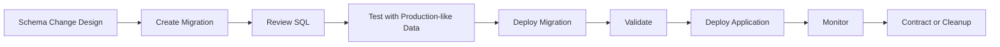
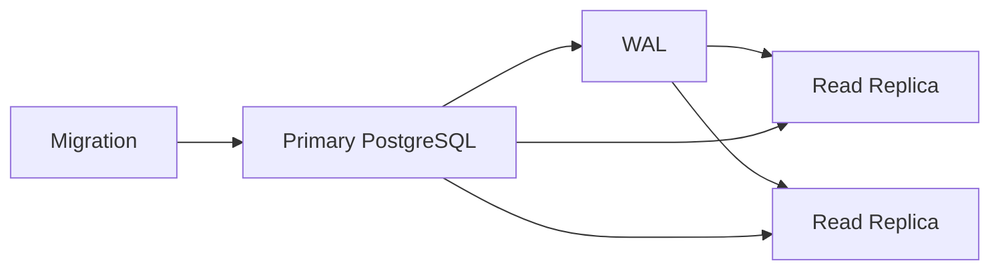
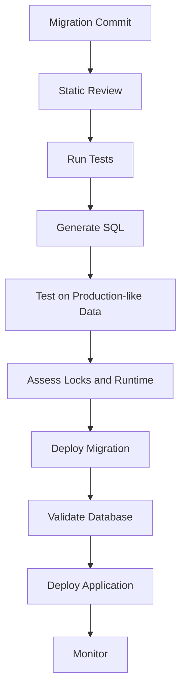

# 03- Database Migrations

## Overview

Database migrations are version-controlled changes to a database schema and, when necessary, its data. They provide a repeatable mechanism for evolving production databases alongside application code.

A migration can introduce:

- Tables and columns
- Indexes
- Constraints
- Foreign keys
- Defaults
- Database functions and triggers
- Permissions
- Data transformations
- Partitioning structures

The important production distinction is:

> **A migration is not just SQL execution; it is a controlled change to a stateful system that must remain compatible with running application versions.**

This becomes especially important with:

- Django and Alembic
- Kubernetes rolling deployments
- Multiple application replicas
- Celery workers
- Microservices
- Read replicas
- CI/CD pipelines
- Large PostgreSQL tables
- High-availability databases

A robust migration strategy therefore considers schema compatibility, locking, transaction behavior, data volume, replication, rollback, observability, and recovery.

---

## Migration Lifecycle

A production migration normally moves through several stages:



For more complex changes, application and database changes should be separated:

```text
Expand
  ↓
Compatible Application
  ↓
Data Migration / Backfill
  ↓
Application Switch
  ↓
Validation
  ↓
Contract
```

This is the **expand-and-contract** pattern.

---

## Why Migrations Exist

Without migrations, schema changes tend to become manual operational procedures:

```text
Engineer → production database → manual SQL
```

This creates problems:

- Changes are difficult to reproduce
- Environments drift
- Deployment history becomes unclear
- Rollbacks become unpredictable
- CI/CD cannot reliably manage schema state
- Multiple engineers can make conflicting changes

With migrations:

```text
Git
 │
 ├── Migration 001
 ├── Migration 002
 ├── Migration 003
 └── Migration 004
       │
       ▼
   PostgreSQL
```

The migration history becomes part of the application's deployable state.

---

## Migration State vs Database State

Migration systems generally maintain two related concepts:

| Concept | Meaning |
|---|---|
| Migration file | Version-controlled description of a change |
| Migration history | Which migrations have been applied |
| Database schema | Actual physical database state |
| Application model | Expected schema representation in application code |

These can diverge.

For example:

```text
Migration history says:
001, 002, 003 applied

Actual database:
001, 002 applied
```

This can happen after:

- Manual changes
- Failed deployments
- Restored databases
- Incorrect migration metadata
- Environment drift

Never assume migration metadata alone proves that the database has the expected structure.

---

## Migration Tools

Common Python ecosystems use different migration systems.

| Stack | Migration system |
|---|---|
| Django | Django migrations |
| FastAPI + SQLAlchemy | Alembic |
| Raw PostgreSQL | SQL scripts / migration framework |
| CI/CD | Migration command executed as deployment step |

The migration tool provides versioning and dependency management, but PostgreSQL still determines the runtime behavior.

A migration generated by an ORM can still:

- Acquire locks
- Rewrite a table
- Generate WAL
- Consume CPU
- Cause replica lag
- Block application traffic

---

## Django Migrations

Django represents schema changes through migration files.

Example:

```python
from django.db import migrations, models


class Migration(migrations.Migration):
    dependencies = [
        ("customers", "0010_previous"),
    ]

    operations = [
        migrations.AddField(
            model_name="customer",
            name="marketing_opt_in",
            field=models.BooleanField(null=True),
        ),
    ]
```

Inspect migration state:

```bash
python manage.py showmigrations
```

Inspect generated SQL:

```bash
python manage.py sqlmigrate customers 0011
```

Apply migrations:

```bash
python manage.py migrate
```

The important production practice is to **inspect the generated SQL for non-trivial migrations**.

---

## Alembic Migrations

A FastAPI application commonly uses SQLAlchemy with Alembic:

```text
FastAPI
   │
SQLAlchemy
   │
PostgreSQL

Alembic
   │
   └── Schema versioning
```

Typical commands:

```bash
alembic current
alembic history
alembic upgrade head
```

An Alembic migration might contain:

```python
from alembic import op
import sqlalchemy as sa


def upgrade() -> None:
    op.add_column(
        "customers",
        sa.Column("marketing_opt_in", sa.Boolean(), nullable=True),
    )


def downgrade() -> None:
    op.drop_column("customers", "marketing_opt_in")
```

A generated migration should be reviewed rather than blindly trusted.

---

## Migration Types

Not all migrations have the same operational risk.

| Migration | Typical risk |
|---|---:|
| Add nullable column | Low |
| Add small table | Low |
| Add index | Medium |
| Add constraint | Medium |
| Add `NOT NULL` | Medium |
| Add foreign key | Medium/High |
| Large backfill | High |
| Rename column | High |
| Rename table | High |
| Change large-column type | High |
| Drop column | High |
| Drop table | Very high |

Risk depends on:

- Table size
- Number of indexes
- Traffic
- Lock requirements
- PostgreSQL version
- Replication topology
- Query workload
- Data volume
- Deployment strategy

---

## Transactional Migrations

PostgreSQL supports transactional DDL for many operations.

```sql
BEGIN;

ALTER TABLE customers
ADD COLUMN marketing_opt_in boolean;

COMMIT;
```

If an operation fails before commit, transactional changes can generally be rolled back.

This provides strong safety, but transactions can also hold locks until commit.

A migration that waits on a lock can therefore become a deployment incident.

Some PostgreSQL operations have special restrictions. For example:

```sql
CREATE INDEX CONCURRENTLY ...
```

cannot run inside a transaction block.

Migration frameworks must therefore support operations that require non-transactional execution.

---

## Migration Locking

A migration may be logically simple but operationally expensive.

For example:

```sql
ALTER TABLE customers
ADD COLUMN status text;
```

may need a table-level lock.

If another transaction holds a conflicting lock:

```text
Migration
   │
   ▼
Waiting for lock
   │
   ▼
Migration connection blocked
   │
   ▼
Deployment blocked
```

Use controlled timeouts where appropriate:

```sql
SET lock_timeout = '5s';
SET statement_timeout = '10min';
```

These settings serve different purposes:

| Setting | Purpose |
|---|---|
| `lock_timeout` | Limits time spent waiting for locks |
| `statement_timeout` | Limits total statement execution time |

A failed statement inside an explicit transaction can abort the transaction, so migration tooling must handle failure and rollback correctly.

---

## Expand-and-Contract Migrations

Expand-and-contract is the safest general pattern for incompatible schema changes.

Suppose:

```text
email
```

must become:

```text
contact_email
```

Do not immediately rename the column.

### Expand

```sql
ALTER TABLE customers
ADD COLUMN contact_email text;
```

### Deploy Compatible Application

The application temporarily supports both representations.

```text
Application
    │
    ├── Reads contact_email
    ├── Supports email during transition
    └── Writes compatible data
```

### Backfill

```sql
UPDATE customers
SET contact_email = email
WHERE contact_email IS NULL;
```

For large tables, perform this in batches.

### Switch

Deploy application code that uses `contact_email` exclusively.

### Contract

Only after all consumers have migrated:

```sql
ALTER TABLE customers
DROP COLUMN email;
```

This allows old and new application instances to coexist safely during deployment.

---

## Adding Columns

Adding a nullable column is usually one of the safest schema changes:

```sql
ALTER TABLE customers
ADD COLUMN marketing_opt_in boolean;
```

The application does not need to use it immediately.

For a required column, use staged enforcement.

```text
Add nullable column
       ↓
Deploy application
       ↓
Populate existing data
       ↓
Validate
       ↓
Add NOT NULL
```

Check existing data:

```sql
SELECT count(*)
FROM customers
WHERE marketing_opt_in IS NULL;
```

Then enforce the invariant when appropriate:

```sql
ALTER TABLE customers
ALTER COLUMN marketing_opt_in SET NOT NULL;
```

---

## Defaults

Defaults can have different operational characteristics depending on PostgreSQL version and the specific expression.

For example:

```sql
ALTER TABLE customers
ADD COLUMN active boolean NOT NULL DEFAULT true;
```

Modern PostgreSQL versions can optimize certain constant defaults without rewriting every existing row, but this should not be generalized to arbitrary defaults.

For production systems:

- Know the PostgreSQL version
- Inspect generated SQL
- Test on production-sized data
- Understand lock requirements
- Monitor execution

Avoid assuming that every `ALTER TABLE` is cheap.

---

## Adding Indexes

Indexes are schema changes and can affect production workloads.

For large PostgreSQL tables:

```sql
CREATE INDEX CONCURRENTLY orders_customer_created_idx
ON orders (customer_id, created_at DESC);
```

`CREATE INDEX CONCURRENTLY` is useful when reducing blocking of normal writes is important.

Trade-offs include:

- Longer execution time
- Additional I/O
- More resource consumption
- More complex failure handling
- Replication impact
- Inability to execute inside a transaction block

After creating an index, validate its usefulness through query plans and workload metrics.

Do not add indexes simply because a query is slow.

---

## Adding Constraints

Constraints enforce database-level invariants.

Examples:

```sql
ALTER TABLE customers
ADD CONSTRAINT customers_email_unique
UNIQUE (email);
```

or:

```sql
ALTER TABLE orders
ADD CONSTRAINT orders_customer_fk
FOREIGN KEY (customer_id)
REFERENCES customers(id);
```

Before adding a constraint, inspect existing data.

For uniqueness:

```sql
SELECT email, count(*)
FROM customers
GROUP BY email
HAVING count(*) > 1;
```

For foreign-key violations:

```sql
SELECT count(*)
FROM orders o
LEFT JOIN customers c
    ON c.id = o.customer_id
WHERE c.id IS NULL;
```

A constraint should not be the first time invalid production data is discovered.

---

## Adding `NOT NULL`

A `NOT NULL` constraint is a data-quality invariant.

The safe workflow is:

```text
Find NULL values
       ↓
Repair / backfill
       ↓
Prevent new NULL values
       ↓
Validate
       ↓
Enforce NOT NULL
```

The application should start writing valid values before the database constraint is enforced.

This avoids a race where the backfill succeeds but new invalid rows continue to appear.

---

## Data Migrations

A schema migration changes database structure.

A **data migration** changes stored data.

Example:

```sql
UPDATE customers
SET normalized_email = lower(email)
WHERE normalized_email IS NULL;
```

Data migrations are often more operationally dangerous because they may touch millions or billions of rows.

Potential effects:

- CPU consumption
- I/O consumption
- WAL generation
- Replica lag
- Row locks
- Table bloat
- Autovacuum pressure
- Longer recovery time

Treat large data migrations as production workloads.

---

## Batched Backfills

Avoid:

```sql
UPDATE customers
SET normalized_email = lower(email);
```

on a very large table unless the workload and operational characteristics have been proven safe.

Prefer bounded batches.

```sql
UPDATE customers
SET normalized_email = lower(email)
WHERE id > $1
  AND id <= $2
  AND normalized_email IS NULL;
```

The worker can then:

```text
Select range
   ↓
Update
   ↓
Commit
   ↓
Record progress
   ↓
Next range
```

Advantages:

- Smaller transactions
- Lower lock duration
- Easier interruption
- Better progress visibility
- Reduced recovery impact

The trade-off is more application logic and potentially longer total migration time.

---

## Idempotent Data Migrations

Migration work should ideally be safe to retry.

Prefer:

```sql
UPDATE customers
SET normalized_email = lower(email)
WHERE normalized_email IS NULL;
```

over logic that assumes the migration executes exactly once.

Idempotency matters because migrations can fail due to:

- Lock timeouts
- Process termination
- Deployment interruption
- Database failover
- Network failures
- Resource exhaustion

A restart should continue safely rather than corrupting data.

---

## Long-Running Transactions

Large migrations should not unnecessarily hold one transaction for hours.

Long transactions can cause:

- Old row versions to remain visible
- Table bloat
- Vacuum limitations
- Increased storage
- Lock retention
- Replica replay problems
- Long recovery time

Prefer short transaction boundaries for large backfills.

However, batching changes transactional semantics. If the migration must be all-or-nothing, batching may not provide equivalent semantics.

Choose the transaction model based on the invariant being maintained.

---

## Migration and MVCC

PostgreSQL uses MVCC, so updates generally create new row versions.

A large update can therefore produce substantial dead tuples.

```text
Large UPDATE
     │
     ▼
New row versions
     │
     ▼
Dead old versions
     │
     ▼
Vacuum / cleanup
```

After a substantial data migration, monitor:

- Dead tuples
- Table size
- Autovacuum activity
- Query latency
- Disk usage

Large migrations and vacuum behavior should be planned together.

---

## Migration and Replication

PostgreSQL replication transfers WAL from the primary.



Large schema or data migrations can increase WAL generation and replica lag.

Monitor:

- WAL generation
- Replica replay lag
- Replication slot retention
- Replica disk usage
- Recovery conflicts
- Application read latency

A migration that completes successfully on the primary can still degrade the overall system.

---

## Migration and Connection Pools

A deployment can temporarily increase database connections.

```text
Existing Pods
     │
     ├── Connection pools
     │
New Pods
     │
     ├── Connection pools
     │
Migration Job
     │
Celery Workers
     │
     ▼
PostgreSQL
```

Consider the combined connection budget across:

- Kubernetes replicas
- Application processes
- Celery workers
- Migration jobs
- Admin tools
- PgBouncer
- Read-replica pools

Do not size migration infrastructure independently from application database capacity.

---

## Migration and Celery

Background workers are often overlooked.

During deployment:

```text
Web v2 ──────► PostgreSQL
                 ▲
                 │
Worker v1 ───────┘
```

Worker v1 may still execute queries against the old schema.

Before destructive changes:

- Drain or upgrade workers
- Consider retry queues
- Account for long-running tasks
- Check scheduled tasks
- Check delayed jobs

A database column cannot safely be removed merely because all web pods have been upgraded.

---

## Migration and Kafka

Kafka consumers create another compatibility boundary.

If an event evolves:

```json
{
  "customer_id": "123",
  "email": "user@example.com"
}
```

avoid immediately replacing `email` with:

```json
{
  "customer_id": "123",
  "contact_email": "user@example.com"
}
```

Prefer additive evolution:

```json
{
  "customer_id": "123",
  "email": "user@example.com",
  "contact_email": "user@example.com"
}
```

Then:

```text
Producer
   ↓
Compatible event
   ↓
Consumers migrate
   ↓
Old field removed later
```

Database schema migrations and event schema evolution should follow the same compatibility principle.

---

## Migration and Redis

Redis may contain representations derived from the database schema.

A schema migration can therefore invalidate cached data.

Use:

- Versioned cache keys
- Controlled invalidation
- TTLs
- Backward-compatible serialization

Example:

```text
customer:v1:123
customer:v2:123
```

Avoid assuming that changing PostgreSQL automatically updates existing Redis entries.

---

## Schema Drift

Schema drift occurs when environments differ unexpectedly.

```text
Development
     ≠
Staging
     ≠
Production
```

Common causes:

- Manual DDL
- Missing migrations
- Different migration histories
- Failed deployments
- Environment-specific scripts
- Restored database snapshots

Reduce drift by:

- Version controlling migrations
- Restricting production DDL
- Running migrations through CI/CD
- Reviewing migration history
- Auditing manual changes
- Recreating environments from known versions

---

## Migration Deployment Strategies

### Application-Startup Migrations

```text
Application starts
      ↓
Run migrations
      ↓
Start serving
```

Simple, but dangerous with multiple replicas because many instances may attempt migrations concurrently.

### Dedicated Migration Job

```text
CI/CD
  ↓
Migration Job
  ↓
Validate
  ↓
Application Deployment
```

This gives clearer control and observability.

### Separate Migration Pipeline

```text
Build
 ↓
Test
 ↓
Migration approval
 ↓
Production migration
 ↓
Application rollout
```

Useful for organizations requiring explicit database change controls.

For Kubernetes, a dedicated migration Job or deployment step is generally easier to reason about than having every application pod mutate the database at startup.

---

## Migration Rollback

Application rollback and database rollback are different problems.

Suppose:

```text
Schema A
   ↓
Schema B
```

and Schema B stores information that Schema A cannot understand.

Rolling the application back to v1 does not necessarily make the database compatible again.

Prefer:

```text
Backward-compatible schema
        ↓
Application deployment
        ↓
Observe
        ↓
Rollback application if safe
        ↓
Fix forward
```

For destructive migrations, recovery may require:

- Compensating migrations
- Restoring data
- Point-in-time recovery
- Backup restoration

Do not assume every migration should have a production-safe reverse operation.

---

## Migration Safety in CI/CD

A production migration pipeline should validate more than syntax.



Useful CI checks include:

- Migration graph consistency
- Migration application from a clean database
- Migration application from the latest production-like state
- SQL inspection for risky operations
- Application compatibility tests
- Data migration tests
- Roll-forward tests

---

## Migration Testing

Test at realistic scale.

A migration that takes:

```text
2 seconds on development
```

may take:

```text
45 minutes on production
```

because production has:

- More rows
- More indexes
- More concurrent transactions
- More replicas
- More background workers
- More disk activity

For important migrations, test:

- Runtime
- Lock acquisition
- WAL generation
- Replica behavior
- Disk consumption
- Query performance
- Application compatibility

Production-like data volume matters more than a perfect staging environment with only a few thousand rows.

---

## Observability

Monitor migrations as production workloads.

| Signal | Why it matters |
|---|---|
| Migration duration | Detect unexpected execution |
| Lock waits | Detect blocking |
| CPU | Detect resource pressure |
| I/O | Detect storage pressure |
| WAL generation | Detect replication/recovery impact |
| Replica lag | Detect read-path degradation |
| Connections | Detect pool pressure |
| Error rate | Detect application incompatibility |
| Disk usage | Detect capacity risk |
| Query latency | Detect application impact |

Useful PostgreSQL diagnostics:

```sql
SELECT pid,
       usename,
       state,
       wait_event_type,
       wait_event,
       query_start,
       query
FROM pg_stat_activity
WHERE state <> 'idle';
```

Inspect locks:

```sql
SELECT *
FROM pg_locks;
```

Inspect replication:

```sql
SELECT *
FROM pg_stat_replication;
```

Use `pg_stat_statements` to compare query workload before and after significant migrations.

---

## Migration Progress Tracking

Large data migrations should expose progress.

Useful progress information includes:

```text
Rows processed
Rows remaining
Current primary-key range
Start time
Rows/second
Estimated completion
Last successful batch
Last error
```

This enables:

- Safe restart
- Operational visibility
- Incident response
- Capacity planning

A migration without progress information becomes difficult to operate when it runs longer than expected.

---

## Schema Validation

After a migration, validate the database itself.

Check:

```sql
\d customers
```

and inspect indexes:

```sql
\d+ customers
```

Verify constraints and indexes through PostgreSQL catalogs or information-schema views when automated validation is required.

For data changes:

```sql
SELECT count(*)
FROM customers
WHERE normalized_email IS NULL;
```

The migration command succeeding only proves that the command completed. It does not prove that the intended business state was achieved.

---

## Security Considerations

Migration credentials are highly privileged and should be treated differently from runtime credentials.

Recommended separation:

```text
Runtime Role
    ├── SELECT
    ├── INSERT
    ├── UPDATE
    └── DELETE

Migration Role
    ├── ALTER
    ├── CREATE
    ├── DROP
    └── Index/constraint operations
```

Migration credentials should:

- Be stored in a secret manager
- Be unavailable to normal application processes
- Be restricted to deployment infrastructure
- Be audited
- Be rotated
- Follow least privilege where practical

Avoid embedding production database credentials in:

- Git
- Docker images
- Application source
- CI logs
- Migration files

---

## High Availability and Disaster Recovery

Migration planning should account for database failure.

Before high-risk changes:

- Verify recent backups
- Verify WAL archiving where applicable
- Confirm replica health
- Understand failover behavior
- Know the recovery procedure
- Define abort criteria

For destructive changes, backups are especially important because application rollback may not recover deleted data.

Point-in-time recovery can provide a recovery path when a schema or data operation causes an unexpected destructive outcome, but restoring to a point in time is an operational recovery procedure rather than an ordinary migration rollback.

---

## Large Table Migration Strategy

For a large production table:

```text
Design change
     ↓
Add new structure
     ↓
Deploy compatible code
     ↓
Backfill in bounded batches
     ↓
Monitor CPU / I/O / WAL / locks
     ↓
Monitor replicas
     ↓
Validate data
     ↓
Switch application behavior
     ↓
Remove old structure later
```

This strategy minimizes the amount of work performed during a single deployment event.

---

## Common Migration Mistakes

### Running Destructive Changes Immediately

```sql
DROP COLUMN email;
```

may break old pods and workers.

**Better:** remove consumers first and contract later.

### Trusting Generated Migrations

ORM-generated migrations can still produce expensive SQL.

**Better:** inspect the database operation.

### Running Huge Backfills in One Transaction

This can generate excessive WAL and hold resources for too long.

**Better:** batch when the business invariant permits it.

### Ignoring Lock Behavior

A migration can block production traffic while waiting for a lock.

**Better:** evaluate lock acquisition and use bounded timeouts when appropriate.

### Assuming Rollback Is Always Safe

A reverse migration cannot necessarily restore deleted or transformed data.

**Better:** design explicit recovery and roll-forward strategies.

### Ignoring Workers

Celery workers may still run old code.

**Better:** treat workers as migration consumers.

### Ignoring Replicas

A migration can complete on the primary while replicas fall significantly behind.

**Better:** monitor replication continuously.

### Allowing Application Pods to Race on Migrations

Multiple pods starting simultaneously may all attempt migration work.

**Better:** use a controlled migration job or deployment stage.

### Manually Editing Production

Manual DDL creates migration drift.

**Better:** version and review schema changes.

### Treating Development Scale as Production Scale

A migration that is harmless on a small local database may be dangerous on a multi-terabyte production system.

**Better:** benchmark important operations using production-like scale.

---

## Production Migration Checklist

### Before Deployment

- [ ] Migration reviewed
- [ ] Generated SQL inspected
- [ ] Migration tested on production-like data
- [ ] Table sizes checked
- [ ] Lock requirements understood
- [ ] Expected runtime estimated
- [ ] WAL impact considered
- [ ] Replica impact considered
- [ ] Connection impact considered
- [ ] Application compatibility verified
- [ ] Celery workers considered
- [ ] Kafka consumers considered
- [ ] Redis compatibility considered
- [ ] Backup/recovery status verified

### During Deployment

- [ ] Migration progress monitored
- [ ] Lock waits monitored
- [ ] CPU monitored
- [ ] I/O monitored
- [ ] WAL monitored
- [ ] Replica lag monitored
- [ ] Application latency monitored
- [ ] Error rate monitored
- [ ] Disk capacity monitored

### After Deployment

- [ ] Schema validated
- [ ] Data validated
- [ ] Constraints validated
- [ ] Indexes validated
- [ ] Application behavior validated
- [ ] Worker behavior validated
- [ ] Replica health confirmed
- [ ] Migration recorded successfully
- [ ] Temporary compatibility code tracked for later removal

---

## Interview Traps

### "Can you roll back a database migration?"

Not necessarily.

A migration can be technically reversible while still being unsafe because data may have been deleted or transformed.

### "Why use expand-and-contract?"

Because application deployments are often non-atomic. Old and new application versions can coexist.

### "Why can a migration block production?"

DDL can require locks, and locks can wait behind long-running transactions.

### "Why are large backfills dangerous?"

They can create heavy I/O, CPU, WAL, lock, bloat, and replication pressure.

### "Why inspect ORM-generated migration SQL?"

Because the ORM describes intent while the database determines the actual execution cost and locking behavior.

### "Why doesn't application rollback automatically solve schema rollback?"

Because the database contains persistent state that may no longer be compatible with the old application version.

---

## Senior-Level Migration Design Principles

A senior engineer should evaluate a migration across multiple dimensions:

```text
Correctness
    +
Compatibility
    +
Locking
    +
Performance
    +
Replication
    +
Recovery
    +
Security
    +
Observability
    +
Operational Complexity
```

A technically valid SQL statement can still be an unacceptable production migration.

The right question is not:

> "Will this SQL execute?"

It is:

> "Can this change safely evolve a live distributed system while preserving correctness and recoverability?"

---

## Key Takeaways

- **Database migrations are production deployment mechanisms:** schema changes must account for application compatibility, locks, replication, workload, and recovery.
- **Use expand-and-contract for incompatible changes:** introduce new structures first, migrate consumers and data, then remove obsolete structures.
- **Treat large data migrations as workloads:** batch when appropriate and monitor CPU, I/O, WAL, locks, bloat, disk usage, and replica lag.
- **Application rollback does not guarantee database rollback:** destructive or data-changing migrations often require compensating changes, backups, or point-in-time recovery.
- **Review the actual database operation:** ORM migration files describe intent, but PostgreSQL locking, transaction, storage, and execution behavior determine production risk.