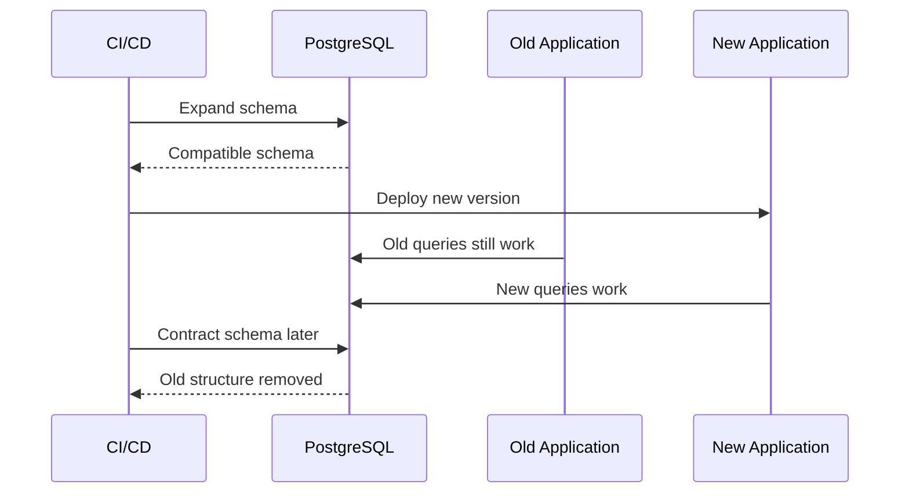
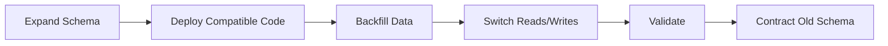
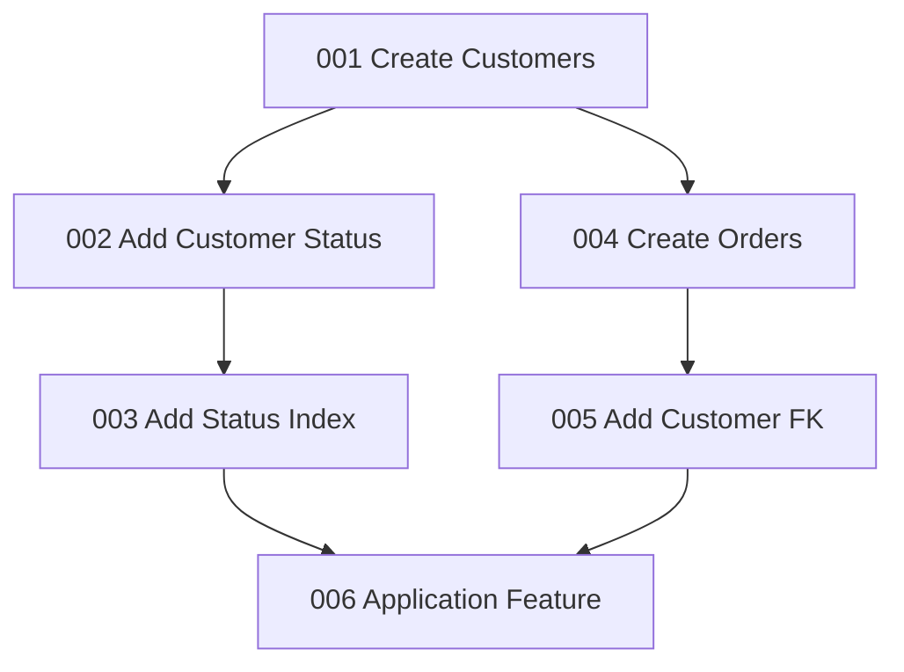
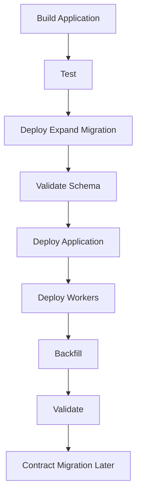

# 04- Migration Ordering

## Overview

Migration ordering is the discipline of applying database schema and data changes in a sequence that preserves correctness, compatibility, and deployability.

In a production backend, database changes rarely happen in isolation. Multiple application instances, Celery workers, scheduled jobs, microservices, read replicas, and Kafka consumers may run different versions of code during a deployment.

The central rule is:

> **Order database changes so every intermediate database state remains valid for every application version that can access it.**

A migration framework such as Django migrations or Alembic provides dependency ordering between migration files, but that is only one layer of ordering. Production ordering also includes:

- Application deployment order
- Data backfill order
- Worker rollout order
- Event consumer compatibility
- Index and constraint creation
- Cleanup and destructive operations
- Rollback and recovery strategy

---

## Why Migration Ordering Matters

Consider a running production system:

```text
                    ┌── Application v1
Load Balancer ──────┼── Application v2
                    ├── Celery Worker v1
                    └── Celery Worker v2
                              │
                              ▼
                         PostgreSQL
```

During a rolling deployment, these versions can coexist.

If v2 expects a new column that does not exist yet, requests fail.

If the database removes a column while v1 is still running, requests can also fail.

Therefore, safe deployment requires compatibility across intermediate states.



---

## Migration Ordering vs Migration Dependencies

Migration frameworks maintain an explicit dependency graph.

For example:

```text
001_create_customer
        │
        ▼
002_add_status
        │
        ▼
003_add_status_index
```

Migration `003` cannot safely execute before `002`.

Django records this through the `dependencies` field:

```python
class Migration(migrations.Migration):
    dependencies = [
        ("customers", "0002_add_status"),
    ]
```

Alembic uses revision identifiers:

```python
revision = "003_add_status_index"
down_revision = "002_add_status"
```

The migration framework therefore determines **schema dependency order**.

It does not automatically determine whether the application deployment order is safe.

---

## Types of Ordering

A production migration can have several independent ordering dimensions.

| Ordering | Question |
|---|---|
| Schema | Which database object must exist first? |
| Data | Which data must be populated before another operation? |
| Application | Which application version must deploy first? |
| Worker | Which Celery worker version can process existing jobs? |
| Event | Which Kafka consumers/producers support the new schema? |
| Index | When should indexes be created relative to queries? |
| Constraint | When can an invariant safely be enforced? |
| Cleanup | When is an old object safe to remove? |
| Recovery | What happens if deployment stops halfway? |

Senior-level migration planning considers all of these rather than looking only at migration filenames.

---

## Basic Dependency Ordering

Some changes have straightforward dependencies.

Suppose an order table requires a customer table:

```text
customers
    ↓
orders
    ↓
order indexes
    ↓
application features
```

The correct sequence is:

1. Create `customers`.
2. Create `orders`.
3. Add the foreign key.
4. Add required indexes.
5. Deploy application code.

Trying to create the foreign key before the referenced table exists will fail.

---

## Expand-and-Contract Ordering

The most important production ordering pattern is **expand-and-contract**.



The sequence is:

```text
1. Add new structure
2. Deploy code that supports old + new structure
3. Populate new data
4. Switch application behavior
5. Verify
6. Remove old structure later
```

This avoids making a deployment depend on an atomic transition that production infrastructure cannot provide.

---

## Example: Renaming a Column

Suppose the existing column is:

```text
customers.email
```

and the desired column is:

```text
customers.contact_email
```

### Unsafe Ordering

```text
Rename column
    ↓
Deploy application
```

An old application instance still executing:

```sql
SELECT email
FROM customers;
```

will fail.

### Safe Ordering

First add the new column:

```sql
ALTER TABLE customers
ADD COLUMN contact_email text;
```

Then deploy compatible application code.

During the transition, the application can understand both representations.

Next, backfill:

```sql
UPDATE customers
SET contact_email = email
WHERE contact_email IS NULL;
```

After validation, switch application reads and writes to `contact_email`.

Only after all old consumers are gone should the old column be removed:

```sql
ALTER TABLE customers
DROP COLUMN email;
```

The critical ordering is:

```text
Add → Deploy → Backfill → Switch → Validate → Remove
```

---

## Adding a Required Column

Suppose a new field must eventually be:

```sql
status text NOT NULL
```

Do not necessarily add it immediately as `NOT NULL`.

A safer sequence is:

```text
Add nullable column
        ↓
Deploy application that writes values
        ↓
Backfill existing rows
        ↓
Validate no NULL values remain
        ↓
Enforce NOT NULL
```

Example:

```sql
ALTER TABLE orders
ADD COLUMN status text;
```

Application code begins writing valid statuses.

Then:

```sql
SELECT count(*)
FROM orders
WHERE status IS NULL;
```

Once the invariant is satisfied:

```sql
ALTER TABLE orders
ALTER COLUMN status SET NOT NULL;
```

This ordering prevents the database from enforcing an invariant before the application and existing data are ready.

---

## Data Backfill Ordering

A backfill should normally happen after the target structure exists.

```text
Schema
  ↓
Compatible code
  ↓
Backfill
  ↓
Validation
```

For example:

```sql
UPDATE customers
SET normalized_email = lower(email)
WHERE normalized_email IS NULL;
```

For large tables, use bounded batches.

```text
Batch 1 → commit
Batch 2 → commit
Batch 3 → commit
...
```

The application should remain compatible throughout the backfill.

---

## Backfill Before or After Application Deployment

The correct order depends on application behavior.

### Application Does Not Require the New Data Immediately

```text
Add column
    ↓
Deploy compatible code
    ↓
Backfill
    ↓
Switch reads
```

This is usually the safest pattern.

### Application Requires New Data Before Serving Traffic

A controlled migration job can populate data before enabling the new feature:

```text
Add schema
    ↓
Backfill
    ↓
Validate
    ↓
Enable feature
```

The important principle is that the application must never assume data exists before the migration guarantees it.

---

## Index Ordering

Suppose a new endpoint queries:

```sql
SELECT id, created_at
FROM orders
WHERE customer_id = $1
ORDER BY created_at DESC
LIMIT 50;
```

If the application is deployed before the required index exists, the endpoint may suddenly generate expensive sequential scans.

For large tables, a safer deployment may be:

```text
Create index
      ↓
Validate index
      ↓
Deploy application
```

For PostgreSQL:

```sql
CREATE INDEX CONCURRENTLY orders_customer_created_idx
ON orders (customer_id, created_at DESC);
```

`CREATE INDEX CONCURRENTLY` has operational advantages but cannot run inside a transaction block and requires careful migration tooling.

Do not blindly create indexes during the same deployment step as application rollout when the index is required for the new workload.

---

## Constraint Ordering

Constraints should be introduced only after existing data and application behavior satisfy them.

For example:

```text
Existing data
    ↓
Find violations
    ↓
Repair data
    ↓
Prevent new violations
    ↓
Add constraint
```

For uniqueness:

```sql
SELECT email, count(*)
FROM customers
GROUP BY email
HAVING count(*) > 1;
```

If duplicates exist, adding a unique constraint can fail.

A migration should therefore establish the preconditions before enforcing the invariant.

---

## Foreign Key Ordering

Foreign keys create explicit object dependencies.

```text
customers
    │
    ▼
orders.customer_id
```

The referenced table must exist before the constraint can be created.

For existing tables, also verify orphaned records before enforcement.

```sql
SELECT count(*)
FROM orders o
LEFT JOIN customers c
    ON c.id = o.customer_id
WHERE c.id IS NULL;
```

The migration should repair invalid data before adding the constraint.

---

## Migration Ordering Across Applications

Microservices introduce another ordering problem.

Suppose:

```text
Customer Service
        │
        ▼
PostgreSQL
        ▲
        │
Order Service
```

If both services share a database, one service may deploy before another.

A schema change must therefore remain compatible with both services.

For example:

```text
Add column
    ↓
Deploy Customer Service
    ↓
Deploy Order Service
    ↓
Remove old column later
```

If services own independent databases, schema ordering is usually easier because each service can evolve its database independently.

---

## Multiple Application Versions

Rolling deployments commonly create:

```text
v1 + v2
```

simultaneously.

Therefore:

```text
Database state N
    ↓
Migration N+1
    ↓
Must support v1 + v2
```

This is the core reason destructive schema changes are delayed.

A useful compatibility matrix is:

| Database state | Old app | New app |
|---|---|---|
| Old schema | Yes | Maybe |
| Expanded schema | Yes | Yes |
| Contracted schema | No | Yes |

The goal is to ensure that the transition passes through a state where both versions are supported.

---

## Migration Ordering with Celery

Celery workers can outlive web deployments.

Example:

```text
Web v2
   │
   ▼
PostgreSQL
   ▲
   │
Celery v1
```

Removing a column because all web pods are upgraded is unsafe if a queued Celery task still runs old code.

A safer sequence is:

```text
Expand schema
    ↓
Deploy compatible web code
    ↓
Deploy compatible workers
    ↓
Drain old tasks
    ↓
Validate
    ↓
Contract schema
```

Consider:

- Delayed tasks
- Scheduled tasks
- Retry queues
- Long-running jobs
- Dead-letter queues
- Worker autoscaling

---

## Migration Ordering with Kafka

Kafka consumers create another compatibility boundary.

Suppose an event changes from:

```json
{
  "customer_id": "123",
  "email": "user@example.com"
}
```

to:

```json
{
  "customer_id": "123",
  "contact_email": "user@example.com"
}
```

An immediate replacement can break older consumers.

Prefer:

```text
Producer supports both
        ↓
Consumers migrate
        ↓
Verify old consumers are gone
        ↓
Remove old field
```

Event schema evolution therefore follows the same principle as database schema evolution:

> **Add first, migrate consumers, remove later.**

---

## Migration Ordering with Redis

Redis often stores derived application state.

Suppose cached objects change from:

```text
customer:v1:123
```

to:

```text
customer:v2:123
```

A safe deployment can use versioned keys:

```text
Deploy code supporting v1 + v2
        ↓
Start populating v2
        ↓
Expire/invalidate v1
        ↓
Remove v1 support
```

This avoids forcing every cache entry to be updated atomically.

---

## Migration Graphs

Migration dependencies form a directed graph.



A migration framework can calculate dependency order from this graph.

However, teams should avoid unnecessary branching and conflicting migration histories.

---

## Parallel Development

Two engineers may independently create migrations:

```text
main
 ├── 001
 ├── 002
 │
 └── branch A → 003A
     branch B → 003B
```

After merging:

```text
001
 ↓
002
 ├── 003A
 └── 003B
```

Migration frameworks may support this as a dependency graph, but teams should understand the resulting order and merge migrations when appropriate.

The important concern is not simply filename numbering. It is the actual dependency graph and resulting database state.

---

## Migration Squashing

Long migration histories may eventually be squashed.

Before squashing:

```text
001 → 002 → 003 → ... → 150
```

After squashing:

```text
001_squashed
```

Squashing must account for environments that have already applied older migrations.

Do not delete historical migration files casually when multiple deployed environments or restored databases depend on them.

Migration history is operational state.

---

## Deployment Ordering

A robust CI/CD pipeline can separate migration and application rollout:



For low-risk changes, some stages can be combined.

For high-risk changes, separating them provides:

- Better observability
- Easier rollback
- Smaller blast radius
- Clearer failure handling
- Better operational control

---

## Ordering Migrations During Kubernetes Deployments

Kubernetes rolling updates make migration ordering particularly important.

A common unsafe pattern is:

```text
Pod starts
   ↓
Pod runs migration
   ↓
Pod starts serving
```

With multiple replicas:

```text
Pod 1 ─┐
Pod 2 ─┼──► PostgreSQL
Pod 3 ─┘
```

multiple pods may attempt migration work.

A more controlled pattern is:

```text
CI/CD
  ↓
Migration Job
  ↓
Successful migration
  ↓
Deployment rollout
```

This provides one controlled migration execution point.

---

## Rollback and Ordering

Rollback must be considered before the migration is deployed.

Suppose:

```text
Database expanded
      ↓
Application v2 deployed
```

If application v2 fails, application v1 may need to run against the expanded schema.

That is safe if the schema is backward-compatible.

Therefore:

```text
Expand
  ↓
Deploy
  ↓
Failure
  ↓
Rollback application
```

can work.

But after:

```text
Contract
  ↓
Remove old column
```

application v1 may no longer be compatible.

This is why contract migrations should usually occur separately and only after the rollback window has passed.

---

## Destructive Migration Ordering

Destructive operations include:

- Dropping columns
- Dropping tables
- Removing indexes
- Removing constraints
- Deleting data
- Removing event fields

Use explicit preconditions.

```text
Stop old consumers
       ↓
Verify deployment
       ↓
Verify background workers
       ↓
Verify scheduled jobs
       ↓
Verify event consumers
       ↓
Verify application queries
       ↓
Backup/recovery readiness
       ↓
Contract
```

For high-value data, consider whether a logical backup, snapshot, or point-in-time recovery capability is sufficient for the intended recovery requirement.

---

## Migration Ordering and Read Replicas

Schema changes propagate through PostgreSQL WAL to replicas.

```text
Primary
  │
  ├── WAL
  │
  ├── Replica A
  └── Replica B
```

After a migration:

- Replicas may lag
- New queries may arrive before schema changes have replayed
- Read routing may temporarily observe inconsistent capability

This matters when applications route reads to replicas.

A deployment should not assume that a migration has become immediately visible everywhere merely because it committed on the primary.

---

## Migration Ordering and Feature Flags

Feature flags can decouple schema deployment from feature activation.

```text
Add schema
    ↓
Deploy code
    ↓
Feature disabled
    ↓
Backfill
    ↓
Validate
    ↓
Enable feature
```

This is particularly useful for risky changes.

Example:

```text
DB supports new payment state
        ↓
Application supports new state
        ↓
Feature flag remains OFF
        ↓
Operational validation
        ↓
Feature flag ON
```

Feature flags do not replace schema compatibility; they reduce exposure while compatibility is established.

---

## Migration Ordering Rules

A practical ordering model is:

| Change | Preferred order |
|---|---|
| New nullable column | Schema → Application |
| New required column | Schema → Application → Backfill → Constraint |
| Column rename | Add → Compatible code → Backfill → Switch → Remove |
| New index | Index → Application |
| New constraint | Repair data → Compatible code → Constraint |
| Table split | New tables → Dual compatibility → Backfill → Switch → Remove |
| Event field rename | Add field → Consumers → Producer switch → Remove |
| Cache format change | New reader/writer → Warm → Remove old format |
| Column removal | Remove consumers → Verify → Drop column |
| Table removal | Remove all consumers → Verify → Drop table |

---

## Operational Validation

Before advancing to the next stage, verify the current state.

Useful checks include:

```sql
SELECT version();
```

Inspect migration state using the application's migration tooling.

For PostgreSQL:

```sql
SELECT pid,
       usename,
       state,
       wait_event_type,
       wait_event,
       query_start,
       query
FROM pg_stat_activity
WHERE state <> 'idle';
```

Monitor:

- Error rate
- Query latency
- Lock waits
- CPU
- I/O
- WAL generation
- Replica lag
- Connection utilization
- Worker failures
- Kafka consumer lag
- Queue depth

Do not advance to a destructive migration merely because the previous command returned successfully.

---

## Migration Ordering Checklist

### Before the Migration

- [ ] Identify schema dependencies
- [ ] Identify application dependencies
- [ ] Identify worker dependencies
- [ ] Identify Kafka/event dependencies
- [ ] Identify Redis/cache dependencies
- [ ] Identify read-replica implications
- [ ] Determine whether old and new applications can coexist
- [ ] Review generated SQL
- [ ] Check table size and workload
- [ ] Check locking behavior
- [ ] Confirm backup/recovery readiness

### During Expansion

- [ ] Add new structures first
- [ ] Keep changes backward-compatible
- [ ] Validate schema
- [ ] Monitor locks
- [ ] Monitor application latency
- [ ] Monitor replicas

### During Transition

- [ ] Deploy compatible application
- [ ] Deploy compatible workers
- [ ] Process/backfill existing data
- [ ] Validate data
- [ ] Verify old consumers are no longer required
- [ ] Monitor event and queue systems

### Before Contraction

- [ ] Confirm old application versions are gone
- [ ] Confirm old workers are gone
- [ ] Confirm old scheduled jobs are gone
- [ ] Confirm old event consumers are gone
- [ ] Confirm old queries are gone
- [ ] Confirm cache compatibility
- [ ] Confirm recovery strategy
- [ ] Perform contract migration separately when practical

---

## Common Mistakes

### Treating Migration Numbers as the Entire Ordering Problem

Migration dependencies solve database migration ordering, not application compatibility.

**Avoid:** model the complete deployment dependency graph.

### Renaming Instead of Expanding

An immediate rename breaks old application versions.

**Avoid:** add the replacement structure first.

### Dropping Columns Too Early

Old workers or pods may still reference them.

**Avoid:** contract only after all consumers are removed.

### Deploying Application Before Required Indexes

A new endpoint can create immediate database load.

**Avoid:** create required indexes before enabling the workload when practical.

### Adding Constraints Before Cleaning Data

Existing violations can cause the migration to fail.

**Avoid:** validate and repair data first.

### Ignoring Background Workers

Web deployments do not automatically upgrade queued tasks.

**Avoid:** include Celery and scheduled workloads in the compatibility plan.

### Ignoring Kafka Consumers

Old consumers may continue reading events.

**Avoid:** evolve event schemas additively.

### Assuming Rollback Means Reverse Migration

Dropping or transforming data can make a reverse migration impossible.

**Avoid:** design backward compatibility and recovery before deployment.

### Running Every Migration During Pod Startup

Multiple pods can race to perform schema changes.

**Avoid:** use a dedicated migration job or controlled deployment stage.

### Contracting Immediately After Deployment

The new application may appear healthy while old connections, workers, jobs, or consumers still exist.

**Avoid:** separate expansion and contraction by an explicit compatibility window.

---

## Interview Traps

### "Why can't we simply run the migration before deploying the new application?"

You can for compatible changes. The problem is that the existing application must remain functional against the migrated schema.

### "Why is a column rename considered dangerous?"

Because old application versions still reference the original column.

### "Why is expand-and-contract useful?"

Because production deployments are usually not atomic. Multiple application versions can coexist.

### "Should indexes always be created after deploying the application?"

Not necessarily. If the new workload depends on an index for acceptable performance, creating the index first can be safer.

### "Can migration dependencies guarantee safe deployments?"

No. They guarantee migration graph ordering, not application, worker, event, cache, or rollback compatibility.

### "Why delay destructive migrations?"

Because rollback and old consumers may still depend on the previous schema.

---

## Senior-Level Design Heuristic

For every production schema change, ask:

```text
What exists today?
        ↓
What must exist tomorrow?
        ↓
What intermediate states are valid?
        ↓
Which application versions can access them?
        ↓
Which workers and consumers can access them?
        ↓
What data must be transformed?
        ↓
What must be validated?
        ↓
When is the old state safe to remove?
        ↓
What happens if deployment fails at each step?
```

The migration sequence should be derived from these answers rather than from the desired final schema alone.

A useful mental model is:

> **Design the migration around valid intermediate states, not just the final state.**

---

## Key Takeaways

- **Migration ordering is broader than migration dependencies:** safe production ordering includes database objects, application versions, workers, event consumers, caches, replicas, and recovery.
- **Use expand-and-contract for incompatible changes:** add structures first, deploy compatible code, migrate data and consumers, switch behavior, then remove obsolete structures.
- **Order constraints and indexes around their consumers:** establish required structures before dependent workloads and enforce constraints only after existing data satisfies them.
- **Destructive changes require explicit compatibility verification:** old pods, workers, scheduled jobs, Kafka consumers, and rollback paths must no longer depend on the previous schema.
- **Design around intermediate states:** a production migration is safe when every reachable state during deployment remains operationally valid, not merely when the final schema is correct.