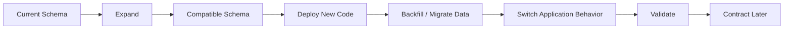
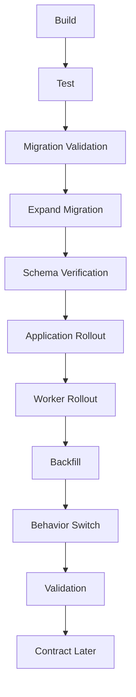

# 05- Backward Compatible Schema Changes

## Overview

Backward compatible schema changes allow a database to evolve while older and newer application versions continue operating safely during deployment.

This matters because production deployments are rarely instantaneous. During a rolling deployment, multiple versions of:

- Django or FastAPI application instances
- Celery workers
- Scheduled jobs
- Kafka producers and consumers
- gRPC services
- Background scripts

may simultaneously access the same database.

A schema change is backward-compatible when the **new database state continues to support the existing application behavior** while the new application is being deployed.

The core production principle is:

> **Make the database change compatible first, deploy code second, migrate behavior third, and remove obsolete structures last.**

This pattern is commonly implemented through **expand-and-contract** migrations.

---

## Why Backward Compatibility Matters

Consider a rolling deployment:

```text
                    ┌── Application v1
Load Balancer ──────┼── Application v1
                    ├── Application v2
                    └── Application v2
                              │
                              ▼
                         PostgreSQL
```

Both versions may query the same database at the same time.

If v2 expects a column that does not exist, v2 fails.

If the database removes a column that v1 still uses, v1 fails.

Therefore, the database must pass through an intermediate state that supports both versions.



---

## Backward Compatibility vs Rollback

These concepts are related but different.

**Backward compatibility** means the previous application version can continue operating against the new schema.

**Rollback** means returning the application or database to a previous operational state after a failure.

A schema can be backward-compatible without being safely reversible.

For example:

```text
Add column
    ↓
Deploy v2
    ↓
Rollback v2 → v1
```

If the new column is additive, v1 may continue working.

But:

```text
Drop old column
    ↓
Deploy v2
    ↓
Rollback v2 → v1
```

may fail because v1 still expects the removed column.

This is why destructive changes are normally separated from application deployment.

---

## The Expand-and-Contract Pattern

The general pattern is:

```text
Expand
  ↓
Deploy compatible code
  ↓
Migrate data
  ↓
Switch behavior
  ↓
Validate
  ↓
Contract
```

### Expand

Introduce the new database structures without removing the old ones.

Examples:

- Add a nullable column
- Add a new table
- Add a new index
- Add a new compatible enum/state
- Add a new event field

### Deploy

Deploy application code that understands the expanded schema while remaining compatible with the old schema.

### Migrate

Backfill existing data or gradually move traffic/state to the new representation.

### Switch

Change reads, writes, feature flags, or consumers to the new representation.

### Contract

Only after old consumers are gone should obsolete structures be removed.

---

## Adding a New Column

Suppose the existing table is:

```sql
CREATE TABLE customers (
    id bigint PRIMARY KEY,
    email text NOT NULL
);
```

You need:

```text
normalized_email
```

A safe first migration is:

```sql
ALTER TABLE customers
ADD COLUMN normalized_email text;
```

The old application continues using `email`.

The new application can initially support both:

```text
email
normalized_email
```

This is safer than immediately making the application depend on the new column.

---

## Adding a Required Column

Suppose the final design requires:

```sql
status text NOT NULL
```

Adding it immediately may fail or create deployment problems if existing rows do not have values.

Use staged enforcement:

```text
Add nullable column
        ↓
Deploy code that writes status
        ↓
Backfill existing rows
        ↓
Validate
        ↓
Add NOT NULL
```

Example:

```sql
ALTER TABLE orders
ADD COLUMN status text;
```

Backfill:

```sql
UPDATE orders
SET status = 'pending'
WHERE status IS NULL;
```

Validate:

```sql
SELECT count(*)
FROM orders
WHERE status IS NULL;
```

Then enforce:

```sql
ALTER TABLE orders
ALTER COLUMN status SET NOT NULL;
```

For large tables, perform the backfill in bounded batches rather than one massive transaction.

---

## Adding a Default

Be careful when adding defaults to large tables.

Modern PostgreSQL versions can optimize some constant defaults without physically rewriting every existing row, but the operational impact still depends on the exact expression, PostgreSQL version, table state, and subsequent workload.

A production migration should therefore be evaluated based on:

- PostgreSQL version
- Table size
- Lock behavior
- Default expression
- Existing traffic
- Replication workload
- Migration duration

Do not assume that every `ALTER TABLE` is cheap merely because it looks syntactically simple.

---

## Renaming a Column

An immediate rename is often incompatible.

Unsafe:

```text
Rename email → contact_email
        ↓
Deploy new application
```

Old application code may still execute:

```sql
SELECT email
FROM customers;
```

A safer migration is:

```text
Add contact_email
        ↓
Deploy code supporting both
        ↓
Backfill contact_email
        ↓
Write both representations if required
        ↓
Switch reads
        ↓
Stop writing email
        ↓
Verify consumers
        ↓
Drop email later
```

This is a canonical expand-and-contract migration.

---

## Dual Writes

During a transition, the application may temporarily write both old and new representations.

```text
                    ┌── old_column
Application ────────┤
                    └── new_column
```

For example:

```python
customer.email = email
customer.normalized_email = email.strip().lower()
```

Dual writes can provide compatibility while the new representation is being adopted.

However, they introduce consistency risks.

Possible failures include:

```text
write old succeeds
write new fails
```

or:

```text
different code paths update only one field
```

Therefore, when dual writes are necessary:

- Prefer a single transactional database operation
- Keep the transition short
- Monitor mismatches
- Define the source of truth
- Avoid indefinitely maintaining two representations

---

## Dual Writes vs Database Triggers

Dual writes can be implemented at different layers.

| Approach | Advantage | Limitation |
|---|---|---|
| Application dual write | Explicit business logic | Every writer must be updated |
| Database trigger | Centralized enforcement | More hidden behavior |
| Backfill job | Good for historical data | Does not handle new writes |
| CDC pipeline | Useful for derived systems | More infrastructure complexity |

For a single application owning a table, application-level coordination is often easier to reason about.

Triggers can be appropriate when multiple independent writers must maintain a database invariant, but they increase database-side complexity and observability requirements.

---

## Backward Compatible Index Changes

Indexes are usually additive.

Suppose a new API introduces:

```sql
SELECT id, created_at
FROM orders
WHERE customer_id = $1
ORDER BY created_at DESC
LIMIT 50;
```

Create the supporting index before exposing the new workload:

```sql
CREATE INDEX CONCURRENTLY orders_customer_created_idx
ON orders (customer_id, created_at DESC);
```

This avoids introducing a new high-volume query that immediately performs expensive sequential scans.

`CREATE INDEX CONCURRENTLY` reduces blocking of normal writes compared with a regular index build, but it is slower, has additional operational behavior, and cannot run inside a transaction block.

---

## Backward Compatible Constraints

Constraints can become dangerous when existing data does not satisfy them.

Suppose you want:

```sql
ALTER TABLE customers
ADD CONSTRAINT customers_email_unique UNIQUE (email);
```

First identify duplicates:

```sql
SELECT email, count(*)
FROM customers
GROUP BY email
HAVING count(*) > 1;
```

Then resolve them before enforcing uniqueness.

A common production pattern is:

```text
Detect violations
      ↓
Repair existing data
      ↓
Prevent new violations
      ↓
Enforce constraint
```

The same principle applies to:

- `NOT NULL`
- Foreign keys
- Check constraints
- Unique constraints

---

## Foreign Keys

Adding a foreign key to a populated table can fail if orphaned rows already exist.

Check first:

```sql
SELECT count(*)
FROM orders o
LEFT JOIN customers c
    ON c.id = o.customer_id
WHERE c.id IS NULL;
```

If the result is non-zero, the database is not ready for the constraint.

Correct ordering:

```text
Create/prepare referenced table
        ↓
Repair orphaned data
        ↓
Ensure application writes valid references
        ↓
Add foreign key
```

For large PostgreSQL tables, constraint validation strategy should also consider lock duration and deployment impact.

---

## Compatibility Across Application Versions

The most important compatibility matrix is:

| Database state | Old application | New application |
|---|---:|---:|
| Old schema | Yes | Ideally |
| Expanded schema | Yes | Yes |
| Contracted schema | No | Yes |

The desired transition is:

```text
Old App + Old DB
       ↓
Old App + Expanded DB
       ↓
New App + Expanded DB
       ↓
New App + Contracted DB
```

Avoid:

```text
Old App + Contracted DB
```

unless backward compatibility has been explicitly designed.

---

## Application Read Compatibility

During a transition, the new application should avoid immediately assuming the new structure exists everywhere.

For example:

```python
if use_normalized_email:
    value = customer.normalized_email
else:
    value = customer.email
```

In production, feature flags are often preferable to hard-coding deployment timing.

```text
Schema deployed
      ↓
Code deployed
      ↓
Feature OFF
      ↓
Backfill complete
      ↓
Validation
      ↓
Feature ON
```

Feature flags allow application behavior to change independently of schema deployment.

---

## Application Write Compatibility

Reads and writes need separate consideration.

A migration may support:

```text
new column exists
```

while the old application still writes:

```text
old column
```

If the new application reads only the new column, it may observe missing data.

Therefore, during a transition:

```text
Old writer ──────┐
                 ├── compatible representation
New writer ──────┘
```

The new application must either:

- Read from the old source until backfill completes
- Read from both sources
- Use dual writes
- Use a database-side synchronization mechanism

---

## Backward Compatible Table Splits

Suppose:

```text
customers
```

contains both customer identity and billing information.

You want:

```text
customers
billing_profiles
```

A safe sequence is:

```text
Create billing_profiles
        ↓
Deploy code supporting old/new representation
        ↓
Backfill billing_profiles
        ↓
Validate
        ↓
Switch reads
        ↓
Switch writes
        ↓
Remove old billing columns later
```

Do not move the data and delete the old columns in a single deployment unless the environment can guarantee atomic application compatibility.

---

## Backward Compatible Table Merges

Table merges require similar care.

Suppose:

```text
customer_profiles
customer_preferences
```

will become:

```text
customers
```

Create the target representation first.

Then:

```text
Populate target
    ↓
Deploy compatible application
    ↓
Switch reads
    ↓
Switch writes
    ↓
Validate
    ↓
Remove old tables
```

The intermediate state should remain valid for both application versions.

---

## Enum and State Changes

Adding a new business state can be backward-compatible if older application versions can safely encounter it.

Suppose:

```text
pending
paid
failed
```

becomes:

```text
pending
paid
failed
refunded
```

An old application may reject or mishandle `refunded`.

Therefore, adding a database value is not automatically backward-compatible.

Ask:

> **Can every existing consumer safely read and process the new value?**

This applies to:

- PostgreSQL enum values
- Status columns
- JSON fields
- API responses
- Kafka events
- gRPC messages

Sometimes the application must be upgraded before the new value is emitted.

---

## JSON Schema Changes

JSON and JSONB columns often evolve without a database migration.

That does not make them automatically backward-compatible.

For example:

```json
{
  "email": "user@example.com"
}
```

becoming:

```json
{
  "contact": {
    "email": "user@example.com"
  }
}
```

can break consumers immediately.

Prefer additive evolution:

```json
{
  "email": "user@example.com",
  "contact": {
    "email": "user@example.com"
  }
}
```

Then migrate consumers before removing the old field.

---

## API and Database Compatibility

Database compatibility often interacts with API compatibility.

For example:

```text
REST API
   ↓
Django/FastAPI
   ↓
PostgreSQL
```

Changing the database representation should not unnecessarily change the API contract.

A database migration can therefore be an internal implementation change while the external API remains stable.

For public APIs, use the same additive migration principles:

```text
Add new representation
        ↓
Support old + new
        ↓
Migrate clients
        ↓
Remove old representation later
```

---

## gRPC Compatibility

Protobuf-based gRPC APIs are designed for schema evolution, but consumers still need compatibility planning.

When a database change affects a gRPC response:

```text
Database change
      ↓
Service implementation
      ↓
gRPC contract
      ↓
Consumers
```

Do not remove fields from the database and API simultaneously.

Keep the database migration and API migration independently deployable where practical.

---

## Kafka Compatibility

Kafka producers and consumers create another compatibility boundary.

For an event:

```json
{
  "customer_id": "123",
  "email": "user@example.com"
}
```

prefer an additive transition:

```json
{
  "customer_id": "123",
  "email": "user@example.com",
  "contact_email": "user@example.com"
}
```

Then:

```text
Deploy consumers
      ↓
Verify consumers
      ↓
Deploy producer behavior
      ↓
Stop old field usage
      ↓
Remove old field later
```

This prevents old consumers from failing during rolling deployments.

---

## Celery and Background Jobs

Backward compatibility must include queued work.

Suppose Celery has a task:

```python
@app.task
def process_customer(customer_id):
    ...
```

Jobs created by an older version may execute after a new deployment.

If the new migration removes data required by the old task, queued jobs can fail.

Before contracting a schema:

- Drain or migrate old queues
- Check scheduled tasks
- Check retry queues
- Check long-running workers
- Verify task compatibility
- Consider task versioning for major transitions

---

## Read Replicas

Schema changes on the primary propagate to replicas through WAL.

During migration:

```text
Primary
  │
  ├── WAL
  ▼
Replica A
  │
  └── Read traffic
```

A replica may temporarily lag behind the primary.

If application traffic is routed to replicas, consider:

- Schema visibility
- Replica lag
- Read-after-write behavior
- Migration validation
- Failover behavior

Do not assume that a committed migration on the primary is instantly observable on every replica.

---

## Connection Pools and Schema Changes

Long-lived connections can preserve session state across deployments.

This matters when migrations change:

- Session settings
- Search paths
- Prepared statements
- Roles
- Extensions
- Connection-level configuration

Application pools should be able to recycle connections when required.

For example, Django's `CONN_MAX_AGE` controls persistent connection reuse; it is not a pool-size setting.

SQLAlchemy applications should also account for pool recycling and stale connections during deployment and failover.

---

## Zero-Downtime Schema Changes

A zero-downtime migration is not necessarily a migration that takes zero time.

It means the system remains available while the change is performed.

For large production tables, consider:

- Lock acquisition
- Index build duration
- Backfill workload
- WAL generation
- Replica lag
- Autovacuum interaction
- CPU/I/O pressure
- Connection pool behavior

A migration can technically succeed while still causing unacceptable production latency.

---

## Large Backfills

Large backfills should generally avoid one massive transaction.

Prefer:

```text
Read bounded batch
       ↓
Update batch
       ↓
Commit
       ↓
Observe
       ↓
Repeat
```

For example, process rows by primary-key ranges:

```sql
UPDATE customers
SET normalized_email = lower(email)
WHERE id > $1
  AND id <= $2
  AND normalized_email IS NULL;
```

Advantages:

- Smaller transactions
- Shorter lock duration
- Easier recovery
- Lower transaction bloat
- Better operational control

Trade-offs include:

- More application/job complexity
- Potential repeated scans if batching is poorly designed
- Longer total migration time

---

## Backfill Safety

A production backfill should have:

- A bounded batch size
- Progress tracking
- Retry handling
- Idempotent operations
- Rate limiting where required
- Monitoring
- Pause/resume capability
- Error reporting

Avoid:

```text
UPDATE 500 million rows
```

inside one transaction during peak production traffic.

---

## Contract Migration Timing

Contract migrations should usually be delayed.

For example:

```text
Monday:
  Add new column

Tuesday:
  Deploy compatible application

Wednesday:
  Complete backfill

Thursday:
  Switch feature

Friday:
  Verify all consumers

Later:
  Drop old column
```

The delay provides time to discover hidden consumers.

This is particularly important for:

- Long-lived branches
- Scheduled jobs
- Celery workers
- Kafka consumers
- Internal scripts
- Reporting systems
- Admin tools
- Data pipelines

---

## Migration Safety in CI/CD

A production pipeline can separate schema and application deployment:



Useful CI checks include:

- Migration applies to a clean database
- Migration applies to a realistic existing database
- Migration rollback behavior is understood
- Generated SQL is reviewed
- Migration dependencies are correct
- Schema compatibility tests pass
- Large-table operations are identified
- Destructive operations require explicit review

---

## Django Migration Practices

Django migrations should be treated as production deployment artifacts.

Inspect migrations before deployment:

```bash
python manage.py showmigrations
python manage.py sqlmigrate customers 0012
```

Apply migrations through a controlled deployment stage:

```bash
python manage.py migrate --noinput
```

For large or risky operations, consider a dedicated migration job rather than allowing every application pod to run migrations concurrently.

Be particularly careful with:

- `RunPython`
- `RunSQL`
- Large data migrations
- Field renames
- Non-null additions
- Index creation
- Constraint changes

A migration file being syntactically valid does not make the resulting operation production-safe.

---

## FastAPI and Alembic

FastAPI itself does not provide database migration behavior. A common architecture uses SQLAlchemy with Alembic.

Typical workflow:

```bash
alembic revision --autogenerate -m "add normalized email"
alembic upgrade head
```

Review autogenerated migrations before applying them.

Autogeneration can detect many schema differences, but it does not understand the complete application compatibility strategy.

A migration that says:

```text
drop old column
```

may be syntactically correct while being operationally unsafe.

---

## Testing Backward Compatibility

A useful test matrix is:

| Test | Purpose |
|---|---|
| Old app + old schema | Baseline |
| Old app + expanded schema | Backward compatibility |
| New app + expanded schema | Forward compatibility |
| New app + migrated data | Data correctness |
| New app + contracted schema | Final state |
| Old worker + expanded schema | Background compatibility |
| New worker + expanded schema | Worker rollout |
| Old consumer + new event | Event compatibility |

For critical systems, run compatibility tests against a production-like dataset.

---

## Schema Compatibility Tests

For a column transition:

```text
email
contact_email
```

test:

```text
Old application:
  Can read email
  Can write email

New application:
  Can read contact_email
  Can handle missing contact_email
  Can write compatible data
```

The exact tests depend on whether the application uses:

- ORM queries
- Raw SQL
- Stored procedures
- Reporting queries
- Background workers
- Event consumers

---

## Observability During Schema Changes

Monitor the entire migration lifecycle.

### Database

Track:

- Lock waits
- Active transactions
- Query latency
- CPU
- Memory
- I/O
- WAL generation
- Replication lag
- Deadlocks
- Autovacuum activity
- Connection utilization

### Application

Track:

- Error rate
- Request latency
- Database errors
- Timeout rate
- Worker failures
- Queue depth

### Data

Track:

- Backfill progress
- NULL counts
- Constraint violations
- Old/new value mismatches
- Unexpected write volume

A successful migration command is only one signal.

---

## Security Considerations

Schema compatibility does not override security requirements.

When introducing new columns or tables:

- Apply least-privilege permissions
- Review application roles
- Review read-only roles
- Consider RLS policies
- Protect sensitive columns
- Review backup exposure
- Review audit requirements

A new table can accidentally expose sensitive data if the application's database role already has broad schema privileges.

When using dynamic migration SQL, never construct identifiers or SQL structure from untrusted input.

---

## Reliability Considerations

Schema changes should be designed around failure.

Ask:

- What if the migration stops halfway?
- What if the application rollout fails?
- What if backfill stops?
- What if the primary fails?
- What if a replica lags?
- What if old workers continue running?
- What if a deployment is rolled back?
- What if a migration succeeds but feature activation fails?

Prefer migrations that are:

- Idempotent where practical
- Observable
- Restartable
- Incremental
- Backward-compatible
- Recoverable

---

## Common Mistakes

### Renaming Instead of Expanding

Immediate renames break older application versions.

**Avoid:** add the new representation first.

### Dropping Columns During Application Deployment

Old workers and pods may still reference them.

**Avoid:** contract later.

### Adding `NOT NULL` Immediately

Existing rows may violate the invariant.

**Avoid:** add, populate, validate, then enforce.

### Assuming Additive Means Safe

Adding a new enum value, JSON field, or API response field can still break consumers.

**Avoid:** evaluate how every consumer handles the new value.

### Performing Huge Backfills in One Transaction

This can create long locks, bloat, WAL pressure, and operational risk.

**Avoid:** bounded, observable batches.

### Ignoring Background Workers

Old Celery workers may continue executing old code.

**Avoid:** include workers and scheduled jobs in the compatibility window.

### Ignoring Event Consumers

Kafka consumers may lag far behind the producer deployment.

**Avoid:** migrate consumers before removing event fields.

### Relying Only on ORM Migrations

ORM migration tools cannot understand all runtime dependencies.

**Avoid:** review raw SQL, workers, reporting queries, scripts, and external consumers.

### Contracting Too Quickly

The system may appear healthy while hidden consumers still exist.

**Avoid:** verify consumers before destructive changes.

---

## Production Compatibility Checklist

### Before Expansion

- [ ] Identify all database consumers
- [ ] Identify application versions that may coexist
- [ ] Identify Celery workers and scheduled jobs
- [ ] Identify Kafka producers and consumers
- [ ] Identify reporting and administrative queries
- [ ] Review database permissions
- [ ] Review table size and workload
- [ ] Review lock behavior
- [ ] Review replication impact
- [ ] Define rollback behavior

### During Expansion

- [ ] Add structures without removing old ones
- [ ] Avoid unnecessary blocking operations
- [ ] Create required indexes safely
- [ ] Validate schema
- [ ] Monitor database health
- [ ] Monitor replicas

### During Transition

- [ ] Deploy backward-compatible application code
- [ ] Deploy compatible workers
- [ ] Run backfill safely
- [ ] Track progress
- [ ] Validate data
- [ ] Enable feature gradually when appropriate
- [ ] Verify old consumers

### Before Contract

- [ ] Confirm old application versions are gone
- [ ] Confirm old workers are gone
- [ ] Confirm scheduled jobs are compatible
- [ ] Confirm Kafka consumers are migrated
- [ ] Confirm reporting queries are migrated
- [ ] Confirm old cache formats are no longer required
- [ ] Confirm rollback window requirements
- [ ] Confirm recovery readiness
- [ ] Perform destructive changes separately where practical

---

## Interview Traps

### "Why is adding a column usually safer than renaming one?"

Adding a column preserves the old structure. Renaming immediately removes the interface expected by old application versions.

### "What is expand-and-contract?"

It is a schema evolution pattern where new structures are introduced first, application behavior is migrated, and obsolete structures are removed later.

### "Does backward-compatible mean rollback-safe?"

No. A schema may support both old and new applications while still being difficult or impossible to reverse.

### "Why can a new enum value break old applications?"

Because old application code may reject or mishandle values it does not recognize.

### "Why aren't database migrations alone enough?"

Because production consumers include application instances, workers, scripts, event consumers, reporting systems, and other services.

### "Why delay dropping a column?"

Because hidden or old consumers may still depend on it, and removing it can eliminate the ability to roll back the application safely.

---

## Senior-Level Design Heuristic

For every schema change, ask:

```text
Current schema
     ↓
What new structure is required?
     ↓
Can it be added without breaking old code?
     ↓
Can old + new applications coexist?
     ↓
Can workers and event consumers coexist?
     ↓
How will existing data be migrated?
     ↓
How will correctness be validated?
     ↓
When can the application stop using the old structure?
     ↓
When can the old structure be removed?
     ↓
What happens if deployment fails at every stage?
```

The key question is not:

> "What should the final schema look like?"

It is:

> **"What database states can exist during deployment, and are all of them safe for every active consumer?"**

That distinction is fundamental to reliable production database engineering.

---

## Key Takeaways

- **Backward compatibility keeps old and new application versions operational during deployment:** design schema changes around coexistence, not just the desired final state.
- **Expand-and-contract is the default pattern for incompatible changes:** add first, deploy compatible code, migrate data and behavior, validate, then remove obsolete structures.
- **Additive changes are not automatically safe:** enum values, JSON fields, API responses, Kafka events, constraints, and indexes must be evaluated from the perspective of every consumer.
- **Destructive changes should be delayed:** old pods, workers, jobs, consumers, reporting queries, and rollback paths must no longer depend on the previous schema.
- **Migration safety is a system property:** database design, application rollout, background processing, replication, observability, recovery, and CI/CD must all participate in the compatibility strategy.