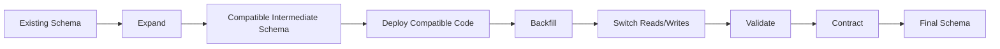
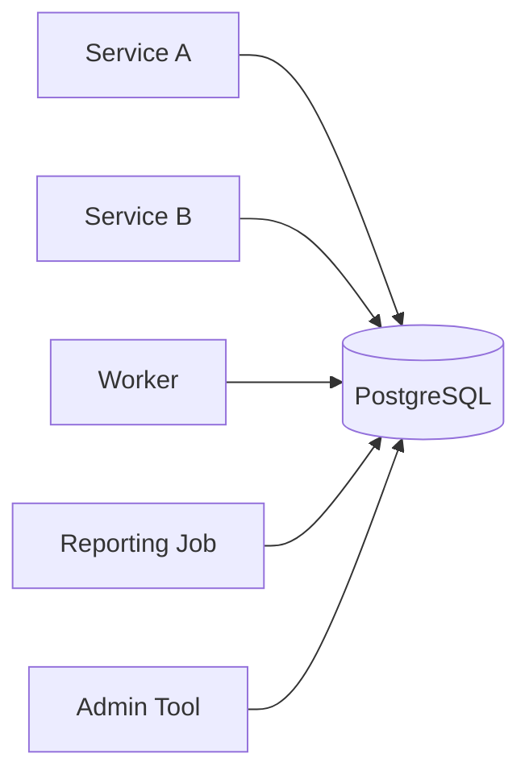
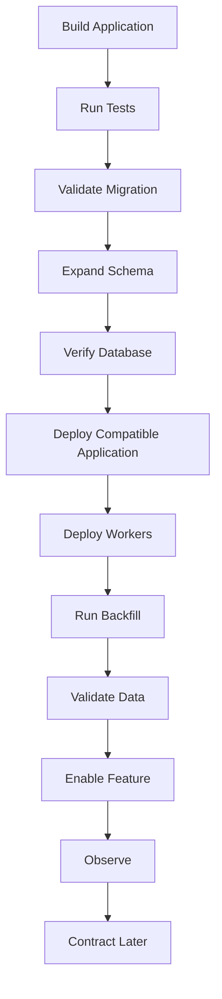

# 06- Zero Downtime Migrations

## Overview

Zero-downtime migrations are database schema changes designed to keep the application available while the database evolves.

The goal is not literally to guarantee that a migration takes zero seconds. The goal is to ensure that schema changes do not cause unacceptable:

- Request failures
- Lock waits
- Connection exhaustion
- Latency spikes
- Replica lag
- Data inconsistency
- Deployment-wide outages

In production, the database and application are often changed independently. During a rolling deployment, old and new application versions may coexist:

```text
                    ┌── App v1
                    ├── App v1
Load Balancer ──────┼── App v2
                    ├── App v2
                    └── Worker v1
                            │
                            ▼
                       PostgreSQL
```

A safe migration therefore considers the **entire deployment lifecycle**, not just the SQL statement.

The dominant strategy is **expand-and-contract**:

```text
Expand
  ↓
Deploy compatible application
  ↓
Backfill / migrate data
  ↓
Switch application behavior
  ↓
Validate
  ↓
Contract
```

---

## What Zero Downtime Means

A zero-downtime migration should preserve the application's externally visible availability while the schema changes.

A useful operational definition is:

> The application can continue serving supported traffic throughout the migration without requiring a maintenance window.

This does not mean:

- Every migration is instantaneous
- No locks are ever acquired
- No queries experience additional latency
- No retries are required
- Every database operation is non-blocking
- The migration can never fail

Instead, the migration should control the impact of unavoidable database work.

---

## Why Schema Changes Cause Downtime

Schema operations can interact with:

- Table locks
- Row locks
- Long-running transactions
- Index builds
- Foreign-key validation
- Backfills
- WAL generation
- Autovacuum
- Replication
- Connection pools
- Query planning
- Application deployment

For example:

```text
Migration
   │
   ├── waits for lock
   │
   ├── blocks application query
   │
   ├── connection remains occupied
   │
   ├── pool begins filling
   │
   └── requests time out
```

A migration can therefore cause downtime without ever crashing the database.

The important question is:

> **What resources does this migration compete for with production traffic?**

---

## Expand-and-Contract

Expand-and-contract separates a risky schema transformation into compatible stages.



### Expand

Add new structures while preserving existing ones.

Examples:

- New nullable column
- New table
- New index
- New compatible constraint
- New event field

### Transition

Deploy application code capable of working with the expanded schema.

### Backfill

Move or derive existing data incrementally.

### Switch

Change reads, writes, feature flags, or consumers to the new representation.

### Contract

Remove obsolete structures after old consumers are gone.

This pattern provides compatibility across rolling deployments and makes failures easier to recover from.

---

## The Core Deployment Sequence

A typical production migration looks like:

```text
1. Analyze workload
2. Expand schema
3. Verify expansion
4. Deploy compatible application
5. Backfill gradually
6. Validate data
7. Switch application behavior
8. Observe
9. Remove obsolete structures later
```

The exact ordering depends on the change.

For example, an index may be created before application code is deployed, while a new column may need application changes before a backfill.

---

## Adding a Column Safely

Suppose the existing table is:

```sql
CREATE TABLE customers (
    id bigint PRIMARY KEY,
    email text NOT NULL
);
```

You need:

```text
normalized_email
```

Start with:

```sql
ALTER TABLE customers
ADD COLUMN normalized_email text;
```

The old application continues using `email`.

The new application can initially support:

```text
email
normalized_email
```

Then backfill:

```sql
UPDATE customers
SET normalized_email = lower(trim(email))
WHERE normalized_email IS NULL;
```

For a large production table, do not normally run this as one massive transaction.

Use bounded batches instead.

---

## Adding a NOT NULL Column

This is a common zero-downtime migration problem.

Avoid immediately assuming:

```sql
ALTER TABLE customers
ADD COLUMN status text NOT NULL;
```

Existing rows may not have values, and the operation may have undesirable locking or validation characteristics depending on the exact operation and PostgreSQL version.

Prefer:

```text
Add nullable column
       ↓
Deploy code that writes the value
       ↓
Backfill existing rows
       ↓
Validate
       ↓
Enforce NOT NULL
```

Example:

```sql
ALTER TABLE orders
ADD COLUMN status text;
```

Application code begins writing `status`.

Then validate:

```sql
SELECT count(*)
FROM orders
WHERE status IS NULL;
```

Only after the invariant is satisfied should the constraint be enforced.

For large tables, PostgreSQL's constraint-validation mechanisms can be used to reduce blocking for appropriate constraints.

---

## Adding a New Index

Indexes are frequently required before deploying a new query pattern.

For a large production table, a normal index build can interfere significantly with concurrent writes.

PostgreSQL provides:

```sql
CREATE INDEX CONCURRENTLY orders_customer_created_idx
ON orders (customer_id, created_at DESC);
```

`CREATE INDEX CONCURRENTLY` is designed to allow normal table operations to continue while the index is built.

However, it has trade-offs:

- It takes longer than a regular index build
- It performs more work
- It can leave an invalid index if interrupted
- It cannot run inside a transaction block
- It still consumes substantial CPU/I/O
- It can increase replication and storage pressure

Check the operational impact before creating large indexes.

---

## Index Deployment Strategy

A common deployment sequence is:

```text
Create index concurrently
       ↓
Verify index
       ↓
Deploy query/application
       ↓
Observe execution plans
```

This is preferable to:

```text
Deploy application
       ↓
Application generates expensive queries
       ↓
Create index during incident
```

Use `EXPLAIN` against representative queries before exposing a new high-volume access path.

---

## Renaming a Column

An immediate rename is usually incompatible with rolling deployments.

Unsafe:

```sql
ALTER TABLE customers
RENAME COLUMN email TO contact_email;
```

while old application instances still execute:

```sql
SELECT email
FROM customers;
```

Prefer:

```text
Add contact_email
       ↓
Deploy code supporting both
       ↓
Backfill contact_email
       ↓
Write compatible values
       ↓
Switch reads
       ↓
Stop old writes
       ↓
Verify consumers
       ↓
Drop email later
```

The final rename is effectively implemented as an application-level migration rather than a single database operation.

---

## Removing a Column

Dropping a column is one of the most dangerous schema operations during rolling deployments.

Before:

```text
App v1 → old_column
App v2 → new_column
```

Do not drop `old_column` immediately after deploying v2.

Instead:

```text
Deploy v2
    ↓
Verify all v1 instances are gone
    ↓
Verify workers and jobs
    ↓
Verify scripts/reporting
    ↓
Stop old writes
    ↓
Observe
    ↓
Drop old column
```

The delay between application migration and schema contraction is intentional.

---

## Backfills

Backfills are often the largest part of a zero-downtime migration.

A backfill reads existing data and produces the representation required by the new schema.

For example:

```sql
UPDATE customers
SET normalized_email = lower(trim(email))
WHERE id > $1
  AND id <= $2
  AND normalized_email IS NULL;
```

Batching provides:

- Smaller transactions
- Shorter lock duration
- Lower transaction bloat
- Easier retries
- Better observability
- Easier pause/resume behavior

A production backfill should usually have:

- Batch size limits
- Progress tracking
- Retry handling
- Idempotency
- Rate limiting
- Metrics
- Error handling
- Pause/resume controls

---

## Backfill Scheduling

Do not automatically run a large backfill at maximum possible speed.

A useful model is:

```text
Backfill Worker
      │
      ▼
Process batch
      │
      ▼
Measure DB health
      │
      ├── Healthy ──► Continue
      │
      └── High load ─► Slow/Pause
```

Monitor:

- CPU
- I/O
- Query latency
- Lock waits
- WAL generation
- Replica lag
- Connection utilization
- Autovacuum behavior

The optimal backfill rate is the highest rate that does not materially degrade production workload.

---

## Keyset-Based Backfills

For large tables, process rows using an indexed key rather than repeatedly scanning the entire table.

For example:

```sql
SELECT id
FROM customers
WHERE id > $1
ORDER BY id
LIMIT 1000;
```

Then update that bounded set.

Avoid patterns that repeatedly scan large portions of the table:

```sql
UPDATE customers
SET normalized_email = ...
WHERE normalized_email IS NULL
LIMIT 1000;
```

PostgreSQL does not support `LIMIT` directly on `UPDATE`, and implementing arbitrary batching through inefficient repeated scans can become increasingly expensive.

---

## Chunk Size

There is no universally correct batch size.

A batch that is too small causes:

- Excessive transaction overhead
- More round trips
- Longer total migration time

A batch that is too large causes:

- Longer transactions
- More WAL
- More lock duration
- More replication lag
- Larger rollback/retry units

Choose a batch size based on:

- Row size
- Index count
- Database capacity
- Replication topology
- Production traffic
- Lock behavior

Then tune using measurements.

---

## Long Transactions

Long transactions are particularly dangerous during online migrations.

They can:

- Hold locks
- Prevent cleanup
- Increase MVCC bloat
- Consume connections
- Delay vacuum cleanup
- Increase replica pressure
- Make failures expensive to recover from

Prefer:

```text
Batch
  ↓
Commit
  ↓
Observe
  ↓
Next batch
```

over:

```text
BEGIN
  ↓
Process millions of rows
  ↓
COMMIT
```

---

## Lock Management

A migration may be safe in principle but still become disruptive if it waits indefinitely for a lock.

For operational migrations, consider a short lock acquisition timeout:

```sql
SET lock_timeout = '3s';
```

This means the migration fails rather than waiting indefinitely to acquire a lock.

You can combine it with a statement timeout appropriate for the operation:

```sql
SET lock_timeout = '3s';
SET statement_timeout = '10min';
```

These settings solve different problems:

| Setting | Controls |
|---|---|
| `lock_timeout` | Time waiting to acquire a lock |
| `statement_timeout` | Total statement execution time |

A failed migration should be retried deliberately after identifying the blocker rather than blindly increasing the timeout.

---

## Lock Waits During Deployments

A typical incident can look like:

```text
Migration
   │
   ▼
Waiting for table lock
   │
   ▼
Application query holds lock
   │
   ▼
Migration waits
   │
   ▼
Deployment appears stuck
```

Diagnose PostgreSQL using:

```sql
SELECT
    pid,
    usename,
    state,
    wait_event_type,
    wait_event,
    query
FROM pg_stat_activity
WHERE state <> 'idle';
```

Lock information can be inspected with:

```sql
SELECT
    pid,
    locktype,
    mode,
    granted
FROM pg_locks;
```

Use `pg_blocking_pids()` to identify blockers:

```sql
SELECT
    pid,
    pg_blocking_pids(pid) AS blocking_pids
FROM pg_stat_activity
WHERE wait_event_type = 'Lock';
```

---

## PostgreSQL DDL Considerations

Not all `ALTER TABLE` operations have the same operational characteristics.

Before applying DDL to a large production table, determine:

- Required lock mode
- Whether a table rewrite occurs
- Whether existing rows must be scanned
- Whether indexes are rebuilt
- Whether the operation can be interrupted safely
- Impact on replicas
- Expected execution duration

Do not categorize all DDL as either "safe" or "unsafe."

Evaluate the specific operation.

---

## Constraints

Constraints should generally be introduced in stages when existing data may violate them.

For example:

```text
Existing data
    ↓
Find violations
    ↓
Repair violations
    ↓
Prevent new violations
    ↓
Validate
    ↓
Enforce constraint
```

For suitable PostgreSQL constraints, a common technique is:

```sql
ALTER TABLE orders
ADD CONSTRAINT orders_customer_fk
FOREIGN KEY (customer_id)
REFERENCES customers(id)
NOT VALID;
```

Then validate separately:

```sql
ALTER TABLE orders
VALIDATE CONSTRAINT orders_customer_fk;
```

This can reduce the impact of adding a foreign-key constraint to a busy table because the initial constraint addition does not immediately validate all existing rows.

The exact locking behavior should still be reviewed for the PostgreSQL version and workload.

---

## Foreign Key Performance

A foreign key can also affect write performance.

Consider:

```text
customers
    ↑
orders.customer_id
```

The referenced key normally has an index because it is typically a primary or unique key.

The referencing column may also need an index depending on workload, especially for:

- Parent deletes
- Parent key updates
- Joins
- Referential checks

Do not assume that creating the foreign key automatically creates every index needed for application performance.

---

## Table Rewrites

Some schema changes can rewrite a table.

For a large table:

```text
Table: 500 GB
      ↓
Rewrite
      ↓
Large I/O workload
      ↓
WAL generation
      ↓
Replica lag
      ↓
Production latency
```

A migration can therefore be technically correct while still being operationally unacceptable.

Before large DDL operations, determine whether PostgreSQL will rewrite or scan the table.

---

## Adding Defaults

Adding a constant default has improved operational behavior in modern PostgreSQL versions, where certain defaults can be recorded without rewriting every existing row.

However, this should not become a blanket assumption that all defaults are cheap.

The operational behavior depends on:

- PostgreSQL version
- Default expression
- Table characteristics
- Existing workload
- Subsequent updates
- Replication

Evaluate the actual operation rather than relying on a generic rule.

---

## Application Compatibility

Zero-downtime migrations require compatibility between application versions.

A useful matrix is:

| Database state | Old application | New application |
|---|---:|---:|
| Old schema | Yes | Ideally |
| Expanded schema | Yes | Yes |
| Contracted schema | No | Yes |

The desired path is:

```text
Old App + Old DB
       ↓
Old App + Expanded DB
       ↓
New App + Expanded DB
       ↓
New App + Contracted DB
```

The dangerous state is:

```text
Old App + Contracted DB
```

---

## Feature Flags

Feature flags can decouple schema deployment from behavior activation.

Example:

```text
Schema deployed
      ↓
Compatible application deployed
      ↓
Feature disabled
      ↓
Backfill complete
      ↓
Validation complete
      ↓
Feature enabled
```

This allows a team to deploy the required database structures without immediately activating the new behavior.

Feature flags are particularly useful for:

- Large migrations
- Risky query changes
- Data representation changes
- Gradual rollouts
- Canary deployments

---

## Dual Reads

During migration, an application may temporarily read from both old and new representations.

For example:

```text
Read new field
     │
     ├── exists ──► use new value
     │
     └── missing ─► fallback to old value
```

This can make application rollout resilient while backfill is incomplete.

However, dual reads should be temporary because they increase:

- Query complexity
- Application complexity
- Testing requirements
- Observability requirements

---

## Dual Writes

When migrating a representation, both old and new fields may temporarily need to be written.

```text
Application
    │
    ├── old representation
    │
    └── new representation
```

If both writes happen in the same database transaction, they can usually be kept consistent with the transaction's atomicity.

However, dual writes create a new failure mode:

```text
Writer A:
  updates old field

Writer B:
  updates new field
```

Every writer must understand the compatibility contract.

This is especially important for:

- Multiple services
- Admin tools
- Celery workers
- Data pipelines
- Scripts

---

## Cache Compatibility

Schema migrations can interact with Redis or other caches.

Suppose cached data contains:

```json
{
  "email": "user@example.com"
}
```

while the new application expects:

```json
{
  "contact_email": "user@example.com"
}
```

Deploying only the database migration does not solve the cache compatibility problem.

Possible strategies include:

- Version cache keys
- Read both formats temporarily
- Invalidate affected keys
- Write both formats during transition
- Use short TTLs where appropriate

Avoid assuming that changing the database automatically invalidates application state stored elsewhere.

---

## Kafka Compatibility

Database migrations can also affect event schemas.

A safe event migration is generally additive:

```json
{
  "customer_id": "123",
  "email": "user@example.com",
  "contact_email": "user@example.com"
}
```

Then:

```text
Deploy compatible consumers
       ↓
Deploy producer
       ↓
Switch consumer behavior
       ↓
Stop old field usage
       ↓
Remove old field later
```

This follows the same compatibility principle as database schema evolution.

---

## Celery Compatibility

Queued Celery tasks can outlive an application deployment.

For example:

```text
Task created by v1
       ↓
Deployment
       ↓
Task executes using v1 payload
       ↓
Worker may now run v2
```

Before contracting a schema, verify:

- Pending tasks
- Retry queues
- Scheduled tasks
- Long-running workers
- Task payload compatibility

A schema migration is incomplete if background jobs can still execute code that expects the old schema.

---

## Microservices

In microservice architectures, the database may have several consumers.



Directly shared database tables increase migration complexity.

Before changing a shared table, identify:

- Service versions
- Deployment order
- Workers
- Reporting systems
- ETL jobs
- Administrative tools

A service that is not part of the main deployment can still break the migration.

---

## Django Migrations

Django migrations should be treated as deployment artifacts, not merely development conveniences.

Useful commands:

```bash
python manage.py showmigrations
python manage.py sqlmigrate customers 0012
python manage.py migrate --plan
```

Apply migrations through controlled deployment infrastructure:

```bash
python manage.py migrate --noinput
```

Avoid having every Kubernetes pod independently execute migrations.

Prefer:

```text
CI/CD
  ↓
Migration Job
  ↓
Database
  ↓
Application rollout
```

This gives the migration a single operational owner.

---

## Django Migration Example

A schema-only migration might add a nullable field:

```python
from django.db import migrations, models


class Migration(migrations.Migration):
    dependencies = [
        ("customers", "0011_previous"),
    ]

    operations = [
        migrations.AddField(
            model_name="customer",
            name="normalized_email",
            field=models.TextField(null=True),
        ),
    ]
```

Do not automatically combine this with a huge data migration.

For large datasets, it is often better to separate:

```text
Schema migration
      ↓
Application deployment
      ↓
Background backfill
```

This gives the operational team independent control over each phase.

---

## FastAPI and Alembic

FastAPI applications commonly use SQLAlchemy with Alembic.

Inspect generated migrations:

```bash
alembic revision --autogenerate -m "add normalized email"
alembic upgrade head
```

Autogeneration does not understand deployment compatibility.

For example, a generated migration that drops a column may be syntactically correct but operationally unsafe.

Review:

- SQL generated
- Lock behavior
- Data migration requirements
- Compatibility
- Rollback strategy
- Table size

---

## Deployment Architecture

A production deployment can separate migration and application rollout:



This separation reduces the blast radius of individual failures.

---

## Kubernetes Considerations

Kubernetes rolling deployments make schema compatibility especially important.

For example:

```text
Pod 1 → v1
Pod 2 → v1
Pod 3 → v2
Pod 4 → v2
```

The database must support both versions during the rollout.

Avoid:

```text
Migration deletes old column
       ↓
Pods still running v1
       ↓
Requests fail
```

Prefer:

```text
Expand schema
       ↓
Roll out v2
       ↓
Wait for old pods to terminate
       ↓
Verify
       ↓
Contract
```

Readiness probes can control traffic eligibility, but they do not automatically solve database compatibility.

---

## Connection Pools During Migration

A blocked migration or long-running backfill can consume database resources.

For example:

```text
Migration connections
       +
Application connections
       +
Celery connections
       +
Reporting connections
       ↓
Database connection pressure
```

Monitor:

- Active connections
- Pool utilization
- Waiting requests
- Idle-in-transaction sessions
- Long-running transactions

Do not simply increase `max_connections` to hide migration-induced contention.

More connections can increase memory consumption and database concurrency pressure.

---

## Replication Impact

Large migrations can generate substantial WAL.

```text
Backfill
   ↓
Many row changes
   ↓
WAL generation
   ↓
Replica replay
   ↓
Replication lag
```

Replica lag can then cause:

- Stale reads
- Read-after-write failures
- Delayed reporting
- Failover concerns

Monitor replication lag during large backfills and consider throttling the migration if replicas fall behind.

---

## High Availability and Failover

A zero-downtime migration should remain safe if the primary fails.

Consider:

```text
Migration running
      ↓
Primary failure
      ↓
Replica promoted
      ↓
Application reconnects
      ↓
Migration state recovered
```

Migration jobs should therefore be:

- Restartable
- Idempotent where practical
- Progress-aware
- Safe to retry

Do not assume that a failed deployment automatically means the migration state is known.

---

## Rollback Strategy

Application rollback and database rollback are not always symmetrical.

For example:

```text
Expand schema
       ↓
Deploy v2
       ↓
v2 fails
       ↓
Rollback application to v1
```

This can be safe if the expanded schema remains compatible with v1.

However:

```text
Contract schema
       ↓
Deploy v2
       ↓
Rollback to v1
```

may fail because the old structure no longer exists.

Therefore:

> **Contract migrations should generally happen only after the application rollback window has passed.**

---

## Observability

Migration monitoring should cover both database and application health.

### Database Metrics

Track:

- CPU
- Memory
- I/O
- Query latency
- Lock waits
- Active transactions
- WAL volume
- Replication lag
- Deadlocks
- Connection utilization
- Autovacuum activity

### Application Metrics

Track:

- Request latency
- Error rate
- Timeout rate
- Database errors
- Connection acquisition time
- Worker failures
- Queue depth

### Migration Metrics

Track:

- Rows processed
- Rows remaining
- Backfill rate
- Batch duration
- Failure count
- Retry count
- Last processed key
- Estimated completion time

---

## Migration Logging

A migration should produce enough information to answer:

```text
What is running?
How long has it run?
How many rows are complete?
What is blocked?
What is failing?
What is the current database load?
Can it safely continue?
```

For background backfills, log structured metadata such as:

```text
migration=normalize_customer_email
batch_start_id=100000
batch_end_id=101000
rows_updated=997
duration_ms=420
```

Avoid logging sensitive customer data while debugging migrations.

---

## Security Considerations

Migration infrastructure often requires elevated privileges.

Do not give application runtime roles unrestricted DDL privileges merely because migrations need them.

Prefer separate identities:

```text
app_runtime
    ↓
Normal application permissions

migration_role
    ↓
Controlled schema modification privileges
```

Migration credentials should be:

- Stored securely
- Short-lived where possible
- Restricted by environment
- Audited
- Rotated
- Accessible only to deployment infrastructure

A migration system is part of the production security boundary.

---

## Disaster Recovery Considerations

Before high-risk migrations, verify:

- Recent backups
- WAL/PITR availability
- Recovery procedures
- Replica health
- Migration observability
- Restore capability

Backups are not a substitute for backward-compatible migrations.

A migration that corrupts logical data may require restoring to a point before the change, which can create significant operational impact.

For destructive changes, recovery planning should be explicit.

---

## Common Zero-Downtime Patterns

| Change | Safer Pattern |
|---|---|
| Add column | Add nullable column first |
| Add required column | Add → populate → validate → enforce |
| Rename column | Add new → dual-read/write → switch → remove old |
| Remove column | Stop consumers → observe → drop later |
| Add index | `CREATE INDEX CONCURRENTLY` where appropriate |
| Add foreign key | Repair data → add safely → validate |
| Split table | Create target → backfill → switch → remove old |
| Merge tables | Create target → migrate → switch → remove old |
| Change enum/state | Ensure consumers understand new values first |
| Change JSON structure | Add new representation → migrate consumers → remove old |
| Large data transformation | Incremental background backfill |
| Change API/event schema | Additive evolution first |

---

## Common Mistakes

### Running a Large Backfill Inside One Transaction

**Problem:** Long locks, bloat, WAL growth, and difficult recovery.

**Better:** Use bounded, independently committed batches.

### Dropping a Column Immediately

**Problem:** Old application instances or workers may still reference it.

**Better:** Contract only after all consumers are migrated.

### Creating a Large Index Normally During Peak Traffic

**Problem:** Significant resource consumption and potentially disruptive locking.

**Better:** Evaluate `CREATE INDEX CONCURRENTLY` and schedule according to workload.

### Increasing Lock Timeout Until the Migration Works

**Problem:** A longer wait can turn a migration into an application outage.

**Better:** Use an appropriate `lock_timeout`, identify blockers, and retry deliberately.

### Assuming All DDL Is Safe

**Problem:** Different operations have very different locking and rewrite behavior.

**Better:** Analyze the specific PostgreSQL operation.

### Ignoring Replica Lag

**Problem:** Backfills can generate enough WAL to make replicas materially stale.

**Better:** Monitor and throttle based on replica health.

### Deploying Schema and Code as One Irreversible Operation

**Problem:** Application rollback may become impossible.

**Better:** Separate expansion, deployment, and contraction.

### Running Migrations From Every Application Pod

**Problem:** Concurrent migration execution and unpredictable deployment behavior.

**Better:** Use a controlled migration job or deployment stage.

### Ignoring Workers

**Problem:** Old Celery workers can continue executing old code.

**Better:** Include workers and scheduled tasks in compatibility analysis.

### Ignoring Caches and Events

**Problem:** Redis state or Kafka consumers may still use old representations.

**Better:** Treat every consumer of the data contract as part of the migration.

---

## Production Migration Procedure

### Preparation

- [ ] Identify affected tables and indexes
- [ ] Estimate table size
- [ ] Inspect current workload
- [ ] Identify application consumers
- [ ] Identify Celery workers
- [ ] Identify Kafka producers/consumers
- [ ] Identify reporting and administrative jobs
- [ ] Determine lock behavior
- [ ] Determine whether a table rewrite occurs
- [ ] Review replication impact
- [ ] Define rollback behavior
- [ ] Verify backups and recovery

### Expansion

- [ ] Add new structures
- [ ] Avoid unnecessary blocking operations
- [ ] Create large indexes safely
- [ ] Verify schema state
- [ ] Monitor database health

### Application Rollout

- [ ] Deploy backward-compatible code
- [ ] Deploy compatible workers
- [ ] Keep feature disabled if appropriate
- [ ] Verify old instances can still operate
- [ ] Monitor errors and latency

### Backfill

- [ ] Use bounded batches
- [ ] Track progress
- [ ] Make retries safe
- [ ] Monitor CPU and I/O
- [ ] Monitor lock waits
- [ ] Monitor WAL generation
- [ ] Monitor replica lag
- [ ] Pause or throttle when required

### Cutover

- [ ] Validate data
- [ ] Switch reads
- [ ] Switch writes
- [ ] Enable feature gradually if appropriate
- [ ] Verify application behavior
- [ ] Continue monitoring

### Contraction

- [ ] Confirm old application versions are gone
- [ ] Confirm old workers are gone
- [ ] Confirm scheduled jobs are migrated
- [ ] Confirm event consumers are migrated
- [ ] Confirm reporting systems are migrated
- [ ] Confirm rollback window has passed
- [ ] Remove obsolete structures separately

---

## Senior-Level Design Questions

Before approving a zero-downtime migration, ask:

### Compatibility

- Can old and new application versions coexist?
- Can old and new workers coexist?
- Can old event consumers coexist?
- Can old cache entries coexist?

### Database

- What lock does the operation require?
- Can it rewrite the table?
- How long can it run?
- What happens if it is interrupted?

### Data

- How is existing data migrated?
- Is the backfill idempotent?
- How is progress tracked?
- How are inconsistencies detected?

### Operations

- What happens during peak traffic?
- What happens if the primary fails?
- What happens if a replica falls behind?
- Can the migration be paused?
- Can it resume safely?

### Rollback

- Can the application roll back?
- Can old workers still run?
- Can the schema remain in the expanded state?
- Has the contract phase been deliberately separated?

---

## Interview Traps

### "Does zero downtime mean no locks?"

No. Database systems still require locks for many operations. The objective is to avoid disruptive lock acquisition, long lock waits, and application-visible outages.

### "Why use expand-and-contract?"

Because rolling deployments create a compatibility window where old and new application versions coexist.

### "Why is dropping a column more dangerous than adding one?"

Adding a column generally preserves the old interface. Dropping a column removes something that older consumers may still require.

### "Why can a backfill cause downtime?"

A large backfill consumes CPU, I/O, connections, WAL bandwidth, and transaction resources. It can also increase replica lag and contention.

### "Does `CREATE INDEX CONCURRENTLY` mean the index has no impact?"

No. It reduces interference with normal writes but still consumes significant resources and has operational trade-offs.

### "Can you roll back every migration?"

No. Application rollback and schema rollback are different problems. A destructive schema change may prevent the previous application version from functioning.

### "Why isn't a migration complete when the SQL succeeds?"

Because successful execution does not prove application compatibility, data correctness, replica health, worker compatibility, or operational safety.

---

## Key Takeaways

- **Zero-downtime migrations are compatibility problems as much as database problems:** old and new application versions must safely coexist during deployment.
- **Expand-and-contract is the primary production pattern:** expand the schema, deploy compatible code, migrate data, switch behavior, validate, and contract later.
- **Large migrations must be treated as workloads:** control batch size, transaction duration, locks, WAL generation, CPU/I/O usage, connections, and replica lag.
- **Rollback must be designed before deployment:** keep expanded schemas compatible with previous application versions and delay destructive changes until rollback is no longer required.
- **Operational safety requires end-to-end visibility:** monitor database health, application latency, migration progress, background workers, replicas, caches, and event consumers throughout the migration.