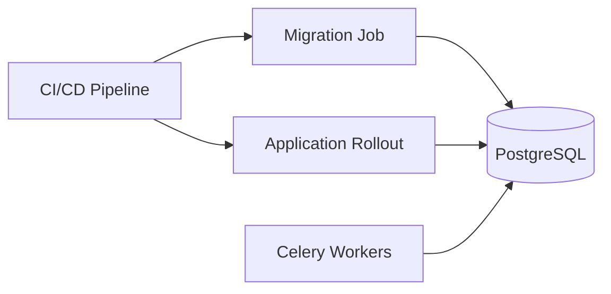

# 07- Adding Columns Safely

## Overview

Adding a column is one of the most common database schema changes in backend systems. It is also one of the easiest changes to underestimate.

The SQL itself may be simple:

```sql
ALTER TABLE customers
ADD COLUMN normalized_email text;
```

The production problem is broader:

- Existing application versions may still be running.
- Multiple Kubernetes pods may be deployed at different versions.
- Celery workers may still execute old code.
- Kafka consumers may expect the old data contract.
- Existing rows need values.
- New writes must remain consistent.
- Large tables may make backfills expensive.
- Constraints can introduce validation or locking work.
- Replicas may fall behind.
- Rollback must remain possible.

The safest approach is usually to separate **schema expansion**, **application compatibility**, **data backfill**, **behavior switch**, and **schema contraction**.

```text
┌──────────────────┐
│ Existing schema  │
└────────┬─────────┘
         │
         ▼
┌──────────────────────┐
│ Add nullable column  │
└────────┬─────────────┘
         │
         ▼
┌─────────────────────────────┐
│ Deploy backward-compatible  │
│ application code            │
└────────┬────────────────────┘
         │
         ▼
┌──────────────────────┐
│ Backfill old rows   │
└────────┬─────────────┘
         │
         ▼
┌──────────────────────┐
│ Validate data        │
└────────┬─────────────┘
         │
         ▼
┌──────────────────────┐
│ Enforce constraints  │
└────────┬─────────────┘
         │
         ▼
┌──────────────────────┐
│ Enable new behavior  │
└──────────────────────┘
```

The central principle is:

> **Add first, make the application compatible, populate safely, enforce invariants, and only then remove transitional behavior.**

---

## Why Adding Columns Requires Care

A schema change affects more than the database structure.

A production request can pass through:

```text
Client
  ↓
Nginx / Load Balancer
  ↓
Django / FastAPI
  ↓
Connection Pool
  ↓
PostgreSQL
  ↓
Redis / Kafka / Celery
```

A column addition may affect every layer that knows about the affected record.

For example:

```text
customers.email
        │
        ├── API serializers
        ├── ORM models
        ├── background jobs
        ├── Kafka events
        ├── Redis cache
        ├── reporting queries
        └── admin scripts
```

The database migration is successful only when the entire system remains correct during and after the transition.

---

## The Safe Column Addition Pattern

For a new optional field:

```text
Old schema
    │
    ▼
Add nullable column
    │
    ▼
Deploy compatible application
    │
    ▼
Start writing new column
    │
    ▼
Backfill historical rows
    │
    ▼
Validate
    │
    ▼
Make required if necessary
```

Example:

```sql
ALTER TABLE customers
ADD COLUMN normalized_email text;
```

At this stage:

```text
Old application ──► email
New application ──► email + normalized_email
```

Both can coexist.

---

## Nullable Columns

Adding a nullable column is usually the simplest expansion strategy.

```sql
ALTER TABLE customers
ADD COLUMN normalized_email text NULL;
```

Existing rows can remain `NULL` while the application is being updated.

This creates a compatibility window:

| Application | Column exists | Existing values required |
|---|---:|---:|
| Old version | Yes | No |
| New version | Yes | Not necessarily |
| Backfill worker | Yes | Populates values |

This is useful when:

- The field can initially be absent.
- Existing data can be populated asynchronously.
- A rolling deployment is being used.
- Multiple application versions may coexist.

---

## Adding a NOT NULL Column

A common mistake is to immediately add:

```sql
ALTER TABLE customers
ADD COLUMN status text NOT NULL;
```

Existing rows need a valid value.

More importantly, combining schema modification, data population, and constraint enforcement into one deployment step makes operational behavior harder to control.

Prefer:

```text
1. Add nullable column
2. Deploy code that understands it
3. Populate new rows
4. Backfill existing rows
5. Verify no invalid rows remain
6. Enforce NOT NULL
```

Example:

```sql
ALTER TABLE orders
ADD COLUMN status text;
```

Application code starts assigning a value to every new order.

Then inspect existing data:

```sql
SELECT count(*)
FROM orders
WHERE status IS NULL;
```

Only after the result reaches zero should you enforce the invariant.

---

## Choosing a Default

Defaults require careful consideration.

Suppose every existing order should have:

```text
status = 'pending'
```

You might eventually want:

```sql
ALTER TABLE orders
ALTER COLUMN status SET DEFAULT 'pending';
```

and:

```sql
ALTER TABLE orders
ALTER COLUMN status SET NOT NULL;
```

The important distinction is between:

- The default for future inserts
- The values of existing rows
- The enforcement of the invariant

A default does not conceptually replace a backfill strategy.

Modern PostgreSQL versions can optimize certain constant-default operations without rewriting every existing row, but behavior depends on the PostgreSQL version and exact default expression.

Do not assume that every default expression is equally cheap.

---

## Application Compatibility

During a rolling deployment, this can exist:

```text
Pod A → old application
Pod B → old application
Pod C → new application
Pod D → new application
```

The database therefore needs to support both versions.

For an additive column:

```text
Old application
    ↓
Ignores new column

New application
    ↓
Uses new column
```

This is usually safe.

The reverse situation is dangerous:

```text
New application
    ↓
Requires column

Database
    ↓
Column does not exist
```

Therefore, the schema expansion should generally happen **before** deploying application code that depends on the new column.

---

## The Compatibility Matrix

A useful deployment model is:

| Database state | Old application | New application |
|---|---:|---:|
| Before column | Yes | No |
| Column added | Yes | Yes |
| Column populated | Yes | Yes |
| Constraint enforced | Usually yes | Yes |
| Transitional code removed | No | Yes |

The critical property is:

> **Every database state encountered during deployment must support every application version that can still receive traffic.**

---

## Dual Writes

Suppose a system currently stores:

```text
email
```

and introduces:

```text
normalized_email
```

During migration, the application may temporarily write both:

```text
email = original input
normalized_email = normalized input
```

For example:

```python
normalized_email = email.strip().lower()
```

The database transaction can update both representations atomically.

```text
Application
     │
     ├──── email
     │
     └──── normalized_email
              │
              ▼
         PostgreSQL
```

Dual writes are useful when:

- The new representation is derived from existing data.
- Old consumers still require the old field.
- New consumers require the new field.
- The transition cannot happen atomically across all application instances.

The limitation is operational complexity. Every writer must follow the new contract.

Remember to account for:

- API requests
- Celery workers
- management commands
- admin tools
- scheduled jobs
- data importers
- other microservices

---

## Dual Reads

During migration, new code can temporarily support both representations:

```text
Read new column
      │
      ├── value exists ──► use it
      │
      └── NULL ──────────► fallback to old column
```

Example:

```python
value = customer.normalized_email

if value is None:
    value = customer.email.strip().lower()
```

This is useful while backfill is incomplete.

However, dual-read logic should be temporary. Leaving it indefinitely increases application complexity and can hide incomplete migrations.

---

## Backfilling Existing Rows

Adding the column does not populate historical records.

For example:

```sql
ALTER TABLE customers
ADD COLUMN normalized_email text;
```

Existing rows may contain:

```text
id | email              | normalized_email
---+--------------------+-----------------
1  | User@Example.COM   | NULL
2  | Admin@Example.com  | NULL
```

The backfill must populate the new representation.

For small tables:

```sql
UPDATE customers
SET normalized_email = lower(trim(email))
WHERE normalized_email IS NULL;
```

For large tables, avoid one enormous transaction.

---

## Batched Backfills

A production backfill should normally process bounded batches.

A keyset-oriented approach is preferable to repeatedly scanning the entire table.

Example:

```sql
SELECT id
FROM customers
WHERE id > $1
ORDER BY id
LIMIT 1000;
```

The worker can then process that range and record progress.

A typical lifecycle is:

```text
Find next batch
     ↓
Update batch
     ↓
Commit
     ↓
Record progress
     ↓
Measure database health
     ↓
Continue / throttle / pause
```

Benefits include:

- Smaller transactions
- Easier retries
- Lower lock duration
- Better failure recovery
- Lower rollback cost
- Better observability

---

## Backfill Idempotency

A migration worker should be safe to restart.

For example:

```sql
UPDATE customers
SET normalized_email = lower(trim(email))
WHERE id > $1
  AND id <= $2
  AND normalized_email IS NULL;
```

The `IS NULL` condition makes repeated execution less harmful for already-processed rows.

The exact predicate depends on the migration, but the general property is:

> **Retrying a completed batch should not corrupt data.**

This matters when:

- Kubernetes restarts a worker
- A deployment fails
- The database connection drops
- A batch times out
- A process crashes after committing but before recording progress

---

## Backfill Progress

Do not run an opaque background process that simply logs:

```text
migration started
migration completed
```

Track useful progress such as:

```text
migration = normalize_customer_email
last_processed_id = 1250000
rows_processed = 1249000
rows_remaining = 50000
batch_duration_ms = 380
```

This allows operators to determine:

- Whether progress is continuing
- Whether the migration is stuck
- How quickly it is running
- Whether it should be throttled
- Whether it can finish before a deployment deadline

---

## Backfill Rate Limiting

A backfill competes with production workload.

```text
                    ┌── API traffic
                    │
PostgreSQL ─────────┼── Celery workers
                    │
                    ├── Reporting
                    │
                    └── Backfill
```

Monitor:

- Database CPU
- I/O
- Query latency
- Lock waits
- Connection utilization
- WAL generation
- Replica lag
- Autovacuum activity

If production latency increases, reduce the backfill rate.

A migration is not successful if it completes quickly by causing an outage.

---

## Large Tables

Before adding a column to a large production table, determine:

- Table size
- Number of rows
- Index count
- Write rate
- Read rate
- Active transactions
- Replica topology
- Expected WAL volume
- Lock requirements
- Whether a table rewrite occurs

For example:

```text
500 GB table
     ↓
Schema operation
     ↓
Large I/O workload
     ↓
WAL generation
     ↓
Replica lag
     ↓
Stale reads
```

The SQL may take seconds in staging but behave very differently on a production-sized table.

---

## Lock Behavior

Every schema operation should be evaluated for its locking behavior.

A migration that waits indefinitely for a lock can become a production incident.

For controlled migration execution:

```sql
SET lock_timeout = '3s';
SET statement_timeout = '10min';
```

These settings have different purposes:

| Setting | Purpose |
|---|---|
| `lock_timeout` | Limits time waiting to acquire a lock |
| `statement_timeout` | Limits total statement execution time |

A short `lock_timeout` can make the migration fail fast instead of waiting behind a long-running transaction.

The correct response to a failure is usually to inspect the blocker and retry deliberately, not to continually increase the timeout.

---

## Long-Running Transactions

Long transactions can interfere with schema changes and backfills.

They can:

- Hold locks
- Prevent cleanup
- Increase MVCC bloat
- Consume connections
- Delay vacuum cleanup
- Increase replica pressure

Before a large migration, inspect active transactions:

```sql
SELECT
    pid,
    usename,
    state,
    xact_start,
    query_start,
    wait_event_type,
    wait_event,
    query
FROM pg_stat_activity
WHERE xact_start IS NOT NULL
ORDER BY xact_start;
```

Pay particular attention to:

```text
idle in transaction
```

sessions and unusually old transactions.

---

## Adding an Index for the New Column

Sometimes the new column will immediately become part of a high-volume query.

For example:

```sql
SELECT id, email
FROM customers
WHERE normalized_email = $1;
```

If required, create the index before enabling high-volume reads.

For large production tables:

```sql
CREATE INDEX CONCURRENTLY customers_normalized_email_idx
ON customers (normalized_email);
```

`CREATE INDEX CONCURRENTLY` is designed to reduce interference with normal table writes.

It still has operational costs:

- CPU
- I/O
- WAL
- Disk space
- Longer execution time
- Replica impact

It also cannot run inside a transaction block.

---

## Adding a Column With a Constraint

Suppose the new column must eventually satisfy:

```text
status IN ('pending', 'active', 'closed')
```

Do not blindly combine schema expansion, validation, and application rollout.

A safer progression is:

```text
Add column
   ↓
Deploy compatible code
   ↓
Populate values
   ↓
Repair invalid values
   ↓
Prevent invalid new values
   ↓
Validate
```

For suitable PostgreSQL constraints, `NOT VALID` can allow some constraints to be added without immediately validating all existing rows.

For example:

```sql
ALTER TABLE orders
ADD CONSTRAINT orders_status_valid
CHECK (status IN ('pending', 'active', 'closed'))
NOT VALID;
```

Existing rows can then be validated separately:

```sql
ALTER TABLE orders
VALIDATE CONSTRAINT orders_status_valid;
```

The exact locking and workload impact should still be reviewed before production execution.

---

## Adding a Foreign-Key Column

Suppose:

```text
orders.customer_id
        ↓
customers.id
```

A safe progression is:

```text
Add customer_id
       ↓
Deploy code that understands customer_id
       ↓
Populate existing rows
       ↓
Repair invalid references
       ↓
Add foreign key safely
       ↓
Validate
```

Example:

```sql
ALTER TABLE orders
ADD COLUMN customer_id bigint;
```

Then add the relationship using an appropriate migration strategy.

For large tables, `NOT VALID` followed by validation can be useful:

```sql
ALTER TABLE orders
ADD CONSTRAINT orders_customer_id_fkey
FOREIGN KEY (customer_id)
REFERENCES customers(id)
NOT VALID;
```

Then:

```sql
ALTER TABLE orders
VALIDATE CONSTRAINT orders_customer_id_fkey;
```

Also consider indexing the referencing column when the workload requires it, particularly for parent-row deletes/updates and joins.

---

## Django

Django migrations make additive schema changes straightforward.

Example:

```python
from django.db import migrations, models


class Migration(migrations.Migration):
    dependencies = [
        ("customers", "0012_previous"),
    ]

    operations = [
        migrations.AddField(
            model_name="customer",
            name="normalized_email",
            field=models.TextField(null=True),
        ),
    ]
```

Inspect the generated SQL before production:

```bash
python manage.py sqlmigrate customers 0013
```

Review the migration plan:

```bash
python manage.py migrate --plan
```

For large data migrations, avoid automatically putting millions of updates into the same migration transaction.

A better architecture is often:

```text
Django schema migration
        ↓
Application deployment
        ↓
Celery backfill
        ↓
Validation
        ↓
Constraint migration
```

---

## Django Model Compatibility

Suppose the model changes from:

```python
class Customer(models.Model):
    email = models.EmailField()
```

to:

```python
class Customer(models.Model):
    email = models.EmailField()
    normalized_email = models.TextField(null=True)
```

Old application instances know nothing about the new field.

That is acceptable because the database contains an additive change.

The dangerous pattern is deploying application code that expects a column before the migration has reached the database.

---

## FastAPI and SQLAlchemy

With FastAPI and SQLAlchemy, schema migrations are commonly handled using Alembic.

Generate a candidate migration:

```bash
alembic revision --autogenerate -m "add normalized email"
```

Inspect it before applying:

```bash
alembic upgrade head
```

Autogeneration detects many schema differences but does not understand production rollout compatibility.

For example, it may generate a valid `NOT NULL` change that is operationally inappropriate for an existing large table.

Treat generated migrations as code that requires review.

---

## Migration Job Architecture

In Kubernetes, avoid having every application pod independently execute the migration.

Prefer:



A migration job provides:

- Single execution ownership
- Controlled credentials
- Explicit deployment ordering
- Easier logs
- Easier failure handling
- Clear auditability

Application pods should generally focus on serving application traffic rather than coordinating schema changes.

---

## Read Replicas

Adding a column may be cheap, but the associated backfill may not be.

A large backfill generates WAL:

```text
Backfill
   ↓
Row modifications
   ↓
WAL
   ↓
Primary
   ↓
Replication
   ↓
Read replicas
```

Monitor:

- Replay lag
- WAL volume
- Replica disk usage
- Replica query latency

Replica lag can affect applications using read-after-write patterns.

If the application routes reads to replicas, verify that the new column and its populated values are available before depending on them.

---

## Connection Pools

Migrations and backfills consume database connections.

Consider:

```text
Application pods
    × pool size
       +
Celery workers
       +
Migration job
       +
Reporting jobs
       ↓
PostgreSQL connection budget
```

Do not solve migration-related connection pressure by blindly increasing PostgreSQL `max_connections`.

More connections can increase:

- Memory usage
- CPU scheduling
- Lock contention
- Query concurrency
- Tail latency

Keep migration concurrency deliberately bounded.

---

## Cache Compatibility

If the new column changes API representations, cached objects may become stale.

For example:

```json
{
  "email": "User@example.com"
}
```

might become:

```json
{
  "email": "User@example.com",
  "normalized_email": "user@example.com"
}
```

Possible strategies include:

- Versioning cache keys
- Invalidating affected keys
- Supporting both formats temporarily
- Writing the new representation alongside the old one

Do not assume a database migration automatically updates Redis.

---

## Kafka and Event Schemas

If the new column becomes part of an event:

```json
{
  "customer_id": "123",
  "email": "user@example.com",
  "normalized_email": "user@example.com"
}
```

Prefer additive event evolution.

Old consumers should continue to work when the new field is present.

Only remove the old field after all consumers have migrated.

The same compatibility principle applies:

```text
Add
 ↓
Deploy compatible consumers
 ↓
Start producing
 ↓
Migrate consumers
 ↓
Remove old contract
```

---

## Celery Workers

Queued tasks can outlive application deployments.

For example:

```text
Task created by v1
       ↓
Deployment
       ↓
Worker v2 executes task
```

Before enforcing a new database invariant, verify that older task payloads and worker versions remain compatible.

This is especially important when:

- Tasks are retried
- Tasks can remain queued for hours
- Scheduled tasks exist
- Multiple worker versions coexist

---

## Security Considerations

A migration may require stronger privileges than the application runtime.

Prefer:

```text
app_runtime
    ↓
Application CRUD permissions

migration_role
    ↓
Controlled DDL / migration permissions
```

Do not grant unrestricted schema modification privileges to the runtime application role merely because the deployment system needs them.

Also:

- Protect migration credentials.
- Audit privileged migration execution.
- Avoid putting credentials in migration source code.
- Do not log sensitive column values during backfills.
- Review migration SQL for accidental data exposure.
- Apply least privilege to backfill workers where possible.

---

## Reliability and Recovery

A production migration should have a defined failure model.

Consider:

| Failure | Desired behavior |
|---|---|
| Migration process crashes | Restart safely |
| Database connection drops | Retry safely |
| Batch times out | Retry bounded batch |
| Pod restarts | Resume from progress |
| Replica falls behind | Throttle/pause |
| Primary fails | Reconnect after failover |
| Application rollback | Expanded schema remains compatible |
| Backfill discovers bad data | Stop or quarantine safely |

The key requirement is **recoverability**.

---

## Rollback Strategy

Adding a column is generally easier to roll back than removing one.

If the application deployment fails after the column is added:

```text
Schema:
  old + new column

Application:
  old version
```

The old application can usually continue because it simply ignores the additional column.

Do not immediately remove the new column during an application rollback.

Instead:

```text
Rollback application
       ↓
Keep expanded schema
       ↓
Investigate
       ↓
Retry deployment
       ↓
Contract later
```

This preserves compatibility.

---

## Data Validation

After the backfill, validate the actual invariant.

For example:

```sql
SELECT count(*)
FROM customers
WHERE normalized_email IS NULL;
```

Also check consistency:

```sql
SELECT count(*)
FROM customers
WHERE normalized_email <> lower(trim(email));
```

For large tables, validation itself can be expensive. Plan and monitor it like any other production query.

Useful validation categories include:

- Null counts
- Invalid values
- Duplicate values
- Referential integrity
- Row counts
- Derived-value consistency
- Application-level correctness

---

## Observability

A column migration should be observable at three levels.

### Database

Monitor:

- CPU
- Memory
- I/O
- Lock waits
- Active transactions
- WAL generation
- Replication lag
- Deadlocks
- Autovacuum

### Application

Monitor:

- Error rate
- Request latency
- Database errors
- Connection acquisition time
- API behavior
- Worker failures

### Migration

Monitor:

- Rows processed
- Rows remaining
- Batch duration
- Batch failure count
- Retry count
- Last processed key
- Current throughput

A useful operational dashboard should make it possible to answer:

> Is the migration progressing, and is production remaining healthy?

---

## Production Procedure

### Before the Migration

- [ ] Identify affected tables and consumers
- [ ] Measure table size
- [ ] Review write/read workload
- [ ] Determine lock behavior
- [ ] Determine whether the operation rewrites the table
- [ ] Review indexes
- [ ] Review replica topology
- [ ] Review connection capacity
- [ ] Identify application and worker versions
- [ ] Identify Kafka consumers and producers
- [ ] Identify Redis/cache dependencies
- [ ] Define rollback behavior
- [ ] Verify backup and recovery readiness

### Schema Expansion

- [ ] Add the column in a compatible form
- [ ] Avoid unnecessary blocking operations
- [ ] Add required indexes using appropriate techniques
- [ ] Verify the schema
- [ ] Monitor database health

### Application Deployment

- [ ] Deploy code that supports both old and new states
- [ ] Deploy compatible Celery workers
- [ ] Keep feature behavior disabled if appropriate
- [ ] Verify rolling deployment compatibility
- [ ] Monitor errors and latency

### Backfill

- [ ] Use bounded batches
- [ ] Make batches restartable
- [ ] Track progress
- [ ] Monitor database load
- [ ] Monitor WAL generation
- [ ] Monitor replica lag
- [ ] Throttle when production impact increases

### Validation

- [ ] Check null values
- [ ] Check invalid values
- [ ] Check duplicates where applicable
- [ ] Check derived-data consistency
- [ ] Validate application behavior

### Enforcement

- [ ] Add constraints
- [ ] Validate constraints
- [ ] Set `NOT NULL` where required
- [ ] Set defaults where appropriate
- [ ] Confirm application compatibility

### Cleanup

- [ ] Remove dual-read logic
- [ ] Remove dual-write logic
- [ ] Remove obsolete feature flags
- [ ] Remove old application behavior
- [ ] Contract transitional schema only after rollback is no longer required

---

## Common Mistakes and Pitfalls

### Adding `NOT NULL` Immediately

**Problem:** Existing rows may violate the invariant and the operation may be operationally disruptive.

**Better:** Add nullable → populate → validate → enforce.

### Assuming a Default Backfills Existing Rows

**Problem:** Defaults primarily define behavior for inserts; they are not a substitute for deliberately migrating historical data.

**Better:** Explicitly define and execute a backfill strategy.

### Running One Huge UPDATE

**Problem:** Large transactions increase WAL, lock duration, bloat, rollback cost, and replica lag.

**Better:** Use bounded batches.

### Deploying Code Before the Column Exists

**Problem:** New application instances can fail immediately.

**Better:** Expand the schema before deploying code that depends on it.

### Removing the Column During Rollback

**Problem:** Other application instances, workers, or deployment tooling may still expect the expanded state.

**Better:** Keep additive schema changes until the rollout is stable.

### Ignoring Background Workers

**Problem:** Celery workers and scheduled jobs can continue using old application behavior.

**Better:** Include every code consumer in the compatibility plan.

### Ignoring Non-Database State

**Problem:** Redis caches, Kafka messages, and external integrations can contain old representations.

**Better:** Treat schema evolution as a system-wide contract change.

### Creating Indexes Without Workload Analysis

**Problem:** Every index adds storage and write-maintenance cost.

**Better:** Design indexes around actual access patterns and validate them with execution plans.

### Running Migrations From Every Pod

**Problem:** Multiple pods can race to perform deployment work and make failures difficult to reason about.

**Better:** Use a dedicated migration job or controlled CI/CD stage.

### Ignoring Replica Lag

**Problem:** Large backfills can generate substantial WAL and make replicas stale.

**Better:** Monitor replication and throttle migration throughput when required.

---

## Interview Traps

### "Is adding a column always zero downtime?"

No. The SQL operation may be additive, but its locking behavior, table size, defaults, constraints, indexes, and associated backfill can still affect production.

### "Why add the column before deploying the application?"

Because rolling deployments mean old and new application versions can coexist. The database must support both versions.

### "Why make a new required column nullable first?"

It creates a compatibility phase where existing rows do not need to be immediately populated. The invariant can be enforced after the data is complete.

### "Why batch a backfill?"

To control transaction size, lock duration, WAL generation, resource consumption, retry cost, and replica lag.

### "Can a default replace a backfill?"

Not as a general rule. A default controls future inserts and certain PostgreSQL versions optimize constant defaults, but historical data still needs deliberate validation and population when required.

### "Why not just rename the existing column?"

Because old application instances may still reference the old name. An additive migration avoids breaking those instances during a rolling deployment.

### "Why can an application rollback work after a schema expansion?"

Because the expanded schema still contains the structures required by the old application. This is much harder after destructive schema contraction.

### "What makes a migration production-ready?"

Not merely successful SQL execution. It needs compatibility, controlled resource usage, recoverability, observability, rollback planning, and validation.

---

## Key Takeaways

- **Additive schema changes should preserve compatibility:** add the column before deploying code that requires it so old and new application versions can coexist.
- **Required columns should usually be introduced in stages:** add nullable, populate existing data, validate, and enforce `NOT NULL` only after the invariant is satisfied.
- **Large backfills are production workloads:** batch them, make them restartable, track progress, and monitor CPU, I/O, WAL, locks, connections, and replica lag.
- **Schema evolution extends beyond PostgreSQL:** Django/FastAPI code, Celery workers, Redis caches, Kafka consumers, and administrative tools must remain compatible during the transition.
- **Keep expansion and rollback-friendly states longer than necessary:** delay destructive cleanup until the application rollout is stable and the rollback window has passed.