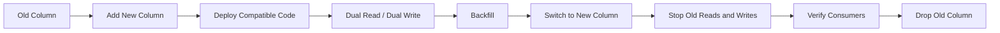
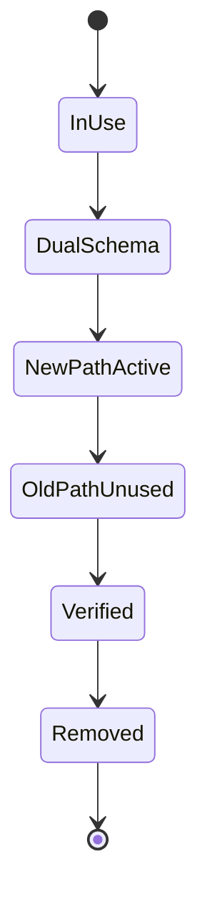

# 08- Removing Columns Safely

## Overview

Removing a database column is a destructive schema change. Unlike adding a column, removing one immediately reduces the set of structures that older application versions may depend on.

The SQL may look trivial:

```sql
ALTER TABLE customers
DROP COLUMN legacy_email;
```

The production problem is determining whether **anything still depends on `legacy_email`**.

Potential consumers include:

- Django or SQLAlchemy models
- REST and gRPC services
- Celery workers
- Kafka producers and consumers
- Reporting queries
- Admin scripts
- ETL jobs
- Redis cache builders
- Database views and functions
- Stored procedures and triggers
- Analytics pipelines
- Operational scripts
- Older application versions still running during deployment

The safest strategy is to treat column removal as the **contract phase of an expand-and-contract migration**:

```text
Identify consumers
       ↓
Stop new dependencies
       ↓
Deploy compatible application
       ↓
Remove reads
       ↓
Remove writes
       ↓
Observe
       ↓
Verify no consumers remain
       ↓
Drop column
```

The key principle is:

> **Do not remove a column because the current application no longer uses it. Remove it only after you have established that no supported consumer still depends on it.**

---

## Why Column Removal Is Different From Column Addition

Adding a column is usually additive:

```text
Existing schema
      +
New column
```

Old applications can often ignore the additional column.

Removing a column is subtractive:

```text
Existing schema
      -
Old column
```

An old application may immediately fail.

For example:

```text
Database
customers.legacy_email
        │
        ├── App v1 ──► SELECT legacy_email
        └── App v2 ──► no longer uses it
```

If the column is dropped while App v1 is still serving traffic:

```text
App v1
  ↓
SELECT legacy_email
  ↓
ERROR: column does not exist
```

This is why destructive changes should normally happen **after** application migration rather than during it.

---

## Expand-and-Contract Relationship

Column removal is normally the final phase of an earlier expansion.

For example:

```text
Before
customers.email
customers.normalized_email

Transition
customers.email
customers.normalized_email
        ↓
Application uses normalized_email

Contract
customers.normalized_email
        ↓
Remove email after all consumers migrate
```

A complete migration might therefore be:



The removal is deliberately separated from the application rollout.

---

## When Is a Column Safe to Remove?

A column is a candidate for removal when:

- The application no longer reads it.
- The application no longer writes it.
- All deployed application versions are compatible.
- All background workers are compatible.
- Scheduled jobs are compatible.
- Reporting systems no longer depend on it.
- Database objects no longer depend on it.
- Event consumers no longer require it.
- Cache builders no longer require it.
- The rollback window has passed.
- Historical data requirements have been reviewed.

A useful rule is:

> **Current source-code usage is evidence, not proof.**

Production systems often contain consumers that are not part of the main application repository.

---

## Dependency Discovery

Before removing a column, identify dependencies from multiple sources.

### Application Dependencies

Search for:

```text
legacy_email
```

across:

- Python code
- Django models
- SQL queries
- SQLAlchemy expressions
- serializers
- repository classes
- reporting code
- management commands
- tests
- scripts

For example:

```bash
rg "legacy_email" .
```

### Database Dependencies

Inspect database objects that may reference the column:

- Views
- Materialized views
- Functions
- Procedures
- Triggers
- Generated expressions
- Other database objects

PostgreSQL catalog inspection is often required for complex schemas.

Do not assume application code is the only dependency source.

---

## Database Object Dependencies

A column can be referenced by a view:

```sql
CREATE VIEW customer_directory AS
SELECT
    id,
    legacy_email
FROM customers;
```

Dropping the column can therefore invalidate dependent database objects or cause the migration to fail depending on the dependency and `DROP` behavior.

Before destructive DDL, inspect dependencies and understand whether PostgreSQL will:

- Reject the operation
- Require dependent objects to be removed
- Cascade the operation

Be extremely careful with:

```sql
DROP COLUMN ... CASCADE;
```

`CASCADE` can remove dependent database objects that were not part of the intended migration.

Never use it as a shortcut for dependency discovery.

---

## Views and Materialized Views

A view may depend directly on the column:

```sql
CREATE VIEW customer_search AS
SELECT
    id,
    email,
    legacy_email
FROM customers;
```

A materialized view can also contain data derived from the column.

Before removal:

```text
Column
  │
  ├── View
  ├── Materialized view
  ├── Function
  ├── Trigger
  └── Reporting query
```

Each dependency must be either:

- Migrated
- Rebuilt
- Removed
- Explicitly accepted as no longer required

---

## Application Rollout

Suppose the old application reads:

```python
customer.legacy_email
```

and the new application uses:

```python
customer.email
```

A safe deployment is:

```text
Phase 1
Old application + old column

Phase 2
Old application + column still exists
New application + column still exists

Phase 3
Only new application uses the new field

Phase 4
Remove old column
```

Do not combine Phase 3 and Phase 4 unless you have explicitly proven that no old consumer can exist.

---

## The Compatibility Window

During a rolling deployment:

```text
Load Balancer
     │
     ├── Pod A → v1
     ├── Pod B → v1
     ├── Pod C → v2
     └── Pod D → v2
```

If v1 references the old column:

```text
Database must still contain old column
```

The safe state is:

```text
Old App ──────┐
              ├──► Database with old + new schema
New App ──────┘
```

Only after old application versions are gone should the schema be contracted.

---

## Application Version Verification

Do not rely only on the deployment controller saying:

```text
Deployment successful
```

Verify:

- Running pod versions
- Old ReplicaSets
- Celery workers
- Scheduled jobs
- CronJobs
- Long-running consumers
- Administrative tools
- Batch processes

For Kubernetes:

```bash
kubectl get pods -o wide
kubectl get replicasets
kubectl get jobs
kubectl get cronjobs
```

The exact commands and labels depend on the deployment architecture, but the operational principle is consistent:

> **Know which versions can still execute database queries.**

---

## Removing Reads First

The safest application transition usually removes reads before the database column itself.

Example:

```text
Old:
SELECT id, legacy_email
FROM customers;
```

New:

```text
SELECT id, email
FROM customers;
```

For ORM code, ensure the old field is not implicitly included through:

- Model serialization
- `values()`
- `values_list()`
- `select_related()`
- `prefetch_related()`
- Raw SQL
- Admin interfaces
- Reporting serializers

A column can remain logically required even if no obvious business function references it.

---

## Removing Writes

A column should not be dropped while any writer still updates it.

Potential writers include:

```text
REST API
   ├── Django/FastAPI
   ├── Celery
   ├── Admin
   ├── Management command
   ├── Data importer
   └── Batch job
```

A useful migration state is:

```text
Reads:  0
Writes: 0
```

before performing the destructive DDL.

---

## Dual-Write Cleanup

Suppose the application temporarily writes:

```text
email
legacy_email
```

During migration:

```text
Write request
     │
     ├── new field
     └── old field
```

After the new field becomes authoritative:

```text
Write request
     │
     └── new field only
```

Only after observing the system should the old column be removed.

This prevents a new deployment from accidentally recreating dependencies on the old column.

---

## Detecting Remaining Writes

Application code search is necessary but not always sufficient.

Useful evidence can include:

- Database statement logs
- `pg_stat_statements`
- Audit logs
- Application telemetry
- Query logs
- Code search
- Scheduled-job inventories

For example, `pg_stat_statements` can help identify queries that still reference a particular column when the SQL text is retained.

Do not treat absence from a short observation window as absolute proof if the workload is seasonal or infrequent.

A monthly reporting job can easily escape a one-hour verification period.

---

## Django Model Cleanup

Suppose the model originally contains:

```python
class Customer(models.Model):
    email = models.EmailField()
    legacy_email = models.EmailField(null=True)
```

After all application code stops using `legacy_email`, remove the field from the Django model.

The migration generated afterward may contain:

```python
migrations.RemoveField(
    model_name="customer",
    name="legacy_email",
)
```

Do not deploy the removal migration before all running application versions have stopped referencing the field.

A safer sequence is:

```text
Deploy application that stops using field
        ↓
Verify deployment and workers
        ↓
Observe
        ↓
Deploy RemoveField migration
```

---

## Django Migration Review

Inspect the generated migration:

```bash
python manage.py sqlmigrate customers 0015
```

Review:

- Exact `ALTER TABLE`
- Dependencies
- Potential locks
- Table size
- Deployment ordering
- Rollback implications

Also inspect:

```bash
python manage.py migrate --plan
```

Do not treat autogenerated migrations as automatically production-safe.

---

## FastAPI and Alembic

With SQLAlchemy/Alembic, a removal migration might contain:

```python
op.drop_column("customers", "legacy_email")
```

Before applying it, verify that:

- All application instances use the new schema.
- All workers are compatible.
- No reporting jobs depend on the field.
- Database dependencies have been handled.
- Rollback expectations are understood.

Autogeneration can detect a removed ORM field, but it cannot determine whether production consumers have migrated.

---

## Database-Level Dependency Checks

PostgreSQL catalogs can help investigate dependencies.

For example, inspect views:

```sql
SELECT
    schemaname,
    viewname,
    definition
FROM pg_views
WHERE definition ILIKE '%legacy_email%';
```

For materialized views:

```sql
SELECT
    schemaname,
    matviewname,
    definition
FROM pg_matviews
WHERE definition ILIKE '%legacy_email%';
```

These searches are useful but should not be treated as a complete dependency engine.

SQL definitions can be indirect, dynamically generated, or hidden behind functions.

Use PostgreSQL dependency metadata and explicit schema review for important production changes.

---

## Indexes and Constraints

Removing a column may also remove associated database structures.

Examples:

```text
Column
 ├── Index
 ├── Unique constraint
 ├── Check constraint
 ├── Foreign key
 └── Generated expression
```

Before dropping the column, determine which structures depend on it.

Inspect indexes:

```sql
SELECT
    indexname,
    indexdef
FROM pg_indexes
WHERE tablename = 'customers';
```

Do not blindly remove every index that looks related. Some indexes may contain multiple columns and remain useful after the old column is removed only if the database permits the operation through an appropriate migration.

---

## Composite Indexes

Suppose:

```sql
CREATE INDEX customers_legacy_status_idx
ON customers (legacy_email, status);
```

Dropping `legacy_email` affects the index.

The migration must account for dependent indexes and determine whether the replacement index is required.

For example:

```text
Old:
(legacy_email, status)

New:
(status)
```

The replacement should be designed around actual query patterns, not mechanically copied from the old structure.

---

## Constraints

A column may participate in:

```sql
CHECK
UNIQUE
FOREIGN KEY
PRIMARY KEY
```

or other constraints.

Do not assume:

```text
No application usage
=
No database dependency
```

Database-enforced invariants can outlive application code.

Before removing the column, determine whether the associated constraint is still logically required or should be replaced with a constraint on another representation.

---

## Generated Columns and Expressions

A column may participate in generated expressions or indexes.

For example:

```sql
CREATE INDEX customers_email_lower_idx
ON customers (lower(email));
```

If the removed column is involved in an expression index, that dependency must be handled before the column is dropped.

Expression-based dependencies are easy to miss during application-only code reviews.

---

## Triggers and Functions

A trigger may reference the old column:

```sql
CREATE TRIGGER customer_audit_trigger
AFTER UPDATE ON customers
FOR EACH ROW
EXECUTE FUNCTION audit_customer_update();
```

The trigger function may reference:

```text
OLD.legacy_email
NEW.legacy_email
```

Removing the column without reviewing the trigger function can break writes or migration execution.

Database-side code deserves the same review level as application code.

---

## API and Serialization Contracts

A database column may indirectly appear in an API response.

For example:

```json
{
  "id": 123,
  "email": "user@example.com",
  "legacy_email": "old@example.com"
}
```

Removing the database field can therefore change:

- REST responses
- gRPC messages
- OpenAPI schemas
- Internal service contracts
- Event payloads

Before removing the database column, verify whether the field is still exposed externally.

Database cleanup should not accidentally become an API breaking change.

---

## Kafka and Event Consumers

If the old column is used to produce events:

```text
PostgreSQL
    ↓
Application
    ↓
Kafka event
    ↓
Consumer
```

removing the column can break event production even if normal API traffic no longer uses it.

Review:

- Kafka producers
- Consumers
- Event replay jobs
- Dead-letter processing
- Historical event processing

Old events can remain in Kafka or other durable systems long after the application changes.

Consumers that replay historical events may still expect the old representation.

---

## Celery and Background Jobs

Celery tasks may survive application deployments.

```text
Task queued
   ↓
Application deployment
   ↓
New worker executes old task
```

Check:

- Queued tasks
- Retry queues
- Scheduled tasks
- Long-running tasks
- Task payload versions

Do not remove a column solely because the currently deployed API code no longer uses it.

Background processing is part of the production dependency graph.

---

## Redis and Cached Data

Redis can contain data derived from the old column.

For example:

```json
{
  "customer_id": 123,
  "legacy_email": "old@example.com"
}
```

Removing the database column does not remove cached state.

Determine whether:

- Cached values need migration
- Keys need invalidation
- Cache schemas need versioning
- Cache rebuilders still expect the column

A safe migration may require:

```text
Stop producing old cache format
        ↓
Expire / invalidate old keys
        ↓
Verify new format
        ↓
Remove database column
```

---

## Reporting and Analytics

Reporting systems are frequent hidden consumers.

Examples:

- BI dashboards
- Scheduled SQL reports
- ETL jobs
- Data exports
- Read replicas
- Data warehouses
- AWS analytics pipelines

A production application can be completely migrated while an analyst's scheduled report still executes:

```sql
SELECT legacy_email
FROM customers;
```

Inventory reporting dependencies before destructive schema changes.

---

## Read Replicas

Read replicas generally receive the schema change through replication.

The important concern is not usually whether replicas understand the DDL, but whether:

- Replica lag delays the change
- Reporting queries depend on the removed column
- Failover can promote a replica at an unexpected point in the migration
- Read routing changes during deployment

For example:

```text
Primary
  │
  ├── Application
  │
  └── Replica
        └── Reporting
```

If reporting still depends on the old column, removing it from the primary will eventually make the same schema unavailable to the replica.

---

## Failover During Removal

Consider:

```text
1. Application migration complete
2. Column removal starts
3. Primary fails
4. Replica is promoted
5. Application reconnects
```

The migration must remain understandable and recoverable across this sequence.

For destructive migrations:

- Know whether the DDL committed.
- Make the migration execution idempotent where practical.
- Know the promoted database state.
- Ensure application code is compatible with the resulting schema.
- Avoid ambiguous operational state.

Do not assume a failover automatically makes migration state obvious.

---

## Transaction Behavior

A simple:

```sql
ALTER TABLE customers
DROP COLUMN legacy_email;
```

may execute quickly, but it still requires appropriate locks.

The exact lock behavior and duration depend on the operation and concurrent workload.

Before production execution, consider:

```sql
SET lock_timeout = '3s';
SET statement_timeout = '5min';
```

A short lock timeout can prevent a migration from waiting indefinitely behind an unexpected transaction.

If the operation fails because it cannot acquire the required lock, investigate the blocker rather than repeatedly increasing the timeout.

---

## Long-Running Transactions

Long-running transactions can delay schema changes.

Inspect:

```sql
SELECT
    pid,
    usename,
    state,
    xact_start,
    query_start,
    wait_event_type,
    wait_event,
    query
FROM pg_stat_activity
WHERE xact_start IS NOT NULL
ORDER BY xact_start;
```

Pay particular attention to:

```text
idle in transaction
```

and unusually old transactions.

These can turn a simple DDL operation into a deployment incident.

---

## Large Tables

Dropping a column is not necessarily equivalent to physically shrinking the table immediately.

Removing a column does not automatically mean:

```text
Table becomes proportionally smaller on disk
```

Physical storage behavior, tuple layout, table rewrites, and future vacuum activity depend on the PostgreSQL operation and version.

If the goal is specifically to reclaim substantial disk space, analyze storage behavior separately.

Do not confuse:

```text
Logical schema cleanup
```

with:

```text
Immediate physical storage reclamation
```

---

## Table Bloat and Storage

If the motivation is:

> "We need disk space, so let's drop this column."

first determine whether the column removal actually provides the desired storage benefit.

Other strategies may involve:

- Table rewrites
- `VACUUM`
- `VACUUM FULL`
- Table replacement
- Partition lifecycle management
- Archival

Some of these can be highly disruptive.

A zero-downtime schema cleanup should not accidentally become a zero-availability storage-reclamation operation.

---

## Performance Considerations

Removing an unused column can eventually simplify:

- Table definitions
- ORM models
- API contracts
- Serialization
- Data maintenance
- Schema understanding

However, the removal itself may have little immediate query-performance benefit.

Do not remove a column purely because:

```text
"Fewer columns must always mean faster queries."
```

The real benefit is usually:

- Reduced schema complexity
- Reduced accidental usage
- Cleaner contracts
- Lower maintenance burden
- Removal of obsolete data

Performance gains should be measured rather than assumed.

---

## Security Considerations

Removing obsolete sensitive data can reduce the long-term security surface.

For example:

```text
legacy_sensitive_field
        ↓
No longer required
        ↓
Remove from database
```

Benefits may include:

- Less sensitive data stored
- Fewer access paths
- Smaller backup exposure
- Simpler auditing
- Reduced accidental API exposure

However, verify retention and compliance requirements before deletion.

A field that is obsolete to the application may still be required for:

- Legal retention
- Audit requirements
- Financial records
- Security investigations

Schema cleanup is not automatically equivalent to data-retention approval.

---

## Backup and Recovery

Column removal is destructive.

Before removing important data, verify:

- Recent backups
- WAL/PITR availability
- Recovery procedures
- Recovery point requirements
- Restore testing

If the column is dropped accidentally, recovery may require restoring to a point before the change or extracting the data from another copy.

A database replica is not a historical backup.

Once the destructive DDL propagates, replicas generally contain the same logical deletion.

---

## Rollback Limitations

Consider:

```text
Deploy v2
   ↓
Stop using old column
   ↓
Drop old column
   ↓
Incident discovered
   ↓
Rollback v2
```

The old application may now fail because the old column no longer exists.

This is why:

> **Destructive schema changes should generally occur after the application rollback window.**

If rollback is still required, keep the old column.

---

## Delayed Cleanup

A common production strategy is to intentionally leave the old column for some time.

For example:

```text
Day 1
Stop application usage

Day 2
Verify metrics and logs

Day 3
Verify workers and scheduled jobs

Day 7
Verify reporting and operational jobs

Later
Drop column
```

The exact delay depends on the system.

The purpose is not arbitrary waiting. It creates an observation window for low-frequency dependencies.

---

## Feature Flags

If the old column is associated with a feature, remove the feature dependency before removing the schema.

```text
Feature enabled
      ↓
Migrate behavior
      ↓
Feature disabled
      ↓
Remove old reads/writes
      ↓
Observe
      ↓
Drop column
```

Feature flags can also provide a controlled way to switch back to old behavior while the column still exists.

Once the column is removed, the rollback options become narrower.

---

## Migration State Machine

A useful mental model is:



Do not skip directly from:

```text
InUse → Removed
```

unless the system is simple enough that dependency and compatibility risk are genuinely understood.

---

## Production Removal Workflow

### Discovery

1. Identify every application consumer.
2. Search source code.
3. Review ORM models and raw SQL.
4. Review database views and functions.
5. Review triggers and constraints.
6. Review background jobs.
7. Review Kafka producers and consumers.
8. Review Redis/cache dependencies.
9. Review reporting and analytics.
10. Review operational scripts.

### Application Migration

1. Remove reads.
2. Remove writes.
3. Remove dual-write behavior.
4. Remove dual-read fallback.
5. Deploy compatible application versions.
6. Deploy compatible workers.
7. Verify all consumers.

### Observation

Monitor:

- Error rate
- Query failures
- Database logs
- Application logs
- Worker failures
- Kafka consumer errors
- Reporting failures
- Database statement activity

### Contract

Only after validation:

```sql
ALTER TABLE customers
DROP COLUMN legacy_email;
```

### Post-Removal

Verify:

- Migration succeeded
- Application remains healthy
- Workers remain healthy
- Replicas remain healthy
- No dependency errors appear
- API behavior remains correct
- Monitoring remains clean

---

## Production Checklist

### Dependency Analysis

- [ ] Application reads removed
- [ ] Application writes removed
- [ ] Django/SQLAlchemy models updated
- [ ] Raw SQL reviewed
- [ ] Views reviewed
- [ ] Materialized views reviewed
- [ ] Functions/procedures reviewed
- [ ] Triggers reviewed
- [ ] Indexes reviewed
- [ ] Constraints reviewed
- [ ] Reporting queries reviewed
- [ ] ETL jobs reviewed
- [ ] Celery jobs reviewed
- [ ] Kafka consumers/producers reviewed
- [ ] Redis/cache dependencies reviewed

### Deployment

- [ ] New application version deployed
- [ ] Old application versions removed
- [ ] Old worker versions removed
- [ ] Scheduled jobs reviewed
- [ ] Feature flags updated
- [ ] Rollback window considered

### Database

- [ ] Lock behavior reviewed
- [ ] Table size reviewed
- [ ] Long-running transactions checked
- [ ] `lock_timeout` considered
- [ ] `statement_timeout` considered
- [ ] Replica health checked
- [ ] Backup/PITR readiness verified

### Removal

- [ ] Final dependency check completed
- [ ] Migration reviewed
- [ ] Destructive operation approved
- [ ] Migration executed through controlled infrastructure
- [ ] Post-migration health verified

---

## Common Mistakes and Pitfalls

### Dropping the Column Immediately After Deploying New Code

**Problem:** Old pods or workers may still execute the previous code.

**Better:** Wait until all old consumers have been removed and verified.

### Searching Only the Main Repository

**Problem:** Reporting jobs, scripts, workers, or other services may live elsewhere.

**Better:** Build a complete dependency inventory.

### Using `DROP ... CASCADE` to "Make the Migration Work"

**Problem:** Cascading deletion can remove database objects that were not intended to be removed.

**Better:** Discover and explicitly manage dependencies.

### Assuming ORM Usage Is the Whole Dependency Graph

**Problem:** Raw SQL, views, functions, jobs, and reporting tools can bypass the ORM.

**Better:** Review application, database, and operational consumers.

### Ignoring Celery

**Problem:** Queued or scheduled tasks can execute old code after the main deployment.

**Better:** Include workers and task queues in the compatibility plan.

### Ignoring Kafka Replay

**Problem:** Consumers can replay historical events and depend on old representations.

**Better:** Review event compatibility and replay workflows.

### Assuming No Recent Queries Means No Consumer Exists

**Problem:** Low-frequency jobs may execute weekly or monthly.

**Better:** Use an observation window appropriate to the workload.

### Treating a Replica as a Backup

**Problem:** Schema deletion propagates to replicas.

**Better:** Maintain independent backups and PITR.

### Removing the Column Before the Rollback Window

**Problem:** Rolling back the application can reintroduce code that expects the deleted column.

**Better:** Contract only after rollback is no longer required.

### Expecting Immediate Disk Reclamation

**Problem:** Logical column removal does not necessarily shrink the physical table proportionally.

**Better:** Treat storage reclamation as a separate operational problem.

### Removing Data Without Checking Retention Requirements

**Problem:** Application-level obsolescence does not override legal, audit, or business retention requirements.

**Better:** Verify retention requirements before destructive deletion.

---

## Interview Traps

### "Why is dropping a column more dangerous than adding one?"

Adding a column is usually backward-compatible because old applications can ignore it. Dropping a column can immediately break older application versions that still reference it.

### "Why can't you drop a column as part of the same deployment that stops using it?"

Because rolling deployments mean old application instances, workers, or jobs may still be executing the previous code.

### "What is the expand-and-contract pattern?"

Expand the schema first, migrate application behavior, validate that old consumers are gone, and contract the schema only afterward.

### "Is searching the application repository enough?"

No. Database objects, workers, reporting systems, scripts, caches, event consumers, and external services can all be consumers.

### "Why is `DROP COLUMN ... CASCADE` dangerous?"

Because PostgreSQL may remove dependent objects automatically. It can hide the actual dependency graph and cause unintended schema destruction.

### "Can you roll back a column drop?"

Not through a simple application rollback. The deleted data may need to be recovered from backup/PITR, and the old application may no longer be compatible with the schema.

### "Does dropping a column necessarily reduce table size?"

No. Logical schema removal and physical storage reclamation are different concerns.

### "When should a destructive migration run?"

After application and worker compatibility has been established, remaining dependencies have been eliminated, the rollback window has passed, and recovery capability has been verified.

---

## Senior-Level Decision Framework

Before approving a column removal, evaluate five dimensions:

| Dimension | Question |
|---|---|
| Dependency | Who still reads or writes this column? |
| Compatibility | Can any old application or worker version still run? |
| Database | What objects, indexes, constraints, or functions depend on it? |
| Recovery | How would the data be recovered if removal were wrong? |
| Operations | What lock, replication, deployment, and monitoring impact exists? |

A strong production decision looks like:

```text
No application dependency
        +
No worker dependency
        +
No database-object dependency
        +
No reporting dependency
        +
No event/cache dependency
        +
Rollback window expired
        +
Recovery verified
        ↓
Safe candidate for removal
```

If any of these conditions is uncertain, delay the destructive operation.

---

## Key Takeaways

- **Column removal is the contract phase of schema evolution:** stop reads and writes first, verify consumers, then remove the column.
- **Production dependency discovery must extend beyond application code:** inspect workers, database objects, reporting, Kafka, Redis, scripts, and low-frequency jobs.
- **Destructive changes reduce rollback options:** keep the old column until rolling deployments and the application rollback window have safely passed.
- **`DROP COLUMN` is a database operation with operational consequences:** evaluate locks, long-running transactions, replicas, backups, and recovery before execution.
- **Logical cleanup and physical storage reclamation are different goals:** removing a column does not automatically mean the table immediately becomes smaller on disk.